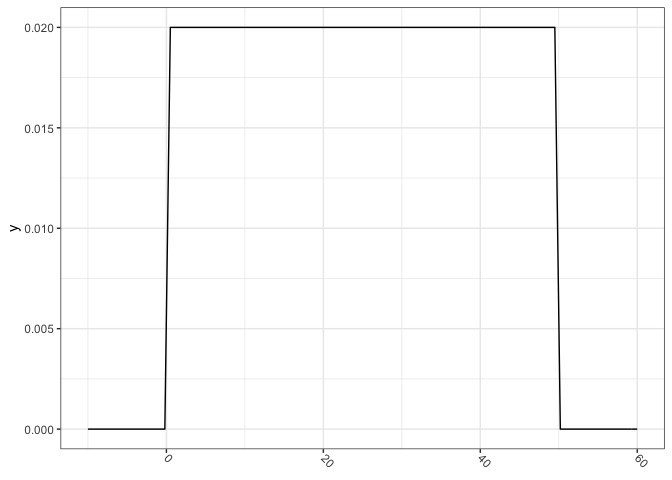
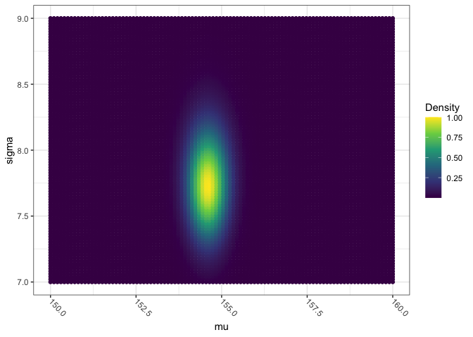
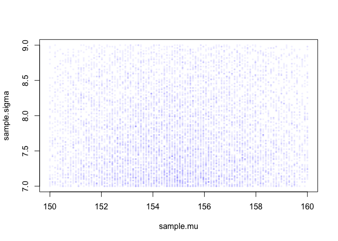
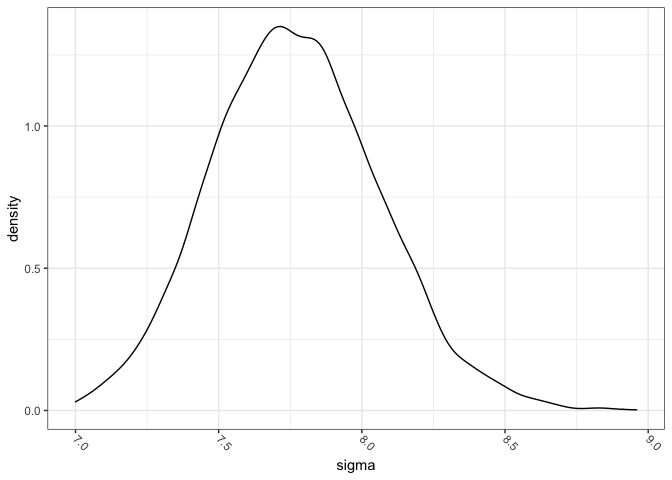
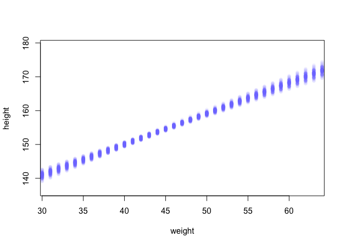

Rethinking Chapter4
================

``` r
library(rethinking)
```

    ## Loading required package: rstan

    ## Loading required package: StanHeaders

    ## Loading required package: ggplot2

    ## rstan (Version 2.21.2, GitRev: 2e1f913d3ca3)

    ## For execution on a local, multicore CPU with excess RAM we recommend calling
    ## options(mc.cores = parallel::detectCores()).
    ## To avoid recompilation of unchanged Stan programs, we recommend calling
    ## rstan_options(auto_write = TRUE)

    ## Loading required package: parallel

    ## rethinking (Version 2.13)

    ## 
    ## Attaching package: 'rethinking'

    ## The following object is masked from 'package:stats':
    ## 
    ##     rstudent

``` r
library(tidyverse)
```

    ## ── Attaching packages ─────────────────────────────────────── tidyverse 1.3.1 ──

    ## ✓ tibble  3.1.3     ✓ dplyr   1.0.7
    ## ✓ tidyr   1.1.3     ✓ stringr 1.4.0
    ## ✓ readr   2.0.1     ✓ forcats 0.5.1
    ## ✓ purrr   0.3.4

    ## ── Conflicts ────────────────────────────────────────── tidyverse_conflicts() ──
    ## x tidyr::extract() masks rstan::extract()
    ## x dplyr::filter()  masks stats::filter()
    ## x dplyr::lag()     masks stats::lag()
    ## x purrr::map()     masks rethinking::map()

``` r
library(ggthemes)
```

``` r
theme_set(theme_bw())
theme_update(axis.text.x = element_text(
angle = -45,
hjust = 0,
vjust = 0.5
))
```

``` r
set.seed(42)

data(Howell1)
d <- Howell1

str(d)
```

    ## 'data.frame':    544 obs. of  4 variables:
    ##  $ height: num  152 140 137 157 145 ...
    ##  $ weight: num  47.8 36.5 31.9 53 41.3 ...
    ##  $ age   : num  63 63 65 41 51 35 32 27 19 54 ...
    ##  $ male  : int  1 0 0 1 0 1 0 1 0 1 ...

``` r
precis(d)
```

    ##               mean         sd      5.5%     94.5%     histogram
    ## height 138.2635963 27.6024476 81.108550 165.73500 ▁▁▁▁▁▁▁▂▁▇▇▅▁
    ## weight  35.6106176 14.7191782  9.360721  54.50289 ▁▂▃▂▂▂▂▅▇▇▃▂▁
    ## age     29.3443934 20.7468882  1.000000  66.13500     ▇▅▅▃▅▂▂▁▁
    ## male     0.4724265  0.4996986  0.000000   1.00000    ▇▁▁▁▁▁▁▁▁▇

``` r
san_table <- tibble(d)

glimpse(san_table)
```

    ## Rows: 544
    ## Columns: 4
    ## $ height <dbl> 151.7650, 139.7000, 136.5250, 156.8450, 145.4150, 163.8300, 149…
    ## $ weight <dbl> 47.82561, 36.48581, 31.86484, 53.04191, 41.27687, 62.99259, 38.…
    ## $ age    <dbl> 63.0, 63.0, 65.0, 41.0, 51.0, 35.0, 32.0, 27.0, 19.0, 54.0, 47.…
    ## $ male   <int> 1, 0, 0, 1, 0, 1, 0, 1, 0, 1, 0, 1, 0, 0, 0, 1, 1, 0, 1, 0, 0, …

``` r
d$height
```

    ##   [1] 151.7650 139.7000 136.5250 156.8450 145.4150 163.8300 149.2250 168.9100
    ##   [9] 147.9550 165.1000 154.3050 151.1300 144.7800 149.9000 150.4950 163.1950
    ##  [17] 157.4800 143.9418 121.9200 105.4100  86.3600 161.2900 156.2100 129.5400
    ##  [25] 109.2200 146.4000 148.5900 147.3200 137.1600 125.7300 114.3000 147.9550
    ##  [33] 161.9250 146.0500 146.0500 152.7048 142.8750 142.8750 147.9550 160.6550
    ##  [41] 151.7650 162.8648 171.4500 147.3200 147.9550 144.7800 121.9200 128.9050
    ##  [49]  97.7900 154.3050 143.5100 146.7000 157.4800 127.0000 110.4900  97.7900
    ##  [57] 165.7350 152.4000 141.6050 158.8000 155.5750 164.4650 151.7650 161.2900
    ##  [65] 154.3050 145.4150 145.4150 152.4000 163.8300 144.1450 129.5400 129.5400
    ##  [73] 153.6700 142.8750 146.0500 167.0050 158.4198  91.4400 165.7350 149.8600
    ##  [81] 147.9550 137.7950 154.9400 160.9598 161.9250 147.9550 113.6650 159.3850
    ##  [89] 148.5900 136.5250 158.1150 144.7800 156.8450 179.0700 118.7450 170.1800
    ##  [97] 146.0500 147.3200 113.0300 162.5600 133.9850 152.4000 160.0200 149.8600
    ## [105] 142.8750 167.0050 159.3850 154.9400 148.5900 111.1250 111.7600 162.5600
    ## [113] 152.4000 124.4600 111.7600  86.3600 170.1800 146.0500 159.3850 151.1300
    ## [121] 160.6550 169.5450 158.7500  74.2950 149.8600 153.0350  96.5200 161.9250
    ## [129] 162.5600 149.2250 116.8400 100.0760 163.1950 161.9250 145.4150 163.1950
    ## [137] 151.1300 150.4950 141.6050 170.8150  91.4400 157.4800 152.4000 149.2250
    ## [145] 129.5400 147.3200 145.4150 121.9200 113.6650 157.4800 154.3050 120.6500
    ## [153] 115.6000 167.0050 142.8750 152.4000  96.5200 160.0000 159.3850 149.8600
    ## [161] 160.6550 160.6550 149.2250 125.0950 140.9700 154.9400 141.6050 160.0200
    ## [169] 150.1648 155.5750 103.5050  94.6150 156.2100 153.0350 167.0050 149.8600
    ## [177] 147.9550 159.3850 161.9250 155.5750 159.3850 146.6850 172.7200 166.3700
    ## [185] 141.6050 142.8750 133.3500 127.6350 119.3800 151.7650 156.8450 148.5900
    ## [193] 157.4800 149.8600 147.9550 102.2350 153.0350 160.6550 149.2250 114.3000
    ## [201] 100.9650 138.4300  91.4400 162.5600 149.2250 158.7500 149.8600 158.1150
    ## [209] 156.2100 148.5900 143.5100 154.3050 131.4450 157.4800 157.4800 154.3050
    ## [217] 107.9500 168.2750 145.4150 147.9550 100.9650 113.0300 149.2250 154.9400
    ## [225] 162.5600 156.8450 123.1900 161.0106 144.7800 143.5100 149.2250 110.4900
    ## [233] 149.8600 165.7350 144.1450 157.4800 154.3050 163.8300 156.2100 153.6700
    ## [241] 134.6200 144.1450 114.3000 162.5600 146.0500 120.6500 154.9400 144.7800
    ## [249] 106.6800 146.6850 152.4000 163.8300 165.7350 156.2100 152.4000 140.3350
    ## [257] 158.1150 163.1950 151.1300 171.1198 149.8600 163.8300 141.6050  93.9800
    ## [265] 149.2250 105.4100 146.0500 161.2900 162.5600 145.4150 145.4150 170.8150
    ## [273] 127.0000 159.3850 159.4000 153.6700 160.0200 150.4950 149.2250 127.0000
    ## [281] 142.8750 142.1130 147.3200 162.5600 164.4650 160.0200 153.6700 167.0050
    ## [289] 151.1300 147.9550 125.3998 111.1250 153.0350 139.0650 152.4000 154.9400
    ## [297] 147.9550 143.5100 117.9830 144.1450  92.7100 147.9550 155.5750 150.4950
    ## [305] 155.5750 154.3050 130.6068 101.6000 157.4800 168.9100 150.4950 111.7600
    ## [313] 160.0200 167.6400 144.1450 145.4150 160.0200 147.3200 164.4650 153.0350
    ## [321] 149.2250 160.0200 149.2250  85.0900  84.4550  59.6138  92.7100 111.1250
    ## [329]  90.8050 153.6700  99.6950  62.4840  81.9150  96.5200  80.0100 150.4950
    ## [337] 151.7650 140.6398  88.2650 158.1150 149.2250 151.7650 154.9400 123.8250
    ## [345] 104.1400 161.2900 148.5900  97.1550  93.3450 160.6550 157.4800 167.0050
    ## [353] 157.4800  91.4400  60.4520 137.1600 152.4000 152.4000  81.2800 109.2200
    ## [361]  71.1200  89.2048  67.3100  85.0900  69.8500 161.9250 152.4000  88.9000
    ## [369]  90.1700  71.7550  83.8200 159.3850 142.2400 142.2400 168.9100 123.1900
    ## [377]  74.9300  74.2950  90.8050 160.0200  67.9450 135.8900 158.1150  85.0900
    ## [385]  93.3450 152.4000 155.5750 154.3050 156.8450 120.0150 114.3000  83.8200
    ## [393] 156.2100 137.1600 114.3000  93.9800 168.2750 147.9550 139.7000 157.4800
    ## [401]  76.2000  66.0400 160.7000 114.3000 146.0500 161.2900  69.8500 133.9850
    ## [409]  67.9450 150.4950 163.1950 148.5900 148.5900 161.9250 153.6700  68.5800
    ## [417] 151.1300 163.8300 153.0350 151.7650 132.0800 156.2100 140.3350 158.7500
    ## [425] 142.8750  84.4550 151.9428 161.2900 127.9906 160.9852 144.7800 132.0800
    ## [433] 117.9830 160.0200 154.9400 160.9852 165.9890 157.9880 154.9400  97.9932
    ## [441]  64.1350 160.6550 147.3200 146.7000 147.3200 172.9994 158.1150 147.3200
    ## [449] 124.9934 106.0450 165.9890 149.8600  76.2000 161.9250 140.0048  66.6750
    ## [457]  62.8650 163.8300 147.9550 160.0200 154.9400 152.4000  62.2300 146.0500
    ## [465] 151.9936 157.4800  55.8800  60.9600 151.7650 144.7800 118.1100  78.1050
    ## [473] 160.6550 151.1300 121.9200  92.7100 153.6700 147.3200 139.7000 157.4800
    ## [481]  91.4400 154.9400 143.5100  83.1850 158.1150 147.3200 123.8250  88.9000
    ## [489] 160.0200 137.1600 165.1000 154.9400 111.1250 153.6700 145.4150 141.6050
    ## [497] 144.7800 163.8300 161.2900 154.9000 161.3000 170.1800 149.8600 123.8250
    ## [505]  85.0900 160.6550 154.9400 106.0450 126.3650 166.3700 148.2852 124.4600
    ## [513]  89.5350 101.6000 151.7650 148.5900 153.6700  53.9750 146.6850  56.5150
    ## [521] 100.9650 121.9200  81.5848 154.9400 156.2100 132.7150 125.0950 101.6000
    ## [529] 160.6550 146.0500 132.7150  87.6300 156.2100 152.4000 162.5600 114.9350
    ## [537]  67.9450 142.8750  76.8350 145.4150 162.5600 156.2100  71.1200 158.7500

``` r
d2 <- d[d$age >= 18,]
```

``` r
adult_table <- san_table %>%
  filter(age >= 18)

glimpse(adult_table)
```

    ## Rows: 352
    ## Columns: 4
    ## $ height <dbl> 151.7650, 139.7000, 136.5250, 156.8450, 145.4150, 163.8300, 149…
    ## $ weight <dbl> 47.82561, 36.48581, 31.86484, 53.04191, 41.27687, 62.99259, 38.…
    ## $ age    <dbl> 63.0, 63.0, 65.0, 41.0, 51.0, 35.0, 32.0, 27.0, 19.0, 54.0, 47.…
    ## $ male   <int> 1, 0, 0, 1, 0, 1, 0, 1, 0, 1, 0, 1, 0, 0, 0, 1, 1, 0, 1, 0, 1, …

``` r
curve(dnorm(x, 178, 20), from = 100, to = 250)
```

<!-- -->

``` r
curve(dunif(x, 0, 50), from = -10, to = 60)
```

<!-- -->

``` r
ggplot() +
  xlim(c(100, 250)) +
  geom_function(fun = dnorm, 
                args = list(mean = 178, sd = 20))
```

<!-- -->

``` r
ggplot() +
  xlim(c(-10, 60)) +
  geom_function(fun = dunif, 
                args = list(min = 0, max = 50))
```

<!-- -->

``` r
sample_mu <- rnorm(1e4, 178, 20)
sample_sigma <- runif(1e4, 0, 50)
prior_h <- rnorm(1e4, sample_mu, sample_sigma)
dens(prior_h)
```

<!-- -->

``` r
prior_sim <- tibble(mu = rnorm(1e4, 178, 20),
                    sigma = runif(1e4, 0, 50)) %>%
  mutate(height = rnorm(1e4, mean = mu, sd = sigma))

glimpse(prior_sim)
```

    ## Rows: 10,000
    ## Columns: 3
    ## $ mu     <dbl> 171.2995, 161.6801, 175.8496, 155.4161, 190.1187, 174.9080, 182…
    ## $ sigma  <dbl> 9.0220608, 29.0096656, 47.8382797, 43.1759471, 40.5255521, 38.6…
    ## $ height <dbl> 173.68239, 130.79784, 204.42249, 171.37970, 197.68366, 138.6760…

``` r
prior_sim %>%
  ggplot(aes(x = height)) +
  geom_density() +
  geom_vline(xintercept = c(0, 272),
             linetype = "longdash",
             color = "darkred")
```

<!-- -->

``` r
sample_mu <- rnorm(1e4, 178, 100)
prior_h <- rnorm(1e4, sample_mu, sample_sigma)
dens(prior_h)
```

<!-- -->

``` r
prior_sim <- tibble(mu = rnorm(1e4, 178, 20),
                    sigma = runif(1e4, 0, 100)) %>%
  mutate(height = rnorm(1e4, mean = mu, sd = sigma))

prior_sim %>%
  ggplot(aes(x = height)) +
  geom_density() +
  geom_vline(xintercept = c(0, 272),
             linetype = "longdash",
             color = "darkred")
```

<!-- -->

``` r
mu.list <- seq(from = 150, to = 160, length.out = 100)
sigma.list <- seq(from = 7, to = 9, length.out = 100)
post <- expand.grid(mu = mu.list, sigma = sigma.list)

post$LL <- sapply(1:nrow(post), function(i) sum(dnorm(d2$height, post$mu[i], post$sigma[i]), log = TRUE))

post$prod <- post$LL + dnorm(post$mu, 178, 20, TRUE) + dunif(post$sigma, 0, 50, TRUE)

post$prob <- exp(post$prod - max(post$prod))

post
```

    ##             mu    sigma       LL     prod       prob
    ## 1     150.0000 7.000000 13.17080 4.364106 0.31333645
    ## 2     150.1010 7.000000 13.21152 4.411879 0.32866903
    ## 3     150.2020 7.000000 13.25131 4.458708 0.34442621
    ## 4     150.3030 7.000000 13.29018 4.504585 0.36059569
    ## 5     150.4040 7.000000 13.32812 4.549506 0.37716315
    ## 6     150.5051 7.000000 13.36512 4.593464 0.39411224
    ## 7     150.6061 7.000000 13.40118 4.636454 0.41142452
    ## 8     150.7071 7.000000 13.43629 4.678470 0.42907947
    ## 9     150.8081 7.000000 13.47045 4.719508 0.44705446
    ## 10    150.9091 7.000000 13.50365 4.759564 0.46532477
    ## 11    151.0101 7.000000 13.53589 4.798631 0.48386358
    ## 12    151.1111 7.000000 13.56717 4.836706 0.50264205
    ## 13    151.2121 7.000000 13.59747 4.873785 0.52162930
    ## 14    151.3131 7.000000 13.62679 4.909864 0.54079251
    ## 15    151.4141 7.000000 13.65514 4.944938 0.56009696
    ## 16    151.5152 7.000000 13.68251 4.979004 0.57950615
    ## 17    151.6162 7.000000 13.70889 5.012059 0.59898185
    ## 18    151.7172 7.000000 13.73428 5.044100 0.61848426
    ## 19    151.8182 7.000000 13.75868 5.075123 0.63797207
    ## 20    151.9192 7.000000 13.78208 5.105125 0.65740266
    ## 21    152.0202 7.000000 13.80448 5.134104 0.67673222
    ## 22    152.1212 7.000000 13.82589 5.162057 0.69591590
    ## 23    152.2222 7.000000 13.84629 5.188982 0.71490799
    ## 24    152.3232 7.000000 13.86569 5.214877 0.73366211
    ## 25    152.4242 7.000000 13.88408 5.239739 0.75213140
    ## 26    152.5253 7.000000 13.90146 5.263567 0.77026869
    ## 27    152.6263 7.000000 13.91784 5.286360 0.78802674
    ## 28    152.7273 7.000000 13.93320 5.308115 0.80535843
    ## 29    152.8283 7.000000 13.94755 5.328832 0.82221698
    ## 30    152.9293 7.000000 13.96088 5.348510 0.83855617
    ## 31    153.0303 7.000000 13.97320 5.367146 0.85433057
    ## 32    153.1313 7.000000 13.98450 5.384741 0.86949572
    ## 33    153.2323 7.000000 13.99479 5.401295 0.88400839
    ## 34    153.3333 7.000000 14.00405 5.416805 0.89782677
    ## 35    153.4343 7.000000 14.01231 5.431273 0.91091069
    ## 36    153.5354 7.000000 14.01954 5.444698 0.92322181
    ## 37    153.6364 7.000000 14.02576 5.457079 0.93472385
    ## 38    153.7374 7.000000 14.03096 5.468418 0.94538272
    ## 39    153.8384 7.000000 14.03514 5.478714 0.95516673
    ## 40    153.9394 7.000000 14.03830 5.487968 0.96404678
    ## 41    154.0404 7.000000 14.04045 5.496180 0.97199645
    ## 42    154.1414 7.000000 14.04159 5.503352 0.97899217
    ## 43    154.2424 7.000000 14.04171 5.509483 0.98501336
    ## 44    154.3434 7.000000 14.04081 5.514576 0.99004249
    ## 45    154.4444 7.000000 14.03890 5.518631 0.99406519
    ## 46    154.5455 7.000000 14.03599 5.521649 0.99707036
    ## 47    154.6465 7.000000 14.03206 5.523633 0.99905013
    ## 48    154.7475 7.000000 14.02713 5.524583 1.00000000
    ## 49    154.8485 7.000000 14.02119 5.524502 0.99991877
    ## 50    154.9495 7.000000 14.01424 5.523391 0.99880860
    ## 51    155.0505 7.000000 14.00630 5.521253 0.99667493
    ## 52    155.1515 7.000000 13.99735 5.518089 0.99352649
    ## 53    155.2525 7.000000 13.98741 5.513902 0.98937523
    ## 54    155.3535 7.000000 13.97647 5.508694 0.98423622
    ## 55    155.4545 7.000000 13.96453 5.502468 0.97812759
    ## 56    155.5556 7.000000 13.95161 5.495227 0.97107040
    ## 57    155.6566 7.000000 13.93770 5.486973 0.96308852
    ## 58    155.7576 7.000000 13.92281 5.477710 0.95420852
    ## 59    155.8586 7.000000 13.90694 5.467441 0.94445948
    ## 60    155.9596 7.000000 13.89009 5.456168 0.93387285
    ## 61    156.0606 7.000000 13.87226 5.443896 0.92248228
    ## 62    156.1616 7.000000 13.85347 5.430628 0.91032344
    ## 63    156.2626 7.000000 13.83370 5.416367 0.89743381
    ## 64    156.3636 7.000000 13.81298 5.401118 0.88385253
    ## 65    156.4646 7.000000 13.79129 5.384885 0.86962013
    ## 66    156.5657 7.000000 13.76865 5.367670 0.85477840
    ## 67    156.6667 7.000000 13.74506 5.349480 0.83937014
    ## 68    156.7677 7.000000 13.72053 5.330317 0.82343898
    ## 69    156.8687 7.000000 13.69505 5.310188 0.80702913
    ## 70    156.9697 7.000000 13.66863 5.289095 0.79018525
    ## 71    157.0707 7.000000 13.64128 5.267045 0.77295216
    ## 72    157.1717 7.000000 13.61301 5.244042 0.75537474
    ## 73    157.2727 7.000000 13.58381 5.220091 0.73749766
    ## 74    157.3737 7.000000 13.55369 5.195197 0.71936524
    ## 75    157.4747 7.000000 13.52267 5.169366 0.70102127
    ## 76    157.5758 7.000000 13.49073 5.142604 0.68250884
    ## 77    157.6768 7.000000 13.45790 5.114915 0.66387016
    ## 78    157.7778 7.000000 13.42417 5.086305 0.64514646
    ## 79    157.8788 7.000000 13.38955 5.056782 0.62637782
    ## 80    157.9798 7.000000 13.35405 5.026350 0.60760305
    ## 81    158.0808 7.000000 13.31768 4.995016 0.58885957
    ## 82    158.1818 7.000000 13.28043 4.962786 0.57018333
    ## 83    158.2828 7.000000 13.24232 4.929667 0.55160872
    ## 84    158.3838 7.000000 13.20335 4.895665 0.53316844
    ## 85    158.4848 7.000000 13.16353 4.860788 0.51489350
    ## 86    158.5859 7.000000 13.12287 4.825042 0.49681315
    ## 87    158.6869 7.000000 13.08137 4.788434 0.47895479
    ## 88    158.7879 7.000000 13.03905 4.750972 0.46134401
    ## 89    158.8889 7.000000 12.99590 4.712663 0.44400452
    ## 90    158.9899 7.000000 12.95194 4.673514 0.42695814
    ## 91    159.0909 7.000000 12.90717 4.633533 0.41022486
    ## 92    159.1919 7.000000 12.86160 4.592729 0.39382276
    ## 93    159.2929 7.000000 12.81525 4.551109 0.37776810
    ## 94    159.3939 7.000000 12.76811 4.508680 0.36207532
    ## 95    159.4949 7.000000 12.72019 4.465453 0.34675708
    ## 96    159.5960 7.000000 12.67151 4.421434 0.33182431
    ## 97    159.6970 7.000000 12.62208 4.376632 0.31728623
    ## 98    159.7980 7.000000 12.57189 4.331057 0.30315044
    ## 99    159.8990 7.000000 12.52097 4.284717 0.28942299
    ## 100   160.0000 7.000000 12.46932 4.237621 0.27610837
    ## 101   150.0000 7.020202 13.15814 4.351449 0.30939555
    ## 102   150.1010 7.020202 13.19877 4.399135 0.32450707
    ## 103   150.2020 7.020202 13.23848 4.445880 0.34003613
    ## 104   150.3030 7.020202 13.27727 4.491676 0.35597061
    ## 105   150.4040 7.020202 13.31513 4.536518 0.37229641
    ## 106   150.5051 7.020202 13.35206 4.580401 0.38899743
    ## 107   150.6061 7.020202 13.38805 4.623318 0.40605553
    ## 108   150.7071 7.020202 13.42309 4.665265 0.42345051
    ## 109   150.8081 7.020202 13.45718 4.706236 0.44116012
    ## 110   150.9091 7.020202 13.49032 4.746227 0.45916003
    ## 111   151.0101 7.020202 13.52249 4.785233 0.47742387
    ## 112   151.1111 7.020202 13.55371 4.823249 0.49592326
    ## 113   151.2121 7.020202 13.58395 4.860272 0.51462786
    ## 114   151.3131 7.020202 13.61323 4.896297 0.53350538
    ## 115   151.4141 7.020202 13.64152 4.931321 0.55252169
    ## 116   151.5152 7.020202 13.66884 4.965339 0.57164090
    ## 117   151.6162 7.020202 13.69518 4.998349 0.59082543
    ## 118   151.7172 7.020202 13.72052 5.030346 0.61003613
    ## 119   151.8182 7.020202 13.74488 5.061329 0.62923241
    ## 120   151.9192 7.020202 13.76825 5.091293 0.64837237
    ## 121   152.0202 7.020202 13.79062 5.120237 0.66741292
    ## 122   152.1212 7.020202 13.81199 5.148157 0.68630998
    ## 123   152.2222 7.020202 13.83236 5.175052 0.70501860
    ## 124   152.3232 7.020202 13.85173 5.200919 0.72349320
    ## 125   152.4242 7.020202 13.87010 5.225756 0.74168769
    ## 126   152.5253 7.020202 13.88746 5.249562 0.75955569
    ## 127   152.6263 7.020202 13.90381 5.272334 0.77705076
    ## 128   152.7273 7.020202 13.91915 5.294071 0.79412656
    ## 129   152.8283 7.020202 13.93348 5.314772 0.81073708
    ## 130   152.9293 7.020202 13.94680 5.334435 0.82683689
    ## 131   153.0303 7.020202 13.95911 5.353061 0.84238127
    ## 132   153.1313 7.020202 13.97041 5.370647 0.85732651
    ## 133   153.2323 7.020202 13.98068 5.387193 0.87163008
    ## 134   153.3333 7.020202 13.98995 5.402699 0.88525084
    ## 135   153.4343 7.020202 13.99820 5.417164 0.89814927
    ## 136   153.5354 7.020202 14.00543 5.430589 0.91028764
    ## 137   153.6364 7.020202 14.01165 5.442972 0.92163023
    ## 138   153.7374 7.020202 14.01685 5.454315 0.93214348
    ## 139   153.8384 7.020202 14.02104 5.464617 0.94179619
    ## 140   153.9394 7.020202 14.02421 5.473879 0.95055968
    ## 141   154.0404 7.020202 14.02637 5.482102 0.95840793
    ## 142   154.1414 7.020202 14.02752 5.489285 0.96531770
    ## 143   154.2424 7.020202 14.02765 5.495431 0.97126869
    ## 144   154.3434 7.020202 14.02678 5.500540 0.97624358
    ## 145   154.4444 7.020202 14.02489 5.504613 0.98022821
    ## 146   154.5455 7.020202 14.02199 5.507652 0.98321154
    ## 147   154.6465 7.020202 14.01809 5.509658 0.98518579
    ## 148   154.7475 7.020202 14.01318 5.510633 0.98614644
    ## 149   154.8485 7.020202 14.00726 5.510578 0.98609223
    ## 150   154.9495 7.020202 14.00035 5.509495 0.98502520
    ## 151   155.0505 7.020202 13.99243 5.507387 0.98295061
    ## 152   155.1515 7.020202 13.98352 5.504255 0.97987698
    ## 153   155.2525 7.020202 13.97361 5.500102 0.97581596
    ## 154   155.3535 7.020202 13.96270 5.494930 0.97078228
    ## 155   155.4545 7.020202 13.95081 5.488742 0.96479368
    ## 156   155.5556 7.020202 13.93793 5.481541 0.95787081
    ## 157   155.6566 7.020202 13.92406 5.473329 0.95003704
    ## 158   155.7576 7.020202 13.90921 5.464110 0.94131843
    ## 159   155.8586 7.020202 13.89338 5.453886 0.93174350
    ## 160   155.9596 7.020202 13.87658 5.442661 0.92134311
    ## 161   156.0606 7.020202 13.85880 5.430438 0.91015028
    ## 162   156.1616 7.020202 13.84006 5.417221 0.89820001
    ## 163   156.2626 7.020202 13.82035 5.403013 0.88552912
    ## 164   156.3636 7.020202 13.79968 5.387819 0.87217603
    ## 165   156.4646 7.020202 13.77805 5.371643 0.85818057
    ## 166   156.5657 7.020202 13.75547 5.354487 0.84358378
    ## 167   156.6667 7.020202 13.73194 5.336358 0.82842773
    ## 168   156.7677 7.020202 13.70747 5.317258 0.81275527
    ## 169   156.8687 7.020202 13.68205 5.297193 0.79660988
    ## 170   156.9697 7.020202 13.65570 5.276167 0.78003545
    ## 171   157.0707 7.020202 13.62842 5.254186 0.76307607
    ## 172   157.1717 7.020202 13.60022 5.231253 0.74577585
    ## 173   157.2727 7.020202 13.57109 5.207375 0.72817874
    ## 174   157.3737 7.020202 13.54105 5.182555 0.71032835
    ## 175   157.4747 7.020202 13.51010 5.156801 0.69226775
    ## 176   157.5758 7.020202 13.47825 5.130117 0.67403935
    ## 177   157.6768 7.020202 13.44549 5.102508 0.65568470
    ## 178   157.7778 7.020202 13.41185 5.073981 0.63724438
    ## 179   157.8788 7.020202 13.37731 5.044542 0.61875786
    ## 180   157.9798 7.020202 13.34190 5.014197 0.60026337
    ## 181   158.0808 7.020202 13.30561 4.982951 0.58179776
    ## 182   158.1818 7.020202 13.26846 4.950812 0.56339647
    ## 183   158.2828 7.020202 13.23044 4.917785 0.54509336
    ## 184   158.3838 7.020202 13.19156 4.883878 0.52692070
    ## 185   158.4848 7.020202 13.15184 4.849097 0.50890906
    ## 186   158.5859 7.020202 13.11128 4.813450 0.49108728
    ## 187   158.6869 7.020202 13.06988 4.776943 0.47348241
    ## 188   158.7879 7.020202 13.02766 4.739583 0.45611969
    ## 189   158.8889 7.020202 12.98462 4.701379 0.43902255
    ## 190   158.9899 7.020202 12.94076 4.662337 0.42221256
    ## 191   159.0909 7.020202 12.89610 4.622465 0.40570944
    ## 192   159.1919 7.020202 12.85065 4.581772 0.38953110
    ## 193   159.2929 7.020202 12.80440 4.540264 0.37369363
    ## 194   159.3939 7.020202 12.75738 4.497951 0.35821132
    ## 195   159.4949 7.020202 12.70958 4.454841 0.34309675
    ## 196   159.5960 7.020202 12.66102 4.410941 0.32836073
    ## 197   159.6970 7.020202 12.61171 4.366261 0.31401247
    ## 198   159.7980 7.020202 12.56164 4.320809 0.30005953
    ## 199   159.8990 7.020202 12.51085 4.274594 0.28650794
    ## 200   160.0000 7.020202 12.45932 4.227626 0.27336225
    ## 201   150.0000 7.040404 13.14549 4.338795 0.30550539
    ## 202   150.1010 7.040404 13.18603 4.386395 0.32039891
    ## 203   150.2020 7.040404 13.22566 4.433055 0.33570301
    ## 204   150.3030 7.040404 13.26437 4.478770 0.35140576
    ## 205   150.4040 7.040404 13.30215 4.523533 0.36749326
    ## 206   150.5051 7.040404 13.33900 4.567340 0.38394966
    ## 207   150.6061 7.040404 13.37491 4.610184 0.40075712
    ## 208   150.7071 7.040404 13.40988 4.652060 0.41789575
    ## 209   150.8081 7.040404 13.44391 4.692964 0.43534365
    ## 210   150.9091 7.040404 13.47698 4.732890 0.45307691
    ## 211   151.0101 7.040404 13.50910 4.771834 0.47106960
    ## 212   151.1111 7.040404 13.54025 4.809791 0.48929379
    ## 213   151.2121 7.040404 13.57044 4.846757 0.50771964
    ## 214   151.3131 7.040404 13.59966 4.882729 0.52631542
    ## 215   151.4141 7.040404 13.62790 4.917701 0.54504756
    ## 216   151.5152 7.040404 13.65517 4.951671 0.56388078
    ## 217   151.6162 7.040404 13.68146 4.984635 0.58277812
    ## 218   151.7172 7.040404 13.70677 5.016589 0.60170111
    ## 219   151.8182 7.040404 13.73108 5.047531 0.62060984
    ## 220   151.9192 7.040404 13.75441 5.077457 0.63946311
    ## 221   152.0202 7.040404 13.77675 5.106365 0.65821856
    ## 222   152.1212 7.040404 13.79809 5.134252 0.67683286
    ## 223   152.2222 7.040404 13.81843 5.161117 0.69526183
    ## 224   152.3232 7.040404 13.83777 5.186955 0.71346063
    ## 225   152.4242 7.040404 13.85611 5.211767 0.73138396
    ## 226   152.5253 7.040404 13.87345 5.235549 0.74898624
    ## 227   152.6263 7.040404 13.88978 5.258300 0.76622177
    ## 228   152.7273 7.040404 13.90510 5.280018 0.78304501
    ## 229   152.8283 7.040404 13.91942 5.300703 0.79941073
    ## 230   152.9293 7.040404 13.93272 5.320353 0.81527420
    ## 231   153.0303 7.040404 13.94502 5.338966 0.83059149
    ## 232   153.1313 7.040404 13.95630 5.356543 0.84531959
    ## 233   153.2323 7.040404 13.96657 5.373082 0.85941666
    ## 234   153.3333 7.040404 13.97583 5.388583 0.87284223
    ## 235   153.4343 7.040404 13.98408 5.403045 0.88555740
    ## 236   153.5354 7.040404 13.99131 5.416469 0.89752507
    ## 237   153.6364 7.040404 13.99753 5.428854 0.90871005
    ## 238   153.7374 7.040404 14.00274 5.440200 0.91907933
    ## 239   153.8384 7.040404 14.00693 5.450508 0.92860217
    ## 240   153.9394 7.040404 14.01011 5.459778 0.93725033
    ## 241   154.0404 7.040404 14.01228 5.468011 0.94499816
    ## 242   154.1414 7.040404 14.01344 5.475207 0.95182277
    ## 243   154.2424 7.040404 14.01359 5.481367 0.95770411
    ## 244   154.3434 7.040404 14.01273 5.486492 0.96262511
    ## 245   154.4444 7.040404 14.01086 5.490584 0.96657176
    ## 246   154.5455 7.040404 14.00798 5.493643 0.96953314
    ## 247   154.6465 7.040404 14.00410 5.495671 0.97150153
    ## 248   154.7475 7.040404 13.99921 5.496670 0.97247239
    ## 249   154.8485 7.040404 13.99333 5.496641 0.97244442
    ## 250   154.9495 7.040404 13.98644 5.495586 0.97141952
    ## 251   155.0505 7.040404 13.97855 5.493508 0.96940281
    ## 252   155.1515 7.040404 13.96967 5.490409 0.96640256
    ## 253   155.2525 7.040404 13.95979 5.486290 0.96243014
    ## 254   155.3535 7.040404 13.94893 5.481154 0.95749997
    ## 255   155.4545 7.040404 13.93707 5.475004 0.95162941
    ## 256   155.5556 7.040404 13.92423 5.467842 0.94483865
    ## 257   155.6566 7.040404 13.91040 5.459672 0.93715063
    ## 258   155.7576 7.040404 13.89560 5.450496 0.92859087
    ## 259   155.8586 7.040404 13.87981 5.440318 0.91918736
    ## 260   155.9596 7.040404 13.86306 5.429141 0.90897036
    ## 261   156.0606 7.040404 13.84533 5.416967 0.89797228
    ## 262   156.1616 7.040404 13.82664 5.403802 0.88622748
    ## 263   156.2626 7.040404 13.80698 5.389648 0.87377210
    ## 264   156.3636 7.040404 13.78637 5.374509 0.86064387
    ## 265   156.4646 7.040404 13.76480 5.358389 0.84688191
    ## 266   156.5657 7.040404 13.74228 5.341293 0.83252654
    ## 267   156.6667 7.040404 13.71881 5.323225 0.81761908
    ## 268   156.7677 7.040404 13.69440 5.304188 0.80220166
    ## 269   156.8687 7.040404 13.66905 5.284188 0.78631701
    ## 270   156.9697 7.040404 13.64277 5.263229 0.77000827
    ## 271   157.0707 7.040404 13.61555 5.241317 0.75331878
    ## 272   157.1717 7.040404 13.58742 5.218455 0.73629194
    ## 273   157.2727 7.040404 13.55837 5.194649 0.71897096
    ## 274   157.3737 7.040404 13.52840 5.169905 0.70139874
    ## 275   157.4747 7.040404 13.49753 5.144227 0.68361766
    ## 276   157.5758 7.040404 13.46575 5.117621 0.66566945
    ## 277   157.6768 7.040404 13.43308 5.090094 0.64759501
    ## 278   157.7778 7.040404 13.39952 5.061650 0.62943429
    ## 279   157.8788 7.040404 13.36507 5.032295 0.61122615
    ## 280   157.9798 7.040404 13.32974 5.002036 0.59300823
    ## 281   158.0808 7.040404 13.29354 4.970880 0.57481685
    ## 282   158.1818 7.040404 13.25648 4.938831 0.55668690
    ## 283   158.2828 7.040404 13.21855 4.905897 0.53865178
    ## 284   158.3838 7.040404 13.17977 4.872085 0.52074328
    ## 285   158.4848 7.040404 13.14015 4.837401 0.50299154
    ## 286   158.5859 7.040404 13.09968 4.801853 0.48542502
    ## 287   158.6869 7.040404 13.05839 4.765447 0.46807041
    ## 288   158.7879 7.040404 13.01627 4.728190 0.45095263
    ## 289   158.8889 7.040404 12.97333 4.690091 0.43409480
    ## 290   158.9899 7.040404 12.92958 4.651156 0.41751822
    ## 291   159.0909 7.040404 12.88503 4.611394 0.40124241
    ## 292   159.1919 7.040404 12.83969 4.570812 0.38528507
    ## 293   159.2929 7.040404 12.79355 4.529417 0.36966212
    ## 294   159.3939 7.040404 12.74665 4.487220 0.35438773
    ## 295   159.4949 7.040404 12.69897 4.444226 0.33947435
    ## 296   159.5960 7.040404 12.65053 4.400446 0.32493274
    ## 297   159.6970 7.040404 12.60133 4.355888 0.31077203
    ## 298   159.7980 7.040404 12.55140 4.310559 0.29699977
    ## 299   159.8990 7.040404 12.50072 4.264470 0.28362198
    ## 300   160.0000 7.040404 12.44932 4.217629 0.27064323
    ## 301   150.0000 7.060606 13.13284 4.326146 0.30166531
    ## 302   150.1010 7.060606 13.17329 4.373658 0.31634387
    ## 303   150.2020 7.060606 13.21284 4.420233 0.33142615
    ## 304   150.3030 7.060606 13.25146 4.465866 0.34690038
    ## 305   150.4040 7.060606 13.28916 4.510550 0.36275290
    ## 306   150.5051 7.060606 13.32594 4.554280 0.37896809
    ## 307   150.6061 7.060606 13.36178 4.597051 0.39552840
    ## 308   150.7071 7.060606 13.39668 4.638856 0.41241425
    ## 309   150.8081 7.060606 13.43064 4.679692 0.42960410
    ## 310   150.9091 7.060606 13.46364 4.719553 0.44707443
    ## 311   151.0101 7.060606 13.49570 4.758435 0.46479973
    ## 312   151.1111 7.060606 13.52679 4.796332 0.48275254
    ## 313   151.2121 7.060606 13.55692 4.833242 0.50090352
    ## 314   151.3131 7.060606 13.58609 4.869159 0.51922145
    ## 315   151.4141 7.060606 13.61428 4.904079 0.53767336
    ## 316   151.5152 7.060606 13.64150 4.938000 0.55622453
    ## 317   151.6162 7.060606 13.66774 4.970917 0.57483865
    ## 318   151.7172 7.060606 13.69301 5.002828 0.59347788
    ## 319   151.8182 7.060606 13.71728 5.033729 0.61210298
    ## 320   151.9192 7.060606 13.74057 5.063616 0.63067347
    ## 321   152.0202 7.060606 13.76287 5.092488 0.64914770
    ## 322   152.1212 7.060606 13.78418 5.120342 0.66748307
    ## 323   152.2222 7.060606 13.80449 5.147175 0.68563615
    ## 324   152.3232 7.060606 13.82380 5.172985 0.70356286
    ## 325   152.4242 7.060606 13.84211 5.197770 0.72121866
    ## 326   152.5253 7.060606 13.85943 5.221529 0.73855873
    ## 327   152.6263 7.060606 13.87574 5.244258 0.75553815
    ## 328   152.7273 7.060606 13.89104 5.265958 0.77211215
    ## 329   152.8283 7.060606 13.90534 5.286626 0.78823622
    ## 330   152.9293 7.060606 13.91863 5.306261 0.80386643
    ## 331   153.0303 7.060606 13.93091 5.324863 0.81895952
    ## 332   153.1313 7.060606 13.94219 5.342430 0.83347322
    ## 333   153.2323 7.060606 13.95245 5.358961 0.84736637
    ## 334   153.3333 7.060606 13.96171 5.374457 0.86059915
    ## 335   153.4343 7.060606 13.96995 5.388916 0.87313331
    ## 336   153.5354 7.060606 13.97718 5.402339 0.88493230
    ## 337   153.6364 7.060606 13.98340 5.414726 0.89596153
    ## 338   153.7374 7.060606 13.98861 5.426075 0.90618847
    ## 339   153.8384 7.060606 13.99281 5.436389 0.91558287
    ## 340   153.9394 7.060606 13.99600 5.445667 0.92411692
    ## 341   154.0404 7.060606 13.99818 5.453909 0.93176534
    ## 342   154.1414 7.060606 13.99935 5.461117 0.93850556
    ## 343   154.2424 7.060606 13.99951 5.467291 0.94431782
    ## 344   154.3434 7.060606 13.99867 5.472432 0.94918528
    ## 345   154.4444 7.060606 13.99682 5.476542 0.95309406
    ## 346   154.5455 7.060606 13.99396 5.479621 0.95603339
    ## 347   154.6465 7.060606 13.99010 5.481671 0.95799558
    ## 348   154.7475 7.060606 13.98524 5.482694 0.95897610
    ## 349   154.8485 7.060606 13.97938 5.482692 0.95897360
    ## 350   154.9495 7.060606 13.97252 5.481665 0.95798986
    ## 351   155.0505 7.060606 13.96466 5.479617 0.95602983
    ## 352   155.1515 7.060606 13.95581 5.476550 0.95310155
    ## 353   155.2525 7.060606 13.94597 5.472465 0.94921614
    ## 354   155.3535 7.060606 13.93514 5.467365 0.94438767
    ## 355   155.4545 7.060606 13.92332 5.461253 0.93863314
    ## 356   155.5556 7.060606 13.91052 5.454131 0.93197233
    ## 357   155.6566 7.060606 13.89673 5.446003 0.92442771
    ## 358   155.7576 7.060606 13.88197 5.436871 0.91602430
    ## 359   155.8586 7.060606 13.86624 5.426738 0.90678954
    ## 360   155.9596 7.060606 13.84953 5.415609 0.89675312
    ## 361   156.0606 7.060606 13.83185 5.403485 0.88594685
    ## 362   156.1616 7.060606 13.81321 5.390371 0.87440443
    ## 363   156.2626 7.060606 13.79361 5.376271 0.86216137
    ## 364   156.3636 7.060606 13.77305 5.361187 0.84925469
    ## 365   156.4646 7.060606 13.75153 5.345125 0.83572283
    ## 366   156.5657 7.060606 13.72907 5.328088 0.82160538
    ## 367   156.6667 7.060606 13.70566 5.310081 0.80694296
    ## 368   156.7677 7.060606 13.68132 5.291108 0.79177694
    ## 369   156.8687 7.060606 13.65603 5.271173 0.77614933
    ## 370   156.9697 7.060606 13.62982 5.250281 0.76010254
    ## 371   157.0707 7.060606 13.60268 5.228438 0.74367918
    ## 372   157.1717 7.060606 13.57461 5.205647 0.72692192
    ## 373   157.2727 7.060606 13.54563 5.181914 0.70987326
    ## 374   157.3737 7.060606 13.51574 5.157245 0.69257540
    ## 375   157.4747 7.060606 13.48495 5.131644 0.67507003
    ## 376   157.5758 7.060606 13.45325 5.105118 0.65739821
    ## 377   157.6768 7.060606 13.42066 5.077671 0.63960020
    ## 378   157.7778 7.060606 13.38718 5.049310 0.62171533
    ## 379   157.8788 7.060606 13.35281 5.020041 0.60378185
    ## 380   157.9798 7.060606 13.31757 4.989869 0.58583683
    ## 381   158.0808 7.060606 13.28146 4.958802 0.56791605
    ## 382   158.1818 7.060606 13.24449 4.926844 0.55005389
    ## 383   158.2828 7.060606 13.20666 4.894004 0.53228325
    ## 384   158.3838 7.060606 13.16797 4.860287 0.51463548
    ## 385   158.4848 7.060606 13.12845 4.825700 0.49714030
    ## 386   158.5859 7.060606 13.08808 4.790251 0.47982577
    ## 387   158.6869 7.060606 13.04689 4.753946 0.46271823
    ## 388   158.7879 7.060606 13.00487 4.716793 0.44584227
    ## 389   158.8889 7.060606 12.96204 4.678799 0.42922072
    ## 390   158.9899 7.060606 12.91840 4.639972 0.41287464
    ## 391   159.0909 7.060606 12.87396 4.600319 0.39682331
    ## 392   159.1919 7.060606 12.82872 4.559848 0.38108423
    ## 393   159.2929 7.060606 12.78270 4.518568 0.36567317
    ## 394   159.3939 7.060606 12.73591 4.476486 0.35060415
    ## 395   159.4949 7.060606 12.68835 4.433610 0.33588953
    ## 396   159.5960 7.060606 12.64003 4.389950 0.32153997
    ## 397   159.6970 7.060606 12.59096 4.345513 0.30756457
    ## 398   159.7980 7.060606 12.54114 4.300309 0.29397084
    ## 399   159.8990 7.060606 12.49060 4.254345 0.28076481
    ## 400   160.0000 7.060606 12.43933 4.207632 0.26795105
    ## 401   150.0000 7.080808 13.12019 4.313501 0.29787469
    ## 402   150.1010 7.080808 13.16056 4.360924 0.31234127
    ## 403   150.2020 7.080808 13.20002 4.407414 0.32720482
    ## 404   150.3030 7.080808 13.23856 4.452965 0.34245373
    ## 405   150.4040 7.080808 13.27618 4.497569 0.35807455
    ## 406   150.5051 7.080808 13.31288 4.541223 0.37405190
    ## 407   150.6061 7.080808 13.34865 4.583919 0.39036851
    ## 408   150.7071 7.080808 13.38348 4.625654 0.40700511
    ## 409   150.8081 7.080808 13.41737 4.666421 0.42394052
    ## 410   150.9091 7.080808 13.45031 4.706217 0.44115159
    ## 411   151.0101 7.080808 13.48230 4.745035 0.45861322
    ## 412   151.1111 7.080808 13.51333 4.782873 0.47629844
    ## 413   151.2121 7.080808 13.54341 4.819725 0.49417837
    ## 414   151.3131 7.080808 13.57252 4.855587 0.51222233
    ## 415   151.4141 7.080808 13.60066 4.890456 0.53039789
    ## 416   151.5152 7.080808 13.62783 4.924327 0.54867092
    ## 417   151.6162 7.080808 13.65402 4.957197 0.56700572
    ## 418   151.7172 7.080808 13.67924 4.989064 0.58536509
    ## 419   151.8182 7.080808 13.70348 5.019923 0.60371048
    ## 420   151.9192 7.080808 13.72673 5.049771 0.62200206
    ## 421   152.0202 7.080808 13.74899 5.078607 0.64019891
    ## 422   152.1212 7.080808 13.77026 5.106427 0.65825914
    ## 423   152.2222 7.080808 13.79054 5.133228 0.67614006
    ## 424   152.3232 7.080808 13.80982 5.159009 0.69379835
    ## 425   152.4242 7.080808 13.82811 5.183768 0.71119020
    ## 426   152.5253 7.080808 13.84540 5.207502 0.72827156
    ## 427   152.6263 7.080808 13.86169 5.230210 0.74499827
    ## 428   152.7273 7.080808 13.87697 5.251890 0.76132630
    ## 429   152.8283 7.080808 13.89125 5.272541 0.77721190
    ## 430   152.9293 7.080808 13.90453 5.292162 0.79261185
    ## 431   153.0303 7.080808 13.91680 5.310751 0.80748364
    ## 432   153.1313 7.080808 13.92807 5.328308 0.82178567
    ## 433   153.2323 7.080808 13.93832 5.344831 0.83547746
    ## 434   153.3333 7.080808 13.94757 5.360322 0.84851985
    ## 435   153.4343 7.080808 13.95581 5.374778 0.86087519
    ## 436   153.5354 7.080808 13.96304 5.388199 0.87250755
    ## 437   153.6364 7.080808 13.96926 5.400587 0.88338285
    ## 438   153.7374 7.080808 13.97448 5.411940 0.89346909
    ## 439   153.8384 7.080808 13.97868 5.422259 0.90273649
    ## 440   153.9394 7.080808 13.98188 5.431544 0.91115764
    ## 441   154.0404 7.080808 13.98407 5.439796 0.91870766
    ## 442   154.1414 7.080808 13.98525 5.447016 0.92536428
    ## 443   154.2424 7.080808 13.98543 5.453203 0.93110803
    ## 444   154.3434 7.080808 13.98460 5.458360 0.93592228
    ## 445   154.4444 7.080808 13.98276 5.462488 0.93979333
    ## 446   154.5455 7.080808 13.97993 5.465587 0.94271051
    ## 447   154.6465 7.080808 13.97609 5.467660 0.94466618
    ## 448   154.7475 7.080808 13.97125 5.468707 0.94565583
    ## 449   154.8485 7.080808 13.96541 5.468730 0.94567804
    ## 450   154.9495 7.080808 13.95858 5.467732 0.94473448
    ## 451   155.0505 7.080808 13.95076 5.465714 0.94282995
    ## 452   155.1515 7.080808 13.94194 5.462678 0.93997227
    ## 453   155.2525 7.080808 13.93213 5.458628 0.93617227
    ## 454   155.3535 7.080808 13.92134 5.453564 0.93144374
    ## 455   155.4545 7.080808 13.90956 5.447490 0.92580328
    ## 456   155.5556 7.080808 13.89679 5.440408 0.91927028
    ## 457   155.6566 7.080808 13.88305 5.432322 0.91186674
    ## 458   155.7576 7.080808 13.86833 5.423234 0.90361719
    ## 459   155.8586 7.080808 13.85264 5.413147 0.89454855
    ## 460   155.9596 7.080808 13.83598 5.402065 0.88468992
    ## 461   156.0606 7.080808 13.81836 5.389991 0.87407253
    ## 462   156.1616 7.080808 13.79977 5.376929 0.86272945
    ## 463   156.2626 7.080808 13.78022 5.362882 0.85069553
    ## 464   156.3636 7.080808 13.75971 5.347855 0.83800714
    ## 465   156.4646 7.080808 13.73826 5.331850 0.82470200
    ## 466   156.5657 7.080808 13.71586 5.314873 0.81081902
    ## 467   156.6667 7.080808 13.69251 5.296927 0.79639809
    ## 468   156.7677 7.080808 13.66823 5.278017 0.78147988
    ## 469   156.8687 7.080808 13.64301 5.258148 0.76610567
    ## 470   156.9697 7.080808 13.61686 5.237324 0.75031712
    ## 471   157.0707 7.080808 13.58979 5.215550 0.73415616
    ## 472   157.1717 7.080808 13.56180 5.192831 0.71766472
    ## 473   157.2727 7.080808 13.53289 5.169171 0.70088460
    ## 474   157.3737 7.080808 13.50307 5.144577 0.68385731
    ## 475   157.4747 7.080808 13.47236 5.119054 0.66662387
    ## 476   157.5758 7.080808 13.44074 5.092607 0.64922468
    ## 477   157.6768 7.080808 13.40823 5.065242 0.63169935
    ## 478   157.7778 7.080808 13.37483 5.036964 0.61408661
    ## 479   157.8788 7.080808 13.34055 5.007780 0.59642411
    ## 480   157.9798 7.080808 13.30540 4.977696 0.57874836
    ## 481   158.0808 7.080808 13.26938 4.946718 0.56109460
    ## 482   158.1818 7.080808 13.23250 4.914852 0.54349670
    ## 483   158.2828 7.080808 13.19476 4.882105 0.52598708
    ## 484   158.3838 7.080808 13.15617 4.848483 0.50859664
    ## 485   158.4848 7.080808 13.11674 4.813994 0.49135469
    ## 486   158.5859 7.080808 13.07647 4.778645 0.47428890
    ## 487   158.6869 7.080808 13.03538 4.742442 0.45742526
    ## 488   158.7879 7.080808 12.99347 4.705392 0.44078805
    ## 489   158.8889 7.080808 12.95074 4.667504 0.42439980
    ## 490   158.9899 7.080808 12.90721 4.628784 0.40828132
    ## 491   159.0909 7.080808 12.86288 4.589241 0.39245166
    ## 492   159.1919 7.080808 12.81776 4.548883 0.37692814
    ## 493   159.2929 7.080808 12.77185 4.507716 0.36172635
    ## 494   159.3939 7.080808 12.72518 4.465750 0.34686019
    ## 495   159.4949 7.080808 12.67773 4.422992 0.33234190
    ## 496   159.5960 7.080808 12.62953 4.379452 0.31818208
    ## 497   159.6970 7.080808 12.58058 4.335137 0.30438977
    ## 498   159.7980 7.080808 12.53089 4.290057 0.29097245
    ## 499   159.8990 7.080808 12.48047 4.244219 0.27793614
    ## 500   160.0000 7.080808 12.42933 4.197634 0.26528544
    ## 501   150.0000 7.101010 13.10755 4.300860 0.29413290
    ## 502   150.1010 7.101010 13.14783 4.348195 0.30839046
    ## 503   150.2020 7.101010 13.18720 4.394599 0.32303833
    ## 504   150.3030 7.101010 13.22566 4.440066 0.33806507
    ## 505   150.4040 7.101010 13.26321 4.484591 0.35345742
    ## 506   150.5051 7.101010 13.29983 4.528167 0.36920027
    ## 507   150.6061 7.101010 13.33552 4.570790 0.38527659
    ## 508   150.7071 7.101010 13.37028 4.612453 0.40166743
    ## 509   150.8081 7.101010 13.40410 4.653151 0.41835196
    ## 510   150.9091 7.101010 13.43697 4.692880 0.43530739
    ## 511   151.0101 7.101010 13.46890 4.731636 0.45250906
    ## 512   151.1111 7.101010 13.49987 4.769413 0.46993043
    ## 513   151.2121 7.101010 13.52989 4.806207 0.48754309
    ## 514   151.3131 7.101010 13.55894 4.842014 0.50531690
    ## 515   151.4141 7.101010 13.58703 4.876830 0.52321995
    ## 516   151.5152 7.101010 13.61415 4.910652 0.54121871
    ## 517   151.6162 7.101010 13.64030 4.943475 0.55927806
    ## 518   151.7172 7.101010 13.66547 4.975297 0.57736146
    ## 519   151.8182 7.101010 13.68967 5.006114 0.59543098
    ## 520   151.9192 7.101010 13.71288 5.035923 0.61344750
    ## 521   152.0202 7.101010 13.73510 5.064721 0.63137076
    ## 522   152.1212 7.101010 13.75634 5.092507 0.64915961
    ## 523   152.2222 7.101010 13.77659 5.119276 0.66677208
    ## 524   152.3232 7.101010 13.79584 5.145028 0.68416557
    ## 525   152.4242 7.101010 13.81410 5.169760 0.70129703
    ## 526   152.5253 7.101010 13.83137 5.193469 0.71812315
    ## 527   152.6263 7.101010 13.84763 5.216155 0.73460052
    ## 528   152.7273 7.101010 13.86290 5.237815 0.75068583
    ## 529   152.8283 7.101010 13.87716 5.258449 0.76633609
    ## 530   152.9293 7.101010 13.89042 5.278054 0.78150879
    ## 531   153.0303 7.101010 13.90268 5.296631 0.79616213
    ## 532   153.1313 7.101010 13.91394 5.314177 0.81025519
    ## 533   153.2323 7.101010 13.92418 5.330693 0.82374818
    ## 534   153.3333 7.101010 13.93343 5.346177 0.83660255
    ## 535   153.4343 7.101010 13.94166 5.360630 0.84878129
    ## 536   153.5354 7.101010 13.94889 5.374050 0.86024902
    ## 537   153.6364 7.101010 13.95512 5.386438 0.87097222
    ## 538   153.7374 7.101010 13.96033 5.397794 0.88091940
    ## 539   153.8384 7.101010 13.96454 5.408118 0.89006121
    ## 540   153.9394 7.101010 13.96775 5.417411 0.89837069
    ## 541   154.0404 7.101010 13.96994 5.425672 0.90582330
    ## 542   154.1414 7.101010 13.97114 5.432903 0.91239712
    ## 543   154.2424 7.101010 13.97133 5.439105 0.91807294
    ## 544   154.3434 7.101010 13.97051 5.444278 0.92283433
    ## 545   154.4444 7.101010 13.96870 5.448423 0.92666778
    ## 546   154.5455 7.101010 13.96588 5.451542 0.92956271
    ## 547   154.6465 7.101010 13.96206 5.453637 0.93151157
    ## 548   154.7475 7.101010 13.95725 5.454708 0.93250982
    ## 549   154.8485 7.101010 13.95144 5.454757 0.93255600
    ## 550   154.9495 7.101010 13.94464 5.453787 0.93165168
    ## 551   155.0505 7.101010 13.93684 5.451799 0.92980148
    ## 552   155.1515 7.101010 13.92806 5.448796 0.92701303
    ## 553   155.2525 7.101010 13.91828 5.444779 0.92329689
    ## 554   155.3535 7.101010 13.90752 5.439751 0.91866653
    ## 555   155.4545 7.101010 13.89578 5.433715 0.91313821
    ## 556   155.5556 7.101010 13.88306 5.426674 0.90673089
    ## 557   155.6566 7.101010 13.86936 5.418629 0.89946614
    ## 558   155.7576 7.101010 13.85469 5.409585 0.89136801
    ## 559   155.8586 7.101010 13.83904 5.399545 0.88246286
    ## 560   155.9596 7.101010 13.82243 5.388511 0.87277928
    ## 561   156.0606 7.101010 13.80485 5.376487 0.86234787
    ## 562   156.1616 7.101010 13.78631 5.363476 0.85120112
    ## 563   156.2626 7.101010 13.76682 5.349483 0.83937321
    ## 564   156.3636 7.101010 13.74637 5.334512 0.82689986
    ## 565   156.4646 7.101010 13.72497 5.318565 0.81381811
    ## 566   156.5657 7.101010 13.70263 5.301647 0.80016617
    ## 567   156.6667 7.101010 13.67935 5.283764 0.78598324
    ## 568   156.7677 7.101010 13.65513 5.264917 0.77130927
    ## 569   156.8687 7.101010 13.62997 5.245114 0.75618482
    ## 570   156.9697 7.101010 13.60389 5.224357 0.74065087
    ## 571   157.0707 7.101010 13.57689 5.202653 0.72474859
    ## 572   157.1717 7.101010 13.54897 5.180005 0.70851924
    ## 573   157.2727 7.101010 13.52014 5.156420 0.69200393
    ## 574   157.3737 7.101010 13.49040 5.131901 0.67524347
    ## 575   157.4747 7.101010 13.45976 5.106456 0.65827821
    ## 576   157.5758 7.101010 13.42822 5.080088 0.64114791
    ## 577   157.6768 7.101010 13.39579 5.052805 0.62389157
    ## 578   157.7778 7.101010 13.36248 5.024611 0.60654727
    ## 579   157.8788 7.101010 13.32829 4.995512 0.58915211
    ## 580   157.9798 7.101010 13.29322 4.965516 0.57174202
    ## 581   158.0808 7.101010 13.25729 4.934627 0.55435173
    ## 582   158.1818 7.101010 13.22050 4.902853 0.53701459
    ## 583   158.2828 7.101010 13.18285 4.870200 0.51976255
    ## 584   158.3838 7.101010 13.14436 4.836675 0.50262608
    ## 585   158.4848 7.101010 13.10503 4.802283 0.48563407
    ## 586   158.5859 7.101010 13.06486 4.767034 0.46881381
    ## 587   158.6869 7.101010 13.02387 4.730933 0.45219094
    ## 588   158.7879 7.101010 12.98206 4.693987 0.43578942
    ## 589   158.8889 7.101010 12.93944 4.656205 0.41963152
    ## 590   158.9899 7.101010 12.89602 4.617594 0.40373776
    ## 591   159.0909 7.101010 12.85180 4.578161 0.38812700
    ## 592   159.1919 7.101010 12.80679 4.537914 0.37281635
    ## 593   159.2929 7.101010 12.76100 4.496862 0.35782124
    ## 594   159.3939 7.101010 12.71444 4.455012 0.34315545
    ## 595   159.4949 7.101010 12.66711 4.412372 0.32883110
    ## 596   159.5960 7.101010 12.61903 4.368952 0.31485873
    ## 597   159.6970 7.101010 12.57020 4.324760 0.30124730
    ## 598   159.7980 7.101010 12.52064 4.279803 0.28800428
    ## 599   159.8990 7.101010 12.47034 4.234092 0.27513569
    ## 600   160.0000 7.101010 12.41933 4.187636 0.26264614
    ## 601   150.0000 7.121212 13.09492 4.288223 0.29043932
    ## 602   150.1010 7.121212 13.13510 4.335469 0.30449078
    ## 603   150.2020 7.121212 13.17439 4.381787 0.31892598
    ## 604   150.3030 7.121212 13.21277 4.427171 0.33373366
    ## 605   150.4040 7.121212 13.25023 4.471616 0.34890076
    ## 606   150.5051 7.121212 13.28677 4.515114 0.36441239
    ## 607   150.6061 7.121212 13.32239 4.557662 0.38025179
    ## 608   150.7071 7.121212 13.35708 4.599253 0.39640033
    ## 609   150.8081 7.121212 13.39083 4.639882 0.41283750
    ## 610   150.9091 7.121212 13.42364 4.679545 0.42954089
    ## 611   151.0101 7.121212 13.45550 4.718237 0.44648624
    ## 612   151.1111 7.121212 13.48641 4.755952 0.46364744
    ## 613   151.2121 7.121212 13.51637 4.792688 0.48099659
    ## 614   151.3131 7.121212 13.54537 4.828440 0.49850402
    ## 615   151.4141 7.121212 13.57341 4.863203 0.51613837
    ## 616   151.5152 7.121212 13.60048 4.896974 0.53386668
    ## 617   151.6162 7.121212 13.62658 4.929750 0.55165443
    ## 618   151.7172 7.121212 13.65170 4.961527 0.56946567
    ## 619   151.8182 7.121212 13.67585 4.992301 0.58726315
    ## 620   151.9192 7.121212 13.69902 5.022070 0.60500839
    ## 621   152.0202 7.121212 13.72121 5.050832 0.62266184
    ## 622   152.1212 7.121212 13.74242 5.078582 0.64018303
    ## 623   152.2222 7.121212 13.76263 5.105320 0.65753071
    ## 624   152.3232 7.121212 13.78186 5.131041 0.67466301
    ## 625   152.4242 7.121212 13.80009 5.155746 0.69153760
    ## 626   152.5253 7.121212 13.81733 5.179430 0.70811192
    ## 627   152.6263 7.121212 13.83357 5.202093 0.72434328
    ## 628   152.7273 7.121212 13.84882 5.223734 0.74018911
    ## 629   152.8283 7.121212 13.86306 5.244350 0.75560713
    ## 630   152.9293 7.121212 13.87631 5.263940 0.77055556
    ## 631   153.0303 7.121212 13.88855 5.282503 0.78499329
    ## 632   153.1313 7.121212 13.89980 5.300039 0.79888008
    ## 633   153.2323 7.121212 13.91004 5.316546 0.81217679
    ## 634   153.3333 7.121212 13.91927 5.332024 0.82484551
    ## 635   153.4343 7.121212 13.92751 5.346473 0.83684983
    ## 636   153.5354 7.121212 13.93473 5.359891 0.84815495
    ## 637   153.6364 7.121212 13.94096 5.372280 0.85872786
    ## 638   153.7374 7.121212 13.94618 5.383639 0.86853759
    ## 639   153.8384 7.121212 13.95039 5.393968 0.87755524
    ## 640   153.9394 7.121212 13.95360 5.403268 0.88575425
    ## 641   154.0404 7.121212 13.95581 5.411538 0.89311047
    ## 642   154.1414 7.121212 13.95701 5.418781 0.89960228
    ## 643   154.2424 7.121212 13.95722 5.424996 0.90521073
    ## 644   154.3434 7.121212 13.95642 5.430184 0.90991963
    ## 645   154.4444 7.121212 13.95462 5.434347 0.91371561
    ## 646   154.5455 7.121212 13.95182 5.437486 0.91658823
    ## 647   154.6465 7.121212 13.94803 5.439603 0.91852998
    ## 648   154.7475 7.121212 13.94324 5.440698 0.91953632
    ## 649   154.8485 7.121212 13.93746 5.440773 0.91960574
    ## 650   154.9495 7.121212 13.93068 5.439831 0.91873972
    ## 651   155.0505 7.121212 13.92292 5.437873 0.91694272
    ## 652   155.1515 7.121212 13.91416 5.434902 0.91422215
    ## 653   155.2525 7.121212 13.90442 5.430919 0.91058833
    ## 654   155.3535 7.121212 13.89370 5.425927 0.90605441
    ## 655   155.4545 7.121212 13.88200 5.419930 0.90063630
    ## 656   155.5556 7.121212 13.86931 5.412928 0.89435257
    ## 657   155.6566 7.121212 13.85566 5.404926 0.88722435
    ## 658   155.7576 7.121212 13.84103 5.395926 0.87927520
    ## 659   155.8586 7.121212 13.82543 5.385931 0.87053098
    ## 660   155.9596 7.121212 13.80886 5.374945 0.86101971
    ## 661   156.0606 7.121212 13.79134 5.362972 0.85077143
    ## 662   156.1616 7.121212 13.77285 5.350013 0.83981802
    ## 663   156.2626 7.121212 13.75341 5.336074 0.82819302
    ## 664   156.3636 7.121212 13.73302 5.321158 0.81593149
    ## 665   156.4646 7.121212 13.71168 5.305270 0.80306982
    ## 666   156.5657 7.121212 13.68939 5.288412 0.78964554
    ## 667   156.6667 7.121212 13.66617 5.270590 0.77569714
    ## 668   156.7677 7.121212 13.64202 5.251808 0.76126388
    ## 669   156.8687 7.121212 13.61693 5.232070 0.74638562
    ## 670   156.9697 7.121212 13.59092 5.211382 0.73110262
    ## 671   157.0707 7.121212 13.56399 5.189747 0.71545537
    ## 672   157.1717 7.121212 13.53614 5.167172 0.69948443
    ## 673   157.2727 7.121212 13.50738 5.143660 0.68323021
    ## 674   157.3737 7.121212 13.47771 5.119218 0.66673286
    ## 675   157.4747 7.121212 13.44715 5.093850 0.65003209
    ## 676   157.5758 7.121212 13.41569 5.067562 0.63316699
    ## 677   157.6768 7.121212 13.38335 5.040361 0.61617594
    ## 678   157.7778 7.121212 13.35012 5.012251 0.59909645
    ## 679   157.8788 7.121212 13.31601 4.983238 0.58196501
    ## 680   157.9798 7.121212 13.28103 4.953330 0.56481702
    ## 681   158.0808 7.121212 13.24519 4.922531 0.54768667
    ## 682   158.1818 7.121212 13.20849 4.890849 0.53060683
    ## 683   158.2828 7.121212 13.17094 4.858290 0.51360898
    ## 684   158.3838 7.121212 13.13255 4.824861 0.49672314
    ## 685   158.4848 7.121212 13.09331 4.790568 0.47997781
    ## 686   158.5859 7.121212 13.05325 4.755418 0.46339989
    ## 687   158.6869 7.121212 13.01236 4.719420 0.44701469
    ## 688   158.7879 7.121212 12.97065 4.682578 0.43084585
    ## 689   158.8889 7.121212 12.92814 4.644903 0.41491535
    ## 690   158.9899 7.121212 12.88482 4.606400 0.39924348
    ## 691   159.0909 7.121212 12.84071 4.567077 0.38384886
    ## 692   159.1919 7.121212 12.79582 4.526943 0.36874842
    ## 693   159.2929 7.121212 12.75014 4.486005 0.35395744
    ## 694   159.3939 7.121212 12.70370 4.444271 0.33948955
    ## 695   159.4949 7.121212 12.65649 4.401750 0.32535678
    ## 696   159.5960 7.121212 12.60853 4.358451 0.31156957
    ## 697   159.6970 7.121212 12.55983 4.314381 0.29813685
    ## 698   159.7980 7.121212 12.51038 4.269549 0.28506606
    ## 699   159.8990 7.121212 12.46022 4.223965 0.27236320
    ## 700   160.0000 7.121212 12.40933 4.177636 0.26003290
    ## 701   150.0000 7.141414 13.08228 4.275590 0.28679334
    ## 702   150.1010 7.141414 13.12238 4.322747 0.30064158
    ## 703   150.2020 7.141414 13.16158 4.368979 0.31486709
    ## 704   150.3030 7.141414 13.19988 4.414279 0.32945878
    ## 705   150.4040 7.141414 13.23726 4.458643 0.34440379
    ## 706   150.5051 7.141414 13.27372 4.502064 0.35968745
    ## 707   150.6061 7.141414 13.30926 4.544536 0.37529327
    ## 708   150.7071 7.141414 13.34388 4.586054 0.39120292
    ## 709   150.8081 7.141414 13.37756 4.626614 0.40739620
    ## 710   150.9091 7.141414 13.41030 4.666210 0.42385110
    ## 711   151.0101 7.141414 13.44210 4.704838 0.44054373
    ## 712   151.1111 7.141414 13.47295 4.742492 0.45744844
    ## 713   151.2121 7.141414 13.50285 4.779169 0.47453777
    ## 714   151.3131 7.141414 13.53179 4.814865 0.49178256
    ## 715   151.4141 7.141414 13.55978 4.849575 0.50915198
    ## 716   151.5152 7.141414 13.58680 4.883295 0.52661362
    ## 717   151.6162 7.141414 13.61285 4.916023 0.54413355
    ## 718   151.7172 7.141414 13.63793 4.947754 0.56167644
    ## 719   151.8182 7.141414 13.66204 4.978486 0.57920566
    ## 720   151.9192 7.141414 13.68517 5.008215 0.59668338
    ## 721   152.0202 7.141414 13.70732 5.036938 0.61407074
    ## 722   152.1212 7.141414 13.72849 5.064654 0.63132796
    ## 723   152.2222 7.141414 13.74867 5.091358 0.64841448
    ## 724   152.3232 7.141414 13.76786 5.117050 0.66528915
    ## 725   152.4242 7.141414 13.78607 5.141726 0.68191037
    ## 726   152.5253 7.141414 13.80328 5.165386 0.69823629
    ## 727   152.6263 7.141414 13.81950 5.188026 0.71422494
    ## 728   152.7273 7.141414 13.83473 5.209646 0.72983449
    ## 729   152.8283 7.141414 13.84896 5.230244 0.74502337
    ## 730   152.9293 7.141414 13.86219 5.249818 0.75975048
    ## 731   153.0303 7.141414 13.87442 5.268368 0.77397541
    ## 732   153.1313 7.141414 13.88565 5.285893 0.78765860
    ## 733   153.2323 7.141414 13.89588 5.302391 0.80076154
    ## 734   153.3333 7.141414 13.90511 5.317863 0.81324697
    ## 735   153.4343 7.141414 13.91334 5.332307 0.82507905
    ## 736   153.5354 7.141414 13.92057 5.345724 0.83622354
    ## 737   153.6364 7.141414 13.92679 5.358113 0.84664798
    ## 738   153.7374 7.141414 13.93201 5.369474 0.85632186
    ## 739   153.8384 7.141414 13.93623 5.379808 0.86521677
    ## 740   153.9394 7.141414 13.93945 5.389115 0.87330653
    ## 741   154.0404 7.141414 13.94167 5.397394 0.88056736
    ## 742   154.1414 7.141414 13.94288 5.404648 0.88697794
    ## 743   154.2424 7.141414 13.94310 5.410877 0.89251961
    ## 744   154.3434 7.141414 13.94232 5.416081 0.89717638
    ## 745   154.4444 7.141414 13.94054 5.420261 0.90093505
    ## 746   154.5455 7.141414 13.93776 5.423420 0.90378528
    ## 747   154.6465 7.141414 13.93399 5.425558 0.90571963
    ## 748   154.7475 7.141414 13.92922 5.426677 0.90673356
    ## 749   154.8485 7.141414 13.92346 5.426778 0.90682552
    ## 750   154.9495 7.141414 13.91671 5.425864 0.90599688
    ## 751   155.0505 7.141414 13.90898 5.423936 0.90425195
    ## 752   155.1515 7.141414 13.90026 5.420997 0.90159795
    ## 753   155.2525 7.141414 13.89055 5.417048 0.89804492
    ## 754   155.3535 7.141414 13.87986 5.412093 0.89360573
    ## 755   155.4545 7.141414 13.86820 5.406133 0.88829594
    ## 756   155.5556 7.141414 13.85556 5.399172 0.88213373
    ## 757   155.6566 7.141414 13.84194 5.391212 0.87513980
    ## 758   155.7576 7.141414 13.82736 5.382256 0.86733723
    ## 759   155.8586 7.141414 13.81180 5.372307 0.85875138
    ## 760   155.9596 7.141414 13.79529 5.361370 0.84940974
    ## 761   156.0606 7.141414 13.77781 5.349446 0.83934176
    ## 762   156.1616 7.141414 13.75938 5.336540 0.82857872
    ## 763   156.2626 7.141414 13.73999 5.322655 0.81715356
    ## 764   156.3636 7.141414 13.71965 5.307795 0.80510068
    ## 765   156.4646 7.141414 13.69837 5.291965 0.79245583
    ## 766   156.5657 7.141414 13.67615 5.275167 0.77925585
    ## 767   156.6667 7.141414 13.65299 5.257408 0.76553855
    ## 768   156.7677 7.141414 13.62890 5.238690 0.75134250
    ## 769   156.8687 7.141414 13.60388 5.219018 0.73670688
    ## 770   156.9697 7.141414 13.57793 5.198398 0.72167124
    ## 771   157.0707 7.141414 13.55107 5.176833 0.70627539
    ## 772   157.1717 7.141414 13.52330 5.154330 0.69055919
    ## 773   157.2727 7.141414 13.49461 5.130892 0.67456240
    ## 774   157.3737 7.141414 13.46502 5.106526 0.65832450
    ## 775   157.4747 7.141414 13.43454 5.081236 0.64188453
    ## 776   157.5758 7.141414 13.40316 5.055029 0.62528097
    ## 777   157.6768 7.141414 13.37090 5.027910 0.60855158
    ## 778   157.7778 7.141414 13.33775 4.999884 0.59173327
    ## 779   157.8788 7.141414 13.30373 4.970958 0.57486198
    ## 780   157.9798 7.141414 13.26884 4.941138 0.55797256
    ## 781   158.0808 7.141414 13.23309 4.910430 0.54109867
    ## 782   158.1818 7.141414 13.19648 4.878840 0.52427269
    ## 783   158.2828 7.141414 13.15903 4.846375 0.50752566
    ## 784   158.3838 7.141414 13.12073 4.813042 0.49088716
    ## 785   158.4848 7.141414 13.08159 4.778848 0.47438527
    ## 786   158.5859 7.141414 13.04163 4.743799 0.45804655
    ## 787   158.6869 7.141414 13.00084 4.707902 0.44189594
    ## 788   158.7879 7.141414 12.95924 4.671166 0.42595679
    ## 789   158.8889 7.141414 12.91683 4.633597 0.41025079
    ## 790   158.9899 7.141414 12.87363 4.595202 0.39479799
    ## 791   159.0909 7.141414 12.82963 4.555990 0.37961679
    ## 792   159.1919 7.141414 12.78484 4.515969 0.36472394
    ## 793   159.2929 7.141414 12.73928 4.475146 0.35013454
    ## 794   159.3939 7.141414 12.69295 4.433529 0.33586211
    ## 795   159.4949 7.141414 12.64587 4.391127 0.32191856
    ## 796   159.5960 7.141414 12.59803 4.347948 0.30831427
    ## 797   159.6970 7.141414 12.54945 4.304000 0.29505810
    ## 798   159.7980 7.141414 12.50013 4.259293 0.28215747
    ## 799   159.8990 7.141414 12.45009 4.213836 0.26961837
    ## 800   160.0000 7.141414 12.39933 4.167636 0.25744545
    ## 801   150.0000 7.161616 13.06966 4.262961 0.28319436
    ## 802   150.1010 7.161616 13.10966 4.310029 0.29684222
    ## 803   150.2020 7.161616 13.14878 4.356174 0.31086099
    ## 804   150.3030 7.161616 13.18699 4.401391 0.32523973
    ## 805   150.4040 7.161616 13.22429 4.445673 0.33996577
    ## 806   150.5051 7.161616 13.26067 4.489015 0.35502467
    ## 807   150.6061 7.161616 13.29614 4.531412 0.37040020
    ## 808   150.7071 7.161616 13.33068 4.572858 0.38607432
    ## 809   150.8081 7.161616 13.36429 4.613348 0.40202717
    ## 810   150.9091 7.161616 13.39697 4.652876 0.41823707
    ## 811   151.0101 7.161616 13.42870 4.691439 0.43468056
    ## 812   151.1111 7.161616 13.45949 4.729032 0.45133238
    ## 813   151.2121 7.161616 13.48933 4.765650 0.46816556
    ## 814   151.3131 7.161616 13.51822 4.801289 0.48515140
    ## 815   151.4141 7.161616 13.54615 4.835945 0.50225962
    ## 816   151.5152 7.161616 13.57312 4.869615 0.51945833
    ## 817   151.6162 7.161616 13.59912 4.902294 0.53671420
    ## 818   151.7172 7.161616 13.62416 4.933979 0.55399248
    ## 819   151.8182 7.161616 13.64822 4.964668 0.57125717
    ## 820   151.9192 7.161616 13.67131 4.994356 0.58847110
    ## 821   152.0202 7.161616 13.69342 5.023041 0.60559607
    ## 822   152.1212 7.161616 13.71455 5.050721 0.62259296
    ## 823   152.2222 7.161616 13.73470 5.077393 0.63942192
    ## 824   152.3232 7.161616 13.75387 5.103054 0.65604249
    ## 825   152.4242 7.161616 13.77205 5.127702 0.67241380
    ## 826   152.5253 7.161616 13.78923 5.151336 0.68849469
    ## 827   152.6263 7.161616 13.80543 5.173953 0.70424393
    ## 828   152.7273 7.161616 13.82063 5.195552 0.71962037
    ## 829   152.8283 7.161616 13.83484 5.216131 0.73458316
    ## 830   152.9293 7.161616 13.84806 5.235690 0.74909188
    ## 831   153.0303 7.161616 13.86028 5.254226 0.76310681
    ## 832   153.1313 7.161616 13.87150 5.271739 0.77658905
    ## 833   153.2323 7.161616 13.88172 5.288229 0.78950072
    ## 834   153.3333 7.161616 13.89094 5.303694 0.80180518
    ## 835   153.4343 7.161616 13.89917 5.318134 0.81346717
    ## 836   153.5354 7.161616 13.90639 5.331548 0.82445302
    ## 837   153.6364 7.161616 13.91261 5.343937 0.83473079
    ## 838   153.7374 7.161616 13.91784 5.355301 0.84427044
    ## 839   153.8384 7.161616 13.92206 5.365639 0.85304401
    ## 840   153.9394 7.161616 13.92529 5.374952 0.86102573
    ## 841   154.0404 7.161616 13.92751 5.383241 0.86819216
    ## 842   154.1414 7.161616 13.92874 5.390506 0.87452231
    ## 843   154.2424 7.161616 13.92897 5.396747 0.87999778
    ## 844   154.3434 7.161616 13.92820 5.401967 0.88460279
    ## 845   154.4444 7.161616 13.92644 5.406165 0.88832430
    ## 846   154.5455 7.161616 13.92368 5.409343 0.89115209
    ## 847   154.6465 7.161616 13.91993 5.411503 0.89307876
    ## 848   154.7475 7.161616 13.91519 5.412645 0.89409980
    ## 849   154.8485 7.161616 13.90946 5.412773 0.89421360
    ## 850   154.9495 7.161616 13.90274 5.411886 0.89342144
    ## 851   155.0505 7.161616 13.89503 5.409989 0.89172748
    ## 852   155.1515 7.161616 13.88634 5.407081 0.88913872
    ## 853   155.2525 7.161616 13.87667 5.403167 0.88566500
    ## 854   155.3535 7.161616 13.86602 5.398248 0.88131885
    ## 855   155.4545 7.161616 13.85439 5.392326 0.87611552
    ## 856   155.5556 7.161616 13.84179 5.385405 0.87007278
    ## 857   155.6566 7.161616 13.82822 5.377487 0.86321092
    ## 858   155.7576 7.161616 13.81368 5.368576 0.85555256
    ## 859   155.8586 7.161616 13.79817 5.358673 0.84712256
    ## 860   155.9596 7.161616 13.78170 5.347784 0.83794788
    ## 861   156.0606 7.161616 13.76428 5.335911 0.82805739
    ## 862   156.1616 7.161616 13.74589 5.323057 0.81748181
    ## 863   156.2626 7.161616 13.72656 5.309226 0.80625345
    ## 864   156.3636 7.161616 13.70628 5.294423 0.79440609
    ## 865   156.4646 7.161616 13.68506 5.278651 0.78197481
    ## 866   156.5657 7.161616 13.66290 5.261914 0.76899581
    ## 867   156.6667 7.161616 13.63980 5.244216 0.75550621
    ## 868   156.7677 7.161616 13.61577 5.225562 0.74154392
    ## 869   156.8687 7.161616 13.59082 5.205957 0.72714741
    ## 870   156.9697 7.161616 13.56494 5.185405 0.71235557
    ## 871   157.0707 7.161616 13.53815 5.163911 0.69720753
    ## 872   157.1717 7.161616 13.51045 5.141480 0.68174246
    ## 873   157.2727 7.161616 13.48184 5.118117 0.66599947
    ## 874   157.3737 7.161616 13.45232 5.093827 0.65001736
    ## 875   157.4747 7.161616 13.42192 5.068616 0.63383456
    ## 876   157.5758 7.161616 13.39062 5.042489 0.61748892
    ## 877   157.6768 7.161616 13.35844 5.015452 0.60101759
    ## 878   157.7778 7.161616 13.32538 4.987511 0.58445689
    ## 879   157.8788 7.161616 13.29144 4.958672 0.56784220
    ## 880   157.9798 7.161616 13.25664 4.928940 0.55120784
    ## 881   158.0808 7.161616 13.22098 4.898322 0.53458696
    ## 882   158.1818 7.161616 13.18447 4.866825 0.51801146
    ## 883   158.2828 7.161616 13.14711 4.834455 0.50151191
    ## 884   158.3838 7.161616 13.10891 4.801219 0.48511747
    ## 885   158.4848 7.161616 13.06987 4.767123 0.46885584
    ## 886   158.5859 7.161616 13.03001 4.732175 0.45275318
    ## 887   158.6869 7.161616 12.98932 4.696382 0.43683412
    ## 888   158.7879 7.161616 12.94783 4.659750 0.42112170
    ## 889   158.8889 7.161616 12.90552 4.622288 0.40563733
    ## 890   158.9899 7.161616 12.86243 4.584002 0.39040081
    ## 891   159.0909 7.161616 12.81854 4.544901 0.37543034
    ## 892   159.1919 7.161616 12.77387 4.504992 0.36074246
    ## 893   159.2929 7.161616 12.72842 4.464284 0.34635214
    ## 894   159.3939 7.161616 12.68221 4.422784 0.33227275
    ## 895   159.4949 7.161616 12.63524 4.380501 0.31851610
    ## 896   159.5960 7.161616 12.58752 4.337443 0.30509249
    ## 897   159.6970 7.161616 12.53906 4.293619 0.29201075
    ## 898   159.7980 7.161616 12.48987 4.249037 0.27927823
    ## 899   159.8990 7.161616 12.43996 4.203706 0.26690095
    ## 900   160.0000 7.161616 12.38933 4.157635 0.25488355
    ## 901   150.0000 7.181818 13.05703 4.250337 0.27964177
    ## 902   150.1010 7.181818 13.09695 4.297315 0.29309208
    ## 903   150.2020 7.181818 13.13598 4.343373 0.30690701
    ## 904   150.3030 7.181818 13.17410 4.388505 0.32107579
    ## 905   150.4040 7.181818 13.21132 4.432706 0.33558595
    ## 906   150.5051 7.181818 13.24763 4.475970 0.35042327
    ## 907   150.6061 7.181818 13.28302 4.518291 0.36557177
    ## 908   150.7071 7.181818 13.31749 4.559663 0.38101369
    ## 909   150.8081 7.181818 13.35103 4.600083 0.39672950
    ## 910   150.9091 7.181818 13.38363 4.639544 0.41269788
    ## 911   151.0101 7.181818 13.41530 4.678042 0.42889574
    ## 912   151.1111 7.181818 13.44603 4.715572 0.44529825
    ## 913   151.2121 7.181818 13.47581 4.752131 0.46187888
    ## 914   151.3131 7.181818 13.50464 4.787713 0.47860944
    ## 915   151.4141 7.181818 13.53252 4.822315 0.49546013
    ## 916   151.5152 7.181818 13.55944 4.855933 0.51239962
    ## 917   151.6162 7.181818 13.58539 4.888563 0.52939513
    ## 918   151.7172 7.181818 13.61038 4.920202 0.54641252
    ## 919   151.8182 7.181818 13.63440 4.950847 0.56341639
    ## 920   151.9192 7.181818 13.65745 4.980494 0.58037022
    ## 921   152.0202 7.181818 13.67952 5.009141 0.59723643
    ## 922   152.1212 7.181818 13.70062 5.036785 0.61397661
    ## 923   152.2222 7.181818 13.72073 5.063423 0.63055157
    ## 924   152.3232 7.181818 13.73987 5.089053 0.64692155
    ## 925   152.4242 7.181818 13.75802 5.113673 0.66304637
    ## 926   152.5253 7.181818 13.77518 5.137281 0.67888558
    ## 927   152.6263 7.181818 13.79135 5.159874 0.69439865
    ## 928   152.7273 7.181818 13.80653 5.181452 0.70954513
    ## 929   152.8283 7.181818 13.82073 5.202013 0.72428485
    ## 930   152.9293 7.181818 13.83392 5.221555 0.73857810
    ## 931   153.0303 7.181818 13.84613 5.240077 0.75238580
    ## 932   153.1313 7.181818 13.85734 5.257579 0.76566971
    ## 933   153.2323 7.181818 13.86755 5.274059 0.77839259
    ## 934   153.3333 7.181818 13.87677 5.289517 0.79051840
    ## 935   153.4343 7.181818 13.88499 5.303952 0.80201245
    ## 936   153.5354 7.181818 13.89221 5.317364 0.81284163
    ## 937   153.6364 7.181818 13.89843 5.329753 0.82297450
    ## 938   153.7374 7.181818 13.90366 5.341119 0.83238152
    ## 939   153.8384 7.181818 13.90788 5.351462 0.84103516
    ## 940   153.9394 7.181818 13.91112 5.360781 0.84891004
    ## 941   154.0404 7.181818 13.91335 5.369079 0.85598307
    ## 942   154.1414 7.181818 13.91459 5.376354 0.86223360
    ## 943   154.2424 7.181818 13.91483 5.382609 0.86764344
    ## 944   154.3434 7.181818 13.91408 5.387843 0.87219706
    ## 945   154.4444 7.181818 13.91233 5.392059 0.87588158
    ## 946   154.5455 7.181818 13.90960 5.395257 0.87868687
    ## 947   154.6465 7.181818 13.90587 5.397438 0.88060561
    ## 948   154.7475 7.181818 13.90115 5.398604 0.88163328
    ## 949   154.8485 7.181818 13.89544 5.398757 0.88176824
    ## 950   154.9495 7.181818 13.88875 5.397899 0.88101167
    ## 951   155.0505 7.181818 13.88107 5.396031 0.87936759
    ## 952   155.1515 7.181818 13.87242 5.393156 0.87684280
    ## 953   155.2525 7.181818 13.86278 5.389275 0.87344689
    ## 954   155.3535 7.181818 13.85216 5.384392 0.86919213
    ## 955   155.4545 7.181818 13.84057 5.378509 0.86409340
    ## 956   155.5556 7.181818 13.82801 5.371628 0.85816812
    ## 957   155.6566 7.181818 13.81448 5.363753 0.85143615
    ## 958   155.7576 7.181818 13.79999 5.354885 0.84391966
    ## 959   155.8586 7.181818 13.78453 5.345030 0.83564301
    ## 960   155.9596 7.181818 13.76811 5.334188 0.82663264
    ## 961   156.0606 7.181818 13.75073 5.322365 0.81691690
    ## 962   156.1616 7.181818 13.73240 5.309564 0.80652588
    ## 963   156.2626 7.181818 13.71312 5.295788 0.79549131
    ## 964   156.3636 7.181818 13.69290 5.281041 0.78384635
    ## 965   156.4646 7.181818 13.67174 5.265327 0.77162544
    ## 966   156.5657 7.181818 13.64963 5.248651 0.75886413
    ## 967   156.6667 7.181818 13.62660 5.231016 0.74559888
    ## 968   156.7677 7.181818 13.60263 5.212427 0.73186691
    ## 969   156.8687 7.181818 13.57775 5.192888 0.71770604
    ## 970   156.9697 7.181818 13.55194 5.172405 0.70315448
    ## 971   157.0707 7.181818 13.52522 5.150981 0.68825069
    ## 972   157.1717 7.181818 13.49759 5.128623 0.67303317
    ## 973   157.2727 7.181818 13.46905 5.105334 0.65754037
    ## 974   157.3737 7.181818 13.43962 5.081121 0.64181047
    ## 975   157.4747 7.181818 13.40929 5.055989 0.62588124
    ## 976   157.5758 7.181818 13.37807 5.029943 0.60978992
    ## 977   157.6768 7.181818 13.34597 5.002988 0.59357307
    ## 978   157.7778 7.181818 13.31300 4.975132 0.57726644
    ## 979   157.8788 7.181818 13.27915 4.946379 0.56090485
    ## 980   157.9798 7.181818 13.24444 4.916737 0.54452209
    ## 981   158.0808 7.181818 13.20887 4.886210 0.52815080
    ## 982   158.1818 7.181818 13.17245 4.854806 0.51182242
    ## 983   158.2828 7.181818 13.13518 4.822531 0.49556705
    ## 984   158.3838 7.181818 13.09708 4.789391 0.47941344
    ## 985   158.4848 7.181818 13.05814 4.755395 0.46338888
    ## 986   158.5859 7.181818 13.01838 4.720547 0.44751920
    ## 987   158.6869 7.181818 12.97780 4.684857 0.43182868
    ## 988   158.7879 7.181818 12.93641 4.648330 0.41634005
    ## 989   158.8889 7.181818 12.89421 4.610975 0.40107446
    ## 990   158.9899 7.181818 12.85122 4.572799 0.38605147
    ## 991   159.0909 7.181818 12.80744 4.533809 0.37128905
    ## 992   159.1919 7.181818 12.76289 4.494013 0.35680357
    ## 993   159.2929 7.181818 12.71756 4.453420 0.34260984
    ## 994   159.3939 7.181818 12.67146 4.412038 0.32872109
    ## 995   159.4949 7.181818 12.62461 4.369874 0.31514904
    ## 996   159.5960 7.181818 12.57702 4.326937 0.30190392
    ## 997   159.6970 7.181818 12.52868 4.283236 0.28899447
    ## 998   159.7980 7.181818 12.47961 4.238779 0.27642806
    ## 999   159.8990 7.181818 12.42983 4.193575 0.26421065
    ## 1000  160.0000 7.181818 12.37933 4.147633 0.25234694
    ## 1001  150.0000 7.202020 13.04441 4.237718 0.27613499
    ## 1002  150.1010 7.202020 13.08424 4.284605 0.28939051
    ## 1003  150.2020 7.202020 13.12318 4.330576 0.30300448
    ## 1004  150.3030 7.202020 13.16122 4.375623 0.31696627
    ## 1005  150.4040 7.202020 13.19836 4.419742 0.33126360
    ## 1006  150.5051 7.202020 13.23459 4.462927 0.34588246
    ## 1007  150.6061 7.202020 13.26990 4.505172 0.36080714
    ## 1008  150.7071 7.202020 13.30429 4.546471 0.37602016
    ## 1009  150.8081 7.202020 13.33776 4.586819 0.39150229
    ## 1010  150.9091 7.202020 13.37030 4.626212 0.40723256
    ## 1011  151.0101 7.202020 13.40191 4.664645 0.42318828
    ## 1012  151.1111 7.202020 13.43257 4.702113 0.43934502
    ## 1013  151.2121 7.202020 13.46229 4.738612 0.45567669
    ## 1014  151.3131 7.202020 13.49107 4.774137 0.47215558
    ## 1015  151.4141 7.202020 13.51889 4.808684 0.48875239
    ## 1016  151.5152 7.202020 13.54575 4.842250 0.50543631
    ## 1017  151.6162 7.202020 13.57166 4.874831 0.52217514
    ## 1018  151.7172 7.202020 13.59660 4.906424 0.53893530
    ## 1019  151.8182 7.202020 13.62058 4.937024 0.55568202
    ## 1020  151.9192 7.202020 13.64358 4.966630 0.57237937
    ## 1021  152.0202 7.202020 13.66562 4.995238 0.58899046
    ## 1022  152.1212 7.202020 13.68668 5.022845 0.60547750
    ## 1023  152.2222 7.202020 13.70676 5.049450 0.62180198
    ## 1024  152.3232 7.202020 13.72586 5.075049 0.63792484
    ## 1025  152.4242 7.202020 13.74398 5.099640 0.65380657
    ## 1026  152.5253 7.202020 13.76112 5.123221 0.66940741
    ## 1027  152.6263 7.202020 13.77727 5.145791 0.68468752
    ## 1028  152.7273 7.202020 13.79243 5.167347 0.69960716
    ## 1029  152.8283 7.202020 13.80660 5.187889 0.71412682
    ## 1030  152.9293 7.202020 13.81978 5.207414 0.72820747
    ## 1031  153.0303 7.202020 13.83197 5.225922 0.74181070
    ## 1032  153.1313 7.202020 13.84317 5.243412 0.75489889
    ## 1033  153.2323 7.202020 13.85337 5.259882 0.76743543
    ## 1034  153.3333 7.202020 13.86258 5.275333 0.77938488
    ## 1035  153.4343 7.202020 13.87080 5.289763 0.79071313
    ## 1036  153.5354 7.202020 13.87802 5.303173 0.80138759
    ## 1037  153.6364 7.202020 13.88424 5.315561 0.81137735
    ## 1038  153.7374 7.202020 13.88947 5.326929 0.82065333
    ## 1039  153.8384 7.202020 13.89370 5.337275 0.82918843
    ## 1040  153.9394 7.202020 13.89694 5.346602 0.83695767
    ## 1041  154.0404 7.202020 13.89918 5.354907 0.84393831
    ## 1042  154.1414 7.202020 13.90043 5.362194 0.85010999
    ## 1043  154.2424 7.202020 13.90068 5.368461 0.85545481
    ## 1044  154.3434 7.202020 13.89995 5.373711 0.85995741
    ## 1045  154.4444 7.202020 13.89822 5.377944 0.86360510
    ## 1046  154.5455 7.202020 13.89550 5.381161 0.86638785
    ## 1047  154.6465 7.202020 13.89179 5.383363 0.86829840
    ## 1048  154.7475 7.202020 13.88710 5.384553 0.86933225
    ## 1049  154.8485 7.202020 13.88142 5.384732 0.86948770
    ## 1050  154.9495 7.202020 13.87475 5.383902 0.86876585
    ## 1051  155.0505 7.202020 13.86711 5.382064 0.86717057
    ## 1052  155.1515 7.202020 13.85848 5.379220 0.86470849
    ## 1053  155.2525 7.202020 13.84888 5.375374 0.86138895
    ## 1054  155.3535 7.202020 13.83830 5.370527 0.85722392
    ## 1055  155.4545 7.202020 13.82675 5.364682 0.85222798
    ## 1056  155.5556 7.202020 13.81423 5.357842 0.84641816
    ## 1057  155.6566 7.202020 13.80074 5.350008 0.83981392
    ## 1058  155.7576 7.202020 13.78629 5.341186 0.83243698
    ## 1059  155.8586 7.202020 13.77087 5.331376 0.82431122
    ## 1060  155.9596 7.202020 13.75450 5.320584 0.81546257
    ## 1061  156.0606 7.202020 13.73718 5.308811 0.80591881
    ## 1062  156.1616 7.202020 13.71890 5.296062 0.79570950
    ## 1063  156.2626 7.202020 13.69968 5.282341 0.78486575
    ## 1064  156.3636 7.202020 13.67951 5.267650 0.77342012
    ## 1065  156.4646 7.202020 13.65840 5.251995 0.76140642
    ## 1066  156.5657 7.202020 13.63636 5.235379 0.74885954
    ## 1067  156.6667 7.202020 13.61339 5.217807 0.73581530
    ## 1068  156.7677 7.202020 13.58949 5.199283 0.72231027
    ## 1069  156.8687 7.202020 13.56467 5.179811 0.70838160
    ## 1070  156.9697 7.202020 13.53893 5.159396 0.69406683
    ## 1071  157.0707 7.202020 13.51228 5.138044 0.67940376
    ## 1072  157.1717 7.202020 13.48472 5.115758 0.66443025
    ## 1073  157.2727 7.202020 13.45626 5.092544 0.64918409
    ## 1074  157.3737 7.202020 13.42691 5.068408 0.63370282
    ## 1075  157.4747 7.202020 13.39666 5.043355 0.61802359
    ## 1076  157.5758 7.202020 13.36552 5.017390 0.60218305
    ## 1077  157.6768 7.202020 13.33350 4.990518 0.58621715
    ## 1078  157.7778 7.202020 13.30061 4.962747 0.57016108
    ## 1079  157.8788 7.202020 13.26685 4.934081 0.55404911
    ## 1080  157.9798 7.202020 13.23223 4.904528 0.53791452
    ## 1081  158.0808 7.202020 13.19675 4.874092 0.52178944
    ## 1082  158.1818 7.202020 13.16043 4.842781 0.50570484
    ## 1083  158.2828 7.202020 13.12325 4.810601 0.48969038
    ## 1084  158.3838 7.202020 13.08525 4.777559 0.47377439
    ## 1085  158.4848 7.202020 13.04641 4.743662 0.45798379
    ## 1086  158.5859 7.202020 13.00675 4.708916 0.44234402
    ## 1087  158.6869 7.202020 12.96627 4.673329 0.42687905
    ## 1088  158.7879 7.202020 12.92498 4.636908 0.41161131
    ## 1089  158.8889 7.202020 12.88290 4.599660 0.39656169
    ## 1090  158.9899 7.202020 12.84002 4.561593 0.38174949
    ## 1091  159.0909 7.202020 12.79635 4.522714 0.36719248
    ## 1092  159.1919 7.202020 12.75191 4.483032 0.35290684
    ## 1093  159.2929 7.202020 12.70669 4.442554 0.33890723
    ## 1094  159.3939 7.202020 12.66071 4.401289 0.32520676
    ## 1095  159.4949 7.202020 12.61398 4.359245 0.31181704
    ## 1096  159.5960 7.202020 12.56651 4.316429 0.29874821
    ## 1097  159.6970 7.202020 12.51830 4.272851 0.28600897
    ## 1098  159.7980 7.202020 12.46936 4.228520 0.27360665
    ## 1099  159.8990 7.202020 12.41969 4.183443 0.26154723
    ## 1100  160.0000 7.202020 12.36932 4.137630 0.24983537
    ## 1101  150.0000 7.222222 13.03180 4.225103 0.27267344
    ## 1102  150.1010 7.222222 13.07154 4.271900 0.28573692
    ## 1103  150.2020 7.222222 13.11039 4.317782 0.29915275
    ## 1104  150.3030 7.222222 13.14834 4.362745 0.31291048
    ## 1105  150.4040 7.222222 13.18540 4.406782 0.32699799
    ## 1106  150.5051 7.222222 13.22155 4.449887 0.34140150
    ## 1107  150.6061 7.222222 13.25678 4.492055 0.35610553
    ## 1108  150.7071 7.222222 13.29110 4.533280 0.37109289
    ## 1109  150.8081 7.222222 13.32450 4.573558 0.38634466
    ## 1110  150.9091 7.222222 13.35697 4.612883 0.40184022
    ## 1111  151.0101 7.222222 13.38851 4.651250 0.41755723
    ## 1112  151.1111 7.222222 13.41911 4.688655 0.43347169
    ## 1113  151.2121 7.222222 13.44877 4.725093 0.44955794
    ## 1114  151.3131 7.222222 13.47749 4.760560 0.46578872
    ## 1115  151.4141 7.222222 13.50526 4.795053 0.48213524
    ## 1116  151.5152 7.222222 13.53207 4.828566 0.49856723
    ## 1117  151.6162 7.222222 13.55793 4.861098 0.51505300
    ## 1118  151.7172 7.222222 13.58282 4.892643 0.53155957
    ## 1119  151.8182 7.222222 13.60675 4.923200 0.54805276
    ## 1120  151.9192 7.222222 13.62972 4.952764 0.56449725
    ## 1121  152.0202 7.222222 13.65171 4.981332 0.58085678
    ## 1122  152.1212 7.222222 13.67274 5.008903 0.59709422
    ## 1123  152.2222 7.222222 13.69278 5.035473 0.61317172
    ## 1124  152.3232 7.222222 13.71185 5.061040 0.62905088
    ## 1125  152.4242 7.222222 13.72995 5.085602 0.64469288
    ## 1126  152.5253 7.222222 13.74705 5.109157 0.66005863
    ## 1127  152.6263 7.222222 13.76318 5.131702 0.67510898
    ## 1128  152.7273 7.222222 13.77832 5.153237 0.68980486
    ## 1129  152.8283 7.222222 13.79247 5.173759 0.70410744
    ## 1130  152.9293 7.222222 13.80564 5.193267 0.71797835
    ## 1131  153.0303 7.222222 13.81781 5.211761 0.73137983
    ## 1132  153.1313 7.222222 13.82900 5.229238 0.74427489
    ## 1133  153.2323 7.222222 13.83919 5.245699 0.75662753
    ## 1134  153.3333 7.222222 13.84839 5.261142 0.76840291
    ## 1135  153.4343 7.222222 13.85660 5.275567 0.77956747
    ## 1136  153.5354 7.222222 13.86382 5.288974 0.79008916
    ## 1137  153.6364 7.222222 13.87004 5.301362 0.79993757
    ## 1138  153.7374 7.222222 13.87527 5.312731 0.80908409
    ## 1139  153.8384 7.222222 13.87950 5.323081 0.81750204
    ## 1140  153.9394 7.222222 13.88275 5.332414 0.82516683
    ## 1141  154.0404 7.222222 13.88500 5.340728 0.83205607
    ## 1142  154.1414 7.222222 13.88626 5.348025 0.83814971
    ## 1143  154.2424 7.222222 13.88653 5.354305 0.84343008
    ## 1144  154.3434 7.222222 13.88580 5.359570 0.84788206
    ## 1145  154.4444 7.222222 13.88409 5.363819 0.85149309
    ## 1146  154.5455 7.222222 13.88139 5.367056 0.85425327
    ## 1147  154.6465 7.222222 13.87771 5.369280 0.85615538
    ## 1148  154.7475 7.222222 13.87304 5.370493 0.85719496
    ## 1149  154.8485 7.222222 13.86738 5.370698 0.85737025
    ## 1150  154.9495 7.222222 13.86075 5.369895 0.85668226
    ## 1151  155.0505 7.222222 13.85313 5.368087 0.85513474
    ## 1152  155.1515 7.222222 13.84454 5.365276 0.85273411
    ## 1153  155.2525 7.222222 13.83497 5.361464 0.84948949
    ## 1154  155.3535 7.222222 13.82442 5.356653 0.84541259
    ## 1155  155.4545 7.222222 13.81291 5.350846 0.84051763
    ## 1156  155.5556 7.222222 13.80043 5.344046 0.83482131
    ## 1157  155.6566 7.222222 13.78699 5.336255 0.82834266
    ## 1158  155.7576 7.222222 13.77258 5.327477 0.82110299
    ## 1159  155.8586 7.222222 13.75721 5.317714 0.81312568
    ## 1160  155.9596 7.222222 13.74089 5.306970 0.80443616
    ## 1161  156.0606 7.222222 13.72361 5.295248 0.79506170
    ## 1162  156.1616 7.222222 13.70539 5.282552 0.78503126
    ## 1163  156.2626 7.222222 13.68622 5.268885 0.77437539
    ## 1164  156.3636 7.222222 13.66611 5.254251 0.76312605
    ## 1165  156.4646 7.222222 13.64506 5.238655 0.75131641
    ## 1166  156.5657 7.222222 13.62308 5.222100 0.73898075
    ## 1167  156.6667 7.222222 13.60017 5.204590 0.72615424
    ## 1168  156.7677 7.222222 13.57634 5.186131 0.71287279
    ## 1169  156.8687 7.222222 13.55159 5.166726 0.69917291
    ## 1170  156.9697 7.222222 13.52592 5.146380 0.68509148
    ## 1171  157.0707 7.222222 13.49934 5.125099 0.67066565
    ## 1172  157.1717 7.222222 13.47185 5.102886 0.65593264
    ## 1173  157.2727 7.222222 13.44347 5.079748 0.64092959
    ## 1174  157.3737 7.222222 13.41419 5.055689 0.62569342
    ## 1175  157.4747 7.222222 13.38402 5.030714 0.61026067
    ## 1176  157.5758 7.222222 13.35296 5.004830 0.59466738
    ## 1177  157.6768 7.222222 13.32103 4.978042 0.57894893
    ## 1178  157.7778 7.222222 13.28822 4.950356 0.56313995
    ## 1179  157.8788 7.222222 13.25455 4.921778 0.54727418
    ## 1180  157.9798 7.222222 13.22002 4.892314 0.53138435
    ## 1181  158.0808 7.222222 13.18463 4.861969 0.51550214
    ## 1182  158.1818 7.222222 13.14840 4.830752 0.49965802
    ## 1183  158.2828 7.222222 13.11132 4.798668 0.48388124
    ## 1184  158.3838 7.222222 13.07341 4.765723 0.46819970
    ## 1185  158.4848 7.222222 13.03467 4.731925 0.45263994
    ## 1186  158.5859 7.222222 12.99511 4.697281 0.43722705
    ## 1187  158.6869 7.222222 12.95474 4.661797 0.42198469
    ## 1188  158.7879 7.222222 12.91356 4.625481 0.40693497
    ## 1189  158.8889 7.222222 12.87158 4.588341 0.39209851
    ## 1190  158.9899 7.222222 12.82881 4.550384 0.37749440
    ## 1191  159.0909 7.222222 12.78525 4.511617 0.36314018
    ## 1192  159.1919 7.222222 12.74092 4.472049 0.34905187
    ## 1193  159.2929 7.222222 12.69582 4.431687 0.33524394
    ## 1194  159.3939 7.222222 12.64996 4.390539 0.32172940
    ## 1195  159.4949 7.222222 12.60335 4.348614 0.30851974
    ## 1196  159.5960 7.222222 12.55600 4.305920 0.29562504
    ## 1197  159.6970 7.222222 12.50791 4.262466 0.28305395
    ## 1198  159.7980 7.222222 12.45910 4.218259 0.27081375
    ## 1199  159.8990 7.222222 12.40956 4.173310 0.25891041
    ## 1200  160.0000 7.222222 12.35932 4.127627 0.24734861
    ## 1201  150.0000 7.242424 13.01919 4.212493 0.26925653
    ## 1202  150.1010 7.242424 13.05883 4.259198 0.28213068
    ## 1203  150.2020 7.242424 13.09760 4.304993 0.29535118
    ## 1204  150.3030 7.242424 13.13547 4.349871 0.30890773
    ## 1205  150.4040 7.242424 13.17244 4.393825 0.32278839
    ## 1206  150.5051 7.242424 13.20851 4.436850 0.33697961
    ## 1207  150.6061 7.242424 13.24367 4.478941 0.35146613
    ## 1208  150.7071 7.242424 13.27792 4.520092 0.36623104
    ## 1209  150.8081 7.242424 13.31124 4.560298 0.38125574
    ## 1210  150.9091 7.242424 13.34364 4.599554 0.39651992
    ## 1211  151.0101 7.242424 13.37512 4.637855 0.41200163
    ## 1212  151.1111 7.242424 13.40566 4.675197 0.42767726
    ## 1213  151.2121 7.242424 13.43526 4.711575 0.44352158
    ## 1214  151.3131 7.242424 13.46391 4.746984 0.45950779
    ## 1215  151.4141 7.242424 13.49162 4.781421 0.47560759
    ## 1216  151.5152 7.242424 13.51839 4.814882 0.49179121
    ## 1217  151.6162 7.242424 13.54419 4.847364 0.50802752
    ## 1218  151.7172 7.242424 13.56904 4.878862 0.52428410
    ## 1219  151.8182 7.242424 13.59293 4.909373 0.54052733
    ## 1220  151.9192 7.242424 13.61585 4.938895 0.55672253
    ## 1221  152.0202 7.242424 13.63781 4.967424 0.57283405
    ## 1222  152.1212 7.242424 13.65879 4.994958 0.58882539
    ## 1223  152.2222 7.242424 13.67880 5.021493 0.60465936
    ## 1224  152.3232 7.242424 13.69784 5.047028 0.62029822
    ## 1225  152.4242 7.242424 13.71590 5.071561 0.63570381
    ## 1226  152.5253 7.242424 13.73299 5.095088 0.65083772
    ## 1227  152.6263 7.242424 13.74909 5.117609 0.66566147
    ## 1228  152.7273 7.242424 13.76420 5.139122 0.68013665
    ## 1229  152.8283 7.242424 13.77834 5.159624 0.69422511
    ## 1230  152.9293 7.242424 13.79148 5.179116 0.70788911
    ## 1231  153.0303 7.242424 13.80365 5.197594 0.72109153
    ## 1232  153.1313 7.242424 13.81482 5.215059 0.73379602
    ## 1233  153.2323 7.242424 13.82500 5.231510 0.74596719
    ## 1234  153.3333 7.242424 13.83419 5.246945 0.75757075
    ## 1235  153.4343 7.242424 13.84240 5.261365 0.76857372
    ## 1236  153.5354 7.242424 13.84961 5.274768 0.77894458
    ## 1237  153.6364 7.242424 13.85583 5.287155 0.78865339
    ## 1238  153.7374 7.242424 13.86106 5.298526 0.79767202
    ## 1239  153.8384 7.242424 13.86530 5.308880 0.80597420
    ## 1240  153.9394 7.242424 13.86855 5.318218 0.81353574
    ## 1241  154.0404 7.242424 13.87081 5.326540 0.82033458
    ## 1242  154.1414 7.242424 13.87208 5.333848 0.82635096
    ## 1243  154.2424 7.242424 13.87236 5.340140 0.83156748
    ## 1244  154.3434 7.242424 13.87166 5.345420 0.83596921
    ## 1245  154.4444 7.242424 13.86996 5.349687 0.83954376
    ## 1246  154.5455 7.242424 13.86728 5.352942 0.84228134
    ## 1247  154.6465 7.242424 13.86362 5.355188 0.84417479
    ## 1248  154.7475 7.242424 13.85897 5.356425 0.84521966
    ## 1249  154.8485 7.242424 13.85334 5.356655 0.84541415
    ## 1250  154.9495 7.242424 13.84673 5.355880 0.84475919
    ## 1251  155.0505 7.242424 13.83914 5.354101 0.84325838
    ## 1252  155.1515 7.242424 13.83058 5.351322 0.84091798
    ## 1253  155.2525 7.242424 13.82105 5.347544 0.83774687
    ## 1254  155.3535 7.242424 13.81054 5.342769 0.83375649
    ## 1255  155.4545 7.242424 13.79907 5.337001 0.82896074
    ## 1256  155.5556 7.242424 13.78663 5.330241 0.82337597
    ## 1257  155.6566 7.242424 13.77322 5.322493 0.81702082
    ## 1258  155.7576 7.242424 13.75886 5.313759 0.80991614
    ## 1259  155.8586 7.242424 13.74354 5.304042 0.80208489
    ## 1260  155.9596 7.242424 13.72727 5.293347 0.79355196
    ## 1261  156.0606 7.242424 13.71004 5.281676 0.78434410
    ## 1262  156.1616 7.242424 13.69187 5.269032 0.77448975
    ## 1263  156.2626 7.242424 13.67276 5.255421 0.76401886
    ## 1264  156.3636 7.242424 13.65270 5.240844 0.75296279
    ## 1265  156.4646 7.242424 13.63171 5.225306 0.74135412
    ## 1266  156.5657 7.242424 13.60980 5.208812 0.72922649
    ## 1267  156.6667 7.242424 13.58695 5.191366 0.71661445
    ## 1268  156.7677 7.242424 13.56318 5.172972 0.70355327
    ## 1269  156.8687 7.242424 13.53849 5.153634 0.69007880
    ## 1270  156.9697 7.242424 13.51289 5.133357 0.67622730
    ## 1271  157.0707 7.242424 13.48638 5.112147 0.66203526
    ## 1272  157.1717 7.242424 13.45897 5.090007 0.64753927
    ## 1273  157.2727 7.242424 13.43066 5.066944 0.63277585
    ## 1274  157.3737 7.242424 13.40146 5.042963 0.61778128
    ## 1275  157.4747 7.242424 13.37137 5.018068 0.60259152
    ## 1276  157.5758 7.242424 13.34040 4.992265 0.58724200
    ## 1277  157.6768 7.242424 13.30855 4.965561 0.57176755
    ## 1278  157.7778 7.242424 13.27583 4.937960 0.55620222
    ## 1279  157.8788 7.242424 13.24224 4.909469 0.54057923
    ## 1280  157.9798 7.242424 13.20780 4.880095 0.52493081
    ## 1281  158.0808 7.242424 13.17250 4.849842 0.50928814
    ## 1282  158.1818 7.242424 13.13636 4.818718 0.49368125
    ## 1283  158.2828 7.242424 13.09938 4.786729 0.47813894
    ## 1284  158.3838 7.242424 13.06157 4.753883 0.46268871
    ## 1285  158.4848 7.242424 13.02293 4.720184 0.44735672
    ## 1286  158.5859 7.242424 12.98347 4.685642 0.43216773
    ## 1287  158.6869 7.242424 12.94320 4.650262 0.41714503
    ## 1288  158.7879 7.242424 12.90213 4.614052 0.40231049
    ## 1289  158.8889 7.242424 12.86026 4.577020 0.38768444
    ## 1290  158.9899 7.242424 12.81760 4.539172 0.37328574
    ## 1291  159.0909 7.242424 12.77415 4.500517 0.35913173
    ## 1292  159.1919 7.242424 12.72994 4.461063 0.34523822
    ## 1293  159.2929 7.242424 12.68495 4.420816 0.33161957
    ## 1294  159.3939 7.242424 12.63921 4.379787 0.31828864
    ## 1295  159.4949 7.242424 12.59272 4.337981 0.30525682
    ## 1296  159.5960 7.242424 12.54549 4.295409 0.29253411
    ## 1297  159.6970 7.242424 12.49752 4.252079 0.28012910
    ## 1298  159.7980 7.242424 12.44883 4.207998 0.26804906
    ## 1299  159.8990 7.242424 12.39943 4.163176 0.25629993
    ## 1300  160.0000 7.242424 12.34932 4.117623 0.24488641
    ## 1301  150.0000 7.262626 13.00658 4.199887 0.26588371
    ## 1302  150.1010 7.262626 13.04614 4.246502 0.27857120
    ## 1303  150.2020 7.262626 13.08481 4.292208 0.29159913
    ## 1304  150.3030 7.262626 13.12260 4.337000 0.30495735
    ## 1305  150.4040 7.262626 13.15949 4.380872 0.31863411
    ## 1306  150.5051 7.262626 13.19548 4.423817 0.33261605
    ## 1307  150.6061 7.262626 13.23056 4.465830 0.34688816
    ## 1308  150.7071 7.262626 13.26473 4.506907 0.36143380
    ## 1309  150.8081 7.262626 13.29799 4.547041 0.37623465
    ## 1310  150.9091 7.262626 13.33032 4.586228 0.39127077
    ## 1311  151.0101 7.262626 13.36172 4.624463 0.40652054
    ## 1312  151.1111 7.262626 13.39220 4.661740 0.42196075
    ## 1313  151.2121 7.262626 13.42174 4.698057 0.43756659
    ## 1314  151.3131 7.262626 13.45034 4.733408 0.45331173
    ## 1315  151.4141 7.262626 13.47799 4.767790 0.46916832
    ## 1316  151.5152 7.262626 13.50470 4.801198 0.48510711
    ## 1317  151.6162 7.262626 13.53046 4.833629 0.50109751
    ## 1318  151.7172 7.262626 13.55526 4.865079 0.51710764
    ## 1319  151.8182 7.262626 13.57910 4.895545 0.53310447
    ## 1320  151.9192 7.262626 13.60198 4.925025 0.54905391
    ## 1321  152.0202 7.262626 13.62389 4.953514 0.56492091
    ## 1322  152.1212 7.262626 13.64484 4.981010 0.58066962
    ## 1323  152.2222 7.262626 13.66482 5.007511 0.59626348
    ## 1324  152.3232 7.262626 13.68383 5.033013 0.61166540
    ## 1325  152.4242 7.262626 13.70186 5.057516 0.62683787
    ## 1326  152.5253 7.262626 13.71891 5.081016 0.64174316
    ## 1327  152.6263 7.262626 13.73499 5.103512 0.65634344
    ## 1328  152.7273 7.262626 13.75008 5.125002 0.67060095
    ## 1329  152.8283 7.262626 13.76420 5.145485 0.68447820
    ## 1330  152.9293 7.262626 13.77733 5.164958 0.69793810
    ## 1331  153.0303 7.262626 13.78947 5.183422 0.71094415
    ## 1332  153.1313 7.262626 13.80063 5.200874 0.72346062
    ## 1333  153.2323 7.262626 13.81081 5.217314 0.73545270
    ## 1334  153.3333 7.262626 13.81999 5.232742 0.74688670
    ## 1335  153.4343 7.262626 13.82819 5.247155 0.75773017
    ## 1336  153.5354 7.262626 13.83540 5.260555 0.76795210
    ## 1337  153.6364 7.262626 13.84162 5.272941 0.77752306
    ## 1338  153.7374 7.262626 13.84685 5.284313 0.78641536
    ## 1339  153.8384 7.262626 13.85109 5.294671 0.79460315
    ## 1340  153.9394 7.262626 13.85435 5.304015 0.80206262
    ## 1341  154.0404 7.262626 13.85662 5.312345 0.80877204
    ## 1342  154.1414 7.262626 13.85790 5.319663 0.81471196
    ## 1343  154.2424 7.262626 13.85819 5.325968 0.81986522
    ## 1344  154.3434 7.262626 13.85750 5.331262 0.82421709
    ## 1345  154.4444 7.262626 13.85582 5.335546 0.82775535
    ## 1346  154.5455 7.262626 13.85316 5.338820 0.83047031
    ## 1347  154.6465 7.262626 13.84952 5.341087 0.83235488
    ## 1348  154.7475 7.262626 13.84489 5.342347 0.83340460
    ## 1349  154.8485 7.262626 13.83929 5.342603 0.83361767
    ## 1350  154.9495 7.262626 13.83271 5.341856 0.83299491
    ## 1351  155.0505 7.262626 13.82515 5.340107 0.83153980
    ## 1352  155.1515 7.262626 13.81662 5.337360 0.82925842
    ## 1353  155.2525 7.262626 13.80712 5.333616 0.82615943
    ## 1354  155.3535 7.262626 13.79665 5.328877 0.82225398
    ## 1355  155.4545 7.262626 13.78521 5.323147 0.81755570
    ## 1356  155.5556 7.262626 13.77281 5.316428 0.81208057
    ## 1357  155.6566 7.262626 13.75945 5.308722 0.80584683
    ## 1358  155.7576 7.262626 13.74513 5.300032 0.79887492
    ## 1359  155.8586 7.262626 13.72986 5.290363 0.79118734
    ## 1360  155.9596 7.262626 13.71363 5.279716 0.78280848
    ## 1361  156.0606 7.262626 13.69646 5.268096 0.77376460
    ## 1362  156.1616 7.262626 13.67834 5.255505 0.76408355
    ## 1363  156.2626 7.262626 13.65928 5.241948 0.75379476
    ## 1364  156.3636 7.262626 13.63929 5.227429 0.74292899
    ## 1365  156.4646 7.262626 13.61836 5.211950 0.73151823
    ## 1366  156.5657 7.262626 13.59650 5.195517 0.71959548
    ## 1367  156.6667 7.262626 13.57372 5.178134 0.70719469
    ## 1368  156.7677 7.262626 13.55001 5.159805 0.69435050
    ## 1369  156.8687 7.262626 13.52539 5.140534 0.68109812
    ## 1370  156.9697 7.262626 13.49986 5.120327 0.66747316
    ## 1371  157.0707 7.262626 13.47343 5.099188 0.65351150
    ## 1372  157.1717 7.262626 13.44609 5.077122 0.63924910
    ## 1373  157.2727 7.262626 13.41785 5.054135 0.62472184
    ## 1374  157.3737 7.262626 13.38873 5.030230 0.60996543
    ## 1375  157.4747 7.262626 13.35872 5.005415 0.59501520
    ## 1376  157.5758 7.262626 13.32782 4.979694 0.57990601
    ## 1377  157.6768 7.262626 13.29606 4.953073 0.56467212
    ## 1378  157.7778 7.262626 13.26343 4.925558 0.54934705
    ## 1379  157.8788 7.262626 13.22993 4.897155 0.53396347
    ## 1380  157.9798 7.262626 13.19557 4.867871 0.51855314
    ## 1381  158.0808 7.262626 13.16037 4.837710 0.50314673
    ## 1382  158.1818 7.262626 13.12432 4.806680 0.48777384
    ## 1383  158.2828 7.262626 13.08744 4.774787 0.47246282
    ## 1384  158.3838 7.262626 13.04972 4.742038 0.45724080
    ## 1385  158.4848 7.262626 13.01119 4.708440 0.44213354
    ## 1386  158.5859 7.262626 12.97183 4.673999 0.42716546
    ## 1387  158.6869 7.262626 12.93166 4.638724 0.41235955
    ## 1388  158.7879 7.262626 12.89070 4.602620 0.39773736
    ## 1389  158.8889 7.262626 12.84893 4.565696 0.38331899
    ## 1390  158.9899 7.262626 12.80638 4.527958 0.36912305
    ## 1391  159.0909 7.262626 12.76305 4.489415 0.35516668
    ## 1392  159.1919 7.262626 12.71895 4.450075 0.34146551
    ## 1393  159.2929 7.262626 12.67408 4.409945 0.32803375
    ## 1394  159.3939 7.262626 12.62846 4.369033 0.31488411
    ## 1395  159.4949 7.262626 12.58209 4.327348 0.30202792
    ## 1396  159.5960 7.262626 12.53498 4.284897 0.28947508
    ## 1397  159.6970 7.262626 12.48714 4.241690 0.27723414
    ## 1398  159.7980 7.262626 12.43857 4.197736 0.26531231
    ## 1399  159.8990 7.262626 12.38929 4.153042 0.25371554
    ## 1400  160.0000 7.262626 12.33931 4.107618 0.24244854
    ## 1401  150.0000 7.282828 12.99398 4.187286 0.26255441
    ## 1402  150.1010 7.282828 13.03345 4.233810 0.27505787
    ## 1403  150.2020 7.282828 13.07203 4.279427 0.28789597
    ## 1404  150.3030 7.282828 13.10973 4.324133 0.30105868
    ## 1405  150.4040 7.282828 13.14654 4.367922 0.31453444
    ## 1406  150.5051 7.282828 13.18245 4.410787 0.32831008
    ## 1407  150.6061 7.282828 13.21745 4.452723 0.34237084
    ## 1408  150.7071 7.282828 13.25155 4.493724 0.35670034
    ## 1409  150.8081 7.282828 13.28473 4.533786 0.37128056
    ## 1410  150.9091 7.282828 13.31699 4.572903 0.38609186
    ## 1411  151.0101 7.282828 13.34833 4.611071 0.40111301
    ## 1412  151.1111 7.282828 13.37874 4.648285 0.41632117
    ## 1413  151.2121 7.282828 13.40822 4.684540 0.43169196
    ## 1414  151.3131 7.282828 13.43676 4.719833 0.44719946
    ## 1415  151.4141 7.282828 13.46436 4.754158 0.46281633
    ## 1416  151.5152 7.282828 13.49102 4.787513 0.47851379
    ## 1417  151.6162 7.282828 13.51672 4.819893 0.49426179
    ## 1418  151.7172 7.282828 13.54147 4.851296 0.51002898
    ## 1419  151.8182 7.282828 13.56527 4.881716 0.52578291
    ## 1420  151.9192 7.282828 13.58811 4.911153 0.54149007
    ## 1421  152.0202 7.282828 13.60998 4.939602 0.55711603
    ## 1422  152.1212 7.282828 13.63089 4.967060 0.57262553
    ## 1423  152.2222 7.282828 13.65084 4.993526 0.58798266
    ## 1424  152.3232 7.282828 13.66981 5.018996 0.60315097
    ## 1425  152.4242 7.282828 13.68781 5.043468 0.61809359
    ## 1426  152.5253 7.282828 13.70484 5.066940 0.63277345
    ## 1427  152.6263 7.282828 13.72089 5.089411 0.64715335
    ## 1428  152.7273 7.282828 13.73596 5.110879 0.66119620
    ## 1429  152.8283 7.282828 13.75005 5.131341 0.67486513
    ## 1430  152.9293 7.282828 13.76317 5.150797 0.68812371
    ## 1431  153.0303 7.282828 13.77530 5.169245 0.70093604
    ## 1432  153.1313 7.282828 13.78644 5.186684 0.71326701
    ## 1433  153.2323 7.282828 13.79660 5.203113 0.72508239
    ## 1434  153.3333 7.282828 13.80578 5.218532 0.73634904
    ## 1435  153.4343 7.282828 13.81397 5.232940 0.74703508
    ## 1436  153.5354 7.282828 13.82118 5.246337 0.75710999
    ## 1437  153.6364 7.282828 13.82740 5.258721 0.76654483
    ## 1438  153.7374 7.282828 13.83263 5.270094 0.77531234
    ## 1439  153.8384 7.282828 13.83688 5.280455 0.78338712
    ## 1440  153.9394 7.282828 13.84014 5.289804 0.79074569
    ## 1441  154.0404 7.282828 13.84241 5.298143 0.79736669
    ## 1442  154.1414 7.282828 13.84370 5.305470 0.80323093
    ## 1443  154.2424 7.282828 13.84401 5.311788 0.80832152
    ## 1444  154.3434 7.282828 13.84333 5.317096 0.81262393
    ## 1445  154.4444 7.282828 13.84167 5.321397 0.81612609
    ## 1446  154.5455 7.282828 13.83903 5.324690 0.81881841
    ## 1447  154.6465 7.282828 13.83541 5.326978 0.82069388
    ## 1448  154.7475 7.282828 13.83081 5.328262 0.82174805
    ## 1449  154.8485 7.282828 13.82523 5.328543 0.82197908
    ## 1450  154.9495 7.282828 13.81867 5.327823 0.82138772
    ## 1451  155.0505 7.282828 13.81115 5.326105 0.81997731
    ## 1452  155.1515 7.282828 13.80265 5.323389 0.81775376
    ## 1453  155.2525 7.282828 13.79318 5.319679 0.81472551
    ## 1454  155.3535 7.282828 13.78275 5.314977 0.81090345
    ## 1455  155.4545 7.282828 13.77135 5.309285 0.80630091
    ## 1456  155.5556 7.282828 13.75899 5.302606 0.80093351
    ## 1457  155.6566 7.282828 13.74567 5.294943 0.79481914
    ## 1458  155.7576 7.282828 13.73140 5.286298 0.78797779
    ## 1459  155.8586 7.282828 13.71617 5.276675 0.78043152
    ## 1460  155.9596 7.282828 13.70000 5.266077 0.77220427
    ## 1461  156.0606 7.282828 13.68287 5.254508 0.76332173
    ## 1462  156.1616 7.282828 13.66481 5.241970 0.75381127
    ## 1463  156.2626 7.282828 13.64580 5.228468 0.74370174
    ## 1464  156.3636 7.282828 13.62586 5.214006 0.73302333
    ## 1465  156.4646 7.282828 13.60499 5.198586 0.72180743
    ## 1466  156.5657 7.282828 13.58320 5.182215 0.71008647
    ## 1467  156.6667 7.282828 13.56048 5.164895 0.69789374
    ## 1468  156.7677 7.282828 13.53684 5.146631 0.68526328
    ## 1469  156.8687 7.282828 13.51229 5.127428 0.67222968
    ## 1470  156.9697 7.282828 13.48683 5.107290 0.65882793
    ## 1471  157.0707 7.282828 13.46046 5.086223 0.64509328
    ## 1472  157.1717 7.282828 13.43320 5.064231 0.63106106
    ## 1473  157.2727 7.282828 13.40504 5.041319 0.61676656
    ## 1474  157.3737 7.282828 13.37599 5.017492 0.60224488
    ## 1475  157.4747 7.282828 13.34606 4.992757 0.58753076
    ## 1476  157.5758 7.282828 13.31525 4.967118 0.57265849
    ## 1477  157.6768 7.282828 13.28357 4.940581 0.55766177
    ## 1478  157.7778 7.282828 13.25102 4.913152 0.54257359
    ## 1479  157.8788 7.282828 13.21761 4.884837 0.52742610
    ## 1480  157.9798 7.282828 13.18335 4.855642 0.51225055
    ## 1481  158.0808 7.282828 13.14823 4.825573 0.49707717
    ## 1482  158.1818 7.282828 13.11228 4.794637 0.48193507
    ## 1483  158.2828 7.282828 13.07549 4.762841 0.46685222
    ## 1484  158.3838 7.282828 13.03788 4.730190 0.45185532
    ## 1485  158.4848 7.282828 12.99944 4.696692 0.43696978
    ## 1486  158.5859 7.282828 12.96018 4.662354 0.42221968
    ## 1487  158.6869 7.282828 12.92012 4.627182 0.40762769
    ## 1488  158.7879 7.282828 12.87926 4.591185 0.39321508
    ## 1489  158.8889 7.282828 12.83761 4.554369 0.37900168
    ## 1490  158.9899 7.282828 12.79517 4.516742 0.36500588
    ## 1491  159.0909 7.282828 12.75195 4.478311 0.35124460
    ## 1492  159.1919 7.282828 12.70796 4.439085 0.33773332
    ## 1493  159.2929 7.282828 12.66321 4.399071 0.32448607
    ## 1494  159.3939 7.282828 12.61770 4.358277 0.31151547
    ## 1495  159.4949 7.282828 12.57145 4.316712 0.29883272
    ## 1496  159.5960 7.282828 12.52446 4.274384 0.28644766
    ## 1497  159.6970 7.282828 12.47675 4.231301 0.27436876
    ## 1498  159.7980 7.282828 12.42831 4.187472 0.26260323
    ## 1499  159.8990 7.282828 12.37916 4.142906 0.25115698
    ## 1500  160.0000 7.282828 12.32931 4.097612 0.24003475
    ## 1501  150.0000 7.303030 12.98138 4.174691 0.25926808
    ## 1502  150.1010 7.303030 13.02076 4.221122 0.27159012
    ## 1503  150.2020 7.303030 13.05925 4.266651 0.28424107
    ## 1504  150.3030 7.303030 13.09687 4.311271 0.29721106
    ## 1505  150.4040 7.303030 13.13359 4.354975 0.31048868
    ## 1506  150.5051 7.303030 13.16942 4.397760 0.32406097
    ## 1507  150.6061 7.303030 13.20435 4.439618 0.33791340
    ## 1508  150.7071 7.303030 13.23837 4.480544 0.35202985
    ## 1509  150.8081 7.303030 13.27148 4.520533 0.36639260
    ## 1510  150.9091 7.303030 13.30367 4.559581 0.38098232
    ## 1511  151.0101 7.303030 13.33494 4.597682 0.39577813
    ## 1512  151.1111 7.303030 13.36529 4.634831 0.41075757
    ## 1513  151.2121 7.303030 13.39471 4.671025 0.42589666
    ## 1514  151.3131 7.303030 13.42319 4.706258 0.44116995
    ## 1515  151.4141 7.303030 13.45073 4.740527 0.45655052
    ## 1516  151.5152 7.303030 13.47733 4.773828 0.47201012
    ## 1517  151.6162 7.303030 13.50299 4.806158 0.48751918
    ## 1518  151.7172 7.303030 13.52769 4.837511 0.50304692
    ## 1519  151.8182 7.303030 13.55144 4.867887 0.51856142
    ## 1520  151.9192 7.303030 13.57423 4.897280 0.53402975
    ## 1521  152.0202 7.303030 13.59607 4.925688 0.54941808
    ## 1522  152.1212 7.303030 13.61694 4.953108 0.56469177
    ## 1523  152.2222 7.303030 13.63685 4.979538 0.57981552
    ## 1524  152.3232 7.303030 13.65579 5.004975 0.59475351
    ## 1525  152.4242 7.303030 13.67376 5.029417 0.60946951
    ## 1526  152.5253 7.303030 13.69076 5.052862 0.62392707
    ## 1527  152.6263 7.303030 13.70678 5.075307 0.63808966
    ## 1528  152.7273 7.303030 13.72183 5.096751 0.65192082
    ## 1529  152.8283 7.303030 13.73591 5.117193 0.66538432
    ## 1530  152.9293 7.303030 13.74900 5.136630 0.67844432
    ## 1531  153.0303 7.303030 13.76111 5.155063 0.69106557
    ## 1532  153.1313 7.303030 13.77225 5.172489 0.70321353
    ## 1533  153.2323 7.303030 13.78240 5.188907 0.71485456
    ## 1534  153.3333 7.303030 13.79157 5.204318 0.72595608
    ## 1535  153.4343 7.303030 13.79975 5.218719 0.73648673
    ## 1536  153.5354 7.303030 13.80695 5.232112 0.74641651
    ## 1537  153.6364 7.303030 13.81317 5.244495 0.75571695
    ## 1538  153.7374 7.303030 13.81841 5.255869 0.76436123
    ## 1539  153.8384 7.303030 13.82266 5.266233 0.77232434
    ## 1540  153.9394 7.303030 13.82592 5.275587 0.77958320
    ## 1541  154.0404 7.303030 13.82820 5.283933 0.78611675
    ## 1542  154.1414 7.303030 13.82950 5.291271 0.79190611
    ## 1543  154.2424 7.303030 13.82982 5.297601 0.79693462
    ## 1544  154.3434 7.303030 13.82916 5.302924 0.80118796
    ## 1545  154.4444 7.303030 13.82751 5.307241 0.80465421
    ## 1546  154.5455 7.303030 13.82489 5.310553 0.80732390
    ## 1547  154.6465 7.303030 13.82129 5.312862 0.80919007
    ## 1548  154.7475 7.303030 13.81671 5.314169 0.81024828
    ## 1549  154.8485 7.303030 13.81116 5.314475 0.81049667
    ## 1550  154.9495 7.303030 13.80463 5.313783 0.80993590
    ## 1551  155.0505 7.303030 13.79714 5.312094 0.80856921
    ## 1552  155.1515 7.303030 13.78867 5.309411 0.80640232
    ## 1553  155.2525 7.303030 13.77924 5.305735 0.80344345
    ## 1554  155.3535 7.303030 13.76884 5.301069 0.79970326
    ## 1555  155.4545 7.303030 13.75748 5.295415 0.79519475
    ## 1556  155.5556 7.303030 13.74516 5.288776 0.78993322
    ## 1557  155.6566 7.303030 13.73189 5.281156 0.78393618
    ## 1558  155.7576 7.303030 13.71766 5.272556 0.77722323
    ## 1559  155.8586 7.303030 13.70248 5.262980 0.76981596
    ## 1560  155.9596 7.303030 13.68635 5.252430 0.76173784
    ## 1561  156.0606 7.303030 13.66928 5.240912 0.75301408
    ## 1562  156.1616 7.303030 13.65127 5.228427 0.74367151
    ## 1563  156.2626 7.303030 13.63232 5.214981 0.73373843
    ## 1564  156.3636 7.303030 13.61243 5.200575 0.72324447
    ## 1565  156.4646 7.303030 13.59162 5.185216 0.71222044
    ## 1566  156.5657 7.303030 13.56989 5.168905 0.70069817
    ## 1567  156.6667 7.303030 13.54723 5.151649 0.68871036
    ## 1568  156.7677 7.303030 13.52366 5.133451 0.67629042
    ## 1569  156.8687 7.303030 13.49917 5.114315 0.66347234
    ## 1570  156.9697 7.303030 13.47378 5.094247 0.65029050
    ## 1571  157.0707 7.303030 13.44749 5.073252 0.63677951
    ## 1572  157.1717 7.303030 13.42030 5.051333 0.62297412
    ## 1573  157.2727 7.303030 13.39222 5.028497 0.60890900
    ## 1574  157.3737 7.303030 13.36325 5.004748 0.59461866
    ## 1575  157.4747 7.303030 13.33339 4.980093 0.58013727
    ## 1576  157.5758 7.303030 13.30267 4.954536 0.56549855
    ## 1577  157.6768 7.303030 13.27107 4.928083 0.55073565
    ## 1578  157.7778 7.303030 13.23861 4.900740 0.53588102
    ## 1579  157.8788 7.303030 13.20529 4.872513 0.52096632
    ## 1580  157.9798 7.303030 13.17111 4.843409 0.50602230
    ## 1581  158.0808 7.303030 13.13609 4.813432 0.49107872
    ## 1582  158.1818 7.303030 13.10024 4.782591 0.47616427
    ## 1583  158.2828 7.303030 13.06354 4.750891 0.46130647
    ## 1584  158.3838 7.303030 13.02602 4.718338 0.44653165
    ## 1585  158.4848 7.303030 12.98769 4.684941 0.43186486
    ## 1586  158.5859 7.303030 12.94853 4.650705 0.41732983
    ## 1587  158.6869 7.303030 12.90858 4.615638 0.40294892
    ## 1588  158.7879 7.303030 12.86782 4.579747 0.38874312
    ## 1589  158.8889 7.303030 12.82628 4.543039 0.37473202
    ## 1590  158.9899 7.303030 12.78395 4.505522 0.36093376
    ## 1591  159.0909 7.303030 12.74084 4.467204 0.34736506
    ## 1592  159.1919 7.303030 12.69697 4.428093 0.33404124
    ## 1593  159.2929 7.303030 12.65233 4.388195 0.32097618
    ## 1594  159.3939 7.303030 12.60695 4.347520 0.30818236
    ## 1595  159.4949 7.303030 12.56081 4.306075 0.29567089
    ## 1596  159.5960 7.303030 12.51395 4.263869 0.28345152
    ## 1597  159.6970 7.303030 12.46636 4.220911 0.27153268
    ## 1598  159.7980 7.303030 12.41804 4.177208 0.25992154
    ## 1599  159.8990 7.303030 12.36902 4.132770 0.24862401
    ## 1600  160.0000 7.303030 12.31930 4.087605 0.23764481
    ## 1601  150.0000 7.323232 12.96879 4.162100 0.25602416
    ## 1602  150.1010 7.323232 13.00808 4.208439 0.26816736
    ## 1603  150.2020 7.323232 13.04648 4.253879 0.28063383
    ## 1604  150.3030 7.323232 13.08401 4.298412 0.29341383
    ## 1605  150.4040 7.323232 13.12065 4.342033 0.30649614
    ## 1606  150.5051 7.323232 13.15640 4.384736 0.31986799
    ## 1607  150.6061 7.323232 13.19124 4.426516 0.33351508
    ## 1608  150.7071 7.323232 13.22519 4.467367 0.34742154
    ## 1609  150.8081 7.323232 13.25823 4.507284 0.36156993
    ## 1610  150.9091 7.323232 13.29035 4.546261 0.37594126
    ## 1611  151.0101 7.323232 13.32156 4.584294 0.39051497
    ## 1612  151.1111 7.323232 13.35184 4.621379 0.40526898
    ## 1613  151.2121 7.323232 13.38119 4.657511 0.42017972
    ## 1614  151.3131 7.323232 13.40961 4.692685 0.43522215
    ## 1615  151.4141 7.323232 13.43710 4.726897 0.45036983
    ## 1616  151.5152 7.323232 13.46365 4.760144 0.46559498
    ## 1617  151.6162 7.323232 13.48925 4.792422 0.48086854
    ## 1618  151.7172 7.323232 13.51390 4.823727 0.49616024
    ## 1619  151.8182 7.323232 13.53761 4.854056 0.51143874
    ## 1620  151.9192 7.323232 13.56036 4.883405 0.52667166
    ## 1621  152.0202 7.323232 13.58215 4.911773 0.54182576
    ## 1622  152.1212 7.323232 13.60299 4.939154 0.55686699
    ## 1623  152.2222 7.323232 13.62286 4.965549 0.57176067
    ## 1624  152.3232 7.323232 13.64177 4.990952 0.58647159
    ## 1625  152.4242 7.323232 13.65971 5.015363 0.60096416
    ## 1626  152.5253 7.323232 13.67668 5.038780 0.61520255
    ## 1627  152.6263 7.323232 13.69268 5.061199 0.62915087
    ## 1628  152.7273 7.323232 13.70770 5.082620 0.64277328
    ## 1629  152.8283 7.323232 13.72175 5.103041 0.65603417
    ## 1630  152.9293 7.323232 13.73483 5.122460 0.66889833
    ## 1631  153.0303 7.323232 13.74693 5.140876 0.68133110
    ## 1632  153.1313 7.323232 13.75805 5.158289 0.69329853
    ## 1633  153.2323 7.323232 13.76819 5.174696 0.70476755
    ## 1634  153.3333 7.323232 13.77735 5.190098 0.71570613
    ## 1635  153.4343 7.323232 13.78553 5.204493 0.72608343
    ## 1636  153.5354 7.323232 13.79272 5.217881 0.73586995
    ## 1637  153.6364 7.323232 13.79894 5.230263 0.74503769
    ## 1638  153.7374 7.323232 13.80417 5.241637 0.75356026
    ## 1639  153.8384 7.323232 13.80843 5.252004 0.76141307
    ## 1640  153.9394 7.323232 13.81170 5.261364 0.76857337
    ## 1641  154.0404 7.323232 13.81399 5.269717 0.77502046
    ## 1642  154.1414 7.323232 13.81530 5.277065 0.78073573
    ## 1643  154.2424 7.323232 13.81563 5.283407 0.78570276
    ## 1644  154.3434 7.323232 13.81498 5.288744 0.78990742
    ## 1645  154.4444 7.323232 13.81335 5.293077 0.79333796
    ## 1646  154.5455 7.323232 13.81075 5.296408 0.79598502
    ## 1647  154.6465 7.323232 13.80717 5.298738 0.79784168
    ## 1648  154.7475 7.323232 13.80261 5.300068 0.79890355
    ## 1649  154.8485 7.323232 13.79708 5.300400 0.79916871
    ## 1650  154.9495 7.323232 13.79059 5.299736 0.79863777
    ## 1651  155.0505 7.323232 13.78312 5.298076 0.79731382
    ## 1652  155.1515 7.323232 13.77469 5.295425 0.79520243
    ## 1653  155.2525 7.323232 13.76529 5.291783 0.79231162
    ## 1654  155.3535 7.323232 13.75492 5.287153 0.78865178
    ## 1655  155.4545 7.323232 13.74360 5.281538 0.78423562
    ## 1656  155.5556 7.323232 13.73132 5.274939 0.77907813
    ## 1657  155.6566 7.323232 13.71809 5.267361 0.77319643
    ## 1658  155.7576 7.323232 13.70391 5.258806 0.76660971
    ## 1659  155.8586 7.323232 13.68877 5.249277 0.75933915
    ## 1660  155.9596 7.323232 13.67269 5.238776 0.75140774
    ## 1661  156.0606 7.323232 13.65567 5.227309 0.74284020
    ## 1662  156.1616 7.323232 13.63772 5.214878 0.73366285
    ## 1663  156.2626 7.323232 13.61882 5.201486 0.72390345
    ## 1664  156.3636 7.323232 13.59900 5.187138 0.71359107
    ## 1665  156.4646 7.323232 13.57825 5.171838 0.70275594
    ## 1666  156.5657 7.323232 13.55657 5.155589 0.69142932
    ## 1667  156.6667 7.323232 13.53398 5.138396 0.67964332
    ## 1668  156.7677 7.323232 13.51047 5.120264 0.66743073
    ## 1669  156.8687 7.323232 13.48606 5.101196 0.65482495
    ## 1670  156.9697 7.323232 13.46073 5.081198 0.64185973
    ## 1671  157.0707 7.323232 13.43451 5.060274 0.62856911
    ## 1672  157.1717 7.323232 13.40740 5.038430 0.61498722
    ## 1673  157.2727 7.323232 13.37939 5.015669 0.60114814
    ## 1674  157.3737 7.323232 13.35050 4.991999 0.58708579
    ## 1675  157.4747 7.323232 13.32072 4.967424 0.57283378
    ## 1676  157.5758 7.323232 13.29008 4.941949 0.55842528
    ## 1677  157.6768 7.323232 13.25857 4.915580 0.54389288
    ## 1678  157.7778 7.323232 13.22619 4.888324 0.52926852
    ## 1679  157.8788 7.323232 13.19296 4.860186 0.51458334
    ## 1680  157.9798 7.323232 13.15888 4.831171 0.49986763
    ## 1681  158.0808 7.323232 13.12395 4.801288 0.48515068
    ## 1682  158.1818 7.323232 13.08818 4.770541 0.47046073
    ## 1683  158.2828 7.323232 13.05159 4.738937 0.45582492
    ## 1684  158.3838 7.323232 13.01417 4.706483 0.44126917
    ## 1685  158.4848 7.323232 12.97593 4.673186 0.42681818
    ## 1686  158.5859 7.323232 12.93688 4.639053 0.41249533
    ## 1687  158.6869 7.323232 12.89703 4.604091 0.39832270
    ## 1688  158.7879 7.323232 12.85638 4.568306 0.38432099
    ## 1689  158.8889 7.323232 12.81494 4.531707 0.37050953
    ## 1690  158.9899 7.323232 12.77272 4.494301 0.35690624
    ## 1691  159.0909 7.323232 12.72973 4.456096 0.34352765
    ## 1692  159.1919 7.323232 12.68597 4.417098 0.33038889
    ## 1693  159.2929 7.323232 12.64145 4.377318 0.31750370
    ## 1694  159.3939 7.323232 12.59619 4.336761 0.30488443
    ## 1695  159.4949 7.323232 12.55018 4.295437 0.29254209
    ## 1696  159.5960 7.323232 12.50343 4.253353 0.28048636
    ## 1697  159.6970 7.323232 12.45596 4.210519 0.26872562
    ## 1698  159.7980 7.323232 12.40778 4.166942 0.25726699
    ## 1699  159.8990 7.323232 12.35888 4.122633 0.24611637
    ## 1700  160.0000 7.323232 12.30929 4.077598 0.23527849
    ## 1701  150.0000 7.343434 12.95621 4.149514 0.25282212
    ## 1702  150.1010 7.343434 12.99540 4.195761 0.26478902
    ## 1703  150.2020 7.343434 13.03371 4.241111 0.27707363
    ## 1704  150.3030 7.343434 13.07115 4.285558 0.28966636
    ## 1705  150.4040 7.343434 13.10771 4.329095 0.30255615
    ## 1706  150.5051 7.343434 13.14338 4.371717 0.31573044
    ## 1707  150.6061 7.343434 13.17815 4.413418 0.32917513
    ## 1708  150.7071 7.343434 13.21202 4.454193 0.34287462
    ## 1709  150.8081 7.343434 13.24498 4.494036 0.35681174
    ## 1710  150.9091 7.343434 13.27703 4.532943 0.37096781
    ## 1711  151.0101 7.343434 13.30817 4.570909 0.38532262
    ## 1712  151.1111 7.343434 13.33839 4.607929 0.39985445
    ## 1713  151.2121 7.343434 13.36768 4.643998 0.41454013
    ## 1714  151.3131 7.343434 13.39604 4.679112 0.42935504
    ## 1715  151.4141 7.343434 13.42347 4.713268 0.44427319
    ## 1716  151.5152 7.343434 13.44996 4.746460 0.45926727
    ## 1717  151.6162 7.343434 13.47551 4.778686 0.47430870
    ## 1718  151.7172 7.343434 13.50012 4.809942 0.48936777
    ## 1719  151.8182 7.343434 13.52378 4.840225 0.50441365
    ## 1720  151.9192 7.343434 13.54648 4.869530 0.51941454
    ## 1721  152.0202 7.343434 13.56824 4.897856 0.53433775
    ## 1722  152.1212 7.343434 13.58903 4.925199 0.54914984
    ## 1723  152.2222 7.343434 13.60887 4.951557 0.56381672
    ## 1724  152.3232 7.343434 13.62774 4.976927 0.57830380
    ## 1725  152.4242 7.343434 13.64565 5.001307 0.59257610
    ## 1726  152.5253 7.343434 13.66259 5.024695 0.60659841
    ## 1727  152.6263 7.343434 13.67857 5.047088 0.62033546
    ## 1728  152.7273 7.343434 13.69357 5.068486 0.63375203
    ## 1729  152.8283 7.343434 13.70760 5.088885 0.64681313
    ## 1730  152.9293 7.343434 13.72066 5.108286 0.65948415
    ## 1731  153.0303 7.343434 13.73274 5.126686 0.67173102
    ## 1732  153.1313 7.343434 13.74384 5.144085 0.68352037
    ## 1733  153.2323 7.343434 13.75397 5.160480 0.69481969
    ## 1734  153.3333 7.343434 13.76312 5.175873 0.70559751
    ## 1735  153.4343 7.343434 13.77129 5.190262 0.71582348
    ## 1736  153.5354 7.343434 13.77849 5.203646 0.72546860
    ## 1737  153.6364 7.343434 13.78470 5.216025 0.73450533
    ## 1738  153.7374 7.343434 13.78994 5.227400 0.74290772
    ## 1739  153.8384 7.343434 13.79419 5.237770 0.75065155
    ## 1740  153.9394 7.343434 13.79747 5.247135 0.75771447
    ## 1741  154.0404 7.343434 13.79977 5.255495 0.76407607
    ## 1742  154.1414 7.343434 13.80109 5.262852 0.76971802
    ## 1743  154.2424 7.343434 13.80143 5.269206 0.77462416
    ## 1744  154.3434 7.343434 13.80079 5.274557 0.77878056
    ## 1745  154.4444 7.343434 13.79918 5.278907 0.78217559
    ## 1746  154.5455 7.343434 13.79660 5.282257 0.78480002
    ## 1747  154.6465 7.343434 13.79304 5.284608 0.78664700
    ## 1748  154.7475 7.343434 13.78850 5.285961 0.78771214
    ## 1749  154.8485 7.343434 13.78300 5.286318 0.78799351
    ## 1750  154.9495 7.343434 13.77653 5.285681 0.78749162
    ## 1751  155.0505 7.343434 13.76909 5.284051 0.78620946
    ## 1752  155.1515 7.343434 13.76069 5.281431 0.78415245
    ## 1753  155.2525 7.343434 13.75133 5.277824 0.78132837
    ## 1754  155.3535 7.343434 13.74100 5.273230 0.77774739
    ## 1755  155.4545 7.343434 13.72972 5.267653 0.77342194
    ## 1756  155.5556 7.343434 13.71748 5.261095 0.76836666
    ## 1757  155.6566 7.343434 13.70429 5.253559 0.76259832
    ## 1758  155.7576 7.343434 13.69015 5.245049 0.75613572
    ## 1759  155.8586 7.343434 13.67506 5.235567 0.74899960
    ## 1760  155.9596 7.343434 13.65903 5.225115 0.74121251
    ## 1761  156.0606 7.343434 13.64206 5.213699 0.73279867
    ## 1762  156.1616 7.343434 13.62416 5.201321 0.72378391
    ## 1763  156.2626 7.343434 13.60532 5.187985 0.71419544
    ## 1764  156.3636 7.343434 13.58555 5.173694 0.70406180
    ## 1765  156.4646 7.343434 13.56486 5.158453 0.69341266
    ## 1766  156.5657 7.343434 13.54325 5.142266 0.68227868
    ## 1767  156.6667 7.343434 13.52072 5.125137 0.67069140
    ## 1768  156.7677 7.343434 13.49728 5.107070 0.65868303
    ## 1769  156.8687 7.343434 13.47293 5.088071 0.64628635
    ## 1770  156.9697 7.343434 13.44768 5.068143 0.63353453
    ## 1771  157.0707 7.343434 13.42153 5.047291 0.62046101
    ## 1772  157.1717 7.343434 13.39449 5.025520 0.60709933
    ## 1773  157.2727 7.343434 13.36656 5.002837 0.59348298
    ## 1774  157.3737 7.343434 13.33774 4.979244 0.57964532
    ## 1775  157.4747 7.343434 13.30805 4.954749 0.56561939
    ## 1776  157.5758 7.343434 13.27749 4.929357 0.55143779
    ## 1777  157.6768 7.343434 13.24606 4.903073 0.53713261
    ## 1778  157.7778 7.343434 13.21377 4.875903 0.52273525
    ## 1779  157.8788 7.343434 13.18063 4.847853 0.50827638
    ## 1780  157.9798 7.343434 13.14663 4.818930 0.49378578
    ## 1781  158.0808 7.343434 13.11180 4.789139 0.47929231
    ## 1782  158.1818 7.343434 13.07613 4.758486 0.46482378
    ## 1783  158.2828 7.343434 13.03963 4.726979 0.45040691
    ## 1784  158.3838 7.343434 13.00231 4.694625 0.43606725
    ## 1785  158.4848 7.343434 12.96417 4.661428 0.42182914
    ## 1786  158.5859 7.343434 12.92523 4.627398 0.40771564
    ## 1787  158.6869 7.343434 12.88548 4.592540 0.39374851
    ## 1788  158.7879 7.343434 12.84494 4.556863 0.37994819
    ## 1789  158.8889 7.343434 12.80361 4.520373 0.36633375
    ## 1790  158.9899 7.343434 12.76150 4.483078 0.35292289
    ## 1791  159.0909 7.343434 12.71862 4.444985 0.33973195
    ## 1792  159.1919 7.343434 12.67498 4.406103 0.32677587
    ## 1793  159.2929 7.343434 12.63058 4.366438 0.31406825
    ## 1794  159.3939 7.343434 12.58543 4.326000 0.30162132
    ## 1795  159.4949 7.343434 12.53954 4.284797 0.28944600
    ## 1796  159.5960 7.343434 12.49292 4.242836 0.27755187
    ## 1797  159.6970 7.343434 12.44557 4.200126 0.26594728
    ## 1798  159.7980 7.343434 12.39751 4.156676 0.25463930
    ## 1799  159.8990 7.343434 12.34875 4.112494 0.24363382
    ## 1800  160.0000 7.343434 12.29928 4.067590 0.23293557
    ## 1801  150.0000 7.363636 12.94363 4.136934 0.24966143
    ## 1802  150.1010 7.363636 12.98272 4.183088 0.26145453
    ## 1803  150.2020 7.363636 13.02095 4.228349 0.27355987
    ## 1804  150.3030 7.363636 13.05830 4.272708 0.28596801
    ## 1805  150.4040 7.363636 13.09478 4.316161 0.29866804
    ## 1806  150.5051 7.363636 13.13036 4.358701 0.31164760
    ## 1807  150.6061 7.363636 13.16505 4.400323 0.32489280
    ## 1808  150.7071 7.363636 13.19885 4.441022 0.33838830
    ## 1809  150.8081 7.363636 13.23174 4.480792 0.35211720
    ## 1810  150.9091 7.363636 13.26372 4.519628 0.36606112
    ## 1811  151.0101 7.363636 13.29479 4.557526 0.38020019
    ## 1812  151.1111 7.363636 13.32494 4.594480 0.39451306
    ## 1813  151.2121 7.363636 13.35417 4.630487 0.40897693
    ## 1814  151.3131 7.363636 13.38247 4.665541 0.42356760
    ## 1815  151.4141 7.363636 13.40984 4.699639 0.43825953
    ## 1816  151.5152 7.363636 13.43628 4.732777 0.45302587
    ## 1817  151.6162 7.363636 13.46178 4.764951 0.46783855
    ## 1818  151.7172 7.363636 13.48634 4.796158 0.48266833
    ## 1819  151.8182 7.363636 13.50995 4.826393 0.49748495
    ## 1820  151.9192 7.363636 13.53261 4.855655 0.51225713
    ## 1821  152.0202 7.363636 13.55432 4.883939 0.52695277
    ## 1822  152.1212 7.363636 13.57508 4.911243 0.54153900
    ## 1823  152.2222 7.363636 13.59488 4.937565 0.55598232
    ## 1824  152.3232 7.363636 13.61372 4.962901 0.57024874
    ## 1825  152.4242 7.363636 13.63159 4.987249 0.58430389
    ## 1826  152.5253 7.363636 13.64851 5.010608 0.59811318
    ## 1827  152.6263 7.363636 13.66445 5.032975 0.61164194
    ## 1828  152.7273 7.363636 13.67943 5.054349 0.62485555
    ## 1829  152.8283 7.363636 13.69344 5.074727 0.63771964
    ## 1830  152.9293 7.363636 13.70648 5.094108 0.65020019
    ## 1831  153.0303 7.363636 13.71854 5.112492 0.66226371
    ## 1832  153.1313 7.363636 13.72963 5.129876 0.67387742
    ## 1833  153.2323 7.363636 13.73975 5.146261 0.68500934
    ## 1834  153.3333 7.363636 13.74889 5.161644 0.69562853
    ## 1835  153.4343 7.363636 13.75706 5.176026 0.70570517
    ## 1836  153.5354 7.363636 13.76425 5.189405 0.71521074
    ## 1837  153.6364 7.363636 13.77046 5.201783 0.72411814
    ## 1838  153.7374 7.363636 13.77569 5.213157 0.73240186
    ## 1839  153.8384 7.363636 13.77995 5.223530 0.74003806
    ## 1840  153.9394 7.363636 13.78323 5.232900 0.74700474
    ## 1841  154.0404 7.363636 13.78554 5.241267 0.75328182
    ## 1842  154.1414 7.363636 13.78687 5.248634 0.75885125
    ## 1843  154.2424 7.363636 13.78722 5.254999 0.76369709
    ## 1844  154.3434 7.363636 13.78660 5.260365 0.76780562
    ## 1845  154.4444 7.363636 13.78500 5.264731 0.77116536
    ## 1846  154.5455 7.363636 13.78244 5.268099 0.77376717
    ## 1847  154.6465 7.363636 13.77890 5.270471 0.77560429
    ## 1848  154.7475 7.363636 13.77439 5.271847 0.77667233
    ## 1849  154.8485 7.363636 13.76891 5.272229 0.77696934
    ## 1850  154.9495 7.363636 13.76247 5.271619 0.77649576
    ## 1851  155.0505 7.363636 13.75506 5.270019 0.77525446
    ## 1852  155.1515 7.363636 13.74669 5.267431 0.77325070
    ## 1853  155.2525 7.363636 13.73736 5.263857 0.77049207
    ## 1854  155.3535 7.363636 13.72707 5.259300 0.76698849
    ## 1855  155.4545 7.363636 13.71583 5.253761 0.76275211
    ## 1856  155.5556 7.363636 13.70363 5.247244 0.75779724
    ## 1857  155.6566 7.363636 13.69048 5.239751 0.75214032
    ## 1858  155.7576 7.363636 13.67639 5.231285 0.74579975
    ## 1859  155.8586 7.363636 13.66135 5.221850 0.73879584
    ## 1860  155.9596 7.363636 13.64537 5.211448 0.73115070
    ## 1861  156.0606 7.363636 13.62845 5.200082 0.72288808
    ## 1862  156.1616 7.363636 13.61060 5.187758 0.71403329
    ## 1863  156.2626 7.363636 13.59181 5.174477 0.70461305
    ## 1864  156.3636 7.363636 13.57210 5.160244 0.69465535
    ## 1865  156.4646 7.363636 13.55147 5.145063 0.68418929
    ## 1866  156.5657 7.363636 13.52992 5.128937 0.67324498
    ## 1867  156.6667 7.363636 13.50745 5.111872 0.66185338
    ## 1868  156.7677 7.363636 13.48408 5.093871 0.65004613
    ## 1869  156.8687 7.363636 13.45980 5.074940 0.63785540
    ## 1870  156.9697 7.363636 13.43462 5.055082 0.62531379
    ## 1871  157.0707 7.363636 13.40854 5.034302 0.61245414
    ## 1872  157.1717 7.363636 13.38157 5.012606 0.59930941
    ## 1873  157.2727 7.363636 13.35372 4.989999 0.58591253
    ## 1874  157.3737 7.363636 13.32498 4.966485 0.57229628
    ## 1875  157.4747 7.363636 13.29537 4.942070 0.55849314
    ## 1876  157.5758 7.363636 13.26489 4.916761 0.54453520
    ## 1877  157.6768 7.363636 13.23355 4.890561 0.53045398
    ## 1878  157.7778 7.363636 13.20134 4.863478 0.51628041
    ## 1879  157.8788 7.363636 13.16829 4.835517 0.50204465
    ## 1880  157.9798 7.363636 13.13439 4.806684 0.48777601
    ## 1881  158.0808 7.363636 13.09965 4.776986 0.47350291
    ## 1882  158.1818 7.363636 13.06407 4.746429 0.45925273
    ## 1883  158.2828 7.363636 13.02767 4.715019 0.44505180
    ## 1884  158.3838 7.363636 12.99045 4.682763 0.43092528
    ## 1885  158.4848 7.363636 12.95241 4.649668 0.41689717
    ## 1886  158.5859 7.363636 12.91357 4.615740 0.40299019
    ## 1887  158.6869 7.363636 12.87393 4.580988 0.38922583
    ## 1888  158.7879 7.363636 12.83349 4.545417 0.37562422
    ## 1889  158.8889 7.363636 12.79227 4.509036 0.36220421
    ## 1890  158.9899 7.363636 12.75028 4.471852 0.34898326
    ## 1891  159.0909 7.363636 12.70751 4.433872 0.33597753
    ## 1892  159.1919 7.363636 12.66398 4.395105 0.32320178
    ## 1893  159.2929 7.363636 12.61969 4.355558 0.31066947
    ## 1894  159.3939 7.363636 12.57466 4.315238 0.29839270
    ## 1895  159.4949 7.363636 12.52890 4.274156 0.28638229
    ## 1896  159.5960 7.363636 12.48240 4.232317 0.27464777
    ## 1897  159.6970 7.363636 12.43518 4.189732 0.26319739
    ## 1898  159.7980 7.363636 12.38724 4.146409 0.25203821
    ## 1899  159.8990 7.363636 12.33861 4.102355 0.24117611
    ## 1900  160.0000 7.363636 12.28928 4.057581 0.23061582
    ## 1901  150.0000 7.383838 12.93105 4.124359 0.24654155
    ## 1902  150.1010 7.383838 12.97006 4.170420 0.25816332
    ## 1903  150.2020 7.383838 13.00819 4.215591 0.27009197
    ## 1904  150.3030 7.383838 13.04546 4.259863 0.28231815
    ## 1905  150.4040 7.383838 13.08185 4.303231 0.29483115
    ## 1906  150.5051 7.383838 13.11735 4.345689 0.30761877
    ## 1907  150.6061 7.383838 13.15196 4.387232 0.32066736
    ## 1908  150.7071 7.383838 13.18568 4.427855 0.33396180
    ## 1909  150.8081 7.383838 13.21850 4.467551 0.34748549
    ## 1910  150.9091 7.383838 13.25041 4.506316 0.36122034
    ## 1911  151.0101 7.383838 13.28141 4.544145 0.37514679
    ## 1912  151.1111 7.383838 13.31149 4.581034 0.38924386
    ## 1913  151.2121 7.383838 13.34066 4.616978 0.40348913
    ## 1914  151.3131 7.383838 13.36890 4.651972 0.41785882
    ## 1915  151.4141 7.383838 13.39622 4.686012 0.43232781
    ## 1916  151.5152 7.383838 13.42260 4.719095 0.44686971
    ## 1917  151.6162 7.383838 13.44804 4.751217 0.46145693
    ## 1918  151.7172 7.383838 13.47255 4.782374 0.47606075
    ## 1919  151.8182 7.383838 13.49612 4.812562 0.49065141
    ## 1920  151.9192 7.383838 13.51873 4.841779 0.50519819
    ## 1921  152.0202 7.383838 13.54040 4.870021 0.51966953
    ## 1922  152.1212 7.383838 13.56112 4.897286 0.53403314
    ## 1923  152.2222 7.383838 13.58088 4.923571 0.54825611
    ## 1924  152.3232 7.383838 13.59969 4.948872 0.56230502
    ## 1925  152.4242 7.383838 13.61753 4.973189 0.57614612
    ## 1926  152.5253 7.383838 13.63442 4.996519 0.58974540
    ## 1927  152.6263 7.383838 13.65034 5.018859 0.60306881
    ## 1928  152.7273 7.383838 13.66529 5.040209 0.61608232
    ## 1929  152.8283 7.383838 13.67928 5.060565 0.62875215
    ## 1930  152.9293 7.383838 13.69230 5.079928 0.64104488
    ## 1931  153.0303 7.383838 13.70435 5.098294 0.65292759
    ## 1932  153.1313 7.383838 13.71542 5.115664 0.66436805
    ## 1933  153.2323 7.383838 13.72553 5.132037 0.67533485
    ## 1934  153.3333 7.383838 13.73466 5.147411 0.68579756
    ## 1935  153.4343 7.383838 13.74282 5.161785 0.69572685
    ## 1936  153.5354 7.383838 13.75000 5.175160 0.70509469
    ## 1937  153.6364 7.383838 13.75621 5.187535 0.71387443
    ## 1938  153.7374 7.383838 13.76145 5.198910 0.72204096
    ## 1939  153.8384 7.383838 13.76571 5.209285 0.72957086
    ## 1940  153.9394 7.383838 13.76899 5.218659 0.73644246
    ## 1941  154.0404 7.383838 13.77131 5.227034 0.74263598
    ## 1942  154.1414 7.383838 13.77264 5.234410 0.74813367
    ## 1943  154.2424 7.383838 13.77301 5.240787 0.75291981
    ## 1944  154.3434 7.383838 13.77240 5.246166 0.75698086
    ## 1945  154.4444 7.383838 13.77082 5.250548 0.76030552
    ## 1946  154.5455 7.383838 13.76827 5.253935 0.76288475
    ## 1947  154.6465 7.383838 13.76476 5.256327 0.76471183
    ## 1948  154.7475 7.383838 13.76027 5.257726 0.76578241
    ## 1949  154.8485 7.383838 13.75482 5.258134 0.76609451
    ## 1950  154.9495 7.383838 13.74840 5.257551 0.76564850
    ## 1951  155.0505 7.383838 13.74102 5.255981 0.76444715
    ## 1952  155.1515 7.383838 13.73269 5.253425 0.76249554
    ## 1953  155.2525 7.383838 13.72339 5.249885 0.75980109
    ## 1954  155.3535 7.383838 13.71314 5.245363 0.75637346
    ## 1955  155.4545 7.383838 13.70193 5.239863 0.75222453
    ## 1956  155.5556 7.383838 13.68977 5.233386 0.74736832
    ## 1957  155.6566 7.383838 13.67667 5.225936 0.74182089
    ## 1958  155.7576 7.383838 13.66262 5.217515 0.73560028
    ## 1959  155.8586 7.383838 13.64762 5.208126 0.72872638
    ## 1960  155.9596 7.383838 13.63169 5.197773 0.72122086
    ## 1961  156.0606 7.383838 13.61482 5.186460 0.71310700
    ## 1962  156.1616 7.383838 13.59703 5.174188 0.70440962
    ## 1963  156.2626 7.383838 13.57830 5.160963 0.69515493
    ## 1964  156.3636 7.383838 13.55865 5.146787 0.68537039
    ## 1965  156.4646 7.383838 13.53807 5.131666 0.67508456
    ## 1966  156.5657 7.383838 13.51659 5.115603 0.66432699
    ## 1967  156.6667 7.383838 13.49418 5.098601 0.65312806
    ## 1968  156.7677 7.383838 13.47087 5.080667 0.64151885
    ## 1969  156.8687 7.383838 13.44666 5.061803 0.62953095
    ## 1970  156.9697 7.383838 13.42155 5.042015 0.61719639
    ## 1971  157.0707 7.383838 13.39555 5.021308 0.60454742
    ## 1972  157.1717 7.383838 13.36865 4.999687 0.59161643
    ## 1973  157.2727 7.383838 13.34087 4.977156 0.57843579
    ## 1974  157.3737 7.383838 13.31222 4.953721 0.56503771
    ## 1975  157.4747 7.383838 13.28269 4.929387 0.55145414
    ## 1976  157.5758 7.383838 13.25229 4.904160 0.53771661
    ## 1977  157.6768 7.383838 13.22103 4.878045 0.52385616
    ## 1978  157.7778 7.383838 13.18892 4.851049 0.50990318
    ## 1979  157.8788 7.383838 13.15595 4.823177 0.49588737
    ## 1980  157.9798 7.383838 13.12214 4.794435 0.48183758
    ## 1981  158.0808 7.383838 13.08749 4.764830 0.46778177
    ## 1982  158.1818 7.383838 13.05201 4.734368 0.45374691
    ## 1983  158.2828 7.383838 13.01571 4.703055 0.43975894
    ## 1984  158.3838 7.383838 12.97858 4.670898 0.42584265
    ## 1985  158.4848 7.383838 12.94065 4.637904 0.41202168
    ## 1986  158.5859 7.383838 12.90191 4.604080 0.39831844
    ## 1987  158.6869 7.383838 12.86237 4.569433 0.38475412
    ## 1988  158.7879 7.383838 12.82205 4.533969 0.37134859
    ## 1989  158.8889 7.383838 12.78093 4.497697 0.35812043
    ## 1990  158.9899 7.383838 12.73905 4.460624 0.34508692
    ## 1991  159.0909 7.383838 12.69639 4.422758 0.33226398
    ## 1992  159.1919 7.383838 12.65298 4.384105 0.31966624
    ## 1993  159.2929 7.383838 12.60881 4.344675 0.30730699
    ## 1994  159.3939 7.383838 12.56390 4.304475 0.29519823
    ## 1995  159.4949 7.383838 12.51825 4.263513 0.28335066
    ## 1996  159.5960 7.383838 12.47188 4.221798 0.27177374
    ## 1997  159.6970 7.383838 12.42478 4.179338 0.26047567
    ## 1998  159.7980 7.383838 12.37698 4.136141 0.24946347
    ## 1999  159.8990 7.383838 12.32847 4.092216 0.23874301
    ## 2000  160.0000 7.383838 12.27927 4.047572 0.22831901
    ## 2001  150.0000 7.404040 12.91848 4.111789 0.24346196
    ## 2002  150.1010 7.404040 12.95739 4.157758 0.25491485
    ## 2003  150.2020 7.404040 12.99544 4.202837 0.26666932
    ## 2004  150.3030 7.404040 13.03262 4.247022 0.27871616
    ## 2005  150.4040 7.404040 13.06892 4.290305 0.29104481
    ## 2006  150.5051 7.404040 13.10434 4.332682 0.30364326
    ## 2007  150.6061 7.404040 13.13887 4.374145 0.31649808
    ## 2008  150.7071 7.404040 13.17251 4.414691 0.32959438
    ## 2009  150.8081 7.404040 13.20526 4.454313 0.34291582
    ## 2010  150.9091 7.404040 13.23710 4.493007 0.35644461
    ## 2011  151.0101 7.404040 13.26803 4.530768 0.37016154
    ## 2012  151.1111 7.404040 13.29805 4.567590 0.38404594
    ## 2013  151.2121 7.404040 13.32715 4.603470 0.39807579
    ## 2014  151.3131 7.404040 13.35533 4.638404 0.41222771
    ## 2015  151.4141 7.404040 13.38259 4.672386 0.42647699
    ## 2016  151.5152 7.404040 13.40892 4.705414 0.44079771
    ## 2017  151.6162 7.404040 13.43431 4.737483 0.45516275
    ## 2018  151.7172 7.404040 13.45877 4.768590 0.46954388
    ## 2019  151.8182 7.404040 13.48228 4.798731 0.48391185
    ## 2020  151.9192 7.404040 13.50486 4.827903 0.49823648
    ## 2021  152.0202 7.404040 13.52648 4.856103 0.51248677
    ## 2022  152.1212 7.404040 13.54716 4.883328 0.52663097
    ## 2023  152.2222 7.404040 13.56689 4.909576 0.54063674
    ## 2024  152.3232 7.404040 13.58566 4.934843 0.55447127
    ## 2025  152.4242 7.404040 13.60347 4.959128 0.56810136
    ## 2026  152.5253 7.404040 13.62033 4.982428 0.58149363
    ## 2027  152.6263 7.404040 13.63622 5.004742 0.59461459
    ## 2028  152.7273 7.404040 13.65115 5.026066 0.60743083
    ## 2029  152.8283 7.404040 13.66511 5.046401 0.61990914
    ## 2030  152.9293 7.404040 13.67811 5.065744 0.63201666
    ## 2031  153.0303 7.404040 13.69014 5.084094 0.64372107
    ## 2032  153.1313 7.404040 13.70121 5.101449 0.65499067
    ## 2033  153.2323 7.404040 13.71130 5.117809 0.66579459
    ## 2034  153.3333 7.404040 13.72042 5.133173 0.67610292
    ## 2035  153.4343 7.404040 13.72857 5.147541 0.68588683
    ## 2036  153.5354 7.404040 13.73575 5.160911 0.69511875
    ## 2037  153.6364 7.404040 13.74196 5.173283 0.70377248
    ## 2038  153.7374 7.404040 13.74720 5.184658 0.71182333
    ## 2039  153.8384 7.404040 13.75146 5.195035 0.71924824
    ## 2040  153.9394 7.404040 13.75475 5.204414 0.72602589
    ## 2041  154.0404 7.404040 13.75707 5.212795 0.73213682
    ## 2042  154.1414 7.404040 13.75841 5.220180 0.73756354
    ## 2043  154.2424 7.404040 13.75879 5.226569 0.74229056
    ## 2044  154.3434 7.404040 13.75820 5.231962 0.74630456
    ## 2045  154.4444 7.404040 13.75663 5.236360 0.74959435
    ## 2046  154.5455 7.404040 13.75410 5.239765 0.75215101
    ## 2047  154.6465 7.404040 13.75061 5.242178 0.75396790
    ## 2048  154.7475 7.404040 13.74614 5.243600 0.75504068
    ## 2049  154.8485 7.404040 13.74072 5.244032 0.75536733
    ## 2050  154.9495 7.404040 13.73433 5.243477 0.75494818
    ## 2051  155.0505 7.404040 13.72698 5.241936 0.75378586
    ## 2052  155.1515 7.404040 13.71867 5.239412 0.75188533
    ## 2053  155.2525 7.404040 13.70941 5.235906 0.74925380
    ## 2054  155.3535 7.404040 13.69919 5.231421 0.74590070
    ## 2055  155.4545 7.404040 13.68802 5.225958 0.74183765
    ## 2056  155.5556 7.404040 13.67591 5.219522 0.73707834
    ## 2057  155.6566 7.404040 13.66284 5.212115 0.73163852
    ## 2058  155.7576 7.404040 13.64884 5.203738 0.72553582
    ## 2059  155.8586 7.404040 13.63389 5.194397 0.71878976
    ## 2060  155.9596 7.404040 13.61801 5.184093 0.71142154
    ## 2061  156.0606 7.404040 13.60120 5.172831 0.70345402
    ## 2062  156.1616 7.404040 13.58345 5.160613 0.69491152
    ## 2063  156.2626 7.404040 13.56478 5.147443 0.68581974
    ## 2064  156.3636 7.404040 13.54518 5.133325 0.67620561
    ## 2065  156.4646 7.404040 13.52467 5.118264 0.66609718
    ## 2066  156.5657 7.404040 13.50324 5.102262 0.65552344
    ## 2067  156.6667 7.404040 13.48091 5.085325 0.64451422
    ## 2068  156.7677 7.404040 13.45766 5.067456 0.63310002
    ## 2069  156.8687 7.404040 13.43352 5.048661 0.62131188
    ## 2070  156.9697 7.404040 13.40848 5.028944 0.60918124
    ## 2071  157.0707 7.404040 13.38255 5.008309 0.59673980
    ## 2072  157.1717 7.404040 13.35573 4.986762 0.58401937
    ## 2073  157.2727 7.404040 13.32803 4.964308 0.57105177
    ## 2074  157.3737 7.404040 13.29945 4.940952 0.55786867
    ## 2075  157.4747 7.404040 13.27000 4.916699 0.54450146
    ## 2076  157.5758 7.404040 13.23969 4.891555 0.53098116
    ## 2077  157.6768 7.404040 13.20851 4.865525 0.51733829
    ## 2078  157.7778 7.404040 13.17648 4.838616 0.50360276
    ## 2079  157.8788 7.404040 13.14361 4.810833 0.48980377
    ## 2080  157.9798 7.404040 13.10989 4.782182 0.47596974
    ## 2081  158.0808 7.404040 13.07533 4.752670 0.46212818
    ## 2082  158.1818 7.404040 13.03995 4.722303 0.44830565
    ## 2083  158.2828 7.404040 13.00374 4.691088 0.43452770
    ## 2084  158.3838 7.404040 12.96672 4.659030 0.42081875
    ## 2085  158.4848 7.404040 12.92888 4.626138 0.40720209
    ## 2086  158.5859 7.404040 12.89025 4.592417 0.39369985
    ## 2087  158.6869 7.404040 12.85082 4.557875 0.38033288
    ## 2088  158.7879 7.404040 12.81059 4.522519 0.36712080
    ## 2089  158.8889 7.404040 12.76959 4.486356 0.35408197
    ## 2090  158.9899 7.404040 12.72782 4.449395 0.34123342
    ## 2091  159.0909 7.404040 12.68528 4.411642 0.32859090
    ## 2092  159.1919 7.404040 12.64198 4.373104 0.31616886
    ## 2093  159.2929 7.404040 12.59793 4.333791 0.30398046
    ## 2094  159.3939 7.404040 12.55314 4.293710 0.29203756
    ## 2095  159.4949 7.404040 12.50761 4.252870 0.28035078
    ## 2096  159.5960 7.404040 12.46136 4.211277 0.26892949
    ## 2097  159.6970 7.404040 12.41439 4.168942 0.25778184
    ## 2098  159.7980 7.404040 12.36671 4.125871 0.24691482
    ## 2099  159.8990 7.404040 12.31833 4.082075 0.23633427
    ## 2100  160.0000 7.404040 12.26926 4.037562 0.22604492
    ## 2101  150.0000 7.424242 12.90592 4.099224 0.24042215
    ## 2102  150.1010 7.424242 12.94474 4.145100 0.25170857
    ## 2103  150.2020 7.424242 12.98269 4.190089 0.26329135
    ## 2104  150.3030 7.424242 13.01978 4.234186 0.27516143
    ## 2105  150.4040 7.424242 13.05600 4.277384 0.28730838
    ## 2106  150.5051 7.424242 13.09134 4.319678 0.29972039
    ## 2107  150.6061 7.424242 13.12579 4.361062 0.31238423
    ## 2108  150.7071 7.424242 13.15935 4.401531 0.32528526
    ## 2109  150.8081 7.424242 13.19202 4.441079 0.33840739
    ## 2110  150.9091 7.424242 13.22379 4.479701 0.35173313
    ## 2111  151.0101 7.424242 13.25465 4.517392 0.36524356
    ## 2112  151.1111 7.424242 13.28461 4.554149 0.37891839
    ## 2113  151.2121 7.424242 13.31365 4.589966 0.39273596
    ## 2114  151.3131 7.424242 13.34177 4.624838 0.40667327
    ## 2115  151.4141 7.424242 13.36897 4.658762 0.42070604
    ## 2116  151.5152 7.424242 13.39524 4.691734 0.43480880
    ## 2117  151.6162 7.424242 13.42058 4.723750 0.44895489
    ## 2118  151.7172 7.424242 13.44498 4.754807 0.46311656
    ## 2119  151.8182 7.424242 13.46845 4.784900 0.47726508
    ## 2120  151.9192 7.424242 13.49098 4.814027 0.49137079
    ## 2121  152.0202 7.424242 13.51257 4.842185 0.50540322
    ## 2122  152.1212 7.424242 13.53320 4.869370 0.51933117
    ## 2123  152.2222 7.424242 13.55289 4.895580 0.53312289
    ## 2124  152.3232 7.424242 13.57163 4.920813 0.54674611
    ## 2125  152.4242 7.424242 13.58941 4.945065 0.56016823
    ## 2126  152.5253 7.424242 13.60623 4.968336 0.57335644
    ## 2127  152.6263 7.424242 13.62210 4.990622 0.58627783
    ## 2128  152.7273 7.424242 13.63700 5.011922 0.59889959
    ## 2129  152.8283 7.424242 13.65095 5.032234 0.61118906
    ## 2130  152.9293 7.424242 13.66393 5.051558 0.62311398
    ## 2131  153.0303 7.424242 13.67594 5.069890 0.63464256
    ## 2132  153.1313 7.424242 13.68699 5.087231 0.64574366
    ## 2133  153.2323 7.424242 13.69707 5.103579 0.65638693
    ## 2134  153.3333 7.424242 13.70618 5.118933 0.66654298
    ## 2135  153.4343 7.424242 13.71433 5.133292 0.67618346
    ## 2136  153.5354 7.424242 13.72150 5.146657 0.68528126
    ## 2137  153.6364 7.424242 13.72770 5.159027 0.69381062
    ## 2138  153.7374 7.424242 13.73294 5.170401 0.70174725
    ## 2139  153.8384 7.424242 13.73720 5.180780 0.70906847
    ## 2140  153.9394 7.424242 13.74050 5.190164 0.71575331
    ## 2141  154.0404 7.424242 13.74282 5.198552 0.72178261
    ## 2142  154.1414 7.424242 13.74418 5.205946 0.72713913
    ## 2143  154.2424 7.424242 13.74457 5.212346 0.73180765
    ## 2144  154.3434 7.424242 13.74399 5.217752 0.73577498
    ## 2145  154.4444 7.424242 13.74244 5.222167 0.73903013
    ## 2146  154.5455 7.424242 13.73993 5.225590 0.74156427
    ## 2147  154.6465 7.424242 13.73645 5.228023 0.74337081
    ## 2148  154.7475 7.424242 13.73201 5.229468 0.74444544
    ## 2149  154.8485 7.424242 13.72661 5.229925 0.74478612
    ## 2150  154.9495 7.424242 13.72025 5.229397 0.74439311
    ## 2151  155.0505 7.424242 13.71293 5.227886 0.74326895
    ## 2152  155.1515 7.424242 13.70465 5.225393 0.74141843
    ## 2153  155.2525 7.424242 13.69542 5.221921 0.73884858
    ## 2154  155.3535 7.424242 13.68524 5.217472 0.73556862
    ## 2155  155.4545 7.424242 13.67411 5.212048 0.73158987
    ## 2156  155.5556 7.424242 13.66204 5.205652 0.72692576
    ## 2157  155.6566 7.424242 13.64902 5.198287 0.72159166
    ## 2158  155.7576 7.424242 13.63506 5.189956 0.71560488
    ## 2159  155.8586 7.424242 13.62016 5.180662 0.70898450
    ## 2160  155.9596 7.424242 13.60433 5.170407 0.70175132
    ## 2161  156.0606 7.424242 13.58756 5.159196 0.69392774
    ## 2162  156.1616 7.424242 13.56987 5.147031 0.68553760
    ## 2163  156.2626 7.424242 13.55125 5.133917 0.67660612
    ## 2164  156.3636 7.424242 13.53172 5.119858 0.66715971
    ## 2165  156.4646 7.424242 13.51126 5.104856 0.65722589
    ## 2166  156.5657 7.424242 13.48990 5.088916 0.64683312
    ## 2167  156.6667 7.424242 13.46763 5.072043 0.63601067
    ## 2168  156.7677 7.424242 13.44445 5.054241 0.62478849
    ## 2169  156.8687 7.424242 13.42037 5.035514 0.61319705
    ## 2170  156.9697 7.424242 13.39540 5.015868 0.60126725
    ## 2171  157.0707 7.424242 13.36954 4.995306 0.58903021
    ## 2172  157.1717 7.424242 13.34280 4.973833 0.57651721
    ## 2173  157.2727 7.424242 13.31517 4.951456 0.56375950
    ## 2174  157.3737 7.424242 13.28668 4.928178 0.55078820
    ## 2175  157.4747 7.424242 13.25731 4.904006 0.53763419
    ## 2176  157.5758 7.424242 13.22708 4.878945 0.52432797
    ## 2177  157.6768 7.424242 13.19599 4.853001 0.51089954
    ## 2178  157.7778 7.424242 13.16405 4.826179 0.49737833
    ## 2179  157.8788 7.424242 13.13126 4.798485 0.48379309
    ## 2180  157.9798 7.424242 13.09763 4.769926 0.47017176
    ## 2181  158.0808 7.424242 13.06317 4.740508 0.45654144
    ## 2182  158.1818 7.424242 13.02788 4.710236 0.44292828
    ## 2183  158.2828 7.424242 12.99177 4.679118 0.42935743
    ## 2184  158.3838 7.424242 12.95485 4.647160 0.41585297
    ## 2185  158.4848 7.424242 12.91711 4.614369 0.40243785
    ## 2186  158.5859 7.424242 12.87858 4.580751 0.38913386
    ## 2187  158.6869 7.424242 12.83926 4.546315 0.37596158
    ## 2188  158.7879 7.424242 12.79914 4.511067 0.36294038
    ## 2189  158.8889 7.424242 12.75825 4.475014 0.35008836
    ## 2190  158.9899 7.424242 12.71659 4.438163 0.33742234
    ## 2191  159.0909 7.424242 12.67416 4.400524 0.32495788
    ## 2192  159.1919 7.424242 12.63098 4.362102 0.31270927
    ## 2193  159.2929 7.424242 12.58704 4.322906 0.30068951
    ## 2194  159.3939 7.424242 12.54237 4.282945 0.28891036
    ## 2195  159.4949 7.424242 12.49696 4.242225 0.27738234
    ## 2196  159.5960 7.424242 12.45084 4.200756 0.26611473
    ## 2197  159.6970 7.424242 12.40399 4.158545 0.25511564
    ## 2198  159.7980 7.424242 12.35644 4.115602 0.24439201
    ## 2199  159.8990 7.424242 12.30819 4.071934 0.23394967
    ## 2200  160.0000 7.424242 12.25924 4.027551 0.22379334
    ## 2201  150.0000 7.444444 12.89336 4.086666 0.23742160
    ## 2202  150.1010 7.444444 12.93208 4.132448 0.24854394
    ## 2203  150.2020 7.444444 12.96995 4.177346 0.25995750
    ## 2204  150.3030 7.444444 13.00695 4.221355 0.27165335
    ## 2205  150.4040 7.444444 13.04308 4.264468 0.28362123
    ## 2206  150.5051 7.444444 13.07834 4.306679 0.29584949
    ## 2207  150.6061 7.444444 13.11271 4.347983 0.30832512
    ## 2208  150.7071 7.444444 13.14620 4.388374 0.32103370
    ## 2209  150.8081 7.444444 13.17879 4.427848 0.33395941
    ## 2210  150.9091 7.444444 13.21049 4.466398 0.34708505
    ## 2211  151.0101 7.444444 13.24128 4.504020 0.36039200
    ## 2212  151.1111 7.444444 13.27117 4.540710 0.37386032
    ## 2213  151.2121 7.444444 13.30014 4.576463 0.38746869
    ## 2214  151.3131 7.444444 13.32820 4.611274 0.40119452
    ## 2215  151.4141 7.444444 13.35534 4.645140 0.41501395
    ## 2216  151.5152 7.444444 13.38156 4.678056 0.42890193
    ## 2217  151.6162 7.444444 13.40685 4.710019 0.44283226
    ## 2218  151.7172 7.444444 13.43120 4.741025 0.45677767
    ## 2219  151.8182 7.444444 13.45462 4.771070 0.47070994
    ## 2220  151.9192 7.444444 13.47711 4.800152 0.48459990
    ## 2221  152.0202 7.444444 13.49865 4.828266 0.49841763
    ## 2222  152.1212 7.444444 13.51924 4.855411 0.51213248
    ## 2223  152.2222 7.444444 13.53890 4.881584 0.52571323
    ## 2224  152.3232 7.444444 13.55760 4.906781 0.53912818
    ## 2225  152.4242 7.444444 13.57534 4.931001 0.55234532
    ## 2226  152.5253 7.444444 13.59214 4.954242 0.56533239
    ## 2227  152.6263 7.444444 13.60798 4.976501 0.57805707
    ## 2228  152.7273 7.444444 13.62286 4.997776 0.59048710
    ## 2229  152.8283 7.444444 13.63678 5.018066 0.60259042
    ## 2230  152.9293 7.444444 13.64974 5.037369 0.61433529
    ## 2231  153.0303 7.444444 13.66173 5.055684 0.62569050
    ## 2232  153.1313 7.444444 13.67277 5.073010 0.63662543
    ## 2233  153.2323 7.444444 13.68284 5.089345 0.64711027
    ## 2234  153.3333 7.444444 13.69194 5.104689 0.65711610
    ## 2235  153.4343 7.444444 13.70007 5.119041 0.66661508
    ## 2236  153.5354 7.444444 13.70724 5.132400 0.67558054
    ## 2237  153.6364 7.444444 13.71344 5.144767 0.68398716
    ## 2238  153.7374 7.444444 13.71868 5.156141 0.69181104
    ## 2239  153.8384 7.444444 13.72294 5.166522 0.69902988
    ## 2240  153.9394 7.444444 13.72624 5.175909 0.70562303
    ## 2241  154.0404 7.444444 13.72858 5.184304 0.71157164
    ## 2242  154.1414 7.444444 13.72994 5.191707 0.71685875
    ## 2243  154.2424 7.444444 13.73034 5.198118 0.72146933
    ## 2244  154.3434 7.444444 13.72977 5.203538 0.72539042
    ## 2245  154.4444 7.444444 13.72824 5.207968 0.72861115
    ## 2246  154.5455 7.444444 13.72575 5.211409 0.73112279
    ## 2247  154.6465 7.444444 13.72229 5.213863 0.73291884
    ## 2248  154.7475 7.444444 13.71787 5.215330 0.73399499
    ## 2249  154.8485 7.444444 13.71250 5.215813 0.73434919
    ## 2250  154.9495 7.444444 13.70616 5.215312 0.73398164
    ## 2251  155.0505 7.444444 13.69887 5.213830 0.73289476
    ## 2252  155.1515 7.444444 13.69063 5.211369 0.73109321
    ## 2253  155.2525 7.444444 13.68143 5.207931 0.72858383
    ## 2254  155.3535 7.444444 13.67129 5.203518 0.72537561
    ## 2255  155.4545 7.444444 13.66020 5.198132 0.72147964
    ## 2256  155.5556 7.444444 13.64816 5.191777 0.71690902
    ## 2257  155.6566 7.444444 13.63518 5.184455 0.71167882
    ## 2258  155.7576 7.444444 13.62127 5.176168 0.70580596
    ## 2259  155.8586 7.444444 13.60642 5.166921 0.69930915
    ## 2260  155.9596 7.444444 13.59063 5.156716 0.69220876
    ## 2261  156.0606 7.444444 13.57392 5.145556 0.68452676
    ## 2262  156.1616 7.444444 13.55628 5.133445 0.67628651
    ## 2263  156.2626 7.444444 13.53772 5.120387 0.66751275
    ## 2264  156.3636 7.444444 13.51824 5.106385 0.65823139
    ## 2265  156.4646 7.444444 13.49785 5.091443 0.64846942
    ## 2266  156.5657 7.444444 13.47655 5.075566 0.63825478
    ## 2267  156.6667 7.444444 13.45434 5.058757 0.62761620
    ## 2268  156.7677 7.444444 13.43123 5.041021 0.61658308
    ## 2269  156.8687 7.444444 13.40722 5.022363 0.60518535
    ## 2270  156.9697 7.444444 13.38232 5.002787 0.59345333
    ## 2271  157.0707 7.444444 13.35654 4.982297 0.58141762
    ## 2272  157.1717 7.444444 13.32987 4.960900 0.56910893
    ## 2273  157.2727 7.444444 13.30232 4.938599 0.55655798
    ## 2274  157.3737 7.444444 13.27390 4.915401 0.54379537
    ## 2275  157.4747 7.444444 13.24461 4.891310 0.53085143
    ## 2276  157.5758 7.444444 13.21446 4.866332 0.51775616
    ## 2277  157.6768 7.444444 13.18346 4.840473 0.50453907
    ## 2278  157.7778 7.444444 13.15161 4.813739 0.49122911
    ## 2279  157.8788 7.444444 13.11891 4.786134 0.47785456
    ## 2280  157.9798 7.444444 13.08537 4.757667 0.46444291
    ## 2281  158.0808 7.444444 13.05100 4.728342 0.45102086
    ## 2282  158.1818 7.444444 13.01581 4.698166 0.43761414
    ## 2283  158.2828 7.444444 12.97980 4.667145 0.42424752
    ## 2284  158.3838 7.444444 12.94297 4.635287 0.41094472
    ## 2285  158.4848 7.444444 12.90534 4.602597 0.39772837
    ## 2286  158.5859 7.444444 12.86691 4.569084 0.38461994
    ## 2287  158.6869 7.444444 12.82769 4.534753 0.37163973
    ## 2288  158.7879 7.444444 12.78769 4.499612 0.35880685
    ## 2289  158.8889 7.444444 12.74691 4.463669 0.34613914
    ## 2290  158.9899 7.444444 12.70535 4.426930 0.33365324
    ## 2291  159.0909 7.444444 12.66304 4.389404 0.32136451
    ## 2292  159.1919 7.444444 12.61997 4.351098 0.30928708
    ## 2293  159.2929 7.444444 12.57616 4.312020 0.29743380
    ## 2294  159.3939 7.444444 12.53160 4.272177 0.28581631
    ## 2295  159.4949 7.444444 12.48632 4.231579 0.27444503
    ## 2296  159.5960 7.444444 12.44031 4.190233 0.26332917
    ## 2297  159.6970 7.444444 12.39359 4.148147 0.25247679
    ## 2298  159.7980 7.444444 12.34617 4.105331 0.24189478
    ## 2299  159.8990 7.444444 12.29804 4.061792 0.23158896
    ## 2300  160.0000 7.444444 12.24923 4.017540 0.22156405
    ## 2301  150.0000 7.464646 12.88081 4.074112 0.23445983
    ## 2302  150.1010 7.464646 12.91944 4.119801 0.24542042
    ## 2303  150.2020 7.464646 12.95721 4.164608 0.25666719
    ## 2304  150.3030 7.464646 12.99413 4.208529 0.26819132
    ## 2305  150.4040 7.464646 13.03017 4.251556 0.27998271
    ## 2306  150.5051 7.464646 13.06534 4.293684 0.29202988
    ## 2307  150.6061 7.464646 13.09964 4.334908 0.30432003
    ## 2308  150.7071 7.464646 13.13305 4.375222 0.31683896
    ## 2309  150.8081 7.464646 13.16556 4.414620 0.32957112
    ## 2310  150.9091 7.464646 13.19719 4.453098 0.34249957
    ## 2311  151.0101 7.464646 13.22791 4.490651 0.35560601
    ## 2312  151.1111 7.464646 13.25773 4.527275 0.36887082
    ## 2313  151.2121 7.464646 13.28665 4.562963 0.38227306
    ## 2314  151.3131 7.464646 13.31464 4.597713 0.39579051
    ## 2315  151.4141 7.464646 13.34172 4.631520 0.40939971
    ## 2316  151.5152 7.464646 13.36788 4.664380 0.42307605
    ## 2317  151.6162 7.464646 13.39312 4.696289 0.43679377
    ## 2318  151.7172 7.464646 13.41742 4.727244 0.45052609
    ## 2319  151.8182 7.464646 13.44079 4.757241 0.46424525
    ## 2320  151.9192 7.464646 13.46323 4.786277 0.47792262
    ## 2321  152.0202 7.464646 13.48473 4.814349 0.49152877
    ## 2322  152.1212 7.464646 13.50529 4.841453 0.50503361
    ## 2323  152.2222 7.464646 13.52490 4.867588 0.51840644
    ## 2324  152.3232 7.464646 13.54356 4.892750 0.53161615
    ## 2325  152.4242 7.464646 13.56128 4.916937 0.54463126
    ## 2326  152.5253 7.464646 13.57804 4.940147 0.55742008
    ## 2327  152.6263 7.464646 13.59386 4.962378 0.56995087
    ## 2328  152.7273 7.464646 13.60871 4.983628 0.58219191
    ## 2329  152.8283 7.464646 13.62261 5.003895 0.59411170
    ## 2330  152.9293 7.464646 13.63555 5.023178 0.60567907
    ## 2331  153.0303 7.464646 13.64753 5.041476 0.61686334
    ## 2332  153.1313 7.464646 13.65854 5.058786 0.62763442
    ## 2333  153.2323 7.464646 13.66860 5.075108 0.63796301
    ## 2334  153.3333 7.464646 13.67769 5.090442 0.64782068
    ## 2335  153.4343 7.464646 13.68582 5.104786 0.65718007
    ## 2336  153.5354 7.464646 13.69298 5.118140 0.66601495
    ## 2337  153.6364 7.464646 13.69918 5.130504 0.67430043
    ## 2338  153.7374 7.464646 13.70441 5.141877 0.68201302
    ## 2339  153.8384 7.464646 13.70868 5.152259 0.68913075
    ## 2340  153.9394 7.464646 13.71199 5.161651 0.69563334
    ## 2341  154.0404 7.464646 13.71432 5.170052 0.70150221
    ## 2342  154.1414 7.464646 13.71570 5.177464 0.70672066
    ## 2343  154.2424 7.464646 13.71611 5.183886 0.71127391
    ## 2344  154.3434 7.464646 13.71555 5.189319 0.71514916
    ## 2345  154.4444 7.464646 13.71404 5.193765 0.71833570
    ## 2346  154.5455 7.464646 13.71156 5.197224 0.72082490
    ## 2347  154.6465 7.464646 13.70813 5.199698 0.72261031
    ## 2348  154.7475 7.464646 13.70373 5.201188 0.72368766
    ## 2349  154.8485 7.464646 13.69838 5.201695 0.72405488
    ## 2350  154.9495 7.464646 13.69207 5.201222 0.72371210
    ## 2351  155.0505 7.464646 13.68481 5.199769 0.72266165
    ## 2352  155.1515 7.464646 13.67660 5.197340 0.72090804
    ## 2353  155.2525 7.464646 13.66744 5.193935 0.71845794
    ## 2354  155.3535 7.464646 13.65733 5.189558 0.71532012
    ## 2355  155.4545 7.464646 13.64628 5.184211 0.71150540
    ## 2356  155.5556 7.464646 13.63428 5.177896 0.70702660
    ## 2357  155.6566 7.464646 13.62135 5.170617 0.70189847
    ## 2358  155.7576 7.464646 13.60748 5.162375 0.69613758
    ## 2359  155.8586 7.464646 13.59267 5.153175 0.68976225
    ## 2360  155.9596 7.464646 13.57694 5.143019 0.68279244
    ## 2361  156.0606 7.464646 13.56028 5.131911 0.67524968
    ## 2362  156.1616 7.464646 13.54269 5.119853 0.66715688
    ## 2363  156.2626 7.464646 13.52419 5.106851 0.65853829
    ## 2364  156.3636 7.464646 13.50477 5.092907 0.64941934
    ## 2365  156.4646 7.464646 13.48443 5.078025 0.63982651
    ## 2366  156.5657 7.464646 13.46319 5.062210 0.62978721
    ## 2367  156.6667 7.464646 13.44105 5.045466 0.61932963
    ## 2368  156.7677 7.464646 13.41800 5.027796 0.60848264
    ## 2369  156.8687 7.464646 13.39407 5.009207 0.59727564
    ## 2370  156.9697 7.464646 13.36924 4.989701 0.58573840
    ## 2371  157.0707 7.464646 13.34352 4.969285 0.57390097
    ## 2372  157.1717 7.464646 13.31693 4.947962 0.56179353
    ## 2373  157.2727 7.464646 13.28946 4.925739 0.54944626
    ## 2374  157.3737 7.464646 13.26112 4.902620 0.53688923
    ## 2375  157.4747 7.464646 13.23191 4.878610 0.52415228
    ## 2376  157.5758 7.464646 13.20185 4.853716 0.51126488
    ## 2377  157.6768 7.464646 13.17093 4.827942 0.49825606
    ## 2378  157.7778 7.464646 13.13916 4.801295 0.48515430
    ## 2379  157.8788 7.464646 13.10655 4.773780 0.47198742
    ## 2380  157.9798 7.464646 13.07311 4.745404 0.45878248
    ## 2381  158.0808 7.464646 13.03883 4.716173 0.44556574
    ## 2382  158.1818 7.464646 13.00374 4.686093 0.43236256
    ## 2383  158.2828 7.464646 12.96782 4.655170 0.41919733
    ## 2384  158.3838 7.464646 12.93110 4.623411 0.40609340
    ## 2385  158.4848 7.464646 12.89357 4.590824 0.39307309
    ## 2386  158.5859 7.464646 12.85524 4.557414 0.38015755
    ## 2387  158.6869 7.464646 12.81613 4.523189 0.36736682
    ## 2388  158.7879 7.464646 12.77623 4.488156 0.35471971
    ## 2389  158.8889 7.464646 12.73556 4.452322 0.34223388
    ## 2390  158.9899 7.464646 12.69412 4.415696 0.32992571
    ## 2391  159.0909 7.464646 12.65192 4.378283 0.31781041
    ## 2392  159.1919 7.464646 12.60897 4.340093 0.30590192
    ## 2393  159.2929 7.464646 12.56527 4.301132 0.29421296
    ## 2394  159.3939 7.464646 12.52083 4.261409 0.28275506
    ## 2395  159.4949 7.464646 12.47567 4.220932 0.27153854
    ## 2396  159.5960 7.464646 12.42979 4.179709 0.26057253
    ## 2397  159.6970 7.464646 12.38319 4.137749 0.24986502
    ## 2398  159.7980 7.464646 12.33590 4.095059 0.23942289
    ## 2399  159.8990 7.464646 12.28790 4.051649 0.22925191
    ## 2400  160.0000 7.464646 12.23922 4.007528 0.21935683
    ## 2401  150.0000 7.484848 12.86826 4.061565 0.23153632
    ## 2402  150.1010 7.484848 12.90680 4.107159 0.24233749
    ## 2403  150.2020 7.484848 12.94448 4.151876 0.25341986
    ## 2404  150.3030 7.484848 12.98130 4.195708 0.26477475
    ## 2405  150.4040 7.484848 13.01726 4.238649 0.27639220
    ## 2406  150.5051 7.484848 13.05235 4.280694 0.28826091
    ## 2407  150.6061 7.484848 13.08657 4.321837 0.30036827
    ## 2408  150.7071 7.484848 13.11990 4.362073 0.31270032
    ## 2409  150.8081 7.484848 13.15234 4.401397 0.32524174
    ## 2410  150.9091 7.484848 13.18389 4.439803 0.33797587
    ## 2411  151.0101 7.484848 13.21455 4.477286 0.35088474
    ## 2412  151.1111 7.484848 13.24430 4.513842 0.36394903
    ## 2413  151.2121 7.484848 13.27315 4.549466 0.37714815
    ## 2414  151.3131 7.484848 13.30108 4.584154 0.39046026
    ## 2415  151.4141 7.484848 13.32811 4.617902 0.40386232
    ## 2416  151.5152 7.484848 13.35421 4.650706 0.41733011
    ## 2417  151.6162 7.484848 13.37939 4.682561 0.43083835
    ## 2418  151.7172 7.484848 13.40364 4.713465 0.44436069
    ## 2419  151.8182 7.484848 13.42697 4.743413 0.45786987
    ## 2420  151.9192 7.484848 13.44936 4.772403 0.47133774
    ## 2421  152.0202 7.484848 13.47081 4.800431 0.48473541
    ## 2422  152.1212 7.484848 13.49133 4.827495 0.49803329
    ## 2423  152.2222 7.484848 13.51090 4.853591 0.51120125
    ## 2424  152.3232 7.484848 13.52953 4.878718 0.52420868
    ## 2425  152.4242 7.484848 13.54722 4.902872 0.53702468
    ## 2426  152.5253 7.484848 13.56395 4.926052 0.54961812
    ## 2427  152.6263 7.484848 13.57973 4.948255 0.56195779
    ## 2428  152.7273 7.484848 13.59456 4.969479 0.57401254
    ## 2429  152.8283 7.484848 13.60844 4.989724 0.58575142
    ## 2430  152.9293 7.484848 13.62136 5.008986 0.59714381
    ## 2431  153.0303 7.484848 13.63332 5.027265 0.60815953
    ## 2432  153.1313 7.484848 13.64432 5.044560 0.61876905
    ## 2433  153.2323 7.484848 13.65436 5.060870 0.62894354
    ## 2434  153.3333 7.484848 13.66344 5.076193 0.63865509
    ## 2435  153.4343 7.484848 13.67156 5.090529 0.64787678
    ## 2436  153.5354 7.484848 13.67872 5.103877 0.65658284
    ## 2437  153.6364 7.484848 13.68491 5.116237 0.66474879
    ## 2438  153.7374 7.484848 13.69015 5.127609 0.67235151
    ## 2439  153.8384 7.484848 13.69442 5.137993 0.67936942
    ## 2440  153.9394 7.484848 13.69772 5.147389 0.68578255
    ## 2441  154.0404 7.484848 13.70007 5.155796 0.69157262
    ## 2442  154.1414 7.484848 13.70145 5.163216 0.69672319
    ## 2443  154.2424 7.484848 13.70187 5.169649 0.70121969
    ## 2444  154.3434 7.484848 13.70133 5.175096 0.70504952
    ## 2445  154.4444 7.484848 13.69983 5.179558 0.70820209
    ## 2446  154.5455 7.484848 13.69737 5.183035 0.71066889
    ## 2447  154.6465 7.484848 13.69396 5.185529 0.71244354
    ## 2448  154.7475 7.484848 13.68958 5.187041 0.71352179
    ## 2449  154.8485 7.484848 13.68426 5.187573 0.71390153
    ## 2450  154.9495 7.484848 13.67798 5.187127 0.71358286
    ## 2451  155.0505 7.484848 13.67075 5.185703 0.71256800
    ## 2452  155.1515 7.484848 13.66257 5.183305 0.71086132
    ## 2453  155.2525 7.484848 13.65344 5.179935 0.70846932
    ## 2454  155.3535 7.484848 13.64337 5.175594 0.70540055
    ## 2455  155.4545 7.484848 13.63235 5.170285 0.70166559
    ## 2456  155.5556 7.484848 13.62040 5.164011 0.69727697
    ## 2457  155.6566 7.484848 13.60750 5.156774 0.69224912
    ## 2458  155.7576 7.484848 13.59368 5.148577 0.68659827
    ## 2459  155.8586 7.484848 13.57892 5.139424 0.68034235
    ## 2460  155.9596 7.484848 13.56324 5.129317 0.67350094
    ## 2461  156.0606 7.484848 13.54663 5.118261 0.66609511
    ## 2462  156.1616 7.484848 13.52909 5.106257 0.65814735
    ## 2463  156.2626 7.484848 13.51065 5.093310 0.64968143
    ## 2464  156.3636 7.484848 13.49128 5.079424 0.64072229
    ## 2465  156.4646 7.484848 13.47101 5.064603 0.63129590
    ## 2466  156.5657 7.484848 13.44983 5.048850 0.62142917
    ## 2467  156.6667 7.484848 13.42775 5.032170 0.61114977
    ## 2468  156.7677 7.484848 13.40478 5.014567 0.60048603
    ## 2469  156.8687 7.484848 13.38091 4.996046 0.58946682
    ## 2470  156.9697 7.484848 13.35615 4.976612 0.57812138
    ## 2471  157.0707 7.484848 13.33051 4.956268 0.56647923
    ## 2472  157.1717 7.484848 13.30399 4.935021 0.55457000
    ## 2473  157.2727 7.484848 13.27659 4.912875 0.54242336
    ## 2474  157.3737 7.484848 13.24833 4.889835 0.53006887
    ## 2475  157.4747 7.484848 13.21921 4.865907 0.51753584
    ## 2476  157.5758 7.484848 13.18923 4.841096 0.50485326
    ## 2477  157.6768 7.484848 13.15839 4.815408 0.49204968
    ## 2478  157.7778 7.484848 13.12671 4.788848 0.47915311
    ## 2479  157.8788 7.484848 13.09420 4.761423 0.46619091
    ## 2480  157.9798 7.484848 13.06084 4.733139 0.45318973
    ## 2481  158.0808 7.484848 13.02666 4.704001 0.44017541
    ## 2482  158.1818 7.484848 12.99166 4.674017 0.42717290
    ## 2483  158.2828 7.484848 12.95584 4.643192 0.41420624
    ## 2484  158.3838 7.484848 12.91922 4.611533 0.40129843
    ## 2485  158.4848 7.484848 12.88179 4.579048 0.38847145
    ## 2486  158.5859 7.484848 12.84357 4.545742 0.37574617
    ## 2487  158.6869 7.484848 12.80456 4.511623 0.36314233
    ## 2488  158.7879 7.484848 12.76477 4.476698 0.35067851
    ## 2489  158.8889 7.484848 12.72421 4.440974 0.33837211
    ## 2490  158.9899 7.484848 12.68288 4.404459 0.32623933
    ## 2491  159.0909 7.484848 12.64080 4.367161 0.31429517
    ## 2492  159.1919 7.484848 12.59796 4.329086 0.30255342
    ## 2493  159.2929 7.484848 12.55438 4.290243 0.29102666
    ## 2494  159.3939 7.484848 12.51007 4.250640 0.27972631
    ## 2495  159.4949 7.484848 12.46502 4.210284 0.26866257
    ## 2496  159.5960 7.484848 12.41926 4.169185 0.25784451
    ## 2497  159.6970 7.484848 12.37279 4.127350 0.24728007
    ## 2498  159.7980 7.484848 12.32562 4.084787 0.23697608
    ## 2499  159.8990 7.484848 12.27776 4.041506 0.22693831
    ## 2500  160.0000 7.484848 12.22921 3.997515 0.21717147
    ## 2501  150.0000 7.505051 12.85572 4.049023 0.22865059
    ## 2502  150.1010 7.505051 12.89416 4.094524 0.23929462
    ## 2503  150.2020 7.505051 12.93175 4.139148 0.25021496
    ## 2504  150.3030 7.505051 12.96849 4.182892 0.26140306
    ## 2505  150.4040 7.505051 13.00436 4.225747 0.27284908
    ## 2506  150.5051 7.505051 13.03937 4.267709 0.28454192
    ## 2507  150.6061 7.505051 13.07350 4.308771 0.29646915
    ## 2508  150.7071 7.505051 13.10675 4.348929 0.30861704
    ## 2509  150.8081 7.505051 13.13912 4.388177 0.32097051
    ## 2510  150.9091 7.505051 13.17060 4.426510 0.33351318
    ## 2511  151.0101 7.505051 13.20119 4.463924 0.34622735
    ## 2512  151.1111 7.505051 13.23087 4.500412 0.35909406
    ## 2513  151.2121 7.505051 13.25965 4.535972 0.37209304
    ## 2514  151.3131 7.505051 13.28753 4.570598 0.38520284
    ## 2515  151.4141 7.505051 13.31449 4.604287 0.39840080
    ## 2516  151.5152 7.505051 13.34054 4.637033 0.41166311
    ## 2517  151.6162 7.505051 13.36566 4.668835 0.42496493
    ## 2518  151.7172 7.505051 13.38986 4.699687 0.43828037
    ## 2519  151.8182 7.505051 13.41314 4.729586 0.45158265
    ## 2520  151.9192 7.505051 13.43548 4.758530 0.46484410
    ## 2521  152.0202 7.505051 13.45690 4.786515 0.47803634
    ## 2522  152.1212 7.505051 13.47737 4.813537 0.49113029
    ## 2523  152.2222 7.505051 13.49691 4.839595 0.50409635
    ## 2524  152.3232 7.505051 13.51550 4.864686 0.51690445
    ## 2525  152.4242 7.505051 13.53315 4.888807 0.52952423
    ## 2526  152.5253 7.505051 13.54985 4.911956 0.54192510
    ## 2527  152.6263 7.505051 13.56561 4.934131 0.55407641
    ## 2528  152.7273 7.505051 13.58041 4.955329 0.56594755
    ## 2529  152.8283 7.505051 13.59426 4.975551 0.57750810
    ## 2530  152.9293 7.505051 13.60716 4.994792 0.58872798
    ## 2531  153.0303 7.505051 13.61910 5.013053 0.59957755
    ## 2532  153.1313 7.505051 13.63009 5.030333 0.61002776
    ## 2533  153.2323 7.505051 13.64012 5.046629 0.62005031
    ## 2534  153.3333 7.505051 13.64919 5.061941 0.62961775
    ## 2535  153.4343 7.505051 13.65730 5.076269 0.63870361
    ## 2536  153.5354 7.505051 13.66445 5.089611 0.64728258
    ## 2537  153.6364 7.505051 13.67065 5.101968 0.65533057
    ## 2538  153.7374 7.505051 13.67588 5.113339 0.66282486
    ## 2539  153.8384 7.505051 13.68015 5.123724 0.66974422
    ## 2540  153.9394 7.505051 13.68346 5.133123 0.67606899
    ## 2541  154.0404 7.505051 13.68581 5.141537 0.68178119
    ## 2542  154.1414 7.505051 13.68720 5.148965 0.68686464
    ## 2543  154.2424 7.505051 13.68763 5.155409 0.69130498
    ## 2544  154.3434 7.505051 13.68710 5.160869 0.69508979
    ## 2545  154.4444 7.505051 13.68562 5.165346 0.69820863
    ## 2546  154.5455 7.505051 13.68318 5.168841 0.70065310
    ## 2547  154.6465 7.505051 13.67978 5.171355 0.70241686
    ## 2548  154.7475 7.505051 13.67543 5.172890 0.70349569
    ## 2549  154.8485 7.505051 13.67013 5.173447 0.70388749
    ## 2550  154.9495 7.505051 13.66388 5.173027 0.70359227
    ## 2551  155.0505 7.505051 13.65668 5.171633 0.70261217
    ## 2552  155.1515 7.505051 13.64853 5.169267 0.70095144
    ## 2553  155.2525 7.505051 13.63943 5.165930 0.69861638
    ## 2554  155.3535 7.505051 13.62940 5.161625 0.69561534
    ## 2555  155.4545 7.505051 13.61842 5.156354 0.69195867
    ## 2556  155.5556 7.505051 13.60651 5.150121 0.68765861
    ## 2557  155.6566 7.505051 13.59366 5.142926 0.68272928
    ## 2558  155.7576 7.505051 13.57988 5.134775 0.67718656
    ## 2559  155.8586 7.505051 13.56517 5.125669 0.67104802
    ## 2560  155.9596 7.505051 13.54953 5.115611 0.66433285
    ## 2561  156.0606 7.505051 13.53297 5.104606 0.65706169
    ## 2562  156.1616 7.505051 13.51549 5.092656 0.64925659
    ## 2563  156.2626 7.505051 13.49710 5.079765 0.64094085
    ## 2564  156.3636 7.505051 13.47780 5.065937 0.63213894
    ## 2565  156.4646 7.505051 13.45758 5.051176 0.62287635
    ## 2566  156.5657 7.505051 13.43647 5.035486 0.61317946
    ## 2567  156.6667 7.505051 13.41445 5.018870 0.60307544
    ## 2568  156.7677 7.505051 13.39154 5.001334 0.59259211
    ## 2569  156.8687 7.505051 13.36774 4.982882 0.58175779
    ## 2570  156.9697 7.505051 13.34305 4.963519 0.57060121
    ## 2571  157.0707 7.505051 13.31749 4.943248 0.55915135
    ## 2572  157.1717 7.505051 13.29104 4.922076 0.54743734
    ## 2573  157.2727 7.505051 13.26373 4.900007 0.53548833
    ## 2574  157.3737 7.505051 13.23554 4.877047 0.52333334
    ## 2575  157.4747 7.505051 13.20650 4.853200 0.51100122
    ## 2576  157.5758 7.505051 13.17660 4.828473 0.49852045
    ## 2577  157.6768 7.505051 13.14586 4.802870 0.48591912
    ## 2578  157.7778 7.505051 13.11427 4.776399 0.47322476
    ## 2579  157.8788 7.505051 13.08184 4.749063 0.46046430
    ## 2580  157.9798 7.505051 13.04858 4.720871 0.44766396
    ## 2581  158.0808 7.505051 13.01449 4.691827 0.43484917
    ## 2582  158.1818 7.505051 12.97958 4.661939 0.42204451
    ## 2583  158.2828 7.505051 12.94386 4.631212 0.40927363
    ## 2584  158.3838 7.505051 12.90734 4.599653 0.39655922
    ## 2585  158.4848 7.505051 12.87002 4.567270 0.38392290
    ## 2586  158.5859 7.505051 12.83190 4.534068 0.37138527
    ## 2587  158.6869 7.505051 12.79300 4.500055 0.35896579
    ## 2588  158.7879 7.505051 12.75331 4.465238 0.34668278
    ## 2589  158.8889 7.505051 12.71286 4.429625 0.33455341
    ## 2590  158.9899 7.505051 12.67165 4.393222 0.32259368
    ## 2591  159.0909 7.505051 12.62967 4.356037 0.31081840
    ## 2592  159.1919 7.505051 12.58695 4.318078 0.29924121
    ## 2593  159.2929 7.505051 12.54349 4.279353 0.28787455
    ## 2594  159.3939 7.505051 12.49929 4.239869 0.27672971
    ## 2595  159.4949 7.505051 12.45438 4.199635 0.26581681
    ## 2596  159.5960 7.505051 12.40874 4.158659 0.25514484
    ## 2597  159.6970 7.505051 12.36239 4.116950 0.24472168
    ## 2598  159.7980 7.505051 12.31535 4.074514 0.23455412
    ## 2599  159.8990 7.505051 12.26761 4.031362 0.22464791
    ## 2600  160.0000 7.505051 12.21920 3.987502 0.21500777
    ## 2601  150.0000 7.525253 12.84318 4.036487 0.22580215
    ## 2602  150.1010 7.525253 12.88153 4.081893 0.23629131
    ## 2603  150.2020 7.525253 12.91903 4.126427 0.24705195
    ## 2604  150.3030 7.525253 12.95568 4.170081 0.25807566
    ## 2605  150.4040 7.525253 12.99146 4.212850 0.26935275
    ## 2606  150.5051 7.525253 13.02639 4.254728 0.28087227
    ## 2607  150.6061 7.525253 13.06044 4.295710 0.29262200
    ## 2608  150.7071 7.525253 13.09361 4.335789 0.30458841
    ## 2609  150.8081 7.525253 13.12591 4.374962 0.31675668
    ## 2610  150.9091 7.525253 13.15731 4.413222 0.32911068
    ## 2611  151.0101 7.525253 13.18783 4.450565 0.34163303
    ## 2612  151.1111 7.525253 13.21745 4.486986 0.35430505
    ## 2613  151.2121 7.525253 13.24616 4.522481 0.36710685
    ## 2614  151.3131 7.525253 13.27397 4.557045 0.38001731
    ## 2615  151.4141 7.525253 13.30088 4.590674 0.39301416
    ## 2616  151.5152 7.525253 13.32687 4.623364 0.40607402
    ## 2617  151.6162 7.525253 13.35194 4.655110 0.41917246
    ## 2618  151.7172 7.525253 13.37609 4.685911 0.43228405
    ## 2619  151.8182 7.525253 13.39931 4.715761 0.44538247
    ## 2620  151.9192 7.525253 13.42161 4.744659 0.45844053
    ## 2621  152.0202 7.525253 13.44298 4.772599 0.47143035
    ## 2622  152.1212 7.525253 13.46341 4.799581 0.48432336
    ## 2623  152.2222 7.525253 13.48291 4.825600 0.49709046
    ## 2624  152.3232 7.525253 13.50147 4.850655 0.50970215
    ## 2625  152.4242 7.525253 13.51908 4.874742 0.52212856
    ## 2626  152.5253 7.525253 13.53576 4.897860 0.53433966
    ## 2627  152.6263 7.525253 13.55148 4.920006 0.54630532
    ## 2628  152.7273 7.525253 13.56626 4.941179 0.55799549
    ## 2629  152.8283 7.525253 13.58009 4.961377 0.56938027
    ## 2630  152.9293 7.525253 13.59297 4.980597 0.58043011
    ## 2631  153.0303 7.525253 13.60489 4.998840 0.59111587
    ## 2632  153.1313 7.525253 13.61586 5.016103 0.60140902
    ## 2633  153.2323 7.525253 13.62588 5.032386 0.61128174
    ## 2634  153.3333 7.525253 13.63494 5.047687 0.62070705
    ## 2635  153.4343 7.525253 13.64304 5.062006 0.62965895
    ## 2636  153.5354 7.525253 13.65019 5.075343 0.63811254
    ## 2637  153.6364 7.525253 13.65637 5.087696 0.64604414
    ## 2638  153.7374 7.525253 13.66160 5.099066 0.65343142
    ## 2639  153.8384 7.525253 13.66588 5.109452 0.66025348
    ## 2640  153.9394 7.525253 13.66919 5.118855 0.66649098
    ## 2641  154.0404 7.525253 13.67155 5.127274 0.67212625
    ## 2642  154.1414 7.525253 13.67294 5.134711 0.67714334
    ## 2643  154.2424 7.525253 13.67339 5.141166 0.68152810
    ## 2644  154.3434 7.525253 13.67287 5.146639 0.68526831
    ## 2645  154.4444 7.525253 13.67140 5.151131 0.68835365
    ## 2646  154.5455 7.525253 13.66898 5.154643 0.69077584
    ## 2647  154.6465 7.525253 13.66561 5.157178 0.69252859
    ## 2648  154.7475 7.525253 13.66128 5.158735 0.69360773
    ## 2649  154.8485 7.525253 13.65600 5.159316 0.69401111
    ## 2650  154.9495 7.525253 13.64977 5.158923 0.69373870
    ## 2651  155.0505 7.525253 13.64260 5.157559 0.69279256
    ## 2652  155.1515 7.525253 13.63448 5.155224 0.69117679
    ## 2653  155.2525 7.525253 13.62542 5.151921 0.68889754
    ## 2654  155.3535 7.525253 13.61542 5.147652 0.68596294
    ## 2655  155.4545 7.525253 13.60448 5.142419 0.68238310
    ## 2656  155.5556 7.525253 13.59261 5.136226 0.67817000
    ## 2657  155.6566 7.525253 13.57980 5.129075 0.67333744
    ## 2658  155.7576 7.525253 13.56607 5.120968 0.66790098
    ## 2659  155.8586 7.525253 13.55141 5.111909 0.66187783
    ## 2660  155.9596 7.525253 13.53582 5.101901 0.65528677
    ## 2661  156.0606 7.525253 13.51931 5.090947 0.64814803
    ## 2662  156.1616 7.525253 13.50189 5.079051 0.64048324
    ## 2663  156.2626 7.525253 13.48355 5.066216 0.63231525
    ## 2664  156.3636 7.525253 13.46431 5.052446 0.62366804
    ## 2665  156.4646 7.525253 13.44415 5.037745 0.61456661
    ## 2666  156.5657 7.525253 13.42310 5.022117 0.60503687
    ## 2667  156.6667 7.525253 13.40115 5.005567 0.59510548
    ## 2668  156.7677 7.525253 13.37831 4.988097 0.58479973
    ## 2669  156.8687 7.525253 13.35457 4.969714 0.57414744
    ## 2670  156.9697 7.525253 13.32996 4.950422 0.56317681
    ## 2671  157.0707 7.525253 13.30446 4.930224 0.55191632
    ## 2672  157.1717 7.525253 13.27809 4.909128 0.54039457
    ## 2673  157.2727 7.525253 13.25085 4.887136 0.52864020
    ## 2674  157.3737 7.525253 13.22275 4.864255 0.51668175
    ## 2675  157.4747 7.525253 13.19379 4.840490 0.50454754
    ## 2676  157.5758 7.525253 13.16398 4.815846 0.49226561
    ## 2677  157.6768 7.525253 13.13332 4.790330 0.47986356
    ## 2678  157.7778 7.525253 13.10181 4.763946 0.46736847
    ## 2679  157.8788 7.525253 13.06947 4.736701 0.45480683
    ## 2680  157.9798 7.525253 13.03630 4.708600 0.44220445
    ## 2681  158.0808 7.525253 13.00231 4.679651 0.42958635
    ## 2682  158.1818 7.525253 12.96750 4.649858 0.41697674
    ## 2683  158.2828 7.525253 12.93188 4.619230 0.40439890
    ## 2684  158.3838 7.525253 12.89546 4.587771 0.39187518
    ## 2685  158.4848 7.525253 12.85824 4.555490 0.37942689
    ## 2686  158.5859 7.525253 12.82022 4.522392 0.36707433
    ## 2687  158.6869 7.525253 12.78143 4.488486 0.35483669
    ## 2688  158.7879 7.525253 12.74185 4.453777 0.34273204
    ## 2689  158.8889 7.525253 12.70151 4.418273 0.33077732
    ## 2690  158.9899 7.525253 12.66041 4.381983 0.31898833
    ## 2691  159.0909 7.525253 12.61855 4.344912 0.30737971
    ## 2692  159.1919 7.525253 12.57594 4.307069 0.29596492
    ## 2693  159.2929 7.525253 12.53260 4.268462 0.28475629
    ## 2694  159.3939 7.525253 12.48852 4.229098 0.27376496
    ## 2695  159.4949 7.525253 12.44373 4.188986 0.26300097
    ## 2696  159.5960 7.525253 12.39821 4.148133 0.25247325
    ## 2697  159.6970 7.525253 12.35199 4.106549 0.24218959
    ## 2698  159.7980 7.525253 12.30508 4.064241 0.23215677
    ## 2699  159.8990 7.525253 12.25747 4.021218 0.22238050
    ## 2700  160.0000 7.525253 12.20918 3.977489 0.21286551
    ## 2701  150.0000 7.545455 12.83065 4.023957 0.22299053
    ## 2702  150.1010 7.545455 12.86890 4.069269 0.23332703
    ## 2703  150.2020 7.545455 12.90631 4.113711 0.24393029
    ## 2704  150.3030 7.545455 12.94287 4.157276 0.25479199
    ## 2705  150.4040 7.545455 12.97857 4.199958 0.26590259
    ## 2706  150.5051 7.545455 13.01341 4.241752 0.27725132
    ## 2707  150.6061 7.545455 13.04738 4.282653 0.28882614
    ## 2708  150.7071 7.545455 13.08048 4.322654 0.30061373
    ## 2709  150.8081 7.545455 13.11270 4.361751 0.31259951
    ## 2710  150.9091 7.545455 13.14403 4.399938 0.32476762
    ## 2711  151.0101 7.545455 13.17447 4.437211 0.33710096
    ## 2712  151.1111 7.545455 13.20402 4.473564 0.34958116
    ## 2713  151.2121 7.545455 13.23268 4.508993 0.36218867
    ## 2714  151.3131 7.545455 13.26042 4.543495 0.37490272
    ## 2715  151.4141 7.545455 13.28727 4.577064 0.38770144
    ## 2716  151.5152 7.545455 13.31320 4.609696 0.40056184
    ## 2717  151.6162 7.545455 13.33822 4.641389 0.41345990
    ## 2718  151.7172 7.545455 13.36231 4.672137 0.42637065
    ## 2719  151.8182 7.545455 13.38549 4.701938 0.43926820
    ## 2720  151.9192 7.545455 13.40774 4.730789 0.45212588
    ## 2721  152.0202 7.545455 13.42907 4.758685 0.46491625
    ## 2722  152.1212 7.545455 13.44946 4.785625 0.47761126
    ## 2723  152.2222 7.545455 13.46892 4.811605 0.49018234
    ## 2724  152.3232 7.545455 13.48744 4.836624 0.50260047
    ## 2725  152.4242 7.545455 13.50502 4.860677 0.51483634
    ## 2726  152.5253 7.545455 13.52166 4.883764 0.52686043
    ## 2727  152.6263 7.545455 13.53736 4.905881 0.53864314
    ## 2728  152.7273 7.545455 13.55211 4.927028 0.55015495
    ## 2729  152.8283 7.545455 13.56592 4.947202 0.56136648
    ## 2730  152.9293 7.545455 13.57877 4.966402 0.57224870
    ## 2731  153.0303 7.545455 13.59068 4.984626 0.58277298
    ## 2732  153.1313 7.545455 13.60163 5.001873 0.59291129
    ## 2733  153.2323 7.545455 13.61163 5.018142 0.60263628
    ## 2734  153.3333 7.545455 13.62068 5.033432 0.61192144
    ## 2735  153.4343 7.545455 13.62878 5.047742 0.62074121
    ## 2736  153.5354 7.545455 13.63591 5.061072 0.62907112
    ## 2737  153.6364 7.545455 13.64210 5.073422 0.63688789
    ## 2738  153.7374 7.545455 13.64733 5.084790 0.64416955
    ## 2739  153.8384 7.545455 13.65160 5.095177 0.65089556
    ## 2740  153.9394 7.545455 13.65492 5.104583 0.65704689
    ## 2741  154.0404 7.545455 13.65728 5.113009 0.66260614
    ## 2742  154.1414 7.545455 13.65869 5.120454 0.66755761
    ## 2743  154.2424 7.545455 13.65914 5.126919 0.67188739
    ## 2744  154.3434 7.545455 13.65864 5.132405 0.67558340
    ## 2745  154.4444 7.545455 13.65719 5.136912 0.67863549
    ## 2746  154.5455 7.545455 13.65478 5.140442 0.68103546
    ## 2747  154.6465 7.545455 13.65142 5.142997 0.68277710
    ## 2748  154.7475 7.545455 13.64712 5.144576 0.68385625
    ## 2749  154.8485 7.545455 13.64187 5.145182 0.68427076
    ## 2750  154.9495 7.545455 13.63567 5.144816 0.68402054
    ## 2751  155.0505 7.545455 13.62852 5.143480 0.68310756
    ## 2752  155.1515 7.545455 13.62044 5.141177 0.68153580
    ## 2753  155.2525 7.545455 13.61141 5.137907 0.67931123
    ## 2754  155.3535 7.545455 13.60145 5.133674 0.67644180
    ## 2755  155.4545 7.545455 13.59055 5.128480 0.67293736
    ## 2756  155.5556 7.545455 13.57871 5.122328 0.66880965
    ## 2757  155.6566 7.545455 13.56595 5.115219 0.66407215
    ## 2758  155.7576 7.545455 13.55226 5.107157 0.65874010
    ## 2759  155.8586 7.545455 13.53764 5.098145 0.65283035
    ## 2760  155.9596 7.545455 13.52210 5.088187 0.64636130
    ## 2761  156.0606 7.545455 13.50565 5.077284 0.63935278
    ## 2762  156.1616 7.545455 13.48828 5.065442 0.63182598
    ## 2763  156.2626 7.545455 13.47000 5.052663 0.62380331
    ## 2764  156.3636 7.545455 13.45081 5.038951 0.61530829
    ## 2765  156.4646 7.545455 13.43072 5.024311 0.60636546
    ## 2766  156.5657 7.545455 13.40973 5.008746 0.59700021
    ## 2767  156.6667 7.545455 13.38784 4.992259 0.58723871
    ## 2768  156.7677 7.545455 13.36507 4.974857 0.57710776
    ## 2769  156.8687 7.545455 13.34140 4.956543 0.56663467
    ## 2770  156.9697 7.545455 13.31686 4.937321 0.55584713
    ## 2771  157.0707 7.545455 13.29144 4.917197 0.54477310
    ## 2772  157.1717 7.545455 13.26514 4.896176 0.53344069
    ## 2773  157.2727 7.545455 13.23798 4.874262 0.52187803
    ## 2774  157.3737 7.545455 13.20996 4.851461 0.51011316
    ## 2775  157.4747 7.545455 13.18108 4.827777 0.49817393
    ## 2776  157.5758 7.545455 13.15135 4.803218 0.48608790
    ## 2777  157.6768 7.545455 13.12077 4.777787 0.47388219
    ## 2778  157.7778 7.545455 13.08936 4.751491 0.46158347
    ## 2779  157.8788 7.545455 13.05711 4.724336 0.44921777
    ## 2780  157.9798 7.545455 13.02403 4.696328 0.43681050
    ## 2781  158.0808 7.545455 12.99013 4.667472 0.42438629
    ## 2782  158.1818 7.545455 12.95542 4.637776 0.41196895
    ## 2783  158.2828 7.545455 12.91990 4.607246 0.39958143
    ## 2784  158.3838 7.545455 12.88357 4.575888 0.38724574
    ## 2785  158.4848 7.545455 12.84645 4.543708 0.37498287
    ## 2786  158.5859 7.545455 12.80855 4.510715 0.36281283
    ## 2787  158.6869 7.545455 12.76985 4.476915 0.35075454
    ## 2788  158.7879 7.545455 12.73039 4.442314 0.33882583
    ## 2789  158.8889 7.545455 12.69016 4.406921 0.32704342
    ## 2790  158.9899 7.545455 12.64917 4.370742 0.31542290
    ## 2791  159.0909 7.545455 12.60742 4.333786 0.30397872
    ## 2792  159.1919 7.545455 12.56493 4.296059 0.29272421
    ## 2793  159.2929 7.545455 12.52171 4.257570 0.28167153
    ## 2794  159.3939 7.545455 12.47775 4.218326 0.27083173
    ## 2795  159.4949 7.545455 12.43308 4.178335 0.26021476
    ## 2796  159.5960 7.545455 12.38769 4.137606 0.24982944
    ## 2797  159.6970 7.545455 12.34159 4.096148 0.23968354
    ## 2798  159.7980 7.545455 12.29480 4.053967 0.22978378
    ## 2799  159.8990 7.545455 12.24732 4.011073 0.22013586
    ## 2800  160.0000 7.545455 12.19917 3.967474 0.21074448
    ## 2801  150.0000 7.565657 12.81813 4.011433 0.22021524
    ## 2802  150.1010 7.565657 12.85629 4.056651 0.23040130
    ## 2803  150.2020 7.565657 12.89360 4.101000 0.24084944
    ## 2804  150.3030 7.565657 12.93007 4.144476 0.25155148
    ## 2805  150.4040 7.565657 12.96569 4.187072 0.26249802
    ## 2806  150.5051 7.565657 13.00044 4.228782 0.27367845
    ## 2807  150.6061 7.565657 13.03433 4.269601 0.28508090
    ## 2808  150.7071 7.565657 13.06735 4.309524 0.29669229
    ## 2809  150.8081 7.565657 13.09949 4.348544 0.30849826
    ## 2810  150.9091 7.565657 13.13075 4.386658 0.32048321
    ## 2811  151.0101 7.565657 13.16112 4.423860 0.33263032
    ## 2812  151.1111 7.565657 13.19060 4.460145 0.34492154
    ## 2813  151.2121 7.565657 13.21919 4.495509 0.35733762
    ## 2814  151.3131 7.565657 13.24688 4.529948 0.36985818
    ## 2815  151.4141 7.565657 13.27366 4.563457 0.38246169
    ## 2816  151.5152 7.565657 13.29953 4.596032 0.39512557
    ## 2817  151.6162 7.565657 13.32450 4.627669 0.40782622
    ## 2818  151.7172 7.565657 13.34854 4.658365 0.42053909
    ## 2819  151.8182 7.565657 13.37167 4.688117 0.43323875
    ## 2820  151.9192 7.565657 13.39387 4.716920 0.44589899
    ## 2821  152.0202 7.565657 13.41515 4.744773 0.45849285
    ## 2822  152.1212 7.565657 13.43550 4.771671 0.47099279
    ## 2823  152.2222 7.565657 13.45492 4.797612 0.48337072
    ## 2824  152.3232 7.565657 13.47341 4.822593 0.49559814
    ## 2825  152.4242 7.565657 13.49096 4.846613 0.50764625
    ## 2826  152.5253 7.565657 13.50757 4.869668 0.51948605
    ## 2827  152.6263 7.565657 13.52323 4.891757 0.53108847
    ## 2828  152.7273 7.565657 13.53796 4.912877 0.54242450
    ## 2829  152.8283 7.565657 13.55174 4.933027 0.55346529
    ## 2830  152.9293 7.565657 13.56457 4.952205 0.56418229
    ## 2831  153.0303 7.565657 13.57646 4.970411 0.57454739
    ## 2832  153.1313 7.565657 13.58740 4.987641 0.58453305
    ## 2833  153.2323 7.565657 13.59739 5.003897 0.59411238
    ## 2834  153.3333 7.565657 13.60642 5.019175 0.60325934
    ## 2835  153.4343 7.565657 13.61451 5.033477 0.61194880
    ## 2836  153.5354 7.565657 13.62164 5.046800 0.62015672
    ## 2837  153.6364 7.565657 13.62782 5.059146 0.62786019
    ## 2838  153.7374 7.565657 13.63305 5.070512 0.63503762
    ## 2839  153.8384 7.565657 13.63732 5.080900 0.64166882
    ## 2840  153.9394 7.565657 13.64064 5.090310 0.64773505
    ## 2841  154.0404 7.565657 13.64301 5.098741 0.65321920
    ## 2842  154.1414 7.565657 13.64443 5.106194 0.65810582
    ## 2843  154.2424 7.565657 13.64489 5.112669 0.66238118
    ## 2844  154.3434 7.565657 13.64440 5.118168 0.66603342
    ## 2845  154.4444 7.565657 13.64296 5.122691 0.66905249
    ## 2846  154.5455 7.565657 13.64058 5.126238 0.67143031
    ## 2847  154.6465 7.565657 13.63724 5.128812 0.67316074
    ## 2848  154.7475 7.565657 13.63296 5.130414 0.67423962
    ## 2849  154.8485 7.565657 13.62773 5.131044 0.67466481
    ## 2850  154.9495 7.565657 13.62156 5.130705 0.67443617
    ## 2851  155.0505 7.565657 13.61444 5.129399 0.67355558
    ## 2852  155.1515 7.565657 13.60639 5.127126 0.67202687
    ## 2853  155.2525 7.565657 13.59739 5.123891 0.66985589
    ## 2854  155.3535 7.565657 13.58747 5.119694 0.66705037
    ## 2855  155.4545 7.565657 13.57660 5.114538 0.66361993
    ## 2856  155.5556 7.565657 13.56481 5.108425 0.65957605
    ## 2857  155.6566 7.565657 13.55209 5.101359 0.65493193
    ## 2858  155.7576 7.565657 13.53844 5.093343 0.64970246
    ## 2859  155.8586 7.565657 13.52387 5.084378 0.64390416
    ## 2860  155.9596 7.565657 13.50839 5.074469 0.63755505
    ## 2861  156.0606 7.565657 13.49198 5.063618 0.63067457
    ## 2862  156.1616 7.565657 13.47467 5.051829 0.62328348
    ## 2863  156.2626 7.565657 13.45644 5.039107 0.61540375
    ## 2864  156.3636 7.565657 13.43731 5.025453 0.60705845
    ## 2865  156.4646 7.565657 13.41728 5.010873 0.59827165
    ## 2866  156.5657 7.565657 13.39635 4.995370 0.58906827
    ## 2867  156.6667 7.565657 13.37453 4.978949 0.57947398
    ## 2868  156.7677 7.565657 13.35182 4.961613 0.56951509
    ## 2869  156.8687 7.565657 13.32823 4.943368 0.55921841
    ## 2870  156.9697 7.565657 13.30375 4.924218 0.54861112
    ## 2871  157.0707 7.565657 13.27841 4.904167 0.53772069
    ## 2872  157.1717 7.565657 13.25219 4.883221 0.52657473
    ## 2873  157.2727 7.565657 13.22510 4.861385 0.51520087
    ## 2874  157.3737 7.565657 13.19716 4.838663 0.50362667
    ## 2875  157.4747 7.565657 13.16836 4.815062 0.49187951
    ## 2876  157.5758 7.565657 13.13872 4.790586 0.47998646
    ## 2877  157.6768 7.565657 13.10823 4.765241 0.46797422
    ## 2878  157.7778 7.565657 13.07690 4.739034 0.45586898
    ## 2879  157.8788 7.565657 13.04474 4.711969 0.44369639
    ## 2880  157.9798 7.565657 13.01176 4.684052 0.43148141
    ## 2881  158.0808 7.565657 12.97795 4.655291 0.41924831
    ## 2882  158.1818 7.565657 12.94334 4.625692 0.40702051
    ## 2883  158.2828 7.565657 12.90791 4.595260 0.39482063
    ## 2884  158.3838 7.565657 12.87169 4.564002 0.38267032
    ## 2885  158.4848 7.565657 12.83467 4.531925 0.37059030
    ## 2886  158.5859 7.565657 12.79687 4.499036 0.35860026
    ## 2887  158.6869 7.565657 12.75828 4.465342 0.34671886
    ## 2888  158.7879 7.565657 12.71893 4.430850 0.33496370
    ## 2889  158.8889 7.565657 12.67880 4.395567 0.32335127
    ## 2890  158.9899 7.565657 12.63792 4.359501 0.31189696
    ## 2891  159.0909 7.565657 12.59629 4.322659 0.30061505
    ## 2892  159.1919 7.565657 12.55392 4.285048 0.28951870
    ## 2893  159.2929 7.565657 12.51081 4.246677 0.27861994
    ## 2894  159.3939 7.565657 12.46698 4.207553 0.26792972
    ## 2895  159.4949 7.565657 12.42242 4.167684 0.25745787
    ## 2896  159.5960 7.565657 12.37716 4.127079 0.24721316
    ## 2897  159.6970 7.565657 12.33119 4.085746 0.23720328
    ## 2898  159.7980 7.565657 12.28453 4.043692 0.22743492
    ## 2899  159.8990 7.565657 12.23718 4.000927 0.21791376
    ## 2900  160.0000 7.565657 12.18915 3.957460 0.20864450
    ## 2901  150.0000 7.585859 12.80561 3.998916 0.21747584
    ## 2902  150.1010 7.585859 12.84367 4.044038 0.22751360
    ## 2903  150.2020 7.585859 12.88090 4.088295 0.23780887
    ## 2904  150.3030 7.585859 12.91728 4.131681 0.24835357
    ## 2905  150.4040 7.585859 12.95281 4.174190 0.25913844
    ## 2906  150.5051 7.585859 12.98748 4.215817 0.27015302
    ## 2907  150.6061 7.585859 13.02128 4.256554 0.28138564
    ## 2908  150.7071 7.585859 13.05422 4.296398 0.29282341
    ## 2909  150.8081 7.585859 13.08629 4.335342 0.30445221
    ## 2910  150.9091 7.585859 13.11747 4.373382 0.31625670
    ## 2911  151.0101 7.585859 13.14778 4.410513 0.32822033
    ## 2912  151.1111 7.585859 13.17719 4.446730 0.34032535
    ## 2913  151.2121 7.585859 13.20571 4.482029 0.35255284
    ## 2914  151.3131 7.585859 13.23333 4.516404 0.36488276
    ## 2915  151.4141 7.585859 13.26006 4.549853 0.37729396
    ## 2916  151.5152 7.585859 13.28587 4.582370 0.38976423
    ## 2917  151.6162 7.585859 13.31078 4.613953 0.40227039
    ## 2918  151.7172 7.585859 13.33477 4.644596 0.41478831
    ## 2919  151.8182 7.585859 13.35785 4.674298 0.42729301
    ## 2920  151.9192 7.585859 13.38001 4.703054 0.43975873
    ## 2921  152.0202 7.585859 13.40124 4.730862 0.45215900
    ## 2922  152.1212 7.585859 13.42155 4.757718 0.46446674
    ## 2923  152.2222 7.585859 13.44093 4.783620 0.47665436
    ## 2924  152.3232 7.585859 13.45938 4.808564 0.48869387
    ## 2925  152.4242 7.585859 13.47689 4.832549 0.50055698
    ## 2926  152.5253 7.585859 13.49347 4.855573 0.51221519
    ## 2927  152.6263 7.585859 13.50911 4.877632 0.52363995
    ## 2928  152.7273 7.585859 13.52381 4.898726 0.53480275
    ## 2929  152.8283 7.585859 13.53757 4.918852 0.54567525
    ## 2930  152.9293 7.585859 13.55038 4.938009 0.55622942
    ## 2931  153.0303 7.585859 13.56225 4.956195 0.56643762
    ## 2932  153.1313 7.585859 13.57317 4.973409 0.57627279
    ## 2933  153.2323 7.585859 13.58314 4.989650 0.58570852
    ## 2934  153.3333 7.585859 13.59217 5.004917 0.59471920
    ## 2935  153.4343 7.585859 13.60024 5.019210 0.60328016
    ## 2936  153.5354 7.585859 13.60737 5.032527 0.61136774
    ## 2937  153.6364 7.585859 13.61355 5.044868 0.61895945
    ## 2938  153.7374 7.585859 13.61877 5.056233 0.62603403
    ## 2939  153.8384 7.585859 13.62304 5.066622 0.63257163
    ## 2940  153.9394 7.585859 13.62637 5.076034 0.63855384
    ## 2941  154.0404 7.585859 13.62874 5.084471 0.64396380
    ## 2942  154.1414 7.585859 13.63017 5.091931 0.64878630
    ## 2943  154.2424 7.585859 13.63064 5.098417 0.65300784
    ## 2944  154.3434 7.585859 13.63016 5.103928 0.65661670
    ## 2945  154.4444 7.585859 13.62874 5.108466 0.65960301
    ## 2946  154.5455 7.585859 13.62637 5.112031 0.66195875
    ## 2947  154.6465 7.585859 13.62305 5.114625 0.66367786
    ## 2948  154.7475 7.585859 13.61879 5.116248 0.66475622
    ## 2949  154.8485 7.585859 13.61359 5.116903 0.66519166
    ## 2950  154.9495 7.585859 13.60744 5.116591 0.66498400
    ## 2951  155.0505 7.585859 13.60036 5.115314 0.66413502
    ## 2952  155.1515 7.585859 13.59233 5.113073 0.66264845
    ## 2953  155.2525 7.585859 13.58337 5.109871 0.66052997
    ## 2954  155.3535 7.585859 13.57348 5.105709 0.65778712
    ## 2955  155.4545 7.585859 13.56266 5.100592 0.65442930
    ## 2956  155.5556 7.585859 13.55090 5.094520 0.65046772
    ## 2957  155.6566 7.585859 13.53823 5.087496 0.64591530
    ## 2958  155.7576 7.585859 13.52463 5.079525 0.64078663
    ## 2959  155.8586 7.585859 13.51010 5.070607 0.63509786
    ## 2960  155.9596 7.585859 13.49467 5.060747 0.62886665
    ## 2961  156.0606 7.585859 13.47831 5.049948 0.62211206
    ## 2962  156.1616 7.585859 13.46105 5.038214 0.61485442
    ## 2963  156.2626 7.585859 13.44288 5.025547 0.60711528
    ## 2964  156.3636 7.585859 13.42381 5.011952 0.59891727
    ## 2965  156.4646 7.585859 13.40384 4.997432 0.59028398
    ## 2966  156.5657 7.585859 13.38297 4.981992 0.58123988
    ## 2967  156.6667 7.585859 13.36122 4.965635 0.57181014
    ## 2968  156.7677 7.585859 13.33857 4.948367 0.56202060
    ## 2969  156.8687 7.585859 13.31505 4.930191 0.55189757
    ## 2970  156.9697 7.585859 13.29065 4.911112 0.54146774
    ## 2971  157.0707 7.585859 13.26537 4.891134 0.53075808
    ## 2972  157.1717 7.585859 13.23923 4.870264 0.51979571
    ## 2973  157.2727 7.585859 13.21222 4.848505 0.50860779
    ## 2974  157.3737 7.585859 13.18436 4.825863 0.49722139
    ## 2975  157.4747 7.585859 13.15565 4.802344 0.48566341
    ## 2976  157.5758 7.585859 13.12608 4.777952 0.47396048
    ## 2977  157.6768 7.585859 13.09568 4.752693 0.46213884
    ## 2978  157.7778 7.585859 13.06444 4.726574 0.45022426
    ## 2979  157.8788 7.585859 13.03237 4.699599 0.43824195
    ## 2980  157.9798 7.585859 12.99948 4.671775 0.42621649
    ## 2981  158.0808 7.585859 12.96577 4.643109 0.41417174
    ## 2982  158.1818 7.585859 12.93125 4.613605 0.40213080
    ## 2983  158.2828 7.585859 12.89592 4.583272 0.39011589
    ## 2984  158.3838 7.585859 12.85980 4.552115 0.37814836
    ## 2985  158.4848 7.585859 12.82289 4.520140 0.36624863
    ## 2986  158.5859 7.585859 12.78519 4.487356 0.35443610
    ## 2987  158.6869 7.585859 12.74671 4.453769 0.34272917
    ## 2988  158.7879 7.585859 12.70746 4.419385 0.33114519
    ## 2989  158.8889 7.585859 12.66745 4.384212 0.31970044
    ## 2990  158.9899 7.585859 12.62668 4.348259 0.30841012
    ## 2991  159.0909 7.585859 12.58517 4.311530 0.29728832
    ## 2992  159.1919 7.585859 12.54291 4.274036 0.28634804
    ## 2993  159.2929 7.585859 12.49992 4.235783 0.27560120
    ## 2994  159.3939 7.585859 12.45620 4.196779 0.26505861
    ## 2995  159.4949 7.585859 12.41177 4.157032 0.25473003
    ## 2996  159.5960 7.585859 12.36663 4.116551 0.24462412
    ## 2997  159.6970 7.585859 12.32079 4.075343 0.23474856
    ## 2998  159.7980 7.585859 12.27425 4.033417 0.22510996
    ## 2999  159.8990 7.585859 12.22703 3.990781 0.21571399
    ## 3000  160.0000 7.585859 12.17914 3.947445 0.20656535
    ## 3001  150.0000 7.606061 12.79310 3.986404 0.21477184
    ## 3002  150.1010 7.606061 12.83107 4.031432 0.22466346
    ## 3003  150.2020 7.606061 12.86820 4.075597 0.23480808
    ## 3004  150.3030 7.606061 12.90449 4.118893 0.24519772
    ## 3005  150.4040 7.606061 12.93993 4.161315 0.25582327
    ## 3006  150.5051 7.606061 12.97452 4.202857 0.26667443
    ## 3007  150.6061 7.606061 13.00824 4.243512 0.27773970
    ## 3008  150.7071 7.606061 13.04110 4.283277 0.28900641
    ## 3009  150.8081 7.606061 13.07309 4.322145 0.30046065
    ## 3010  150.9091 7.606061 13.10420 4.360111 0.31208734
    ## 3011  151.0101 7.606061 13.13443 4.397171 0.32387019
    ## 3012  151.1111 7.606061 13.16378 4.433319 0.33579177
    ## 3013  151.2121 7.606061 13.19223 4.468552 0.34783347
    ## 3014  151.3131 7.606061 13.21979 4.502864 0.35997557
    ## 3015  151.4141 7.606061 13.24646 4.536252 0.37219730
    ## 3016  151.5152 7.606061 13.27221 4.568712 0.38447684
    ## 3017  151.6162 7.606061 13.29707 4.600239 0.39679140
    ## 3018  151.7172 7.606061 13.32101 4.630830 0.40911727
    ## 3019  151.8182 7.606061 13.34403 4.660482 0.42142990
    ## 3020  151.9192 7.606061 13.36614 4.689190 0.43370399
    ## 3021  152.0202 7.606061 13.38733 4.716953 0.44591352
    ## 3022  152.1212 7.606061 13.40760 4.743767 0.45803191
    ## 3023  152.2222 7.606061 13.42694 4.769629 0.47003204
    ## 3024  152.3232 7.606061 13.44535 4.794536 0.48188641
    ## 3025  152.4242 7.606061 13.46283 4.818487 0.49356723
    ## 3026  152.5253 7.606061 13.47938 4.841479 0.50504651
    ## 3027  152.6263 7.606061 13.49499 4.863509 0.51629621
    ## 3028  152.7273 7.606061 13.50966 4.884576 0.52728830
    ## 3029  152.8283 7.606061 13.52339 4.904677 0.53799496
    ## 3030  152.9293 7.606061 13.53618 4.923812 0.54838864
    ## 3031  153.0303 7.606061 13.54803 4.941979 0.55844219
    ## 3032  153.1313 7.606061 13.55893 4.959177 0.56812901
    ## 3033  153.2323 7.606061 13.56889 4.975403 0.57742317
    ## 3034  153.3333 7.606061 13.57791 4.990659 0.58629950
    ## 3035  153.4343 7.606061 13.58598 5.004942 0.59473373
    ## 3036  153.5354 7.606061 13.59309 5.018252 0.60270263
    ## 3037  153.6364 7.606061 13.59927 5.030589 0.61018407
    ## 3038  153.7374 7.606061 13.60449 5.041952 0.61715717
    ## 3039  153.8384 7.606061 13.60876 5.052341 0.62360240
    ## 3040  153.9394 7.606061 13.61209 5.061756 0.62950163
    ## 3041  154.0404 7.606061 13.61447 5.070198 0.63483831
    ## 3042  154.1414 7.606061 13.61590 5.077667 0.63959743
    ## 3043  154.2424 7.606061 13.61638 5.084163 0.64376572
    ## 3044  154.3434 7.606061 13.61592 5.089687 0.64733163
    ## 3045  154.4444 7.606061 13.61451 5.094239 0.65028541
    ## 3046  154.5455 7.606061 13.61216 5.097822 0.65261915
    ## 3047  154.6465 7.606061 13.60886 5.100435 0.65432686
    ## 3048  154.7475 7.606061 13.60462 5.102081 0.65540443
    ## 3049  154.8485 7.606061 13.59944 5.102760 0.65584970
    ## 3050  154.9495 7.606061 13.59333 5.102474 0.65566243
    ## 3051  155.0505 7.606061 13.58627 5.101226 0.65484431
    ## 3052  155.1515 7.606061 13.57828 5.099016 0.65339898
    ## 3053  155.2525 7.606061 13.56935 5.095847 0.65133193
    ## 3054  155.3535 7.606061 13.55949 5.091722 0.64865053
    ## 3055  155.4545 7.606061 13.54871 5.086643 0.64536397
    ## 3056  155.5556 7.606061 13.53700 5.080611 0.64148319
    ## 3057  155.6566 7.606061 13.52436 5.073630 0.63702084
    ## 3058  155.7576 7.606061 13.51080 5.065703 0.63199118
    ## 3059  155.8586 7.606061 13.49633 5.056833 0.62641005
    ## 3060  155.9596 7.606061 13.48094 5.047023 0.62029473
    ## 3061  156.0606 7.606061 13.46464 5.036275 0.61366390
    ## 3062  156.1616 7.606061 13.44743 5.024595 0.60653749
    ## 3063  156.2626 7.606061 13.42932 5.011984 0.59893662
    ## 3064  156.3636 7.606061 13.41031 4.998447 0.59088349
    ## 3065  156.4646 7.606061 13.39040 4.983988 0.58240123
    ## 3066  156.5657 7.606061 13.36959 4.968610 0.57351384
    ## 3067  156.6667 7.606061 13.34790 4.952318 0.56424605
    ## 3068  156.7677 7.606061 13.32533 4.935117 0.55462318
    ## 3069  156.8687 7.606061 13.30187 4.917010 0.54467107
    ## 3070  156.9697 7.606061 13.27754 4.898002 0.53441594
    ## 3071  157.0707 7.606061 13.25234 4.878099 0.52388426
    ## 3072  157.1717 7.606061 13.22627 4.857304 0.51310267
    ## 3073  157.2727 7.606061 13.19934 4.835623 0.50209785
    ## 3074  157.3737 7.606061 13.17156 4.813061 0.49089641
    ## 3075  157.4747 7.606061 13.14292 4.789624 0.47952478
    ## 3076  157.5758 7.606061 13.11345 4.765316 0.46800913
    ## 3077  157.6768 7.606061 13.08313 4.740143 0.45637527
    ## 3078  157.7778 7.606061 13.05198 4.714112 0.44464854
    ## 3079  157.8788 7.606061 13.02000 4.687228 0.43285374
    ## 3080  157.9798 7.606061 12.98720 4.659497 0.42101504
    ## 3081  158.0808 7.606061 12.95359 4.630924 0.40915595
    ## 3082  158.1818 7.606061 12.91916 4.601518 0.39729917
    ## 3083  158.2828 7.606061 12.88394 4.571283 0.38546661
    ## 3084  158.3838 7.606061 12.84791 4.540226 0.37367930
    ## 3085  158.4848 7.606061 12.81110 4.508354 0.36195733
    ## 3086  158.5859 7.606061 12.77350 4.475675 0.35031985
    ## 3087  158.6869 7.606061 12.73513 4.442194 0.33878499
    ## 3088  158.7879 7.606061 12.69599 4.407919 0.32736986
    ## 3089  158.8889 7.606061 12.65609 4.372857 0.31609052
    ## 3090  158.9899 7.606061 12.61544 4.337015 0.30496197
    ## 3091  159.0909 7.606061 12.57404 4.300402 0.29399815
    ## 3092  159.1919 7.606061 12.53190 4.263023 0.28321188
    ## 3093  159.2929 7.606061 12.48903 4.224888 0.27261497
    ## 3094  159.3939 7.606061 12.44543 4.186005 0.26221810
    ## 3095  159.4949 7.606061 12.40112 4.146380 0.25203093
    ## 3096  159.5960 7.606061 12.35610 4.106022 0.24206207
    ## 3097  159.6970 7.606061 12.31038 4.064940 0.23231912
    ## 3098  159.7980 7.606061 12.26398 4.023141 0.22280866
    ## 3099  159.8990 7.606061 12.21689 3.980635 0.21353634
    ## 3100  160.0000 7.606061 12.16912 3.937429 0.20450684
    ## 3101  150.0000 7.626263 12.78059 3.973899 0.21210281
    ## 3102  150.1010 7.626263 12.81847 4.018831 0.22185039
    ## 3103  150.2020 7.626263 12.85551 4.062904 0.23184653
    ## 3104  150.3030 7.626263 12.89171 4.106110 0.24208338
    ## 3105  150.4040 7.626263 12.92706 4.148445 0.25255193
    ## 3106  150.5051 7.626263 12.96156 4.189902 0.26324206
    ## 3107  150.6061 7.626263 12.99520 4.230476 0.27414244
    ## 3108  150.7071 7.626263 13.02798 4.270161 0.28524060
    ## 3109  150.8081 7.626263 13.05990 4.308952 0.29652285
    ## 3110  150.9091 7.626263 13.09094 4.346845 0.30797437
    ## 3111  151.0101 7.626263 13.12110 4.383833 0.31957913
    ## 3112  151.1111 7.626263 13.15037 4.419913 0.33131998
    ## 3113  151.2121 7.626263 13.17876 4.455079 0.34317864
    ## 3114  151.3131 7.626263 13.20626 4.489328 0.35513572
    ## 3115  151.4141 7.626263 13.23286 4.522655 0.36717081
    ## 3116  151.5152 7.626263 13.25856 4.555056 0.37926245
    ## 3117  151.6162 7.626263 13.28336 4.586528 0.39138825
    ## 3118  151.7172 7.626263 13.30724 4.617066 0.40352492
    ## 3119  151.8182 7.626263 13.33022 4.646668 0.41564835
    ## 3120  151.9192 7.626263 13.35228 4.675329 0.42773365
    ## 3121  152.0202 7.626263 13.37343 4.703046 0.43975528
    ## 3122  152.1212 7.626263 13.39365 4.729818 0.45168712
    ## 3123  152.2222 7.626263 13.41295 4.755640 0.46350253
    ## 3124  152.3232 7.626263 13.43132 4.780510 0.47517450
    ## 3125  152.4242 7.626263 13.44877 4.804426 0.48667572
    ## 3126  152.5253 7.626263 13.46528 4.827385 0.49797871
    ## 3127  152.6263 7.626263 13.48086 4.849386 0.50905590
    ## 3128  152.7273 7.626263 13.49551 4.870426 0.51987978
    ## 3129  152.8283 7.626263 13.50922 4.890503 0.53042301
    ## 3130  152.9293 7.626263 13.52199 4.909616 0.54065852
    ## 3131  153.0303 7.626263 13.53381 4.927763 0.55055964
    ## 3132  153.1313 7.626263 13.54470 4.944944 0.56010024
    ## 3133  153.2323 7.626263 13.55465 4.961156 0.56925484
    ## 3134  153.3333 7.626263 13.56365 4.976400 0.57799869
    ## 3135  153.4343 7.626263 13.57171 4.990673 0.58630796
    ## 3136  153.5354 7.626263 13.57882 5.003976 0.59415981
    ## 3137  153.6364 7.626263 13.58499 5.016309 0.60153248
    ## 3138  153.7374 7.626263 13.59021 5.027670 0.60840545
    ## 3139  153.8384 7.626263 13.59448 5.038059 0.61475950
    ## 3140  153.9394 7.626263 13.59781 5.047477 0.62057683
    ## 3141  154.0404 7.626263 13.60020 5.055925 0.62584110
    ## 3142  154.1414 7.626263 13.60163 5.063401 0.63053760
    ## 3143  154.2424 7.626263 13.60213 5.069907 0.63465321
    ## 3144  154.3434 7.626263 13.60168 5.075443 0.63817658
    ## 3145  154.4444 7.626263 13.60028 5.080010 0.64109807
    ## 3146  154.5455 7.626263 13.59795 5.083610 0.64340990
    ## 3147  154.6465 7.626263 13.59467 5.086243 0.64510612
    ## 3148  154.7475 7.626263 13.59045 5.087910 0.64618266
    ## 3149  154.8485 7.626263 13.58530 5.088614 0.64663734
    ## 3150  154.9495 7.626263 13.57921 5.088355 0.64646987
    ## 3151  155.0505 7.626263 13.57218 5.087135 0.64568189
    ## 3152  155.1515 7.626263 13.56422 5.084957 0.64427689
    ## 3153  155.2525 7.626263 13.55532 5.081822 0.64226023
    ## 3154  155.3535 7.626263 13.54550 5.077732 0.63963909
    ## 3155  155.4545 7.626263 13.53476 5.072691 0.63642244
    ## 3156  155.5556 7.626263 13.52308 5.066700 0.63262098
    ## 3157  155.6566 7.626263 13.51049 5.059762 0.62824708
    ## 3158  155.7576 7.626263 13.49698 5.051880 0.62331470
    ## 3159  155.8586 7.626263 13.48255 5.043056 0.61783933
    ## 3160  155.9596 7.626263 13.46721 5.033295 0.61183793
    ## 3161  156.0606 7.626263 13.45096 5.022600 0.60532876
    ## 3162  156.1616 7.626263 13.43381 5.010973 0.59833139
    ## 3163  156.2626 7.626263 13.41575 4.998418 0.59086651
    ## 3164  156.3636 7.626263 13.39680 4.984940 0.58295588
    ## 3165  156.4646 7.626263 13.37695 4.970541 0.57462220
    ## 3166  156.5657 7.626263 13.35621 4.955226 0.56588901
    ## 3167  156.6667 7.626263 13.33458 4.938999 0.55678056
    ## 3168  156.7677 7.626263 13.31207 4.921865 0.54732172
    ## 3169  156.8687 7.626263 13.28869 4.903827 0.53753785
    ## 3170  156.9697 7.626263 13.26443 4.884891 0.52745469
    ## 3171  157.0707 7.626263 13.23930 4.865061 0.51709823
    ## 3172  157.1717 7.626263 13.21331 4.844342 0.50649465
    ## 3173  157.2727 7.626263 13.18646 4.822739 0.49567013
    ## 3174  157.3737 7.626263 13.15875 4.800257 0.48465084
    ## 3175  157.4747 7.626263 13.13020 4.776901 0.47346275
    ## 3176  157.5758 7.626263 13.10081 4.752678 0.46213159
    ## 3177  157.6768 7.626263 13.07058 4.727592 0.45068272
    ## 3178  157.7778 7.626263 13.03952 4.701649 0.43914107
    ## 3179  157.8788 7.626263 13.00763 4.674855 0.42753102
    ## 3180  157.9798 7.626263 12.97492 4.647216 0.41587638
    ## 3181  158.0808 7.626263 12.94140 4.618738 0.40420026
    ## 3182  158.1818 7.626263 12.90707 4.589428 0.39252501
    ## 3183  158.2828 7.626263 12.87194 4.559292 0.38087221
    ## 3184  158.3838 7.626263 12.83602 4.528336 0.36926257
    ## 3185  158.4848 7.626263 12.79931 4.496567 0.35771588
    ## 3186  158.5859 7.626263 12.76182 4.463992 0.34625101
    ## 3187  158.6869 7.626263 12.72356 4.430618 0.33488584
    ## 3188  158.7879 7.626263 12.68453 4.396451 0.32363725
    ## 3189  158.8889 7.626263 12.64474 4.361500 0.31252107
    ## 3190  158.9899 7.626263 12.60419 4.325771 0.30155213
    ## 3191  159.0909 7.626263 12.56291 4.289272 0.29074416
    ## 3192  159.1919 7.626263 12.52088 4.252010 0.28010988
    ## 3193  159.2929 7.626263 12.47813 4.213993 0.26966092
    ## 3194  159.3939 7.626263 12.43466 4.175230 0.25940787
    ## 3195  159.4949 7.626263 12.39047 4.135727 0.24936030
    ## 3196  159.5960 7.626263 12.34557 4.095493 0.23952673
    ## 3197  159.6970 7.626263 12.29998 4.054536 0.22991471
    ## 3198  159.7980 7.626263 12.25370 4.012865 0.22053079
    ## 3199  159.8990 7.626263 12.20674 3.970488 0.21138058
    ## 3200  160.0000 7.626263 12.15911 3.927414 0.20246876
    ## 3201  150.0000 7.646465 12.76809 3.961400 0.20946828
    ## 3202  150.1010 7.646465 12.80587 4.006237 0.21907391
    ## 3203  150.2020 7.646465 12.84282 4.050217 0.22892373
    ## 3204  150.3030 7.646465 12.87893 4.093333 0.23901000
    ## 3205  150.4040 7.646465 12.91420 4.135581 0.24932386
    ## 3206  150.5051 7.646465 12.94861 4.176953 0.25985531
    ## 3207  150.6061 7.646465 12.98217 4.217445 0.27059323
    ## 3208  150.7071 7.646465 13.01487 4.257050 0.28152532
    ## 3209  150.8081 7.646465 13.04671 4.295765 0.29263813
    ## 3210  150.9091 7.646465 13.07767 4.333583 0.30391706
    ## 3211  151.0101 7.646465 13.10776 4.370500 0.31534637
    ## 3212  151.1111 7.646465 13.13697 4.406510 0.32690918
    ## 3213  151.2121 7.646465 13.16529 4.441611 0.33858752
    ## 3214  151.3131 7.646465 13.19273 4.475796 0.35036233
    ## 3215  151.4141 7.646465 13.21927 4.509062 0.36221355
    ## 3216  151.5152 7.646465 13.24491 4.541405 0.37412009
    ## 3217  151.6162 7.646465 13.26965 4.572821 0.38605995
    ## 3218  151.7172 7.646465 13.29348 4.603306 0.39801025
    ## 3219  151.8182 7.646465 13.31641 4.632857 0.40994728
    ## 3220  151.9192 7.646465 13.33842 4.661470 0.42184661
    ## 3221  152.0202 7.646465 13.35952 4.689142 0.43368314
    ## 3222  152.1212 7.646465 13.37970 4.715871 0.44543120
    ## 3223  152.2222 7.646465 13.39896 4.741653 0.45706463
    ## 3224  152.3232 7.646465 13.41730 4.766486 0.46855690
    ## 3225  152.4242 7.646465 13.43471 4.790367 0.47988118
    ## 3226  152.5253 7.646465 13.45119 4.813293 0.49101046
    ## 3227  152.6263 7.646465 13.46674 4.835264 0.50191769
    ## 3228  152.7273 7.646465 13.48136 4.856277 0.51257582
    ## 3229  152.8283 7.646465 13.49504 4.876329 0.52295800
    ## 3230  152.9293 7.646465 13.50779 4.895420 0.53303764
    ## 3231  153.0303 7.646465 13.51960 4.913548 0.54278853
    ## 3232  153.1313 7.646465 13.53047 4.930711 0.55218501
    ## 3233  153.2323 7.646465 13.54040 4.946909 0.56120202
    ## 3234  153.3333 7.646465 13.54939 4.962140 0.56981527
    ## 3235  153.4343 7.646465 13.55744 4.976404 0.57800133
    ## 3236  153.5354 7.646465 13.56454 4.989700 0.58573774
    ## 3237  153.6364 7.646465 13.57070 5.002028 0.59300312
    ## 3238  153.7374 7.646465 13.57592 5.013386 0.59977730
    ## 3239  153.8384 7.646465 13.58020 5.023776 0.60604137
    ## 3240  153.9394 7.646465 13.58353 5.033197 0.61177782
    ## 3241  154.0404 7.646465 13.58592 5.041649 0.61697059
    ## 3242  154.1414 7.646465 13.58737 5.049133 0.62160518
    ## 3243  154.2424 7.646465 13.58787 5.055649 0.62566870
    ## 3244  154.3434 7.646465 13.58743 5.061198 0.62914993
    ## 3245  154.4444 7.646465 13.58605 5.065780 0.63203939
    ## 3246  154.5455 7.646465 13.58373 5.069396 0.63432939
    ## 3247  154.6465 7.646465 13.58048 5.072049 0.63601404
    ## 3248  154.7475 7.646465 13.57628 5.073738 0.63708930
    ## 3249  154.8485 7.646465 13.57115 5.074465 0.63755299
    ## 3250  154.9495 7.646465 13.56508 5.074233 0.63740477
    ## 3251  155.0505 7.646465 13.55809 5.073042 0.63664620
    ## 3252  155.1515 7.646465 13.55016 5.070895 0.63528066
    ## 3253  155.2525 7.646465 13.54130 5.067793 0.63331336
    ## 3254  155.3535 7.646465 13.53151 5.063740 0.63075130
    ## 3255  155.4545 7.646465 13.52080 5.058736 0.62760324
    ## 3256  155.5556 7.646465 13.50917 5.052786 0.62387964
    ## 3257  155.6566 7.646465 13.49662 5.045890 0.61959259
    ## 3258  155.7576 7.646465 13.48315 5.038053 0.61475577
    ## 3259  155.8586 7.646465 13.46877 5.029277 0.60938433
    ## 3260  155.9596 7.646465 13.45348 5.019566 0.60349488
    ## 3261  156.0606 7.646465 13.43729 5.008922 0.59710532
    ## 3262  156.1616 7.646465 13.42019 4.997349 0.59023482
    ## 3263  156.2626 7.646465 13.40219 4.984850 0.58290367
    ## 3264  156.3636 7.646465 13.38329 4.971430 0.57513320
    ## 3265  156.4646 7.646465 13.36350 4.957092 0.56694568
    ## 3266  156.5657 7.646465 13.34282 4.941839 0.55836420
    ## 3267  156.6667 7.646465 13.32126 4.925678 0.54941255
    ## 3268  156.7677 7.646465 13.29882 4.908610 0.54011514
    ## 3269  156.8687 7.646465 13.27550 4.890642 0.53049685
    ## 3270  156.9697 7.646465 13.25131 4.871777 0.52058297
    ## 3271  157.0707 7.646465 13.22626 4.852021 0.51039901
    ## 3272  157.1717 7.646465 13.20034 4.831378 0.49997068
    ## 3273  157.2727 7.646465 13.17357 4.809852 0.48932372
    ## 3274  157.3737 7.646465 13.14595 4.787450 0.47848381
    ## 3275  157.4747 7.646465 13.11748 4.764177 0.46747649
    ## 3276  157.5758 7.646465 13.08817 4.740038 0.45632704
    ## 3277  157.6768 7.646465 13.05802 4.715038 0.44506041
    ## 3278  157.7778 7.646465 13.02705 4.689184 0.43370110
    ## 3279  157.8788 7.646465 12.99525 4.662480 0.42227311
    ## 3280  157.9798 7.646465 12.96264 4.634934 0.41079983
    ## 3281  158.0808 7.646465 12.92921 4.606551 0.39930403
    ## 3282  158.1818 7.646465 12.89498 4.577338 0.38780771
    ## 3283  158.2828 7.646465 12.85995 4.547300 0.37633211
    ## 3284  158.3838 7.646465 12.82413 4.516445 0.36489762
    ## 3285  158.4848 7.646465 12.78752 4.484779 0.35352375
    ## 3286  158.5859 7.646465 12.75014 4.452308 0.34222909
    ## 3287  158.6869 7.646465 12.71198 4.419041 0.33103126
    ## 3288  158.7879 7.646465 12.67306 4.384983 0.31994691
    ## 3289  158.8889 7.646465 12.63338 4.350142 0.30899169
    ## 3290  158.9899 7.646465 12.59295 4.314526 0.29818019
    ## 3291  159.0909 7.646465 12.55178 4.278141 0.28752600
    ## 3292  159.1919 7.646465 12.50987 4.240996 0.27704168
    ## 3293  159.2929 7.646465 12.46723 4.203098 0.26673873
    ## 3294  159.3939 7.646465 12.42388 4.164454 0.25662763
    ## 3295  159.4949 7.646465 12.37981 4.125073 0.24671785
    ## 3296  159.5960 7.646465 12.33504 4.084963 0.23701785
    ## 3297  159.6970 7.646465 12.28958 4.044133 0.22753510
    ## 3298  159.7980 7.646465 12.24342 4.002589 0.21827613
    ## 3299  159.8990 7.646465 12.19659 3.960341 0.20924652
    ## 3300  160.0000 7.646465 12.14909 3.917398 0.20045093
    ## 3301  150.0000 7.666667 12.75560 3.948908 0.20686781
    ## 3302  150.1010 7.666667 12.79329 3.993649 0.21633355
    ## 3303  150.2020 7.666667 12.83014 4.037536 0.22603918
    ## 3304  150.3030 7.666667 12.86616 4.080563 0.23597707
    ## 3305  150.4040 7.666667 12.90134 4.122722 0.24613849
    ## 3306  150.5051 7.666667 12.93567 4.164010 0.25651360
    ## 3307  150.6061 7.666667 12.96915 4.204419 0.26709144
    ## 3308  150.7071 7.666667 13.00177 4.243945 0.27785991
    ## 3309  150.8081 7.666667 13.03353 4.282582 0.28880578
    ## 3310  150.9091 7.666667 13.06442 4.320326 0.29991469
    ## 3311  151.0101 7.666667 13.09443 4.357171 0.31117115
    ## 3312  151.1111 7.666667 13.12357 4.393113 0.32255856
    ## 3313  151.2121 7.666667 13.15183 4.428146 0.33405926
    ## 3314  151.3131 7.666667 13.17920 4.462268 0.34565453
    ## 3315  151.4141 7.666667 13.20568 4.495473 0.35732462
    ## 3316  151.5152 7.666667 13.23126 4.527757 0.36904883
    ## 3317  151.6162 7.666667 13.25594 4.559117 0.38080553
    ## 3318  151.7172 7.666667 13.27973 4.589549 0.39257223
    ## 3319  151.8182 7.666667 13.30260 4.619049 0.40432565
    ## 3320  151.9192 7.666667 13.32457 4.647614 0.41604178
    ## 3321  152.0202 7.666667 13.34562 4.675241 0.42769596
    ## 3322  152.1212 7.666667 13.36576 4.701926 0.43926298
    ## 3323  152.2222 7.666667 13.38498 4.727668 0.45071715
    ## 3324  152.3232 7.666667 13.40328 4.752463 0.46203238
    ## 3325  152.4242 7.666667 13.42065 4.776309 0.47318234
    ## 3326  152.5253 7.666667 13.43710 4.799203 0.48414050
    ## 3327  152.6263 7.666667 13.45262 4.821144 0.49488026
    ## 3328  152.7273 7.666667 13.46721 4.842129 0.50537507
    ## 3329  152.8283 7.666667 13.48087 4.862157 0.51559856
    ## 3330  152.9293 7.666667 13.49359 4.881225 0.52552458
    ## 3331  153.0303 7.666667 13.50538 4.899333 0.53512742
    ## 3332  153.1313 7.666667 13.51624 4.916479 0.54438185
    ## 3333  153.2323 7.666667 13.52615 4.932662 0.55326324
    ## 3334  153.3333 7.666667 13.53513 4.947881 0.56174774
    ## 3335  153.4343 7.666667 13.54317 4.962135 0.56981231
    ## 3336  153.5354 7.666667 13.55027 4.975424 0.57743487
    ## 3337  153.6364 7.666667 13.55642 4.987746 0.58459443
    ## 3338  153.7374 7.666667 13.56164 4.999103 0.59127114
    ## 3339  153.8384 7.666667 13.56592 5.009493 0.59744641
    ## 3340  153.9394 7.666667 13.56925 5.018916 0.60310302
    ## 3341  154.0404 7.666667 13.57164 5.027373 0.60822517
    ## 3342  154.1414 7.666667 13.57310 5.034864 0.61279859
    ## 3343  154.2424 7.666667 13.57361 5.041390 0.61681057
    ## 3344  154.3434 7.666667 13.57319 5.046951 0.62025008
    ## 3345  154.4444 7.666667 13.57182 5.051548 0.62310777
    ## 3346  154.5455 7.666667 13.56952 5.055181 0.62537603
    ## 3347  154.6465 7.666667 13.56628 5.057853 0.62704904
    ## 3348  154.7475 7.666667 13.56211 5.059564 0.62812279
    ## 3349  154.8485 7.666667 13.55700 5.060315 0.62859509
    ## 3350  154.9495 7.666667 13.55096 5.060109 0.62846557
    ## 3351  155.0505 7.666667 13.54399 5.058947 0.62773570
    ## 3352  155.1515 7.666667 13.53609 5.056831 0.62640875
    ## 3353  155.2525 7.666667 13.52727 5.053763 0.62448979
    ## 3354  155.3535 7.666667 13.51752 5.049745 0.62198566
    ## 3355  155.4545 7.666667 13.50685 5.044780 0.61890490
    ## 3356  155.5556 7.666667 13.49525 5.038869 0.61525772
    ## 3357  155.6566 7.666667 13.48275 5.032017 0.61105596
    ## 3358  155.7576 7.666667 13.46933 5.024224 0.60631299
    ## 3359  155.8586 7.666667 13.45499 5.015496 0.60104368
    ## 3360  155.9596 7.666667 13.43975 5.005833 0.59526425
    ## 3361  156.0606 7.666667 13.42361 4.995241 0.58899227
    ## 3362  156.1616 7.666667 13.40656 4.983722 0.58224651
    ## 3363  156.2626 7.666667 13.38862 4.971280 0.57504686
    ## 3364  156.3636 7.666667 13.36978 4.957918 0.56741424
    ## 3365  156.4646 7.666667 13.35005 4.943640 0.55937050
    ## 3366  156.5657 7.666667 13.32943 4.928451 0.55093826
    ## 3367  156.6667 7.666667 13.30794 4.912354 0.54214089
    ## 3368  156.7677 7.666667 13.28556 4.895354 0.53300234
    ## 3369  156.8687 7.666667 13.26231 4.877455 0.52354702
    ## 3370  156.9697 7.666667 13.23820 4.858662 0.51379976
    ## 3371  157.0707 7.666667 13.21322 4.838979 0.50378562
    ## 3372  157.1717 7.666667 13.18738 4.818411 0.49352983
    ## 3373  157.2727 7.666667 13.16068 4.796964 0.48305769
    ## 3374  157.3737 7.666667 13.13314 4.774642 0.47239442
    ## 3375  157.4747 7.666667 13.10475 4.751451 0.46156514
    ## 3376  157.5758 7.666667 13.07553 4.727396 0.45059468
    ## 3377  157.6768 7.666667 13.04547 4.702483 0.43950756
    ## 3378  157.7778 7.666667 13.01458 4.676717 0.42832789
    ## 3379  157.8788 7.666667 12.98288 4.650104 0.41707927
    ## 3380  157.9798 7.666667 12.95036 4.622651 0.40578472
    ## 3381  158.0808 7.666667 12.91702 4.594363 0.39446663
    ## 3382  158.1818 7.666667 12.88289 4.565246 0.38314666
    ## 3383  158.2828 7.666667 12.84796 4.535307 0.37184572
    ## 3384  158.3838 7.666667 12.81224 4.504553 0.36058389
    ## 3385  158.4848 7.666667 12.77573 4.472989 0.34938041
    ## 3386  158.5859 7.666667 12.73845 4.440624 0.33825358
    ## 3387  158.6869 7.666667 12.70040 4.407463 0.32722078
    ## 3388  158.7879 7.666667 12.66159 4.373514 0.31629842
    ## 3389  158.8889 7.666667 12.62202 4.338784 0.30550194
    ## 3390  158.9899 7.666667 12.58170 4.303280 0.29484576
    ## 3391  159.0909 7.666667 12.54065 4.267010 0.28434330
    ## 3392  159.1919 7.666667 12.49886 4.229981 0.27400694
    ## 3393  159.2929 7.666667 12.45634 4.192202 0.26384807
    ## 3394  159.3939 7.666667 12.41310 4.153678 0.25387707
    ## 3395  159.4949 7.666667 12.36916 4.114420 0.24410330
    ## 3396  159.5960 7.666667 12.32451 4.074434 0.23453515
    ## 3397  159.6970 7.666667 12.27917 4.033728 0.22518005
    ## 3398  159.7980 7.666667 12.23315 3.992312 0.21604445
    ## 3399  159.8990 7.666667 12.18645 3.950194 0.20713393
    ## 3400  160.0000 7.666667 12.13907 3.907381 0.19845314
    ## 3401  150.0000 7.686869 12.74312 3.936422 0.20430097
    ## 3402  150.1010 7.686869 12.78070 3.981068 0.21362884
    ## 3403  150.2020 7.686869 12.81747 4.024862 0.22319237
    ## 3404  150.3030 7.686869 12.85339 4.067798 0.23298405
    ## 3405  150.4040 7.686869 12.88849 4.109870 0.24299526
    ## 3406  150.5051 7.686869 12.92273 4.151072 0.25321633
    ## 3407  150.6061 7.686869 12.95613 4.191399 0.26363645
    ## 3408  150.7071 7.686869 12.98867 4.230845 0.27424372
    ## 3409  150.8081 7.686869 13.02035 4.269405 0.28502513
    ## 3410  150.9091 7.686869 13.05116 4.307074 0.29596653
    ## 3411  151.0101 7.686869 13.08111 4.343847 0.30705271
    ## 3412  151.1111 7.686869 13.11018 4.379720 0.31826734
    ## 3413  151.2121 7.686869 13.13837 4.414687 0.32959306
    ## 3414  151.3131 7.686869 13.16567 4.448744 0.34101145
    ## 3415  151.4141 7.686869 13.19209 4.481888 0.35250313
    ## 3416  151.5152 7.686869 13.21762 4.514113 0.36404773
    ## 3417  151.6162 7.686869 13.24224 4.545417 0.37562400
    ## 3418  151.7172 7.686869 13.26597 4.575795 0.38720986
    ## 3419  151.8182 7.686869 13.28880 4.605244 0.39878242
    ## 3420  151.9192 7.686869 13.31072 4.633761 0.41031809
    ## 3421  152.0202 7.686869 13.33172 4.661342 0.42179265
    ## 3422  152.1212 7.686869 13.35182 4.687984 0.43318134
    ## 3423  152.2222 7.686869 13.37100 4.713686 0.44445890
    ## 3424  152.3232 7.686869 13.38926 4.738443 0.45559974
    ## 3425  152.4242 7.686869 13.40660 4.762253 0.46657796
    ## 3426  152.5253 7.686869 13.42301 4.785115 0.47736752
    ## 3427  152.6263 7.686869 13.43850 4.807025 0.48794229
    ## 3428  152.7273 7.686869 13.45306 4.827983 0.49827619
    ## 3429  152.8283 7.686869 13.46670 4.847985 0.50834330
    ## 3430  152.9293 7.686869 13.47940 4.867031 0.51811797
    ## 3431  153.0303 7.686869 13.49117 4.885119 0.52757490
    ## 3432  153.1313 7.686869 13.50201 4.902247 0.53668931
    ## 3433  153.2323 7.686869 13.51191 4.918415 0.54543704
    ## 3434  153.3333 7.686869 13.52087 4.933622 0.55379460
    ## 3435  153.4343 7.686869 13.52890 4.947866 0.56173939
    ## 3436  153.5354 7.686869 13.53599 4.961147 0.56924970
    ## 3437  153.6364 7.686869 13.54214 4.973465 0.57630488
    ## 3438  153.7374 7.686869 13.54736 4.984819 0.58288543
    ## 3439  153.8384 7.686869 13.55163 4.995209 0.58897308
    ## 3440  153.9394 7.686869 13.55497 5.004634 0.59455087
    ## 3441  154.0404 7.686869 13.55737 5.013096 0.59960328
    ## 3442  154.1414 7.686869 13.55883 5.020595 0.60411624
    ## 3443  154.2424 7.686869 13.55935 5.027130 0.60807726
    ## 3444  154.3434 7.686869 13.55894 5.032703 0.61147546
    ## 3445  154.4444 7.686869 13.55759 5.037314 0.61430161
    ## 3446  154.5455 7.686869 13.55530 5.040965 0.61654822
    ## 3447  154.6465 7.686869 13.55208 5.043655 0.61820953
    ## 3448  154.7475 7.686869 13.54793 5.045388 0.61928155
    ## 3449  154.8485 7.686869 13.54285 5.046164 0.61976207
    ## 3450  154.9495 7.686869 13.53684 5.045984 0.61965071
    ## 3451  155.0505 7.686869 13.52989 5.044851 0.61894884
    ## 3452  155.1515 7.686869 13.52203 5.042766 0.61765964
    ## 3453  155.2525 7.686869 13.51323 5.039731 0.61578804
    ## 3454  155.3535 7.686869 13.50352 5.035749 0.61334069
    ## 3455  155.4545 7.686869 13.49289 5.030821 0.61032594
    ## 3456  155.5556 7.686869 13.48134 5.024951 0.60675378
    ## 3457  155.6566 7.686869 13.46887 5.018141 0.60263576
    ## 3458  155.7576 7.686869 13.45549 5.010394 0.59798499
    ## 3459  155.8586 7.686869 13.44121 5.001712 0.59281600
    ## 3460  155.9596 7.686869 13.42602 4.992099 0.58714470
    ## 3461  156.0606 7.686869 13.40992 4.981559 0.58098829
    ## 3462  156.1616 7.686869 13.39293 4.970093 0.57436516
    ## 3463  156.2626 7.686869 13.37504 4.957707 0.56729483
    ## 3464  156.3636 7.686869 13.35626 4.944404 0.55979779
    ## 3465  156.4646 7.686869 13.33659 4.930187 0.55189546
    ## 3466  156.5657 7.686869 13.31604 4.915060 0.54361005
    ## 3467  156.6667 7.686869 13.29461 4.899028 0.53496448
    ## 3468  156.7677 7.686869 13.27230 4.882095 0.52598224
    ## 3469  156.8687 7.686869 13.24913 4.864266 0.51668731
    ## 3470  156.9697 7.686869 13.22508 4.845544 0.50710405
    ## 3471  157.0707 7.686869 13.20017 4.825935 0.49725707
    ## 3472  157.1717 7.686869 13.17441 4.805444 0.48717115
    ## 3473  157.2727 7.686869 13.14779 4.784074 0.47687114
    ## 3474  157.3737 7.686869 13.12033 4.761833 0.46638182
    ## 3475  157.4747 7.686869 13.09203 4.738724 0.45572787
    ## 3476  157.5758 7.686869 13.06288 4.714753 0.44493370
    ## 3477  157.6768 7.686869 13.03291 4.689927 0.43402341
    ## 3478  157.7778 7.686869 13.00212 4.664249 0.42302072
    ## 3479  157.8788 7.686869 12.97050 4.637727 0.41194882
    ## 3480  157.9798 7.686869 12.93807 4.610366 0.40083037
    ## 3481  158.0808 7.686869 12.90483 4.582173 0.38968740
    ## 3482  158.1818 7.686869 12.87080 4.553153 0.37854124
    ## 3483  158.2828 7.686869 12.83597 4.523313 0.36741246
    ## 3484  158.3838 7.686869 12.80035 4.492660 0.35632085
    ## 3485  158.4848 7.686869 12.76394 4.461199 0.34528534
    ## 3486  158.5859 7.686869 12.72677 4.428939 0.33432399
    ## 3487  158.6869 7.686869 12.68882 4.395885 0.32345393
    ## 3488  158.7879 7.686869 12.65012 4.362045 0.31269134
    ## 3489  158.8889 7.686869 12.61066 4.327425 0.30205144
    ## 3490  158.9899 7.686869 12.57046 4.292034 0.29154847
    ## 3491  159.0909 7.686869 12.52951 4.255879 0.28119569
    ## 3492  159.1919 7.686869 12.48784 4.218967 0.27100532
    ## 3493  159.2929 7.686869 12.44544 4.181305 0.26098864
    ## 3494  159.3939 7.686869 12.40233 4.142902 0.25115590
    ## 3495  159.4949 7.686869 12.35851 4.103765 0.24151638
    ## 3496  159.5960 7.686869 12.31398 4.063903 0.23207839
    ## 3497  159.6970 7.686869 12.26877 4.023324 0.22284930
    ## 3498  159.7980 7.686869 12.22287 3.982035 0.21383553
    ## 3499  159.8990 7.686869 12.17630 3.940046 0.20504262
    ## 3500  160.0000 7.686869 12.12906 3.897364 0.19647522
    ## 3501  150.0000 7.707071 12.73064 3.923943 0.20176731
    ## 3502  150.1010 7.707071 12.76813 3.968493 0.21095931
    ## 3503  150.2020 7.707071 12.80480 4.012194 0.22038282
    ## 3504  150.3030 7.707071 12.84064 4.055040 0.23003042
    ## 3505  150.4040 7.707071 12.87564 4.097024 0.23989364
    ## 3506  150.5051 7.707071 12.90980 4.138141 0.24996292
    ## 3507  150.6061 7.707071 12.94311 4.178385 0.26022765
    ## 3508  150.7071 7.707071 12.97557 4.217751 0.27067611
    ## 3509  150.8081 7.707071 13.00718 4.256234 0.28129549
    ## 3510  150.9091 7.707071 13.03792 4.293828 0.29207188
    ## 3511  151.0101 7.707071 13.06779 4.330529 0.30299031
    ## 3512  151.1111 7.707071 13.09679 4.366332 0.31403474
    ## 3513  151.2121 7.707071 13.12491 4.401232 0.32518808
    ## 3514  151.3131 7.707071 13.15215 4.435225 0.33643225
    ## 3515  151.4141 7.707071 13.17851 4.468307 0.34774818
    ## 3516  151.5152 7.707071 13.20398 4.500473 0.35911586
    ## 3517  151.6162 7.707071 13.22855 4.531720 0.37051442
    ## 3518  151.7172 7.707071 13.25222 4.562045 0.38192214
    ## 3519  151.8182 7.707071 13.27500 4.591443 0.39331654
    ## 3520  151.9192 7.707071 13.29687 4.619911 0.40467446
    ## 3521  152.0202 7.707071 13.31783 4.647446 0.41597210
    ## 3522  152.1212 7.707071 13.33788 4.674045 0.42718511
    ## 3523  152.2222 7.707071 13.35702 4.699706 0.43828872
    ## 3524  152.3232 7.707071 13.37524 4.724425 0.44925775
    ## 3525  152.4242 7.707071 13.39254 4.748200 0.46006680
    ## 3526  152.5253 7.707071 13.40893 4.771028 0.47069026
    ## 3527  152.6263 7.707071 13.42439 4.792908 0.48110249
    ## 3528  152.7273 7.707071 13.43892 4.813838 0.49127785
    ## 3529  152.8283 7.707071 13.45253 4.833815 0.50119089
    ## 3530  152.9293 7.707071 13.46521 4.852838 0.51081640
    ## 3531  153.0303 7.707071 13.47696 4.870906 0.52012955
    ## 3532  153.1313 7.707071 13.48778 4.888017 0.52910598
    ## 3533  153.2323 7.707071 13.49766 4.904170 0.53772195
    ## 3534  153.3333 7.707071 13.50661 4.919363 0.54595439
    ## 3535  153.4343 7.707071 13.51463 4.933597 0.55378108
    ## 3536  153.5354 7.707071 13.52171 4.946871 0.56118069
    ## 3537  153.6364 7.707071 13.52786 4.959183 0.56813294
    ## 3538  153.7374 7.707071 13.53307 4.970535 0.57461863
    ## 3539  153.8384 7.707071 13.53735 4.980924 0.58061981
    ## 3540  153.9394 7.707071 13.54069 4.990352 0.58611981
    ## 3541  154.0404 7.707071 13.54309 4.998819 0.59110333
    ## 3542  154.1414 7.707071 13.54456 5.006324 0.59555656
    ## 3543  154.2424 7.707071 13.54509 5.012869 0.59946718
    ## 3544  154.3434 7.707071 13.54469 5.018454 0.60282448
    ## 3545  154.4444 7.707071 13.54335 5.023080 0.60561936
    ## 3546  154.5455 7.707071 13.54109 5.026747 0.60784441
    ## 3547  154.6465 7.707071 13.53789 5.029457 0.60949395
    ## 3548  154.7475 7.707071 13.53375 5.031211 0.61056401
    ## 3549  154.8485 7.707071 13.52870 5.032011 0.61105240
    ## 3550  154.9495 7.707071 13.52271 5.031857 0.61095866
    ## 3551  155.0505 7.707071 13.51580 5.030753 0.61028412
    ## 3552  155.1515 7.707071 13.50796 5.028699 0.60903184
    ## 3553  155.2525 7.707071 13.49920 5.025697 0.60720661
    ## 3554  155.3535 7.707071 13.48952 5.021751 0.60481493
    ## 3555  155.4545 7.707071 13.47893 5.016861 0.60186493
    ## 3556  155.5556 7.707071 13.46742 5.011031 0.59836638
    ## 3557  155.6566 7.707071 13.45499 5.004264 0.59433059
    ## 3558  155.7576 7.707071 13.44166 4.996561 0.58977037
    ## 3559  155.8586 7.707071 13.42742 4.987927 0.58469994
    ## 3560  155.9596 7.707071 13.41228 4.978363 0.57913490
    ## 3561  156.0606 7.707071 13.39624 4.967874 0.57309209
    ## 3562  156.1616 7.707071 13.37930 4.956463 0.56658953
    ## 3563  156.2626 7.707071 13.36147 4.944133 0.55964634
    ## 3564  156.3636 7.707071 13.34275 4.930888 0.55228263
    ## 3565  156.4646 7.707071 13.32314 4.916732 0.54451940
    ## 3566  156.5657 7.707071 13.30265 4.901668 0.53637843
    ## 3567  156.6667 7.707071 13.28128 4.885701 0.52788220
    ## 3568  156.7677 7.707071 13.25904 4.868836 0.51905378
    ## 3569  156.8687 7.707071 13.23593 4.851075 0.50991669
    ## 3570  156.9697 7.707071 13.21196 4.832425 0.50049484
    ## 3571  157.0707 7.707071 13.18713 4.812890 0.49081240
    ## 3572  157.1717 7.707071 13.16144 4.792474 0.48089371
    ## 3573  157.2727 7.707071 13.13490 4.771183 0.47076317
    ## 3574  157.3737 7.707071 13.10752 4.749022 0.46044514
    ## 3575  157.4747 7.707071 13.07930 4.725995 0.44996385
    ## 3576  157.5758 7.707071 13.05024 4.702109 0.43934330
    ## 3577  157.6768 7.707071 13.02035 4.677369 0.42860720
    ## 3578  157.7778 7.707071 12.98965 4.651780 0.41777884
    ## 3579  157.8788 7.707071 12.95812 4.625349 0.40688105
    ## 3580  157.9798 7.707071 12.92579 4.598081 0.39593612
    ## 3581  158.0808 7.707071 12.89264 4.569982 0.38496573
    ## 3582  158.1818 7.707071 12.85870 4.541059 0.37399085
    ## 3583  158.2828 7.707071 12.82397 4.511318 0.36303176
    ## 3584  158.3838 7.707071 12.78845 4.480766 0.35210794
    ## 3585  158.4848 7.707071 12.75215 4.449408 0.34123804
    ## 3586  158.5859 7.707071 12.71508 4.417253 0.33043985
    ## 3587  158.6869 7.707071 12.67725 4.384306 0.31973026
    ## 3588  158.7879 7.707071 12.63865 4.350574 0.30912522
    ## 3589  158.8889 7.707071 12.59930 4.316066 0.29863976
    ## 3590  158.9899 7.707071 12.55921 4.280788 0.28828793
    ## 3591  159.0909 7.707071 12.51838 4.244747 0.27808281
    ## 3592  159.1919 7.707071 12.47682 4.207951 0.26803649
    ## 3593  159.2929 7.707071 12.43454 4.170408 0.25816012
    ## 3594  159.3939 7.707071 12.39155 4.132125 0.24846383
    ## 3595  159.4949 7.707071 12.34785 4.093111 0.23895681
    ## 3596  159.5960 7.707071 12.30345 4.053373 0.22964731
    ## 3597  159.6970 7.707071 12.25836 4.012919 0.22054262
    ## 3598  159.7980 7.707071 12.21259 3.971758 0.21164914
    ## 3599  159.8990 7.707071 12.16615 3.929898 0.20297238
    ## 3600  160.0000 7.707071 12.11904 3.887347 0.19451696
    ## 3601  150.0000 7.727273 12.71816 3.911471 0.19926642
    ## 3602  150.1010 7.727273 12.75556 3.955925 0.20832453
    ## 3603  150.2020 7.727273 12.79214 3.999533 0.21761005
    ## 3604  150.3030 7.727273 12.82788 4.042288 0.22711568
    ## 3605  150.4040 7.727273 12.86280 4.084184 0.23683307
    ## 3606  150.5051 7.727273 12.89687 4.125215 0.24675281
    ## 3607  150.6061 7.727273 12.93011 4.165377 0.25686444
    ## 3608  150.7071 7.727273 12.96249 4.204662 0.26715644
    ## 3609  150.8081 7.727273 12.99401 4.243068 0.27761619
    ## 3610  150.9091 7.727273 13.02468 4.280587 0.28823002
    ## 3611  151.0101 7.727273 13.05448 4.317215 0.29898321
    ## 3612  151.1111 7.727273 13.08341 4.352949 0.30985998
    ## 3613  151.2121 7.727273 13.11146 4.387782 0.32084353
    ## 3614  151.3131 7.727273 13.13864 4.421710 0.33191608
    ## 3615  151.4141 7.727273 13.16493 4.454730 0.34305890
    ## 3616  151.5152 7.727273 13.19034 4.486837 0.35425232
    ## 3617  151.6162 7.727273 13.21486 4.518028 0.36547583
    ## 3618  151.7172 7.727273 13.23848 4.548299 0.37670809
    ## 3619  151.8182 7.727273 13.26120 4.577645 0.38792702
    ## 3620  151.9192 7.727273 13.28302 4.606065 0.39910985
    ## 3621  152.0202 7.727273 13.30394 4.633554 0.41023321
    ## 3622  152.1212 7.727273 13.32394 4.660110 0.42127319
    ## 3623  152.2222 7.727273 13.34304 4.685729 0.43220544
    ## 3624  152.3232 7.727273 13.36122 4.710410 0.44300525
    ## 3625  152.4242 7.727273 13.37849 4.734149 0.45364764
    ## 3626  152.5253 7.727273 13.39484 4.756944 0.46410748
    ## 3627  152.6263 7.727273 13.41027 4.778794 0.47435956
    ## 3628  152.7273 7.727273 13.42478 4.799695 0.48437873
    ## 3629  152.8283 7.727273 13.43836 4.819647 0.49413997
    ## 3630  152.9293 7.727273 13.45102 4.838647 0.50361852
    ## 3631  153.0303 7.727273 13.46275 4.856694 0.51278998
    ## 3632  153.1313 7.727273 13.47355 4.873787 0.52163043
    ## 3633  153.2323 7.727273 13.48342 4.889925 0.53011653
    ## 3634  153.3333 7.727273 13.49236 4.905106 0.53822564
    ## 3635  153.4343 7.727273 13.50036 4.919330 0.54593590
    ## 3636  153.5354 7.727273 13.50744 4.932595 0.55322637
    ## 3637  153.6364 7.727273 13.51358 4.944902 0.56007709
    ## 3638  153.7374 7.727273 13.51879 4.956251 0.56646921
    ## 3639  153.8384 7.727273 13.52306 4.966640 0.57238507
    ## 3640  153.9394 7.727273 13.52640 4.976070 0.57780827
    ## 3641  154.0404 7.727273 13.52881 4.984541 0.58272378
    ## 3642  154.1414 7.727273 13.53029 4.992054 0.58711799
    ## 3643  154.2424 7.727273 13.53083 4.998608 0.59097877
    ## 3644  154.3434 7.727273 13.53044 5.004205 0.59429558
    ## 3645  154.4444 7.727273 13.52912 5.008845 0.59705944
    ## 3646  154.5455 7.727273 13.52687 5.012529 0.59926304
    ## 3647  154.6465 7.727273 13.52369 5.015258 0.60090075
    ## 3648  154.7475 7.727273 13.51958 5.017033 0.60196865
    ## 3649  154.8485 7.727273 13.51454 5.017857 0.60246452
    ## 3650  154.9495 7.727273 13.50858 5.017730 0.60238789
    ## 3651  155.0505 7.727273 13.50170 5.016654 0.60174001
    ## 3652  155.1515 7.727273 13.49389 5.014630 0.60052383
    ## 3653  155.2525 7.727273 13.48517 5.011662 0.59874402
    ## 3654  155.3535 7.727273 13.47552 5.007751 0.59640690
    ## 3655  155.4545 7.727273 13.46497 5.002900 0.59352042
    ## 3656  155.5556 7.727273 13.45350 4.997110 0.59009412
    ## 3657  155.6566 7.727273 13.44112 4.990385 0.58613906
    ## 3658  155.7576 7.727273 13.42783 4.982727 0.58166776
    ## 3659  155.8586 7.727273 13.41364 4.974140 0.57669417
    ## 3660  155.9596 7.727273 13.39854 4.964626 0.57123354
    ## 3661  156.0606 7.727273 13.38255 4.954189 0.56530238
    ## 3662  156.1616 7.727273 13.36567 4.942831 0.55891834
    ## 3663  156.2626 7.727273 13.34789 4.930558 0.55210017
    ## 3664  156.3636 7.727273 13.32923 4.917371 0.54486758
    ## 3665  156.4646 7.727273 13.30968 4.903275 0.53724115
    ## 3666  156.5657 7.727273 13.28926 4.888274 0.52924226
    ## 3667  156.6667 7.727273 13.26796 4.872373 0.52089296
    ## 3668  156.7677 7.727273 13.24578 4.855574 0.51221588
    ## 3669  156.8687 7.727273 13.22274 4.837884 0.50323411
    ## 3670  156.9697 7.727273 13.19884 4.819305 0.49397112
    ## 3671  157.0707 7.727273 13.17408 4.799844 0.48445065
    ## 3672  157.1717 7.727273 13.14847 4.779504 0.47469658
    ## 3673  157.2727 7.727273 13.12201 4.758291 0.46473289
    ## 3674  157.3737 7.727273 13.09471 4.736210 0.45458351
    ## 3675  157.4747 7.727273 13.06657 4.713266 0.44427225
    ## 3676  157.5758 7.727273 13.03759 4.689464 0.43382270
    ## 3677  157.6768 7.727273 13.00780 4.664810 0.42325816
    ## 3678  157.7778 7.727273 12.97718 4.639310 0.41260153
    ## 3679  157.8788 7.727273 12.94574 4.612970 0.40187528
    ## 3680  157.9798 7.727273 12.91350 4.585795 0.39110132
    ## 3681  158.0808 7.727273 12.88045 4.557791 0.38030097
    ## 3682  158.1818 7.727273 12.84661 4.528965 0.36949490
    ## 3683  158.2828 7.727273 12.81198 4.499323 0.35870306
    ## 3684  158.3838 7.727273 12.77656 4.468871 0.34794464
    ## 3685  158.4848 7.727273 12.74036 4.437617 0.33723800
    ## 3686  158.5859 7.727273 12.70340 4.405566 0.32660067
    ## 3687  158.6869 7.727273 12.66567 4.372726 0.31604931
    ## 3688  158.7879 7.727273 12.62718 4.339104 0.30559965
    ## 3689  158.8889 7.727273 12.58794 4.304706 0.29526651
    ## 3690  158.9899 7.727273 12.54796 4.269541 0.28506376
    ## 3691  159.0909 7.727273 12.50725 4.233615 0.27500431
    ## 3692  159.1919 7.727273 12.46581 4.196936 0.26510012
    ## 3693  159.2929 7.727273 12.42365 4.159511 0.25536218
    ## 3694  159.3939 7.727273 12.38077 4.121348 0.24580055
    ## 3695  159.4949 7.727273 12.33720 4.082456 0.23642432
    ## 3696  159.5960 7.727273 12.29292 4.042842 0.22724165
    ## 3697  159.6970 7.727273 12.24796 4.002514 0.21825978
    ## 3698  159.7980 7.727273 12.20232 3.961481 0.20948508
    ## 3699  159.8990 7.727273 12.15600 3.919750 0.20092300
    ## 3700  160.0000 7.727273 12.10902 3.877330 0.19257818
    ## 3701  150.0000 7.747475 12.70570 3.899005 0.19679787
    ## 3702  150.1010 7.747475 12.74300 3.943364 0.20572402
    ## 3703  150.2020 7.747475 12.77948 3.986878 0.21487357
    ## 3704  150.3030 7.747475 12.81514 4.029542 0.22423932
    ## 3705  150.4040 7.747475 12.84996 4.071350 0.23381302
    ## 3706  150.5051 7.747475 12.88395 4.112296 0.24358542
    ## 3707  150.6061 7.747475 12.91710 4.152374 0.25354622
    ## 3708  150.7071 7.747475 12.94940 4.191580 0.26368408
    ## 3709  150.8081 7.747475 12.98085 4.229907 0.27398658
    ## 3710  150.9091 7.747475 13.01144 4.267351 0.28444028
    ## 3711  151.0101 7.747475 13.04117 4.303907 0.29503069
    ## 3712  151.1111 7.747475 13.07003 4.339571 0.30574230
    ## 3713  151.2121 7.747475 13.09802 4.374336 0.31655860
    ## 3714  151.3131 7.747475 13.12513 4.408200 0.32746212
    ## 3715  151.4141 7.747475 13.15136 4.441158 0.33843442
    ## 3716  151.5152 7.747475 13.17671 4.473206 0.34945620
    ## 3717  151.6162 7.747475 13.20117 4.504340 0.36050729
    ## 3718  151.7172 7.747475 13.22473 4.534557 0.37156673
    ## 3719  151.8182 7.747475 13.24740 4.563852 0.38261283
    ## 3720  151.9192 7.747475 13.26918 4.592222 0.39362321
    ## 3721  152.0202 7.747475 13.29005 4.619665 0.40457491
    ## 3722  152.1212 7.747475 13.31001 4.646177 0.41544446
    ## 3723  152.2222 7.747475 13.32907 4.671755 0.42620792
    ## 3724  152.3232 7.747475 13.34721 4.696397 0.43684103
    ## 3725  152.4242 7.747475 13.36444 4.720101 0.44731926
    ## 3726  152.5253 7.747475 13.38076 4.742863 0.45761792
    ## 3727  152.6263 7.747475 13.39616 4.764681 0.46771225
    ## 3728  152.7273 7.747475 13.41064 4.785555 0.47757754
    ## 3729  152.8283 7.747475 13.42419 4.805481 0.48718921
    ## 3730  152.9293 7.747475 13.43683 4.824458 0.49652296
    ## 3731  153.0303 7.747475 13.44854 4.842484 0.50555480
    ## 3732  153.1313 7.747475 13.45932 4.859559 0.51426124
    ## 3733  153.2323 7.747475 13.46917 4.875681 0.52261936
    ## 3734  153.3333 7.747475 13.47810 4.890849 0.53060690
    ## 3735  153.4343 7.747475 13.48610 4.905063 0.53820239
    ## 3736  153.5354 7.747475 13.49316 4.918320 0.54538524
    ## 3737  153.6364 7.747475 13.49930 4.930622 0.55213584
    ## 3738  153.7374 7.747475 13.50451 4.941967 0.55843566
    ## 3739  153.8384 7.747475 13.50878 4.952356 0.56426734
    ## 3740  153.9394 7.747475 13.51212 4.961788 0.56961475
    ## 3741  154.0404 7.747475 13.51454 4.970264 0.57446309
    ## 3742  154.1414 7.747475 13.51602 4.977783 0.57879898
    ## 3743  154.2424 7.747475 13.51657 4.984347 0.58261049
    ## 3744  154.3434 7.747475 13.51619 4.989955 0.58588721
    ## 3745  154.4444 7.747475 13.51488 4.994609 0.58862030
    ## 3746  154.5455 7.747475 13.51265 4.998310 0.59080255
    ## 3747  154.6465 7.747475 13.50949 5.001058 0.59242839
    ## 3748  154.7475 7.747475 13.50540 5.002855 0.59349392
    ## 3749  154.8485 7.747475 13.50039 5.003702 0.59399693
    ## 3750  154.9495 7.747475 13.49445 5.003601 0.59393690
    ## 3751  155.0505 7.747475 13.48760 5.002554 0.59331502
    ## 3752  155.1515 7.747475 13.47982 5.000561 0.59213414
    ## 3753  155.2525 7.747475 13.47113 4.997626 0.59039881
    ## 3754  155.3535 7.747475 13.46152 4.993751 0.58811517
    ## 3755  155.4545 7.747475 13.45100 4.988937 0.58529099
    ## 3756  155.5556 7.747475 13.43957 4.983188 0.58193558
    ## 3757  155.6566 7.747475 13.42724 4.976505 0.57805977
    ## 3758  155.7576 7.747475 13.41399 4.968893 0.57367582
    ## 3759  155.8586 7.747475 13.39985 4.960352 0.56879735
    ## 3760  155.9596 7.747475 13.38481 4.950888 0.56343932
    ## 3761  156.0606 7.747475 13.36887 4.940502 0.55761788
    ## 3762  156.1616 7.747475 13.35204 4.929199 0.55135035
    ## 3763  156.2626 7.747475 13.33432 4.916981 0.54465510
    ## 3764  156.3636 7.747475 13.31571 4.903852 0.53755143
    ## 3765  156.4646 7.747475 13.29623 4.889817 0.53005955
    ## 3766  156.5657 7.747475 13.27586 4.874880 0.52220042
    ## 3767  156.6667 7.747475 13.25463 4.859043 0.51399567
    ## 3768  156.7677 7.747475 13.23252 4.842312 0.50546749
    ## 3769  156.8687 7.747475 13.20955 4.824691 0.49663856
    ## 3770  156.9697 7.747475 13.18572 4.806184 0.48753192
    ## 3771  157.0707 7.747475 13.16103 4.786796 0.47817086
    ## 3772  157.1717 7.747475 13.13550 4.766532 0.46857884
    ## 3773  157.2727 7.747475 13.10912 4.745398 0.45877942
    ## 3774  157.3737 7.747475 13.08189 4.723397 0.44879609
    ## 3775  157.4747 7.747475 13.05384 4.700535 0.43865226
    ## 3776  157.5758 7.747475 13.02495 4.676818 0.42837111
    ## 3777  157.6768 7.747475 12.99524 4.652251 0.41797554
    ## 3778  157.7778 7.747475 12.96471 4.626840 0.40748808
    ## 3779  157.8788 7.747475 12.93336 4.600590 0.39693081
    ## 3780  157.9798 7.747475 12.90121 4.573508 0.38632530
    ## 3781  158.0808 7.747475 12.86826 4.545599 0.37569251
    ## 3782  158.1818 7.747475 12.83451 4.516870 0.36505280
    ## 3783  158.2828 7.747475 12.79998 4.487327 0.35442580
    ## 3784  158.3838 7.747475 12.76466 4.456977 0.34383040
    ## 3785  158.4848 7.747475 12.72857 4.425825 0.33328470
    ## 3786  158.5859 7.747475 12.69171 4.393880 0.32280598
    ## 3787  158.6869 7.747475 12.65409 4.361147 0.31241064
    ## 3788  158.7879 7.747475 12.61571 4.327633 0.30211420
    ## 3789  158.8889 7.747475 12.57658 4.293347 0.29193129
    ## 3790  158.9899 7.747475 12.53672 4.258294 0.28187558
    ## 3791  159.0909 7.747475 12.49612 4.222482 0.27195983
    ## 3792  159.1919 7.747475 12.45479 4.185920 0.26219586
    ## 3793  159.2929 7.747475 12.41275 4.148614 0.25259454
    ## 3794  159.3939 7.747475 12.37000 4.110572 0.24316579
    ## 3795  159.4949 7.747475 12.32654 4.071801 0.23391864
    ## 3796  159.5960 7.747475 12.28239 4.032311 0.22486116
    ## 3797  159.6970 7.747475 12.23755 3.992109 0.21600055
    ## 3798  159.7980 7.747475 12.19204 3.951203 0.20734311
    ## 3799  159.8990 7.747475 12.14585 3.909602 0.19889429
    ## 3800  160.0000 7.747475 12.09901 3.867313 0.19065870
    ## 3801  150.0000 7.767677 12.69324 3.886547 0.19436124
    ## 3802  150.1010 7.767677 12.73044 3.930809 0.20315736
    ## 3803  150.2020 7.767677 12.76683 3.974230 0.21217292
    ## 3804  150.3030 7.767677 12.80240 4.016803 0.22140083
    ## 3805  150.4040 7.767677 12.83714 4.058522 0.23083296
    ## 3806  150.5051 7.767677 12.87104 4.099383 0.24046020
    ## 3807  150.6061 7.767677 12.90411 4.139378 0.25027240
    ## 3808  150.7071 7.767677 12.93633 4.178503 0.26025840
    ## 3809  150.8081 7.767677 12.96770 4.216753 0.27040599
    ## 3810  150.9091 7.767677 12.99821 4.254121 0.28070195
    ## 3811  151.0101 7.767677 13.02787 4.290605 0.29113202
    ## 3812  151.1111 7.767677 13.05666 4.326198 0.30168095
    ## 3813  151.2121 7.767677 13.08458 4.360896 0.31233251
    ## 3814  151.3131 7.767677 13.11163 4.394696 0.32306953
    ## 3815  151.4141 7.767677 13.13780 4.427591 0.33387389
    ## 3816  151.5152 7.767677 13.16308 4.459580 0.34472661
    ## 3817  151.6162 7.767677 13.18748 4.490657 0.35560788
    ## 3818  151.7172 7.767677 13.21100 4.520819 0.36649711
    ## 3819  151.8182 7.767677 13.23362 4.550062 0.37737297
    ## 3820  151.9192 7.767677 13.25534 4.578383 0.38821350
    ## 3821  152.0202 7.767677 13.27616 4.605780 0.39899613
    ## 3822  152.1212 7.767677 13.29608 4.632248 0.40969781
    ## 3823  152.2222 7.767677 13.31510 4.657785 0.42029502
    ## 3824  152.3232 7.767677 13.33320 4.682388 0.43076394
    ## 3825  152.4242 7.767677 13.35040 4.706055 0.44108047
    ## 3826  152.5253 7.767677 13.36668 4.728784 0.45122035
    ## 3827  152.6263 7.767677 13.38205 4.750572 0.46115928
    ## 3828  152.7273 7.767677 13.39650 4.771416 0.47087298
    ## 3829  152.8283 7.767677 13.41003 4.791317 0.48033730
    ## 3830  152.9293 7.767677 13.42264 4.810270 0.48952838
    ## 3831  153.0303 7.767677 13.43433 4.828276 0.49842265
    ## 3832  153.1313 7.767677 13.44509 4.845333 0.50699704
    ## 3833  153.2323 7.767677 13.45493 4.861440 0.51522902
    ## 3834  153.3333 7.767677 13.46384 4.876594 0.52309674
    ## 3835  153.4343 7.767677 13.47183 4.890797 0.53057908
    ## 3836  153.5354 7.767677 13.47889 4.904047 0.53765583
    ## 3837  153.6364 7.767677 13.48502 4.916343 0.54430770
    ## 3838  153.7374 7.767677 13.49022 4.927685 0.55051648
    ## 3839  153.8384 7.767677 13.49450 4.938073 0.55626510
    ## 3840  153.9394 7.767677 13.49784 4.947507 0.56153770
    ## 3841  154.0404 7.767677 13.50026 4.955987 0.56631973
    ## 3842  154.1414 7.767677 13.50175 4.963513 0.57059801
    ## 3843  154.2424 7.767677 13.50231 4.970086 0.57436079
    ## 3844  154.3434 7.767677 13.50194 4.975706 0.57759783
    ## 3845  154.4444 7.767677 13.50065 4.980374 0.58030042
    ## 3846  154.5455 7.767677 13.49843 4.984091 0.58246142
    ## 3847  154.6465 7.767677 13.49529 4.986858 0.58407534
    ## 3848  154.7475 7.767677 13.49122 4.988676 0.58513830
    ## 3849  154.8485 7.767677 13.48623 4.989547 0.58564810
    ## 3850  154.9495 7.767677 13.48032 4.989472 0.58560418
    ## 3851  155.0505 7.767677 13.47350 4.988453 0.58500765
    ## 3852  155.1515 7.767677 13.46575 4.986491 0.58386130
    ## 3853  155.2525 7.767677 13.45709 4.983590 0.58216950
    ## 3854  155.3535 7.767677 13.44752 4.979750 0.57993828
    ## 3855  155.4545 7.767677 13.43704 4.974974 0.57717520
    ## 3856  155.5556 7.767677 13.42565 4.969265 0.57388937
    ## 3857  155.6566 7.767677 13.41335 4.962625 0.57009136
    ## 3858  155.7576 7.767677 13.40016 4.955057 0.56579317
    ## 3859  155.8586 7.767677 13.38606 4.946563 0.56100815
    ## 3860  155.9596 7.767677 13.37107 4.937148 0.55575092
    ## 3861  156.0606 7.767677 13.35518 4.926814 0.55003733
    ## 3862  156.1616 7.767677 13.33840 4.915565 0.54388433
    ## 3863  156.2626 7.767677 13.32074 4.903403 0.53730991
    ## 3864  156.3636 7.767677 13.30219 4.890333 0.53033302
    ## 3865  156.4646 7.767677 13.28277 4.876359 0.52297346
    ## 3866  156.5657 7.767677 13.26247 4.861484 0.51525180
    ## 3867  156.6667 7.767677 13.24129 4.845712 0.50718924
    ## 3868  156.7677 7.767677 13.21926 4.829048 0.49880757
    ## 3869  156.8687 7.767677 13.19636 4.811497 0.49012903
    ## 3870  156.9697 7.767677 13.17260 4.793062 0.48117624
    ## 3871  157.0707 7.767677 13.14799 4.773748 0.47197208
    ## 3872  157.1717 7.767677 13.12253 4.753560 0.46253958
    ## 3873  157.2727 7.767677 13.09622 4.732504 0.45290187
    ## 3874  157.3737 7.767677 13.06908 4.710583 0.44308203
    ## 3875  157.4747 7.767677 13.04111 4.687804 0.43310306
    ## 3876  157.5758 7.767677 13.01230 4.664171 0.42298775
    ## 3877  157.6768 7.767677 12.98268 4.639691 0.41275861
    ## 3878  157.7778 7.767677 12.95224 4.614369 0.40243778
    ## 3879  157.8788 7.767677 12.92098 4.588210 0.39204697
    ## 3880  157.9798 7.767677 12.88892 4.561220 0.38160741
    ## 3881  158.0808 7.767677 12.85607 4.533407 0.37113973
    ## 3882  158.1818 7.767677 12.82242 4.504775 0.36066396
    ## 3883  158.2828 7.767677 12.78798 4.475331 0.35019941
    ## 3884  158.3838 7.767677 12.75277 4.445081 0.33976470
    ## 3885  158.4848 7.767677 12.71678 4.414033 0.32937765
    ## 3886  158.5859 7.767677 12.68002 4.382192 0.31905529
    ## 3887  158.6869 7.767677 12.64251 4.349567 0.30881379
    ## 3888  158.7879 7.767677 12.60424 4.316162 0.29866845
    ## 3889  158.8889 7.767677 12.56522 4.281986 0.28863369
    ## 3890  158.9899 7.767677 12.52547 4.247047 0.27872302
    ## 3891  159.0909 7.767677 12.48499 4.211350 0.26894903
    ## 3892  159.1919 7.767677 12.44378 4.174904 0.25932340
    ## 3893  159.2929 7.767677 12.40185 4.137716 0.24985686
    ## 3894  159.3939 7.767677 12.35922 4.099795 0.24055926
    ## 3895  159.4949 7.767677 12.31589 4.061147 0.23143950
    ## 3896  159.5960 7.767677 12.27186 4.021780 0.22250560
    ## 3897  159.6970 7.767677 12.22715 3.981704 0.21376468
    ## 3898  159.7980 7.767677 12.18176 3.940925 0.20522303
    ## 3899  159.8990 7.767677 12.13571 3.899453 0.19688604
    ## 3900  160.0000 7.767677 12.08899 3.857296 0.18875833
    ## 3901  150.0000 7.787879 12.68079 3.874095 0.19195611
    ## 3902  150.1010 7.787879 12.71790 3.918261 0.20062409
    ## 3903  150.2020 7.787879 12.75419 3.961588 0.20950764
    ## 3904  150.3030 7.787879 12.78967 4.004070 0.21859972
    ## 3905  150.4040 7.787879 12.82432 4.045701 0.22789237
    ## 3906  150.5051 7.787879 12.85814 4.086476 0.23737659
    ## 3907  150.6061 7.787879 12.89112 4.126388 0.24704239
    ## 3908  150.7071 7.787879 12.92326 4.165432 0.25687880
    ## 3909  150.8081 7.787879 12.95455 4.203604 0.26687379
    ## 3910  150.9091 7.787879 12.98499 4.240897 0.27701436
    ## 3911  151.0101 7.787879 13.01457 4.277308 0.28728649
    ## 3912  151.1111 7.787879 13.04329 4.312831 0.29767518
    ## 3913  151.2121 7.787879 13.07114 4.347462 0.30816448
    ## 3914  151.3131 7.787879 13.09813 4.381196 0.31873750
    ## 3915  151.4141 7.787879 13.12423 4.414029 0.32937645
    ## 3916  151.5152 7.787879 13.14946 4.445958 0.34006266
    ## 3917  151.6162 7.787879 13.17381 4.476978 0.35077668
    ## 3918  151.7172 7.787879 13.19726 4.507085 0.36149826
    ## 3919  151.8182 7.787879 13.21983 4.536277 0.37220646
    ## 3920  151.9192 7.787879 13.24150 4.564549 0.38287970
    ## 3921  152.0202 7.787879 13.26228 4.591898 0.39349582
    ## 3922  152.1212 7.787879 13.28216 4.618323 0.40403215
    ## 3923  152.2222 7.787879 13.30113 4.643818 0.41446563
    ## 3924  152.3232 7.787879 13.31920 4.668383 0.42477282
    ## 3925  152.4242 7.787879 13.33636 4.692013 0.43493007
    ## 3926  152.5253 7.787879 13.35261 4.714708 0.44491356
    ## 3927  152.6263 7.787879 13.36794 4.736465 0.45469941
    ## 3928  152.7273 7.787879 13.38236 4.757281 0.46426377
    ## 3929  152.8283 7.787879 13.39587 4.777155 0.47358294
    ## 3930  152.9293 7.787879 13.40845 4.796085 0.48263344
    ## 3931  153.0303 7.787879 13.42012 4.814071 0.49139217
    ## 3932  153.1313 7.787879 13.43087 4.831109 0.49983644
    ## 3933  153.2323 7.787879 13.44069 4.847199 0.50794412
    ## 3934  153.3333 7.787879 13.44959 4.862341 0.51569373
    ## 3935  153.4343 7.787879 13.45757 4.876533 0.52306454
    ## 3936  153.5354 7.787879 13.46462 4.889774 0.53003668
    ## 3937  153.6364 7.787879 13.47074 4.902065 0.53659120
    ## 3938  153.7374 7.787879 13.47594 4.913403 0.54271019
    ## 3939  153.8384 7.787879 13.48021 4.923791 0.54837686
    ## 3940  153.9394 7.787879 13.48356 4.933226 0.55357563
    ## 3941  154.0404 7.787879 13.48598 4.941710 0.55829218
    ## 3942  154.1414 7.787879 13.48748 4.949243 0.56251354
    ## 3943  154.2424 7.787879 13.48805 4.955825 0.56622816
    ## 3944  154.3434 7.787879 13.48769 4.961457 0.56942592
    ## 3945  154.4444 7.787879 13.48641 4.966139 0.57209826
    ## 3946  154.5455 7.787879 13.48421 4.969872 0.57423813
    ## 3947  154.6465 7.787879 13.48109 4.972658 0.57584008
    ## 3948  154.7475 7.787879 13.47704 4.974497 0.57690029
    ## 3949  154.8485 7.787879 13.47208 4.975392 0.57741653
    ## 3950  154.9495 7.787879 13.46619 4.975343 0.57738823
    ## 3951  155.0505 7.787879 13.45940 4.974352 0.57681644
    ## 3952  155.1515 7.787879 13.45168 4.972421 0.57570383
    ## 3953  155.2525 7.787879 13.44306 4.969553 0.57405467
    ## 3954  155.3535 7.787879 13.43352 4.965748 0.57187482
    ## 3955  155.4545 7.787879 13.42308 4.961010 0.56917166
    ## 3956  155.5556 7.787879 13.41173 4.955341 0.56595410
    ## 3957  155.6566 7.787879 13.39947 4.948743 0.56223247
    ## 3958  155.7576 7.787879 13.38632 4.941220 0.55801850
    ## 3959  155.8586 7.787879 13.37227 4.932774 0.55332526
    ## 3960  155.9596 7.787879 13.35733 4.923408 0.54816708
    ## 3961  156.0606 7.787879 13.34149 4.913126 0.54255946
    ## 3962  156.1616 7.787879 13.32477 4.901930 0.53651902
    ## 3963  156.2626 7.787879 13.30716 4.889825 0.53006340
    ## 3964  156.3636 7.787879 13.28867 4.876813 0.52321117
    ## 3965  156.4646 7.787879 13.26931 4.862899 0.51598175
    ## 3966  156.5657 7.787879 13.24907 4.848087 0.50839528
    ## 3967  156.6667 7.787879 13.22796 4.832381 0.50047259
    ## 3968  156.7677 7.787879 13.20599 4.815784 0.49223506
    ## 3969  156.8687 7.787879 13.18316 4.798302 0.48370450
    ## 3970  156.9697 7.787879 13.15947 4.779939 0.47490312
    ## 3971  157.0707 7.787879 13.13494 4.760699 0.46585337
    ## 3972  157.1717 7.787879 13.10955 4.740587 0.45657789
    ## 3973  157.2727 7.787879 13.08333 4.719609 0.44709936
    ## 3974  157.3737 7.787879 13.05627 4.697769 0.43744049
    ## 3975  157.4747 7.787879 13.02837 4.675072 0.42762386
    ## 3976  157.5758 7.787879 12.99966 4.651524 0.41767185
    ## 3977  157.6768 7.787879 12.97012 4.627131 0.40760661
    ## 3978  157.7778 7.787879 12.93976 4.601897 0.39744990
    ## 3979  157.8788 7.787879 12.90860 4.575829 0.38722309
    ## 3980  157.9798 7.787879 12.87664 4.548933 0.37694702
    ## 3981  158.0808 7.787879 12.84388 4.521214 0.36664202
    ## 3982  158.1818 7.787879 12.81032 4.492679 0.35632778
    ## 3983  158.2828 7.787879 12.77599 4.463334 0.34602334
    ## 3984  158.3838 7.787879 12.74087 4.433186 0.33574701
    ## 3985  158.4848 7.787879 12.70499 4.402241 0.32551635
    ## 3986  158.5859 7.787879 12.66834 4.370505 0.31534814
    ## 3987  158.6869 7.787879 12.63093 4.337986 0.30525832
    ## 3988  158.7879 7.787879 12.59277 4.304691 0.29526197
    ## 3989  158.8889 7.787879 12.55386 4.270626 0.28537332
    ## 3990  158.9899 7.787879 12.51422 4.235799 0.27560570
    ## 3991  159.0909 7.787879 12.47385 4.200217 0.26597155
    ## 3992  159.1919 7.787879 12.43276 4.163888 0.25648240
    ## 3993  159.2929 7.787879 12.39096 4.126819 0.24714886
    ## 3994  159.3939 7.787879 12.34844 4.089017 0.23798066
    ## 3995  159.4949 7.787879 12.30523 4.050492 0.22898663
    ## 3996  159.5960 7.787879 12.26133 4.011249 0.22017471
    ## 3997  159.6970 7.787879 12.21674 3.971299 0.21155196
    ## 3998  159.7980 7.787879 12.17148 3.930648 0.20312462
    ## 3999  159.8990 7.787879 12.12556 3.889305 0.19489806
    ## 4000  160.0000 7.787879 12.07897 3.847278 0.18687688
    ## 4001  150.0000 7.808081 12.66834 3.861650 0.18958209
    ## 4002  150.1010 7.808081 12.70536 3.905720 0.19812380
    ## 4003  150.2020 7.808081 12.74156 3.948954 0.20687724
    ## 4004  150.3030 7.808081 12.77694 3.991345 0.21583551
    ## 4005  150.4040 7.808081 12.81150 4.032887 0.22499073
    ## 4006  150.5051 7.808081 12.84523 4.073576 0.23433404
    ## 4007  150.6061 7.808081 12.87813 4.113404 0.24385563
    ## 4008  150.7071 7.808081 12.91019 4.152368 0.25354466
    ## 4009  150.8081 7.808081 12.94141 4.190461 0.26338933
    ## 4010  150.9091 7.808081 12.97177 4.227679 0.27337684
    ## 4011  151.0101 7.808081 13.00128 4.264017 0.28349339
    ## 4012  151.1111 7.808081 13.02993 4.299469 0.29372425
    ## 4013  151.2121 7.808081 13.05771 4.334033 0.30405374
    ## 4014  151.3131 7.808081 13.08463 4.367702 0.31446524
    ## 4015  151.4141 7.808081 13.11068 4.400472 0.32494126
    ## 4016  151.5152 7.808081 13.13584 4.432341 0.33546349
    ## 4017  151.6162 7.808081 13.16013 4.463304 0.34601278
    ## 4018  151.7172 7.808081 13.18353 4.493357 0.35656925
    ## 4019  151.8182 7.808081 13.20605 4.522496 0.36711232
    ## 4020  151.9192 7.808081 13.22767 4.550719 0.37762081
    ## 4021  152.0202 7.808081 13.24840 4.578021 0.38807292
    ## 4022  152.1212 7.808081 13.26823 4.604401 0.39844642
    ## 4023  152.2222 7.808081 13.28717 4.629855 0.40871862
    ## 4024  152.3232 7.808081 13.30519 4.654380 0.41886653
    ## 4025  152.4242 7.808081 13.32232 4.677975 0.42886690
    ## 4026  152.5253 7.808081 13.33853 4.700636 0.43869634
    ## 4027  152.6263 7.808081 13.35384 4.722361 0.44833140
    ## 4028  152.7273 7.808081 13.36823 4.743148 0.45774865
    ## 4029  152.8283 7.808081 13.38171 4.762996 0.46692482
    ## 4030  152.9293 7.808081 13.39427 4.781903 0.47583684
    ## 4031  153.0303 7.808081 13.40592 4.799867 0.48446202
    ## 4032  153.1313 7.808081 13.41665 4.816887 0.49277807
    ## 4033  153.2323 7.808081 13.42645 4.832961 0.50076325
    ## 4034  153.3333 7.808081 13.43534 4.848090 0.50839646
    ## 4035  153.4343 7.808081 13.44330 4.862271 0.51565734
    ## 4036  153.5354 7.808081 13.45035 4.875503 0.52252635
    ## 4037  153.6364 7.808081 13.45647 4.887788 0.52898487
    ## 4038  153.7374 7.808081 13.46166 4.899123 0.53501530
    ## 4039  153.8384 7.808081 13.46593 4.909510 0.54060113
    ## 4040  153.9394 7.808081 13.46928 4.918947 0.54572704
    ## 4041  154.0404 7.808081 13.47171 4.927435 0.55037895
    ## 4042  154.1414 7.808081 13.47321 4.934974 0.55454409
    ## 4043  154.2424 7.808081 13.47379 4.941565 0.55821108
    ## 4044  154.3434 7.808081 13.47344 4.947208 0.56136997
    ## 4045  154.4444 7.808081 13.47218 4.951904 0.56401231
    ## 4046  154.5455 7.808081 13.46999 4.955654 0.56613116
    ## 4047  154.6465 7.808081 13.46689 4.958458 0.56772111
    ## 4048  154.7475 7.808081 13.46286 4.960319 0.56877838
    ## 4049  154.8485 7.808081 13.45792 4.961237 0.56930075
    ## 4050  154.9495 7.808081 13.45206 4.961214 0.56928760
    ## 4051  155.0505 7.808081 13.44529 4.960251 0.56873992
    ## 4052  155.1515 7.808081 13.43761 4.958351 0.56766029
    ## 4053  155.2525 7.808081 13.42902 4.955516 0.56605288
    ## 4054  155.3535 7.808081 13.41952 4.951746 0.56392336
    ## 4055  155.4545 7.808081 13.40911 4.947046 0.56127897
    ## 4056  155.5556 7.808081 13.39780 4.941417 0.55812839
    ## 4057  155.6566 7.808081 13.38559 4.934862 0.55448173
    ## 4058  155.7576 7.808081 13.37248 4.927383 0.55035046
    ## 4059  155.8586 7.808081 13.35848 4.918984 0.54574737
    ## 4060  155.9596 7.808081 13.34359 4.909668 0.54068650
    ## 4061  156.0606 7.808081 13.32780 4.899437 0.53518302
    ## 4062  156.1616 7.808081 13.31113 4.888295 0.52925323
    ## 4063  156.2626 7.808081 13.29358 4.876246 0.52291440
    ## 4064  156.3636 7.808081 13.27515 4.863293 0.51618473
    ## 4065  156.4646 7.808081 13.25585 4.849440 0.50908327
    ## 4066  156.5657 7.808081 13.23567 4.834690 0.50162977
    ## 4067  156.6667 7.808081 13.21463 4.819049 0.49384468
    ## 4068  156.7677 7.808081 13.19273 4.802520 0.48574894
    ## 4069  156.8687 7.808081 13.16997 4.785107 0.47736398
    ## 4070  156.9697 7.808081 13.14635 4.766816 0.46871159
    ## 4071  157.0707 7.808081 13.12189 4.747650 0.45981381
    ## 4072  157.1717 7.808081 13.09658 4.727614 0.45069286
    ## 4073  157.2727 7.808081 13.07043 4.706714 0.44137104
    ## 4074  157.3737 7.808081 13.04345 4.684954 0.43187064
    ## 4075  157.4747 7.808081 13.01564 4.662340 0.42221384
    ## 4076  157.5758 7.808081 12.98701 4.638877 0.41242265
    ## 4077  157.6768 7.808081 12.95756 4.614570 0.40251882
    ## 4078  157.7778 7.808081 12.92729 4.589425 0.39252377
    ## 4079  157.8788 7.808081 12.89622 4.563448 0.38245848
    ## 4080  157.9798 7.808081 12.86435 4.536645 0.37234349
    ## 4081  158.0808 7.808081 12.83168 4.509021 0.36219877
    ## 4082  158.1818 7.808081 12.79823 4.480583 0.35204371
    ## 4083  158.2828 7.808081 12.76399 4.451338 0.34189704
    ## 4084  158.3838 7.808081 12.72898 4.421291 0.33177681
    ## 4085  158.4848 7.808081 12.69319 4.390448 0.32170031
    ## 4086  158.5859 7.808081 12.65665 4.358818 0.31168407
    ## 4087  158.6869 7.808081 12.61935 4.326406 0.30174379
    ## 4088  158.7879 7.808081 12.58130 4.293220 0.29189435
    ## 4089  158.8889 7.808081 12.54250 4.259266 0.28214980
    ## 4090  158.9899 7.808081 12.50298 4.224552 0.27252328
    ## 4091  159.0909 7.808081 12.46272 4.189085 0.26302706
    ## 4092  159.1919 7.808081 12.42175 4.152872 0.25367255
    ## 4093  159.2929 7.808081 12.38006 4.115922 0.24447023
    ## 4094  159.3939 7.808081 12.33767 4.078241 0.23542973
    ## 4095  159.4949 7.808081 12.29458 4.039837 0.22655978
    ## 4096  159.5960 7.808081 12.25080 4.000719 0.21786825
    ## 4097  159.6970 7.808081 12.20634 3.960894 0.20936215
    ## 4098  159.7980 7.808081 12.16121 3.920370 0.20104767
    ## 4099  159.8990 7.808081 12.11541 3.879156 0.19293016
    ## 4100  160.0000 7.808081 12.06895 3.837261 0.18501419
    ## 4101  150.0000 7.828283 12.65591 3.849213 0.18723877
    ## 4102  150.1010 7.828283 12.69282 3.893186 0.19565604
    ## 4103  150.2020 7.828283 12.72893 3.936326 0.20428130
    ## 4104  150.3030 7.828283 12.76422 3.978626 0.21310771
    ## 4105  150.4040 7.828283 12.79869 4.020080 0.22212753
    ## 4106  150.5051 7.828283 12.83234 4.060682 0.23133203
    ## 4107  150.6061 7.828283 12.86516 4.100427 0.24071153
    ## 4108  150.7071 7.828283 12.89713 4.139310 0.25025539
    ## 4109  150.8081 7.828283 12.92827 4.177325 0.25995199
    ## 4110  150.9091 7.828283 12.95856 4.214467 0.26978872
    ## 4111  151.0101 7.828283 12.98799 4.250732 0.27975204
    ## 4112  151.1111 7.828283 13.01657 4.286114 0.28982745
    ## 4113  151.2121 7.828283 13.04429 4.320609 0.29999952
    ## 4114  151.3131 7.828283 13.07114 4.354213 0.31025193
    ## 4115  151.4141 7.828283 13.09712 4.386921 0.32056750
    ## 4116  151.5152 7.828283 13.12223 4.418730 0.33092822
    ## 4117  151.6162 7.828283 13.14646 4.449635 0.34131527
    ## 4118  151.7172 7.828283 13.16981 4.479633 0.35170914
    ## 4119  151.8182 7.828283 13.19227 4.508720 0.36208959
    ## 4120  151.9192 7.828283 13.21385 4.536893 0.37243581
    ## 4121  152.0202 7.828283 13.23453 4.564148 0.38272641
    ## 4122  152.1212 7.828283 13.25432 4.590484 0.39293953
    ## 4123  152.2222 7.828283 13.27321 4.615896 0.40305290
    ## 4124  152.3232 7.828283 13.29120 4.640382 0.41304393
    ## 4125  152.4242 7.828283 13.30828 4.663940 0.42288979
    ## 4126  152.5253 7.828283 13.32446 4.686566 0.43256750
    ## 4127  152.6263 7.828283 13.33974 4.708260 0.44205403
    ## 4128  152.7273 7.828283 13.35410 4.729019 0.45132637
    ## 4129  152.8283 7.828283 13.36755 4.748840 0.46036167
    ## 4130  152.9293 7.828283 13.38009 4.767723 0.46913726
    ## 4131  153.0303 7.828283 13.39172 4.785666 0.47763086
    ## 4132  153.1313 7.828283 13.40243 4.802667 0.48582057
    ## 4133  153.2323 7.828283 13.41222 4.818726 0.49368505
    ## 4134  153.3333 7.828283 13.42109 4.833840 0.50120355
    ## 4135  153.4343 7.828283 13.42904 4.848010 0.50835607
    ## 4136  153.5354 7.828283 13.43608 4.861235 0.51512341
    ## 4137  153.6364 7.828283 13.44219 4.873513 0.52148727
    ## 4138  153.7374 7.828283 13.44738 4.884845 0.52743036
    ## 4139  153.8384 7.828283 13.45165 4.895230 0.53293645
    ## 4140  153.9394 7.828283 13.45500 4.904669 0.53799046
    ## 4141  154.0404 7.828283 13.45743 4.913161 0.54257854
    ## 4142  154.1414 7.828283 13.45894 4.920707 0.54668814
    ## 4143  154.2424 7.828283 13.45953 4.927306 0.55030805
    ## 4144  154.3434 7.828283 13.45920 4.932961 0.55342848
    ## 4145  154.4444 7.828283 13.45794 4.937670 0.55604109
    ## 4146  154.5455 7.828283 13.45577 4.941436 0.55813902
    ## 4147  154.6465 7.828283 13.45269 4.944259 0.55971695
    ## 4148  154.7475 7.828283 13.44868 4.946141 0.56077110
    ## 4149  154.8485 7.828283 13.44377 4.947082 0.56129926
    ## 4150  154.9495 7.828283 13.43794 4.947085 0.56130080
    ## 4151  155.0505 7.828283 13.43119 4.946151 0.56077663
    ## 4152  155.1515 7.828283 13.42354 4.944281 0.55972925
    ## 4153  155.2525 7.828283 13.41498 4.941479 0.55816269
    ## 4154  155.3535 7.828283 13.40552 4.937745 0.55608251
    ## 4155  155.4545 7.828283 13.39515 4.933082 0.55349575
    ## 4156  155.5556 7.828283 13.38388 4.927493 0.55041088
    ## 4157  155.6566 7.828283 13.37171 4.920980 0.54683780
    ## 4158  155.7576 7.828283 13.35865 4.913546 0.54278774
    ## 4159  155.8586 7.828283 13.34469 4.905194 0.53827320
    ## 4160  155.9596 7.828283 13.32985 4.895927 0.53330792
    ## 4161  156.0606 7.828283 13.31411 4.885748 0.52790678
    ## 4162  156.1616 7.828283 13.29750 4.874660 0.52208573
    ## 4163  156.2626 7.828283 13.28000 4.862667 0.51586170
    ## 4164  156.3636 7.828283 13.26163 4.849772 0.50925254
    ## 4165  156.4646 7.828283 13.24239 4.835980 0.50227690
    ## 4166  156.5657 7.828283 13.22228 4.821293 0.49495419
    ## 4167  156.6667 7.828283 13.20130 4.805717 0.48730442
    ## 4168  156.7677 7.828283 13.17946 4.789255 0.47934818
    ## 4169  156.8687 7.828283 13.15677 4.771912 0.47110647
    ## 4170  156.9697 7.828283 13.13323 4.753692 0.46260069
    ## 4171  157.0707 7.828283 13.10884 4.734600 0.45385246
    ## 4172  157.1717 7.828283 13.08361 4.714641 0.44488362
    ## 4173  157.2727 7.828283 13.05754 4.693819 0.43571605
    ## 4174  157.3737 7.828283 13.03064 4.672139 0.42637164
    ## 4175  157.4747 7.828283 13.00291 4.649608 0.41687221
    ## 4176  157.5758 7.828283 12.97436 4.626229 0.40723937
    ## 4177  157.6768 7.828283 12.94500 4.602009 0.39749451
    ## 4178  157.7778 7.828283 12.91482 4.576953 0.38765866
    ## 4179  157.8788 7.828283 12.88384 4.551067 0.37775249
    ## 4180  157.9798 7.828283 12.85206 4.524357 0.36779617
    ## 4181  158.0808 7.828283 12.81949 4.496828 0.35780937
    ## 4182  158.1818 7.828283 12.78613 4.468488 0.34781115
    ## 4183  158.2828 7.828283 12.75199 4.439341 0.33781998
    ## 4184  158.3838 7.828283 12.71708 4.409395 0.32785359
    ## 4185  158.4848 7.828283 12.68140 4.378656 0.31792904
    ## 4186  158.5859 7.828283 12.64496 4.347131 0.30806260
    ## 4187  158.6869 7.828283 12.60777 4.314826 0.29826976
    ## 4188  158.7879 7.828283 12.56982 4.281749 0.28856519
    ## 4189  158.8889 7.828283 12.53114 4.247906 0.27896273
    ## 4190  158.9899 7.828283 12.49173 4.213305 0.26947537
    ## 4191  159.0909 7.828283 12.45159 4.177953 0.26011521
    ## 4192  159.1919 7.828283 12.41073 4.141857 0.25089352
    ## 4193  159.2929 7.828283 12.36916 4.105024 0.24182068
    ## 4194  159.3939 7.828283 12.32689 4.067464 0.23290618
    ## 4195  159.4949 7.828283 12.28392 4.029182 0.22415868
    ## 4196  159.5960 7.828283 12.24027 3.990188 0.21558598
    ## 4197  159.6970 7.828283 12.19593 3.950489 0.20719504
    ## 4198  159.7980 7.828283 12.15093 3.910093 0.19899197
    ## 4199  159.8990 7.828283 12.10526 3.869008 0.19098213
    ## 4200  160.0000 7.828283 12.05894 3.827243 0.18317006
    ## 4201  150.0000 7.848485 12.64348 3.836782 0.18492574
    ## 4202  150.1010 7.848485 12.68030 3.880660 0.19322041
    ## 4203  150.2020 7.848485 12.71631 3.923705 0.20171935
    ## 4204  150.3030 7.848485 12.75151 3.965914 0.21041585
    ## 4205  150.4040 7.848485 12.78589 4.007279 0.21930226
    ## 4206  150.5051 7.848485 12.81945 4.047795 0.22837000
    ## 4207  150.6061 7.848485 12.85219 4.087457 0.23760954
    ## 4208  150.7071 7.848485 12.88408 4.126258 0.24701040
    ## 4209  150.8081 7.848485 12.91514 4.164195 0.25656113
    ## 4210  150.9091 7.848485 12.94535 4.201261 0.26624936
    ## 4211  151.0101 7.848485 12.97471 4.237453 0.27606174
    ## 4212  151.1111 7.848485 13.00322 4.272764 0.28598403
    ## 4213  151.2121 7.848485 13.03087 4.307191 0.29600107
    ## 4214  151.3131 7.848485 13.05766 4.340729 0.30609681
    ## 4215  151.4141 7.848485 13.08358 4.373375 0.31625435
    ## 4216  151.5152 7.848485 13.10863 4.405123 0.32645600
    ## 4217  151.6162 7.848485 13.13280 4.435971 0.33668328
    ## 4218  151.7172 7.848485 13.15609 4.465914 0.34691701
    ## 4219  151.8182 7.848485 13.17850 4.494948 0.35713731
    ## 4220  151.9192 7.848485 13.20003 4.523072 0.36732373
    ## 4221  152.0202 7.848485 13.22066 4.550280 0.37745527
    ## 4222  152.1212 7.848485 13.24040 4.576571 0.38751044
    ## 4223  152.2222 7.848485 13.25925 4.601941 0.39746738
    ## 4224  152.3232 7.848485 13.27720 4.626388 0.40730390
    ## 4225  152.4242 7.848485 13.29425 4.649908 0.41699758
    ## 4226  152.5253 7.848485 13.31040 4.672501 0.42652585
    ## 4227  152.6263 7.848485 13.32564 4.694163 0.43586609
    ## 4228  152.7273 7.848485 13.33997 4.714893 0.44499570
    ## 4229  152.8283 7.848485 13.35340 4.734688 0.45389222
    ## 4230  152.9293 7.848485 13.36592 4.753547 0.46253342
    ## 4231  153.0303 7.848485 13.37752 4.771468 0.47089738
    ## 4232  153.1313 7.848485 13.38821 4.788451 0.47896262
    ## 4233  153.2323 7.848485 13.39798 4.804493 0.48670815
    ## 4234  153.3333 7.848485 13.40684 4.819593 0.49411360
    ## 4235  153.4343 7.848485 13.41479 4.833752 0.50115932
    ## 4236  153.5354 7.848485 13.42181 4.846968 0.50782643
    ## 4237  153.6364 7.848485 13.42792 4.859240 0.51409697
    ## 4238  153.7374 7.848485 13.43311 4.870568 0.51995393
    ## 4239  153.8384 7.848485 13.43738 4.880952 0.52538135
    ## 4240  153.9394 7.848485 13.44073 4.890392 0.53036440
    ## 4241  154.0404 7.848485 13.44316 4.898888 0.53488948
    ## 4242  154.1414 7.848485 13.44467 4.906440 0.53894423
    ## 4243  154.2424 7.848485 13.44527 4.913049 0.54251760
    ## 4244  154.3434 7.848485 13.44495 4.918714 0.54559997
    ## 4245  154.4444 7.848485 13.44371 4.923437 0.54818310
    ## 4246  154.5455 7.848485 13.44156 4.927219 0.55026023
    ## 4247  154.6465 7.848485 13.43849 4.930061 0.55182610
    ## 4248  154.7475 7.848485 13.43451 4.931964 0.55287697
    ## 4249  154.8485 7.848485 13.42961 4.932928 0.55341062
    ## 4250  154.9495 7.848485 13.42381 4.932957 0.55342639
    ## 4251  155.0505 7.848485 13.41709 4.932051 0.55292514
    ## 4252  155.1515 7.848485 13.40947 4.930212 0.55190927
    ## 4253  155.2525 7.848485 13.40095 4.927442 0.55038271
    ## 4254  155.3535 7.848485 13.39152 4.923743 0.54835087
    ## 4255  155.4545 7.848485 13.38118 4.919118 0.54582061
    ## 4256  155.5556 7.848485 13.36995 4.913569 0.54280022
    ## 4257  155.6566 7.848485 13.35783 4.907099 0.53929937
    ## 4258  155.7576 7.848485 13.34481 4.899710 0.53532903
    ## 4259  155.8586 7.848485 13.33090 4.891404 0.53090146
    ## 4260  155.9596 7.848485 13.31610 4.882186 0.52603009
    ## 4261  156.0606 7.848485 13.30042 4.872059 0.52072951
    ## 4262  156.1616 7.848485 13.28386 4.861025 0.51501532
    ## 4263  156.2626 7.848485 13.26642 4.849088 0.50890414
    ## 4264  156.3636 7.848485 13.24811 4.836251 0.50241345
    ## 4265  156.4646 7.848485 13.22893 4.822520 0.49556155
    ## 4266  156.5657 7.848485 13.20888 4.807896 0.48836744
    ## 4267  156.6667 7.848485 13.18797 4.792385 0.48085079
    ## 4268  156.7677 7.848485 13.16620 4.775991 0.47303176
    ## 4269  156.8687 7.848485 13.14358 4.758717 0.46493099
    ## 4270  156.9697 7.848485 13.12010 4.740569 0.45656946
    ## 4271  157.0707 7.848485 13.09579 4.721551 0.44796841
    ## 4272  157.1717 7.848485 13.07063 4.701667 0.43914926
    ## 4273  157.2727 7.848485 13.04464 4.680924 0.43013352
    ## 4274  157.3737 7.848485 13.01782 4.659325 0.42094269
    ## 4275  157.4747 7.848485 12.99018 4.636876 0.41159819
    ## 4276  157.5758 7.848485 12.96171 4.613582 0.40212128
    ## 4277  157.6768 7.848485 12.93243 4.589449 0.39253295
    ## 4278  157.7778 7.848485 12.90235 4.564482 0.38285391
    ## 4279  157.8788 7.848485 12.87146 4.538686 0.37310446
    ## 4280  157.9798 7.848485 12.83977 4.512069 0.36330445
    ## 4281  158.0808 7.848485 12.80730 4.484636 0.35347322
    ## 4282  158.1818 7.848485 12.77404 4.456392 0.34362955
    ## 4283  158.2828 7.848485 12.74000 4.427345 0.33379160
    ## 4284  158.3838 7.848485 12.70519 4.397500 0.32397684
    ## 4285  158.4848 7.848485 12.66961 4.366864 0.31420205
    ## 4286  158.5859 7.848485 12.63327 4.335444 0.30448329
    ## 4287  158.6869 7.848485 12.59619 4.303247 0.29483581
    ## 4288  158.7879 7.848485 12.55835 4.270278 0.28527408
    ## 4289  158.8889 7.848485 12.51978 4.236547 0.27581174
    ## 4290  158.9899 7.848485 12.48048 4.202058 0.26646162
    ## 4291  159.0909 7.848485 12.44046 4.166821 0.25723567
    ## 4292  159.1919 7.848485 12.39972 4.130841 0.24814501
    ## 4293  159.2929 7.848485 12.35826 4.094128 0.23919989
    ## 4294  159.3939 7.848485 12.31611 4.056687 0.23040973
    ## 4295  159.4949 7.848485 12.27327 4.018528 0.22178308
    ## 4296  159.5960 7.848485 12.22974 3.979657 0.21332767
    ## 4297  159.6970 7.848485 12.18553 3.940084 0.20505038
    ## 4298  159.7980 7.848485 12.14065 3.899815 0.19695733
    ## 4299  159.8990 7.848485 12.09511 3.858860 0.18905379
    ## 4300  160.0000 7.848485 12.04892 3.817226 0.18134433
    ## 4301  150.0000 7.868687 12.63105 3.824359 0.18264262
    ## 4302  150.1010 7.868687 12.66778 3.868140 0.19081647
    ## 4303  150.2020 7.868687 12.70370 3.911092 0.19919095
    ## 4304  150.3030 7.868687 12.73881 3.953209 0.20775946
    ## 4305  150.4040 7.868687 12.77310 3.994485 0.21651444
    ## 4306  150.5051 7.868687 12.80657 4.034915 0.22544745
    ## 4307  150.6061 7.868687 12.83922 4.074493 0.23454911
    ## 4308  150.7071 7.868687 12.87104 4.113214 0.24380909
    ## 4309  150.8081 7.868687 12.90202 4.151072 0.25321615
    ## 4310  150.9091 7.868687 12.93215 4.188062 0.26275809
    ## 4311  151.0101 7.868687 12.96144 4.224180 0.27242182
    ## 4312  151.1111 7.868687 12.98988 4.259420 0.28219331
    ## 4313  151.2121 7.868687 13.01746 4.293779 0.29205765
    ## 4314  151.3131 7.868687 13.04418 4.327252 0.30199908
    ## 4315  151.4141 7.868687 13.07004 4.359834 0.31200099
    ## 4316  151.5152 7.868687 13.09503 4.391522 0.32204599
    ## 4317  151.6162 7.868687 13.11914 4.422312 0.33211593
    ## 4318  151.7172 7.868687 13.14238 4.452200 0.34219194
    ## 4319  151.8182 7.868687 13.16474 4.481182 0.35225453
    ## 4320  151.9192 7.868687 13.18621 4.509255 0.36228358
    ## 4321  152.0202 7.868687 13.20680 4.536416 0.37225847
    ## 4322  152.1212 7.868687 13.22650 4.562662 0.38215810
    ## 4323  152.2222 7.868687 13.24530 4.587990 0.39196099
    ## 4324  152.3232 7.868687 13.26321 4.612398 0.40164535
    ## 4325  152.4242 7.868687 13.28022 4.635881 0.41118915
    ## 4326  152.5253 7.868687 13.29634 4.658440 0.42057023
    ## 4327  152.6263 7.868687 13.31155 4.680070 0.42976638
    ## 4328  152.7273 7.868687 13.32585 4.700770 0.43875539
    ## 4329  152.8283 7.868687 13.33925 4.720539 0.44751522
    ## 4330  152.9293 7.868687 13.35174 4.739374 0.45602403
    ## 4331  153.0303 7.868687 13.36332 4.757273 0.46426028
    ## 4332  153.1313 7.868687 13.37400 4.774237 0.47220288
    ## 4333  153.2323 7.868687 13.38375 4.790262 0.47983120
    ## 4334  153.3333 7.868687 13.39260 4.805349 0.48712525
    ## 4335  153.4343 7.868687 13.40053 4.819497 0.49406570
    ## 4336  153.5354 7.868687 13.40755 4.832703 0.50063403
    ## 4337  153.6364 7.868687 13.41365 4.844969 0.50681255
    ## 4338  153.7374 7.868687 13.41883 4.856294 0.51258456
    ## 4339  153.8384 7.868687 13.42310 4.866677 0.51793438
    ## 4340  153.9394 7.868687 13.42645 4.876118 0.52284743
    ## 4341  154.0404 7.868687 13.42889 4.884617 0.52731032
    ## 4342  154.1414 7.868687 13.43041 4.892175 0.53131088
    ## 4343  154.2424 7.868687 13.43101 4.898792 0.53483826
    ## 4344  154.3434 7.868687 13.43070 4.904469 0.53788296
    ## 4345  154.4444 7.868687 13.42948 4.909206 0.54043687
    ## 4346  154.5455 7.868687 13.42734 4.913004 0.54249332
    ## 4347  154.6465 7.868687 13.42429 4.915864 0.54404712
    ## 4348  154.7475 7.868687 13.42033 4.917787 0.54509454
    ## 4349  154.8485 7.868687 13.41546 4.918775 0.54563337
    ## 4350  154.9495 7.868687 13.40968 4.918829 0.54566292
    ## 4351  155.0505 7.868687 13.40299 4.917951 0.54518401
    ## 4352  155.1515 7.868687 13.39540 4.916143 0.54419895
    ## 4353  155.2525 7.868687 13.38691 4.913406 0.54271154
    ## 4354  155.3535 7.868687 13.37751 4.909743 0.54072706
    ## 4355  155.4545 7.868687 13.36722 4.905155 0.53825220
    ## 4356  155.5556 7.868687 13.35603 4.899646 0.53529506
    ## 4357  155.6566 7.868687 13.34395 4.893218 0.53186509
    ## 4358  155.7576 7.868687 13.33097 4.885873 0.52797303
    ## 4359  155.8586 7.868687 13.31711 4.877615 0.52363087
    ## 4360  155.9596 7.868687 13.30236 4.868446 0.51885176
    ## 4361  156.0606 7.868687 13.28674 4.858370 0.51364997
    ## 4362  156.1616 7.868687 13.27023 4.847390 0.50804082
    ## 4363  156.2626 7.868687 13.25284 4.835509 0.50204056
    ## 4364  156.3636 7.868687 13.23459 4.822731 0.49566634
    ## 4365  156.4646 7.868687 13.21547 4.809060 0.48893609
    ## 4366  156.5657 7.868687 13.19548 4.794499 0.48186847
    ## 4367  156.6667 7.868687 13.17464 4.779053 0.47448273
    ## 4368  156.7677 7.868687 13.15293 4.762726 0.46679868
    ## 4369  156.8687 7.868687 13.13038 4.745522 0.45883656
    ## 4370  156.9697 7.868687 13.10698 4.727446 0.45061696
    ## 4371  157.0707 7.868687 13.08274 4.708502 0.44216074
    ## 4372  157.1717 7.868687 13.05766 4.688694 0.43348892
    ## 4373  157.2727 7.868687 13.03175 4.668029 0.42462262
    ## 4374  157.3737 7.868687 13.00501 4.646510 0.41558297
    ## 4375  157.4747 7.868687 12.97745 4.624144 0.40639101
    ## 4376  157.5758 7.868687 12.94907 4.600935 0.39706761
    ## 4377  157.6768 7.868687 12.91987 4.576888 0.38763343
    ## 4378  157.7778 7.868687 12.88988 4.552010 0.37810882
    ## 4379  157.8788 7.868687 12.85908 4.526306 0.36851373
    ## 4380  157.9798 7.868687 12.82749 4.499782 0.35886769
    ## 4381  158.0808 7.868687 12.79511 4.472443 0.34918974
    ## 4382  158.1818 7.868687 12.76194 4.444297 0.33949834
    ## 4383  158.2828 7.868687 12.72800 4.415349 0.32981137
    ## 4384  158.3838 7.868687 12.69329 4.385605 0.32014603
    ## 4385  158.4848 7.868687 12.65782 4.355073 0.31051887
    ## 4386  158.5859 7.868687 12.62159 4.323758 0.30094568
    ## 4387  158.6869 7.868687 12.58461 4.291667 0.29144150
    ## 4388  158.7879 7.868687 12.54688 4.258808 0.28202060
    ## 4389  158.8889 7.868687 12.50842 4.225187 0.27269645
    ## 4390  158.9899 7.868687 12.46924 4.190812 0.26348167
    ## 4391  159.0909 7.868687 12.42933 4.155689 0.25438809
    ## 4392  159.1919 7.868687 12.38870 4.119826 0.24542669
    ## 4393  159.2929 7.868687 12.34737 4.083231 0.23660759
    ## 4394  159.3939 7.868687 12.30534 4.045911 0.22794011
    ## 4395  159.4949 7.868687 12.26261 4.007874 0.21943272
    ## 4396  159.5960 7.868687 12.21921 3.969127 0.21109306
    ## 4397  159.6970 7.868687 12.17512 3.929679 0.20292798
    ## 4398  159.7980 7.868687 12.13037 3.889538 0.19494352
    ## 4399  159.8990 7.868687 12.08496 3.848712 0.18714496
    ## 4400  160.0000 7.868687 12.03890 3.807208 0.17953681
    ## 4401  150.0000 7.888889 12.61864 3.811944 0.18038903
    ## 4402  150.1010 7.888889 12.65526 3.855628 0.18844381
    ## 4403  150.2020 7.888889 12.69109 3.898486 0.19669567
    ## 4404  150.3030 7.888889 12.72611 3.940511 0.20513806
    ## 4405  150.4040 7.888889 12.76031 3.981699 0.21376356
    ## 4406  150.5051 7.888889 12.79370 4.022042 0.22256384
    ## 4407  150.6061 7.888889 12.82626 4.061536 0.23152967
    ## 4408  150.7071 7.888889 12.85800 4.100175 0.24065089
    ## 4409  150.8081 7.888889 12.88890 4.137955 0.24991643
    ## 4410  150.9091 7.888889 12.91896 4.174869 0.25931430
    ## 4411  151.0101 7.888889 12.94818 4.210913 0.26883160
    ## 4412  151.1111 7.888889 12.97654 4.246083 0.27845456
    ## 4413  151.2121 7.888889 13.00406 4.280373 0.28816852
    ## 4414  151.3131 7.888889 13.03071 4.313781 0.29795798
    ## 4415  151.4141 7.888889 13.05650 4.346300 0.30780663
    ## 4416  151.5152 7.888889 13.08143 4.377927 0.31769736
    ## 4417  151.6162 7.888889 13.10549 4.408659 0.32761234
    ## 4418  151.7172 7.888889 13.12867 4.438491 0.33753305
    ## 4419  151.8182 7.888889 13.15097 4.467421 0.34744032
    ## 4420  151.9192 7.888889 13.17240 4.495444 0.35731440
    ## 4421  152.0202 7.888889 13.19294 4.522558 0.36713503
    ## 4422  152.1212 7.888889 13.21259 4.548759 0.37688148
    ## 4423  152.2222 7.888889 13.23136 4.574044 0.38653266
    ## 4424  152.3232 7.888889 13.24923 4.598412 0.39606716
    ## 4425  152.4242 7.888889 13.26620 4.621859 0.40546335
    ## 4426  152.5253 7.888889 13.28228 4.644382 0.41469948
    ## 4427  152.6263 7.888889 13.29746 4.665980 0.42375371
    ## 4428  152.7273 7.888889 13.31173 4.686651 0.43260425
    ## 4429  152.8283 7.888889 13.32511 4.706393 0.44122944
    ## 4430  152.9293 7.888889 13.33757 4.725204 0.44960783
    ## 4431  153.0303 7.888889 13.34913 4.743082 0.45771827
    ## 4432  153.1313 7.888889 13.35978 4.760026 0.46554004
    ## 4433  153.2323 7.888889 13.36953 4.776035 0.47305288
    ## 4434  153.3333 7.888889 13.37836 4.791108 0.48023714
    ## 4435  153.4343 7.888889 13.38628 4.805244 0.48707385
    ## 4436  153.5354 7.888889 13.39328 4.818442 0.49354479
    ## 4437  153.6364 7.888889 13.39938 4.830701 0.49963260
    ## 4438  153.7374 7.888889 13.40456 4.842022 0.50532085
    ## 4439  153.8384 7.888889 13.40883 4.852403 0.51059413
    ## 4440  153.9394 7.888889 13.41218 4.861845 0.51543810
    ## 4441  154.0404 7.888889 13.41462 4.870348 0.51983959
    ## 4442  154.1414 7.888889 13.41615 4.877912 0.52378664
    ## 4443  154.2424 7.888889 13.41676 4.884538 0.52726856
    ## 4444  154.3434 7.888889 13.41646 4.890226 0.53027599
    ## 4445  154.4444 7.888889 13.41525 4.894976 0.53280094
    ## 4446  154.5455 7.888889 13.41313 4.898790 0.53483684
    ## 4447  154.6465 7.888889 13.41010 4.901668 0.53637854
    ## 4448  154.7475 7.888889 13.40616 4.903612 0.53742235
    ## 4449  154.8485 7.888889 13.40131 4.904624 0.53796607
    ## 4450  154.9495 7.888889 13.39555 4.904703 0.53800898
    ## 4451  155.0505 7.888889 13.38890 4.903853 0.53755184
    ## 4452  155.1515 7.888889 13.38134 4.902075 0.53659687
    ## 4453  155.2525 7.888889 13.37287 4.899371 0.53514778
    ## 4454  155.3535 7.888889 13.36351 4.895743 0.53320970
    ## 4455  155.4545 7.888889 13.35326 4.891193 0.53078916
    ## 4456  155.5556 7.888889 13.34211 4.885724 0.52789408
    ## 4457  155.6566 7.888889 13.33007 4.879338 0.52453368
    ## 4458  155.7576 7.888889 13.31714 4.872038 0.52071847
    ## 4459  155.8586 7.888889 13.30332 4.863826 0.51646017
    ## 4460  155.9596 7.888889 13.28862 4.854707 0.51177168
    ## 4461  156.0606 7.888889 13.27305 4.844682 0.50666697
    ## 4462  156.1616 7.888889 13.25659 4.833756 0.50116103
    ## 4463  156.2626 7.888889 13.23927 4.821931 0.49526980
    ## 4464  156.3636 7.888889 13.22107 4.809211 0.48901007
    ## 4465  156.4646 7.888889 13.20201 4.795601 0.48239944
    ## 4466  156.5657 7.888889 13.18209 4.781103 0.47545619
    ## 4467  156.6667 7.888889 13.16130 4.765722 0.46819922
    ## 4468  156.7677 7.888889 13.13967 4.749462 0.46064794
    ## 4469  156.8687 7.888889 13.11719 4.732328 0.45282222
    ## 4470  156.9697 7.888889 13.09386 4.714323 0.44474226
    ## 4471  157.0707 7.888889 13.06969 4.695453 0.43642855
    ## 4472  157.1717 7.888889 13.04469 4.675722 0.42790172
    ## 4473  157.2727 7.888889 13.01885 4.655134 0.41918251
    ## 4474  157.3737 7.888889 12.99219 4.633696 0.41029167
    ## 4475  157.4747 7.888889 12.96471 4.611412 0.40124987
    ## 4476  157.5758 7.888889 12.93642 4.588288 0.39207763
    ## 4477  157.6768 7.888889 12.90731 4.564328 0.38279524
    ## 4478  157.7778 7.888889 12.87741 4.539539 0.37342271
    ## 4479  157.8788 7.888889 12.84670 4.513926 0.36397965
    ## 4480  157.9798 7.888889 12.81520 4.487495 0.35448529
    ## 4481  158.0808 7.888889 12.78291 4.460252 0.34495833
    ## 4482  158.1818 7.888889 12.74985 4.432202 0.33541696
    ## 4483  158.2828 7.888889 12.71601 4.403353 0.32587876
    ## 4484  158.3838 7.888889 12.68140 4.373711 0.31636068
    ## 4485  158.4848 7.888889 12.64603 4.343282 0.30687901
    ## 4486  158.5859 7.888889 12.60990 4.312072 0.29744931
    ## 4487  158.6869 7.888889 12.57303 4.280089 0.28808641
    ## 4488  158.7879 7.888889 12.53541 4.247338 0.27880437
    ## 4489  158.8889 7.888889 12.49707 4.213828 0.26961647
    ## 4490  158.9899 7.888889 12.45799 4.179566 0.26053517
    ## 4491  159.0909 7.888889 12.41819 4.144558 0.25157215
    ## 4492  159.1919 7.888889 12.37769 4.108812 0.24273825
    ## 4493  159.2929 7.888889 12.33647 4.072335 0.23404349
    ## 4494  159.3939 7.888889 12.29456 4.035135 0.22549706
    ## 4495  159.4949 7.888889 12.25196 3.997220 0.21710735
    ## 4496  159.5960 7.888889 12.20868 3.958597 0.20888193
    ## 4497  159.6970 7.888889 12.16472 3.919275 0.20082760
    ## 4498  159.7980 7.888889 12.12010 3.879261 0.19295035
    ## 4499  159.8990 7.888889 12.07482 3.838564 0.18525543
    ## 4500  160.0000 7.888889 12.02888 3.797191 0.17774733
    ## 4501  150.0000 7.909091 12.60623 3.799536 0.17816457
    ## 4502  150.1010 7.909091 12.64276 3.843123 0.18610204
    ## 4503  150.2020 7.909091 12.67849 3.885887 0.19423307
    ## 4504  150.3030 7.909091 12.71342 3.927821 0.20255121
    ## 4505  150.4040 7.909091 12.74753 3.968919 0.21104915
    ## 4506  150.5051 7.909091 12.78084 4.009176 0.21971867
    ## 4507  150.6061 7.909091 12.81331 4.048586 0.22855070
    ## 4508  150.7071 7.909091 12.84497 4.087144 0.23753523
    ## 4509  150.8081 7.909091 12.87579 4.124844 0.24666137
    ## 4510  150.9091 7.909091 12.90577 4.161683 0.25591733
    ## 4511  151.0101 7.909091 12.93492 4.197653 0.26529042
    ## 4512  151.1111 7.909091 12.96321 4.232752 0.27476710
    ## 4513  151.2121 7.909091 12.99066 4.266974 0.28433296
    ## 4514  151.3131 7.909091 13.01725 4.300315 0.29397276
    ## 4515  151.4141 7.909091 13.04297 4.332771 0.30367046
    ## 4516  151.5152 7.909091 13.06784 4.364338 0.31340927
    ## 4517  151.6162 7.909091 13.09184 4.395012 0.32317166
    ## 4518  151.7172 7.909091 13.11497 4.424789 0.33293943
    ## 4519  151.8182 7.909091 13.13722 4.453665 0.34269376
    ## 4520  151.9192 7.909091 13.15859 4.481638 0.35241523
    ## 4521  152.0202 7.909091 13.17909 4.508704 0.36208394
    ## 4522  152.1212 7.909091 13.19869 4.534860 0.37167955
    ## 4523  152.2222 7.909091 13.21741 4.560103 0.38118133
    ## 4524  152.3232 7.909091 13.23525 4.584431 0.39056826
    ## 4525  152.4242 7.909091 13.25218 4.607840 0.39981909
    ## 4526  152.5253 7.909091 13.26823 4.630329 0.40891245
    ## 4527  152.6263 7.909091 13.28337 4.651895 0.41782691
    ## 4528  152.7273 7.909091 13.29762 4.672537 0.42654106
    ## 4529  152.8283 7.909091 13.31096 4.692251 0.43503364
    ## 4530  152.9293 7.909091 13.32341 4.711038 0.44328356
    ## 4531  153.0303 7.909091 13.33495 4.728894 0.45127007
    ## 4532  153.1313 7.909091 13.34558 4.745819 0.45897279
    ## 4533  153.2323 7.909091 13.35530 4.761811 0.46637185
    ## 4534  153.3333 7.909091 13.36412 4.776870 0.47344794
    ## 4535  153.4343 7.909091 13.37203 4.790994 0.48018241
    ## 4536  153.5354 7.909091 13.37903 4.804183 0.48655736
    ## 4537  153.6364 7.909091 13.38511 4.816436 0.49255574
    ## 4538  153.7374 7.909091 13.39029 4.827752 0.49816139
    ## 4539  153.8384 7.909091 13.39456 4.838132 0.50335918
    ## 4540  153.9394 7.909091 13.39791 4.847575 0.50813499
    ## 4541  154.0404 7.909091 13.40035 4.856082 0.51247588
    ## 4542  154.1414 7.909091 13.40189 4.863652 0.51637008
    ## 4543  154.2424 7.909091 13.40251 4.870286 0.51980706
    ## 4544  154.3434 7.909091 13.40222 4.875984 0.52277762
    ## 4545  154.4444 7.909091 13.40102 4.880748 0.52527388
    ## 4546  154.5455 7.909091 13.39892 4.884577 0.52728934
    ## 4547  154.6465 7.909091 13.39590 4.887474 0.52881893
    ## 4548  154.7475 7.909091 13.39198 4.889439 0.52985898
    ## 4549  154.8485 7.909091 13.38716 4.890473 0.53040730
    ## 4550  154.9495 7.909091 13.38143 4.890579 0.53046314
    ## 4551  155.0505 7.909091 13.37480 4.889756 0.53002721
    ## 4552  155.1515 7.909091 13.36727 4.888009 0.52910166
    ## 4553  155.2525 7.909091 13.35884 4.885337 0.52769007
    ## 4554  155.3535 7.909091 13.34952 4.881744 0.52579745
    ## 4555  155.4545 7.909091 13.33930 4.877232 0.52343017
    ## 4556  155.5556 7.909091 13.32819 4.871802 0.52059595
    ## 4557  155.6566 7.909091 13.31619 4.865458 0.51730382
    ## 4558  155.7576 7.909091 13.30330 4.858203 0.51356405
    ## 4559  155.8586 7.909091 13.28953 4.850038 0.50938812
    ## 4560  155.9596 7.909091 13.27489 4.840968 0.50478865
    ## 4561  156.0606 7.909091 13.25936 4.830995 0.49977931
    ## 4562  156.1616 7.909091 13.24296 4.820122 0.49437479
    ## 4563  156.2626 7.909091 13.22569 4.808353 0.48859071
    ## 4564  156.3636 7.909091 13.20755 4.795692 0.48244354
    ## 4565  156.4646 7.909091 13.18855 4.782142 0.47595052
    ## 4566  156.5657 7.909091 13.16869 4.767707 0.46912957
    ## 4567  156.6667 7.909091 13.14797 4.752391 0.46199922
    ## 4568  156.7677 7.909091 13.12641 4.736199 0.45457854
    ## 4569  156.8687 7.909091 13.10399 4.719134 0.44688700
    ## 4570  156.9697 7.909091 13.08074 4.701201 0.43894444
    ## 4571  157.0707 7.909091 13.05664 4.682405 0.43077095
    ## 4572  157.1717 7.909091 13.03172 4.662750 0.42238680
    ## 4573  157.2727 7.909091 13.00596 4.642241 0.41381236
    ## 4574  157.3737 7.909091 12.97938 4.620883 0.40506800
    ## 4575  157.4747 7.909091 12.95198 4.598682 0.39617402
    ## 4576  157.5758 7.909091 12.92377 4.575642 0.38715060
    ## 4577  157.6768 7.909091 12.89476 4.551769 0.37801768
    ## 4578  157.7778 7.909091 12.86494 4.527069 0.36879490
    ## 4579  157.8788 7.909091 12.83432 4.501547 0.35950159
    ## 4580  157.9798 7.909091 12.80291 4.475209 0.35015662
    ## 4581  158.0808 7.909091 12.77072 4.448060 0.34077841
    ## 4582  158.1818 7.909091 12.73775 4.420108 0.33138485
    ## 4583  158.2828 7.909091 12.70401 4.391359 0.32199325
    ## 4584  158.3838 7.909091 12.66950 4.361817 0.31262029
    ## 4585  158.4848 7.909091 12.63424 4.331491 0.30328201
    ## 4586  158.5859 7.909091 12.59822 4.300387 0.29399375
    ## 4587  158.6869 7.909091 12.56145 4.268510 0.28477012
    ## 4588  158.7879 7.909091 12.52395 4.235869 0.27562498
    ## 4589  158.8889 7.909091 12.48571 4.202470 0.26657143
    ## 4590  158.9899 7.909091 12.44674 4.168321 0.25762177
    ## 4591  159.0909 7.909091 12.40706 4.133427 0.24878752
    ## 4592  159.1919 7.909091 12.36667 4.097798 0.24007939
    ## 4593  159.2929 7.909091 12.32558 4.061439 0.23150728
    ## 4594  159.3939 7.909091 12.28379 4.024360 0.22308029
    ## 4595  159.4949 7.909091 12.24131 3.986567 0.21480671
    ## 4596  159.5960 7.909091 12.19815 3.948068 0.20669405
    ## 4597  159.6970 7.909091 12.15432 3.908871 0.19874903
    ## 4598  159.7980 7.909091 12.10982 3.868984 0.19097762
    ## 4599  159.8990 7.909091 12.06467 3.828416 0.18338502
    ## 4600  160.0000 7.909091 12.01887 3.787174 0.17597572
    ## 4601  150.0000 7.929293 12.59383 3.787135 0.17596887
    ## 4602  150.1010 7.929293 12.63026 3.830626 0.18379074
    ## 4603  150.2020 7.929293 12.66590 3.873295 0.19180272
    ## 4604  150.3030 7.929293 12.70073 3.915138 0.19999845
    ## 4605  150.4040 7.929293 12.73476 3.956147 0.20837071
    ## 4606  150.5051 7.929293 12.76798 3.996317 0.21691143
    ## 4607  150.6061 7.929293 12.80037 4.035643 0.22561165
    ## 4608  150.7071 7.929293 12.83194 4.074120 0.23446155
    ## 4609  150.8081 7.929293 12.86269 4.111741 0.24345038
    ## 4610  150.9091 7.929293 12.89259 4.148503 0.25256657
    ## 4611  151.0101 7.929293 12.92166 4.184400 0.26179763
    ## 4612  151.1111 7.929293 12.94989 4.219427 0.27113024
    ## 4613  151.2121 7.929293 12.97726 4.253581 0.28055024
    ## 4614  151.3131 7.929293 13.00379 4.286856 0.29004265
    ## 4615  151.4141 7.929293 13.02945 4.319249 0.29959171
    ## 4616  151.5152 7.929293 13.05426 4.350755 0.30918092
    ## 4617  151.6162 7.929293 13.07820 4.381370 0.31879305
    ## 4618  151.7172 7.929293 13.10127 4.411092 0.32841021
    ## 4619  151.8182 7.929293 13.12347 4.439915 0.33801392
    ## 4620  151.9192 7.929293 13.14479 4.467838 0.34758512
    ## 4621  152.0202 7.929293 13.16524 4.494856 0.35710424
    ## 4622  152.1212 7.929293 13.18480 4.520967 0.36655131
    ## 4623  152.2222 7.929293 13.20348 4.546167 0.37590597
    ## 4624  152.3232 7.929293 13.22127 4.570455 0.38514757
    ## 4625  152.4242 7.929293 13.23817 4.593827 0.39425525
    ## 4626  152.5253 7.929293 13.25418 4.616281 0.40320802
    ## 4627  152.6263 7.929293 13.26929 4.637815 0.41198483
    ## 4628  152.7273 7.929293 13.28351 4.658426 0.42056465
    ## 4629  152.8283 7.929293 13.29683 4.678114 0.42892660
    ## 4630  152.9293 7.929293 13.30924 4.696876 0.43704998
    ## 4631  153.0303 7.929293 13.32076 4.714710 0.44491441
    ## 4632  153.1313 7.929293 13.33137 4.731616 0.45249986
    ## 4633  153.2323 7.929293 13.34108 4.747591 0.45978682
    ## 4634  153.3333 7.929293 13.34988 4.762635 0.46675631
    ## 4635  153.4343 7.929293 13.35778 4.776748 0.47339002
    ## 4636  153.5354 7.929293 13.36477 4.789927 0.47967036
    ## 4637  153.6364 7.929293 13.37085 4.802173 0.48558058
    ## 4638  153.7374 7.929293 13.37602 4.813486 0.49110479
    ## 4639  153.8384 7.929293 13.38029 4.823864 0.49622811
    ## 4640  153.9394 7.929293 13.38364 4.833308 0.50093668
    ## 4641  154.0404 7.929293 13.38609 4.841818 0.50521776
    ## 4642  154.1414 7.929293 13.38763 4.849393 0.50905976
    ## 4643  154.2424 7.929293 13.38826 4.856036 0.51245234
    ## 4644  154.3434 7.929293 13.38798 4.861745 0.51538642
    ## 4645  154.4444 7.929293 13.38680 4.866522 0.51785424
    ## 4646  154.5455 7.929293 13.38471 4.870367 0.51984940
    ## 4647  154.6465 7.929293 13.38171 4.873282 0.52136686
    ## 4648  154.7475 7.929293 13.37781 4.875267 0.52240301
    ## 4649  154.8485 7.929293 13.37301 4.876325 0.52295565
    ## 4650  154.9495 7.929293 13.36731 4.876455 0.52302401
    ## 4651  155.0505 7.929293 13.36070 4.875661 0.52260875
    ## 4652  155.1515 7.929293 13.35320 4.873944 0.52171193
    ## 4653  155.2525 7.929293 13.34481 4.871305 0.52033704
    ## 4654  155.3535 7.929293 13.33552 4.867747 0.51848895
    ## 4655  155.4545 7.929293 13.32534 4.863272 0.51617388
    ## 4656  155.5556 7.929293 13.31427 4.857882 0.51339936
    ## 4657  155.6566 7.929293 13.30231 4.851580 0.51017423
    ## 4658  155.7576 7.929293 13.28947 4.844369 0.50650852
    ## 4659  155.8586 7.929293 13.27575 4.836251 0.50241347
    ## 4660  155.9596 7.929293 13.26115 4.827230 0.49790143
    ## 4661  156.0606 7.929293 13.24567 4.817308 0.49298579
    ## 4662  156.1616 7.929293 13.22933 4.806489 0.48768094
    ## 4663  156.2626 7.929293 13.21211 4.794777 0.48200218
    ## 4664  156.3636 7.929293 13.19403 4.782174 0.47596564
    ## 4665  156.4646 7.929293 13.17509 4.768684 0.46958824
    ## 4666  156.5657 7.929293 13.15529 4.754312 0.46288755
    ## 4667  156.6667 7.929293 13.13464 4.739061 0.45588174
    ## 4668  156.7677 7.929293 13.11314 4.722936 0.44858950
    ## 4669  156.8687 7.929293 13.09080 4.705941 0.44102995
    ## 4670  156.9697 7.929293 13.06762 4.688080 0.43322255
    ## 4671  157.0707 7.929293 13.04360 4.669357 0.42518704
    ## 4672  157.1717 7.929293 13.01874 4.649778 0.41694330
    ## 4673  157.2727 7.929293 12.99307 4.629348 0.40851133
    ## 4674  157.3737 7.929293 12.96657 4.608070 0.39991115
    ## 4675  157.4747 7.929293 12.93925 4.585952 0.39116270
    ## 4676  157.5758 7.929293 12.91113 4.562997 0.38228579
    ## 4677  157.6768 7.929293 12.88220 4.539211 0.37330003
    ## 4678  157.7778 7.929293 12.85247 4.514599 0.36422474
    ## 4679  157.8788 7.929293 12.82194 4.489168 0.35507890
    ## 4680  157.9798 7.929293 12.79063 4.462923 0.34588109
    ## 4681  158.0808 7.929293 12.75853 4.435870 0.33664941
    ## 4682  158.1818 7.929293 12.72566 4.408015 0.32740147
    ## 4683  158.2828 7.929293 12.69202 4.379365 0.31815431
    ## 4684  158.3838 7.929293 12.65761 4.349924 0.30892435
    ## 4685  158.4848 7.929293 12.62245 4.319701 0.29972740
    ## 4686  158.5859 7.929293 12.58653 4.288702 0.29057855
    ## 4687  158.6869 7.929293 12.54987 4.256933 0.28149221
    ## 4688  158.7879 7.929293 12.51248 4.224401 0.27248204
    ## 4689  158.8889 7.929293 12.47435 4.191113 0.26356096
    ## 4690  158.9899 7.929293 12.43550 4.157076 0.25474112
    ## 4691  159.0909 7.929293 12.39593 4.122297 0.24603387
    ## 4692  159.1919 7.929293 12.35566 4.086784 0.23744980
    ## 4693  159.2929 7.929293 12.31468 4.050544 0.22899869
    ## 4694  159.3939 7.929293 12.27301 4.013585 0.22068954
    ## 4695  159.4949 7.929293 12.23065 3.975914 0.21253056
    ## 4696  159.5960 7.929293 12.18762 3.937539 0.20452918
    ## 4697  159.6970 7.929293 12.14391 3.898467 0.19669206
    ## 4698  159.7980 7.929293 12.09954 3.858708 0.18902513
    ## 4699  159.8990 7.929293 12.05452 3.818269 0.18153356
    ## 4700  160.0000 7.929293 12.00885 3.777157 0.17422181
    ## 4701  150.0000 7.949495 12.58144 3.774742 0.17380155
    ## 4702  150.1010 7.949495 12.61777 3.818136 0.18150953
    ## 4703  150.2020 7.949495 12.65331 3.860711 0.18940421
    ## 4704  150.3030 7.949495 12.68806 3.902462 0.19747933
    ## 4705  150.4040 7.949495 12.72200 3.943382 0.20572778
    ## 4706  150.5051 7.949495 12.75512 3.983466 0.21414161
    ## 4707  150.6061 7.949495 12.78744 4.022708 0.22271200
    ## 4708  150.7071 7.949495 12.81893 4.061102 0.23142927
    ## 4709  150.8081 7.949495 12.84959 4.098645 0.24028287
    ## 4710  150.9091 7.949495 12.87942 4.135330 0.24926139
    ## 4711  151.0101 7.949495 12.90842 4.171153 0.25835257
    ## 4712  151.1111 7.949495 12.93657 4.206109 0.26754330
    ## 4713  151.2121 7.949495 12.96388 4.240194 0.27681966
    ## 4714  151.3131 7.949495 12.99033 4.273403 0.28616692
    ## 4715  151.4141 7.949495 13.01594 4.305732 0.29556961
    ## 4716  151.5152 7.949495 13.04068 4.337178 0.30501149
    ## 4717  151.6162 7.949495 13.06456 4.367735 0.31447565
    ## 4718  151.7172 7.949495 13.08758 4.397400 0.32394452
    ## 4719  151.8182 7.949495 13.10972 4.426171 0.33339992
    ## 4720  151.9192 7.949495 13.13100 4.454043 0.34282313
    ## 4721  152.0202 7.949495 13.15139 4.481013 0.35219496
    ## 4722  152.1212 7.949495 13.17091 4.507078 0.36149576
    ## 4723  152.2222 7.949495 13.18955 4.532236 0.37070554
    ## 4724  152.3232 7.949495 13.20730 4.556483 0.37980403
    ## 4725  152.4242 7.949495 13.22416 4.579818 0.38877075
    ## 4726  152.5253 7.949495 13.24013 4.602237 0.39758506
    ## 4727  152.6263 7.949495 13.25522 4.623738 0.40622630
    ## 4728  152.7273 7.949495 13.26940 4.644320 0.41467384
    ## 4729  152.8283 7.949495 13.28269 4.663981 0.42290713
    ## 4730  152.9293 7.949495 13.29509 4.682718 0.43090588
    ## 4731  153.0303 7.949495 13.30658 4.700530 0.43865004
    ## 4732  153.1313 7.949495 13.31717 4.717416 0.44611997
    ## 4733  153.2323 7.949495 13.32687 4.733374 0.45329648
    ## 4734  153.3333 7.949495 13.33565 4.748404 0.46016094
    ## 4735  153.4343 7.949495 13.34354 4.762505 0.46669535
    ## 4736  153.5354 7.949495 13.35052 4.775675 0.47288245
    ## 4737  153.6364 7.949495 13.35659 4.787914 0.47870575
    ## 4738  153.7374 7.949495 13.36176 4.799222 0.48414967
    ## 4739  153.8384 7.949495 13.36602 4.809599 0.48919955
    ## 4740  153.9394 7.949495 13.36938 4.819043 0.49384178
    ## 4741  154.0404 7.949495 13.37183 4.827556 0.49806382
    ## 4742  154.1414 7.949495 13.37337 4.835138 0.50185428
    ## 4743  154.2424 7.949495 13.37401 4.841788 0.50520298
    ## 4744  154.3434 7.949495 13.37374 4.847508 0.50810098
    ## 4745  154.4444 7.949495 13.37257 4.852298 0.51054062
    ## 4746  154.5455 7.949495 13.37050 4.856159 0.51251559
    ## 4747  154.6465 7.949495 13.36752 4.859092 0.51402092
    ## 4748  154.7475 7.949495 13.36364 4.861098 0.51505303
    ## 4749  154.8485 7.949495 13.35886 4.862178 0.51560972
    ## 4750  154.9495 7.949495 13.35319 4.862334 0.51569019
    ## 4751  155.0505 7.949495 13.34661 4.861568 0.51529506
    ## 4752  155.1515 7.949495 13.33914 4.859880 0.51442632
    ## 4753  155.2525 7.949495 13.33078 4.857274 0.51308734
    ## 4754  155.3535 7.949495 13.32152 4.853751 0.51128288
    ## 4755  155.4545 7.949495 13.31138 4.849313 0.50901898
    ## 4756  155.5556 7.949495 13.30035 4.843963 0.50630303
    ## 4757  155.6566 7.949495 13.28843 4.837704 0.50314364
    ## 4758  155.7576 7.949495 13.27564 4.830537 0.49955063
    ## 4759  155.8586 7.949495 13.26196 4.822466 0.49553500
    ## 4760  155.9596 7.949495 13.24741 4.813494 0.49110883
    ## 4761  156.0606 7.949495 13.23199 4.803623 0.48628524
    ## 4762  156.1616 7.949495 13.21570 4.792858 0.48107832
    ## 4763  156.2626 7.949495 13.19854 4.781201 0.47550306
    ## 4764  156.3636 7.949495 13.18052 4.768657 0.46957528
    ## 4765  156.4646 7.949495 13.16164 4.755228 0.46331155
    ## 4766  156.5657 7.949495 13.14190 4.740918 0.45672909
    ## 4767  156.6667 7.949495 13.12132 4.725733 0.44984575
    ## 4768  156.7677 7.949495 13.09988 4.709675 0.44267984
    ## 4769  156.8687 7.949495 13.07761 4.692749 0.43525013
    ## 4770  156.9697 7.949495 13.05450 4.674959 0.42757571
    ## 4771  157.0707 7.949495 13.03055 4.656311 0.41967595
    ## 4772  157.1717 7.949495 13.00577 4.636808 0.41157037
    ## 4773  157.2727 7.949495 12.98017 4.616456 0.40327862
    ## 4774  157.3737 7.949495 12.95376 4.595259 0.39482035
    ## 4775  157.4747 7.949495 12.92652 4.573223 0.38621515
    ## 4776  157.5758 7.949495 12.89848 4.550352 0.37748249
    ## 4777  157.6768 7.949495 12.86964 4.526653 0.36864163
    ## 4778  157.7778 7.949495 12.84000 4.502131 0.35971156
    ## 4779  157.8788 7.949495 12.80956 4.476790 0.35071096
    ## 4780  157.9798 7.949495 12.77834 4.450639 0.34165808
    ## 4781  158.0808 7.949495 12.74634 4.423681 0.33257074
    ## 4782  158.1818 7.949495 12.71357 4.395923 0.32346626
    ## 4783  158.2828 7.949495 12.68002 4.367371 0.31436142
    ## 4784  158.3838 7.949495 12.64572 4.338032 0.30527238
    ## 4785  158.4848 7.949495 12.61066 4.307913 0.29621471
    ## 4786  158.5859 7.949495 12.57485 4.277018 0.28720327
    ## 4787  158.6869 7.949495 12.53830 4.245356 0.27825226
    ## 4788  158.7879 7.949495 12.50101 4.212933 0.26937516
    ## 4789  158.8889 7.949495 12.46299 4.179756 0.26058470
    ## 4790  158.9899 7.949495 12.42426 4.145832 0.25189287
    ## 4791  159.0909 7.949495 12.38480 4.111168 0.24331088
    ## 4792  159.1919 7.949495 12.34465 4.075772 0.23484918
    ## 4793  159.2929 7.949495 12.30379 4.039650 0.22651744
    ## 4794  159.3939 7.949495 12.26224 4.002811 0.21832456
    ## 4795  159.4949 7.949495 12.22000 3.965262 0.21027865
    ## 4796  159.5960 7.949495 12.17709 3.927010 0.20238708
    ## 4797  159.6970 7.949495 12.13351 3.888064 0.19465647
    ## 4798  159.7980 7.949495 12.08927 3.848432 0.18709267
    ## 4799  159.8990 7.949495 12.04437 3.808122 0.17970085
    ## 4800  160.0000 7.949495 11.99883 3.767141 0.17248544
    ## 4801  150.0000 7.969697 12.56905 3.762357 0.17166225
    ## 4802  150.1010 7.969697 12.60529 3.805654 0.17925800
    ## 4803  150.2020 7.969697 12.64074 3.848135 0.18703711
    ## 4804  150.3030 7.969697 12.67539 3.889794 0.19499341
    ## 4805  150.4040 7.969697 12.70924 3.930624 0.20311989
    ## 4806  150.5051 7.969697 12.74228 3.970621 0.21140872
    ## 4807  150.6061 7.969697 12.77451 4.009779 0.21985123
    ## 4808  150.7071 7.969697 12.80592 4.048092 0.22843787
    ## 4809  150.8081 7.969697 12.83650 4.085556 0.23715827
    ## 4810  150.9091 7.969697 12.86625 4.122164 0.24600120
    ## 4811  151.0101 7.969697 12.89518 4.157914 0.25495461
    ## 4812  151.1111 7.969697 12.92326 4.192798 0.26400561
    ## 4813  151.2121 7.969697 12.95050 4.226814 0.27314051
    ## 4814  151.3131 7.969697 12.97689 4.259957 0.28234484
    ## 4815  151.4141 7.969697 13.00243 4.292223 0.29160339
    ## 4816  151.5152 7.969697 13.02711 4.323607 0.30090020
    ## 4817  151.6162 7.969697 13.05093 4.354105 0.31021865
    ## 4818  151.7172 7.969697 13.07389 4.383715 0.31954149
    ## 4819  151.8182 7.969697 13.09599 4.412432 0.32885085
    ## 4820  151.9192 7.969697 13.11721 4.440254 0.33812835
    ## 4821  152.0202 7.969697 13.13756 4.467176 0.34735513
    ## 4822  152.1212 7.969697 13.15703 4.493196 0.35651190
    ## 4823  152.2222 7.969697 13.17562 4.518311 0.36557903
    ## 4824  152.3232 7.969697 13.19333 4.542518 0.37453660
    ## 4825  152.4242 7.969697 13.21016 4.565814 0.38336450
    ## 4826  152.5253 7.969697 13.22610 4.588198 0.39204247
    ## 4827  152.6263 7.969697 13.24114 4.609667 0.40055021
    ## 4828  152.7273 7.969697 13.25530 4.630219 0.40886745
    ## 4829  152.8283 7.969697 13.26857 4.649852 0.41697405
    ## 4830  152.9293 7.969697 13.28093 4.668564 0.42485003
    ## 4831  153.0303 7.969697 13.29241 4.686354 0.43247573
    ## 4832  153.1313 7.969697 13.30298 4.703221 0.43983185
    ## 4833  153.2323 7.969697 13.31265 4.719162 0.44689955
    ## 4834  153.3333 7.969697 13.32143 4.734177 0.45366053
    ## 4835  153.4343 7.969697 13.32930 4.748266 0.46009710
    ## 4836  153.5354 7.969697 13.33627 4.761426 0.46619229
    ## 4837  153.6364 7.969697 13.34234 4.773659 0.47192992
    ## 4838  153.7374 7.969697 13.34750 4.784962 0.47729466
    ## 4839  153.8384 7.969697 13.35176 4.795337 0.48227212
    ## 4840  153.9394 7.969697 13.35512 4.804782 0.48684890
    ## 4841  154.0404 7.969697 13.35757 4.813298 0.49101268
    ## 4842  154.1414 7.969697 13.35912 4.820885 0.49475225
    ## 4843  154.2424 7.969697 13.35977 4.827544 0.49805758
    ## 4844  154.3434 7.969697 13.35951 4.833274 0.50091988
    ## 4845  154.4444 7.969697 13.35835 4.838077 0.50333161
    ## 4846  154.5455 7.969697 13.35629 4.841954 0.50528652
    ## 4847  154.6465 7.969697 13.35333 4.844904 0.50677972
    ## 4848  154.7475 7.969697 13.34947 4.846931 0.50780765
    ## 4849  154.8485 7.969697 13.34472 4.848034 0.50836812
    ## 4850  154.9495 7.969697 13.33907 4.848215 0.50846032
    ## 4851  155.0505 7.969697 13.33252 4.847476 0.50808479
    ## 4852  155.1515 7.969697 13.32508 4.845819 0.50724347
    ## 4853  155.2525 7.969697 13.31675 4.843245 0.50593964
    ## 4854  155.3535 7.969697 13.30753 4.839757 0.50417790
    ## 4855  155.4545 7.969697 13.29742 4.835357 0.50196418
    ## 4856  155.5556 7.969697 13.28643 4.830047 0.49930566
    ## 4857  155.6566 7.969697 13.27456 4.823829 0.49621078
    ## 4858  155.7576 7.969697 13.26181 4.816706 0.49268914
    ## 4859  155.8586 7.969697 13.24818 4.808682 0.48875148
    ## 4860  155.9596 7.969697 13.23368 4.799759 0.48440965
    ## 4861  156.0606 7.969697 13.21830 4.789940 0.47967648
    ## 4862  156.1616 7.969697 13.20207 4.779228 0.47456578
    ## 4863  156.2626 7.969697 13.18496 4.767627 0.46909224
    ## 4864  156.3636 7.969697 13.16700 4.755141 0.46327136
    ## 4865  156.4646 7.969697 13.14818 4.741773 0.45711937
    ## 4866  156.5657 7.969697 13.12851 4.727526 0.45065318
    ## 4867  156.6667 7.969697 13.10799 4.712405 0.44389026
    ## 4868  156.7677 7.969697 13.08662 4.696415 0.43684860
    ## 4869  156.8687 7.969697 13.06442 4.679558 0.42954660
    ## 4870  156.9697 7.969697 13.04138 4.661840 0.42200300
    ## 4871  157.0707 7.969697 13.01750 4.643266 0.41423680
    ## 4872  157.1717 7.969697 12.99280 4.623839 0.40626718
    ## 4873  157.2727 7.969697 12.96728 4.603565 0.39811341
    ## 4874  157.3737 7.969697 12.94095 4.582449 0.38979481
    ## 4875  157.4747 7.969697 12.91380 4.560495 0.38133062
    ## 4876  157.5758 7.969697 12.88584 4.537709 0.37273996
    ## 4877  157.6768 7.969697 12.85708 4.514097 0.36404177
    ## 4878  157.7778 7.969697 12.82753 4.489663 0.35525471
    ## 4879  157.8788 7.969697 12.79719 4.464414 0.34639713
    ## 4880  157.9798 7.969697 12.76606 4.438355 0.33748700
    ## 4881  158.0808 7.969697 12.73415 4.411492 0.32854184
    ## 4882  158.1818 7.969697 12.70148 4.383832 0.31957870
    ## 4883  158.2828 7.969697 12.66803 4.355379 0.31061408
    ## 4884  158.3838 7.969697 12.63383 4.326142 0.30166390
    ## 4885  158.4848 7.969697 12.59887 4.296125 0.29274348
    ## 4886  158.5859 7.969697 12.56317 4.265336 0.28386747
    ## 4887  158.6869 7.969697 12.52672 4.233780 0.27504987
    ## 4888  158.7879 7.969697 12.48954 4.201466 0.26630396
    ## 4889  158.8889 7.969697 12.45164 4.168400 0.25764229
    ## 4890  158.9899 7.969697 12.41301 4.134589 0.24907669
    ## 4891  159.0909 7.969697 12.37368 4.100040 0.24061823
    ## 4892  159.1919 7.969697 12.33363 4.064760 0.23227723
    ## 4893  159.2929 7.969697 12.29289 4.028756 0.22406324
    ## 4894  159.3939 7.969697 12.25146 3.992037 0.21598507
    ## 4895  159.4949 7.969697 12.20935 3.954610 0.20805074
    ## 4896  159.5960 7.969697 12.16656 3.916482 0.20026755
    ## 4897  159.6970 7.969697 12.12311 3.877662 0.19264205
    ## 4898  159.7980 7.969697 12.07899 3.838157 0.18518007
    ## 4899  159.8990 7.969697 12.03423 3.797975 0.17788672
    ## 4900  160.0000 7.969697 11.98882 3.757125 0.17076642
    ## 4901  150.0000 7.989899 12.55667 3.749980 0.16955061
    ## 4902  150.1010 7.989899 12.59282 3.793180 0.17703577
    ## 4903  150.2020 7.989899 12.62817 3.835566 0.18470101
    ## 4904  150.3030 7.989899 12.66273 3.877133 0.19254025
    ## 4905  150.4040 7.989899 12.69649 3.917875 0.20054658
    ## 4906  150.5051 7.989899 12.72944 3.957785 0.20871228
    ## 4907  150.6061 7.989899 12.76159 3.996858 0.21702881
    ## 4908  150.7071 7.989899 12.79291 4.035090 0.22548678
    ## 4909  150.8081 7.989899 12.82342 4.072474 0.23407598
    ## 4910  150.9091 7.989899 12.85310 4.109006 0.24278538
    ## 4911  151.0101 7.989899 12.88194 4.144681 0.25160311
    ## 4912  151.1111 7.989899 12.90995 4.179494 0.26051650
    ## 4913  151.2121 7.989899 12.93712 4.213441 0.26951210
    ## 4914  151.3131 7.989899 12.96345 4.246518 0.27857568
    ## 4915  151.4141 7.989899 12.98892 4.278720 0.28769229
    ## 4916  151.5152 7.989899 13.01355 4.310042 0.29684625
    ## 4917  151.6162 7.989899 13.03731 4.340483 0.30602123
    ## 4918  151.7172 7.989899 13.06021 4.370036 0.31520027
    ## 4919  151.8182 7.989899 13.08225 4.398700 0.32436583
    ## 4920  151.9192 7.989899 13.10343 4.426471 0.33349986
    ## 4921  152.0202 7.989899 13.12373 4.453344 0.34258382
    ## 4922  152.1212 7.989899 13.14315 4.479319 0.35159877
    ## 4923  152.2222 7.989899 13.16170 4.504391 0.36052543
    ## 4924  152.3232 7.989899 13.17937 4.528557 0.36934424
    ## 4925  152.4242 7.989899 13.19616 4.551816 0.37803544
    ## 4926  152.5253 7.989899 13.21206 4.574165 0.38657915
    ## 4927  152.6263 7.989899 13.22708 4.595601 0.39495542
    ## 4928  152.7273 7.989899 13.24120 4.616123 0.40314436
    ## 4929  152.8283 7.989899 13.25444 4.635728 0.41112616
    ## 4930  152.9293 7.989899 13.26678 4.654415 0.41888123
    ## 4931  153.0303 7.989899 13.27823 4.672183 0.42639026
    ## 4932  153.1313 7.989899 13.28879 4.689030 0.43363427
    ## 4933  153.2323 7.989899 13.29844 4.704954 0.44059478
    ## 4934  153.3333 7.989899 13.30720 4.719954 0.44725379
    ## 4935  153.4343 7.989899 13.31506 4.734030 0.45359394
    ## 4936  153.5354 7.989899 13.32202 4.747181 0.45959856
    ## 4937  153.6364 7.989899 13.32808 4.759407 0.46525174
    ## 4938  153.7374 7.989899 13.33324 4.770706 0.47053842
    ## 4939  153.8384 7.989899 13.33750 4.781078 0.47544446
    ## 4940  153.9394 7.989899 13.34086 4.790524 0.47995667
    ## 4941  154.0404 7.989899 13.34331 4.799043 0.48406295
    ## 4942  154.1414 7.989899 13.34487 4.806636 0.48775226
    ## 4943  154.2424 7.989899 13.34552 4.813302 0.49101475
    ## 4944  154.3434 7.989899 13.34528 4.819043 0.49384174
    ## 4945  154.4444 7.989899 13.34413 4.823859 0.49622581
    ## 4946  154.5455 7.989899 13.34209 4.827751 0.49816080
    ## 4947  154.6465 7.989899 13.33915 4.830720 0.49964187
    ## 4948  154.7475 7.989899 13.33531 4.832766 0.50066549
    ## 4949  154.8485 7.989899 13.33058 4.833892 0.50122949
    ## 4950  154.9495 7.989899 13.32495 4.834099 0.50133301
    ## 4951  155.0505 7.989899 13.31843 4.833387 0.50097659
    ## 4952  155.1515 7.989899 13.31102 4.831760 0.50016206
    ## 4953  155.2525 7.989899 13.30272 4.829219 0.49889261
    ## 4954  155.3535 7.989899 13.29354 4.825766 0.49717272
    ## 4955  155.4545 7.989899 13.28347 4.821402 0.49500818
    ## 4956  155.5556 7.989899 13.27252 4.816132 0.49240599
    ## 4957  155.6566 7.989899 13.26069 4.809956 0.48937440
    ## 4958  155.7576 7.989899 13.24798 4.802878 0.48592280
    ## 4959  155.8586 7.989899 13.23440 4.794900 0.48206171
    ## 4960  155.9596 7.989899 13.21994 4.786026 0.47780271
    ## 4961  156.0606 7.989899 13.20462 4.776258 0.47315837
    ## 4962  156.1616 7.989899 13.18844 4.765600 0.46814221
    ## 4963  156.2626 7.989899 13.17139 4.754055 0.46276863
    ## 4964  156.3636 7.989899 13.15349 4.741627 0.45705281
    ## 4965  156.4646 7.989899 13.13473 4.728319 0.45101068
    ## 4966  156.5657 7.989899 13.11512 4.714135 0.44465879
    ## 4967  156.6667 7.989899 13.09466 4.699080 0.43801429
    ## 4968  156.7677 7.989899 13.07336 4.683156 0.43109482
    ## 4969  156.8687 7.989899 13.05123 4.666369 0.42391843
    ## 4970  156.9697 7.989899 13.02826 4.648723 0.41650352
    ## 4971  157.0707 7.989899 13.00446 4.630222 0.40886872
    ## 4972  157.1717 7.989899 12.97984 4.610871 0.40103288
    ## 4973  157.2727 7.989899 12.95439 4.590676 0.39301491
    ## 4974  157.3737 7.989899 12.92814 4.569640 0.38483377
    ## 4975  157.4747 7.989899 12.90107 4.547768 0.37650837
    ## 4976  157.5758 7.989899 12.87320 4.525067 0.36805750
    ## 4977  157.6768 7.989899 12.84453 4.501542 0.35949977
    ## 4978  157.7778 7.989899 12.81506 4.477197 0.35085352
    ## 4979  157.8788 7.989899 12.78481 4.452039 0.34213679
    ## 4980  157.9798 7.989899 12.75378 4.426073 0.33336726
    ## 4981  158.0808 7.989899 12.72197 4.399305 0.32456215
    ## 4982  158.1818 7.989899 12.68939 4.371742 0.31573824
    ## 4983  158.2828 7.989899 12.65604 4.343388 0.30691177
    ## 4984  158.3838 7.989899 12.62194 4.314252 0.29809841
    ## 4985  158.4848 7.989899 12.58708 4.284338 0.28931325
    ## 4986  158.5859 7.989899 12.55148 4.253654 0.28057073
    ## 4987  158.6869 7.989899 12.51515 4.222206 0.27188463
    ## 4988  158.7879 7.989899 12.47808 4.190001 0.26326804
    ## 4989  158.8889 7.989899 12.44028 4.157045 0.25473335
    ## 4990  158.9899 7.989899 12.40177 4.123347 0.24629223
    ## 4991  159.0909 7.989899 12.36255 4.088912 0.23795560
    ## 4992  159.1919 7.989899 12.32262 4.053749 0.22973365
    ## 4993  159.2929 7.989899 12.28200 4.017864 0.22163582
    ## 4994  159.3939 7.989899 12.24069 3.981265 0.21367081
    ## 4995  159.4949 7.989899 12.19870 3.943959 0.20584658
    ## 4996  159.5960 7.989899 12.15603 3.905955 0.19817034
    ## 4997  159.6970 7.989899 12.11270 3.867260 0.19064859
    ## 4998  159.7980 7.989899 12.06872 3.827882 0.18328711
    ## 4999  159.8990 7.989899 12.02408 3.787829 0.17609098
    ## 5000  160.0000 7.989899 11.97880 3.747109 0.16906460
    ## 5001  150.0000 8.010101 12.54430 3.737610 0.16746626
    ## 5002  150.1010 8.010101 12.58035 3.780713 0.17484246
    ## 5003  150.2020 8.010101 12.61561 3.823006 0.18239551
    ## 5004  150.3030 8.010101 12.65008 3.864480 0.19011942
    ## 5005  150.4040 8.010101 12.68375 3.905132 0.19800738
    ## 5006  150.5051 8.010101 12.71661 3.944956 0.20605179
    ## 5007  150.6061 8.010101 12.74867 3.983945 0.21424423
    ## 5008  150.7071 8.010101 12.77992 4.022094 0.22257547
    ## 5009  150.8081 8.010101 12.81034 4.059399 0.23103546
    ## 5010  150.9091 8.010101 12.83995 4.095855 0.23961335
    ## 5011  151.0101 8.010101 12.86872 4.131455 0.24829746
    ## 5012  151.1111 8.010101 12.89666 4.166197 0.25707533
    ## 5013  151.2121 8.010101 12.92376 4.200075 0.26593375
    ## 5014  151.3131 8.010101 12.95002 4.233085 0.27485873
    ## 5015  151.4141 8.010101 12.97543 4.265223 0.28383556
    ## 5016  151.5152 8.010101 12.99999 4.296485 0.29284886
    ## 5017  151.6162 8.010101 13.02369 4.326866 0.30188257
    ## 5018  151.7172 8.010101 13.04654 4.356364 0.31092002
    ## 5019  151.8182 8.010101 13.06853 4.384974 0.31994400
    ## 5020  151.9192 8.010101 13.08965 4.412694 0.32893676
    ## 5021  152.0202 8.010101 13.10990 4.439519 0.33788009
    ## 5022  152.1212 8.010101 13.12928 4.465448 0.34675540
    ## 5023  152.2222 8.010101 13.14779 4.490476 0.35554375
    ## 5024  152.3232 8.010101 13.16542 4.514602 0.36422592
    ## 5025  152.4242 8.010101 13.18217 4.537823 0.37278252
    ## 5026  152.5253 8.010101 13.19803 4.560137 0.38119402
    ## 5027  152.6263 8.010101 13.21302 4.581540 0.38944083
    ## 5028  152.7273 8.010101 13.22711 4.602032 0.39750341
    ## 5029  152.8283 8.010101 13.24032 4.621609 0.40536231
    ## 5030  152.9293 8.010101 13.25264 4.640272 0.41299830
    ## 5031  153.0303 8.010101 13.26407 4.658017 0.42039240
    ## 5032  153.1313 8.010101 13.27460 4.674843 0.42752599
    ## 5033  153.2323 8.010101 13.28424 4.690750 0.43438089
    ## 5034  153.3333 8.010101 13.29298 4.705736 0.44093945
    ## 5035  153.4343 8.010101 13.30083 4.719800 0.44718460
    ## 5036  153.5354 8.010101 13.30778 4.732941 0.45309996
    ## 5037  153.6364 8.010101 13.31384 4.745159 0.45866990
    ## 5038  153.7374 8.010101 13.31899 4.756453 0.46387962
    ## 5039  153.8384 8.010101 13.32325 4.766823 0.46871521
    ## 5040  153.9394 8.010101 13.32660 4.776270 0.47316374
    ## 5041  154.0404 8.010101 13.32906 4.784792 0.47721327
    ## 5042  154.1414 8.010101 13.33062 4.792390 0.48085297
    ## 5043  154.2424 8.010101 13.33129 4.799064 0.48407312
    ## 5044  154.3434 8.010101 13.33105 4.804815 0.48686519
    ## 5045  154.4444 8.010101 13.32992 4.809644 0.48922185
    ## 5046  154.5455 8.010101 13.32789 4.813551 0.49113705
    ## 5047  154.6465 8.010101 13.32497 4.816538 0.49260600
    ## 5048  154.7475 8.010101 13.32115 4.818605 0.49362519
    ## 5049  154.8485 8.010101 13.31644 4.819753 0.49419246
    ## 5050  154.9495 8.010101 13.31084 4.819985 0.49430694
    ## 5051  155.0505 8.010101 13.30434 4.819301 0.49396911
    ## 5052  155.1515 8.010101 13.29696 4.817704 0.49318074
    ## 5053  155.2525 8.010101 13.28870 4.815195 0.49194493
    ## 5054  155.3535 8.010101 13.27955 4.811776 0.49026603
    ## 5055  155.4545 8.010101 13.26952 4.807450 0.48814969
    ## 5056  155.5556 8.010101 13.25860 4.802219 0.48560275
    ## 5057  155.6566 8.010101 13.24682 4.796085 0.48263326
    ## 5058  155.7576 8.010101 13.23415 4.789051 0.47925041
    ## 5059  155.8586 8.010101 13.22062 4.781120 0.47546449
    ## 5060  155.9596 8.010101 13.20621 4.772295 0.47128683
    ## 5061  156.0606 8.010101 13.19094 4.762578 0.46672975
    ## 5062  156.1616 8.010101 13.17481 4.751974 0.46180648
    ## 5063  156.2626 8.010101 13.15782 4.740485 0.45653113
    ## 5064  156.3636 8.010101 13.13997 4.728115 0.45091857
    ## 5065  156.4646 8.010101 13.12128 4.714867 0.44498442
    ## 5066  156.5657 8.010101 13.10173 4.700746 0.43874491
    ## 5067  156.6667 8.010101 13.08134 4.685755 0.43221685
    ## 5068  156.7677 8.010101 13.06011 4.669899 0.42541755
    ## 5069  156.8687 8.010101 13.03804 4.653182 0.41836471
    ## 5070  156.9697 8.010101 13.01514 4.635607 0.41107638
    ## 5071  157.0707 8.010101 12.99142 4.617180 0.40357087
    ## 5072  157.1717 8.010101 12.96687 4.597905 0.39586664
    ## 5073  157.2727 8.010101 12.94151 4.577788 0.38798230
    ## 5074  157.3737 8.010101 12.91533 4.556832 0.37993645
    ## 5075  157.4747 8.010101 12.88834 4.535043 0.37174767
    ## 5076  157.5758 8.010101 12.86056 4.512427 0.36343441
    ## 5077  157.6768 8.010101 12.83197 4.488988 0.35501496
    ## 5078  157.7778 8.010101 12.80260 4.464732 0.34650736
    ## 5079  157.8788 8.010101 12.77244 4.439665 0.33792934
    ## 5080  157.9798 8.010101 12.74150 4.413792 0.32929827
    ## 5081  158.0808 8.010101 12.70978 4.387119 0.32063111
    ## 5082  158.1818 8.010101 12.67730 4.359653 0.31194435
    ## 5083  158.2828 8.010101 12.64405 4.331399 0.30325399
    ## 5084  158.3838 8.010101 12.61005 4.302363 0.29457545
    ## 5085  158.4848 8.010101 12.57530 4.272553 0.28592358
    ## 5086  158.5859 8.010101 12.53980 4.241973 0.27731262
    ## 5087  158.6869 8.010101 12.50357 4.210632 0.26875613
    ## 5088  158.7879 8.010101 12.46661 4.178536 0.26026704
    ## 5089  158.8889 8.010101 12.42893 4.145692 0.25185754
    ## 5090  158.9899 8.010101 12.39053 4.112106 0.24353916
    ## 5091  159.0909 8.010101 12.35142 4.077786 0.23532267
    ## 5092  159.1919 8.010101 12.31161 4.042739 0.22721814
    ## 5093  159.2929 8.010101 12.27111 4.006972 0.21923490
    ## 5094  159.3939 8.010101 12.22992 3.970493 0.21138154
    ## 5095  159.4949 8.010101 12.18805 3.933309 0.20366594
    ## 5096  159.5960 8.010101 12.14551 3.895429 0.19609524
    ## 5097  159.6970 8.010101 12.10230 3.856859 0.18867589
    ## 5098  159.7980 8.010101 12.05844 3.817608 0.18141361
    ## 5099  159.8990 8.010101 12.01394 3.777683 0.17431346
    ## 5100  160.0000 8.010101 11.96879 3.737094 0.16737982
    ## 5101  150.0000 8.030303 12.53194 3.725248 0.16540884
    ## 5102  150.1010 8.030303 12.56789 3.768255 0.17267769
    ## 5103  150.2020 8.030303 12.60306 3.810453 0.18012021
    ## 5104  150.3030 8.030303 12.63743 3.851835 0.18773050
    ## 5105  150.4040 8.030303 12.67101 3.892398 0.19550186
    ## 5106  150.5051 8.030303 12.70379 3.932134 0.20342678
    ## 5107  150.6061 8.030303 12.73577 3.971039 0.21149700
    ## 5108  150.7071 8.030303 12.76693 4.009107 0.21970342
    ## 5109  150.8081 8.030303 12.79728 4.046332 0.22803615
    ## 5110  150.9091 8.030303 12.82680 4.082711 0.23648451
    ## 5111  151.0101 8.030303 12.85550 4.118237 0.24503702
    ## 5112  151.1111 8.030303 12.88337 4.152907 0.25368145
    ## 5113  151.2121 8.030303 12.91040 4.186716 0.26240478
    ## 5114  151.3131 8.030303 12.93659 4.219660 0.27119328
    ## 5115  151.4141 8.030303 12.96194 4.251734 0.28003248
    ## 5116  151.5152 8.030303 12.98644 4.282934 0.28890727
    ## 5117  151.6162 8.030303 13.01008 4.313256 0.29780187
    ## 5118  151.7172 8.030303 13.03288 4.342698 0.30669992
    ## 5119  151.8182 8.030303 13.05481 4.371254 0.31558448
    ## 5120  151.9192 8.030303 13.07588 4.398923 0.32443814
    ## 5121  152.0202 8.030303 13.09608 4.425700 0.33324302
    ## 5122  152.1212 8.030303 13.11542 4.451583 0.34198083
    ## 5123  152.2222 8.030303 13.13388 4.476568 0.35063299
    ## 5124  152.3232 8.030303 13.15147 4.500653 0.35918063
    ## 5125  152.4242 8.030303 13.16818 4.523836 0.36760470
    ## 5126  152.5253 8.030303 13.18401 4.546114 0.37588601
    ## 5127  152.6263 8.030303 13.19896 4.567484 0.38400533
    ## 5128  152.7273 8.030303 13.21303 4.587946 0.39194348
    ## 5129  152.8283 8.030303 13.22621 4.607496 0.39968136
    ## 5130  152.9293 8.030303 13.23850 4.626133 0.40720007
    ## 5131  153.0303 8.030303 13.24991 4.643855 0.41448097
    ## 5132  153.1313 8.030303 13.26042 4.660662 0.42150579
    ## 5133  153.2323 8.030303 13.27004 4.676551 0.42825666
    ## 5134  153.3333 8.030303 13.27877 4.691522 0.43471625
    ## 5135  153.4343 8.030303 13.28661 4.705573 0.44086778
    ## 5136  153.5354 8.030303 13.29355 4.718704 0.44669518
    ## 5137  153.6364 8.030303 13.29959 4.730915 0.45218307
    ## 5138  153.7374 8.030303 13.30474 4.742205 0.45731692
    ## 5139  153.8384 8.030303 13.30900 4.752573 0.46208306
    ## 5140  153.9394 8.030303 13.31235 4.762019 0.46646876
    ## 5141  154.0404 8.030303 13.31482 4.770544 0.47046229
    ## 5142  154.1414 8.030303 13.31638 4.778147 0.47405300
    ## 5143  154.2424 8.030303 13.31705 4.784829 0.47723132
    ## 5144  154.3434 8.030303 13.31683 4.790591 0.47998885
    ## 5145  154.4444 8.030303 13.31571 4.795432 0.48231838
    ## 5146  154.5455 8.030303 13.31369 4.799355 0.48421392
    ## 5147  154.6465 8.030303 13.31079 4.802359 0.48567074
    ## 5148  154.7475 8.030303 13.30699 4.804446 0.48668539
    ## 5149  154.8485 8.030303 13.30230 4.805617 0.48725568
    ## 5150  154.9495 8.030303 13.29672 4.805874 0.48738076
    ## 5151  155.0505 8.030303 13.29026 4.805217 0.48706103
    ## 5152  155.1515 8.030303 13.28291 4.803650 0.48629822
    ## 5153  155.2525 8.030303 13.27468 4.801173 0.48509531
    ## 5154  155.3535 8.030303 13.26556 4.797790 0.48345656
    ## 5155  155.4545 8.030303 13.25557 4.793501 0.48138746
    ## 5156  155.5556 8.030303 13.24469 4.788309 0.47889470
    ## 5157  155.6566 8.030303 13.23295 4.782217 0.47598614
    ## 5158  155.7576 8.030303 13.22033 4.775227 0.47267076
    ## 5159  155.8586 8.030303 13.20684 4.767343 0.46895864
    ## 5160  155.9596 8.030303 13.19248 4.758566 0.46486086
    ## 5161  156.0606 8.030303 13.17727 4.748901 0.46038949
    ## 5162  156.1616 8.030303 13.16119 4.738350 0.45555748
    ## 5163  156.2626 8.030303 13.14425 4.726917 0.45037865
    ## 5164  156.3636 8.030303 13.12646 4.714605 0.44486758
    ## 5165  156.4646 8.030303 13.10783 4.701418 0.43903957
    ## 5166  156.5657 8.030303 13.08834 4.687359 0.43291054
    ## 5167  156.6667 8.030303 13.06802 4.672433 0.42649698
    ## 5168  156.7677 8.030303 13.04685 4.656644 0.41981584
    ## 5169  156.8687 8.030303 13.02486 4.639996 0.41288452
    ## 5170  156.9697 8.030303 13.00203 4.622493 0.40572071
    ## 5171  157.0707 8.030303 12.97838 4.604140 0.39834238
    ## 5172  157.1717 8.030303 12.95391 4.584941 0.39076766
    ## 5173  157.2727 8.030303 12.92862 4.564902 0.38301481
    ## 5174  157.3737 8.030303 12.90252 4.544026 0.37510211
    ## 5175  157.4747 8.030303 12.87562 4.522320 0.36704779
    ## 5176  157.5758 8.030303 12.84792 4.499788 0.35886999
    ## 5177  157.6768 8.030303 12.81942 4.476436 0.35058668
    ## 5178  157.7778 8.030303 12.79014 4.452269 0.34221559
    ## 5179  157.8788 8.030303 12.76007 4.427293 0.33377415
    ## 5180  157.9798 8.030303 12.72922 4.401513 0.32527945
    ## 5181  158.0808 8.030303 12.69760 4.374935 0.31674815
    ## 5182  158.1818 8.030303 12.66521 4.347566 0.30819651
    ## 5183  158.2828 8.030303 12.63206 4.319411 0.29964023
    ## 5184  158.3838 8.030303 12.59816 4.290476 0.29109453
    ## 5185  158.4848 8.030303 12.56351 4.260769 0.28257402
    ## 5186  158.5859 8.030303 12.52812 4.230294 0.27409271
    ## 5187  158.6869 8.030303 12.49200 4.199060 0.26566398
    ## 5188  158.7879 8.030303 12.45515 4.167073 0.25730057
    ## 5189  158.8889 8.030303 12.41758 4.134339 0.24901450
    ## 5190  158.9899 8.030303 12.37929 4.100866 0.24081714
    ## 5191  159.0909 8.030303 12.34030 4.066660 0.23271913
    ## 5192  159.1919 8.030303 12.30060 4.031730 0.22473041
    ## 5193  159.2929 8.030303 12.26022 3.996081 0.21686020
    ## 5194  159.3939 8.030303 12.21915 3.959722 0.20911699
    ## 5195  159.4949 8.030303 12.17740 3.922660 0.20150857
    ## 5196  159.5960 8.030303 12.13498 3.884903 0.19404203
    ## 5197  159.6970 8.030303 12.09190 3.846458 0.18672373
    ## 5198  159.7980 8.030303 12.04817 3.807334 0.17955938
    ## 5199  159.8990 8.030303 12.00379 3.767538 0.17255398
    ## 5200  160.0000 8.030303 11.95877 3.727079 0.16571190
    ## 5201  150.0000 8.050505 12.51959 3.712895 0.16337802
    ## 5202  150.1010 8.050505 12.55544 3.755804 0.17054108
    ## 5203  150.2020 8.050505 12.59051 3.797907 0.17787471
    ## 5204  150.3030 8.050505 12.62479 3.839198 0.18537307
    ## 5205  150.4040 8.050505 12.65829 3.879671 0.19302955
    ## 5206  150.5051 8.050505 12.69098 3.919321 0.20083679
    ## 5207  150.6061 8.050505 12.72287 3.958141 0.20878661
    ## 5208  150.7071 8.050505 12.75395 3.996127 0.21687009
    ## 5209  150.8081 8.050505 12.78422 4.033273 0.22507748
    ## 5210  150.9091 8.050505 12.81366 4.069574 0.23339828
    ## 5211  151.0101 8.050505 12.84229 4.105027 0.24182121
    ## 5212  151.1111 8.050505 12.87008 4.139625 0.25033422
    ## 5213  151.2121 8.050505 12.89705 4.173365 0.25892452
    ## 5214  151.3131 8.050505 12.92317 4.206241 0.26757862
    ## 5215  151.4141 8.050505 12.94845 4.238251 0.27628230
    ## 5216  151.5152 8.050505 12.97289 4.269390 0.28502071
    ## 5217  151.6162 8.050505 12.99648 4.299654 0.29377835
    ## 5218  151.7172 8.050505 13.01922 4.329039 0.30253913
    ## 5219  151.8182 8.050505 13.04109 4.357542 0.31128644
    ## 5220  151.9192 8.050505 13.06211 4.385159 0.32000314
    ## 5221  152.0202 8.050505 13.08227 4.411887 0.32867169
    ## 5222  152.1212 8.050505 13.10156 4.437724 0.33727413
    ## 5223  152.2222 8.050505 13.11998 4.462666 0.34579220
    ## 5224  152.3232 8.050505 13.13752 4.486711 0.35420737
    ## 5225  152.4242 8.050505 13.15420 4.509855 0.36250094
    ## 5226  152.5253 8.050505 13.16999 4.532097 0.37065405
    ## 5227  152.6263 8.050505 13.18491 4.553435 0.37864785
    ## 5228  152.7273 8.050505 13.19895 4.573865 0.38646346
    ## 5229  152.8283 8.050505 13.21210 4.593387 0.39408216
    ## 5230  152.9293 8.050505 13.22437 4.611999 0.40148536
    ## 5231  153.0303 8.050505 13.23575 4.629699 0.40865478
    ## 5232  153.1313 8.050505 13.24624 4.646485 0.41557246
    ## 5233  153.2323 8.050505 13.25585 4.662357 0.42222086
    ## 5234  153.3333 8.050505 13.26456 4.677312 0.42858294
    ## 5235  153.4343 8.050505 13.27238 4.691351 0.43464224
    ## 5236  153.5354 8.050505 13.27932 4.704473 0.44038295
    ## 5237  153.6364 8.050505 13.28535 4.716676 0.44578998
    ## 5238  153.7374 8.050505 13.29050 4.727961 0.45084903
    ## 5239  153.8384 8.050505 13.29475 4.738326 0.45554668
    ## 5240  153.9394 8.050505 13.29811 4.747773 0.45987041
    ## 5241  154.0404 8.050505 13.30057 4.756300 0.46380868
    ## 5242  154.1414 8.050505 13.30214 4.763909 0.46735102
    ## 5243  154.2424 8.050505 13.30282 4.770599 0.47048802
    ## 5244  154.3434 8.050505 13.30261 4.776370 0.47321139
    ## 5245  154.4444 8.050505 13.30150 4.781224 0.47551404
    ## 5246  154.5455 8.050505 13.29950 4.785162 0.47739005
    ## 5247  154.6465 8.050505 13.29661 4.788184 0.47883477
    ## 5248  154.7475 8.050505 13.29283 4.790291 0.47984475
    ## 5249  154.8485 8.050505 13.28817 4.791484 0.48041784
    ## 5250  154.9495 8.050505 13.28262 4.791766 0.48055314
    ## 5251  155.0505 8.050505 13.27618 4.791137 0.48025104
    ## 5252  155.1515 8.050505 13.26886 4.789599 0.47951318
    ## 5253  155.2525 8.050505 13.26066 4.787155 0.47834246
    ## 5254  155.3535 8.050505 13.25158 4.783806 0.47674302
    ## 5255  155.4545 8.050505 13.24162 4.779554 0.47472022
    ## 5256  155.5556 8.050505 13.23079 4.774401 0.47228059
    ## 5257  155.6566 8.050505 13.21908 4.768351 0.46943180
    ## 5258  155.7576 8.050505 13.20651 4.761406 0.46618265
    ## 5259  155.8586 8.050505 13.19306 4.753568 0.46254298
    ## 5260  155.9596 8.050505 13.17876 4.744840 0.45852365
    ## 5261  156.0606 8.050505 13.16359 4.735226 0.45413645
    ## 5262  156.1616 8.050505 13.14757 4.724728 0.44939410
    ## 5263  156.2626 8.050505 13.13069 4.713351 0.44431011
    ## 5264  156.3636 8.050505 13.11296 4.701097 0.43889878
    ## 5265  156.4646 8.050505 13.09438 4.687970 0.43317511
    ## 5266  156.5657 8.050505 13.07496 4.673974 0.42715469
    ## 5267  156.6667 8.050505 13.05470 4.659113 0.42085370
    ## 5268  156.7677 8.050505 13.03360 4.643391 0.41428878
    ## 5269  156.8687 8.050505 13.01167 4.626812 0.40747696
    ## 5270  156.9697 8.050505 12.98892 4.609381 0.40043563
    ## 5271  157.0707 8.050505 12.96534 4.591102 0.39318242
    ## 5272  157.1717 8.050505 12.94094 4.571979 0.38573512
    ## 5273  157.2727 8.050505 12.91574 4.552018 0.37811165
    ## 5274  157.3737 8.050505 12.88972 4.531222 0.37032997
    ## 5275  157.4747 8.050505 12.86290 4.509599 0.36240800
    ## 5276  157.5758 8.050505 12.83528 4.487151 0.35436354
    ## 5277  157.6768 8.050505 12.80687 4.463886 0.34621426
    ## 5278  157.7778 8.050505 12.77767 4.439808 0.33797758
    ## 5279  157.8788 8.050505 12.74769 4.414922 0.32967063
    ## 5280  157.9798 8.050505 12.71694 4.389235 0.32131022
    ## 5281  158.0808 8.050505 12.68541 4.362752 0.31291275
    ## 5282  158.1818 8.050505 12.65312 4.335480 0.30449419
    ## 5283  158.2828 8.050505 12.62008 4.307424 0.29607002
    ## 5284  158.3838 8.050505 12.58628 4.278591 0.28765519
    ## 5285  158.4848 8.050505 12.55173 4.248986 0.27926411
    ## 5286  158.5859 8.050505 12.51645 4.218617 0.27091058
    ## 5287  158.6869 8.050505 12.48043 4.187490 0.26260778
    ## 5288  158.7879 8.050505 12.44369 4.155611 0.25436826
    ## 5289  158.8889 8.050505 12.40623 4.122988 0.24620388
    ## 5290  158.9899 8.050505 12.36805 4.089627 0.23812585
    ## 5291  159.0909 8.050505 12.32917 4.055536 0.23014468
    ## 5292  159.1919 8.050505 12.28960 4.020722 0.22227018
    ## 5293  159.2929 8.050505 12.24933 3.985191 0.21451146
    ## 5294  159.3939 8.050505 12.20838 3.948952 0.20687691
    ## 5295  159.4949 8.050505 12.16675 3.912012 0.19937425
    ## 5296  159.5960 8.050505 12.12446 3.874378 0.19201048
    ## 5297  159.6970 8.050505 12.08150 3.836059 0.18479192
    ## 5298  159.7980 8.050505 12.03790 3.797061 0.17772423
    ## 5299  159.8990 8.050505 11.99365 3.757394 0.17081237
    ## 5300  160.0000 8.050505 11.94876 3.717065 0.16406070
    ## 5301  150.0000 8.070707 12.50724 3.700549 0.16137343
    ## 5302  150.1010 8.070707 12.54300 3.743362 0.16843227
    ## 5303  150.2020 8.070707 12.57797 3.785370 0.17565861
    ## 5304  150.3030 8.070707 12.61217 3.826569 0.18304670
    ## 5305  150.4040 8.070707 12.64557 3.866953 0.19059003
    ## 5306  150.5051 8.070707 12.67817 3.906515 0.19828134
    ## 5307  150.6061 8.070707 12.70998 3.945251 0.20611258
    ## 5308  150.7071 8.070707 12.74098 3.983154 0.21407497
    ## 5309  150.8081 8.070707 12.77117 4.020221 0.22215892
    ## 5310  150.9091 8.070707 12.80054 4.056446 0.23035409
    ## 5311  151.0101 8.070707 12.82909 4.091824 0.23864940
    ## 5312  151.1111 8.070707 12.85681 4.126350 0.24703300
    ## 5313  151.2121 8.070707 12.88370 4.160020 0.25549231
    ## 5314  151.3131 8.070707 12.90976 4.192830 0.26401407
    ## 5315  151.4141 8.070707 12.93498 4.224776 0.27258432
    ## 5316  151.5152 8.070707 12.95936 4.255853 0.28118844
    ## 5317  151.6162 8.070707 12.98289 4.286058 0.28981122
    ## 5318  151.7172 8.070707 13.00556 4.315386 0.29843686
    ## 5319  151.8182 8.070707 13.02739 4.343835 0.30704901
    ## 5320  151.9192 8.070707 13.04836 4.371401 0.31563088
    ## 5321  152.0202 8.070707 13.06846 4.398081 0.32416520
    ## 5322  152.1212 8.070707 13.08771 4.423872 0.33263435
    ## 5323  152.2222 8.070707 13.10608 4.448770 0.34102040
    ## 5324  152.3232 8.070707 13.12359 4.472774 0.34930515
    ## 5325  152.4242 8.070707 13.14022 4.495880 0.35747022
    ## 5326  152.5253 8.070707 13.15598 4.518086 0.36549712
    ## 5327  152.6263 8.070707 13.17087 4.539391 0.37336730
    ## 5328  152.7273 8.070707 13.18487 4.559791 0.38106226
    ## 5329  152.8283 8.070707 13.19800 4.579285 0.38856358
    ## 5330  152.9293 8.070707 13.21024 4.597871 0.39585304
    ## 5331  153.0303 8.070707 13.22160 4.615548 0.40291266
    ## 5332  153.1313 8.070707 13.23207 4.632314 0.40972481
    ## 5333  153.2323 8.070707 13.24166 4.648168 0.41627227
    ## 5334  153.3333 8.070707 13.25036 4.663108 0.42253829
    ## 5335  153.4343 8.070707 13.25817 4.677134 0.42850672
    ## 5336  153.5354 8.070707 13.26509 4.690246 0.43416201
    ## 5337  153.6364 8.070707 13.27112 4.702441 0.43948933
    ## 5338  153.7374 8.070707 13.27626 4.713721 0.44447465
    ## 5339  153.8384 8.070707 13.28051 4.724084 0.44910476
    ## 5340  153.9394 8.070707 13.28387 4.733531 0.45336736
    ## 5341  154.0404 8.070707 13.28633 4.742061 0.45725112
    ## 5342  154.1414 8.070707 13.28791 4.749674 0.46074570
    ## 5343  154.2424 8.070707 13.28859 4.756372 0.46384187
    ## 5344  154.3434 8.070707 13.28839 4.762154 0.46653146
    ## 5345  154.4444 8.070707 13.28729 4.767020 0.46880749
    ## 5346  154.5455 8.070707 13.28531 4.770973 0.47066412
    ## 5347  154.6465 8.070707 13.28244 4.774012 0.47209674
    ## 5348  154.7475 8.070707 13.27868 4.776139 0.47310195
    ## 5349  154.8485 8.070707 13.27404 4.777355 0.47367760
    ## 5350  154.9495 8.070707 13.26851 4.777661 0.47382278
    ## 5351  155.0505 8.070707 13.26210 4.777060 0.47353783
    ## 5352  155.1515 8.070707 13.25481 4.775552 0.47282434
    ## 5353  155.2525 8.070707 13.24664 4.773140 0.47168511
    ## 5354  155.3535 8.070707 13.23760 4.769825 0.47012417
    ## 5355  155.4545 8.070707 13.22768 4.765610 0.46814674
    ## 5356  155.5556 8.070707 13.21688 4.760497 0.46575920
    ## 5357  155.6566 8.070707 13.20522 4.754488 0.46296906
    ## 5358  155.7576 8.070707 13.19269 4.747587 0.45978490
    ## 5359  155.8586 8.070707 13.17929 4.739795 0.45621635
    ## 5360  155.9596 8.070707 13.16503 4.731116 0.45227405
    ## 5361  156.0606 8.070707 13.14992 4.721553 0.44796953
    ## 5362  156.1616 8.070707 13.13395 4.711109 0.44331525
    ## 5363  156.2626 8.070707 13.11712 4.699787 0.43832446
    ## 5364  156.3636 8.070707 13.09945 4.687592 0.43301115
    ## 5365  156.4646 8.070707 13.08093 4.674525 0.42739003
    ## 5366  156.5657 8.070707 13.06157 4.660592 0.42147639
    ## 5367  156.6667 8.070707 13.04138 4.645796 0.41528608
    ## 5368  156.7677 8.070707 13.02035 4.630141 0.40883542
    ## 5369  156.8687 8.070707 12.99849 4.613631 0.40214114
    ## 5370  156.9697 8.070707 12.97581 4.596271 0.39522028
    ## 5371  157.0707 8.070707 12.95230 4.578066 0.38809014
    ## 5372  157.1717 8.070707 12.92798 4.559019 0.38076820
    ## 5373  157.2727 8.070707 12.90285 4.539136 0.37327205
    ## 5374  157.3737 8.070707 12.87692 4.518421 0.36561931
    ## 5375  157.4747 8.070707 12.85018 4.496879 0.35782759
    ## 5376  157.5758 8.070707 12.82265 4.474517 0.34991439
    ## 5377  157.6768 8.070707 12.79432 4.451338 0.34189704
    ## 5378  157.7778 8.070707 12.76521 4.427348 0.33379269
    ## 5379  157.8788 8.070707 12.73533 4.402553 0.32561817
    ## 5380  157.9798 8.070707 12.70466 4.376959 0.31739001
    ## 5381  158.0808 8.070707 12.67323 4.350572 0.30912434
    ## 5382  158.1818 8.070707 12.64104 4.323396 0.30083688
    ## 5383  158.2828 8.070707 12.60809 4.295439 0.29254285
    ## 5384  158.3838 8.070707 12.57439 4.266707 0.28425697
    ## 5385  158.4848 8.070707 12.53995 4.237205 0.27599343
    ## 5386  158.5859 8.070707 12.50477 4.206941 0.26776583
    ## 5387  158.6869 8.070707 12.46886 4.175920 0.25958714
    ## 5388  158.7879 8.070707 12.43223 4.144151 0.25146974
    ## 5389  158.8889 8.070707 12.39488 4.111638 0.24342533
    ## 5390  158.9899 8.070707 12.35681 4.078390 0.23546496
    ## 5391  159.0909 8.070707 12.31805 4.044413 0.22759901
    ## 5392  159.1919 8.070707 12.27859 4.009715 0.21983716
    ## 5393  159.2929 8.070707 12.23844 3.974303 0.21218841
    ## 5394  159.3939 8.070707 12.19761 3.938183 0.20466106
    ## 5395  159.4949 8.070707 12.15610 3.901365 0.19726274
    ## 5396  159.5960 8.070707 12.11393 3.863854 0.19000039
    ## 5397  159.6970 8.070707 12.07110 3.825660 0.18288026
    ## 5398  159.7980 8.070707 12.02762 3.786789 0.17590797
    ## 5399  159.8990 8.070707 11.98350 3.747250 0.16908845
    ## 5400  160.0000 8.070707 11.93874 3.707051 0.16242604
    ## 5401  150.0000 8.090909 12.49491 3.688212 0.15939475
    ## 5402  150.1010 8.090909 12.53056 3.730927 0.16635090
    ## 5403  150.2020 8.090909 12.56545 3.772842 0.17347154
    ## 5404  150.3030 8.090909 12.59954 3.813948 0.18075100
    ## 5405  150.4040 8.090909 12.63286 3.854242 0.18818286
    ## 5406  150.5051 8.090909 12.66538 3.893717 0.19575997
    ## 5407  150.6061 8.090909 12.69710 3.932368 0.20347442
    ## 5408  150.7071 8.090909 12.72801 3.970190 0.21131754
    ## 5409  150.8081 8.090909 12.75812 4.007177 0.21927992
    ## 5410  150.9091 8.090909 12.78742 4.043325 0.22735138
    ## 5411  151.0101 8.090909 12.81589 4.078628 0.23552101
    ## 5412  151.1111 8.090909 12.84354 4.113083 0.24377717
    ## 5413  151.2121 8.090909 12.87037 4.146684 0.25210750
    ## 5414  151.3131 8.090909 12.89636 4.179427 0.26049895
    ## 5415  151.4141 8.090909 12.92151 4.211308 0.26893781
    ## 5416  151.5152 8.090909 12.94583 4.242324 0.27740972
    ## 5417  151.6162 8.090909 12.96930 4.272469 0.28589972
    ## 5418  151.7172 8.090909 12.99192 4.301741 0.29439229
    ## 5419  151.8182 8.090909 13.01369 4.330136 0.30287138
    ## 5420  151.9192 8.090909 13.03461 4.357651 0.31132049
    ## 5421  152.0202 8.090909 13.05466 4.384282 0.31972265
    ## 5422  152.1212 8.090909 13.07386 4.410026 0.32806058
    ## 5423  152.2222 8.090909 13.09219 4.434881 0.33631664
    ## 5424  152.3232 8.090909 13.10966 4.458844 0.34447298
    ## 5425  152.4242 8.090909 13.12625 4.481911 0.35251154
    ## 5426  152.5253 8.090909 13.14198 4.504082 0.36041416
    ## 5427  152.6263 8.090909 13.15683 4.525353 0.36816263
    ## 5428  152.7273 8.090909 13.17080 4.545722 0.37573878
    ## 5429  152.8283 8.090909 13.18390 4.565188 0.38312452
    ## 5430  152.9293 8.090909 13.19612 4.583749 0.39030196
    ## 5431  153.0303 8.090909 13.20745 4.601403 0.39725345
    ## 5432  153.1313 8.090909 13.21791 4.618148 0.40396167
    ## 5433  153.2323 8.090909 13.22748 4.633984 0.41040969
    ## 5434  153.3333 8.090909 13.23616 4.648909 0.41658109
    ## 5435  153.4343 8.090909 13.24396 4.662923 0.42245998
    ## 5436  153.5354 8.090909 13.25087 4.676024 0.42803109
    ## 5437  153.6364 8.090909 13.25689 4.688212 0.43327987
    ## 5438  153.7374 8.090909 13.26202 4.699486 0.43819250
    ## 5439  153.8384 8.090909 13.26627 4.709847 0.44275602
    ## 5440  153.9394 8.090909 13.26963 4.719293 0.44695833
    ## 5441  154.0404 8.090909 13.27210 4.727826 0.45078829
    ## 5442  154.1414 8.090909 13.27368 4.735444 0.45423573
    ## 5443  154.2424 8.090909 13.27437 4.742149 0.45729156
    ## 5444  154.3434 8.090909 13.27418 4.747941 0.45994776
    ## 5445  154.4444 8.090909 13.27309 4.752820 0.46219742
    ## 5446  154.5455 8.090909 13.27113 4.756788 0.46403480
    ## 5447  154.6465 8.090909 13.26827 4.759844 0.46545534
    ## 5448  154.7475 8.090909 13.26453 4.761991 0.46645568
    ## 5449  154.8485 8.090909 13.25991 4.763229 0.46703367
    ## 5450  154.9495 8.090909 13.25441 4.763561 0.46718838
    ## 5451  155.0505 8.090909 13.24803 4.762986 0.46692013
    ## 5452  155.1515 8.090909 13.24077 4.761508 0.46623042
    ## 5453  155.2525 8.090909 13.23263 4.759128 0.46512199
    ## 5454  155.3535 8.090909 13.22362 4.755847 0.46359875
    ## 5455  155.4545 8.090909 13.21373 4.751669 0.46166578
    ## 5456  155.5556 8.090909 13.20298 4.746595 0.45932933
    ## 5457  155.6566 8.090909 13.19136 4.740629 0.45659671
    ## 5458  155.7576 8.090909 13.17887 4.733771 0.45347633
    ## 5459  155.8586 8.090909 13.16552 4.726026 0.44997760
    ## 5460  155.9596 8.090909 13.15131 4.717396 0.44611093
    ## 5461  156.0606 8.090909 13.13625 4.707884 0.44188763
    ## 5462  156.1616 8.090909 13.12033 4.697493 0.43731987
    ## 5463  156.2626 8.090909 13.10356 4.686227 0.43242064
    ## 5464  156.3636 8.090909 13.08595 4.674089 0.42720366
    ## 5465  156.4646 8.090909 13.06749 4.661083 0.42168333
    ## 5466  156.5657 8.090909 13.04819 4.647212 0.41587464
    ## 5467  156.6667 8.090909 13.02806 4.632481 0.40979315
    ## 5468  156.7677 8.090909 13.00710 4.616893 0.40345486
    ## 5469  156.8687 8.090909 12.98531 4.600452 0.39687617
    ## 5470  156.9697 8.090909 12.96270 4.583164 0.39007380
    ## 5471  157.0707 8.090909 12.93927 4.565032 0.38306473
    ## 5472  157.1717 8.090909 12.91503 4.546061 0.37586612
    ## 5473  157.2727 8.090909 12.88997 4.526256 0.36849524
    ## 5474  157.3737 8.090909 12.86412 4.505621 0.36096939
    ## 5475  157.4747 8.090909 12.83746 4.484162 0.35330586
    ## 5476  157.5758 8.090909 12.81001 4.461884 0.34552184
    ## 5477  157.6768 8.090909 12.78178 4.438792 0.33763438
    ## 5478  157.7778 8.090909 12.75276 4.414891 0.32966031
    ## 5479  157.8788 8.090909 12.72296 4.390187 0.32161619
    ## 5480  157.9798 8.090909 12.69239 4.364686 0.31351826
    ## 5481  158.0808 8.090909 12.66105 4.338393 0.30538240
    ## 5482  158.1818 8.090909 12.62896 4.311314 0.29722406
    ## 5483  158.2828 8.090909 12.59611 4.283456 0.28905823
    ## 5484  158.3838 8.090909 12.56251 4.254825 0.28089940
    ## 5485  158.4848 8.090909 12.52817 4.225426 0.27276154
    ## 5486  158.5859 8.090909 12.49310 4.195267 0.26465802
    ## 5487  158.6869 8.090909 12.45729 4.164353 0.25660167
    ## 5488  158.7879 8.090909 12.42077 4.132692 0.24860464
    ## 5489  158.8889 8.090909 12.38353 4.100290 0.24067850
    ## 5490  158.9899 8.090909 12.34558 4.067154 0.23283415
    ## 5491  159.0909 8.090909 12.30693 4.033292 0.22508181
    ## 5492  159.1919 8.090909 12.26758 3.998710 0.21743106
    ## 5493  159.2929 8.090909 12.22755 3.963415 0.20989078
    ## 5494  159.3939 8.090909 12.18684 3.927416 0.20246918
    ## 5495  159.4949 8.090909 12.14546 3.890719 0.19517381
    ## 5496  159.5960 8.090909 12.10341 3.853331 0.18801152
    ## 5497  159.6970 8.090909 12.06071 3.815262 0.18098854
    ## 5498  159.7980 8.090909 12.01735 3.776518 0.17411041
    ## 5499  159.8990 8.090909 11.97336 3.737107 0.16738206
    ## 5500  160.0000 8.090909 11.92873 3.697038 0.16080777
    ## 5501  150.0000 8.111111 12.48258 3.675883 0.15744163
    ## 5502  150.1010 8.111111 12.51814 3.718501 0.16429660
    ## 5503  150.2020 8.111111 12.55292 3.760321 0.17131310
    ## 5504  150.3030 8.111111 12.58693 3.801336 0.17848555
    ## 5505  150.4040 8.111111 12.62015 3.841540 0.18580761
    ## 5506  150.5051 8.111111 12.65259 3.880928 0.19327224
    ## 5507  150.6061 8.111111 12.68422 3.919494 0.20087165
    ## 5508  150.7071 8.111111 12.71506 3.957234 0.20859731
    ## 5509  150.8081 8.111111 12.74509 3.994141 0.21643995
    ## 5510  150.9091 8.111111 12.77430 4.030212 0.22438958
    ## 5511  151.0101 8.111111 12.80270 4.065441 0.23243545
    ## 5512  151.1111 8.111111 12.83028 4.099823 0.24056612
    ## 5513  151.2121 8.111111 12.85704 4.133355 0.24876944
    ## 5514  151.3131 8.111111 12.88296 4.166031 0.25703259
    ## 5515  151.4141 8.111111 12.90805 4.197848 0.26534208
    ## 5516  151.5152 8.111111 12.93230 4.228802 0.27368381
    ## 5517  151.6162 8.111111 12.95572 4.258888 0.28204308
    ## 5518  151.7172 8.111111 12.97828 4.288103 0.29040463
    ## 5519  151.8182 8.111111 13.00000 4.316444 0.29875272
    ## 5520  151.9192 8.111111 13.02086 4.343907 0.30707112
    ## 5521  152.0202 8.111111 13.04087 4.370490 0.31534318
    ## 5522  152.1212 8.111111 13.06002 4.396188 0.32355191
    ## 5523  152.2222 8.111111 13.07831 4.420999 0.33168000
    ## 5524  152.3232 8.111111 13.09573 4.444920 0.33970990
    ## 5525  152.4242 8.111111 13.11229 4.467949 0.34762390
    ## 5526  152.5253 8.111111 13.12798 4.490084 0.35540416
    ## 5527  152.6263 8.111111 13.14280 4.511321 0.36303279
    ## 5528  152.7273 8.111111 13.15674 4.531660 0.37049195
    ## 5529  152.8283 8.111111 13.16981 4.551097 0.37776388
    ## 5530  152.9293 8.111111 13.18200 4.569632 0.38483101
    ## 5531  153.0303 8.111111 13.19331 4.587263 0.39167601
    ## 5532  153.1313 8.111111 13.20375 4.603988 0.39828185
    ## 5533  153.2323 8.111111 13.21330 4.619806 0.40463194
    ## 5534  153.3333 8.111111 13.22197 4.634716 0.41071012
    ## 5535  153.4343 8.111111 13.22975 4.648716 0.41650079
    ## 5536  153.5354 8.111111 13.23665 4.661807 0.42198897
    ## 5537  153.6364 8.111111 13.24266 4.673987 0.42716033
    ## 5538  153.7374 8.111111 13.24779 4.685257 0.43200132
    ## 5539  153.8384 8.111111 13.25204 4.695615 0.43649918
    ## 5540  153.9394 8.111111 13.25540 4.705061 0.44064203
    ## 5541  154.0404 8.111111 13.25787 4.713596 0.44441890
    ## 5542  154.1414 8.111111 13.25945 4.721219 0.44781981
    ## 5543  154.2424 8.111111 13.26015 4.727931 0.45083579
    ## 5544  154.3434 8.111111 13.25997 4.733733 0.45345896
    ## 5545  154.4444 8.111111 13.25890 4.738624 0.45568251
    ## 5546  154.5455 8.111111 13.25695 4.742607 0.45750078
    ## 5547  154.6465 8.111111 13.25411 4.745681 0.45890926
    ## 5548  154.7475 8.111111 13.25039 4.747847 0.45990463
    ## 5549  154.8485 8.111111 13.24579 4.749108 0.46048474
    ## 5550  154.9495 8.111111 13.24031 4.749464 0.46064866
    ## 5551  155.0505 8.111111 13.23396 4.748916 0.46039665
    ## 5552  155.1515 8.111111 13.22673 4.747468 0.45973017
    ## 5553  155.2525 8.111111 13.21862 4.745119 0.45865185
    ## 5554  155.3535 8.111111 13.20965 4.741874 0.45716552
    ## 5555  155.4545 8.111111 13.19980 4.737732 0.45527613
    ## 5556  155.5556 8.111111 13.18908 4.732698 0.45298976
    ## 5557  155.6566 8.111111 13.17750 4.726772 0.45031357
    ## 5558  155.7576 8.111111 13.16506 4.719959 0.44725578
    ## 5559  155.8586 8.111111 13.15176 4.712260 0.44382559
    ## 5560  155.9596 8.111111 13.13760 4.703678 0.44003318
    ## 5561  156.0606 8.111111 13.12258 4.694217 0.43588963
    ## 5562  156.1616 8.111111 13.10672 4.683880 0.43140687
    ## 5563  156.2626 8.111111 13.09000 4.672669 0.42659760
    ## 5564  156.3636 8.111111 13.07245 4.660589 0.42147528
    ## 5565  156.4646 8.111111 13.05405 4.647643 0.41605401
    ## 5566  156.5657 8.111111 13.03482 4.633835 0.41034851
    ## 5567  156.6667 8.111111 13.01475 4.619168 0.40437400
    ## 5568  156.7677 8.111111 12.99386 4.603647 0.39814619
    ## 5569  156.8687 8.111111 12.97214 4.587276 0.39168117
    ## 5570  156.9697 8.111111 12.94960 4.570059 0.38499534
    ## 5571  157.0707 8.111111 12.92624 4.552001 0.37810537
    ## 5572  157.1717 8.111111 12.90207 4.533106 0.37102809
    ## 5573  157.2727 8.111111 12.87710 4.513379 0.36378046
    ## 5574  157.3737 8.111111 12.85132 4.492824 0.35637946
    ## 5575  157.4747 8.111111 12.82475 4.471447 0.34884209
    ## 5576  157.5758 8.111111 12.79738 4.449254 0.34118523
    ## 5577  157.6768 8.111111 12.76923 4.426248 0.33342562
    ## 5578  157.7778 8.111111 12.74030 4.402436 0.32557981
    ## 5579  157.8788 8.111111 12.71060 4.377823 0.31766408
    ## 5580  157.9798 8.111111 12.68012 4.352414 0.30969441
    ## 5581  158.0808 8.111111 12.64888 4.326216 0.30168639
    ## 5582  158.1818 8.111111 12.61688 4.299234 0.29365523
    ## 5583  158.2828 8.111111 12.58413 4.271475 0.28561569
    ## 5584  158.3838 8.111111 12.55063 4.242945 0.27758203
    ## 5585  158.4848 8.111111 12.51639 4.213649 0.26956800
    ## 5586  158.5859 8.111111 12.48142 4.183594 0.26158677
    ## 5587  158.6869 8.111111 12.44573 4.152787 0.25365097
    ## 5588  158.7879 8.111111 12.40931 4.121235 0.24577261
    ## 5589  158.8889 8.111111 12.37218 4.088944 0.23796307
    ## 5590  158.9899 8.111111 12.33434 4.055920 0.23023309
    ## 5591  159.0909 8.111111 12.29581 4.022172 0.22259279
    ## 5592  159.1919 8.111111 12.25658 3.987706 0.21505160
    ## 5593  159.2929 8.111111 12.21667 3.952529 0.20761831
    ## 5594  159.3939 8.111111 12.17608 3.916649 0.20030103
    ## 5595  159.4949 8.111111 12.13481 3.880074 0.19310722
    ## 5596  159.5960 8.111111 12.09289 3.842810 0.18604368
    ## 5597  159.6970 8.111111 12.05031 3.804865 0.17911657
    ## 5598  159.7980 8.111111 12.00708 3.766247 0.17233139
    ## 5599  159.8990 8.111111 11.96322 3.726965 0.16569302
    ## 5600  160.0000 8.111111 11.91872 3.687025 0.15920573
    ## 5601  150.0000 8.131313 12.47026 3.663562 0.15551373
    ## 5602  150.1010 8.131313 12.50572 3.706084 0.16226902
    ## 5603  150.2020 8.131313 12.54041 3.747809 0.16918293
    ## 5604  150.3030 8.131313 12.57433 3.788731 0.17624995
    ## 5605  150.4040 8.131313 12.60746 3.828846 0.18346385
    ## 5606  150.5051 8.131313 12.63981 3.868147 0.19081769
    ## 5607  150.6061 8.131313 12.67136 3.906628 0.19830379
    ## 5608  150.7071 8.131313 12.70211 3.944286 0.20591376
    ## 5609  150.8081 8.131313 12.73206 3.981113 0.21363849
    ## 5610  150.9091 8.131313 12.76120 4.017107 0.22146814
    ## 5611  151.0101 8.131313 12.78952 4.052261 0.22939214
    ## 5612  151.1111 8.131313 12.81703 4.086571 0.23739924
    ## 5613  151.2121 8.131313 12.84372 4.120033 0.24547750
    ## 5614  151.3131 8.131313 12.86957 4.152643 0.25361431
    ## 5615  151.4141 8.131313 12.89460 4.184395 0.26179643
    ## 5616  151.5152 8.131313 12.91879 4.215287 0.27000998
    ## 5617  151.6162 8.131313 12.94214 4.245314 0.27824054
    ## 5618  151.7172 8.131313 12.96465 4.274473 0.28647311
    ## 5619  151.8182 8.131313 12.98631 4.302760 0.29469223
    ## 5620  151.9192 8.131313 13.00713 4.330171 0.30288194
    ## 5621  152.0202 8.131313 13.02709 4.356704 0.31102591
    ## 5622  152.1212 8.131313 13.04619 4.382356 0.31910743
    ## 5623  152.2222 8.131313 13.06443 4.407123 0.32710953
    ## 5624  152.3232 8.131313 13.08182 4.431003 0.33501496
    ## 5625  152.4242 8.131313 13.09834 4.453994 0.34280632
    ## 5626  152.5253 8.131313 13.11399 4.476092 0.35046610
    ## 5627  152.6263 8.131313 13.12877 4.497296 0.35797674
    ## 5628  152.7273 8.131313 13.14269 4.517604 0.36532071
    ## 5629  152.8283 8.131313 13.15573 4.537013 0.37248057
    ## 5630  152.9293 8.131313 13.16789 4.555522 0.37943908
    ## 5631  153.0303 8.131313 13.17918 4.573130 0.38617919
    ## 5632  153.1313 8.131313 13.18959 4.589834 0.39268422
    ## 5633  153.2323 8.131313 13.19912 4.605634 0.39893784
    ## 5634  153.3333 8.131313 13.20778 4.620528 0.40492420
    ## 5635  153.4343 8.131313 13.21555 4.634516 0.41062796
    ## 5636  153.5354 8.131313 13.22244 4.647596 0.41603441
    ## 5637  153.6364 8.131313 13.22845 4.659768 0.42112948
    ## 5638  153.7374 8.131313 13.23357 4.671032 0.42589985
    ## 5639  153.8384 8.131313 13.23781 4.681387 0.43033297
    ## 5640  153.9394 8.131313 13.24117 4.690833 0.43441717
    ## 5641  154.0404 8.131313 13.24364 4.699370 0.43814167
    ## 5642  154.1414 8.131313 13.24523 4.706998 0.44149664
    ## 5643  154.2424 8.131313 13.24594 4.713718 0.44447327
    ## 5644  154.3434 8.131313 13.24576 4.719529 0.44706379
    ## 5645  154.4444 8.131313 13.24471 4.724433 0.44926148
    ## 5646  154.5455 8.131313 13.24277 4.728430 0.45106078
    ## 5647  154.6465 8.131313 13.23995 4.731521 0.45245723
    ## 5648  154.7475 8.131313 13.23625 4.733708 0.45344753
    ## 5649  154.8485 8.131313 13.23167 4.734990 0.45402955
    ## 5650  154.9495 8.131313 13.22622 4.735371 0.45420234
    ## 5651  155.0505 8.131313 13.21989 4.734851 0.45396614
    ## 5652  155.1515 8.131313 13.21269 4.733431 0.45332232
    ## 5653  155.2525 8.131313 13.20462 4.731115 0.45227347
    ## 5654  155.3535 8.131313 13.19568 4.727903 0.45082327
    ## 5655  155.4545 8.131313 13.18586 4.723799 0.44897658
    ## 5656  155.5556 8.131313 13.17519 4.718803 0.44673932
    ## 5657  155.6566 8.131313 13.16365 4.712919 0.44411848
    ## 5658  155.7576 8.131313 13.15125 4.706150 0.44112210
    ## 5659  155.8586 8.131313 13.13799 4.698497 0.43775919
    ## 5660  155.9596 8.131313 13.12388 4.689964 0.43403970
    ## 5661  156.0606 8.131313 13.10892 4.680554 0.42997447
    ## 5662  156.1616 8.131313 13.09311 4.670270 0.42557519
    ## 5663  156.2626 8.131313 13.07645 4.659115 0.42085432
    ## 5664  156.3636 8.131313 13.05895 4.647093 0.41582501
    ## 5665  156.4646 8.131313 13.04061 4.634207 0.41050111
    ## 5666  156.5657 8.131313 13.02144 4.620461 0.40489702
    ## 5667  156.6667 8.131313 13.00144 4.605859 0.39902769
    ## 5668  156.7677 8.131313 12.98061 4.590405 0.39290852
    ## 5669  156.8687 8.131313 12.95896 4.574103 0.38655527
    ## 5670  156.9697 8.131313 12.93649 4.556957 0.37998406
    ## 5671  157.0707 8.131313 12.91321 4.538973 0.37321124
    ## 5672  157.1717 8.131313 12.88912 4.520153 0.36625332
    ## 5673  157.2727 8.131313 12.86422 4.500504 0.35912695
    ## 5674  157.3737 8.131313 12.83853 4.480030 0.35184882
    ## 5675  157.4747 8.131313 12.81204 4.458735 0.34443560
    ## 5676  157.5758 8.131313 12.78476 4.436626 0.33690389
    ## 5677  157.6768 8.131313 12.75669 4.413707 0.32927013
    ## 5678  157.7778 8.131313 12.72785 4.389983 0.32155060
    ## 5679  157.8788 8.131313 12.69823 4.365460 0.31376128
    ## 5680  157.9798 8.131313 12.66785 4.340145 0.30591789
    ## 5681  158.0808 8.131313 12.63670 4.314042 0.29803577
    ## 5682  158.1818 8.131313 12.60480 4.287157 0.29012989
    ## 5683  158.2828 8.131313 12.57215 4.259496 0.28221475
    ## 5684  158.3838 8.131313 12.53875 4.231067 0.27430441
    ## 5685  158.4848 8.131313 12.50462 4.201873 0.26641238
    ## 5686  158.5859 8.131313 12.46975 4.171924 0.25855166
    ## 5687  158.6869 8.131313 12.43416 4.141223 0.25073468
    ## 5688  158.7879 8.131313 12.39786 4.109780 0.24297328
    ## 5689  158.8889 8.131313 12.36084 4.077599 0.23527867
    ## 5690  158.9899 8.131313 12.32311 4.044688 0.22766147
    ## 5691  159.0909 8.131313 12.28469 4.011054 0.22013164
    ## 5692  159.1919 8.131313 12.24558 3.976704 0.21269850
    ## 5693  159.2929 8.131313 12.20578 3.941645 0.20537073
    ## 5694  159.3939 8.131313 12.16531 3.905884 0.19815636
    ## 5695  159.4949 8.131313 12.12417 3.869430 0.19106276
    ## 5696  159.5960 8.131313 12.08237 3.832289 0.18409666
    ## 5697  159.6970 8.131313 12.03991 3.794469 0.17726415
    ## 5698  159.7980 8.131313 11.99681 3.755978 0.17057070
    ## 5699  159.8990 8.131313 11.95308 3.716823 0.16402116
    ## 5700  160.0000 8.131313 11.90871 3.677014 0.15761978
    ## 5701  150.0000 8.151515 12.45794 3.651250 0.15361074
    ## 5702  150.1010 8.151515 12.49331 3.693674 0.16026781
    ## 5703  150.2020 8.151515 12.52791 3.735305 0.16708065
    ## 5704  150.3030 8.151515 12.56173 3.776135 0.17404382
    ## 5705  150.4040 8.151515 12.59477 3.816160 0.18115117
    ## 5706  150.5051 8.151515 12.62703 3.855374 0.18839588
    ## 5707  150.6061 8.151515 12.65850 3.893770 0.19577038
    ## 5708  150.7071 8.151515 12.68917 3.931346 0.20326642
    ## 5709  150.8081 8.151515 12.71904 3.968094 0.21087503
    ## 5710  150.9091 8.151515 12.74810 4.004010 0.21858651
    ## 5711  151.0101 8.151515 12.77635 4.039089 0.22639050
    ## 5712  151.1111 8.151515 12.80379 4.073328 0.23427593
    ## 5713  151.2121 8.151515 12.83040 4.106720 0.24223105
    ## 5714  151.3131 8.151515 12.85619 4.139262 0.25024347
    ## 5715  151.4141 8.151515 12.88115 4.170950 0.25830017
    ## 5716  151.5152 8.151515 12.90528 4.201780 0.26638753
    ## 5717  151.6162 8.151515 12.92858 4.231748 0.27449136
    ## 5718  151.7172 8.151515 12.95103 4.260850 0.28259695
    ## 5719  151.8182 8.151515 12.97264 4.289082 0.29068908
    ## 5720  151.9192 8.151515 12.99340 4.316442 0.29875211
    ## 5721  152.0202 8.151515 13.01331 4.342926 0.30676997
    ## 5722  152.1212 8.151515 13.03236 4.368531 0.31472627
    ## 5723  152.2222 8.151515 13.05057 4.393255 0.32260432
    ## 5724  152.3232 8.151515 13.06791 4.417093 0.33038721
    ## 5725  152.4242 8.151515 13.08439 4.440045 0.33805783
    ## 5726  152.5253 8.151515 13.10000 4.462107 0.34559899
    ## 5727  152.6263 8.151515 13.11475 4.483278 0.35299346
    ## 5728  152.7273 8.151515 13.12864 4.503554 0.36022401
    ## 5729  152.8283 8.151515 13.14165 4.522935 0.36727352
    ## 5730  152.9293 8.151515 13.15379 4.541418 0.37412506
    ## 5731  153.0303 8.151515 13.16505 4.559002 0.38076189
    ## 5732  153.1313 8.151515 13.17544 4.575686 0.38716763
    ## 5733  153.2323 8.151515 13.18496 4.591467 0.39332623
    ## 5734  153.3333 8.151515 13.19360 4.606346 0.39922214
    ## 5735  153.4343 8.151515 13.20135 4.620321 0.40484029
    ## 5736  153.5354 8.151515 13.20823 4.633391 0.41016621
    ## 5737  153.6364 8.151515 13.21423 4.645555 0.41518610
    ## 5738  153.7374 8.151515 13.21935 4.656813 0.41988685
    ## 5739  153.8384 8.151515 13.22359 4.667165 0.42425615
    ## 5740  153.9394 8.151515 13.22695 4.676611 0.42828251
    ## 5741  154.0404 8.151515 13.22942 4.685150 0.43195534
    ## 5742  154.1414 8.151515 13.23102 4.692783 0.43526497
    ## 5743  154.2424 8.151515 13.23173 4.699510 0.43820272
    ## 5744  154.3434 8.151515 13.23157 4.705331 0.44076095
    ## 5745  154.4444 8.151515 13.23052 4.710247 0.44293305
    ## 5746  154.5455 8.151515 13.22860 4.714258 0.44471352
    ## 5747  154.6465 8.151515 13.22579 4.717367 0.44609795
    ## 5748  154.7475 8.151515 13.22212 4.719573 0.44708309
    ## 5749  154.8485 8.151515 13.21756 4.720877 0.44766682
    ## 5750  154.9495 8.151515 13.21213 4.721282 0.44784818
    ## 5751  155.0505 8.151515 13.20583 4.720789 0.44762734
    ## 5752  155.1515 8.151515 13.19866 4.719399 0.44700566
    ## 5753  155.2525 8.151515 13.19062 4.717115 0.44598560
    ## 5754  155.3535 8.151515 13.18171 4.713937 0.44457079
    ## 5755  155.4545 8.151515 13.17194 4.709869 0.44276593
    ## 5756  155.5556 8.151515 13.16130 4.704913 0.44057681
    ## 5757  155.6566 8.151515 13.14980 4.699070 0.43801027
    ## 5758  155.7576 8.151515 13.13745 4.692345 0.43507415
    ## 5759  155.8586 8.151515 13.12423 4.684738 0.43177728
    ## 5760  155.9596 8.151515 13.11017 4.676253 0.42812938
    ## 5761  156.0606 8.151515 13.09526 4.666894 0.42414108
    ## 5762  156.1616 8.151515 13.07950 4.656663 0.41982380
    ## 5763  156.2626 8.151515 13.06290 4.645564 0.41518976
    ## 5764  156.3636 8.151515 13.04546 4.633599 0.41025185
    ## 5765  156.4646 8.151515 13.02718 4.620773 0.40502363
    ## 5766  156.5657 8.151515 13.00807 4.607090 0.39951924
    ## 5767  156.6667 8.151515 12.98814 4.592553 0.39375330
    ## 5768  156.7677 8.151515 12.96737 4.577165 0.38774094
    ## 5769  156.8687 8.151515 12.94579 4.560933 0.38149762
    ## 5770  156.9697 8.151515 12.92339 4.543858 0.37503913
    ## 5771  157.0707 8.151515 12.90019 4.525947 0.36838153
    ## 5772  157.1717 8.151515 12.87617 4.507204 0.36154103
    ## 5773  157.2727 8.151515 12.85135 4.487632 0.35453397
    ## 5774  157.3737 8.151515 12.82574 4.467238 0.34737673
    ## 5775  157.4747 8.151515 12.79933 4.446026 0.34008569
    ## 5776  157.5758 8.151515 12.77213 4.424001 0.33267715
    ## 5777  157.6768 8.151515 12.74415 4.401168 0.32516728
    ## 5778  157.7778 8.151515 12.71540 4.377533 0.31757205
    ## 5779  157.8788 8.151515 12.68587 4.353101 0.30990720
    ## 5780  157.9798 8.151515 12.65558 4.327878 0.30218816
    ## 5781  158.0808 8.151515 12.62453 4.301869 0.29443003
    ## 5782  158.1818 8.151515 12.59273 4.275081 0.28664753
    ## 5783  158.2828 8.151515 12.56017 4.247520 0.27885494
    ## 5784  158.3838 8.151515 12.52688 4.219191 0.27106607
    ## 5785  158.4848 8.151515 12.49285 4.190100 0.26329426
    ## 5786  158.5859 8.151515 12.45809 4.160255 0.25555229
    ## 5787  158.6869 8.151515 12.42260 4.129662 0.24785242
    ## 5788  158.7879 8.151515 12.38640 4.098326 0.24020629
    ## 5789  158.8889 8.151515 12.34949 4.066256 0.23262499
    ## 5790  158.9899 8.151515 12.31188 4.033457 0.22511897
    ## 5791  159.0909 8.151515 12.27357 3.999937 0.21769807
    ## 5792  159.1919 8.151515 12.23458 3.965703 0.21037149
    ## 5793  159.2929 8.151515 12.19490 3.930762 0.20314780
    ## 5794  159.3939 8.151515 12.15455 3.895121 0.19603493
    ## 5795  159.4949 8.151515 12.11353 3.858788 0.18904019
    ## 5796  159.5960 8.151515 12.07185 3.821770 0.18217023
    ## 5797  159.6970 8.151515 12.02952 3.784074 0.17543108
    ## 5798  159.7980 8.151515 11.98655 3.745710 0.16882818
    ## 5799  159.8990 8.151515 11.94294 3.706683 0.16236632
    ## 5800  160.0000 8.151515 11.89870 3.667003 0.15604974
    ## 5801  150.0000 8.171717 12.44564 3.638946 0.15173231
    ## 5802  150.1010 8.171717 12.48091 3.681273 0.15829262
    ## 5803  150.2020 8.171717 12.51541 3.722809 0.16500589
    ## 5804  150.3030 8.171717 12.54914 3.763548 0.17186675
    ## 5805  150.4040 8.171717 12.58210 3.803483 0.17886916
    ## 5806  150.5051 8.171717 12.61427 3.842609 0.18600637
    ## 5807  150.6061 8.171717 12.64565 3.880921 0.19327096
    ## 5808  150.7071 8.171717 12.67624 3.918414 0.20065479
    ## 5809  150.8081 8.171717 12.70603 3.955082 0.20814903
    ## 5810  150.9091 8.171717 12.73501 3.990921 0.21574417
    ## 5811  151.0101 8.171717 12.76319 4.025926 0.22342998
    ## 5812  151.1111 8.171717 12.79055 4.060092 0.23119559
    ## 5813  151.2121 8.171717 12.81710 4.093415 0.23902946
    ## 5814  151.3131 8.171717 12.84282 4.125890 0.24691941
    ## 5815  151.4141 8.171717 12.86772 4.157514 0.25485263
    ## 5816  151.5152 8.171717 12.89178 4.188281 0.26281575
    ## 5817  151.6162 8.171717 12.91502 4.218189 0.27079482
    ## 5818  151.7172 8.171717 12.93741 4.247234 0.27877538
    ## 5819  151.8182 8.171717 12.95897 4.275413 0.28674251
    ## 5820  151.9192 8.171717 12.97968 4.302721 0.29468081
    ## 5821  152.0202 8.171717 12.99954 4.329156 0.30257452
    ## 5822  152.1212 8.171717 13.01855 4.354714 0.31040754
    ## 5823  152.2222 8.171717 13.03670 4.379393 0.31816347
    ## 5824  152.3232 8.171717 13.05400 4.403191 0.32582571
    ## 5825  152.4242 8.171717 13.07045 4.426103 0.33337746
    ## 5826  152.5253 8.171717 13.08603 4.448129 0.34080185
    ## 5827  152.6263 8.171717 13.10074 4.469266 0.34808193
    ## 5828  152.7273 8.171717 13.11459 4.489511 0.35520080
    ## 5829  152.8283 8.171717 13.12758 4.508864 0.36214167
    ## 5830  152.9293 8.171717 13.13969 4.527321 0.36888787
    ## 5831  153.0303 8.171717 13.15093 4.544881 0.37542300
    ## 5832  153.1313 8.171717 13.16130 4.561544 0.38173095
    ## 5833  153.2323 8.171717 13.17080 4.577307 0.38779598
    ## 5834  153.3333 8.171717 13.17942 4.592170 0.39360278
    ## 5835  153.4343 8.171717 13.18716 4.606132 0.39913659
    ## 5836  153.5354 8.171717 13.19403 4.619191 0.40438317
    ## 5837  153.6364 8.171717 13.20002 4.631347 0.40932897
    ## 5838  153.7374 8.171717 13.20514 4.642600 0.41396111
    ## 5839  153.8384 8.171717 13.20937 4.652949 0.41826748
    ## 5840  153.9394 8.171717 13.21273 4.662394 0.42223680
    ## 5841  154.0404 8.171717 13.21521 4.670936 0.42585865
    ## 5842  154.1414 8.171717 13.21681 4.678573 0.42912352
    ## 5843  154.2424 8.171717 13.21753 4.685307 0.43202288
    ## 5844  154.3434 8.171717 13.21737 4.691137 0.43454919
    ## 5845  154.4444 8.171717 13.21634 4.696065 0.43669594
    ## 5846  154.5455 8.171717 13.21443 4.700091 0.43845772
    ## 5847  154.6465 8.171717 13.21165 4.703217 0.43983018
    ## 5848  154.7475 8.171717 13.20799 4.705442 0.44081008
    ## 5849  154.8485 8.171717 13.20345 4.706769 0.44139531
    ## 5850  154.9495 8.171717 13.19805 4.707198 0.44158491
    ## 5851  155.0505 8.171717 13.19177 4.706732 0.44137903
    ## 5852  155.1515 8.171717 13.18463 4.705372 0.44077894
    ## 5853  155.2525 8.171717 13.17662 4.703119 0.43978705
    ## 5854  155.3535 8.171717 13.16775 4.699975 0.43840688
    ## 5855  155.4545 8.171717 13.15801 4.695944 0.43664301
    ## 5856  155.5556 8.171717 13.14741 4.691026 0.43450109
    ## 5857  155.6566 8.171717 13.13596 4.685225 0.43198780
    ## 5858  155.7576 8.171717 13.12364 4.678543 0.42911081
    ## 5859  155.8586 8.171717 13.11048 4.670983 0.42587875
    ## 5860  155.9596 8.171717 13.09646 4.662547 0.42230114
    ## 5861  156.0606 8.171717 13.08160 4.653238 0.41838837
    ## 5862  156.1616 8.171717 13.06590 4.643060 0.41415165
    ## 5863  156.2626 8.171717 13.04935 4.632016 0.40960291
    ## 5864  156.3636 8.171717 13.03197 4.620110 0.40475482
    ## 5865  156.4646 8.171717 13.01375 4.607344 0.39962063
    ## 5866  156.5657 8.171717 12.99471 4.593723 0.39421422
    ## 5867  156.6667 8.171717 12.97483 4.579250 0.38854994
    ## 5868  156.7677 8.171717 12.95414 4.563929 0.38264258
    ## 5869  156.8687 8.171717 12.93262 4.547766 0.37650735
    ## 5870  156.9697 8.171717 12.91030 4.530763 0.37015973
    ## 5871  157.0707 8.171717 12.88716 4.512925 0.36361546
    ## 5872  157.1717 8.171717 12.86322 4.494257 0.35689046
    ## 5873  157.2727 8.171717 12.83848 4.474763 0.35000077
    ## 5874  157.3737 8.171717 12.81295 4.454449 0.34296249
    ## 5875  157.4747 8.171717 12.78662 4.433319 0.33579169
    ## 5876  157.5758 8.171717 12.75951 4.411378 0.32850437
    ## 5877  157.6768 8.171717 12.73162 4.388632 0.32111644
    ## 5878  157.7778 8.171717 12.70295 4.365085 0.31364358
    ## 5879  157.8788 8.171717 12.67352 4.340744 0.30610127
    ## 5880  157.9798 8.171717 12.64332 4.315614 0.29850467
    ## 5881  158.0808 8.171717 12.61236 4.289700 0.29086865
    ## 5882  158.1818 8.171717 12.58065 4.263008 0.28320767
    ## 5883  158.2828 8.171717 12.54820 4.235546 0.27553578
    ## 5884  158.3838 8.171717 12.51500 4.207317 0.26786659
    ## 5885  158.4848 8.171717 12.48107 4.178329 0.26021322
    ## 5886  158.5859 8.171717 12.44642 4.148589 0.25258827
    ## 5887  158.6869 8.171717 12.41104 4.118102 0.24500380
    ## 5888  158.7879 8.171717 12.37495 4.086875 0.23747130
    ## 5889  158.8889 8.171717 12.33815 4.054915 0.23000169
    ## 5890  158.9899 8.171717 12.30065 4.022228 0.22260528
    ## 5891  159.0909 8.171717 12.26246 3.988822 0.21529178
    ## 5892  159.1919 8.171717 12.22358 3.954704 0.20807028
    ## 5893  159.2929 8.171717 12.18402 3.919880 0.20094925
    ## 5894  159.3939 8.171717 12.14378 3.884359 0.19393651
    ## 5895  159.4949 8.171717 12.10289 3.848147 0.18703930
    ## 5896  159.5960 8.171717 12.06133 3.811252 0.18026419
    ## 5897  159.6970 8.171717 12.01913 3.773681 0.17361718
    ## 5898  159.7980 8.171717 11.97628 3.735442 0.16710363
    ## 5899  159.8990 8.171717 11.93280 3.696544 0.16072833
    ## 5900  160.0000 8.171717 11.88869 3.656993 0.15449548
    ## 5901  150.0000 8.191919 12.43334 3.626651 0.14987815
    ## 5902  150.1010 8.191919 12.46852 3.668881 0.15634312
    ## 5903  150.2020 8.191919 12.50293 3.710322 0.16295829
    ## 5904  150.3030 8.191919 12.53656 3.750968 0.16971837
    ## 5905  150.4040 8.191919 12.56943 3.790814 0.17661740
    ## 5906  150.5051 8.191919 12.60151 3.829853 0.18364874
    ## 5907  150.6061 8.191919 12.63281 3.868080 0.19080507
    ## 5908  150.7071 8.191919 12.66331 3.905491 0.19807839
    ## 5909  150.8081 8.191919 12.69302 3.942079 0.20546001
    ## 5910  150.9091 8.191919 12.72193 3.977841 0.21294056
    ## 5911  151.0101 8.191919 12.75003 4.012771 0.22051001
    ## 5912  151.1111 8.191919 12.77732 4.046865 0.22815765
    ## 5913  151.2121 8.191919 12.80380 4.080118 0.23587213
    ## 5914  151.3131 8.191919 12.82946 4.112526 0.24364149
    ## 5915  151.4141 8.191919 12.85429 4.144085 0.25145314
    ## 5916  151.5152 8.191919 12.87829 4.174790 0.25929393
    ## 5917  151.6162 8.191919 12.90147 4.204639 0.26715017
    ## 5918  151.7172 8.191919 12.92380 4.233627 0.27500766
    ## 5919  151.8182 8.191919 12.94530 4.261751 0.28285171
    ## 5920  151.9192 8.191919 12.96596 4.289007 0.29066722
    ## 5921  152.0202 8.191919 12.98577 4.315393 0.29843871
    ## 5922  152.1212 8.191919 13.00474 4.340904 0.30615037
    ## 5923  152.2222 8.191919 13.02285 4.365540 0.31378608
    ## 5924  152.3232 8.191919 13.04011 4.389295 0.32132955
    ## 5925  152.4242 8.191919 13.05651 4.412169 0.32876428
    ## 5926  152.5253 8.191919 13.07206 4.434158 0.33607369
    ## 5927  152.6263 8.191919 13.08674 4.455261 0.34324115
    ## 5928  152.7273 8.191919 13.10056 4.475475 0.35025008
    ## 5929  152.8283 8.191919 13.11351 4.494799 0.35708396
    ## 5930  152.9293 8.191919 13.12560 4.513230 0.36372645
    ## 5931  153.0303 8.191919 13.13682 4.530767 0.37016142
    ## 5932  153.1313 8.191919 13.14717 4.547409 0.37637307
    ## 5933  153.2323 8.191919 13.15664 4.563154 0.38234593
    ## 5934  153.3333 8.191919 13.16525 4.578001 0.38806498
    ## 5935  153.4343 8.191919 13.17298 4.591949 0.39351569
    ## 5936  153.5354 8.191919 13.17984 4.604997 0.39868411
    ## 5937  153.6364 8.191919 13.18582 4.617146 0.40355689
    ## 5938  153.7374 8.191919 13.19093 4.628393 0.40812141
    ## 5939  153.8384 8.191919 13.19516 4.638739 0.41236575
    ## 5940  153.9394 8.191919 13.19852 4.648183 0.41627882
    ## 5941  154.0404 8.191919 13.20100 4.656726 0.41985037
    ## 5942  154.1414 8.191919 13.20260 4.664368 0.42307106
    ## 5943  154.2424 8.191919 13.20333 4.671109 0.42593250
    ## 5944  154.3434 8.191919 13.20318 4.676949 0.42842725
    ## 5945  154.4444 8.191919 13.20216 4.681889 0.43054892
    ## 5946  154.5455 8.191919 13.20027 4.685930 0.43229215
    ## 5947  154.6465 8.191919 13.19750 4.689072 0.43365265
    ## 5948  154.7475 8.191919 13.19386 4.691317 0.43462723
    ## 5949  154.8485 8.191919 13.18935 4.692665 0.43521378
    ## 5950  154.9495 8.191919 13.18397 4.693119 0.43541132
    ## 5951  155.0505 8.191919 13.17772 4.692680 0.43521997
    ## 5952  155.1515 8.191919 13.17061 4.691348 0.43464096
    ## 5953  155.2525 8.191919 13.16263 4.689127 0.43367662
    ## 5954  155.3535 8.191919 13.15379 4.686018 0.43233035
    ## 5955  155.4545 8.191919 13.14409 4.682023 0.43060664
    ## 5956  155.5556 8.191919 13.13353 4.677144 0.42851099
    ## 5957  155.6566 8.191919 13.12211 4.671385 0.42604993
    ## 5958  155.7576 8.191919 13.10985 4.664746 0.42323096
    ## 5959  155.8586 8.191919 13.09673 4.657232 0.42006251
    ## 5960  155.9596 8.191919 13.08276 4.648844 0.41655391
    ## 5961  156.0606 8.191919 13.06795 4.639586 0.41271532
    ## 5962  156.1616 8.191919 13.05230 4.629461 0.40855771
    ## 5963  156.2626 8.191919 13.03581 4.618473 0.40409278
    ## 5964  156.3636 8.191919 13.01848 4.606624 0.39933293
    ## 5965  156.4646 8.191919 13.00033 4.593918 0.39429116
    ## 5966  156.5657 8.191919 12.98134 4.580359 0.38898105
    ## 5967  156.6667 8.191919 12.96153 4.565950 0.38341668
    ## 5968  156.7677 8.191919 12.94091 4.550697 0.37761258
    ## 5969  156.8687 8.191919 12.91946 4.534602 0.37158363
    ## 5970  156.9697 8.191919 12.89721 4.517670 0.36534503
    ## 5971  157.0707 8.191919 12.87414 4.499906 0.35891223
    ## 5972  157.1717 8.191919 12.85028 4.481314 0.35230085
    ## 5973  157.2727 8.191919 12.82562 4.461898 0.34552664
    ## 5974  157.3737 8.191919 12.80016 4.441663 0.33860539
    ## 5975  157.4747 8.191919 12.77392 4.420615 0.33155291
    ## 5976  157.5758 8.191919 12.74689 4.398759 0.32438490
    ## 5977  157.6768 8.191919 12.71908 4.376099 0.31711699
    ## 5978  157.7778 8.191919 12.69051 4.352641 0.30976459
    ## 5979  157.8788 8.191919 12.66116 4.328390 0.30234292
    ## 5980  157.9798 8.191919 12.63106 4.303352 0.29486689
    ## 5981  158.0808 8.191919 12.60019 4.277533 0.28735111
    ## 5982  158.1818 8.191919 12.56858 4.250938 0.27980980
    ## 5983  158.2828 8.191919 12.53623 4.223574 0.27225681
    ## 5984  158.3838 8.191919 12.50313 4.195446 0.26470552
    ## 5985  158.4848 8.191919 12.46931 4.166561 0.25716885
    ## 5986  158.5859 8.191919 12.43475 4.136925 0.24965920
    ## 5987  158.6869 8.191919 12.39948 4.106544 0.24218846
    ## 5988  158.7879 8.191919 12.36350 4.075426 0.23476795
    ## 5989  158.8889 8.191919 12.32681 4.043576 0.22740843
    ## 5990  158.9899 8.191919 12.28943 4.011001 0.22012009
    ## 5991  159.0909 8.191919 12.25135 3.977709 0.21291249
    ## 5992  159.1919 8.191919 12.21258 3.943707 0.20579462
    ## 5993  159.2929 8.191919 12.17314 3.909001 0.19877482
    ## 5994  159.3939 8.191919 12.13302 3.873598 0.19186086
    ## 5995  159.4949 8.191919 12.09225 3.837507 0.18505986
    ## 5996  159.5960 8.191919 12.05081 3.800735 0.17837835
    ## 5997  159.6970 8.191919 12.00873 3.763289 0.17182225
    ## 5998  159.7980 8.191919 11.96601 3.725176 0.16539690
    ## 5999  159.8990 8.191919 11.92266 3.686405 0.15910704
    ## 6000  160.0000 8.191919 11.87868 3.646984 0.15295684
    ## 6001  150.0000 8.212121 12.42106 3.614364 0.14804791
    ## 6002  150.1010 8.212121 12.45613 3.656497 0.15441896
    ## 6003  150.2020 8.212121 12.49045 3.697844 0.16093749
    ## 6004  150.3030 8.212121 12.52399 3.738398 0.16759829
    ## 6005  150.4040 8.212121 12.55677 3.778154 0.17439549
    ## 6006  150.5051 8.212121 12.58876 3.817106 0.18132255
    ## 6007  150.6061 8.212121 12.61998 3.855248 0.18837226
    ## 6008  150.7071 8.212121 12.65040 3.892576 0.19553674
    ## 6009  150.8081 8.212121 12.68003 3.929085 0.20280746
    ## 6010  150.9091 8.212121 12.70886 3.964769 0.21017518
    ## 6011  151.0101 8.212121 12.73689 3.999625 0.21763004
    ## 6012  151.1111 8.212121 12.76411 4.033646 0.22516151
    ## 6013  151.2121 8.212121 12.79051 4.066829 0.23275845
    ## 6014  151.3131 8.212121 12.81610 4.099170 0.24040907
    ## 6015  151.4141 8.212121 12.84087 4.130664 0.24810103
    ## 6016  151.5152 8.212121 12.86481 4.161308 0.25582140
    ## 6017  151.6162 8.212121 12.88792 4.191097 0.26355671
    ## 6018  151.7172 8.212121 12.91021 4.220028 0.27129303
    ## 6019  151.8182 8.212121 12.93165 4.248097 0.27901592
    ## 6020  151.9192 8.212121 12.95226 4.275301 0.28671056
    ## 6021  152.0202 8.212121 12.97202 4.301637 0.29436173
    ## 6022  152.1212 8.212121 12.99094 4.327102 0.30195390
    ## 6023  152.2222 8.212121 13.00900 4.351693 0.30947127
    ## 6024  152.3232 8.212121 13.02622 4.375407 0.31689781
    ## 6025  152.4242 8.212121 13.04259 4.398242 0.32421733
    ## 6026  152.5253 8.212121 13.05809 4.420195 0.33141355
    ## 6027  152.6263 8.212121 13.07274 4.441264 0.33847014
    ## 6028  152.7273 8.212121 13.08653 4.461447 0.34537082
    ## 6029  152.8283 8.212121 13.09945 4.480741 0.35209936
    ## 6030  152.9293 8.212121 13.11152 4.499146 0.35863973
    ## 6031  153.0303 8.212121 13.12271 4.516660 0.36497608
    ## 6032  153.1313 8.212121 13.13304 4.533280 0.37109289
    ## 6033  153.2323 8.212121 13.14250 4.549007 0.37697498
    ## 6034  153.3333 8.212121 13.15109 4.563838 0.38260758
    ## 6035  153.4343 8.212121 13.15881 4.577773 0.38797645
    ## 6036  153.5354 8.212121 13.16565 4.590810 0.39306785
    ## 6037  153.6364 8.212121 13.17163 4.602950 0.39786869
    ## 6038  153.7374 8.212121 13.17673 4.614192 0.40236655
    ## 6039  153.8384 8.212121 13.18096 4.624534 0.40654973
    ## 6040  153.9394 8.212121 13.18431 4.633978 0.41040733
    ## 6041  154.0404 8.212121 13.18679 4.642523 0.41392927
    ## 6042  154.1414 8.212121 13.18840 4.650169 0.41710636
    ## 6043  154.2424 8.212121 13.18914 4.656917 0.41993034
    ## 6044  154.3434 8.212121 13.18900 4.662766 0.42239390
    ## 6045  154.4444 8.212121 13.18799 4.667718 0.42449073
    ## 6046  154.5455 8.212121 13.18611 4.671773 0.42621555
    ## 6047  154.6465 8.212121 13.18336 4.674932 0.42756414
    ## 6048  154.7475 8.212121 13.17974 4.677197 0.42853332
    ## 6049  154.8485 8.212121 13.17525 4.678567 0.42912100
    ## 6050  154.9495 8.212121 13.16990 4.679045 0.42932619
    ## 6051  155.0505 8.212121 13.16368 4.678632 0.42914897
    ## 6052  155.1515 8.212121 13.15659 4.677330 0.42859053
    ## 6053  155.2525 8.212121 13.14864 4.675140 0.42765311
    ## 6054  155.3535 8.212121 13.13984 4.672065 0.42634004
    ## 6055  155.4545 8.212121 13.13017 4.668107 0.42465567
    ## 6056  155.5556 8.212121 13.11965 4.663267 0.42260538
    ## 6057  155.6566 8.212121 13.10828 4.657548 0.42019555
    ## 6058  155.7576 8.212121 13.09605 4.650953 0.41743350
    ## 6059  155.8586 8.212121 13.08298 4.643485 0.41432748
    ## 6060  155.9596 8.212121 13.06906 4.635145 0.41088662
    ## 6061  156.0606 8.212121 13.05430 4.625938 0.40712087
    ## 6062  156.1616 8.212121 13.03870 4.615866 0.40304097
    ## 6063  156.2626 8.212121 13.02227 4.604933 0.39865837
    ## 6064  156.3636 8.212121 13.00500 4.593141 0.39398521
    ## 6065  156.4646 8.212121 12.98690 4.580495 0.38903425
    ## 6066  156.5657 8.212121 12.96798 4.566999 0.38381880
    ## 6067  156.6667 8.212121 12.94824 4.552655 0.37835266
    ## 6068  156.7677 8.212121 12.92768 4.537468 0.37265006
    ## 6069  156.8687 8.212121 12.90630 4.521442 0.36672561
    ## 6070  156.9697 8.212121 12.88412 4.504581 0.36059422
    ## 6071  157.0707 8.212121 12.86113 4.486890 0.35427106
    ## 6072  157.1717 8.212121 12.83734 4.468374 0.34777144
    ## 6073  157.2727 8.212121 12.81275 4.449035 0.34111083
    ## 6074  157.3737 8.212121 12.78738 4.428881 0.33430474
    ## 6075  157.4747 8.212121 12.76122 4.407915 0.32736868
    ## 6076  157.5758 8.212121 12.73427 4.386143 0.32031809
    ## 6077  157.6768 8.212121 12.70655 4.363569 0.31316831
    ## 6078  157.7778 8.212121 12.67807 4.340199 0.30593450
    ## 6079  157.8788 8.212121 12.64881 4.316039 0.29863159
    ## 6080  157.9798 8.212121 12.61880 4.291093 0.29127427
    ## 6081  158.0808 8.212121 12.58803 4.265369 0.28387689
    ## 6082  158.1818 8.212121 12.55651 4.238871 0.27645346
    ## 6083  158.2828 8.212121 12.52426 4.211605 0.26901758
    ## 6084  158.3838 8.212121 12.49126 4.183578 0.26158243
    ## 6085  158.4848 8.212121 12.45754 4.154795 0.25416073
    ## 6086  158.5859 8.212121 12.42309 4.125263 0.24676469
    ## 6087  158.6869 8.212121 12.38793 4.094989 0.23940602
    ## 6088  158.7879 8.212121 12.35205 4.063979 0.23209589
    ## 6089  158.8889 8.212121 12.31548 4.032239 0.22484490
    ## 6090  158.9899 8.212121 12.27820 3.999776 0.21766309
    ## 6091  159.0909 8.212121 12.24023 3.966598 0.21055992
    ## 6092  159.1919 8.212121 12.20159 3.932711 0.20354422
    ## 6093  159.2929 8.212121 12.16226 3.898123 0.19662428
    ## 6094  159.3939 8.212121 12.12227 3.862840 0.18980773
    ## 6095  159.4949 8.212121 12.08161 3.826870 0.18310165
    ## 6096  159.5960 8.212121 12.04030 3.790220 0.17651248
    ## 6097  159.6970 8.212121 11.99834 3.752898 0.17004610
    ## 6098  159.7980 8.212121 11.95575 3.714911 0.16370779
    ## 6099  159.8990 8.212121 11.91252 3.676268 0.15750226
    ## 6100  160.0000 8.212121 11.86867 3.636976 0.15143366
    ## 6101  150.0000 8.232323 12.40878 3.602086 0.14624131
    ## 6102  150.1010 8.232323 12.44376 3.644123 0.15251981
    ## 6103  150.2020 8.232323 12.47798 3.685375 0.15894314
    ## 6104  150.3030 8.232323 12.51143 3.725836 0.16550615
    ## 6105  150.4040 8.232323 12.54412 3.765502 0.17220304
    ## 6106  150.5051 8.232323 12.57603 3.804367 0.17902739
    ## 6107  150.6061 8.232323 12.60715 3.842425 0.18597209
    ## 6108  150.7071 8.232323 12.63749 3.879671 0.19302939
    ## 6109  150.8081 8.232323 12.66704 3.916099 0.20019088
    ## 6110  150.9091 8.232323 12.69580 3.951706 0.20744749
    ## 6111  151.0101 8.232323 12.72375 3.986487 0.21478952
    ## 6112  151.1111 8.232323 12.75089 4.020436 0.22220662
    ## 6113  151.2121 8.232323 12.77723 4.053549 0.22968781
    ## 6114  151.3131 8.232323 12.80275 4.085823 0.23722154
    ## 6115  151.4141 8.232323 12.82746 4.117252 0.24479566
    ## 6116  151.5152 8.232323 12.85134 4.147833 0.25239746
    ## 6117  151.6162 8.232323 12.87439 4.177562 0.26001373
    ## 6118  151.7172 8.232323 12.89661 4.206436 0.26763076
    ## 6119  151.8182 8.232323 12.91800 4.234451 0.27523438
    ## 6120  151.9192 8.232323 12.93856 4.261603 0.28281002
    ## 6121  152.0202 8.232323 12.95827 4.287890 0.29034275
    ## 6122  152.1212 8.232323 12.97714 4.313308 0.29781730
    ## 6123  152.2222 8.232323 12.99517 4.337855 0.30521816
    ## 6124  152.3232 8.232323 13.01234 4.361527 0.31252959
    ## 6125  152.4242 8.232323 13.02867 4.384323 0.31973569
    ## 6126  152.5253 8.232323 13.04414 4.406239 0.32682048
    ## 6127  152.6263 8.232323 13.05875 4.427274 0.33376792
    ## 6128  152.7273 8.232323 13.07251 4.447425 0.34056202
    ## 6129  152.8283 8.232323 13.08540 4.466691 0.34718685
    ## 6130  152.9293 8.232323 13.09744 4.485070 0.35362666
    ## 6131  153.0303 8.232323 13.10861 4.502560 0.35986590
    ## 6132  153.1313 8.232323 13.11892 4.519159 0.36588932
    ## 6133  153.2323 8.232323 13.12836 4.534867 0.37168201
    ## 6134  153.3333 8.232323 13.13693 4.549682 0.37722948
    ## 6135  153.4343 8.232323 13.14464 4.563603 0.38251771
    ## 6136  153.5354 8.232323 13.15147 4.576630 0.38753323
    ## 6137  153.6364 8.232323 13.15744 4.588761 0.39226318
    ## 6138  153.7374 8.232323 13.16253 4.599997 0.39669535
    ## 6139  153.8384 8.232323 13.16676 4.610336 0.40081825
    ## 6140  153.9394 8.232323 13.17011 4.619779 0.40462114
    ## 6141  154.0404 8.232323 13.17260 4.628326 0.40809414
    ## 6142  154.1414 8.232323 13.17421 4.635976 0.41122820
    ## 6143  154.2424 8.232323 13.17495 4.642731 0.41401518
    ## 6144  154.3434 8.232323 13.17482 4.648589 0.41644791
    ## 6145  154.4444 8.232323 13.17383 4.653553 0.41852016
    ## 6146  154.5455 8.232323 13.17196 4.657622 0.42022672
    ## 6147  154.6465 8.232323 13.16923 4.660798 0.42156342
    ## 6148  154.7475 8.232323 13.16563 4.663082 0.42252713
    ## 6149  154.8485 8.232323 13.16116 4.664474 0.42311576
    ## 6150  154.9495 8.232323 13.15583 4.664976 0.42332831
    ## 6151  155.0505 8.232323 13.14963 4.664590 0.42316483
    ## 6152  155.1515 8.232323 13.14258 4.663317 0.42262646
    ## 6153  155.2525 8.232323 13.13466 4.661159 0.42171536
    ## 6154  155.3535 8.232323 13.12589 4.658117 0.42043478
    ## 6155  155.4545 8.232323 13.11626 4.654195 0.41878894
    ## 6156  155.5556 8.232323 13.10578 4.649394 0.41678312
    ## 6157  155.6566 8.232323 13.09445 4.643717 0.41442353
    ## 6158  155.7576 8.232323 13.08227 4.637165 0.41171733
    ## 6159  155.8586 8.232323 13.06924 4.629742 0.40867259
    ## 6160  155.9596 8.232323 13.05537 4.621451 0.40529823
    ## 6161  156.0606 8.232323 13.04066 4.612295 0.40160400
    ## 6162  156.1616 8.232323 13.02511 4.602276 0.39760041
    ## 6163  156.2626 8.232323 13.00873 4.591397 0.39329868
    ## 6164  156.3636 8.232323 12.99152 4.579663 0.38871071
    ## 6165  156.4646 8.232323 12.97349 4.567077 0.38384900
    ## 6166  156.5657 8.232323 12.95463 4.553643 0.37872657
    ## 6167  156.6667 8.232323 12.93495 4.539363 0.37335698
    ## 6168  156.7677 8.232323 12.91445 4.524243 0.36775417
    ## 6169  156.8687 8.232323 12.89315 4.508286 0.36193247
    ## 6170  156.9697 8.232323 12.87103 4.491496 0.35590652
    ## 6171  157.0707 8.232323 12.84812 4.473878 0.34969117
    ## 6172  157.1717 8.232323 12.82440 4.455437 0.34330149
    ## 6173  157.2727 8.232323 12.79990 4.436177 0.33675264
    ## 6174  157.3737 8.232323 12.77460 4.416102 0.33005985
    ## 6175  157.4747 8.232323 12.74852 4.395218 0.32323835
    ## 6176  157.5758 8.232323 12.72166 4.373530 0.31630331
    ## 6177  157.6768 8.232323 12.69403 4.351042 0.30926980
    ## 6178  157.7778 8.232323 12.66563 4.327761 0.30215271
    ## 6179  157.8788 8.232323 12.63646 4.303691 0.29496673
    ## 6180  157.9798 8.232323 12.60654 4.278838 0.28772629
    ## 6181  158.0808 8.232323 12.57587 4.253207 0.28044551
    ## 6182  158.1818 8.232323 12.54445 4.226806 0.27313816
    ## 6183  158.2828 8.232323 12.51229 4.199638 0.26581762
    ## 6184  158.3838 8.232323 12.47940 4.171712 0.25849688
    ## 6185  158.4848 8.232323 12.44578 4.143031 0.25118845
    ## 6186  158.5859 8.232323 12.41143 4.113604 0.24390435
    ## 6187  158.6869 8.232323 12.37638 4.083436 0.23665613
    ## 6188  158.7879 8.232323 12.34061 4.052534 0.22945478
    ## 6189  158.8889 8.232323 12.30414 4.020904 0.22231077
    ## 6190  158.9899 8.232323 12.26698 3.988554 0.21523399
    ## 6191  159.0909 8.232323 12.22913 3.955489 0.20823376
    ## 6192  159.1919 8.232323 12.19059 3.921718 0.20131883
    ## 6193  159.2929 8.232323 12.15138 3.887247 0.19449736
    ## 6194  159.3939 8.232323 12.11151 3.852083 0.18777691
    ## 6195  159.4949 8.232323 12.07097 3.816233 0.18116446
    ## 6196  159.5960 8.232323 12.02979 3.779706 0.17466640
    ## 6197  159.6970 8.232323 11.98795 3.742508 0.16828855
    ## 6198  159.7980 8.232323 11.94548 3.704647 0.16203615
    ## 6199  159.8990 8.232323 11.90238 3.666132 0.15591386
    ## 6200  160.0000 8.232323 11.85866 3.626969 0.14992581
    ## 6201  150.0000 8.252525 12.39651 3.589817 0.14445801
    ## 6202  150.1010 8.252525 12.43139 3.631756 0.15064535
    ## 6203  150.2020 8.252525 12.46552 3.672914 0.15697489
    ## 6204  150.3030 8.252525 12.49888 3.713284 0.16344156
    ## 6205  150.4040 8.252525 12.53147 3.752860 0.17003966
    ## 6206  150.5051 8.252525 12.56330 3.791637 0.17676284
    ## 6207  150.6061 8.252525 12.59434 3.829610 0.18360411
    ## 6208  150.7071 8.252525 12.62460 3.866773 0.19055586
    ## 6209  150.8081 8.252525 12.65407 3.903122 0.19760979
    ## 6210  150.9091 8.252525 12.68274 3.938652 0.20475700
    ## 6211  151.0101 8.252525 12.71062 3.973357 0.21198792
    ## 6212  151.1111 8.252525 12.73769 4.007234 0.21929240
    ## 6213  151.2121 8.252525 12.76396 4.040278 0.22665964
    ## 6214  151.3131 8.252525 12.78941 4.072484 0.23407828
    ## 6215  151.4141 8.252525 12.81405 4.103848 0.24153638
    ## 6216  151.5152 8.252525 12.83787 4.134367 0.24902146
    ## 6217  151.6162 8.252525 12.86086 4.164037 0.25652053
    ## 6218  151.7172 8.252525 12.88303 4.192853 0.26402012
    ## 6219  151.8182 8.252525 12.90437 4.220813 0.27150632
    ## 6220  151.9192 8.252525 12.92487 4.247914 0.27896482
    ## 6221  152.0202 8.252525 12.94453 4.274151 0.28638095
    ## 6222  152.1212 8.252525 12.96336 4.299522 0.29373972
    ## 6223  152.2222 8.252525 12.98134 4.324024 0.30102589
    ## 6224  152.3232 8.252525 12.99847 4.347655 0.30822400
    ## 6225  152.4242 8.252525 13.01475 4.370411 0.31531845
    ## 6226  152.5253 8.252525 13.03019 4.392291 0.32229354
    ## 6227  152.6263 8.252525 13.04477 4.413292 0.32913353
    ## 6228  152.7273 8.252525 13.05849 4.433411 0.33582269
    ## 6229  152.8283 8.252525 13.07136 4.452648 0.34234542
    ## 6230  152.9293 8.252525 13.08337 4.471000 0.34868622
    ## 6231  153.0303 8.252525 13.09452 4.488466 0.35482984
    ## 6232  153.1313 8.252525 13.10480 4.505045 0.36076129
    ## 6233  153.2323 8.252525 13.11422 4.520734 0.36646594
    ## 6234  153.3333 8.252525 13.12278 4.535532 0.37192954
    ## 6235  153.4343 8.252525 13.13047 4.549440 0.37713835
    ## 6236  153.5354 8.252525 13.13730 4.562456 0.38207913
    ## 6237  153.6364 8.252525 13.14326 4.574579 0.38673922
    ## 6238  153.7374 8.252525 13.14835 4.585808 0.39110665
    ## 6239  153.8384 8.252525 13.15257 4.596144 0.39517011
    ## 6240  153.9394 8.252525 13.15592 4.605587 0.39891907
    ## 6241  154.0404 8.252525 13.15841 4.614135 0.40234379
    ## 6242  154.1414 8.252525 13.16002 4.621790 0.40543537
    ## 6243  154.2424 8.252525 13.16077 4.628551 0.40818583
    ## 6244  154.3434 8.252525 13.16065 4.634419 0.41058807
    ## 6245  154.4444 8.252525 13.15967 4.639394 0.41263599
    ## 6246  154.5455 8.252525 13.15782 4.643477 0.41432444
    ## 6247  154.6465 8.252525 13.15510 4.646670 0.41564930
    ## 6248  154.7475 8.252525 13.15152 4.648972 0.41660746
    ## 6249  154.8485 8.252525 13.14707 4.650386 0.41719686
    ## 6250  154.9495 8.252525 13.14176 4.650913 0.41741649
    ## 6251  155.0505 8.252525 13.13560 4.650553 0.41726636
    ## 6252  155.1515 8.252525 13.12857 4.649309 0.41674757
    ## 6253  155.2525 8.252525 13.12069 4.647182 0.41586221
    ## 6254  155.3535 8.252525 13.11195 4.644175 0.41461342
    ## 6255  155.4545 8.252525 13.10235 4.640289 0.41300534
    ## 6256  155.5556 8.252525 13.09191 4.635526 0.41104311
    ## 6257  155.6566 8.252525 13.08062 4.629890 0.40873278
    ## 6258  155.7576 8.252525 13.06848 4.623382 0.40608137
    ## 6259  155.8586 8.252525 13.05550 4.616005 0.40309676
    ## 6260  155.9596 8.252525 13.04168 4.607762 0.39978769
    ## 6261  156.0606 8.252525 13.02702 4.598656 0.39616369
    ## 6262  156.1616 8.252525 13.01153 4.588689 0.39223505
    ## 6263  156.2626 8.252525 12.99520 4.577866 0.38801276
    ## 6264  156.3636 8.252525 12.97805 4.566190 0.38350849
    ## 6265  156.4646 8.252525 12.96007 4.553663 0.37873446
    ## 6266  156.5657 8.252525 12.94127 4.540291 0.37370346
    ## 6267  156.6667 8.252525 12.92166 4.526075 0.36842877
    ## 6268  156.7677 8.252525 12.90123 4.511022 0.36292406
    ## 6269  156.8687 8.252525 12.87999 4.495133 0.35720340
    ## 6270  156.9697 8.252525 12.85795 4.478415 0.35128112
    ## 6271  157.0707 8.252525 12.83511 4.460870 0.34517182
    ## 6272  157.1717 8.252525 12.81147 4.442504 0.33889027
    ## 6273  157.2727 8.252525 12.78704 4.423322 0.33245135
    ## 6274  157.3737 8.252525 12.76182 4.403327 0.32587003
    ## 6275  157.4747 8.252525 12.73583 4.382525 0.31916125
    ## 6276  157.5758 8.252525 12.70905 4.360920 0.31233993
    ## 6277  157.6768 8.252525 12.68150 4.338519 0.30542084
    ## 6278  157.7778 8.252525 12.65319 4.315325 0.29841865
    ## 6279  157.8788 8.252525 12.62412 4.291346 0.29134778
    ## 6280  157.9798 8.252525 12.59429 4.266585 0.28422242
    ## 6281  158.0808 8.252525 12.56371 4.241049 0.27705645
    ## 6282  158.1818 8.252525 12.53239 4.214744 0.26986341
    ## 6283  158.2828 8.252525 12.50033 4.187675 0.26265649
    ## 6284  158.3838 8.252525 12.46753 4.159849 0.25544845
    ## 6285  158.4848 8.252525 12.43402 4.131271 0.24825160
    ## 6286  158.5859 8.252525 12.39978 4.101948 0.24107781
    ## 6287  158.6869 8.252525 12.36483 4.071886 0.23393842
    ## 6288  158.7879 8.252525 12.32917 4.041092 0.22684429
    ## 6289  158.8889 8.252525 12.29281 4.009572 0.21980572
    ## 6290  158.9899 8.252525 12.25576 3.977333 0.21283247
    ## 6291  159.0909 8.252525 12.21802 3.944383 0.20593375
    ## 6292  159.1919 8.252525 12.17960 3.910727 0.19911818
    ## 6293  159.2929 8.252525 12.14051 3.876372 0.19239382
    ## 6294  159.3939 8.252525 12.10075 3.841327 0.18576815
    ## 6295  159.4949 8.252525 12.06034 3.805599 0.17924807
    ## 6296  159.5960 8.252525 12.01927 3.769194 0.17283991
    ## 6297  159.6970 8.252525 11.97757 3.732120 0.16654941
    ## 6298  159.7980 8.252525 11.93522 3.694385 0.16038178
    ## 6299  159.8990 8.252525 11.89225 3.655997 0.15434165
    ## 6300  160.0000 8.252525 11.84866 3.616963 0.14843313
    ## 6301  150.0000 8.272727 12.38425 3.577557 0.14269773
    ## 6302  150.1010 8.272727 12.41904 3.619399 0.14879524
    ## 6303  150.2020 8.272727 12.45307 3.660462 0.15503239
    ## 6304  150.3030 8.272727 12.48634 3.700740 0.16140416
    ## 6305  150.4040 8.272727 12.51884 3.740226 0.16790494
    ## 6306  150.5051 8.272727 12.55058 3.778916 0.17452848
    ## 6307  150.6061 8.272727 12.58153 3.816804 0.18126791
    ## 6308  150.7071 8.272727 12.61171 3.853885 0.18811570
    ## 6309  150.8081 8.272727 12.64110 3.890154 0.19506371
    ## 6310  150.9091 8.272727 12.66970 3.925606 0.20210318
    ## 6311  151.0101 8.272727 12.69750 3.960237 0.20922471
    ## 6312  151.1111 8.272727 12.72450 3.994041 0.21641830
    ## 6313  151.2121 8.272727 12.75070 4.027015 0.22367334
    ## 6314  151.3131 8.272727 12.77608 4.059153 0.23097867
    ## 6315  151.4141 8.272727 12.80066 4.090453 0.23832255
    ## 6316  151.5152 8.272727 12.82441 4.120910 0.24569272
    ## 6317  151.6162 8.272727 12.84735 4.150520 0.25307641
    ## 6318  151.7172 8.272727 12.86946 4.179279 0.26046040
    ## 6319  151.8182 8.272727 12.89074 4.207184 0.26783102
    ## 6320  151.9192 8.272727 12.91119 4.234232 0.27517420
    ## 6321  152.0202 8.272727 12.93080 4.260420 0.28247555
    ## 6322  152.1212 8.272727 12.94958 4.285744 0.28972034
    ## 6323  152.2222 8.272727 12.96751 4.310202 0.29689360
    ## 6324  152.3232 8.272727 12.98460 4.333791 0.30398017
    ## 6325  152.4242 8.272727 13.00085 4.356507 0.31096471
    ## 6326  152.5253 8.272727 13.01625 4.378350 0.31783180
    ## 6327  152.6263 8.272727 13.03079 4.399317 0.32456600
    ## 6328  152.7273 8.272727 13.04449 4.419405 0.33115187
    ## 6329  152.8283 8.272727 13.05733 4.438613 0.33757406
    ## 6330  152.9293 8.272727 13.06931 4.456939 0.34381738
    ## 6331  153.0303 8.272727 13.08043 4.474381 0.34986684
    ## 6332  153.1313 8.272727 13.09070 4.490937 0.35570773
    ## 6333  153.2323 8.272727 13.10010 4.506608 0.36132567
    ## 6334  153.3333 8.272727 13.10864 4.521390 0.36670669
    ## 6335  153.4343 8.272727 13.11632 4.535284 0.37183726
    ## 6336  153.5354 8.272727 13.12313 4.548289 0.37670439
    ## 6337  153.6364 8.272727 13.12908 4.560403 0.38129566
    ## 6338  153.7374 8.272727 13.13416 4.571627 0.38559928
    ## 6339  153.8384 8.272727 13.13838 4.581959 0.38960416
    ## 6340  153.9394 8.272727 13.14174 4.591401 0.39329993
    ## 6341  154.0404 8.272727 13.14422 4.599950 0.39667702
    ## 6342  154.1414 8.272727 13.14584 4.607609 0.39972670
    ## 6343  154.2424 8.272727 13.14660 4.614377 0.40244108
    ## 6344  154.3434 8.272727 13.14649 4.620254 0.40481320
    ## 6345  154.4444 8.272727 13.14551 4.625241 0.40683703
    ## 6346  154.5455 8.272727 13.14368 4.629338 0.40850751
    ## 6347  154.6465 8.272727 13.14098 4.632547 0.40982056
    ## 6348  154.7475 8.272727 13.13741 4.634869 0.41077311
    ## 6349  154.8485 8.272727 13.13299 4.636304 0.41136312
    ## 6350  154.9495 8.272727 13.12771 4.636855 0.41158955
    ## 6351  155.0505 8.272727 13.12156 4.636521 0.41145240
    ## 6352  155.1515 8.272727 13.11457 4.635306 0.41095270
    ## 6353  155.2525 8.272727 13.10671 4.633211 0.41009250
    ## 6354  155.3535 8.272727 13.09801 4.630237 0.40887483
    ## 6355  155.4545 8.272727 13.08845 4.626387 0.40730374
    ## 6356  155.5556 8.272727 13.07805 4.621663 0.40538422
    ## 6357  155.6566 8.272727 13.06680 4.616068 0.40312221
    ## 6358  155.7576 8.272727 13.05470 4.609603 0.40052455
    ## 6359  155.8586 8.272727 13.04177 4.602272 0.39759896
    ## 6360  155.9596 8.272727 13.02800 4.594077 0.39435397
    ## 6361  156.0606 8.272727 13.01339 4.585021 0.39079892
    ## 6362  156.1616 8.272727 12.99795 4.575108 0.38694389
    ## 6363  156.2626 8.272727 12.98168 4.564340 0.38279964
    ## 6364  156.3636 8.272727 12.96458 4.552721 0.37837759
    ## 6365  156.4646 8.272727 12.94666 4.540254 0.37368972
    ## 6366  156.5657 8.272727 12.92793 4.526943 0.36874858
    ## 6367  156.6667 8.272727 12.90837 4.512792 0.36356717
    ## 6368  156.7677 8.272727 12.88801 4.497805 0.35815891
    ## 6369  156.8687 8.272727 12.86684 4.481985 0.35253757
    ## 6370  156.9697 8.272727 12.84487 4.465338 0.34671724
    ## 6371  157.0707 8.272727 12.82210 4.447866 0.34071222
    ## 6372  157.1717 8.272727 12.79854 4.429576 0.33453703
    ## 6373  157.2727 8.272727 12.77419 4.410470 0.32820626
    ## 6374  157.3737 8.272727 12.74905 4.390555 0.32173461
    ## 6375  157.4747 8.272727 12.72314 4.369835 0.31513674
    ## 6376  157.5758 8.272727 12.69645 4.348314 0.30842732
    ## 6377  157.6768 8.272727 12.66898 4.325999 0.30162086
    ## 6378  157.7778 8.272727 12.64076 4.302894 0.29473176
    ## 6379  157.8788 8.272727 12.61178 4.279004 0.28777421
    ## 6380  157.9798 8.272727 12.58204 4.254336 0.28076214
    ## 6381  158.0808 8.272727 12.55156 4.228894 0.27370922
    ## 6382  158.1818 8.272727 12.52033 4.202685 0.26662876
    ## 6383  158.2828 8.272727 12.48837 4.175715 0.25953374
    ## 6384  158.3838 8.272727 12.45567 4.147989 0.25243671
    ## 6385  158.4848 8.272727 12.42226 4.119513 0.24534979
    ## 6386  158.5859 8.272727 12.38812 4.090294 0.23828467
    ## 6387  158.6869 8.272727 12.35328 4.060338 0.23125254
    ## 6388  158.7879 8.272727 12.31773 4.029652 0.22426407
    ## 6389  158.8889 8.272727 12.28148 3.998242 0.21732943
    ## 6390  158.9899 8.272727 12.24454 3.966115 0.21045825
    ## 6391  159.0909 8.272727 12.20691 3.933278 0.20365960
    ## 6392  159.1919 8.272727 12.16861 3.899737 0.19694200
    ## 6393  159.2929 8.272727 12.12964 3.865500 0.19031342
    ## 6394  159.3939 8.272727 12.09000 3.830574 0.18378124
    ## 6395  159.4949 8.272727 12.04971 3.794966 0.17735227
    ## 6396  159.5960 8.272727 12.00876 3.758683 0.17103280
    ## 6397  159.6970 8.272727 11.96718 3.721734 0.16482850
    ## 6398  159.7980 8.272727 11.92496 3.684124 0.15874453
    ## 6399  159.8990 8.272727 11.88212 3.645863 0.15278550
    ## 6400  160.0000 8.272727 11.83865 3.606958 0.14695547
    ## 6401  150.0000 8.292929 12.37200 3.565305 0.14096016
    ## 6402  150.1010 8.292929 12.40669 3.607051 0.14696918
    ## 6403  150.2020 8.292929 12.44062 3.648019 0.15311530
    ## 6404  150.3030 8.292929 12.47380 3.688205 0.15939360
    ## 6405  150.4040 8.292929 12.50622 3.727601 0.16579852
    ## 6406  150.5051 8.292929 12.53786 3.766204 0.17232393
    ## 6407  150.6061 8.292929 12.56874 3.804007 0.17896303
    ## 6408  150.7071 8.292929 12.59883 3.841006 0.18570845
    ## 6409  150.8081 8.292929 12.62814 3.877195 0.19255217
    ## 6410  150.9091 8.292929 12.65666 3.912570 0.19948555
    ## 6411  151.0101 8.292929 12.68439 3.947125 0.20649936
    ## 6412  151.1111 8.292929 12.71132 3.980857 0.21358376
    ## 6413  151.2121 8.292929 12.73744 4.013761 0.22072834
    ## 6414  151.3131 8.292929 12.76276 4.045832 0.22792211
    ## 6415  151.4141 8.292929 12.78727 4.077067 0.23515354
    ## 6416  151.5152 8.292929 12.81096 4.107461 0.24241058
    ## 6417  151.6162 8.292929 12.83384 4.137011 0.24968070
    ## 6418  151.7172 8.292929 12.85589 4.165713 0.25695088
    ## 6419  151.8182 8.292929 12.87712 4.193564 0.26420772
    ## 6420  151.9192 8.292929 12.89751 4.220560 0.27143739
    ## 6421  152.0202 8.292929 12.91708 4.246698 0.27862575
    ## 6422  152.1212 8.292929 12.93581 4.271975 0.28575834
    ## 6423  152.2222 8.292929 12.95370 4.296388 0.29282047
    ## 6424  152.3232 8.292929 12.97075 4.319934 0.29979722
    ## 6425  152.4242 8.292929 12.98695 4.342612 0.30667357
    ## 6426  152.5253 8.292929 13.00232 4.364418 0.31343435
    ## 6427  152.6263 8.292929 13.01683 4.385350 0.32006440
    ## 6428  152.7273 8.292929 13.03049 4.405407 0.32654857
    ## 6429  152.8283 8.292929 13.04330 4.424585 0.33287178
    ## 6430  152.9293 8.292929 13.05525 4.442885 0.33901913
    ## 6431  153.0303 8.292929 13.06635 4.460303 0.34497588
    ## 6432  153.1313 8.292929 13.07660 4.476838 0.35072759
    ## 6433  153.2323 8.292929 13.08598 4.492489 0.35626015
    ## 6434  153.3333 8.292929 13.09450 4.507256 0.36155982
    ## 6435  153.4343 8.292929 13.10217 4.521136 0.36661333
    ## 6436  153.5354 8.292929 13.10897 4.534129 0.37140792
    ## 6437  153.6364 8.292929 13.11491 4.546235 0.37593137
    ## 6438  153.7374 8.292929 13.11999 4.557452 0.38017211
    ## 6439  153.8384 8.292929 13.12420 4.567781 0.38411924
    ## 6440  153.9394 8.292929 13.12756 4.577221 0.38776257
    ## 6441  154.0404 8.292929 13.13004 4.585773 0.39109269
    ## 6442  154.1414 8.292929 13.13167 4.593435 0.39410100
    ## 6443  154.2424 8.292929 13.13243 4.600209 0.39677975
    ## 6444  154.3434 8.292929 13.13233 4.606095 0.39912210
    ## 6445  154.4444 8.292929 13.13137 4.611094 0.40112209
    ## 6446  154.5455 8.292929 13.12954 4.615206 0.40277475
    ## 6447  154.6465 8.292929 13.12686 4.618431 0.40407604
    ## 6448  154.7475 8.292929 13.12332 4.620772 0.40502292
    ## 6449  154.8485 8.292929 13.11891 4.622228 0.40561336
    ## 6450  154.9495 8.292929 13.11365 4.622803 0.40584633
    ## 6451  155.0505 8.292929 13.10754 4.622496 0.40572179
    ## 6452  155.1515 8.292929 13.10057 4.621309 0.40524072
    ## 6453  155.2525 8.292929 13.09275 4.619245 0.40440510
    ## 6454  155.3535 8.292929 13.08408 4.616305 0.40321790
    ## 6455  155.4545 8.292929 13.07456 4.612491 0.40168303
    ## 6456  155.5556 8.292929 13.06419 4.607806 0.39980539
    ## 6457  155.6566 8.292929 13.05298 4.602251 0.39759075
    ## 6458  155.7576 8.292929 13.04093 4.595830 0.39504582
    ## 6459  155.8586 8.292929 13.02804 4.588544 0.39217814
    ## 6460  155.9596 8.292929 13.01432 4.580397 0.38899606
    ## 6461  156.0606 8.292929 12.99976 4.571392 0.38550871
    ## 6462  156.1616 8.292929 12.98437 4.561531 0.38172596
    ## 6463  156.2626 8.292929 12.96815 4.550818 0.37765836
    ## 6464  156.3636 8.292929 12.95112 4.539256 0.37331709
    ## 6465  156.4646 8.292929 12.93326 4.526849 0.36871389
    ## 6466  156.5657 8.292929 12.91458 4.513600 0.36386105
    ## 6467  156.6667 8.292929 12.89510 4.499513 0.35877132
    ## 6468  156.7677 8.292929 12.87480 4.484592 0.35345786
    ## 6469  156.8687 8.292929 12.85370 4.468841 0.34793419
    ## 6470  156.9697 8.292929 12.83180 4.452265 0.34221410
    ## 6471  157.0707 8.292929 12.80910 4.434866 0.33631165
    ## 6472  157.1717 8.292929 12.78562 4.416651 0.33024106
    ## 6473  157.2727 8.292929 12.76134 4.397623 0.32401667
    ## 6474  157.3737 8.292929 12.73628 4.377787 0.31765290
    ## 6475  157.4747 8.292929 12.71045 4.357149 0.31116418
    ## 6476  157.5758 8.292929 12.68384 4.335712 0.30456486
    ## 6477  157.6768 8.292929 12.65647 4.313483 0.29786924
    ## 6478  157.7778 8.292929 12.62833 4.290466 0.29109146
    ## 6479  157.8788 8.292929 12.59944 4.266666 0.28424546
    ## 6480  157.9798 8.292929 12.56979 4.242090 0.27734494
    ## 6481  158.0808 8.292929 12.53940 4.216743 0.27040333
    ## 6482  158.1818 8.292929 12.50827 4.190630 0.26343374
    ## 6483  158.2828 8.292929 12.47641 4.163758 0.25644892
    ## 6484  158.3838 8.292929 12.44382 4.136132 0.24946124
    ## 6485  158.4848 8.292929 12.41050 4.107758 0.24248262
    ## 6486  158.5859 8.292929 12.37647 4.078643 0.23552458
    ## 6487  158.6869 8.292929 12.34173 4.048794 0.22859812
    ## 6488  158.7879 8.292929 12.30629 4.018215 0.22171379
    ## 6489  158.8889 8.292929 12.27015 3.986915 0.21488159
    ## 6490  158.9899 8.292929 12.23332 3.954900 0.20811102
    ## 6491  159.0909 8.292929 12.19581 3.922176 0.20141103
    ## 6492  159.1919 8.292929 12.15762 3.888750 0.19479005
    ## 6493  159.2929 8.292929 12.11877 3.854630 0.18825591
    ## 6494  159.3939 8.292929 12.07925 3.819823 0.18181593
    ## 6495  159.4949 8.292929 12.03908 3.784335 0.17547685
    ## 6496  159.5960 8.292929 11.99825 3.748175 0.16924487
    ## 6497  159.6970 8.292929 11.95679 3.711349 0.16312563
    ## 6498  159.7980 8.292929 11.91470 3.673865 0.15712423
    ## 6499  159.8990 8.292929 11.87198 3.635731 0.15124524
    ## 6500  160.0000 8.292929 11.82865 3.596954 0.14549270
    ## 6501  150.0000 8.313131 12.35976 3.553063 0.13924500
    ## 6502  150.1010 8.313131 12.39435 3.594712 0.14516683
    ## 6503  150.2020 8.313131 12.42819 3.635586 0.15122329
    ## 6504  150.3030 8.313131 12.46128 3.675679 0.15740951
    ## 6505  150.4040 8.313131 12.49360 3.714986 0.16372002
    ## 6506  150.5051 8.313131 12.52516 3.753501 0.17014877
    ## 6507  150.6061 8.313131 12.55595 3.791220 0.17668908
    ## 6508  150.7071 8.313131 12.58596 3.828136 0.18333368
    ## 6509  150.8081 8.313131 12.61519 3.864245 0.19007468
    ## 6510  150.9091 8.313131 12.64363 3.899542 0.19690360
    ## 6511  151.0101 8.313131 12.67128 3.934023 0.20381135
    ## 6512  151.1111 8.313131 12.69814 3.967682 0.21078825
    ## 6513  151.2121 8.313131 12.72420 4.000516 0.21782408
    ## 6514  151.3131 8.313131 12.74945 4.032520 0.22490801
    ## 6515  151.4141 8.313131 12.77389 4.063689 0.23202874
    ## 6516  151.5152 8.313131 12.79752 4.094021 0.23917442
    ## 6517  151.6162 8.313131 12.82034 4.123511 0.24633272
    ## 6518  151.7172 8.313131 12.84233 4.152156 0.25349087
    ## 6519  151.8182 8.313131 12.86351 4.179952 0.26063570
    ## 6520  151.9192 8.313131 12.88385 4.206895 0.26775363
    ## 6521  152.0202 8.313131 12.90336 4.232984 0.27483077
    ## 6522  152.1212 8.313131 12.92205 4.258213 0.28185292
    ## 6523  152.2222 8.313131 12.93989 4.282582 0.28880564
    ## 6524  152.3232 8.313131 12.95690 4.306087 0.29567431
    ## 6525  152.4242 8.313131 12.97307 4.328725 0.30244414
    ## 6526  152.5253 8.313131 12.98839 4.350494 0.30910027
    ## 6527  152.6263 8.313131 13.00287 4.371392 0.31562780
    ## 6528  152.7273 8.313131 13.01650 4.391416 0.32201185
    ## 6529  152.8283 8.313131 13.02928 4.410566 0.32823762
    ## 6530  152.9293 8.313131 13.04121 4.428838 0.33429047
    ## 6531  153.0303 8.313131 13.05228 4.446232 0.34015594
    ## 6532  153.1313 8.313131 13.06250 4.462746 0.34581984
    ## 6533  153.2323 8.313131 13.07187 4.478378 0.35126832
    ## 6534  153.3333 8.313131 13.08038 4.493128 0.35648788
    ## 6535  153.4343 8.313131 13.08803 4.506995 0.36146548
    ## 6536  153.5354 8.313131 13.09482 4.519977 0.36618860
    ## 6537  153.6364 8.313131 13.10075 4.532073 0.37064523
    ## 6538  153.7374 8.313131 13.10582 4.543285 0.37482401
    ## 6539  153.8384 8.313131 13.11003 4.553610 0.37871421
    ## 6540  153.9394 8.313131 13.11338 4.563049 0.38230583
    ## 6541  154.0404 8.313131 13.11587 4.571602 0.38558961
    ## 6542  154.1414 8.313131 13.11750 4.579268 0.38855711
    ## 6543  154.2424 8.313131 13.11827 4.586049 0.39120069
    ## 6544  154.3434 8.313131 13.11818 4.591944 0.39351360
    ## 6545  154.4444 8.313131 13.11723 4.596954 0.39549001
    ## 6546  154.5455 8.313131 13.11542 4.601079 0.39712498
    ## 6547  154.6465 8.313131 13.11275 4.604321 0.39841455
    ## 6548  154.7475 8.313131 13.10922 4.606681 0.39935571
    ## 6549  154.8485 8.313131 13.10484 4.608159 0.39994643
    ## 6550  154.9495 8.313131 13.09961 4.608757 0.40018567
    ## 6551  155.0505 8.313131 13.09352 4.608476 0.40007338
    ## 6552  155.1515 8.313131 13.08658 4.607318 0.39961048
    ## 6553  155.2525 8.313131 13.07879 4.605285 0.39879890
    ## 6554  155.3535 8.313131 13.07015 4.602379 0.39764150
    ## 6555  155.4545 8.313131 13.06067 4.598601 0.39614212
    ## 6556  155.5556 8.313131 13.05034 4.593954 0.39430551
    ## 6557  155.6566 8.313131 13.03917 4.588440 0.39213734
    ## 6558  155.7576 8.313131 13.02716 4.582062 0.38964413
    ## 6559  155.8586 8.313131 13.01432 4.574822 0.38683328
    ## 6560  155.9596 8.313131 13.00064 4.566723 0.38371294
    ## 6561  156.0606 8.313131 12.98613 4.557768 0.38029206
    ## 6562  156.1616 8.313131 12.97080 4.547959 0.37658030
    ## 6563  156.2626 8.313131 12.95464 4.537301 0.37258799
    ## 6564  156.3636 8.313131 12.93766 4.525797 0.36832607
    ## 6565  156.4646 8.313131 12.91986 4.513449 0.36380606
    ## 6566  156.5657 8.313131 12.90124 4.500262 0.35904000
    ## 6567  156.6667 8.313131 12.88182 4.486239 0.35404039
    ## 6568  156.7677 8.313131 12.86159 4.471384 0.34882012
    ## 6569  156.8687 8.313131 12.84056 4.455702 0.34339245
    ## 6570  156.9697 8.313131 12.81873 4.439196 0.33777093
    ## 6571  157.0707 8.313131 12.79611 4.421871 0.33196934
    ## 6572  157.1717 8.313131 12.77270 4.403730 0.32600163
    ## 6573  157.2727 8.313131 12.74850 4.384780 0.31988189
    ## 6574  157.3737 8.313131 12.72352 4.365024 0.31362427
    ## 6575  157.4747 8.313131 12.69777 4.344467 0.30724291
    ## 6576  157.5758 8.313131 12.67124 4.323114 0.30075195
    ## 6577  157.6768 8.313131 12.64396 4.300970 0.29416542
    ## 6578  157.7778 8.313131 12.61591 4.278041 0.28749720
    ## 6579  157.8788 8.313131 12.58710 4.254332 0.28076100
    ## 6580  157.9798 8.313131 12.55755 4.229848 0.27397030
    ## 6581  158.0808 8.313131 12.52726 4.204595 0.26713830
    ## 6582  158.1818 8.313131 12.49622 4.178578 0.26027788
    ## 6583  158.2828 8.313131 12.46446 4.151804 0.25340160
    ## 6584  158.3838 8.313131 12.43196 4.124278 0.24652162
    ## 6585  158.4848 8.313131 12.39875 4.096006 0.23964970
    ## 6586  158.5859 8.313131 12.36483 4.066996 0.23279715
    ## 6587  158.6869 8.313131 12.33019 4.037252 0.22597483
    ## 6588  158.7879 8.313131 12.29486 4.006781 0.21919311
    ## 6589  158.8889 8.313131 12.25883 3.975591 0.21246188
    ## 6590  158.9899 8.313131 12.22211 3.943687 0.20579049
    ## 6591  159.0909 8.313131 12.18471 3.911076 0.19918778
    ## 6592  159.1919 8.313131 12.14664 3.877766 0.19266205
    ## 6593  159.2929 8.313131 12.10790 3.843762 0.18622106
    ## 6594  159.3939 8.313131 12.06850 3.809074 0.17987202
    ## 6595  159.4949 8.313131 12.02845 3.773706 0.17362160
    ## 6596  159.5960 8.313131 11.98775 3.737668 0.16747594
    ## 6597  159.6970 8.313131 11.94641 3.700965 0.16144062
    ## 6598  159.7980 8.313131 11.90444 3.663607 0.15552070
    ## 6599  159.8990 8.313131 11.86185 3.625600 0.14972071
    ## 6600  160.0000 8.313131 11.81865 3.586952 0.14404467
    ## 6601  150.0000 8.333333 12.34752 3.540830 0.13755195
    ## 6602  150.1010 8.333333 12.38202 3.582382 0.14338790
    ## 6603  150.2020 8.333333 12.41576 3.623161 0.14935603
    ## 6604  150.3030 8.333333 12.44876 3.663162 0.15545154
    ## 6605  150.4040 8.333333 12.48099 3.702379 0.16166906
    ## 6606  150.5051 8.333333 12.51247 3.740808 0.16800261
    ## 6607  150.6061 8.333333 12.54317 3.778441 0.17444562
    ## 6608  150.7071 8.333333 12.57310 3.815275 0.18099094
    ## 6609  150.8081 8.333333 12.60225 3.851304 0.18763080
    ## 6610  150.9091 8.333333 12.63061 3.886524 0.19435686
    ## 6611  151.0101 8.333333 12.65819 3.920930 0.20116017
    ## 6612  151.1111 8.333333 12.68498 3.954516 0.20803124
    ## 6613  151.2121 8.333333 12.71096 3.987280 0.21495998
    ## 6614  151.3131 8.333333 12.73615 4.019216 0.22193579
    ## 6615  151.4141 8.333333 12.76052 4.050321 0.22894753
    ## 6616  151.5152 8.333333 12.78409 4.080590 0.23598357
    ## 6617  151.6162 8.333333 12.80685 4.110020 0.24303180
    ## 6618  151.7172 8.333333 12.82879 4.138608 0.25007968
    ## 6619  151.8182 8.333333 12.84990 4.166349 0.25711425
    ## 6620  151.9192 8.333333 12.87019 4.193240 0.26412219
    ## 6621  152.0202 8.333333 12.88966 4.219278 0.27108984
    ## 6622  152.1212 8.333333 12.90829 4.244461 0.27800328
    ## 6623  152.2222 8.333333 12.92610 4.268785 0.28484831
    ## 6624  152.3232 8.333333 12.94306 4.292247 0.29161058
    ## 6625  152.4242 8.333333 12.95919 4.314846 0.29827557
    ## 6626  152.5253 8.333333 12.97448 4.336578 0.30482868
    ## 6627  152.6263 8.333333 12.98892 4.357441 0.31125528
    ## 6628  152.7273 8.333333 13.00252 4.377434 0.31754077
    ## 6629  152.8283 8.333333 13.01527 4.396554 0.32367061
    ## 6630  152.9293 8.333333 13.02717 4.414800 0.32963043
    ## 6631  153.0303 8.333333 13.03822 4.432170 0.33540602
    ## 6632  153.1313 8.333333 13.04842 4.448662 0.34098346
    ## 6633  153.2323 8.333333 13.05777 4.464275 0.34634913
    ## 6634  153.3333 8.333333 13.06626 4.479009 0.35148979
    ## 6635  153.4343 8.333333 13.07389 4.492861 0.35639263
    ## 6636  153.5354 8.333333 13.08067 4.505832 0.36104534
    ## 6637  153.6364 8.333333 13.08660 4.517920 0.36543615
    ## 6638  153.7374 8.333333 13.09166 4.529125 0.36955386
    ## 6639  153.8384 8.333333 13.09587 4.539446 0.37338795
    ## 6640  153.9394 8.333333 13.09922 4.548884 0.37692859
    ## 6641  154.0404 8.333333 13.10171 4.557438 0.38016667
    ## 6642  154.1414 8.333333 13.10334 4.565108 0.38309388
    ## 6643  154.2424 8.333333 13.10412 4.571895 0.38570273
    ## 6644  154.3434 8.333333 13.10403 4.577799 0.38798656
    ## 6645  154.4444 8.333333 13.10309 4.582820 0.38993963
    ## 6646  154.5455 8.333333 13.10130 4.586959 0.39155707
    ## 6647  154.6465 8.333333 13.09865 4.590218 0.39283496
    ## 6648  154.7475 8.333333 13.09514 4.592596 0.39377034
    ## 6649  154.8485 8.333333 13.09078 4.594095 0.39436119
    ## 6650  154.9495 8.333333 13.08557 4.594717 0.39460645
    ## 6651  155.0505 8.333333 13.07951 4.594463 0.39450605
    ## 6652  155.1515 8.333333 13.07259 4.593333 0.39406087
    ## 6653  155.2525 8.333333 13.06483 4.591331 0.39327277
    ## 6654  155.3535 8.333333 13.05623 4.588459 0.39214454
    ## 6655  155.4545 8.333333 13.04678 4.584717 0.39067991
    ## 6656  155.5556 8.333333 13.03649 4.580108 0.38888353
    ## 6657  155.6566 8.333333 13.02536 4.574635 0.38676091
    ## 6658  155.7576 8.333333 13.01340 4.568300 0.38431845
    ## 6659  155.8586 8.333333 13.00060 4.561105 0.38156335
    ## 6660  155.9596 8.333333 12.98697 4.553054 0.37850362
    ## 6661  156.0606 8.333333 12.97251 4.544149 0.37514800
    ## 6662  156.1616 8.333333 12.95723 4.534393 0.37150595
    ## 6663  156.2626 8.333333 12.94113 4.523790 0.36758758
    ## 6664  156.3636 8.333333 12.92420 4.512342 0.36340362
    ## 6665  156.4646 8.333333 12.90646 4.500054 0.35896535
    ## 6666  156.5657 8.333333 12.88791 4.486928 0.35428456
    ## 6667  156.6667 8.333333 12.86855 4.472970 0.34937352
    ## 6668  156.7677 8.333333 12.84839 4.458181 0.34424486
    ## 6669  156.8687 8.333333 12.82743 4.442567 0.33891158
    ## 6670  156.9697 8.333333 12.80567 4.426132 0.33338698
    ## 6671  157.0707 8.333333 12.78312 4.408880 0.32768457
    ## 6672  157.1717 8.333333 12.75978 4.390814 0.32181805
    ## 6673  157.2727 8.333333 12.73566 4.371941 0.31580124
    ## 6674  157.3737 8.333333 12.71076 4.352264 0.30964803
    ## 6675  157.4747 8.333333 12.68509 4.331789 0.30337232
    ## 6676  157.5758 8.333333 12.65865 4.310520 0.29698798
    ## 6677  157.6768 8.333333 12.63145 4.288462 0.29050880
    ## 6678  157.7778 8.333333 12.60349 4.265621 0.28394842
    ## 6679  157.8788 8.333333 12.57477 4.242001 0.27732031
    ## 6680  157.9798 8.333333 12.54531 4.217609 0.27063773
    ## 6681  158.0808 8.333333 12.51511 4.192450 0.26391364
    ## 6682  158.1818 8.333333 12.48417 4.166529 0.25716073
    ## 6683  158.2828 8.333333 12.45251 4.139853 0.25039134
    ## 6684  158.3838 8.333333 12.42011 4.112427 0.24361745
    ## 6685  158.4848 8.333333 12.38700 4.084258 0.23685063
    ## 6686  158.5859 8.333333 12.35318 4.055351 0.23010201
    ## 6687  158.6869 8.333333 12.31865 4.025713 0.22338230
    ## 6688  158.7879 8.333333 12.28343 3.995350 0.21670172
    ## 6689  158.8889 8.333333 12.24751 3.964269 0.21007000
    ## 6690  158.9899 8.333333 12.21090 3.932476 0.20349638
    ## 6691  159.0909 8.333333 12.17361 3.899979 0.19698957
    ## 6692  159.1919 8.333333 12.13566 3.866783 0.19055776
    ## 6693  159.2929 8.333333 12.09703 3.832897 0.18420862
    ## 6694  159.3939 8.333333 12.05775 3.798327 0.17794927
    ## 6695  159.4949 8.333333 12.01782 3.763079 0.17178631
    ## 6696  159.5960 8.333333 11.97724 3.727163 0.16572581
    ## 6697  159.6970 8.333333 11.93603 3.690584 0.15977330
    ## 6698  159.7980 8.333333 11.89419 3.653351 0.15393379
    ## 6699  159.8990 8.333333 11.85172 3.615470 0.14821177
    ## 6700  160.0000 8.333333 11.80864 3.576950 0.14261124
    ## 6701  150.0000 8.353535 12.33530 3.528606 0.13588074
    ## 6702  150.1010 8.353535 12.36970 3.570061 0.14163207
    ## 6703  150.2020 8.353535 12.40335 3.610746 0.14751318
    ## 6704  150.3030 8.353535 12.43625 3.650655 0.15351935
    ## 6705  150.4040 8.353535 12.46840 3.689782 0.15964527
    ## 6706  150.5051 8.353535 12.49978 3.728123 0.16588506
    ## 6707  150.6061 8.353535 12.53040 3.765672 0.17223225
    ## 6708  150.7071 8.353535 12.56025 3.802423 0.17867980
    ## 6709  150.8081 8.353535 12.58932 3.838373 0.18522006
    ## 6710  150.9091 8.353535 12.61761 3.873515 0.19184483
    ## 6711  151.0101 8.353535 12.64511 3.907845 0.19854532
    ## 6712  151.1111 8.353535 12.67182 3.941360 0.20531218
    ## 6713  151.2121 8.353535 12.69774 3.974053 0.21213550
    ## 6714  151.3131 8.353535 12.72285 4.005922 0.21900486
    ## 6715  151.4141 8.353535 12.74717 4.036962 0.22590931
    ## 6716  151.5152 8.353535 12.77067 4.067168 0.23283742
    ## 6717  151.6162 8.353535 12.79337 4.096539 0.23977730
    ## 6718  151.7172 8.353535 12.81525 4.125068 0.24671662
    ## 6719  151.8182 8.353535 12.83631 4.152754 0.25364265
    ## 6720  151.9192 8.353535 12.85655 4.179593 0.26054232
    ## 6721  152.0202 8.353535 12.87596 4.205582 0.26740221
    ## 6722  152.1212 8.353535 12.89455 4.230717 0.27420863
    ## 6723  152.2222 8.353535 12.91231 4.254996 0.28094766
    ## 6724  152.3232 8.353535 12.92923 4.278417 0.28760520
    ## 6725  152.4242 8.353535 12.94532 4.300976 0.29416698
    ## 6726  152.5253 8.353535 12.96057 4.322671 0.30061868
    ## 6727  152.6263 8.353535 12.97498 4.343500 0.30694594
    ## 6728  152.7273 8.353535 12.98854 4.363461 0.31313440
    ## 6729  152.8283 8.353535 13.00126 4.382551 0.31916980
    ## 6730  152.9293 8.353535 13.01314 4.400770 0.32503802
    ## 6731  153.0303 8.353535 13.02417 4.418116 0.33072512
    ## 6732  153.1313 8.353535 13.03434 4.434586 0.33621742
    ## 6733  153.2323 8.353535 13.04367 4.450180 0.34150155
    ## 6734  153.3333 8.353535 13.05215 4.464897 0.34656451
    ## 6735  153.4343 8.353535 13.05977 4.478735 0.35139372
    ## 6736  153.5354 8.353535 13.06654 4.491694 0.35597708
    ## 6737  153.6364 8.353535 13.07245 4.503773 0.36030302
    ## 6738  153.7374 8.353535 13.07751 4.514972 0.36436056
    ## 6739  153.8384 8.353535 13.08171 4.525290 0.36813934
    ## 6740  153.9394 8.353535 13.08506 4.534726 0.37162971
    ## 6741  154.0404 8.353535 13.08755 4.543281 0.37482272
    ## 6742  154.1414 8.353535 13.08919 4.550955 0.37771018
    ## 6743  154.2424 8.353535 13.08997 4.557748 0.38028474
    ## 6744  154.3434 8.353535 13.08990 4.563661 0.38253983
    ## 6745  154.4444 8.353535 13.08897 4.568693 0.38446980
    ## 6746  154.5455 8.353535 13.08718 4.572846 0.38606985
    ## 6747  154.6465 8.353535 13.08455 4.576121 0.38733612
    ## 6748  154.7475 8.353535 13.08106 4.578518 0.38826567
    ## 6749  154.8485 8.353535 13.07672 4.580038 0.38885649
    ## 6750  154.9495 8.353535 13.07153 4.580684 0.38910752
    ## 6751  155.0505 8.353535 13.06550 4.580455 0.38901867
    ## 6752  155.1515 8.353535 13.05862 4.579355 0.38859078
    ## 6753  155.2525 8.353535 13.05089 4.577384 0.38782563
    ## 6754  155.3535 8.353535 13.04232 4.574544 0.38672594
    ## 6755  155.4545 8.353535 13.03290 4.570838 0.38529535
    ## 6756  155.5556 8.353535 13.02265 4.566268 0.38353838
    ## 6757  155.6566 8.353535 13.01157 4.560835 0.38146043
    ## 6758  155.7576 8.353535 12.99964 4.554543 0.37906774
    ## 6759  155.8586 8.353535 12.98689 4.547394 0.37636736
    ## 6760  155.9596 8.353535 12.97331 4.539390 0.37336711
    ## 6761  156.0606 8.353535 12.95890 4.530535 0.37007557
    ## 6762  156.1616 8.353535 12.94367 4.520832 0.36650197
    ## 6763  156.2626 8.353535 12.92762 4.510283 0.36265623
    ## 6764  156.3636 8.353535 12.91075 4.498893 0.35854884
    ## 6765  156.4646 8.353535 12.89307 4.486664 0.35419088
    ## 6766  156.5657 8.353535 12.87458 4.473600 0.34959389
    ## 6767  156.6667 8.353535 12.85529 4.459705 0.34476989
    ## 6768  156.7677 8.353535 12.83519 4.444983 0.33973128
    ## 6769  156.8687 8.353535 12.81430 4.429437 0.33449080
    ## 6770  156.9697 8.353535 12.79261 4.413073 0.32906149
    ## 6771  157.0707 8.353535 12.77013 4.395893 0.32345662
    ## 6772  157.1717 8.353535 12.74687 4.377903 0.31768961
    ## 6773  157.2727 8.353535 12.72283 4.359107 0.31177404
    ## 6774  157.3737 8.353535 12.69801 4.339509 0.30572355
    ## 6775  157.4747 8.353535 12.67242 4.319115 0.29955178
    ## 6776  157.5758 8.353535 12.64606 4.297930 0.29327236
    ## 6777  157.6768 8.353535 12.61894 4.275958 0.28689882
    ## 6778  157.7778 8.353535 12.59107 4.253204 0.28044458
    ## 6779  157.8788 8.353535 12.56245 4.229675 0.27392287
    ## 6780  157.9798 8.353535 12.53308 4.205374 0.26734671
    ## 6781  158.0808 8.353535 12.50297 4.180309 0.26072888
    ## 6782  158.1818 8.353535 12.47213 4.154484 0.25408183
    ## 6783  158.2828 8.353535 12.44056 4.127906 0.24741772
    ## 6784  158.3838 8.353535 12.40827 4.100580 0.24074832
    ## 6785  158.4848 8.353535 12.37526 4.072512 0.23408502
    ## 6786  158.5859 8.353535 12.34154 4.043709 0.22743881
    ## 6787  158.6869 8.353535 12.30712 4.014177 0.22082020
    ## 6788  158.7879 8.353535 12.27200 3.983922 0.21423928
    ## 6789  158.8889 8.353535 12.23619 3.952950 0.20770564
    ## 6790  158.9899 8.353535 12.19969 3.921269 0.20122839
    ## 6791  159.0909 8.353535 12.16252 3.888884 0.19481612
    ## 6792  159.1919 8.353535 12.12468 3.855804 0.18847692
    ## 6793  159.2929 8.353535 12.08617 3.822034 0.18221835
    ## 6794  159.3939 8.353535 12.04701 3.787582 0.17604747
    ## 6795  159.4949 8.353535 12.00719 3.752455 0.16997078
    ## 6796  159.5960 8.353535 11.96674 3.716660 0.16399429
    ## 6797  159.6970 8.353535 11.92565 3.680204 0.15812348
    ## 6798  159.7980 8.353535 11.88393 3.643096 0.15236332
    ## 6799  159.8990 8.353535 11.84159 3.605342 0.14671826
    ## 6800  160.0000 8.353535 11.79864 3.566951 0.14119227
    ## 6801  150.0000 8.373737 12.32308 3.516391 0.13423106
    ## 6802  150.1010 8.373737 12.35738 3.557749 0.13989903
    ## 6803  150.2020 8.373737 12.39094 3.598340 0.14569443
    ## 6804  150.3030 8.373737 12.42375 3.638157 0.15161259
    ## 6805  150.4040 8.373737 12.45581 3.677195 0.15764829
    ## 6806  150.5051 8.373737 12.48711 3.715448 0.16379573
    ## 6807  150.6061 8.373737 12.51764 3.752912 0.17004856
    ## 6808  150.7071 8.373737 12.54740 3.789581 0.17639982
    ## 6809  150.8081 8.373737 12.57639 3.825451 0.18284202
    ## 6810  150.9091 8.373737 12.60461 3.860515 0.18936706
    ## 6811  151.0101 8.373737 12.63203 3.894771 0.19596630
    ## 6812  151.1111 8.373737 12.65867 3.928212 0.20263056
    ## 6813  151.2121 8.373737 12.68452 3.960836 0.20935009
    ## 6814  151.3131 8.373737 12.70957 3.992637 0.21611465
    ## 6815  151.4141 8.373737 12.73382 4.023612 0.22291348
    ## 6816  151.5152 8.373737 12.75726 4.053756 0.22973534
    ## 6817  151.6162 8.373737 12.77989 4.083066 0.23656856
    ## 6818  151.7172 8.373737 12.80172 4.111538 0.24340102
    ## 6819  151.8182 8.373737 12.82272 4.139169 0.25022022
    ## 6820  151.9192 8.373737 12.84291 4.165956 0.25701331
    ## 6821  152.0202 8.373737 12.86228 4.191895 0.26376712
    ## 6822  152.1212 8.373737 12.88082 4.216983 0.27046821
    ## 6823  152.2222 8.373737 12.89853 4.241217 0.27710290
    ## 6824  152.3232 8.373737 12.91541 4.264595 0.28365734
    ## 6825  152.4242 8.373737 12.93146 4.287114 0.29011754
    ## 6826  152.5253 8.373737 12.94667 4.308772 0.29646941
    ## 6827  152.6263 8.373737 12.96104 4.329567 0.30269887
    ## 6828  152.7273 8.373737 12.97458 4.349495 0.30879181
    ## 6829  152.8283 8.373737 12.98727 4.368557 0.31473424
    ## 6830  152.9293 8.373737 12.99912 4.386749 0.32051229
    ## 6831  153.0303 8.373737 13.01012 4.404070 0.32611226
    ## 6832  153.1313 8.373737 13.02028 4.420518 0.33152073
    ## 6833  153.2323 8.373737 13.02958 4.436093 0.33672458
    ## 6834  153.3333 8.373737 13.03804 4.450793 0.34171102
    ## 6835  153.4343 8.373737 13.04565 4.464618 0.34646770
    ## 6836  153.5354 8.373737 13.05241 4.477565 0.35098274
    ## 6837  153.6364 8.373737 13.05831 4.489635 0.35524478
    ## 6838  153.7374 8.373737 13.06336 4.500827 0.35924302
    ## 6839  153.8384 8.373737 13.06756 4.511141 0.36296729
    ## 6840  153.9394 8.373737 13.07091 4.520576 0.36640810
    ## 6841  154.0404 8.373737 13.07340 4.529132 0.36955665
    ## 6842  154.1414 8.373737 13.07504 4.536810 0.37240490
    ## 6843  154.2424 8.373737 13.07583 4.543609 0.37494559
    ## 6844  154.3434 8.373737 13.07577 4.549530 0.37717228
    ## 6845  154.4444 8.373737 13.07485 4.554574 0.37907940
    ## 6846  154.5455 8.373737 13.07308 4.558740 0.38066221
    ## 6847  154.6465 8.373737 13.07046 4.562031 0.38191691
    ## 6848  154.7475 8.373737 13.06699 4.564447 0.38284057
    ## 6849  154.8485 8.373737 13.06267 4.565988 0.38343122
    ## 6850  154.9495 8.373737 13.05751 4.566657 0.38368779
    ## 6851  155.0505 8.373737 13.05150 4.566455 0.38361015
    ## 6852  155.1515 8.373737 13.04464 4.565383 0.38319910
    ## 6853  155.2525 8.373737 13.03695 4.563443 0.38245638
    ## 6854  155.3535 8.373737 13.02841 4.560636 0.38138462
    ## 6855  155.4545 8.373737 13.01903 4.556966 0.37998736
    ## 6856  155.5556 8.373737 13.00882 4.552434 0.37826902
    ## 6857  155.6566 8.373737 12.99777 4.547042 0.37623487
    ## 6858  155.7576 8.373737 12.98589 4.540792 0.37389100
    ## 6859  155.8586 8.373737 12.97318 4.533688 0.37124430
    ## 6860  155.9596 8.373737 12.95965 4.525733 0.36830244
    ## 6861  156.0606 8.373737 12.94529 4.516928 0.36507380
    ## 6862  156.1616 8.373737 12.93011 4.507277 0.36156742
    ## 6863  156.2626 8.373737 12.91412 4.496783 0.35779300
    ## 6864  156.3636 8.373737 12.89731 4.485449 0.35376085
    ## 6865  156.4646 8.373737 12.87969 4.473279 0.34948178
    ## 6866  156.5657 8.373737 12.86126 4.460277 0.34496714
    ## 6867  156.6667 8.373737 12.84203 4.446446 0.34022869
    ## 6868  156.7677 8.373737 12.82200 4.431790 0.33527859
    ## 6869  156.8687 8.373737 12.80117 4.416313 0.33012934
    ## 6870  156.9697 8.373737 12.77955 4.400018 0.32479372
    ## 6871  157.0707 8.373737 12.75715 4.382911 0.31928475
    ## 6872  157.1717 8.373737 12.73396 4.364996 0.31361561
    ## 6873  157.2727 8.373737 12.71000 4.346277 0.30779963
    ## 6874  157.3737 8.373737 12.68526 4.326759 0.30185018
    ## 6875  157.4747 8.373737 12.65975 4.306446 0.29578067
    ## 6876  157.5758 8.373737 12.63348 4.285344 0.28960448
    ## 6877  157.6768 8.373737 12.60644 4.263458 0.28333490
    ## 6878  157.7778 8.373737 12.57866 4.240792 0.27698512
    ## 6879  157.8788 8.373737 12.55012 4.217352 0.27056814
    ## 6880  157.9798 8.373737 12.52085 4.193144 0.26409676
    ## 6881  158.0808 8.373737 12.49083 4.168172 0.25758354
    ## 6882  158.1818 8.373737 12.46009 4.142443 0.25104074
    ## 6883  158.2828 8.373737 12.42862 4.115963 0.24448030
    ## 6884  158.3838 8.373737 12.39642 4.088737 0.23791382
    ## 6885  158.4848 8.373737 12.36352 4.060771 0.23135251
    ## 6886  158.5859 8.373737 12.32990 4.032071 0.22480717
    ## 6887  158.6869 8.373737 12.29558 4.002644 0.21828819
    ## 6888  158.7879 8.373737 12.26057 3.972496 0.21180548
    ## 6889  158.8889 8.373737 12.22487 3.941634 0.20536851
    ## 6890  158.9899 8.373737 12.18849 3.910064 0.19898625
    ## 6891  159.0909 8.373737 12.15143 3.877792 0.19266718
    ## 6892  159.1919 8.373737 12.11370 3.844826 0.18641928
    ## 6893  159.2929 8.373737 12.07531 3.811173 0.18025004
    ## 6894  159.3939 8.373737 12.03626 3.776839 0.17416639
    ## 6895  159.4949 8.373737 11.99657 3.741832 0.16817480
    ## 6896  159.5960 8.373737 11.95624 3.706159 0.16228120
    ## 6897  159.6970 8.373737 11.91527 3.669827 0.15649100
    ## 6898  159.7980 8.373737 11.87368 3.632843 0.15080913
    ## 6899  159.8990 8.373737 11.83147 3.595216 0.14524002
    ## 6900  160.0000 8.373737 11.78865 3.556952 0.13978761
    ## 6901  150.0000 8.393939 12.31088 3.504185 0.13260265
    ## 6902  150.1010 8.393939 12.34508 3.545447 0.13818849
    ## 6903  150.2020 8.393939 12.37855 3.585943 0.14389945
    ## 6904  150.3030 8.393939 12.41126 3.625668 0.14973092
    ## 6905  150.4040 8.393939 12.44323 3.664616 0.15567776
    ## 6906  150.5051 8.393939 12.47444 3.702783 0.16173426
    ## 6907  150.6061 8.393939 12.50489 3.740162 0.16789415
    ## 6908  150.7071 8.393939 12.53457 3.776748 0.17415060
    ## 6909  150.8081 8.393939 12.56348 3.812538 0.18049622
    ## 6910  150.9091 8.393939 12.59162 3.847525 0.18692306
    ## 6911  151.0101 8.393939 12.61897 3.881706 0.19342262
    ## 6912  151.1111 8.393939 12.64553 3.915075 0.19998586
    ## 6913  151.2121 8.393939 12.67131 3.947628 0.20660321
    ## 6914  151.3131 8.393939 12.69629 3.979362 0.21326459
    ## 6915  151.4141 8.393939 12.72047 4.010271 0.21995944
    ## 6916  151.5152 8.393939 12.74386 4.040353 0.22667672
    ## 6917  151.6162 8.393939 12.76643 4.069603 0.23340494
    ## 6918  151.7172 8.393939 12.78820 4.098018 0.24013221
    ## 6919  151.8182 8.393939 12.80915 4.125594 0.24684625
    ## 6920  151.9192 8.393939 12.82928 4.152328 0.25353443
    ## 6921  152.0202 8.393939 12.84860 4.178216 0.26018383
    ## 6922  152.1212 8.393939 12.86709 4.203257 0.26678124
    ## 6923  152.2222 8.393939 12.88476 4.227447 0.27331323
    ## 6924  152.3232 8.393939 12.90160 4.250782 0.27976619
    ## 6925  152.4242 8.393939 12.91760 4.273262 0.28612639
    ## 6926  152.5253 8.393939 12.93278 4.294882 0.29238001
    ## 6927  152.6263 8.393939 12.94712 4.315642 0.29851319
    ## 6928  152.7273 8.393939 12.96062 4.335539 0.30451211
    ## 6929  152.8283 8.393939 12.97328 4.354571 0.31036301
    ## 6930  152.9293 8.393939 12.98510 4.372736 0.31605228
    ## 6931  153.0303 8.393939 12.99608 4.390032 0.32156648
    ## 6932  153.1313 8.393939 13.00622 4.406459 0.32689241
    ## 6933  153.2323 8.393939 13.01551 4.422015 0.33201719
    ## 6934  153.3333 8.393939 13.02395 4.436698 0.33692828
    ## 6935  153.4343 8.393939 13.03154 4.450508 0.34161353
    ## 6936  153.5354 8.393939 13.03829 4.463444 0.34606127
    ## 6937  153.6364 8.393939 13.04418 4.475505 0.35026035
    ## 6938  153.7374 8.393939 13.04923 4.486690 0.35420017
    ## 6939  153.8384 8.393939 13.05342 4.497000 0.35787071
    ## 6940  153.9394 8.393939 13.05677 4.506433 0.36126266
    ## 6941  154.0404 8.393939 13.05926 4.514991 0.36436737
    ## 6942  154.1414 8.393939 13.06091 4.522672 0.36717692
    ## 6943  154.2424 8.393939 13.06170 4.529477 0.36968417
    ## 6944  154.3434 8.393939 13.06164 4.535407 0.37188281
    ## 6945  154.4444 8.393939 13.06074 4.540461 0.37376731
    ## 6946  154.5455 8.393939 13.05898 4.544642 0.37533303
    ## 6947  154.6465 8.393939 13.05638 4.547948 0.37657620
    ## 6948  154.7475 8.393939 13.05293 4.550383 0.37749394
    ## 6949  154.8485 8.393939 13.04863 4.551945 0.37808427
    ## 6950  154.9495 8.393939 13.04349 4.552638 0.37834614
    ## 6951  155.0505 8.393939 13.03750 4.552461 0.37827938
    ## 6952  155.1515 8.393939 13.03068 4.551417 0.37788477
    ## 6953  155.2525 8.393939 13.02301 4.549508 0.37716396
    ## 6954  155.3535 8.393939 13.01451 4.546735 0.37611953
    ## 6955  155.4545 8.393939 13.00517 4.543100 0.37475491
    ## 6956  155.5556 8.393939 12.99499 4.538606 0.37307442
    ## 6957  155.6566 8.393939 12.98398 4.533254 0.37108321
    ## 6958  155.7576 8.393939 12.97215 4.527048 0.36878722
    ## 6959  155.8586 8.393939 12.95949 4.519989 0.36619321
    ## 6960  155.9596 8.393939 12.94600 4.512081 0.36330865
    ## 6961  156.0606 8.393939 12.93169 4.503326 0.36014175
    ## 6962  156.1616 8.393939 12.91656 4.493727 0.35670137
    ## 6963  156.2626 8.393939 12.90062 4.483288 0.35299701
    ## 6964  156.3636 8.393939 12.88387 4.472011 0.34903875
    ## 6965  156.4646 8.393939 12.86631 4.459900 0.34483720
    ## 6966  156.5657 8.393939 12.84794 4.446960 0.34040347
    ## 6967  156.6667 8.393939 12.82877 4.433192 0.33574909
    ## 6968  156.7677 8.393939 12.80881 4.418602 0.33088599
    ## 6969  156.8687 8.393939 12.78805 4.403193 0.32582642
    ## 6970  156.9697 8.393939 12.76650 4.386969 0.32058292
    ## 6971  157.0707 8.393939 12.74417 4.369935 0.31516826
    ## 6972  157.1717 8.393939 12.72106 4.352094 0.30959538
    ## 6973  157.2727 8.393939 12.69717 4.333452 0.30387734
    ## 6974  157.3737 8.393939 12.67251 4.314013 0.29802728
    ## 6975  157.4747 8.393939 12.64708 4.293782 0.29205838
    ## 6976  157.5758 8.393939 12.62089 4.272763 0.28598376
    ## 6977  157.6768 8.393939 12.59395 4.250962 0.27981649
    ## 6978  157.7778 8.393939 12.56625 4.228384 0.27356951
    ## 6979  157.8788 8.393939 12.53781 4.205034 0.26725562
    ## 6980  157.9798 8.393939 12.50862 4.180917 0.26088739
    ## 6981  158.0808 8.393939 12.47870 4.156039 0.25447716
    ## 6982  158.1818 8.393939 12.44805 4.130406 0.24803701
    ## 6983  158.2828 8.393939 12.41668 4.104023 0.24157866
    ## 6984  158.3838 8.393939 12.38458 4.076897 0.23511355
    ## 6985  158.4848 8.393939 12.35178 4.049032 0.22865270
    ## 6986  158.5859 8.393939 12.31827 4.020436 0.22220675
    ## 6987  158.6869 8.393939 12.28405 3.991115 0.21578592
    ## 6988  158.7879 8.393939 12.24915 3.961074 0.20939999
    ## 6989  158.8889 8.393939 12.21356 3.930321 0.20305829
    ## 6990  158.9899 8.393939 12.17729 3.898862 0.19676966
    ## 6991  159.0909 8.393939 12.14034 3.866703 0.19054247
    ## 6992  159.1919 8.393939 12.10273 3.833852 0.18438460
    ## 6993  159.2929 8.393939 12.06445 3.800315 0.17830343
    ## 6994  159.3939 8.393939 12.02552 3.766099 0.17230583
    ## 6995  159.4949 8.393939 11.98595 3.731212 0.16639817
    ## 6996  159.5960 8.393939 11.94574 3.695660 0.16058633
    ## 6997  159.6970 8.393939 11.90490 3.659451 0.15487567
    ## 6998  159.7980 8.393939 11.86343 3.622592 0.14927107
    ## 6999  159.8990 8.393939 11.82134 3.585091 0.14377692
    ## 7000  160.0000 8.393939 11.77865 3.546955 0.13839713
    ## 7001  150.0000 8.414141 12.29868 3.491989 0.13099522
    ## 7002  150.1010 8.414141 12.33279 3.533154 0.13650015
    ## 7003  150.2020 8.414141 12.36616 3.573556 0.14212792
    ## 7004  150.3030 8.414141 12.39879 3.613189 0.14787401
    ## 7005  150.4040 8.414141 12.43066 3.652047 0.15373332
    ## 7006  150.5051 8.414141 12.46179 3.690127 0.15970025
    ## 7007  150.6061 8.414141 12.49215 3.727421 0.16576862
    ## 7008  150.7071 8.414141 12.52175 3.763925 0.17193170
    ## 7009  150.8081 8.414141 12.55058 3.799635 0.17818222
    ## 7010  150.9091 8.414141 12.57864 3.834545 0.18451237
    ## 7011  151.0101 8.414141 12.60591 3.868650 0.19091378
    ## 7012  151.1111 8.414141 12.63241 3.901947 0.19737757
    ## 7013  151.2121 8.414141 12.65811 3.934430 0.20389432
    ## 7014  151.3131 8.414141 12.68303 3.966096 0.21045414
    ## 7015  151.4141 8.414141 12.70714 3.996940 0.21704663
    ## 7016  151.5152 8.414141 12.73046 4.026959 0.22366095
    ## 7017  151.6162 8.414141 12.75298 4.056149 0.23028581
    ## 7018  151.7172 8.414141 12.77468 4.084506 0.23690954
    ## 7019  151.8182 8.414141 12.79558 4.112027 0.24352006
    ## 7020  151.9192 8.414141 12.81566 4.138709 0.25010499
    ## 7021  152.0202 8.414141 12.83493 4.164548 0.25665161
    ## 7022  152.1212 8.414141 12.85337 4.189541 0.26314696
    ## 7023  152.2222 8.414141 12.87100 4.213685 0.26957786
    ## 7024  152.3232 8.414141 12.88779 4.236979 0.27593094
    ## 7025  152.4242 8.414141 12.90376 4.259418 0.28219272
    ## 7026  152.5253 8.414141 12.91890 4.281002 0.28834961
    ## 7027  152.6263 8.414141 12.93320 4.301727 0.29438803
    ## 7028  152.7273 8.414141 12.94667 4.321591 0.30029440
    ## 7029  152.8283 8.414141 12.95931 4.340594 0.30605520
    ## 7030  152.9293 8.414141 12.97110 4.358731 0.31165707
    ## 7031  153.0303 8.414141 12.98205 4.376004 0.31708682
    ## 7032  153.1313 8.414141 12.99217 4.392409 0.32233148
    ## 7033  153.2323 8.414141 13.00144 4.407945 0.32737841
    ## 7034  153.3333 8.414141 13.00986 4.422611 0.33221529
    ## 7035  153.4343 8.414141 13.01744 4.436407 0.33683019
    ## 7036  153.5354 8.414141 13.02417 4.449331 0.34121165
    ## 7037  153.6364 8.414141 13.03006 4.461383 0.34534870
    ## 7038  153.7374 8.414141 13.03510 4.472561 0.34923094
    ## 7039  153.8384 8.414141 13.03929 4.482867 0.35284853
    ## 7040  153.9394 8.414141 13.04263 4.492299 0.35619231
    ## 7041  154.0404 8.414141 13.04513 4.500857 0.35925377
    ## 7042  154.1414 8.414141 13.04678 4.508542 0.36202514
    ## 7043  154.2424 8.414141 13.04757 4.515353 0.36449939
    ## 7044  154.3434 8.414141 13.04753 4.521291 0.36667029
    ## 7045  154.4444 8.414141 13.04663 4.526357 0.36853242
    ## 7046  154.5455 8.414141 13.04489 4.530550 0.37008120
    ## 7047  154.6465 8.414141 13.04230 4.533873 0.37131290
    ## 7048  154.7475 8.414141 13.03887 4.536326 0.37222467
    ## 7049  154.8485 8.414141 13.03459 4.537909 0.37281456
    ## 7050  154.9495 8.414141 13.02948 4.538625 0.37308149
    ## 7051  155.0505 8.414141 13.02352 4.538474 0.37302530
    ## 7052  155.1515 8.414141 13.01672 4.537459 0.37264670
    ## 7053  155.2525 8.414141 13.00908 4.535580 0.37194730
    ## 7054  155.3535 8.414141 13.00061 4.532840 0.37092960
    ## 7055  155.4545 8.414141 12.99131 4.529241 0.36959696
    ## 7056  155.5556 8.414141 12.98117 4.524785 0.36795356
    ## 7057  155.6566 8.414141 12.97020 4.519474 0.36600444
    ## 7058  155.7576 8.414141 12.95841 4.513310 0.36375543
    ## 7059  155.8586 8.414141 12.94579 4.506296 0.36121309
    ## 7060  155.9596 8.414141 12.93235 4.498435 0.35838477
    ## 7061  156.0606 8.414141 12.91810 4.489730 0.35527849
    ## 7062  156.1616 8.414141 12.90302 4.480183 0.35190292
    ## 7063  156.2626 8.414141 12.88713 4.469799 0.34826736
    ## 7064  156.3636 8.414141 12.87044 4.458579 0.34438168
    ## 7065  156.4646 8.414141 12.85294 4.446527 0.34025629
    ## 7066  156.5657 8.414141 12.83463 4.433648 0.33590207
    ## 7067  156.6667 8.414141 12.81553 4.419944 0.33133031
    ## 7068  156.7677 8.414141 12.79563 4.405419 0.32655272
    ## 7069  156.8687 8.414141 12.77494 4.390078 0.32158131
    ## 7070  156.9697 8.414141 12.75346 4.373925 0.31642837
    ## 7071  157.0707 8.414141 12.73120 4.356963 0.31110644
    ## 7072  157.1717 8.414141 12.70816 4.339197 0.30562821
    ## 7073  157.2727 8.414141 12.68435 4.320632 0.30000651
    ## 7074  157.3737 8.414141 12.65977 4.301272 0.29425423
    ## 7075  157.4747 8.414141 12.63442 4.281122 0.28838430
    ## 7076  157.5758 8.414141 12.60832 4.260187 0.28240962
    ## 7077  157.6768 8.414141 12.58146 4.238471 0.27634302
    ## 7078  157.7778 8.414141 12.55385 4.215980 0.27019723
    ## 7079  157.8788 8.414141 12.52549 4.192720 0.26398480
    ## 7080  157.9798 8.414141 12.49640 4.168694 0.25771811
    ## 7081  158.0808 8.414141 12.46657 4.143910 0.25140928
    ## 7082  158.1818 8.414141 12.43602 4.118373 0.24507020
    ## 7083  158.2828 8.414141 12.40474 4.092088 0.23871240
    ## 7084  158.3838 8.414141 12.37275 4.065061 0.23234712
    ## 7085  158.4848 8.414141 12.34004 4.037298 0.22598522
    ## 7086  158.5859 8.414141 12.30663 4.008805 0.21963718
    ## 7087  158.6869 8.414141 12.27253 3.979589 0.21331307
    ## 7088  158.7879 8.414141 12.23773 3.949656 0.20702251
    ## 7089  158.8889 8.414141 12.20225 3.919011 0.20077469
    ## 7090  158.9899 8.414141 12.16609 3.887663 0.19457836
    ## 7091  159.0909 8.414141 12.12925 3.855617 0.18844175
    ## 7092  159.1919 8.414141 12.09175 3.822880 0.18237264
    ## 7093  159.2929 8.414141 12.05360 3.789459 0.17637831
    ## 7094  159.3939 8.414141 12.01479 3.755361 0.17046557
    ## 7095  159.4949 8.414141 11.97533 3.720594 0.16464070
    ## 7096  159.5960 8.414141 11.93524 3.685163 0.15890951
    ## 7097  159.6970 8.414141 11.89452 3.649077 0.15327732
    ## 7098  159.7980 8.414141 11.85318 3.612343 0.14774897
    ## 7099  159.8990 8.414141 11.81122 3.574968 0.14232880
    ## 7100  160.0000 8.414141 11.76865 3.536960 0.13702069
    ## 7101  150.0000 8.434343 12.28650 3.479802 0.12940849
    ## 7102  150.1010 8.434343 12.32051 3.520870 0.13483372
    ## 7103  150.2020 8.434343 12.35378 3.561178 0.14037955
    ## 7104  150.3030 8.434343 12.38632 3.600719 0.14604152
    ## 7105  150.4040 8.434343 12.41810 3.639488 0.15181464
    ## 7106  150.5051 8.434343 12.44914 3.677480 0.15769335
    ## 7107  150.6061 8.434343 12.47942 3.714690 0.16367158
    ## 7108  150.7071 8.434343 12.50894 3.751112 0.16974272
    ## 7109  150.8081 8.434343 12.53769 3.786741 0.17589960
    ## 7110  150.9091 8.434343 12.56566 3.821574 0.18213454
    ## 7111  151.0101 8.434343 12.59287 3.855604 0.18843932
    ## 7112  151.1111 8.434343 12.61929 3.888828 0.19480519
    ## 7113  151.2121 8.434343 12.64492 3.921241 0.20122290
    ## 7114  151.3131 8.434343 12.66977 3.952840 0.20768273
    ## 7115  151.4141 8.434343 12.69382 3.983619 0.21417446
    ## 7116  151.5152 8.434343 12.71708 4.013575 0.22068743
    ## 7117  151.6162 8.434343 12.73953 4.042705 0.22721055
    ## 7118  151.7172 8.434343 12.76118 4.071005 0.23373236
    ## 7119  151.8182 8.434343 12.78202 4.098471 0.24024099
    ## 7120  151.9192 8.434343 12.80205 4.125099 0.24672428
    ## 7121  152.0202 8.434343 12.82127 4.150888 0.25316974
    ## 7122  152.1212 8.434343 12.83967 4.175834 0.25956465
    ## 7123  152.2222 8.434343 12.85724 4.199933 0.26589604
    ## 7124  152.3232 8.434343 12.87400 4.223184 0.27215081
    ## 7125  152.4242 8.434343 12.88993 4.245584 0.27831570
    ## 7126  152.5253 8.434343 12.90503 4.267130 0.28437739
    ## 7127  152.6263 8.434343 12.91930 4.287821 0.29032253
    ## 7128  152.7273 8.434343 12.93274 4.307653 0.29613778
    ## 7129  152.8283 8.434343 12.94534 4.326625 0.30180989
    ## 7130  152.9293 8.434343 12.95711 4.344736 0.30732572
    ## 7131  153.0303 8.434343 12.96803 4.361984 0.31267233
    ## 7132  153.1313 8.434343 12.97812 4.378367 0.31783698
    ## 7133  153.2323 8.434343 12.98737 4.393883 0.32280725
    ## 7134  153.3333 8.434343 12.99578 4.408533 0.32757105
    ## 7135  153.4343 8.434343 13.00335 4.422314 0.33211666
    ## 7136  153.5354 8.434343 13.01007 4.435227 0.33643283
    ## 7137  153.6364 8.434343 13.01595 4.447269 0.34050878
    ## 7138  153.7374 8.434343 13.02098 4.458441 0.34433429
    ## 7139  153.8384 8.434343 13.02517 4.468742 0.34789969
    ## 7140  153.9394 8.434343 13.02851 4.478172 0.35119598
    ## 7141  154.0404 8.434343 13.03100 4.486732 0.35421480
    ## 7142  154.1414 8.434343 13.03265 4.494420 0.35694849
    ## 7143  154.2424 8.434343 13.03346 4.501237 0.35939016
    ## 7144  154.3434 8.434343 13.03342 4.507183 0.36153366
    ## 7145  154.4444 8.434343 13.03253 4.512260 0.36337366
    ## 7146  154.5455 8.434343 13.03081 4.516467 0.36490563
    ## 7147  154.6465 8.434343 13.02823 4.519805 0.36612592
    ## 7148  154.7475 8.434343 13.02482 4.522276 0.36703169
    ## 7149  154.8485 8.434343 13.02057 4.523881 0.36762100
    ## 7150  154.9495 8.434343 13.01547 4.524620 0.36789277
    ## 7151  155.0505 8.434343 13.00954 4.524495 0.36784683
    ## 7152  155.1515 8.434343 13.00277 4.523507 0.36748383
    ## 7153  155.2525 8.434343 12.99516 4.521659 0.36680536
    ## 7154  155.3535 8.434343 12.98672 4.518953 0.36581382
    ## 7155  155.4545 8.434343 12.97745 4.515389 0.36451247
    ## 7156  155.5556 8.434343 12.96736 4.510970 0.36290543
    ## 7157  155.6566 8.434343 12.95643 4.505699 0.36099758
    ## 7158  155.7576 8.434343 12.94468 4.499578 0.35879463
    ## 7159  155.8586 8.434343 12.93211 4.492610 0.35630300
    ## 7160  155.9596 8.434343 12.91871 4.484796 0.35352988
    ## 7161  156.0606 8.434343 12.90451 4.476141 0.35048309
    ## 7162  156.1616 8.434343 12.88948 4.466646 0.34717115
    ## 7163  156.2626 8.434343 12.87365 4.456315 0.34360316
    ## 7164  156.3636 8.434343 12.85701 4.445152 0.33978878
    ## 7165  156.4646 8.434343 12.83957 4.433160 0.33573821
    ## 7166  156.5657 8.434343 12.82132 4.420342 0.33146210
    ## 7167  156.6667 8.434343 12.80228 4.406701 0.32697154
    ## 7168  156.7677 8.434343 12.78245 4.392243 0.32227800
    ## 7169  156.8687 8.434343 12.76183 4.376970 0.31739325
    ## 7170  156.9697 8.434343 12.74042 4.360886 0.31232935
    ## 7171  157.0707 8.434343 12.71823 4.343997 0.30709860
    ## 7172  157.1717 8.434343 12.69527 4.326306 0.30171346
    ## 7173  157.2727 8.434343 12.67154 4.307817 0.29618650
    ## 7174  157.3737 8.434343 12.64703 4.288536 0.29053040
    ## 7175  157.4747 8.434343 12.62177 4.268467 0.28475784
    ## 7176  157.5758 8.434343 12.59575 4.247615 0.27888149
    ## 7177  157.6768 8.434343 12.56897 4.225985 0.27291395
    ## 7178  157.7778 8.434343 12.54145 4.203581 0.26686773
    ## 7179  157.8788 8.434343 12.51318 4.180410 0.26075517
    ## 7180  157.9798 8.434343 12.48418 4.156476 0.25458843
    ## 7181  158.0808 8.434343 12.45445 4.131786 0.24837945
    ## 7182  158.1818 8.434343 12.42399 4.106344 0.24213987
    ## 7183  158.2828 8.434343 12.39281 4.080156 0.23588109
    ## 7184  158.3838 8.434343 12.36091 4.053228 0.22961413
    ## 7185  158.4848 8.434343 12.32831 4.025567 0.22334971
    ## 7186  158.5859 8.434343 12.29501 3.997177 0.21709812
    ## 7187  158.6869 8.434343 12.26101 3.968067 0.21086929
    ## 7188  158.7879 8.434343 12.22632 3.938240 0.20467271
    ## 7189  158.8889 8.434343 12.19094 3.907705 0.19851743
    ## 7190  158.9899 8.434343 12.15489 3.876467 0.19241206
    ## 7191  159.0909 8.434343 12.11817 3.844534 0.18636473
    ## 7192  159.1919 8.434343 12.08078 3.811911 0.18038313
    ## 7193  159.2929 8.434343 12.04274 3.778606 0.17447445
    ## 7194  159.3939 8.434343 12.00405 3.744626 0.16864539
    ## 7195  159.4949 8.434343 11.96472 3.709978 0.16290217
    ## 7196  159.5960 8.434343 11.92475 3.674668 0.15725055
    ## 7197  159.6970 8.434343 11.88415 3.638705 0.15169579
    ## 7198  159.7980 8.434343 11.84293 3.602095 0.14624267
    ## 7199  159.8990 8.434343 11.80110 3.564847 0.14089551
    ## 7200  160.0000 8.434343 11.75866 3.526966 0.13565816
    ## 7201  150.0000 8.454545 12.27432 3.467625 0.12784220
    ## 7202  150.1010 8.454545 12.30823 3.508596 0.13318890
    ## 7203  150.2020 8.454545 12.34141 3.548810 0.13865402
    ## 7204  150.3030 8.454545 12.37386 3.588259 0.14423314
    ## 7205  150.4040 8.454545 12.40555 3.626939 0.14992135
    ## 7206  150.5051 8.454545 12.43650 3.664844 0.15571318
    ## 7207  150.6061 8.454545 12.46670 3.701969 0.16160265
    ## 7208  150.7071 8.454545 12.49613 3.738308 0.16758325
    ## 7209  150.8081 8.454545 12.52480 3.773858 0.17364793
    ## 7210  150.9091 8.454545 12.55270 3.808613 0.17978913
    ## 7211  151.0101 8.454545 12.57983 3.842568 0.18599876
    ## 7212  151.1111 8.454545 12.60618 3.875719 0.19226822
    ## 7213  151.2121 8.454545 12.63174 3.908063 0.19858844
    ## 7214  151.3131 8.454545 12.65652 3.939593 0.20494983
    ## 7215  151.4141 8.454545 12.68051 3.970307 0.21134236
    ## 7216  151.5152 8.454545 12.70370 4.000201 0.21775556
    ## 7217  151.6162 8.454545 12.72610 4.029271 0.22417854
    ## 7218  151.7172 8.454545 12.74769 4.057513 0.23060003
    ## 7219  151.8182 8.454545 12.76848 4.084924 0.23700837
    ## 7220  151.9192 8.454545 12.78845 4.111500 0.24339162
    ## 7221  152.0202 8.454545 12.80762 4.137238 0.24973751
    ## 7222  152.1212 8.454545 12.82597 4.162137 0.25603354
    ## 7223  152.2222 8.454545 12.84350 4.186191 0.26226700
    ## 7224  152.3232 8.454545 12.86021 4.209400 0.26842500
    ## 7225  152.4242 8.454545 12.87610 4.231759 0.27449453
    ## 7226  152.5253 8.454545 12.89117 4.253268 0.28046251
    ## 7227  152.6263 8.454545 12.90540 4.273924 0.28631584
    ## 7228  152.7273 8.454545 12.91881 4.293724 0.29204140
    ## 7229  152.8283 8.454545 12.93138 4.312666 0.29762620
    ## 7230  152.9293 8.454545 12.94312 4.330750 0.30305733
    ## 7231  153.0303 8.454545 12.95402 4.347973 0.30832208
    ## 7232  153.1313 8.454545 12.96409 4.364334 0.31340795
    ## 7233  153.2323 8.454545 12.97332 4.379831 0.31830275
    ## 7234  153.3333 8.454545 12.98171 4.394464 0.32299458
    ## 7235  153.4343 8.454545 12.98926 4.408230 0.32747195
    ## 7236  153.5354 8.454545 12.99597 4.421131 0.33172381
    ## 7237  153.6364 8.454545 13.00184 4.433164 0.33573957
    ## 7238  153.7374 8.454545 13.00687 4.444329 0.33950918
    ## 7239  153.8384 8.454545 13.01105 4.454626 0.34302315
    ## 7240  153.9394 8.454545 13.01439 4.464054 0.34627262
    ## 7241  154.0404 8.454545 13.01689 4.472614 0.34924938
    ## 7242  154.1414 8.454545 13.01854 4.480306 0.35194590
    ## 7243  154.2424 8.454545 13.01935 4.487128 0.35435540
    ## 7244  154.3434 8.454545 13.01932 4.493083 0.35647183
    ## 7245  154.4444 8.454545 13.01844 4.498171 0.35828993
    ## 7246  154.5455 8.454545 13.01673 4.502391 0.35980526
    ## 7247  154.6465 8.454545 13.01417 4.505745 0.36101418
    ## 7248  154.7475 8.454545 13.01078 4.508234 0.36191391
    ## 7249  154.8485 8.454545 13.00654 4.509859 0.36250252
    ## 7250  154.9495 8.454545 13.00147 4.510622 0.36277892
    ## 7251  155.0505 8.454545 12.99557 4.510522 0.36274291
    ## 7252  155.1515 8.454545 12.98882 4.509563 0.36239514
    ## 7253  155.2525 8.454545 12.98125 4.507746 0.36173710
    ## 7254  155.3535 8.454545 12.97284 4.505072 0.36077114
    ## 7255  155.4545 8.454545 12.96361 4.501543 0.35950045
    ## 7256  155.5556 8.454545 12.95355 4.497163 0.35792902
    ## 7257  155.6566 8.454545 12.94266 4.491932 0.35606164
    ## 7258  155.7576 8.454545 12.93095 4.485853 0.35390386
    ## 7259  155.8586 8.454545 12.91843 4.478930 0.35146198
    ## 7260  155.9596 8.454545 12.90508 4.471163 0.34874302
    ## 7261  156.0606 8.454545 12.89092 4.462557 0.34575465
    ## 7262  156.1616 8.454545 12.87595 4.453115 0.34250518
    ## 7263  156.2626 8.454545 12.86017 4.442839 0.33900354
    ## 7264  156.3636 8.454545 12.84359 4.431732 0.33525920
    ## 7265  156.4646 8.454545 12.82621 4.419798 0.33128213
    ## 7266  156.5657 8.454545 12.80802 4.407041 0.32708277
    ## 7267  156.6667 8.454545 12.78905 4.393464 0.32267201
    ## 7268  156.7677 8.454545 12.76928 4.379071 0.31806107
    ## 7269  156.8687 8.454545 12.74873 4.363866 0.31326150
    ## 7270  156.9697 8.454545 12.72739 4.347853 0.30828514
    ## 7271  157.0707 8.454545 12.70527 4.331036 0.30314405
    ## 7272  157.1717 8.454545 12.68239 4.313420 0.29785044
    ## 7273  157.2727 8.454545 12.65873 4.295008 0.29241667
    ## 7274  157.3737 8.454545 12.63430 4.275805 0.28685517
    ## 7275  157.4747 8.454545 12.60912 4.255817 0.28117839
    ## 7276  157.5758 8.454545 12.58318 4.235048 0.27539879
    ## 7277  157.6768 8.454545 12.55649 4.213503 0.26952873
    ## 7278  157.7778 8.454545 12.52905 4.191187 0.26358051
    ## 7279  157.8788 8.454545 12.50088 4.168105 0.25756625
    ## 7280  157.9798 8.454545 12.47197 4.144263 0.25149790
    ## 7281  158.0808 8.454545 12.44233 4.119665 0.24538719
    ## 7282  158.1818 8.454545 12.41196 4.094319 0.23924560
    ## 7283  158.2828 8.454545 12.38088 4.068228 0.23308432
    ## 7284  158.3838 8.454545 12.34909 4.041400 0.22691420
    ## 7285  158.4848 8.454545 12.31659 4.013840 0.22074579
    ## 7286  158.5859 8.454545 12.28338 3.985554 0.21458922
    ## 7287  158.6869 8.454545 12.24949 3.956548 0.20845427
    ## 7288  158.7879 8.454545 12.21490 3.926828 0.20235029
    ## 7289  158.8889 8.454545 12.17964 3.896402 0.19628620
    ## 7290  158.9899 8.454545 12.14370 3.865275 0.19027049
    ## 7291  159.0909 8.454545 12.10709 3.833454 0.18431118
    ## 7292  159.1919 8.454545 12.06982 3.800945 0.17841586
    ## 7293  159.2929 8.454545 12.03189 3.767756 0.17259162
    ## 7294  159.3939 8.454545 11.99332 3.733894 0.16684508
    ## 7295  159.4949 8.454545 11.95410 3.699365 0.16118241
    ## 7296  159.5960 8.454545 11.91426 3.664176 0.15560928
    ## 7297  159.6970 8.454545 11.87378 3.628336 0.15013090
    ## 7298  159.7980 8.454545 11.83269 3.591850 0.14475202
    ## 7299  159.8990 8.454545 11.79098 3.554727 0.13947691
    ## 7300  160.0000 8.454545 11.74867 3.516974 0.13430940
    ## 7301  150.0000 8.474747 12.26215 3.455457 0.12629607
    ## 7302  150.1010 8.474747 12.29597 3.496332 0.13156541
    ## 7303  150.2020 8.474747 12.32905 3.536451 0.13695102
    ## 7304  150.3030 8.474747 12.36141 3.575809 0.14244854
    ## 7305  150.4040 8.474747 12.39301 3.614399 0.14805312
    ## 7306  150.5051 8.474747 12.42388 3.652217 0.15375939
    ## 7307  150.6061 8.474747 12.45399 3.689257 0.15956144
    ## 7308  150.7071 8.474747 12.48334 3.725515 0.16545288
    ## 7309  150.8081 8.474747 12.51193 3.760984 0.17142677
    ## 7310  150.9091 8.474747 12.53975 3.795662 0.17747567
    ## 7311  151.0101 8.474747 12.56680 3.829542 0.18359162
    ## 7312  151.1111 8.474747 12.59308 3.862621 0.18976618
    ## 7313  151.2121 8.474747 12.61858 3.894894 0.19599041
    ## 7314  151.3131 8.474747 12.64329 3.926357 0.20225489
    ## 7315  151.4141 8.474747 12.66721 3.957006 0.20854978
    ## 7316  151.5152 8.474747 12.69034 3.986837 0.21486478
    ## 7317  151.6162 8.474747 12.71267 4.015846 0.22118918
    ## 7318  151.7172 8.474747 12.73421 4.044031 0.22751191
    ## 7319  151.8182 8.474747 12.75494 4.071386 0.23382154
    ## 7320  151.9192 8.474747 12.77486 4.097910 0.24010632
    ## 7321  152.0202 8.474747 12.79398 4.123598 0.24635421
    ## 7322  152.1212 8.474747 12.81228 4.148449 0.25255293
    ## 7323  152.2222 8.474747 12.82977 4.172458 0.25868999
    ## 7324  152.3232 8.474747 12.84644 4.195624 0.26475274
    ## 7325  152.4242 8.474747 12.86229 4.217944 0.27072842
    ## 7326  152.5253 8.474747 12.87731 4.239416 0.27660416
    ## 7327  152.6263 8.474747 12.89151 4.260036 0.28236710
    ## 7328  152.7273 8.474747 12.90489 4.279804 0.28800439
    ## 7329  152.8283 8.474747 12.91743 4.298717 0.29350324
    ## 7330  152.9293 8.474747 12.92914 4.316773 0.29885099
    ## 7331  153.0303 8.474747 12.94002 4.333971 0.30403515
    ## 7332  153.1313 8.474747 12.95007 4.350310 0.30904347
    ## 7333  153.2323 8.474747 12.95928 4.365788 0.31386394
    ## 7334  153.3333 8.474747 12.96765 4.380403 0.31848491
    ## 7335  153.4343 8.474747 12.97519 4.394155 0.32289508
    ## 7336  153.5354 8.474747 12.98189 4.407044 0.32708359
    ## 7337  153.6364 8.474747 12.98774 4.419067 0.33104005
    ## 7338  153.7374 8.474747 12.99276 4.430226 0.33475458
    ## 7339  153.8384 8.474747 12.99694 4.440518 0.33821786
    ## 7340  153.9394 8.474747 13.00028 4.449945 0.34142118
    ## 7341  154.0404 8.474747 13.00278 4.458505 0.34435647
    ## 7342  154.1414 8.474747 13.00443 4.466200 0.34701632
    ## 7343  154.2424 8.474747 13.00525 4.473028 0.34939406
    ## 7344  154.3434 8.474747 13.00523 4.478992 0.35148374
    ## 7345  154.4444 8.474747 13.00436 4.484090 0.35328019
    ## 7346  154.5455 8.474747 13.00266 4.488323 0.35477901
    ## 7347  154.6465 8.474747 13.00012 4.491693 0.35597663
    ## 7348  154.7475 8.474747 12.99674 4.494200 0.35687029
    ## 7349  154.8485 8.474747 12.99253 4.495846 0.35745806
    ## 7350  154.9495 8.474747 12.98748 4.496631 0.35773889
    ## 7351  155.0505 8.474747 12.98160 4.496558 0.35771252
    ## 7352  155.1515 8.474747 12.97489 4.495626 0.35737957
    ## 7353  155.2525 8.474747 12.96734 4.493839 0.35674149
    ## 7354  155.3535 8.474747 12.95897 4.491198 0.35580057
    ## 7355  155.4545 8.474747 12.94977 4.487705 0.35455989
    ## 7356  155.5556 8.474747 12.93975 4.483362 0.35302335
    ## 7357  155.6566 8.474747 12.92890 4.478171 0.35119564
    ## 7358  155.7576 8.474747 12.91724 4.472135 0.34908216
    ## 7359  155.8586 8.474747 12.90475 4.465256 0.34668910
    ## 7360  155.9596 8.474747 12.89146 4.457537 0.34402329
    ## 7361  156.0606 8.474747 12.87735 4.448981 0.34109225
    ## 7362  156.1616 8.474747 12.86243 4.439590 0.33790413
    ## 7363  156.2626 8.474747 12.84670 4.429368 0.33446765
    ## 7364  156.3636 8.474747 12.83018 4.418318 0.33079209
    ## 7365  156.4646 8.474747 12.81285 4.406443 0.32688722
    ## 7366  156.5657 8.474747 12.79473 4.393747 0.32276328
    ## 7367  156.6667 8.474747 12.77582 4.380234 0.31843093
    ## 7368  156.7677 8.474747 12.75611 4.365906 0.31390117
    ## 7369  156.8687 8.474747 12.73563 4.350769 0.30918534
    ## 7370  156.9697 8.474747 12.71436 4.334826 0.30429504
    ## 7371  157.0707 8.474747 12.69232 4.318081 0.29924210
    ## 7372  157.1717 8.474747 12.66950 4.300539 0.29403850
    ## 7373  157.2727 8.474747 12.64592 4.282204 0.28869638
    ## 7374  157.3737 8.474747 12.62158 4.263080 0.28322793
    ## 7375  157.4747 8.474747 12.59647 4.243173 0.27764538
    ## 7376  157.5758 8.474747 12.57062 4.222487 0.27196096
    ## 7377  157.6768 8.474747 12.54401 4.201026 0.26618682
    ## 7378  157.7778 8.474747 12.51666 4.178797 0.26033504
    ## 7379  157.8788 8.474747 12.48858 4.155805 0.25441752
    ## 7380  157.9798 8.474747 12.45976 4.132054 0.24844602
    ## 7381  158.0808 8.474747 12.43021 4.107550 0.24243208
    ## 7382  158.1818 8.474747 12.39994 4.082298 0.23638696
    ## 7383  158.2828 8.474747 12.36896 4.056305 0.23032169
    ## 7384  158.3838 8.474747 12.33726 4.029576 0.22424695
    ## 7385  158.4848 8.474747 12.30486 4.002117 0.21817309
    ## 7386  158.5859 8.474747 12.27176 3.973934 0.21211013
    ## 7387  158.6869 8.474747 12.23797 3.945033 0.20606768
    ## 7388  158.7879 8.474747 12.20350 3.915420 0.20005494
    ## 7389  158.8889 8.474747 12.16834 3.885102 0.19408072
    ## 7390  158.9899 8.474747 12.13251 3.854086 0.18815338
    ## 7391  159.0909 8.474747 12.09601 3.822377 0.18228084
    ## 7392  159.1919 8.474747 12.05886 3.789982 0.17647057
    ## 7393  159.2929 8.474747 12.02105 3.756909 0.17072959
    ## 7394  159.3939 8.474747 11.98259 3.723164 0.16506444
    ## 7395  159.4949 8.474747 11.94349 3.688754 0.15948121
    ## 7396  159.5960 8.474747 11.90377 3.653686 0.15398550
    ## 7397  159.6970 8.474747 11.86341 3.617968 0.14858248
    ## 7398  159.7980 8.474747 11.82244 3.581607 0.14327685
    ## 7399  159.8990 8.474747 11.78086 3.544609 0.13807285
    ## 7400  160.0000 8.474747 11.73868 3.506984 0.13297428
    ## 7401  150.0000 8.494949 12.24999 3.443299 0.12476984
    ## 7402  150.1010 8.494949 12.28371 3.484078 0.12996298
    ## 7403  150.2020 8.494949 12.31671 3.524103 0.13527026
    ## 7404  150.3030 8.494949 12.34896 3.563369 0.14068741
    ## 7405  150.4040 8.494949 12.38048 3.601869 0.14620962
    ## 7406  150.5051 8.494949 12.41126 3.639600 0.15183161
    ## 7407  150.6061 8.494949 12.44128 3.676556 0.15754759
    ## 7408  150.7071 8.494949 12.47055 3.712731 0.16335123
    ## 7409  150.8081 8.494949 12.49906 3.748121 0.16923572
    ## 7410  150.9091 8.494949 12.52681 3.782720 0.17519374
    ## 7411  151.0101 8.494949 12.55379 3.816526 0.18121746
    ## 7412  151.1111 8.494949 12.57999 3.849532 0.18729858
    ## 7413  151.2121 8.494949 12.60542 3.881735 0.19342831
    ## 7414  151.3131 8.494949 12.63006 3.913130 0.19959740
    ## 7415  151.4141 8.494949 12.65392 3.943714 0.20579616
    ## 7416  151.5152 8.494949 12.67699 3.973483 0.21201449
    ## 7417  151.6162 8.494949 12.69926 4.002432 0.21824186
    ## 7418  151.7172 8.494949 12.72074 4.030559 0.22446739
    ## 7419  151.8182 8.494949 12.74141 4.057859 0.23067986
    ## 7420  151.9192 8.494949 12.76128 4.084330 0.23686771
    ## 7421  152.0202 8.494949 12.78035 4.109968 0.24301914
    ## 7422  152.1212 8.494949 12.79860 4.134771 0.24912208
    ## 7423  152.2222 8.494949 12.81605 4.158736 0.25516426
    ## 7424  152.3232 8.494949 12.83267 4.181859 0.26113327
    ## 7425  152.4242 8.494949 12.84848 4.204139 0.26701656
    ## 7426  152.5253 8.494949 12.86347 4.225573 0.27280152
    ## 7427  152.6263 8.494949 12.87764 4.246158 0.27847551
    ## 7428  152.7273 8.494949 12.89098 4.265893 0.28402590
    ## 7429  152.8283 8.494949 12.90349 4.284777 0.28944014
    ## 7430  152.9293 8.494949 12.91517 4.302806 0.29470581
    ## 7431  153.0303 8.494949 12.92603 4.319979 0.29981064
    ## 7432  153.1313 8.494949 12.93605 4.336296 0.30474259
    ## 7433  153.2323 8.494949 12.94524 4.351753 0.30948989
    ## 7434  153.3333 8.494949 12.95360 4.366352 0.31404108
    ## 7435  153.4343 8.494949 12.96112 4.380090 0.31838507
    ## 7436  153.5354 8.494949 12.96781 4.392966 0.32251119
    ## 7437  153.6364 8.494949 12.97366 4.404980 0.32640923
    ## 7438  153.7374 8.494949 12.97867 4.416131 0.33006949
    ## 7439  153.8384 8.494949 12.98284 4.426419 0.33348282
    ## 7440  153.9394 8.494949 12.98618 4.435844 0.33664064
    ## 7441  154.0404 8.494949 12.98868 4.444405 0.33953503
    ## 7442  154.1414 8.494949 12.99034 4.452103 0.34215870
    ## 7443  154.2424 8.494949 12.99116 4.458937 0.34450510
    ## 7444  154.3434 8.494949 12.99114 4.464908 0.34656835
    ## 7445  154.4444 8.494949 12.99029 4.470017 0.34834337
    ## 7446  154.5455 8.494949 12.98860 4.474263 0.34982584
    ## 7447  154.6465 8.494949 12.98608 4.477649 0.35101221
    ## 7448  154.7475 8.494949 12.98272 4.480174 0.35189977
    ## 7449  154.8485 8.494949 12.97853 4.481841 0.35248660
    ## 7450  154.9495 8.494949 12.97350 4.482649 0.35277163
    ## 7451  155.0505 8.494949 12.96764 4.482601 0.35275461
    ## 7452  155.1515 8.494949 12.96096 4.481697 0.35243611
    ## 7453  155.2525 8.494949 12.95344 4.479941 0.35181754
    ## 7454  155.3535 8.494949 12.94510 4.477332 0.35090109
    ## 7455  155.4545 8.494949 12.93594 4.473875 0.34968980
    ## 7456  155.5556 8.494949 12.92595 4.469569 0.34818745
    ## 7457  155.6566 8.494949 12.91515 4.464418 0.34639862
    ## 7458  155.7576 8.494949 12.90353 4.458424 0.34432860
    ## 7459  155.8586 8.494949 12.89109 4.451590 0.34198342
    ## 7460  155.9596 8.494949 12.87784 4.443918 0.33936977
    ## 7461  156.0606 8.494949 12.86378 4.435411 0.33649501
    ## 7462  156.1616 8.494949 12.84891 4.426072 0.33336711
    ## 7463  156.2626 8.494949 12.83324 4.415904 0.32999462
    ## 7464  156.3636 8.494949 12.81677 4.404911 0.32638661
    ## 7465  156.4646 8.494949 12.79950 4.393095 0.32255268
    ## 7466  156.5657 8.494949 12.78144 4.380459 0.31850284
    ## 7467  156.6667 8.494949 12.76259 4.367009 0.31424754
    ## 7468  156.7677 8.494949 12.74296 4.352747 0.30979757
    ## 7469  156.8687 8.494949 12.72254 4.337678 0.30516405
    ## 7470  156.9697 8.494949 12.70134 4.321804 0.30035835
    ## 7471  157.0707 8.494949 12.67937 4.305132 0.29539207
    ## 7472  157.1717 8.494949 12.65663 4.287664 0.29027699
    ## 7473  157.2727 8.494949 12.63312 4.269405 0.28502500
    ## 7474  157.3737 8.494949 12.60886 4.250360 0.27964808
    ## 7475  157.4747 8.494949 12.58383 4.230533 0.27415823
    ## 7476  157.5758 8.494949 12.55806 4.209930 0.26856745
    ## 7477  157.6768 8.494949 12.53154 4.188555 0.26288769
    ## 7478  157.7778 8.494949 12.50428 4.166413 0.25713081
    ## 7479  157.8788 8.494949 12.47628 4.143509 0.25130851
    ## 7480  157.9798 8.494949 12.44755 4.119849 0.24543235
    ## 7481  158.0808 8.494949 12.41810 4.095438 0.23951365
    ## 7482  158.1818 8.494949 12.38793 4.070282 0.23356353
    ## 7483  158.2828 8.494949 12.35704 4.044386 0.22759280
    ## 7484  158.3838 8.494949 12.32544 4.017756 0.22161198
    ## 7485  158.4848 8.494949 12.29314 3.990398 0.21563127
    ## 7486  158.5859 8.494949 12.26015 3.962318 0.20966052
    ## 7487  158.6869 8.494949 12.22646 3.933521 0.20370919
    ## 7488  158.7879 8.494949 12.19209 3.904015 0.19778636
    ## 7489  158.8889 8.494949 12.15704 3.873806 0.19190070
    ## 7490  158.9899 8.494949 12.12132 3.842900 0.18606046
    ## 7491  159.0909 8.494949 12.08494 3.811303 0.18027345
    ## 7492  159.1919 8.494949 12.04790 3.779022 0.17454704
    ## 7493  159.2929 8.494949 12.01020 3.746065 0.16888816
    ## 7494  159.3939 8.494949 11.97186 3.712437 0.16330326
    ## 7495  159.4949 8.494949 11.93289 3.678146 0.15779837
    ## 7496  159.5960 8.494949 11.89328 3.643199 0.15237904
    ## 7497  159.6970 8.494949 11.85305 3.607603 0.14705038
    ## 7498  159.7980 8.494949 11.81220 3.571366 0.14181702
    ## 7499  159.8990 8.494949 11.77075 3.534494 0.13668320
    ## 7500  160.0000 8.494949 11.72869 3.496995 0.13165266
    ## 7501  150.0000 8.515152 12.23784 3.431150 0.12326326
    ## 7502  150.1010 8.515152 12.27147 3.471833 0.12838132
    ## 7503  150.2020 8.515152 12.30437 3.511764 0.13361145
    ## 7504  150.3030 8.515152 12.33653 3.550938 0.13894942
    ## 7505  150.4040 8.515152 12.36796 3.589350 0.14439051
    ## 7506  150.5051 8.515152 12.39865 3.626993 0.14992951
    ## 7507  150.6061 8.515152 12.42859 3.663864 0.15556071
    ## 7508  150.7071 8.515152 12.45778 3.699957 0.16127790
    ## 7509  150.8081 8.515152 12.48621 3.735267 0.16707436
    ## 7510  150.9091 8.515152 12.51388 3.769790 0.17294290
    ## 7511  151.0101 8.515152 12.54078 3.803520 0.17887581
    ## 7512  151.1111 8.515152 12.56691 3.836454 0.18486494
    ## 7513  151.2121 8.515152 12.59227 3.868586 0.19090164
    ## 7514  151.3131 8.515152 12.61684 3.899914 0.19697682
    ## 7515  151.4141 8.515152 12.64064 3.930433 0.20308097
    ## 7516  151.5152 8.515152 12.66364 3.960139 0.20920413
    ## 7517  151.6162 8.515152 12.68586 3.989028 0.21533599
    ## 7518  151.7172 8.515152 12.70727 4.017096 0.22146585
    ## 7519  151.8182 8.515152 12.72789 4.044342 0.22758268
    ## 7520  151.9192 8.515152 12.74771 4.070760 0.23367514
    ## 7521  152.0202 8.515152 12.76673 4.096348 0.23973163
    ## 7522  152.1212 8.515152 12.78494 4.121103 0.24574030
    ## 7523  152.2222 8.515152 12.80233 4.145023 0.25168910
    ## 7524  152.3232 8.515152 12.81892 4.168103 0.25756584
    ## 7525  152.4242 8.515152 12.83469 4.190343 0.26335820
    ## 7526  152.5253 8.515152 12.84964 4.211739 0.26905380
    ## 7527  152.6263 8.515152 12.86377 4.232290 0.27464022
    ## 7528  152.7273 8.515152 12.87708 4.251993 0.28010508
    ## 7529  152.8283 8.515152 12.88956 4.270846 0.28543604
    ## 7530  152.9293 8.515152 12.90122 4.288848 0.29062091
    ## 7531  153.0303 8.515152 12.91205 4.305996 0.29564764
    ## 7532  153.1313 8.515152 12.92205 4.322290 0.30050441
    ## 7533  153.2323 8.515152 12.93122 4.337729 0.30517966
    ## 7534  153.3333 8.515152 12.93956 4.352310 0.30966214
    ## 7535  153.4343 8.515152 12.94707 4.366033 0.31394095
    ## 7536  153.5354 8.515152 12.95374 4.378897 0.31800562
    ## 7537  153.6364 8.515152 12.95958 4.390902 0.32184612
    ## 7538  153.7374 8.515152 12.96458 4.402046 0.32545292
    ## 7539  153.8384 8.515152 12.96875 4.412329 0.32881701
    ## 7540  153.9394 8.515152 12.97209 4.421752 0.33192998
    ## 7541  154.0404 8.515152 12.97459 4.430314 0.33478404
    ## 7542  154.1414 8.515152 12.97625 4.438014 0.33737202
    ## 7543  154.2424 8.515152 12.97708 4.444854 0.33968747
    ## 7544  154.3434 8.515152 12.97707 4.450833 0.34172462
    ## 7545  154.4444 8.515152 12.97623 4.455952 0.34347845
    ## 7546  154.5455 8.515152 12.97455 4.460212 0.34494470
    ## 7547  154.6465 8.515152 12.97204 4.463613 0.34611989
    ## 7548  154.7475 8.515152 12.96870 4.466157 0.34700132
    ## 7549  154.8485 8.515152 12.96453 4.467843 0.34758709
    ## 7550  154.9495 8.515152 12.95953 4.468675 0.34787614
    ## 7551  155.0505 8.515152 12.95369 4.468652 0.34786817
    ## 7552  155.1515 8.515152 12.94704 4.467776 0.34756375
    ## 7553  155.2525 8.515152 12.93955 4.466050 0.34696422
    ## 7554  155.3535 8.515152 12.93125 4.463474 0.34607173
    ## 7555  155.4545 8.515152 12.92212 4.460051 0.34488921
    ## 7556  155.5556 8.515152 12.91217 4.455783 0.34342036
    ## 7557  155.6566 8.515152 12.90140 4.450672 0.34166964
    ## 7558  155.7576 8.515152 12.88982 4.444721 0.33964223
    ## 7559  155.8586 8.515152 12.87743 4.437931 0.33734402
    ## 7560  155.9596 8.515152 12.86422 4.430306 0.33478156
    ## 7561  156.0606 8.515152 12.85021 4.421849 0.33196204
    ## 7562  156.1616 8.515152 12.83540 4.412561 0.32889327
    ## 7563  156.2626 8.515152 12.81978 4.402447 0.32558361
    ## 7564  156.3636 8.515152 12.80337 4.391510 0.32204196
    ## 7565  156.4646 8.515152 12.78616 4.379752 0.31827770
    ## 7566  156.5657 8.515152 12.76816 4.367178 0.31430066
    ## 7567  156.6667 8.515152 12.74937 4.353791 0.31012107
    ## 7568  156.7677 8.515152 12.72980 4.339594 0.30574952
    ## 7569  156.8687 8.515152 12.70945 4.324592 0.30119690
    ## 7570  156.9697 8.515152 12.68832 4.308789 0.29647437
    ## 7571  157.0707 8.515152 12.66643 4.292188 0.29159331
    ## 7572  157.1717 8.515152 12.64376 4.274794 0.28656527
    ## 7573  157.2727 8.515152 12.62033 4.256612 0.28140192
    ## 7574  157.3737 8.515152 12.59614 4.237646 0.27611501
    ## 7575  157.4747 8.515152 12.57120 4.217900 0.27071635
    ## 7576  157.5758 8.515152 12.54551 4.197379 0.26521770
    ## 7577  157.6768 8.515152 12.51907 4.176089 0.25963081
    ## 7578  157.7778 8.515152 12.49190 4.154034 0.25396732
    ## 7579  157.8788 8.515152 12.46399 4.131219 0.24823873
    ## 7580  157.9798 8.515152 12.43535 4.107650 0.24245641
    ## 7581  158.0808 8.515152 12.40599 4.083332 0.23663149
    ## 7582  158.1818 8.515152 12.37591 4.058271 0.23077489
    ## 7583  158.2828 8.515152 12.34512 4.032472 0.22489725
    ## 7584  158.3838 8.515152 12.31363 4.005941 0.21900893
    ## 7585  158.4848 8.515152 12.28143 3.978683 0.21311996
    ## 7586  158.5859 8.515152 12.24854 3.950706 0.20724004
    ## 7587  158.6869 8.515152 12.21495 3.922014 0.20137848
    ## 7588  158.7879 8.515152 12.18069 3.892615 0.19554424
    ## 7589  158.8889 8.515152 12.14575 3.862514 0.18974586
    ## 7590  158.9899 8.515152 12.11014 3.831717 0.18399146
    ## 7591  159.0909 8.515152 12.07387 3.800233 0.17828876
    ## 7592  159.1919 8.515152 12.03694 3.768066 0.17264502
    ## 7593  159.2929 8.515152 11.99936 3.735223 0.16706709
    ## 7594  159.3939 8.515152 11.96114 3.701713 0.16156134
    ## 7595  159.4949 8.515152 11.92228 3.667541 0.15613372
    ## 7596  159.5960 8.515152 11.88279 3.632714 0.15078973
    ## 7597  159.6970 8.515152 11.84269 3.597241 0.14553441
    ## 7598  159.7980 8.515152 11.80196 3.561127 0.14037238
    ## 7599  159.8990 8.515152 11.76063 3.524380 0.13530780
    ## 7600  160.0000 8.515152 11.71870 3.487008 0.13034442
    ## 7601  150.0000 8.535354 12.22571 3.419012 0.12177605
    ## 7602  150.1010 8.535354 12.25923 3.459598 0.12682016
    ## 7603  150.2020 8.535354 12.29204 3.499435 0.13197428
    ## 7604  150.3030 8.535354 12.32411 3.538518 0.13723427
    ## 7605  150.4040 8.535354 12.35545 3.576840 0.14259546
    ## 7606  150.5051 8.535354 12.38606 3.614397 0.14805273
    ## 7607  150.6061 8.535354 12.41591 3.651183 0.15360045
    ## 7608  150.7071 8.535354 12.44502 3.687193 0.15923250
    ## 7609  150.8081 8.535354 12.47337 3.722424 0.16494229
    ## 7610  150.9091 8.535354 12.50096 3.756869 0.17072272
    ## 7611  151.0101 8.535354 12.52779 3.790524 0.17656623
    ## 7612  151.1111 8.535354 12.55384 3.823385 0.18246479
    ## 7613  151.2121 8.535354 12.57913 3.855448 0.18840991
    ## 7614  151.3131 8.535354 12.60364 3.886708 0.19439265
    ## 7615  151.4141 8.535354 12.62737 3.917162 0.20040365
    ## 7616  151.5152 8.535354 12.65031 3.946805 0.20643315
    ## 7617  151.6162 8.535354 12.67246 3.975634 0.21247100
    ## 7618  151.7172 8.535354 12.69382 4.003645 0.21850669
    ## 7619  151.8182 8.535354 12.71439 4.030835 0.22452938
    ## 7620  151.9192 8.535354 12.73415 4.057200 0.23052795
    ## 7621  152.0202 8.535354 12.75312 4.082738 0.23649099
    ## 7622  152.1212 8.535354 12.77128 4.107446 0.24240687
    ## 7623  152.2222 8.535354 12.78863 4.131320 0.24826377
    ## 7624  152.3232 8.535354 12.80517 4.154358 0.25404969
    ## 7625  152.4242 8.535354 12.82090 4.176558 0.25975256
    ## 7626  152.5253 8.535354 12.83581 4.197916 0.26536021
    ## 7627  152.6263 8.535354 12.84991 4.218432 0.27086045
    ## 7628  152.7273 8.535354 12.86318 4.238102 0.27624111
    ## 7629  152.8283 8.535354 12.87564 4.256925 0.28149010
    ## 7630  152.9293 8.535354 12.88727 4.274900 0.28659543
    ## 7631  153.0303 8.535354 12.89807 4.292023 0.29154528
    ## 7632  153.1313 8.535354 12.90805 4.308295 0.29632803
    ## 7633  153.2323 8.535354 12.91720 4.323714 0.30093234
    ## 7634  153.3333 8.535354 12.92553 4.338277 0.30534716
    ## 7635  153.4343 8.535354 12.93302 4.351986 0.30956179
    ## 7636  153.5354 8.535354 12.93968 4.364838 0.31356594
    ## 7637  153.6364 8.535354 12.94551 4.376833 0.31734975
    ## 7638  153.7374 8.535354 12.95051 4.387970 0.32090386
    ## 7639  153.8384 8.535354 12.95467 4.398249 0.32421944
    ## 7640  153.9394 8.535354 12.95800 4.407669 0.32728820
    ## 7641  154.0404 8.535354 12.96050 4.416231 0.33010249
    ## 7642  154.1414 8.535354 12.96217 4.423935 0.33265526
    ## 7643  154.2424 8.535354 12.96300 4.430780 0.33494016
    ## 7644  154.3434 8.535354 12.96300 4.436767 0.33695152
    ## 7645  154.4444 8.535354 12.96217 4.441897 0.33868439
    ## 7646  154.5455 8.535354 12.96051 4.446169 0.34013458
    ## 7647  154.6465 8.535354 12.95801 4.449586 0.34129865
    ## 7648  154.7475 8.535354 12.95469 4.452147 0.34217392
    ## 7649  154.8485 8.535354 12.95054 4.453854 0.34275853
    ## 7650  154.9495 8.535354 12.94556 4.454708 0.34305138
    ## 7651  155.0505 8.535354 12.93975 4.454711 0.34305220
    ## 7652  155.1515 8.535354 12.93312 4.453863 0.34276150
    ## 7653  155.2525 8.535354 12.92567 4.452167 0.34218057
    ## 7654  155.3535 8.535354 12.91740 4.449624 0.34131150
    ## 7655  155.4545 8.535354 12.90830 4.446236 0.34015714
    ## 7656  155.5556 8.535354 12.89839 4.442005 0.33872111
    ## 7657  155.6566 8.535354 12.88766 4.436934 0.33700776
    ## 7658  155.7576 8.535354 12.87613 4.431025 0.33502214
    ## 7659  155.8586 8.535354 12.86378 4.424280 0.33277001
    ## 7660  155.9596 8.535354 12.85062 4.416702 0.33025777
    ## 7661  156.0606 8.535354 12.83666 4.408293 0.32749248
    ## 7662  156.1616 8.535354 12.82189 4.399057 0.32448175
    ## 7663  156.2626 8.535354 12.80633 4.388997 0.32123379
    ## 7664  156.3636 8.535354 12.78998 4.378116 0.31775731
    ## 7665  156.4646 8.535354 12.77282 4.366417 0.31406149
    ## 7666  156.5657 8.535354 12.75489 4.353903 0.31015598
    ## 7667  156.6667 8.535354 12.73616 4.340579 0.30605079
    ## 7668  156.7677 8.535354 12.71666 4.326448 0.30175630
    ## 7669  156.8687 8.535354 12.69637 4.311513 0.29728320
    ## 7670  156.9697 8.535354 12.67532 4.295780 0.29264243
    ## 7671  157.0707 8.535354 12.65349 4.279251 0.28784515
    ## 7672  157.1717 8.535354 12.63090 4.261931 0.28290269
    ## 7673  157.2727 8.535354 12.60754 4.243825 0.27782651
    ## 7674  157.3737 8.535354 12.58343 4.224937 0.27262815
    ## 7675  157.4747 8.535354 12.55857 4.205271 0.26731918
    ## 7676  157.5758 8.535354 12.53296 4.184833 0.26191118
    ## 7677  157.6768 8.535354 12.50661 4.163628 0.25641566
    ## 7678  157.7778 8.535354 12.47953 4.141660 0.25084406
    ## 7679  157.8788 8.535354 12.45171 4.118934 0.24520771
    ## 7680  157.9798 8.535354 12.42316 4.095456 0.23951775
    ## 7681  158.0808 8.535354 12.39389 4.071231 0.23378514
    ## 7682  158.1818 8.535354 12.36391 4.046264 0.22802062
    ## 7683  158.2828 8.535354 12.33321 4.020562 0.22223465
    ## 7684  158.3838 8.535354 12.30182 3.994129 0.21643742
    ## 7685  158.4848 8.535354 12.26972 3.966973 0.21063881
    ## 7686  158.5859 8.535354 12.23693 3.939098 0.20484836
    ## 7687  158.6869 8.535354 12.20345 3.910511 0.19907525
    ## 7688  158.7879 8.535354 12.16929 3.881218 0.19332830
    ## 7689  158.8889 8.535354 12.13446 3.851225 0.18761592
    ## 7690  158.9899 8.535354 12.09896 3.820539 0.18194613
    ## 7691  159.0909 8.535354 12.06280 3.789166 0.17632653
    ## 7692  159.1919 8.535354 12.02599 3.757112 0.17076429
    ## 7693  159.2929 8.535354 11.98852 3.724385 0.16526617
    ## 7694  159.3939 8.535354 11.95042 3.690992 0.15983847
    ## 7695  159.4949 8.535354 11.91168 3.656938 0.15448706
    ## 7696  159.5960 8.535354 11.87231 3.622232 0.14921738
    ## 7697  159.6970 8.535354 11.83233 3.586880 0.14403443
    ## 7698  159.7980 8.535354 11.79173 3.550890 0.13894276
    ## 7699  159.8990 8.535354 11.75052 3.514269 0.13394652
    ## 7700  160.0000 8.535354 11.70872 3.477023 0.12904942
    ## 7701  150.0000 8.555556 12.21358 3.406883 0.12030798
    ## 7702  150.1010 8.555556 12.24701 3.447373 0.12527922
    ## 7703  150.2020 8.555556 12.27972 3.487116 0.13035848
    ## 7704  150.3030 8.555556 12.31170 3.526107 0.13554165
    ## 7705  150.4040 8.555556 12.34296 3.564340 0.14082415
    ## 7706  150.5051 8.555556 12.37347 3.601810 0.14620093
    ## 7707  150.6061 8.555556 12.40324 3.638512 0.15166643
    ## 7708  150.7071 8.555556 12.43226 3.674440 0.15721465
    ## 7709  150.8081 8.555556 12.46054 3.709591 0.16283910
    ## 7710  150.9091 8.555556 12.48805 3.743958 0.16853278
    ## 7711  151.0101 8.555556 12.51480 3.777539 0.17428828
    ## 7712  151.1111 8.555556 12.54079 3.810327 0.18009767
    ## 7713  151.2121 8.555556 12.56600 3.842320 0.18595263
    ## 7714  151.3131 8.555556 12.59044 3.873513 0.19184437
    ## 7715  151.4141 8.555556 12.61410 3.903901 0.19776368
    ## 7716  151.5152 8.555556 12.63698 3.933481 0.20370098
    ## 7717  151.6162 8.555556 12.65908 3.962250 0.20964629
    ## 7718  151.7172 8.555556 12.68038 3.990203 0.21558929
    ## 7719  151.8182 8.555556 12.70089 4.017338 0.22151934
    ## 7720  151.9192 8.555556 12.72061 4.043651 0.22742549
    ## 7721  152.0202 8.555556 12.73952 4.069139 0.23329657
    ## 7722  152.1212 8.555556 12.75763 4.093798 0.23912112
    ## 7723  152.2222 8.555556 12.77494 4.117627 0.24488756
    ## 7724  152.3232 8.555556 12.79144 4.140623 0.25058411
    ## 7725  152.4242 8.555556 12.80713 4.162782 0.25619889
    ## 7726  152.5253 8.555556 12.82200 4.184103 0.26171997
    ## 7727  152.6263 8.555556 12.83606 4.204584 0.26713538
    ## 7728  152.7273 8.555556 12.84930 4.224221 0.27243317
    ## 7729  152.8283 8.555556 12.86173 4.243015 0.27760147
    ## 7730  152.9293 8.555556 12.87333 4.260961 0.28262850
    ## 7731  153.0303 8.555556 12.88411 4.278060 0.28750267
    ## 7732  153.1313 8.555556 12.89407 4.294310 0.29221255
    ## 7733  153.2323 8.555556 12.90320 4.309708 0.29674702
    ## 7734  153.3333 8.555556 12.91150 4.324255 0.30109521
    ## 7735  153.4343 8.555556 12.91898 4.337948 0.30524664
    ## 7736  153.5354 8.555556 12.92563 4.350788 0.30919117
    ## 7737  153.6364 8.555556 12.93145 4.362773 0.31291915
    ## 7738  153.7374 8.555556 12.93644 4.373903 0.31642136
    ## 7739  153.8384 8.555556 12.94060 4.384177 0.31968912
    ## 7740  153.9394 8.555556 12.94393 4.393595 0.32271431
    ## 7741  154.0404 8.555556 12.94643 4.402158 0.32548938
    ## 7742  154.1414 8.555556 12.94810 4.409864 0.32800742
    ## 7743  154.2424 8.555556 12.94894 4.416715 0.33026216
    ## 7744  154.3434 8.555556 12.94895 4.422710 0.33224805
    ## 7745  154.4444 8.555556 12.94812 4.427850 0.33396019
    ## 7746  154.5455 8.555556 12.94647 4.432135 0.33539446
    ## 7747  154.6465 8.555556 12.94400 4.435567 0.33654747
    ## 7748  154.7475 8.555556 12.94069 4.438146 0.33741656
    ## 7749  154.8485 8.555556 12.93656 4.439874 0.33799990
    ## 7750  154.9495 8.555556 12.93160 4.440750 0.33829638
    ## 7751  155.0505 8.555556 12.92582 4.440778 0.33830571
    ## 7752  155.1515 8.555556 12.91922 4.439958 0.33802836
    ## 7753  155.2525 8.555556 12.91179 4.438292 0.33746560
    ## 7754  155.3535 8.555556 12.90355 4.435781 0.33661944
    ## 7755  155.4545 8.555556 12.89449 4.432428 0.33549265
    ## 7756  155.5556 8.555556 12.88462 4.428235 0.33408877
    ## 7757  155.6566 8.555556 12.87393 4.423203 0.33241204
    ## 7758  155.7576 8.555556 12.86244 4.417336 0.33046740
    ## 7759  155.8586 8.555556 12.85013 4.410635 0.32826047
    ## 7760  155.9596 8.555556 12.83702 4.403104 0.32579752
    ## 7761  156.0606 8.555556 12.82311 4.394745 0.32308545
    ## 7762  156.1616 8.555556 12.80840 4.385561 0.32013171
    ## 7763  156.2626 8.555556 12.79289 4.375554 0.31694434
    ## 7764  156.3636 8.555556 12.77659 4.364729 0.31353185
    ## 7765  156.4646 8.555556 12.75950 4.353088 0.30990327
    ## 7766  156.5657 8.555556 12.74162 4.340635 0.30606803
    ## 7767  156.6667 8.555556 12.72296 4.327374 0.30203594
    ## 7768  156.7677 8.555556 12.70352 4.313308 0.29781719
    ## 7769  156.8687 8.555556 12.68330 4.298441 0.29342225
    ## 7770  156.9697 8.555556 12.66231 4.282777 0.28886185
    ## 7771  157.0707 8.555556 12.64056 4.266320 0.28414694
    ## 7772  157.1717 8.555556 12.61804 4.249074 0.27928863
    ## 7773  157.2727 8.555556 12.59476 4.231044 0.27429818
    ## 7774  157.3737 8.555556 12.57073 4.212234 0.26918690
    ## 7775  157.4747 8.555556 12.54595 4.192649 0.26396616
    ## 7776  157.5758 8.555556 12.52042 4.172294 0.25864733
    ## 7777  157.6768 8.555556 12.49416 4.151172 0.25324171
    ## 7778  157.7778 8.555556 12.46716 4.129291 0.24776055
    ## 7779  157.8788 8.555556 12.43943 4.106654 0.24221497
    ## 7780  157.9798 8.555556 12.41097 4.083266 0.23661592
    ## 7781  158.0808 8.555556 12.38180 4.059134 0.23097418
    ## 7782  158.1818 8.555556 12.35191 4.034262 0.22530031
    ## 7783  158.2828 8.555556 12.32131 4.008657 0.21960460
    ## 7784  158.3838 8.555556 12.29001 3.982323 0.21389708
    ## 7785  158.4848 8.555556 12.25801 3.955267 0.20818747
    ## 7786  158.5859 8.555556 12.22532 3.927495 0.20248515
    ## 7787  158.6869 8.555556 12.19195 3.899012 0.19679918
    ## 7788  158.7879 8.555556 12.15790 3.869825 0.19113823
    ## 7789  158.8889 8.555556 12.12318 3.839940 0.18551060
    ## 7790  158.9899 8.555556 12.08779 3.809364 0.17992419
    ## 7791  159.0909 8.555556 12.05174 3.778102 0.17438651
    ## 7792  159.1919 8.555556 12.01504 3.746162 0.16890462
    ## 7793  159.2929 8.555556 11.97769 3.713550 0.16348519
    ## 7794  159.3939 8.555556 11.93970 3.680274 0.15813445
    ## 7795  159.4949 8.555556 11.90108 3.646339 0.15285821
    ## 7796  159.5960 8.555556 11.86183 3.611753 0.14766183
    ## 7797  159.6970 8.555556 11.82197 3.576523 0.14255026
    ## 7798  159.7980 8.555556 11.78149 3.540656 0.13752803
    ## 7799  159.8990 8.555556 11.74041 3.504159 0.13259923
    ## 7800  160.0000 8.555556 11.69873 3.467041 0.12776754
    ## 7801  150.0000 8.575758 12.20146 3.394764 0.11885878
    ## 7802  150.1010 8.575758 12.23479 3.435158 0.12375824
    ## 7803  150.2020 8.575758 12.26741 3.474807 0.12876376
    ## 7804  150.3030 8.575758 12.29930 3.513707 0.13387127
    ## 7805  150.4040 8.575758 12.33047 3.551851 0.13907627
    ## 7806  150.5051 8.575758 12.36089 3.589234 0.14437377
    ## 7807  150.6061 8.575758 12.39058 3.625851 0.14975831
    ## 7808  150.7071 8.575758 12.41952 3.661697 0.15522399
    ## 7809  150.8081 8.575758 12.44771 3.696768 0.16076439
    ## 7810  150.9091 8.575758 12.47515 3.731058 0.16637267
    ## 7811  151.0101 8.575758 12.50183 3.764564 0.17204150
    ## 7812  151.1111 8.575758 12.52774 3.797280 0.17776312
    ## 7813  151.2121 8.575758 12.55288 3.829203 0.18352933
    ## 7814  151.3131 8.575758 12.57726 3.860327 0.18933148
    ## 7815  151.4141 8.575758 12.60085 3.890651 0.19516054
    ## 7816  151.5152 8.575758 12.62367 3.920168 0.20100708
    ## 7817  151.6162 8.575758 12.64570 3.948877 0.20686131
    ## 7818  151.7172 8.575758 12.66695 3.976772 0.21271308
    ## 7819  151.8182 8.575758 12.68741 4.003852 0.21855193
    ## 7820  151.9192 8.575758 12.70707 4.030112 0.22436714
    ## 7821  152.0202 8.575758 12.72593 4.055549 0.23014769
    ## 7822  152.1212 8.575758 12.74399 4.080161 0.23588237
    ## 7823  152.2222 8.575758 12.76126 4.103945 0.24155977
    ## 7824  152.3232 8.575758 12.77771 4.126898 0.24716835
    ## 7825  152.4242 8.575758 12.79336 4.149017 0.25269644
    ## 7826  152.5253 8.575758 12.80820 4.170300 0.25813232
    ## 7827  152.6263 8.575758 12.82222 4.190746 0.26346424
    ## 7828  152.7273 8.575758 12.83543 4.210351 0.26868046
    ## 7829  152.8283 8.575758 12.84783 4.229114 0.27376933
    ## 7830  152.9293 8.575758 12.85940 4.247033 0.27871929
    ## 7831  153.0303 8.575758 12.87016 4.264107 0.28351895
    ## 7832  153.1313 8.575758 12.88009 4.280334 0.28815710
    ## 7833  153.2323 8.575758 12.88920 4.295712 0.29262280
    ## 7834  153.3333 8.575758 12.89749 4.310242 0.29690539
    ## 7835  153.4343 8.575758 12.90495 4.323920 0.30099457
    ## 7836  153.5354 8.575758 12.91159 4.336748 0.30488040
    ## 7837  153.6364 8.575758 12.91740 4.348723 0.30855337
    ## 7838  153.7374 8.575758 12.92238 4.359845 0.31200445
    ## 7839  153.8384 8.575758 12.92654 4.370115 0.31522510
    ## 7840  153.9394 8.575758 12.92987 4.379531 0.31820733
    ## 7841  154.0404 8.575758 12.93237 4.388094 0.32094373
    ## 7842  154.1414 8.575758 12.93404 4.395803 0.32342750
    ## 7843  154.2424 8.575758 12.93488 4.402659 0.32565248
    ## 7844  154.3434 8.575758 12.93490 4.408662 0.32761320
    ## 7845  154.4444 8.575758 12.93409 4.413812 0.32930485
    ## 7846  154.5455 8.575758 12.93245 4.418110 0.33072335
    ## 7847  154.6465 8.575758 12.92999 4.421557 0.33186535
    ## 7848  154.7475 8.575758 12.92670 4.424154 0.33272825
    ## 7849  154.8485 8.575758 12.92259 4.425902 0.33331021
    ## 7850  154.9495 8.575758 12.91765 4.426801 0.33361013
    ## 7851  155.0505 8.575758 12.91190 4.426854 0.33362771
    ## 7852  155.1515 8.575758 12.90532 4.426061 0.33336337
    ## 7853  155.2525 8.575758 12.89793 4.424425 0.33281835
    ## 7854  155.3535 8.575758 12.88972 4.421947 0.33199459
    ## 7855  155.4545 8.575758 12.88069 4.418629 0.33089480
    ## 7856  155.5556 8.575758 12.87086 4.414472 0.32952242
    ## 7857  155.6566 8.575758 12.86021 4.409481 0.32788158
    ## 7858  155.7576 8.575758 12.84876 4.403655 0.32597712
    ## 7859  155.8586 8.575758 12.83650 4.396999 0.32381454
    ## 7860  155.9596 8.575758 12.82343 4.389514 0.32139995
    ## 7861  156.0606 8.575758 12.80957 4.381204 0.31874010
    ## 7862  156.1616 8.575758 12.79491 4.372071 0.31584231
    ## 7863  156.2626 8.575758 12.77945 4.362118 0.31271443
    ## 7864  156.3636 8.575758 12.76321 4.351349 0.30936480
    ## 7865  156.4646 8.575758 12.74617 4.339767 0.30580226
    ## 7866  156.5657 8.575758 12.72836 4.327374 0.30203605
    ## 7867  156.6667 8.575758 12.70976 4.314176 0.29807580
    ## 7868  156.7677 8.575758 12.69038 4.300175 0.29393147
    ## 7869  156.8687 8.575758 12.67023 4.285375 0.28961335
    ## 7870  156.9697 8.575758 12.64932 4.269780 0.28513195
    ## 7871  157.0707 8.575758 12.62763 4.253395 0.28049802
    ## 7872  157.1717 8.575758 12.60519 4.236223 0.27572247
    ## 7873  157.2727 8.575758 12.58199 4.218269 0.27081632
    ## 7874  157.3737 8.575758 12.55803 4.199537 0.26579069
    ## 7875  157.4747 8.575758 12.53333 4.180032 0.26065674
    ## 7876  157.5758 8.575758 12.50789 4.159759 0.25542562
    ## 7877  157.6768 8.575758 12.48171 4.138723 0.25010846
    ## 7878  157.7778 8.575758 12.45479 4.116928 0.24471629
    ## 7879  157.8788 8.575758 12.42715 4.094379 0.23926004
    ## 7880  157.9798 8.575758 12.39879 4.071082 0.23375047
    ## 7881  158.0808 8.575758 12.36970 4.047043 0.22819819
    ## 7882  158.1818 8.575758 12.33991 4.022265 0.22261357
    ## 7883  158.2828 8.575758 12.30941 3.996756 0.21700673
    ## 7884  158.3838 8.575758 12.27821 3.970521 0.21138755
    ## 7885  158.4848 8.575758 12.24631 3.943566 0.20576559
    ## 7886  158.5859 8.575758 12.21373 3.915896 0.20015008
    ## 7887  158.6869 8.575758 12.18046 3.887517 0.19454995
    ## 7888  158.7879 8.575758 12.14651 3.858436 0.18897374
    ## 7889  158.8889 8.575758 12.11190 3.828659 0.18342963
    ## 7890  158.9899 8.575758 12.07662 3.798192 0.17792540
    ## 7891  159.0909 8.575758 12.04068 3.767042 0.17246845
    ## 7892  159.1919 8.575758 12.00409 3.735216 0.16706577
    ## 7893  159.2929 8.575758 11.96686 3.702719 0.16172393
    ## 7894  159.3939 8.575758 11.92898 3.669559 0.15644909
    ## 7895  159.4949 8.575758 11.89048 3.635742 0.15124697
    ## 7896  159.5960 8.575758 11.85136 3.601276 0.14612289
    ## 7897  159.6970 8.575758 11.81161 3.566168 0.14108175
    ## 7898  159.7980 8.575758 11.77126 3.530424 0.13612803
    ## 7899  159.8990 8.575758 11.73030 3.494052 0.13126577
    ## 7900  160.0000 8.575758 11.68875 3.457060 0.12649865
    ## 7901  150.0000 8.595960 12.18935 3.382655 0.11742820
    ## 7902  150.1010 8.595960 12.22259 3.422953 0.12225696
    ## 7903  150.2020 8.595960 12.25511 3.462509 0.12718983
    ## 7904  150.3030 8.595960 12.28691 3.501317 0.13222282
    ## 7905  150.4040 8.595960 12.31799 3.539371 0.13735149
    ## 7906  150.5051 8.595960 12.34833 3.576668 0.14257091
    ## 7907  150.6061 8.595960 12.37793 3.613200 0.14787574
    ## 7908  150.7071 8.595960 12.40679 3.648965 0.15326012
    ## 7909  150.8081 8.595960 12.43490 3.683956 0.15871778
    ## 7910  150.9091 8.595960 12.46226 3.718169 0.16424197
    ## 7911  151.0101 8.595960 12.48886 3.751599 0.16982548
    ## 7912  151.1111 8.595960 12.51470 3.784243 0.17546069
    ## 7913  151.2121 8.595960 12.53978 3.816096 0.18113952
    ## 7914  151.3131 8.595960 12.56408 3.847153 0.18685348
    ## 7915  151.4141 8.595960 12.58761 3.877411 0.19259371
    ## 7916  151.5152 8.595960 12.61037 3.906866 0.19835091
    ## 7917  151.6162 8.595960 12.63234 3.935514 0.20411549
    ## 7918  151.7172 8.595960 12.65353 3.963352 0.20987746
    ## 7919  151.8182 8.595960 12.67393 3.990376 0.21562656
    ## 7920  151.9192 8.595960 12.69354 4.016583 0.22135225
    ## 7921  152.0202 8.595960 12.71235 4.041971 0.22704371
    ## 7922  152.1212 8.595960 12.73037 4.066535 0.23268993
    ## 7923  152.2222 8.595960 12.74758 4.090273 0.23827971
    ## 7924  152.3232 8.595960 12.76400 4.113183 0.24380171
    ## 7925  152.4242 8.595960 12.77961 4.135262 0.24924447
    ## 7926  152.5253 8.595960 12.79441 4.156508 0.25459650
    ## 7927  152.6263 8.595960 12.80840 4.176918 0.25984624
    ## 7928  152.7273 8.595960 12.82157 4.196491 0.26498218
    ## 7929  152.8283 8.595960 12.83394 4.215224 0.26999287
    ## 7930  152.9293 8.595960 12.84548 4.233115 0.27486696
    ## 7931  153.0303 8.595960 12.85622 4.250164 0.27959327
    ## 7932  153.1313 8.595960 12.86613 4.266368 0.28416080
    ## 7933  153.2323 8.595960 12.87522 4.281727 0.28855880
    ## 7934  153.3333 8.595960 12.88349 4.296239 0.29277680
    ## 7935  153.4343 8.595960 12.89094 4.309902 0.29680469
    ## 7936  153.5354 8.595960 12.89756 4.322717 0.30063269
    ## 7937  153.6364 8.595960 12.90336 4.334683 0.30425149
    ## 7938  153.7374 8.595960 12.90834 4.345798 0.30765218
    ## 7939  153.8384 8.595960 12.91249 4.356063 0.31082640
    ## 7940  153.9394 8.595960 12.91581 4.365476 0.31376629
    ## 7941  154.0404 8.595960 12.91831 4.374039 0.31646456
    ## 7942  154.1414 8.595960 12.91999 4.381751 0.31891453
    ## 7943  154.2424 8.595960 12.92083 4.388612 0.32111014
    ## 7944  154.3434 8.595960 12.92086 4.394623 0.32304600
    ## 7945  154.4444 8.595960 12.92006 4.399783 0.32471737
    ## 7946  154.5455 8.595960 12.91843 4.404094 0.32612025
    ## 7947  154.6465 8.595960 12.91598 4.407556 0.32725132
    ## 7948  154.7475 8.595960 12.91271 4.410171 0.32810801
    ## 7949  154.8485 8.595960 12.90862 4.411939 0.32868849
    ## 7950  154.9495 8.595960 12.90371 4.412860 0.32899167
    ## 7951  155.0505 8.595960 12.89798 4.412938 0.32901723
    ## 7952  155.1515 8.595960 12.89143 4.412173 0.32876557
    ## 7953  155.2525 8.595960 12.88407 4.410567 0.32823787
    ## 7954  155.3535 8.595960 12.87589 4.408121 0.32743602
    ## 7955  155.4545 8.595960 12.86690 4.404837 0.32636265
    ## 7956  155.5556 8.595960 12.85710 4.400718 0.32502112
    ## 7957  155.6566 8.595960 12.84650 4.395766 0.32341547
    ## 7958  155.7576 8.595960 12.83508 4.389982 0.32155041
    ## 7959  155.8586 8.595960 12.82287 4.383370 0.31943132
    ## 7960  155.9596 8.595960 12.80985 4.375932 0.31706419
    ## 7961  156.0606 8.595960 12.79604 4.367671 0.31445561
    ## 7962  156.1616 8.595960 12.78143 4.358589 0.31161274
    ## 7963  156.2626 8.595960 12.76603 4.348690 0.30854326
    ## 7964  156.3636 8.595960 12.74984 4.337977 0.30525537
    ## 7965  156.4646 8.595960 12.73286 4.326452 0.30175770
    ## 7966  156.5657 8.595960 12.71510 4.314121 0.29805930
    ## 7967  156.6667 8.595960 12.69657 4.300985 0.29416963
    ## 7968  156.7677 8.595960 12.67726 4.287048 0.29009844
    ## 7969  156.8687 8.595960 12.65717 4.272316 0.28585582
    ## 7970  156.9697 8.595960 12.63633 4.256790 0.28145209
    ## 7971  157.0707 8.595960 12.61471 4.240476 0.27689777
    ## 7972  157.1717 8.595960 12.59234 4.223378 0.27220358
    ## 7973  157.2727 8.595960 12.56922 4.205500 0.26738033
    ## 7974  157.3737 8.595960 12.54534 4.186846 0.26243894
    ## 7975  157.4747 8.595960 12.52072 4.167422 0.25739035
    ## 7976  157.5758 8.595960 12.49536 4.147231 0.25224554
    ## 7977  157.6768 8.595960 12.46926 4.126279 0.24701540
    ## 7978  157.7778 8.595960 12.44244 4.104570 0.24171080
    ## 7979  157.8788 8.595960 12.41488 4.082110 0.23634246
    ## 7980  157.9798 8.595960 12.38661 4.058904 0.23092097
    ## 7981  158.0808 8.595960 12.35762 4.034956 0.22545674
    ## 7982  158.1818 8.595960 12.32792 4.010274 0.21995998
    ## 7983  158.2828 8.595960 12.29751 3.984861 0.21444066
    ## 7984  158.3838 8.595960 12.26641 3.958724 0.20890847
    ## 7985  158.4848 8.595960 12.23461 3.931869 0.20337283
    ## 7986  158.5859 8.595960 12.20213 3.904301 0.19784284
    ## 7987  158.6869 8.595960 12.16897 3.876027 0.19232727
    ## 7988  158.7879 8.595960 12.13513 3.847052 0.18683455
    ## 7989  158.8889 8.595960 12.10062 3.817382 0.18137273
    ## 7990  158.9899 8.595960 12.06545 3.787025 0.17594949
    ## 7991  159.0909 8.595960 12.02962 3.755986 0.17057213
    ## 7992  159.1919 8.595960 11.99315 3.724273 0.16524753
    ## 7993  159.2929 8.595960 11.95603 3.691891 0.15998219
    ## 7994  159.3939 8.595960 11.91827 3.658847 0.15478218
    ## 7995  159.4949 8.595960 11.87989 3.625148 0.14965317
    ## 7996  159.5960 8.595960 11.84088 3.590802 0.14460041
    ## 7997  159.6970 8.595960 11.80126 3.555815 0.13962874
    ## 7998  159.7980 8.595960 11.76103 3.520194 0.13474261
    ## 7999  159.8990 8.595960 11.72020 3.483947 0.12994602
    ## 8000  160.0000 8.595960 11.67877 3.447081 0.12524262
    ## 8001  150.0000 8.616162 12.17725 3.370556 0.11601601
    ## 8002  150.1010 8.616162 12.21039 3.410758 0.12077511
    ## 8003  150.2020 8.616162 12.24282 3.450220 0.12563642
    ## 8004  150.3030 8.616162 12.27453 3.488937 0.13059602
    ## 8005  150.4040 8.616162 12.30552 3.526902 0.13564950
    ## 8006  150.5051 8.616162 12.33577 3.564112 0.14079204
    ## 8007  150.6061 8.616162 12.36529 3.600560 0.14601835
    ## 8008  150.7071 8.616162 12.39407 3.636243 0.15132270
    ## 8009  150.8081 8.616162 12.42210 3.671154 0.15669888
    ## 8010  150.9091 8.616162 12.44938 3.705290 0.16214027
    ## 8011  151.0101 8.616162 12.47591 3.738646 0.16763979
    ## 8012  151.1111 8.616162 12.50168 3.771217 0.17318992
    ## 8013  151.2121 8.616162 12.52668 3.802999 0.17878274
    ## 8014  151.3131 8.616162 12.55092 3.833989 0.18440990
    ## 8015  151.4141 8.616162 12.57439 3.864182 0.19006267
    ## 8016  151.5152 8.616162 12.59708 3.893574 0.19573195
    ## 8017  151.6162 8.616162 12.61899 3.922162 0.20140827
    ## 8018  151.7172 8.616162 12.64012 3.949942 0.20708186
    ## 8019  151.8182 8.616162 12.66046 3.976911 0.21274263
    ## 8020  151.9192 8.616162 12.68002 4.003066 0.21838021
    ## 8021  152.0202 8.616162 12.69878 4.028403 0.22398398
    ## 8022  152.1212 8.616162 12.71675 4.052919 0.22954314
    ## 8023  152.2222 8.616162 12.73392 4.076612 0.23504669
    ## 8024  152.3232 8.616162 12.75029 4.099479 0.24048347
    ## 8025  152.4242 8.616162 12.76586 4.121518 0.24584226
    ## 8026  152.5253 8.616162 12.78062 4.142726 0.25111175
    ## 8027  152.6263 8.616162 12.79458 4.163101 0.25628061
    ## 8028  152.7273 8.616162 12.80772 4.182641 0.26133753
    ## 8029  152.8283 8.616162 12.82006 4.201344 0.26627127
    ## 8030  152.9293 8.616162 12.83158 4.219208 0.27107069
    ## 8031  153.0303 8.616162 12.84228 4.236231 0.27572480
    ## 8032  153.1313 8.616162 12.85217 4.252413 0.28022280
    ## 8033  153.2323 8.616162 12.86124 4.267752 0.28455414
    ## 8034  153.3333 8.616162 12.86950 4.282246 0.28870855
    ## 8035  153.4343 8.616162 12.87693 4.295894 0.29267607
    ## 8036  153.5354 8.616162 12.88354 4.308697 0.29644714
    ## 8037  153.6364 8.616162 12.88933 4.320652 0.30001256
    ## 8038  153.7374 8.616162 12.89430 4.331760 0.30336363
    ## 8039  153.8384 8.616162 12.89844 4.342020 0.30649209
    ## 8040  153.9394 8.616162 12.90177 4.351431 0.30939024
    ## 8041  154.0404 8.616162 12.90427 4.359994 0.31205092
    ## 8042  154.1414 8.616162 12.90594 4.367709 0.31446755
    ## 8043  154.2424 8.616162 12.90680 4.374575 0.31663417
    ## 8044  154.3434 8.616162 12.90683 4.380593 0.31854547
    ## 8045  154.4444 8.616162 12.90604 4.385764 0.32019679
    ## 8046  154.5455 8.616162 12.90443 4.390087 0.32158419
    ## 8047  154.6465 8.616162 12.90199 4.393565 0.32270439
    ## 8048  154.7475 8.616162 12.89874 4.396197 0.32355486
    ## 8049  154.8485 8.616162 12.89467 4.397984 0.32413377
    ## 8050  154.9495 8.616162 12.88978 4.398929 0.32444004
    ## 8051  155.0505 8.616162 12.88407 4.399031 0.32447332
    ## 8052  155.1515 8.616162 12.87755 4.398294 0.32423401
    ## 8053  155.2525 8.616162 12.87022 4.396717 0.32372321
    ## 8054  155.3535 8.616162 12.86207 4.394303 0.32294279
    ## 8055  155.4545 8.616162 12.85312 4.391054 0.32189529
    ## 8056  155.5556 8.616162 12.84336 4.386972 0.32058399
    ## 8057  155.6566 8.616162 12.83279 4.382059 0.31901282
    ## 8058  155.7576 8.616162 12.82142 4.376318 0.31718639
    ## 8059  155.8586 8.616162 12.80925 4.369750 0.31510996
    ## 8060  155.9596 8.616162 12.79628 4.362358 0.31278939
    ## 8061  156.0606 8.616162 12.78251 4.354146 0.31023112
    ## 8062  156.1616 8.616162 12.76795 4.345115 0.30744216
    ## 8063  156.2626 8.616162 12.75260 4.335269 0.30443004
    ## 8064  156.3636 8.616162 12.73647 4.324612 0.30120277
    ## 8065  156.4646 8.616162 12.71955 4.313145 0.29776882
    ## 8066  156.5657 8.616162 12.70186 4.300874 0.29413705
    ## 8067  156.6667 8.616162 12.68338 4.287801 0.29031672
    ## 8068  156.7677 8.616162 12.66414 4.273929 0.28631741
    ## 8069  156.8687 8.616162 12.64412 4.259263 0.28214900
    ## 8070  156.9697 8.616162 12.62334 4.243807 0.27782160
    ## 8071  157.0707 8.616162 12.60180 4.227565 0.27334555
    ## 8072  157.1717 8.616162 12.57951 4.210540 0.26873135
    ## 8073  157.2727 8.616162 12.55646 4.192738 0.26398963
    ## 8074  157.3737 8.616162 12.53266 4.174162 0.25913108
    ## 8075  157.4747 8.616162 12.50812 4.154817 0.25416647
    ## 8076  157.5758 8.616162 12.48284 4.134709 0.24910654
    ## 8077  157.6768 8.616162 12.45683 4.113841 0.24396204
    ## 8078  157.7778 8.616162 12.43008 4.092218 0.23874359
    ## 8079  157.8788 8.616162 12.40262 4.069846 0.23346177
    ## 8080  157.9798 8.616162 12.37443 4.046730 0.22812696
    ## 8081  158.0808 8.616162 12.34554 4.022875 0.22274942
    ## 8082  158.1818 8.616162 12.31593 3.998287 0.21733916
    ## 8083  158.2828 8.616162 12.28562 3.972971 0.21190600
    ## 8084  158.3838 8.616162 12.25462 3.946932 0.20645947
    ## 8085  158.4848 8.616162 12.22292 3.920177 0.20100885
    ## 8086  158.5859 8.616162 12.19054 3.892711 0.19556309
    ## 8087  158.6869 8.616162 12.15748 3.864540 0.19013083
    ## 8088  158.7879 8.616162 12.12375 3.835671 0.18472036
    ## 8089  158.8889 8.616162 12.08935 3.806109 0.17933964
    ## 8090  158.9899 8.616162 12.05429 3.775862 0.17399622
    ## 8091  159.0909 8.616162 12.01857 3.744934 0.16869730
    ## 8092  159.1919 8.616162 11.98221 3.713333 0.16344967
    ## 8093  159.2929 8.616162 11.94520 3.681066 0.15825975
    ## 8094  159.3939 8.616162 11.90756 3.648138 0.15313353
    ## 8095  159.4949 8.616162 11.86930 3.614558 0.14807662
    ## 8096  159.5960 8.616162 11.83041 3.580331 0.14309420
    ## 8097  159.6970 8.616162 11.79091 3.545465 0.13819107
    ## 8098  159.7980 8.616162 11.75080 3.509967 0.13337162
    ## 8099  159.8990 8.616162 11.71010 3.473845 0.12863984
    ## 8100  160.0000 8.616162 11.66880 3.437104 0.12399932
    ## 8101  150.0000 8.636364 12.16516 3.358467 0.11462196
    ## 8102  150.1010 8.636364 12.19821 3.398574 0.11931244
    ## 8103  150.2020 8.636364 12.23055 3.437942 0.12410327
    ## 8104  150.3030 8.636364 12.26216 3.476567 0.12899056
    ## 8105  150.4040 8.636364 12.29306 3.514444 0.13397000
    ## 8106  150.5051 8.636364 12.32323 3.551567 0.13903682
    ## 8107  150.6061 8.636364 12.35266 3.587931 0.14418582
    ## 8108  150.7071 8.636364 12.38136 3.623531 0.14941135
    ## 8109  150.8081 8.636364 12.40931 3.658363 0.15470732
    ## 8110  150.9091 8.636364 12.43651 3.692422 0.16006719
    ## 8111  151.0101 8.636364 12.46296 3.725703 0.16548401
    ## 8112  151.1111 8.636364 12.48866 3.758201 0.17095039
    ## 8113  151.2121 8.636364 12.51360 3.789914 0.17645853
    ## 8114  151.3131 8.636364 12.53777 3.820836 0.18200023
    ## 8115  151.4141 8.636364 12.56117 3.850964 0.18756692
    ## 8116  151.5152 8.636364 12.58380 3.880293 0.19314965
    ## 8117  151.6162 8.636364 12.60565 3.908821 0.19873912
    ## 8118  151.7172 8.636364 12.62672 3.936543 0.20432572
    ## 8119  151.8182 8.636364 12.64701 3.963457 0.20989954
    ## 8120  151.9192 8.636364 12.66651 3.989559 0.21545040
    ## 8121  152.0202 8.636364 12.68523 4.014845 0.22096788
    ## 8122  152.1212 8.636364 12.70315 4.039314 0.22644136
    ## 8123  152.2222 8.636364 12.72027 4.062962 0.23186003
    ## 8124  152.3232 8.636364 12.73660 4.085786 0.23721295
    ## 8125  152.4242 8.636364 12.75213 4.107785 0.24248910
    ## 8126  152.5253 8.636364 12.76685 4.128955 0.24767736
    ## 8127  152.6263 8.636364 12.78077 4.149295 0.25276661
    ## 8128  152.7273 8.636364 12.79388 4.168802 0.25774575
    ## 8129  152.8283 8.636364 12.80619 4.187474 0.26260375
    ## 8130  152.9293 8.636364 12.81768 4.205311 0.26732966
    ## 8131  153.0303 8.636364 12.82836 4.222309 0.27191269
    ## 8132  153.1313 8.636364 12.83823 4.238468 0.27634225
    ## 8133  153.2323 8.636364 12.84728 4.253787 0.28060797
    ## 8134  153.3333 8.636364 12.85551 4.268263 0.28469976
    ## 8135  153.4343 8.636364 12.86293 4.281897 0.28860785
    ## 8136  153.5354 8.636364 12.86953 4.294687 0.29232283
    ## 8137  153.6364 8.636364 12.87531 4.306632 0.29583569
    ## 8138  153.7374 8.636364 12.88027 4.317733 0.29913786
    ## 8139  153.8384 8.636364 12.88441 4.327987 0.30222124
    ## 8140  153.9394 8.636364 12.88773 4.337396 0.30507825
    ## 8141  154.0404 8.636364 12.89023 4.345959 0.30770186
    ## 8142  154.1414 8.636364 12.89191 4.353676 0.31008560
    ## 8143  154.2424 8.636364 12.89277 4.360548 0.31222360
    ## 8144  154.3434 8.636364 12.89281 4.366573 0.31411064
    ## 8145  154.4444 8.636364 12.89203 4.371754 0.31574215
    ## 8146  154.5455 8.636364 12.89043 4.376090 0.31711421
    ## 8147  154.6465 8.636364 12.88801 4.379582 0.31822361
    ## 8148  154.7475 8.636364 12.88478 4.382232 0.31906784
    ## 8149  154.8485 8.636364 12.88072 4.384039 0.31964509
    ## 8150  154.9495 8.636364 12.87586 4.385006 0.31995427
    ## 8151  155.0505 8.636364 12.87018 4.385134 0.31999504
    ## 8152  155.1515 8.636364 12.86368 4.384423 0.31976774
    ## 8153  155.2525 8.636364 12.85638 4.382876 0.31927346
    ## 8154  155.3535 8.636364 12.84827 4.380494 0.31851398
    ## 8155  155.4545 8.636364 12.83935 4.377280 0.31749180
    ## 8156  155.5556 8.636364 12.82962 4.373235 0.31621010
    ## 8157  155.6566 8.636364 12.81909 4.368361 0.31467273
    ## 8158  155.7576 8.636364 12.80776 4.362661 0.31288419
    ## 8159  155.8586 8.636364 12.79563 4.356137 0.31084961
    ## 8160  155.9596 8.636364 12.78271 4.348792 0.30857472
    ## 8161  156.0606 8.636364 12.76899 4.340628 0.30606583
    ## 8162  156.1616 8.636364 12.75449 4.331649 0.30332979
    ## 8163  156.2626 8.636364 12.73919 4.321856 0.30037399
    ## 8164  156.3636 8.636364 12.72311 4.311254 0.29720625
    ## 8165  156.4646 8.636364 12.70625 4.299846 0.29383487
    ## 8166  156.5657 8.636364 12.68862 4.287635 0.29026856
    ## 8167  156.6667 8.636364 12.67021 4.274624 0.28651636
    ## 8168  156.7677 8.636364 12.65103 4.260817 0.28258769
    ## 8169  156.8687 8.636364 12.63108 4.246218 0.27849220
    ## 8170  156.9697 8.636364 12.61037 4.230831 0.27423984
    ## 8171  157.0707 8.636364 12.58890 4.214660 0.26984074
    ## 8172  157.1717 8.636364 12.56667 4.197709 0.26530520
    ## 8173  157.2727 8.636364 12.54370 4.179982 0.26064363
    ## 8174  157.3737 8.636364 12.51998 4.161484 0.25586656
    ## 8175  157.4747 8.636364 12.49552 4.142219 0.25098454
    ## 8176  157.5758 8.636364 12.47032 4.122193 0.24600813
    ## 8177  157.6768 8.636364 12.44439 4.101409 0.24094786
    ## 8178  157.7778 8.636364 12.41774 4.079872 0.23581420
    ## 8179  157.8788 8.636364 12.39036 4.057589 0.23061752
    ## 8180  157.9798 8.636364 12.36227 4.034563 0.22536803
    ## 8181  158.0808 8.636364 12.33346 4.010800 0.22007580
    ## 8182  158.1818 8.636364 12.30395 3.986306 0.21475070
    ## 8183  158.2828 8.636364 12.27374 3.961086 0.20940238
    ## 8184  158.3838 8.636364 12.24283 3.935145 0.20404021
    ## 8185  158.4848 8.636364 12.21124 3.908490 0.19867331
    ## 8186  158.5859 8.636364 12.17896 3.881126 0.19331052
    ## 8187  158.6869 8.636364 12.14600 3.853059 0.18796032
    ## 8188  158.7879 8.636364 12.11237 3.824295 0.18263091
    ## 8189  158.8889 8.636364 12.07808 3.794841 0.17733009
    ## 8190  158.9899 8.636364 12.04313 3.764702 0.17206533
    ## 8191  159.0909 8.636364 12.00752 3.733886 0.16684372
    ## 8192  159.1919 8.636364 11.97127 3.702397 0.16167197
    ## 8193  159.2929 8.636364 11.93438 3.670244 0.15655641
    ## 8194  159.3939 8.636364 11.89686 3.637433 0.15150295
    ## 8195  159.4949 8.636364 11.85871 3.603970 0.14651714
    ## 8196  159.5960 8.636364 11.81994 3.569863 0.14160411
    ## 8197  159.6970 8.636364 11.78056 3.535118 0.13676859
    ## 8198  159.7980 8.636364 11.74058 3.499743 0.13201493
    ## 8199  159.8990 8.636364 11.70000 3.463744 0.12734709
    ## 8200  160.0000 8.636364 11.65882 3.427130 0.12276864
    ## 8201  150.0000 8.656566 12.15308 3.346389 0.11324581
    ## 8202  150.1010 8.656566 12.18604 3.386399 0.11786869
    ## 8203  150.2020 8.656566 12.21828 3.425674 0.12259009
    ## 8204  150.3030 8.656566 12.24980 3.464208 0.12740617
    ## 8205  150.4040 8.656566 12.28061 3.501996 0.13231269
    ## 8206  150.5051 8.656566 12.31069 3.539032 0.13730494
    ## 8207  150.6061 8.656566 12.34004 3.575312 0.14237780
    ## 8208  150.7071 8.656566 12.36865 3.610831 0.14752572
    ## 8209  150.8081 8.656566 12.39653 3.645583 0.15274270
    ## 8210  150.9091 8.656566 12.42365 3.679564 0.15802231
    ## 8211  151.0101 8.656566 12.45003 3.712770 0.16335772
    ## 8212  151.1111 8.656566 12.47566 3.745197 0.16874164
    ## 8213  151.2121 8.656566 12.50052 3.776839 0.17416643
    ## 8214  151.3131 8.656566 12.52462 3.807694 0.17962402
    ## 8215  151.4141 8.656566 12.54796 3.837757 0.18510598
    ## 8216  151.5152 8.656566 12.57053 3.867023 0.19060351
    ## 8217  151.6162 8.656566 12.59232 3.895491 0.19610749
    ## 8218  151.7172 8.656566 12.61333 3.923156 0.20160847
    ## 8219  151.8182 8.656566 12.63357 3.950014 0.20709672
    ## 8220  151.9192 8.656566 12.65302 3.976063 0.21256224
    ## 8221  152.0202 8.656566 12.67168 4.001299 0.21799479
    ## 8222  152.1212 8.656566 12.68955 4.025720 0.22338393
    ## 8223  152.2222 8.656566 12.70663 4.049323 0.22871907
    ## 8224  152.3232 8.656566 12.72292 4.072104 0.23398946
    ## 8225  152.4242 8.656566 12.73841 4.094062 0.23918426
    ## 8226  152.5253 8.656566 12.75309 4.115195 0.24429257
    ## 8227  152.6263 8.656566 12.76698 4.135499 0.24930348
    ## 8228  152.7273 8.656566 12.78006 4.154973 0.25420607
    ## 8229  152.8283 8.656566 12.79233 4.173616 0.25898952
    ## 8230  152.9293 8.656566 12.80379 4.191424 0.26364307
    ## 8231  153.0303 8.656566 12.81445 4.208397 0.26815614
    ## 8232  153.1313 8.656566 12.82429 4.224534 0.27251832
    ## 8233  153.2323 8.656566 12.83332 4.239832 0.27671943
    ## 8234  153.3333 8.656566 12.84154 4.254291 0.28074957
    ## 8235  153.4343 8.656566 12.84894 4.267910 0.28459913
    ## 8236  153.5354 8.656566 12.85553 4.280687 0.28825888
    ## 8237  153.6364 8.656566 12.86130 4.292622 0.29171996
    ## 8238  153.7374 8.656566 12.86625 4.303715 0.29497396
    ## 8239  153.8384 8.656566 12.87039 4.313965 0.29801292
    ## 8240  153.9394 8.656566 12.87371 4.323371 0.30082939
    ## 8241  154.0404 8.656566 12.87621 4.331934 0.30341644
    ## 8242  154.1414 8.656566 12.87789 4.339654 0.30576774
    ## 8243  154.2424 8.656566 12.87875 4.346530 0.30787750
    ## 8244  154.3434 8.656566 12.87880 4.352563 0.30974059
    ## 8245  154.4444 8.656566 12.87803 4.357754 0.31135249
    ## 8246  154.5455 8.656566 12.87644 4.362102 0.31270936
    ## 8247  154.6465 8.656566 12.87404 4.365609 0.31380803
    ## 8248  154.7475 8.656566 12.87082 4.368276 0.31464601
    ## 8249  154.8485 8.656566 12.86679 4.370104 0.31522151
    ## 8250  154.9495 8.656566 12.86194 4.371093 0.31553344
    ## 8251  155.0505 8.656566 12.85629 4.371245 0.31558145
    ## 8252  155.1515 8.656566 12.84982 4.370561 0.31536585
    ## 8253  155.2525 8.656566 12.84255 4.369044 0.31488768
    ## 8254  155.3535 8.656566 12.83447 4.366694 0.31414869
    ## 8255  155.4545 8.656566 12.82558 4.363514 0.31315130
    ## 8256  155.5556 8.656566 12.81589 4.359506 0.31189860
    ## 8257  155.6566 8.656566 12.80540 4.354672 0.31039435
    ## 8258  155.7576 8.656566 12.79411 4.349013 0.30864295
    ## 8259  155.8586 8.656566 12.78203 4.342533 0.30664941
    ## 8260  155.9596 8.656566 12.76915 4.335234 0.30441934
    ## 8261  156.0606 8.656566 12.75548 4.327119 0.30195891
    ## 8262  156.1616 8.656566 12.74103 4.318190 0.29927483
    ## 8263  156.2626 8.656566 12.72579 4.308451 0.29637431
    ## 8264  156.3636 8.656566 12.70976 4.297905 0.29326504
    ## 8265  156.4646 8.656566 12.69296 4.286554 0.28995513
    ## 8266  156.5657 8.656566 12.67539 4.274403 0.28645311
    ## 8267  156.6667 8.656566 12.65704 4.261454 0.28276786
    ## 8268  156.7677 8.656566 12.63792 4.247712 0.27890859
    ## 8269  156.8687 8.656566 12.61804 4.233180 0.27488478
    ## 8270  156.9697 8.656566 12.59740 4.217862 0.27070618
    ## 8271  157.0707 8.656566 12.57600 4.201762 0.26638272
    ## 8272  157.1717 8.656566 12.55385 4.184884 0.26192451
    ## 8273  157.2727 8.656566 12.53095 4.167233 0.25734177
    ## 8274  157.3737 8.656566 12.50731 4.148813 0.25264483
    ## 8275  157.4747 8.656566 12.48293 4.129628 0.24784404
    ## 8276  157.5758 8.656566 12.45781 4.109683 0.24294978
    ## 8277  157.6768 8.656566 12.43197 4.088983 0.23797240
    ## 8278  157.7778 8.656566 12.40540 4.067532 0.23292216
    ## 8279  157.8788 8.656566 12.37811 4.045337 0.22780925
    ## 8280  157.9798 8.656566 12.35011 4.022401 0.22264374
    ## 8281  158.0808 8.656566 12.32139 3.998730 0.21743549
    ## 8282  158.1818 8.656566 12.29197 3.974330 0.21219423
    ## 8283  158.2828 8.656566 12.26186 3.949206 0.20692943
    ## 8284  158.3838 8.656566 12.23105 3.923363 0.20165033
    ## 8285  158.4848 8.656566 12.19955 3.896808 0.19636589
    ## 8286  158.5859 8.656566 12.16738 3.869545 0.19108481
    ## 8287  158.6869 8.656566 12.13452 3.841582 0.18581546
    ## 8288  158.7879 8.656566 12.10100 3.812924 0.18056589
    ## 8289  158.8889 8.656566 12.06681 3.783577 0.17534381
    ## 8290  158.9899 8.656566 12.03197 3.753547 0.17015657
    ## 8291  159.0909 8.656566 11.99648 3.722841 0.16501116
    ## 8292  159.1919 8.656566 11.96034 3.691466 0.15991421
    ## 8293  159.2929 8.656566 11.92356 3.659427 0.15487196
    ## 8294  159.3939 8.656566 11.88616 3.626731 0.14989025
    ## 8295  159.4949 8.656566 11.84813 3.593386 0.14497456
    ## 8296  159.5960 8.656566 11.80948 3.559398 0.14012996
    ## 8297  159.6970 8.656566 11.77022 3.524774 0.13536113
    ## 8298  159.7980 8.656566 11.73036 3.489521 0.13067239
    ## 8299  159.8990 8.656566 11.68990 3.453647 0.12606765
    ## 8300  160.0000 8.656566 11.64885 3.417157 0.12155045
    ## 8301  150.0000 8.676768 12.14101 3.334320 0.11188732
    ## 8302  150.1010 8.676768 12.17387 3.374235 0.11644361
    ## 8303  150.2020 8.676768 12.20602 3.413417 0.12109662
    ## 8304  150.3030 8.676768 12.23746 3.451860 0.12584256
    ## 8305  150.4040 8.676768 12.26817 3.489559 0.13067726
    ## 8306  150.5051 8.676768 12.29817 3.526508 0.13559607
    ## 8307  150.6061 8.676768 12.32743 3.562704 0.14059397
    ## 8308  150.7071 8.676768 12.35596 3.598141 0.14566546
    ## 8309  150.8081 8.676768 12.38376 3.632813 0.15080467
    ## 8310  150.9091 8.676768 12.41081 3.666718 0.15600526
    ## 8311  151.0101 8.676768 12.43711 3.699849 0.16126051
    ## 8312  151.1111 8.676768 12.46266 3.732203 0.16656326
    ## 8313  151.2121 8.676768 12.48746 3.763776 0.17190600
    ## 8314  151.3131 8.676768 12.51149 3.794563 0.17728078
    ## 8315  151.4141 8.676768 12.53476 3.824560 0.18267934
    ## 8316  151.5152 8.676768 12.55727 3.853765 0.18809302
    ## 8317  151.6162 8.676768 12.57900 3.882172 0.19351285
    ## 8318  151.7172 8.676768 12.59996 3.909779 0.19892957
    ## 8319  151.8182 8.676768 12.62014 3.936582 0.20433359
    ## 8320  151.9192 8.676768 12.63953 3.962578 0.20971511
    ## 8321  152.0202 8.676768 12.65815 3.987764 0.21506407
    ## 8322  152.1212 8.676768 12.67597 4.012137 0.22037022
    ## 8323  152.2222 8.676768 12.69301 4.035694 0.22562315
    ## 8324  152.3232 8.676768 12.70925 4.058433 0.23081231
    ## 8325  152.4242 8.676768 12.72469 4.080351 0.23592706
    ## 8326  152.5253 8.676768 12.73934 4.101445 0.24095669
    ## 8327  152.6263 8.676768 12.75319 4.121714 0.24589049
    ## 8328  152.7273 8.676768 12.76624 4.141156 0.25071774
    ## 8329  152.8283 8.676768 12.77848 4.159768 0.25542780
    ## 8330  152.9293 8.676768 12.78992 4.177549 0.26001014
    ## 8331  153.0303 8.676768 12.80055 4.194497 0.26445434
    ## 8332  153.1313 8.676768 12.81037 4.210610 0.26875019
    ## 8333  153.2323 8.676768 12.81938 4.225888 0.27288770
    ## 8334  153.3333 8.676768 12.82758 4.240330 0.27685713
    ## 8335  153.4343 8.676768 12.83497 4.253933 0.28064906
    ## 8336  153.5354 8.676768 12.84154 4.266698 0.28425441
    ## 8337  153.6364 8.676768 12.84730 4.278623 0.28766449
    ## 8338  153.7374 8.676768 12.85225 4.289708 0.29087104
    ## 8339  153.8384 8.676768 12.85638 4.299953 0.29386622
    ## 8340  153.9394 8.676768 12.85969 4.309357 0.29664273
    ## 8341  154.0404 8.676768 12.86219 4.317919 0.29919375
    ## 8342  154.1414 8.676768 12.86388 4.325641 0.30151304
    ## 8343  154.2424 8.676768 12.86474 4.332522 0.30359493
    ## 8344  154.3434 8.676768 12.86480 4.338563 0.30543436
    ## 8345  154.4444 8.676768 12.86404 4.343763 0.30702688
    ## 8346  154.5455 8.676768 12.86246 4.348124 0.30836871
    ## 8347  154.6465 8.676768 12.86007 4.351646 0.30945671
    ## 8348  154.7475 8.676768 12.85687 4.354330 0.31028843
    ## 8349  154.8485 8.676768 12.85286 4.356177 0.31086209
    ## 8350  154.9495 8.676768 12.84804 4.357189 0.31117662
    ## 8351  155.0505 8.676768 12.84241 4.357365 0.31123163
    ## 8352  155.1515 8.676768 12.83597 4.356709 0.31102742
    ## 8353  155.2525 8.676768 12.82872 4.355221 0.31056499
    ## 8354  155.3535 8.676768 12.82068 4.352904 0.30984602
    ## 8355  155.4545 8.676768 12.81182 4.349758 0.30887288
    ## 8356  155.5556 8.676768 12.80217 4.345786 0.30764859
    ## 8357  155.6566 8.676768 12.79172 4.340991 0.30617680
    ## 8358  155.7576 8.676768 12.78047 4.335374 0.30446182
    ## 8359  155.8586 8.676768 12.76843 4.328938 0.30250854
    ## 8360  155.9596 8.676768 12.75560 4.321685 0.30032244
    ## 8361  156.0606 8.676768 12.74198 4.313618 0.29790957
    ## 8362  156.1616 8.676768 12.72758 4.304740 0.29527648
    ## 8363  156.2626 8.676768 12.71239 4.295054 0.29243025
    ## 8364  156.3636 8.676768 12.69642 4.284563 0.28937839
    ## 8365  156.4646 8.676768 12.67968 4.273270 0.28612885
    ## 8366  156.5657 8.676768 12.66216 4.261179 0.28268999
    ## 8367  156.6667 8.676768 12.64388 4.248293 0.27907052
    ## 8368  156.7677 8.676768 12.62482 4.234615 0.27527944
    ## 8369  156.8687 8.676768 12.60501 4.220149 0.27132608
    ## 8370  156.9697 8.676768 12.58444 4.204900 0.26721997
    ## 8371  157.0707 8.676768 12.56311 4.188871 0.26297087
    ## 8372  157.1717 8.676768 12.54103 4.172067 0.25858869
    ## 8373  157.2727 8.676768 12.51821 4.154491 0.25408347
    ## 8374  157.3737 8.676768 12.49465 4.136148 0.24946533
    ## 8375  157.4747 8.676768 12.47034 4.117043 0.24474445
    ## 8376  157.5758 8.676768 12.44531 4.097179 0.23993100
    ## 8377  157.6768 8.676768 12.41955 4.076563 0.23503515
    ## 8378  157.7778 8.676768 12.39307 4.055199 0.23006699
    ## 8379  157.8788 8.676768 12.36586 4.033091 0.22503654
    ## 8380  157.9798 8.676768 12.33795 4.010245 0.21995366
    ## 8381  158.0808 8.676768 12.30933 3.986666 0.21482809
    ## 8382  158.1818 8.676768 12.28000 3.962360 0.20966935
    ## 8383  158.2828 8.676768 12.24998 3.937331 0.20448679
    ## 8384  158.3838 8.676768 12.21927 3.911586 0.19928948
    ## 8385  158.4848 8.676768 12.18788 3.885131 0.19408625
    ## 8386  158.5859 8.676768 12.15580 3.857970 0.18888566
    ## 8387  158.6869 8.676768 12.12305 3.830110 0.18369595
    ## 8388  158.7879 8.676768 12.08963 3.801557 0.17852504
    ## 8389  158.8889 8.676768 12.05555 3.772317 0.17338054
    ## 8390  158.9899 8.676768 12.02082 3.742396 0.16826969
    ## 8391  159.0909 8.676768 11.98544 3.711801 0.16319940
    ## 8392  159.1919 8.676768 11.94941 3.680538 0.15817618
    ## 8393  159.2929 8.676768 11.91275 3.648613 0.15320620
    ## 8394  159.3939 8.676768 11.87546 3.616033 0.14829524
    ## 8395  159.4949 8.676768 11.83755 3.582805 0.14344869
    ## 8396  159.5960 8.676768 11.79902 3.548936 0.13867159
    ## 8397  159.6970 8.676768 11.75988 3.514433 0.13396855
    ## 8398  159.7980 8.676768 11.72014 3.479302 0.12934386
    ## 8399  159.8990 8.676768 11.67980 3.443552 0.12480138
    ## 8400  160.0000 8.676768 11.63888 3.407188 0.12034463
    ## 8401  150.0000 8.696970 12.12896 3.322262 0.11054627
    ## 8402  150.1010 8.696970 12.16172 3.362082 0.11503696
    ## 8403  150.2020 8.696970 12.19377 3.401170 0.11962260
    ## 8404  150.3030 8.696970 12.22512 3.439522 0.12429946
    ## 8405  150.4040 8.696970 12.25575 3.477132 0.12906342
    ## 8406  150.5051 8.696970 12.28565 3.513995 0.13390991
    ## 8407  150.6061 8.696970 12.31484 3.550107 0.13883398
    ## 8408  150.7071 8.696970 12.34329 3.585462 0.14383022
    ## 8409  150.8081 8.696970 12.37100 3.620055 0.14889285
    ## 8410  150.9091 8.696970 12.39797 3.653882 0.15401565
    ## 8411  151.0101 8.696970 12.42420 3.686939 0.15919198
    ## 8412  151.1111 8.696970 12.44968 3.719221 0.16441483
    ## 8413  151.2121 8.696970 12.47441 3.750723 0.16967678
    ## 8414  151.3131 8.696970 12.49837 3.781443 0.17497006
    ## 8415  151.4141 8.696970 12.52158 3.811375 0.18028652
    ## 8416  151.5152 8.696970 12.54402 3.840517 0.18561766
    ## 8417  151.6162 8.696970 12.56569 3.868864 0.19095468
    ## 8418  151.7172 8.696970 12.58659 3.896413 0.19628845
    ## 8419  151.8182 8.696970 12.60671 3.923161 0.20160959
    ## 8420  151.9192 8.696970 12.62606 3.949104 0.20690844
    ## 8421  152.0202 8.696970 12.64462 3.974240 0.21217513
    ## 8422  152.1212 8.696970 12.66240 3.998565 0.21739960
    ## 8423  152.2222 8.696970 12.67939 4.022077 0.22257163
    ## 8424  152.3232 8.696970 12.69559 4.044773 0.22768085
    ## 8425  152.4242 8.696970 12.71099 4.066650 0.23271681
    ## 8426  152.5253 8.696970 12.72560 4.087707 0.23766900
    ## 8427  152.6263 8.696970 12.73942 4.107941 0.24252690
    ## 8428  152.7273 8.696970 12.75243 4.127349 0.24728000
    ## 8429  152.8283 8.696970 12.76464 4.145931 0.25191784
    ## 8430  152.9293 8.696970 12.77605 4.163684 0.25643008
    ## 8431  153.0303 8.696970 12.78666 4.180607 0.26080649
    ## 8432  153.1313 8.696970 12.79646 4.196698 0.26503704
    ## 8433  153.2323 8.696970 12.80545 4.211955 0.26911193
    ## 8434  153.3333 8.696970 12.81363 4.226379 0.27302159
    ## 8435  153.4343 8.696970 12.82100 4.239967 0.27675677
    ## 8436  153.5354 8.696970 12.82756 4.252719 0.28030856
    ## 8437  153.6364 8.696970 12.83331 4.264634 0.28366841
    ## 8438  153.7374 8.696970 12.83825 4.275711 0.28682820
    ## 8439  153.8384 8.696970 12.84237 4.285951 0.28978025
    ## 8440  153.9394 8.696970 12.84569 4.295352 0.29251737
    ## 8441  154.0404 8.696970 12.84819 4.303915 0.29503286
    ## 8442  154.1414 8.696970 12.84987 4.311639 0.29732059
    ## 8443  154.2424 8.696970 12.85075 4.318525 0.29937497
    ## 8444  154.3434 8.696970 12.85081 4.324573 0.30119103
    ## 8445  154.4444 8.696970 12.85006 4.329783 0.30276439
    ## 8446  154.5455 8.696970 12.84849 4.334156 0.30409132
    ## 8447  154.6465 8.696970 12.84612 4.337693 0.30516873
    ## 8448  154.7475 8.696970 12.84294 4.340394 0.30599418
    ## 8449  154.8485 8.696970 12.83895 4.342261 0.30656593
    ## 8450  154.9495 8.696970 12.83415 4.343294 0.30688289
    ## 8451  155.0505 8.696970 12.82854 4.343496 0.30694467
    ## 8452  155.1515 8.696970 12.82213 4.342866 0.30675154
    ## 8453  155.2525 8.696970 12.81491 4.341408 0.30630447
    ## 8454  155.3535 8.696970 12.80689 4.339122 0.30560509
    ## 8455  155.4545 8.696970 12.79808 4.336010 0.30465569
    ## 8456  155.5556 8.696970 12.78846 4.332075 0.30345921
    ## 8457  155.6566 8.696970 12.77805 4.327319 0.30201924
    ## 8458  155.7576 8.696970 12.76684 4.321743 0.30033996
    ## 8459  155.8586 8.696970 12.75485 4.315351 0.29842616
    ## 8460  155.9596 8.696970 12.74206 4.308144 0.29628321
    ## 8461  156.0606 8.696970 12.72849 4.300125 0.29391701
    ## 8462  156.1616 8.696970 12.71414 4.291298 0.29133398
    ## 8463  156.2626 8.696970 12.69900 4.281665 0.28854104
    ## 8464  156.3636 8.696970 12.68309 4.271230 0.28554556
    ## 8465  156.4646 8.696970 12.66640 4.259994 0.28235532
    ## 8466  156.5657 8.696970 12.64895 4.247963 0.27897851
    ## 8467  156.6667 8.696970 12.63072 4.235138 0.27542365
    ## 8468  156.7677 8.696970 12.61173 4.221525 0.27169959
    ## 8469  156.8687 8.696970 12.59199 4.207126 0.26781545
    ## 8470  156.9697 8.696970 12.57148 4.191946 0.26378061
    ## 8471  157.0707 8.696970 12.55023 4.175988 0.25960460
    ## 8472  157.1717 8.696970 12.52822 4.159256 0.25529718
    ## 8473  157.2727 8.696970 12.50547 4.141756 0.25086817
    ## 8474  157.3737 8.696970 12.48199 4.123490 0.24632753
    ## 8475  157.4747 8.696970 12.45777 4.104464 0.24168523
    ## 8476  157.5758 8.696970 12.43281 4.084683 0.23695128
    ## 8477  157.6768 8.696970 12.40714 4.064150 0.23213564
    ## 8478  157.7778 8.696970 12.38074 4.042871 0.22724825
    ## 8479  157.8788 8.696970 12.35362 4.020851 0.22229893
    ## 8480  157.9798 8.696970 12.32580 3.998095 0.21729738
    ## 8481  158.0808 8.696970 12.29727 3.974608 0.21225318
    ## 8482  158.1818 8.696970 12.26804 3.950395 0.20717569
    ## 8483  158.2828 8.696970 12.23811 3.925462 0.20207409
    ## 8484  158.3838 8.696970 12.20750 3.899815 0.19695732
    ## 8485  158.4848 8.696970 12.17620 3.873459 0.19183407
    ## 8486  158.5859 8.696970 12.14423 3.846399 0.18671276
    ## 8487  158.6869 8.696970 12.11158 3.818643 0.18160149
    ## 8488  158.7879 8.696970 12.07827 3.790195 0.17650808
    ## 8489  158.8889 8.696970 12.04430 3.761062 0.17144003
    ## 8490  158.9899 8.696970 12.00967 3.731249 0.16640446
    ## 8491  159.0909 8.696970 11.97440 3.700765 0.16140819
    ## 8492  159.1919 8.696970 11.93849 3.669613 0.15645765
    ## 8493  159.2929 8.696970 11.90194 3.637803 0.15155893
    ## 8494  159.3939 8.696970 11.86476 3.605339 0.14671772
    ## 8495  159.4949 8.696970 11.82697 3.572228 0.14193937
    ## 8496  159.5960 8.696970 11.78856 3.538478 0.13722883
    ## 8497  159.6970 8.696970 11.74954 3.504095 0.13259070
    ## 8498  159.7980 8.696970 11.70992 3.469086 0.12802919
    ## 8499  159.8990 8.696970 11.66971 3.433459 0.12354814
    ## 8500  160.0000 8.696970 11.62891 3.397220 0.11915105
    ## 8501  150.0000 8.717172 12.11691 3.310214 0.10922243
    ## 8502  150.1010 8.717172 12.14957 3.349938 0.11364849
    ## 8503  150.2020 8.717172 12.18154 3.388933 0.11816777
    ## 8504  150.3030 8.717172 12.21279 3.427194 0.12277659
    ## 8505  150.4040 8.717172 12.24333 3.464716 0.12747087
    ## 8506  150.5051 8.717172 12.27315 3.501493 0.13224615
    ## 8507  150.6061 8.717172 12.30225 3.537520 0.13709751
    ## 8508  150.7071 8.717172 12.33062 3.572794 0.14201966
    ## 8509  150.8081 8.717172 12.35825 3.607308 0.14700689
    ## 8510  150.9091 8.717172 12.38515 3.641058 0.15205309
    ## 8511  151.0101 8.717172 12.41130 3.674040 0.15715173
    ## 8512  151.1111 8.717172 12.43671 3.706249 0.16229591
    ## 8513  151.2121 8.717172 12.46136 3.737682 0.16747835
    ## 8514  151.3131 8.717172 12.48526 3.768334 0.17269140
    ## 8515  151.4141 8.717172 12.50841 3.798202 0.17792705
    ## 8516  151.5152 8.717172 12.53078 3.827281 0.18317695
    ## 8517  151.6162 8.717172 12.55240 3.855568 0.18843245
    ## 8518  151.7172 8.717172 12.57324 3.883059 0.19368459
    ## 8519  151.8182 8.717172 12.59330 3.909752 0.19892414
    ## 8520  151.9192 8.717172 12.61260 3.935642 0.20414163
    ## 8521  152.0202 8.717172 12.63111 3.960727 0.20932737
    ## 8522  152.1212 8.717172 12.64884 3.985005 0.21447145
    ## 8523  152.2222 8.717172 12.66578 4.008471 0.21956386
    ## 8524  152.3232 8.717172 12.68194 4.031124 0.22459440
    ## 8525  152.4242 8.717172 12.69730 4.052961 0.22955282
    ## 8526  152.5253 8.717172 12.71188 4.073980 0.23442880
    ## 8527  152.6263 8.717172 12.72566 4.094178 0.23921201
    ## 8528  152.7273 8.717172 12.73864 4.113554 0.24389212
    ## 8529  152.8283 8.717172 12.75082 4.132105 0.24845888
    ## 8530  152.9293 8.717172 12.76220 4.149831 0.25290211
    ## 8531  153.0303 8.717172 12.77278 4.166728 0.25721180
    ## 8532  153.1313 8.717172 12.78255 4.182796 0.26137807
    ## 8533  153.2323 8.717172 12.79152 4.198033 0.26539131
    ## 8534  153.3333 8.717172 12.79969 4.212439 0.26924213
    ## 8535  153.4343 8.717172 12.80705 4.226012 0.27292143
    ## 8536  153.5354 8.717172 12.81359 4.238751 0.27642046
    ## 8537  153.6364 8.717172 12.81933 4.250656 0.27973084
    ## 8538  153.7374 8.717172 12.82426 4.261726 0.28284458
    ## 8539  153.8384 8.717172 12.82838 4.271960 0.28575413
    ## 8540  153.9394 8.717172 12.83169 4.281358 0.28845242
    ## 8541  154.0404 8.717172 12.83419 4.289921 0.29093289
    ## 8542  154.1414 8.717172 12.83588 4.297647 0.29318948
    ## 8543  154.2424 8.717172 12.83676 4.304538 0.29521672
    ## 8544  154.3434 8.717172 12.83683 4.310593 0.29700970
    ## 8545  154.4444 8.717172 12.83609 4.315813 0.29856412
    ## 8546  154.5455 8.717172 12.83454 4.320198 0.29987629
    ## 8547  154.6465 8.717172 12.83218 4.323749 0.30094317
    ## 8548  154.7475 8.717172 12.82901 4.326468 0.30176236
    ## 8549  154.8485 8.717172 12.82504 4.328354 0.30233211
    ## 8550  154.9495 8.717172 12.82026 4.329410 0.30265135
    ## 8551  155.0505 8.717172 12.81468 4.329635 0.30271968
    ## 8552  155.1515 8.717172 12.80829 4.329033 0.30253734
    ## 8553  155.2525 8.717172 12.80111 4.327604 0.30210526
    ## 8554  155.3535 8.717172 12.79312 4.325349 0.30142502
    ## 8555  155.4545 8.717172 12.78434 4.322272 0.30049885
    ## 8556  155.5556 8.717172 12.77476 4.318373 0.29932962
    ## 8557  155.6566 8.717172 12.76439 4.313656 0.29792082
    ## 8558  155.7576 8.717172 12.75322 4.308121 0.29627655
    ## 8559  155.8586 8.717172 12.74127 4.301772 0.29440148
    ## 8560  155.9596 8.717172 12.72853 4.294612 0.29230085
    ## 8561  156.0606 8.717172 12.71501 4.286642 0.28998045
    ## 8562  156.1616 8.717172 12.70070 4.277865 0.28744656
    ## 8563  156.2626 8.717172 12.68562 4.268285 0.28470594
    ## 8564  156.3636 8.717172 12.66976 4.257904 0.28176582
    ## 8565  156.4646 8.717172 12.65313 4.246726 0.27863382
    ## 8566  156.5657 8.717172 12.63574 4.234755 0.27531795
    ## 8567  156.6667 8.717172 12.61758 4.221992 0.27182658
    ## 8568  156.7677 8.717172 12.59865 4.208443 0.26816837
    ## 8569  156.8687 8.717172 12.57897 4.194111 0.26435227
    ## 8570  156.9697 8.717172 12.55853 4.178999 0.26038746
    ## 8571  157.0707 8.717172 12.53735 4.163112 0.25628331
    ## 8572  157.1717 8.717172 12.51542 4.146453 0.25204938
    ## 8573  157.2727 8.717172 12.49275 4.129027 0.24769532
    ## 8574  157.3737 8.717172 12.46934 4.110839 0.24323089
    ## 8575  157.4747 8.717172 12.44519 4.091893 0.23866588
    ## 8576  157.5758 8.717172 12.42032 4.072192 0.23401012
    ## 8577  157.6768 8.717172 12.39473 4.051743 0.22927340
    ## 8578  157.7778 8.717172 12.36842 4.030550 0.22446547
    ## 8579  157.8788 8.717172 12.34139 4.008617 0.21959599
    ## 8580  157.9798 8.717172 12.31366 3.985951 0.21467449
    ## 8581  158.0808 8.717172 12.28522 3.962555 0.20971038
    ## 8582  158.1818 8.717172 12.25608 3.938436 0.20471287
    ## 8583  158.2828 8.717172 12.22625 3.913599 0.19969098
    ## 8584  158.3838 8.717172 12.19574 3.888049 0.19465352
    ## 8585  158.4848 8.717172 12.16454 3.861792 0.18960903
    ## 8586  158.5859 8.717172 12.13266 3.834834 0.18456579
    ## 8587  158.6869 8.717172 12.10012 3.807180 0.17953180
    ## 8588  158.7879 8.717172 12.06691 3.778837 0.17451475
    ## 8589  158.8889 8.717172 12.03305 3.749811 0.16952201
    ## 8590  158.9899 8.717172 11.99853 3.720107 0.16456063
    ## 8591  159.0909 8.717172 11.96337 3.689733 0.15963732
    ## 8592  159.1919 8.717172 11.92757 3.658693 0.15475843
    ## 8593  159.2929 8.717172 11.89113 3.626996 0.14992995
    ## 8594  159.3939 8.717172 11.85407 3.594648 0.14515752
    ## 8595  159.4949 8.717172 11.81639 3.561654 0.14044641
    ## 8596  159.5960 8.717172 11.77810 3.528023 0.13580153
    ## 8597  159.6970 8.717172 11.73920 3.493760 0.13122742
    ## 8598  159.7980 8.717172 11.69971 3.458873 0.12672824
    ## 8599  159.8990 8.717172 11.65962 3.423369 0.12230782
    ## 8600  160.0000 8.717172 11.61895 3.387255 0.11796960
    ## 8601  150.0000 8.737374 12.10487 3.298177 0.10791556
    ## 8602  150.1010 8.737374 12.13744 3.337806 0.11227796
    ## 8603  150.2020 8.737374 12.16931 3.376708 0.11673187
    ## 8604  150.3030 8.737374 12.20047 3.414878 0.12127367
    ## 8605  150.4040 8.737374 12.23093 3.452311 0.12589934
    ## 8606  150.5051 8.737374 12.26066 3.489002 0.13060448
    ## 8607  150.6061 8.737374 12.28967 3.524945 0.13538425
    ## 8608  150.7071 8.737374 12.31796 3.560137 0.14023344
    ## 8609  150.8081 8.737374 12.34552 3.594571 0.14514643
    ## 8610  150.9091 8.737374 12.37233 3.628244 0.15011721
    ## 8611  151.0101 8.737374 12.39841 3.661152 0.15513937
    ## 8612  151.1111 8.737374 12.42375 3.693289 0.16020611
    ## 8613  151.2121 8.737374 12.44833 3.724652 0.16531027
    ## 8614  151.3131 8.737374 12.47217 3.755237 0.17044434
    ## 8615  151.4141 8.737374 12.49524 3.785039 0.17560045
    ## 8616  151.5152 8.737374 12.51756 3.814056 0.18077039
    ## 8617  151.6162 8.737374 12.53911 3.842283 0.18594566
    ## 8618  151.7172 8.737374 12.55989 3.869716 0.19111745
    ## 8619  151.8182 8.737374 12.57991 3.896354 0.19627672
    ## 8620  151.9192 8.737374 12.59915 3.922191 0.20141413
    ## 8621  152.0202 8.737374 12.61761 3.947226 0.20652018
    ## 8622  152.1212 8.737374 12.63529 3.971456 0.21158516
    ## 8623  152.2222 8.737374 12.65219 3.994877 0.21659920
    ## 8624  152.3232 8.737374 12.66830 4.017487 0.22155232
    ## 8625  152.4242 8.737374 12.68363 4.039283 0.22643443
    ## 8626  152.5253 8.737374 12.69816 4.060264 0.23123541
    ## 8627  152.6263 8.737374 12.71190 4.080427 0.23594511
    ## 8628  152.7273 8.737374 12.72485 4.099770 0.24055339
    ## 8629  152.8283 8.737374 12.73700 4.118291 0.24505018
    ## 8630  152.9293 8.737374 12.74836 4.135988 0.24942549
    ## 8631  153.0303 8.737374 12.75891 4.152860 0.25366949
    ## 8632  153.1313 8.737374 12.76866 4.168905 0.25777250
    ## 8633  153.2323 8.737374 12.77761 4.184123 0.26172505
    ## 8634  153.3333 8.737374 12.78576 4.198510 0.26551792
    ## 8635  153.4343 8.737374 12.79310 4.212068 0.26914220
    ## 8636  153.5354 8.737374 12.79964 4.224794 0.27258929
    ## 8637  153.6364 8.737374 12.80537 4.236689 0.27585093
    ## 8638  153.7374 8.737374 12.81029 4.247751 0.27891930
    ## 8639  153.8384 8.737374 12.81440 4.257979 0.28178698
    ## 8640  153.9394 8.737374 12.81771 4.267375 0.28444701
    ## 8641  154.0404 8.737374 12.82021 4.275937 0.28689294
    ## 8642  154.1414 8.737374 12.82190 4.283666 0.28911883
    ## 8643  154.2424 8.737374 12.82278 4.290561 0.29111928
    ## 8644  154.3434 8.737374 12.82286 4.296623 0.29288946
    ## 8645  154.4444 8.737374 12.82213 4.301853 0.29442515
    ## 8646  154.5455 8.737374 12.82059 4.306250 0.29572271
    ## 8647  154.6465 8.737374 12.81824 4.309816 0.29677913
    ## 8648  154.7475 8.737374 12.81510 4.312552 0.29759205
    ## 8649  154.8485 8.737374 12.81114 4.314457 0.29815973
    ## 8650  154.9495 8.737374 12.80639 4.315535 0.29848111
    ## 8651  155.0505 8.737374 12.80083 4.315785 0.29855576
    ## 8652  155.1515 8.737374 12.79447 4.315209 0.29838392
    ## 8653  155.2525 8.737374 12.78731 4.313809 0.29796647
    ## 8654  155.3535 8.737374 12.77936 4.311586 0.29730495
    ## 8655  155.4545 8.737374 12.77061 4.308543 0.29640152
    ## 8656  155.5556 8.737374 12.76107 4.304681 0.29525897
    ## 8657  155.6566 8.737374 12.75073 4.300002 0.29388072
    ## 8658  155.7576 8.737374 12.73961 4.294509 0.29227077
    ## 8659  155.8586 8.737374 12.72770 4.288203 0.29043368
    ## 8660  155.9596 8.737374 12.71501 4.281088 0.28837458
    ## 8661  156.0606 8.737374 12.70153 4.273166 0.28609912
    ## 8662  156.1616 8.737374 12.68728 4.264440 0.28361345
    ## 8663  156.2626 8.737374 12.67225 4.254913 0.28092421
    ## 8664  156.3636 8.737374 12.65645 4.244587 0.27803844
    ## 8665  156.4646 8.737374 12.63988 4.233467 0.27496364
    ## 8666  156.5657 8.737374 12.62254 4.221555 0.27170764
    ## 8667  156.6667 8.737374 12.60444 4.208854 0.26827864
    ## 8668  156.7677 8.737374 12.58558 4.195369 0.26468513
    ## 8669  156.8687 8.737374 12.56596 4.181103 0.26093589
    ## 8670  156.9697 8.737374 12.54560 4.166059 0.25703992
    ## 8671  157.0707 8.737374 12.52448 4.150243 0.25300641
    ## 8672  157.1717 8.737374 12.50262 4.133657 0.24884473
    ## 8673  157.2727 8.737374 12.48003 4.116307 0.24456436
    ## 8674  157.3737 8.737374 12.45669 4.098195 0.24017487
    ## 8675  157.4747 8.737374 12.43263 4.079328 0.23568589
    ## 8676  157.5758 8.737374 12.40784 4.059709 0.23110704
    ## 8677  157.6768 8.737374 12.38233 4.039343 0.22644796
    ## 8678  157.7778 8.737374 12.35610 4.018235 0.22171821
    ## 8679  157.8788 8.737374 12.32916 3.996390 0.21692729
    ## 8680  157.9798 8.737374 12.30152 3.973813 0.21208457
    ## 8681  158.0808 8.737374 12.27317 3.950509 0.20719929
    ## 8682  158.1818 8.737374 12.24413 3.926483 0.20228051
    ## 8683  158.2828 8.737374 12.21439 3.901742 0.19733711
    ## 8684  158.3838 8.737374 12.18397 3.876289 0.19237774
    ## 8685  158.4848 8.737374 12.15288 3.850131 0.18741080
    ## 8686  158.5859 8.737374 12.12110 3.823274 0.18244446
    ## 8687  158.6869 8.737374 12.08866 3.795723 0.17748659
    ## 8688  158.7879 8.737374 12.05556 3.767485 0.17254476
    ## 8689  158.8889 8.737374 12.02180 3.738565 0.16762624
    ## 8690  158.9899 8.737374 11.98739 3.708969 0.16273797
    ## 8691  159.0909 8.737374 11.95234 3.678705 0.15788656
    ## 8692  159.1919 8.737374 11.91665 3.647778 0.15307828
    ## 8693  159.2929 8.737374 11.88033 3.616194 0.14831906
    ## 8694  159.3939 8.737374 11.84339 3.583960 0.14361444
    ## 8695  159.4949 8.737374 11.80582 3.551084 0.13896965
    ## 8696  159.5960 8.737374 11.76765 3.517571 0.13438953
    ## 8697  159.6970 8.737374 11.72887 3.483428 0.12987856
    ## 8698  159.7980 8.737374 11.68950 3.448663 0.12544089
    ## 8699  159.8990 8.737374 11.64953 3.413282 0.12108027
    ## 8700  160.0000 8.737374 11.60899 3.377292 0.11680015
    ## 8701  150.0000 8.757576 12.09284 3.286150 0.10662545
    ## 8702  150.1010 8.757576 12.12532 3.325684 0.11092513
    ## 8703  150.2020 8.757576 12.15710 3.364493 0.11531465
    ## 8704  150.3030 8.757576 12.18817 3.402572 0.11979044
    ## 8705  150.4040 8.757576 12.21853 3.439916 0.12434854
    ## 8706  150.5051 8.757576 12.24818 3.476521 0.12898460
    ## 8707  150.6061 8.757576 12.27711 3.512381 0.13369387
    ## 8708  150.7071 8.757576 12.30531 3.547491 0.13847123
    ## 8709  150.8081 8.757576 12.33279 3.581846 0.14331112
    ## 8710  150.9091 8.757576 12.35953 3.615442 0.14820765
    ## 8711  151.0101 8.757576 12.38554 3.648275 0.15315450
    ## 8712  151.1111 8.757576 12.41080 3.680340 0.15814501
    ## 8713  151.2121 8.757576 12.43532 3.711634 0.16317212
    ## 8714  151.3131 8.757576 12.45908 3.742151 0.16822845
    ## 8715  151.4141 8.757576 12.48209 3.771888 0.17330626
    ## 8716  151.5152 8.757576 12.50435 3.800842 0.17839750
    ## 8717  151.6162 8.757576 12.52584 3.829009 0.18349380
    ## 8718  151.7172 8.757576 12.54656 3.856385 0.18858652
    ## 8719  151.8182 8.757576 12.56652 3.882967 0.19366676
    ## 8720  151.9192 8.757576 12.58571 3.908752 0.19872537
    ## 8721  152.0202 8.757576 12.60412 3.933737 0.20375300
    ## 8722  152.1212 8.757576 12.62175 3.957918 0.20874012
    ## 8723  152.2222 8.757576 12.63860 3.981294 0.21367705
    ## 8724  152.3232 8.757576 12.65468 4.003861 0.21855396
    ## 8725  152.4242 8.757576 12.66996 4.025617 0.22336098
    ## 8726  152.5253 8.757576 12.68446 4.046560 0.22808814
    ## 8727  152.6263 8.757576 12.69816 4.066688 0.23272549
    ## 8728  152.7273 8.757576 12.71108 4.085998 0.23726307
    ## 8729  152.8283 8.757576 12.72320 4.104488 0.24169100
    ## 8730  152.9293 8.757576 12.73453 4.122157 0.24599947
    ## 8731  153.0303 8.757576 12.74505 4.139004 0.25017881
    ## 8732  153.1313 8.757576 12.75478 4.155026 0.25421953
    ## 8733  153.2323 8.757576 12.76371 4.170223 0.25811233
    ## 8734  153.3333 8.757576 12.77184 4.184593 0.26184817
    ## 8735  153.4343 8.757576 12.77917 4.198135 0.26541827
    ## 8736  153.5354 8.757576 12.78569 4.210848 0.26881419
    ## 8737  153.6364 8.757576 12.79141 4.222732 0.27202785
    ## 8738  153.7374 8.757576 12.79632 4.233786 0.27505152
    ## 8739  153.8384 8.757576 12.80043 4.244010 0.27787794
    ## 8740  153.9394 8.757576 12.80374 4.253403 0.28050026
    ## 8741  154.0404 8.757576 12.80624 4.261964 0.28291214
    ## 8742  154.1414 8.757576 12.80793 4.269695 0.28510774
    ## 8743  154.2424 8.757576 12.80882 4.276595 0.28708176
    ## 8744  154.3434 8.757576 12.80890 4.282664 0.28882943
    ## 8745  154.4444 8.757576 12.80818 4.287903 0.29034660
    ## 8746  154.5455 8.757576 12.80665 4.292313 0.29162969
    ## 8747  154.6465 8.757576 12.80432 4.295893 0.29267573
    ## 8748  154.7475 8.757576 12.80119 4.298646 0.29348237
    ## 8749  154.8485 8.757576 12.79726 4.300571 0.29404792
    ## 8750  154.9495 8.757576 12.79252 4.301670 0.29437129
    ## 8751  155.0505 8.757576 12.78699 4.301944 0.29445206
    ## 8752  155.1515 8.757576 12.78066 4.301395 0.29429043
    ## 8753  155.2525 8.757576 12.77353 4.300024 0.29388726
    ## 8754  155.3535 8.757576 12.76560 4.297833 0.29324402
    ## 8755  155.4545 8.757576 12.75689 4.294824 0.29236284
    ## 8756  155.5556 8.757576 12.74738 4.290998 0.29124643
    ## 8757  155.6566 8.757576 12.73709 4.286358 0.28989812
    ## 8758  155.7576 8.757576 12.72601 4.280905 0.28832181
    ## 8759  155.8586 8.757576 12.71414 4.274643 0.28652196
    ## 8760  155.9596 8.757576 12.70149 4.267574 0.28450360
    ## 8761  156.0606 8.757576 12.68807 4.259700 0.28227225
    ## 8762  156.1616 8.757576 12.67386 4.251024 0.27983392
    ## 8763  156.2626 8.757576 12.65889 4.241550 0.27719511
    ## 8764  156.3636 8.757576 12.64314 4.231279 0.27436272
    ## 8765  156.4646 8.757576 12.62662 4.220216 0.27134409
    ## 8766  156.5657 8.757576 12.60935 4.208363 0.26814689
    ## 8767  156.6667 8.757576 12.59131 4.195724 0.26477917
    ## 8768  156.7677 8.757576 12.57251 4.182303 0.26124924
    ## 8769  156.8687 8.757576 12.55296 4.168103 0.25756570
    ## 8770  156.9697 8.757576 12.53266 4.153128 0.25373739
    ## 8771  157.0707 8.757576 12.51162 4.137382 0.24977332
    ## 8772  157.1717 8.757576 12.48983 4.120869 0.24568268
    ## 8773  157.2727 8.757576 12.46731 4.103593 0.24147476
    ## 8774  157.3737 8.757576 12.44406 4.085559 0.23715897
    ## 8775  157.4747 8.757576 12.42007 4.066770 0.23274475
    ## 8776  157.5758 8.757576 12.39536 4.047233 0.22824156
    ## 8777  157.6768 8.757576 12.36994 4.026950 0.22365885
    ## 8778  157.7778 8.757576 12.34379 4.005927 0.21900603
    ## 8779  157.8788 8.757576 12.31694 3.984170 0.21429241
    ## 8780  157.9798 8.757576 12.28939 3.961682 0.20952722
    ## 8781  158.0808 8.757576 12.26113 3.938469 0.20471953
    ## 8782  158.1818 8.757576 12.23218 3.914536 0.19987825
    ## 8783  158.2828 8.757576 12.20254 3.889890 0.19501212
    ## 8784  158.3838 8.757576 12.17222 3.864534 0.19012963
    ## 8785  158.4848 8.757576 12.14122 3.838475 0.18523908
    ## 8786  158.5859 8.757576 12.10955 3.811719 0.18034848
    ## 8787  158.6869 8.757576 12.07721 3.784271 0.17546558
    ## 8788  158.7879 8.757576 12.04421 3.756137 0.17059786
    ## 8789  158.8889 8.757576 12.01056 3.727324 0.16575246
    ## 8790  158.9899 8.757576 11.97626 3.697836 0.16093623
    ## 8791  159.0909 8.757576 11.94132 3.667682 0.15615569
    ## 8792  159.1919 8.757576 11.90574 3.636866 0.15141702
    ## 8793  159.2929 8.757576 11.86953 3.605395 0.14672607
    ## 8794  159.3939 8.757576 11.83270 3.573277 0.14208832
    ## 8795  159.4949 8.757576 11.79526 3.540517 0.13750892
    ## 8796  159.5960 8.757576 11.75720 3.507122 0.13299266
    ## 8797  159.6970 8.757576 11.71854 3.473099 0.12854398
    ## 8798  159.7980 8.757576 11.67929 3.438455 0.12416698
    ## 8799  159.8990 8.757576 11.63945 3.403197 0.11986539
    ## 8800  160.0000 8.757576 11.59903 3.367332 0.11564260
    ## 8801  150.0000 8.777778 12.08083 3.274134 0.10535186
    ## 8802  150.1010 8.777778 12.11321 3.313572 0.10958977
    ## 8803  150.2020 8.777778 12.14489 3.352288 0.11391587
    ## 8804  150.3030 8.777778 12.17587 3.390277 0.11832664
    ## 8805  150.4040 8.777778 12.20615 3.427533 0.12281819
    ## 8806  150.5051 8.777778 12.23571 3.464052 0.12738622
    ## 8807  150.6061 8.777778 12.26456 3.499827 0.13202607
    ## 8808  150.7071 8.777778 12.29268 3.534856 0.13673268
    ## 8809  150.8081 8.777778 12.32008 3.569132 0.14150061
    ## 8810  150.9091 8.777778 12.34674 3.602652 0.14632404
    ## 8811  151.0101 8.777778 12.37267 3.635410 0.15119676
    ## 8812  151.1111 8.777778 12.39786 3.667403 0.15611221
    ## 8813  151.2121 8.777778 12.42231 3.698627 0.16106348
    ## 8814  151.3131 8.777778 12.44601 3.729077 0.16604328
    ## 8815  151.4141 8.777778 12.46895 3.758749 0.17104402
    ## 8816  151.5152 8.777778 12.49114 3.787640 0.17605779
    ## 8817  151.6162 8.777778 12.51257 3.815747 0.18107637
    ## 8818  151.7172 8.777778 12.53324 3.843065 0.18609127
    ## 8819  151.8182 8.777778 12.55315 3.869592 0.19109373
    ## 8820  151.9192 8.777778 12.57228 3.895324 0.19607479
    ## 8821  152.0202 8.777778 12.59064 3.920259 0.20102524
    ## 8822  152.1212 8.777778 12.60823 3.944392 0.20593574
    ## 8823  152.2222 8.777778 12.62503 3.967723 0.21079677
    ## 8824  152.3232 8.777778 12.64106 3.990247 0.21559870
    ## 8825  152.4242 8.777778 12.65631 4.011963 0.22033180
    ## 8826  152.5253 8.777778 12.67076 4.032868 0.22498632
    ## 8827  152.6263 8.777778 12.68444 4.052960 0.22955247
    ## 8828  152.7273 8.777778 12.69732 4.072237 0.23402047
    ## 8829  152.8283 8.777778 12.70941 4.090697 0.23838062
    ## 8830  152.9293 8.777778 12.72071 4.108338 0.24262330
    ## 8831  153.0303 8.777778 12.73121 4.125159 0.24673900
    ## 8832  153.1313 8.777778 12.74092 4.141158 0.25071841
    ## 8833  153.2323 8.777778 12.74983 4.156335 0.25455239
    ## 8834  153.3333 8.777778 12.75794 4.170687 0.25823206
    ## 8835  153.4343 8.777778 12.76525 4.184213 0.26174882
    ## 8836  153.5354 8.777778 12.77176 4.196914 0.26509436
    ## 8837  153.6364 8.777778 12.77746 4.208787 0.26826075
    ## 8838  153.7374 8.777778 12.78237 4.219834 0.27124040
    ## 8839  153.8384 8.777778 12.78648 4.230052 0.27402616
    ## 8840  153.9394 8.777778 12.78978 4.239441 0.27661132
    ## 8841  154.0404 8.777778 12.79227 4.248003 0.27898963
    ## 8842  154.1414 8.777778 12.79397 4.255735 0.28115536
    ## 8843  154.2424 8.777778 12.79486 4.262640 0.28310329
    ## 8844  154.3434 8.777778 12.79495 4.268716 0.28482873
    ## 8845  154.4444 8.777778 12.79424 4.273965 0.28632760
    ## 8846  154.5455 8.777778 12.79272 4.278386 0.28759636
    ## 8847  154.6465 8.777778 12.79041 4.281981 0.28863208
    ## 8848  154.7475 8.777778 12.78729 4.284750 0.28943246
    ## 8849  154.8485 8.777778 12.78338 4.286694 0.28999579
    ## 8850  154.9495 8.777778 12.77867 4.287815 0.29032102
    ## 8851  155.0505 8.777778 12.77316 4.288114 0.29040769
    ## 8852  155.1515 8.777778 12.76685 4.287591 0.29025599
    ## 8853  155.2525 8.777778 12.75975 4.286249 0.28986676
    ## 8854  155.3535 8.777778 12.75186 4.284090 0.28924141
    ## 8855  155.4545 8.777778 12.74318 4.281114 0.28838200
    ## 8856  155.5556 8.777778 12.73371 4.277324 0.28729118
    ## 8857  155.6566 8.777778 12.72345 4.272723 0.28597220
    ## 8858  155.7576 8.777778 12.71241 4.267311 0.28442887
    ## 8859  155.8586 8.777778 12.70059 4.261092 0.28266556
    ## 8860  155.9596 8.777778 12.68799 4.254069 0.28068716
    ## 8861  156.0606 8.777778 12.67461 4.246243 0.27849908
    ## 8862  156.1616 8.777778 12.66045 4.237617 0.27610722
    ## 8863  156.2626 8.777778 12.64553 4.228195 0.27351792
    ## 8864  156.3636 8.777778 12.62984 4.217979 0.27073794
    ## 8865  156.4646 8.777778 12.61338 4.206973 0.26777448
    ## 8866  156.5657 8.777778 12.59616 4.195180 0.26463504
    ## 8867  156.6667 8.777778 12.57819 4.182603 0.26132752
    ## 8868  156.7677 8.777778 12.55945 4.169245 0.25786006
    ## 8869  156.8687 8.777778 12.53997 4.155111 0.25424109
    ## 8870  156.9697 8.777778 12.51974 4.140204 0.25047927
    ## 8871  157.0707 8.777778 12.49877 4.124529 0.24658346
    ## 8872  157.1717 8.777778 12.47705 4.108088 0.24256265
    ## 8873  157.2727 8.777778 12.45461 4.090887 0.23842598
    ## 8874  157.3737 8.777778 12.43143 4.072929 0.23418266
    ## 8875  157.4747 8.777778 12.40752 4.054220 0.22984197
    ## 8876  157.5758 8.777778 12.38289 4.034763 0.22541320
    ## 8877  157.6768 8.777778 12.35755 4.014564 0.22090562
    ## 8878  157.7778 8.777778 12.33149 3.993626 0.21632848
    ## 8879  157.8788 8.777778 12.30473 3.971955 0.21169094
    ## 8880  157.9798 8.777778 12.27726 3.949557 0.20700204
    ## 8881  158.0808 8.777778 12.24910 3.926435 0.20227071
    ## 8882  158.1818 8.777778 12.22024 3.902596 0.19750573
    ## 8883  158.2828 8.777778 12.19070 3.878044 0.19271566
    ## 8884  158.3838 8.777778 12.16047 3.852785 0.18790888
    ## 8885  158.4848 8.777778 12.12957 3.826825 0.18309354
    ## 8886  158.5859 8.777778 12.09800 3.800170 0.17827754
    ## 8887  158.6869 8.777778 12.06576 3.772824 0.17346850
    ## 8888  158.7879 8.777778 12.03287 3.744795 0.16867377
    ## 8889  158.8889 8.777778 11.99932 3.716087 0.16390042
    ## 8890  158.9899 8.777778 11.96513 3.686708 0.15915518
    ## 8891  159.0909 8.777778 11.93030 3.656663 0.15444449
    ## 8892  159.1919 8.777778 11.89483 3.625958 0.14977443
    ## 8893  159.2929 8.777778 11.85874 3.594601 0.14515078
    ## 8894  159.3939 8.777778 11.82202 3.562597 0.14057895
    ## 8895  159.4949 8.777778 11.78469 3.529954 0.13606404
    ## 8896  159.5960 8.777778 11.74676 3.496677 0.13161077
    ## 8897  159.6970 8.777778 11.70822 3.462774 0.12722354
    ## 8898  159.7980 8.777778 11.66909 3.428251 0.12290639
    ## 8899  159.8990 8.777778 11.62937 3.393116 0.11866303
    ## 8900  160.0000 8.777778 11.58907 3.357375 0.11449682
    ## 8901  150.0000 8.797980 12.06882 3.262128 0.10409460
    ## 8902  150.1010 8.797980 12.10111 3.301471 0.10827165
    ## 8903  150.2020 8.797980 12.13270 3.340095 0.11253527
    ## 8904  150.3030 8.797980 12.16359 3.377993 0.11688201
    ## 8905  150.4040 8.797980 12.19378 3.415161 0.12130800
    ## 8906  150.5051 8.797980 12.22325 3.451593 0.12580905
    ## 8907  150.6061 8.797980 12.25201 3.487285 0.13038054
    ## 8908  150.7071 8.797980 12.28006 3.522232 0.13501749
    ## 8909  150.8081 8.797980 12.30737 3.556430 0.13971456
    ## 8910  150.9091 8.797980 12.33396 3.589872 0.14446601
    ## 8911  151.0101 8.797980 12.35982 3.622556 0.14926575
    ## 8912  151.1111 8.797980 12.38494 3.654477 0.15410732
    ## 8913  151.2121 8.797980 12.40931 3.685631 0.15898392
    ## 8914  151.3131 8.797980 12.43294 3.716014 0.16388840
    ## 8915  151.4141 8.797980 12.45582 3.745621 0.16881329
    ## 8916  151.5152 8.797980 12.47795 3.774450 0.17375081
    ## 8917  151.6162 8.797980 12.49932 3.802497 0.17869289
    ## 8918  151.7172 8.797980 12.51994 3.829757 0.18363119
    ## 8919  151.8182 8.797980 12.53978 3.856229 0.18855711
    ## 8920  151.9192 8.797980 12.55886 3.881908 0.19346183
    ## 8921  152.0202 8.797980 12.57717 3.906792 0.19833634
    ## 8922  152.1212 8.797980 12.59471 3.930878 0.20317144
    ## 8923  152.2222 8.797980 12.61147 3.954163 0.20795777
    ## 8924  152.3232 8.797980 12.62746 3.976644 0.21268590
    ## 8925  152.4242 8.797980 12.64266 3.998320 0.21734627
    ## 8926  152.5253 8.797980 12.65708 4.019187 0.22192929
    ## 8927  152.6263 8.797980 12.67072 4.039243 0.22642536
    ## 8928  152.7273 8.797980 12.68357 4.058487 0.23082489
    ## 8929  152.8283 8.797980 12.69563 4.076917 0.23511833
    ## 8930  152.9293 8.797980 12.70690 4.094530 0.23929625
    ## 8931  153.0303 8.797980 12.71738 4.111326 0.24334931
    ## 8932  153.1313 8.797980 12.72706 4.127302 0.24726836
    ## 8933  153.2323 8.797980 12.73595 4.142458 0.25104444
    ## 8934  153.3333 8.797980 12.74404 4.156792 0.25466882
    ## 8935  153.4343 8.797980 12.75134 4.170303 0.25813306
    ## 8936  153.5354 8.797980 12.75783 4.182991 0.26142899
    ## 8937  153.6364 8.797980 12.76353 4.194854 0.26454881
    ## 8938  153.7374 8.797980 12.76843 4.205892 0.26748509
    ## 8939  153.8384 8.797980 12.77253 4.216104 0.27023080
    ## 8940  153.9394 8.797980 12.77583 4.225491 0.27277933
    ## 8941  154.0404 8.797980 12.77832 4.234052 0.27512455
    ## 8942  154.1414 8.797980 12.78002 4.241787 0.27726082
    ## 8943  154.2424 8.797980 12.78092 4.248696 0.27918301
    ## 8944  154.3434 8.797980 12.78101 4.254779 0.28088650
    ## 8945  154.4444 8.797980 12.78031 4.260037 0.28236727
    ## 8946  154.5455 8.797980 12.77881 4.264470 0.28362184
    ## 8947  154.6465 8.797980 12.77651 4.268079 0.28464732
    ## 8948  154.7475 8.797980 12.77341 4.270865 0.28544143
    ## 8949  154.8485 8.797980 12.76951 4.272829 0.28600249
    ## 8950  154.9495 8.797980 12.76482 4.273971 0.28632943
    ## 8951  155.0505 8.797980 12.75934 4.274294 0.28642181
    ## 8952  155.1515 8.797980 12.75306 4.273798 0.28627978
    ## 8953  155.2525 8.797980 12.74599 4.272485 0.28590413
    ## 8954  155.3535 8.797980 12.73813 4.270356 0.28529626
    ## 8955  155.4545 8.797980 12.72948 4.267414 0.28445816
    ## 8956  155.5556 8.797980 12.72005 4.263661 0.28339241
    ## 8957  155.6566 8.797980 12.70983 4.259097 0.28210217
    ## 8958  155.7576 8.797980 12.69883 4.253727 0.28059118
    ## 8959  155.8586 8.797980 12.68705 4.247551 0.27886369
    ## 8960  155.9596 8.797980 12.67449 4.240573 0.27692449
    ## 8961  156.0606 8.797980 12.66116 4.232795 0.27477888
    ## 8962  156.1616 8.797980 12.64706 4.224219 0.27243262
    ## 8963  156.2626 8.797980 12.63219 4.214850 0.26989192
    ## 8964  156.3636 8.797980 12.61655 4.204689 0.26716341
    ## 8965  156.4646 8.797980 12.60015 4.193739 0.26425412
    ## 8966  156.5657 8.797980 12.58299 4.182005 0.26117143
    ## 8967  156.6667 8.797980 12.56507 4.169489 0.25792304
    ## 8968  156.7677 8.797980 12.54640 4.156196 0.25451696
    ## 8969  156.8687 8.797980 12.52699 4.142127 0.25096144
    ## 8970  156.9697 8.797980 12.50682 4.127289 0.24726498
    ## 8971  157.0707 8.797980 12.48592 4.111683 0.24343626
    ## 8972  157.1717 8.797980 12.46428 4.095315 0.23948410
    ## 8973  157.2727 8.797980 12.44191 4.078188 0.23541748
    ## 8974  157.3737 8.797980 12.41880 4.060308 0.23124542
    ## 8975  157.4747 8.797980 12.39498 4.041677 0.22697705
    ## 8976  157.5758 8.797980 12.37043 4.022301 0.22262148
    ## 8977  157.6768 8.797980 12.34517 4.002184 0.21818781
    ## 8978  157.7778 8.797980 12.31920 3.981332 0.21368513
    ## 8979  157.8788 8.797980 12.29252 3.959748 0.20912244
    ## 8980  157.9798 8.797980 12.26514 3.937438 0.20450863
    ## 8981  158.0808 8.797980 12.23707 3.914407 0.19985246
    ## 8982  158.1818 8.797980 12.20831 3.890661 0.19516257
    ## 8983  158.2828 8.797980 12.17886 3.866204 0.19044739
    ## 8984  158.3838 8.797980 12.14873 3.841042 0.18571516
    ## 8985  158.4848 8.797980 12.11793 3.815181 0.18097388
    ## 8986  158.5859 8.797980 12.08646 3.788626 0.17623134
    ## 8987  158.6869 8.797980 12.05432 3.761382 0.17149505
    ## 8988  158.7879 8.797980 12.02153 3.733457 0.16677225
    ## 8989  158.8889 8.797980 11.98809 3.704856 0.16206988
    ## 8990  158.9899 8.797980 11.95401 3.675584 0.15739460
    ## 8991  159.0909 8.797980 11.91928 3.645649 0.15275273
    ## 8992  159.1919 8.797980 11.88393 3.615055 0.14815031
    ## 8993  159.2929 8.797980 11.84795 3.583811 0.14359300
    ## 8994  159.3939 8.797980 11.81135 3.551922 0.13908618
    ## 8995  159.4949 8.797980 11.77413 3.519394 0.13463485
    ## 8996  159.5960 8.797980 11.73632 3.486235 0.13024370
    ## 8997  159.6970 8.797980 11.69790 3.452452 0.12591707
    ## 8998  159.7980 8.797980 11.65889 3.418050 0.12165897
    ## 8999  159.8990 8.797980 11.61929 3.383037 0.11747307
    ## 9000  160.0000 8.797980 11.57911 3.347420 0.11336270
    ## 9001  150.0000 8.818182 12.05683 3.250133 0.10285343
    ## 9002  150.1010 8.818182 12.08902 3.289381 0.10697053
    ## 9003  150.2020 8.818182 12.12052 3.327912 0.11117261
    ## 9004  150.3030 8.818182 12.15132 3.365720 0.11545627
    ## 9005  150.4040 8.818182 12.18141 3.402800 0.11981772
    ## 9006  150.5051 8.818182 12.21081 3.439146 0.12425279
    ## 9007  150.6061 8.818182 12.23948 3.474755 0.12875696
    ## 9008  150.7071 8.818182 12.26744 3.509620 0.13332533
    ## 9009  150.8081 8.818182 12.29468 3.543738 0.13795263
    ## 9010  150.9091 8.818182 12.32120 3.577105 0.14263322
    ## 9011  151.0101 8.818182 12.34698 3.609714 0.14736111
    ## 9012  151.1111 8.818182 12.37202 3.641563 0.15212995
    ## 9013  151.2121 8.818182 12.39633 3.672647 0.15693305
    ## 9014  151.3131 8.818182 12.41989 3.702963 0.16176338
    ## 9015  151.4141 8.818182 12.44271 3.732505 0.16661360
    ## 9016  151.5152 8.818182 12.46477 3.761272 0.17147607
    ## 9017  151.6162 8.818182 12.48609 3.789258 0.17634286
    ## 9018  151.7172 8.818182 12.50664 3.816461 0.18120578
    ## 9019  151.8182 8.818182 12.52643 3.842878 0.18605637
    ## 9020  151.9192 8.818182 12.54546 3.868504 0.19088597
    ## 9021  152.0202 8.818182 12.56372 3.893338 0.19568574
    ## 9022  152.1212 8.818182 12.58121 3.917376 0.20044662
    ## 9023  152.2222 8.818182 12.59793 3.940616 0.20515945
    ## 9024  152.3232 8.818182 12.61387 3.963054 0.20981495
    ## 9025  152.4242 8.818182 12.62903 3.984689 0.21440374
    ## 9026  152.5253 8.818182 12.64342 4.005518 0.21891641
    ## 9027  152.6263 8.818182 12.65702 4.025539 0.22334351
    ## 9028  152.7273 8.818182 12.66983 4.044750 0.22767564
    ## 9029  152.8283 8.818182 12.68186 4.063149 0.23190343
    ## 9030  152.9293 8.818182 12.69310 4.080734 0.23601761
    ## 9031  153.0303 8.818182 12.70356 4.097505 0.24000901
    ## 9032  153.1313 8.818182 12.71322 4.113458 0.24386865
    ## 9033  153.2323 8.818182 12.72208 4.128593 0.24758773
    ## 9034  153.3333 8.818182 12.73016 4.142909 0.25115767
    ## 9035  153.4343 8.818182 12.73744 4.156405 0.25457019
    ## 9036  153.5354 8.818182 12.74392 4.169079 0.25781727
    ## 9037  153.6364 8.818182 12.74961 4.180932 0.26089124
    ## 9038  153.7374 8.818182 12.75450 4.191962 0.26378480
    ## 9039  153.8384 8.818182 12.75859 4.202169 0.26649103
    ## 9040  153.9394 8.818182 12.76189 4.211552 0.26900347
    ## 9041  154.0404 8.818182 12.76438 4.220112 0.27131607
    ## 9042  154.1414 8.818182 12.76608 4.227849 0.27342328
    ## 9043  154.2424 8.818182 12.76698 4.234762 0.27532006
    ## 9044  154.3434 8.818182 12.76709 4.240852 0.27700188
    ## 9045  154.4444 8.818182 12.76639 4.246120 0.27846477
    ## 9046  154.5455 8.818182 12.76490 4.250565 0.27970529
    ## 9047  154.6465 8.818182 12.76262 4.254188 0.28072060
    ## 9048  154.7475 8.818182 12.75953 4.256991 0.28150845
    ## 9049  154.8485 8.818182 12.75566 4.258973 0.28206717
    ## 9050  154.9495 8.818182 12.75099 4.260137 0.28239570
    ## 9051  155.0505 8.818182 12.74553 4.260484 0.28249357
    ## 9052  155.1515 8.818182 12.73927 4.260014 0.28236095
    ## 9053  155.2525 8.818182 12.73223 4.258730 0.28199856
    ## 9054  155.3535 8.818182 12.72440 4.256633 0.28140778
    ## 9055  155.4545 8.818182 12.71579 4.253724 0.28059052
    ## 9056  155.5556 8.818182 12.70639 4.250007 0.27954931
    ## 9057  155.6566 8.818182 12.69621 4.245482 0.27828724
    ## 9058  155.7576 8.818182 12.68525 4.240152 0.27680794
    ## 9059  155.8586 8.818182 12.67352 4.234019 0.27511558
    ## 9060  155.9596 8.818182 12.66100 4.227087 0.27321485
    ## 9061  156.0606 8.818182 12.64772 4.219356 0.27111091
    ## 9062  156.1616 8.818182 12.63367 4.210831 0.26880940
    ## 9063  156.2626 8.818182 12.61885 4.201513 0.26631642
    ## 9064  156.3636 8.818182 12.60327 4.191407 0.26363844
    ## 9065  156.4646 8.818182 12.58692 4.180514 0.26078236
    ## 9066  156.5657 8.818182 12.56982 4.168839 0.25775539
    ## 9067  156.6667 8.818182 12.55197 4.156385 0.25456510
    ## 9068  156.7677 8.818182 12.53336 4.143154 0.25121932
    ## 9069  156.8687 8.818182 12.51401 4.129152 0.24772616
    ## 9070  156.9697 8.818182 12.49392 4.114381 0.24409393
    ## 9071  157.0707 8.818182 12.47308 4.098846 0.24033115
    ## 9072  157.1717 8.818182 12.45152 4.082550 0.23644649
    ## 9073  157.2727 8.818182 12.42922 4.065498 0.23244874
    ## 9074  157.3737 8.818182 12.40619 4.047693 0.22834677
    ## 9075  157.4747 8.818182 12.38244 4.029141 0.22414951
    ## 9076  157.5758 8.818182 12.35798 4.009846 0.21986593
    ## 9077  157.6768 8.818182 12.33280 3.989812 0.21550498
    ## 9078  157.7778 8.818182 12.30691 3.969044 0.21107556
    ## 9079  157.8788 8.818182 12.28032 3.947547 0.20658651
    ## 9080  157.9798 8.818182 12.25303 3.925326 0.20204659
    ## 9081  158.0808 8.818182 12.22505 3.902386 0.19746441
    ## 9082  158.1818 8.818182 12.19638 3.878733 0.19284844
    ## 9083  158.2828 8.818182 12.16702 3.854370 0.18820698
    ## 9084  158.3838 8.818182 12.13699 3.829305 0.18354814
    ## 9085  158.4848 8.818182 12.10629 3.803542 0.17887980
    ## 9086  158.5859 8.818182 12.07492 3.777087 0.17420961
    ## 9087  158.6869 8.818182 12.04289 3.749946 0.16954498
    ## 9088  158.7879 8.818182 12.01020 3.722125 0.16489302
    ## 9089  158.8889 8.818182 11.97687 3.693629 0.16026059
    ## 9090  158.9899 8.818182 11.94289 3.664465 0.15565424
    ## 9091  159.0909 8.818182 11.90827 3.634639 0.15108022
    ## 9092  159.1919 8.818182 11.87303 3.604157 0.14654445
    ## 9093  159.2929 8.818182 11.83716 3.573025 0.14205255
    ## 9094  159.3939 8.818182 11.80068 3.541250 0.13760981
    ## 9095  159.4949 8.818182 11.76358 3.508839 0.13322119
    ## 9096  159.5960 8.818182 11.72588 3.475797 0.12889130
    ## 9097  159.6970 8.818182 11.68758 3.442133 0.12462445
    ## 9098  159.7980 8.818182 11.64869 3.407852 0.12042461
    ## 9099  159.8990 8.818182 11.60921 3.372961 0.11629539
    ## 9100  160.0000 8.818182 11.56916 3.337469 0.11224012
    ## 9101  150.0000 8.838384 12.04484 3.238149 0.10162815
    ## 9102  150.1010 8.838384 12.07694 3.277302 0.10568619
    ## 9103  150.2020 8.838384 12.10834 3.315740 0.10982766
    ## 9104  150.3030 8.838384 12.13905 3.353458 0.11404920
    ## 9105  150.4040 8.838384 12.16906 3.390450 0.11834707
    ## 9106  150.5051 8.838384 12.19837 3.426710 0.12271717
    ## 9107  150.6061 8.838384 12.22696 3.462235 0.12715505
    ## 9108  150.7071 8.838384 12.25484 3.497020 0.13165589
    ## 9109  150.8081 8.838384 12.28200 3.531059 0.13621449
    ## 9110  150.9091 8.838384 12.30844 3.564348 0.14082532
    ## 9111  151.0101 8.838384 12.33415 3.596884 0.14548247
    ## 9112  151.1111 8.838384 12.35912 3.628661 0.15017971
    ## 9113  151.2121 8.838384 12.38336 3.659675 0.15491045
    ## 9114  151.3131 8.838384 12.40685 3.689923 0.15966780
    ## 9115  151.4141 8.838384 12.42961 3.719401 0.16444453
    ## 9116  151.5152 8.838384 12.45161 3.748105 0.16923314
    ## 9117  151.6162 8.838384 12.47286 3.776032 0.17402582
    ## 9118  151.7172 8.838384 12.49335 3.803177 0.17881454
    ## 9119  151.8182 8.838384 12.51309 3.829538 0.18359099
    ## 9120  151.9192 8.838384 12.53207 3.855112 0.18834667
    ## 9121  152.0202 8.838384 12.55028 3.879896 0.19307287
    ## 9122  152.1212 8.838384 12.56772 3.903886 0.19776073
    ## 9123  152.2222 8.838384 12.58439 3.927080 0.20240122
    ## 9124  152.3232 8.838384 12.60029 3.949476 0.20698524
    ## 9125  152.4242 8.838384 12.61541 3.971070 0.21150359
    ## 9126  152.5253 8.838384 12.62976 3.991861 0.21594701
    ## 9127  152.6263 8.838384 12.64332 4.011847 0.22030625
    ## 9128  152.7273 8.838384 12.65611 4.031025 0.22457205
    ## 9129  152.8283 8.838384 12.66811 4.049393 0.22873522
    ## 9130  152.9293 8.838384 12.67932 4.066950 0.23278666
    ## 9131  153.0303 8.838384 12.68975 4.083695 0.23671737
    ## 9132  153.1313 8.838384 12.69938 4.099625 0.24051853
    ## 9133  153.2323 8.838384 12.70823 4.114740 0.24418150
    ## 9134  153.3333 8.838384 12.71629 4.129038 0.24769785
    ## 9135  153.4343 8.838384 12.72355 4.142518 0.25105944
    ## 9136  153.5354 8.838384 12.73002 4.155179 0.25425841
    ## 9137  153.6364 8.838384 12.73570 4.167021 0.25728722
    ## 9138  153.7374 8.838384 12.74058 4.178043 0.26013870
    ## 9139  153.8384 8.838384 12.74467 4.188244 0.26280605
    ## 9140  153.9394 8.838384 12.74796 4.197625 0.26528291
    ## 9141  154.0404 8.838384 12.75046 4.206184 0.26756335
    ## 9142  154.1414 8.838384 12.75216 4.213923 0.26964191
    ## 9143  154.2424 8.838384 12.75306 4.220840 0.27151362
    ## 9144  154.3434 8.838384 12.75317 4.226937 0.27317404
    ## 9145  154.4444 8.838384 12.75249 4.232214 0.27461924
    ## 9146  154.5455 8.838384 12.75101 4.236670 0.27584585
    ## 9147  154.6465 8.838384 12.74874 4.240308 0.27685107
    ## 9148  154.7475 8.838384 12.74567 4.243127 0.27763267
    ## 9149  154.8485 8.838384 12.74181 4.245129 0.27818899
    ## 9150  154.9495 8.838384 12.73717 4.246314 0.27851897
    ## 9151  155.0505 8.838384 12.73173 4.246685 0.27862216
    ## 9152  155.1515 8.838384 12.72550 4.246241 0.27849867
    ## 9153  155.2525 8.838384 12.71849 4.244986 0.27814923
    ## 9154  155.3535 8.838384 12.71069 4.242920 0.27757514
    ## 9155  155.4545 8.838384 12.70211 4.240045 0.27677828
    ## 9156  155.5556 8.838384 12.69275 4.236363 0.27576111
    ## 9157  155.6566 8.838384 12.68261 4.231876 0.27452663
    ## 9158  155.7576 8.838384 12.67169 4.226587 0.27307840
    ## 9159  155.8586 8.838384 12.65999 4.220497 0.27142049
    ## 9160  155.9596 8.838384 12.64753 4.213610 0.26955748
    ## 9161  156.0606 8.838384 12.63429 4.205927 0.26749443
    ## 9162  156.1616 8.838384 12.62029 4.197451 0.26523686
    ## 9163  156.2626 8.838384 12.60552 4.188186 0.26279071
    ## 9164  156.3636 8.838384 12.58999 4.178134 0.26016235
    ## 9165  156.4646 8.838384 12.57371 4.167298 0.25735852
    ## 9166  156.5657 8.838384 12.55666 4.155682 0.25438629
    ## 9167  156.6667 8.838384 12.53887 4.143289 0.25125307
    ## 9168  156.7677 8.838384 12.52033 4.130122 0.24796654
    ## 9169  156.8687 8.838384 12.50104 4.116185 0.24453465
    ## 9170  156.9697 8.838384 12.48102 4.101482 0.24096555
    ## 9171  157.0707 8.838384 12.46025 4.086017 0.23726759
    ## 9172  157.1717 8.838384 12.43876 4.069793 0.23344928
    ## 9173  157.2727 8.838384 12.41653 4.052815 0.22951924
    ## 9174  157.3737 8.838384 12.39358 4.035087 0.22548618
    ## 9175  157.4747 8.838384 12.36991 4.016613 0.22135887
    ## 9176  157.5758 8.838384 12.34553 3.997398 0.21714611
    ## 9177  157.6768 8.838384 12.32043 3.977447 0.21285668
    ## 9178  157.7778 8.838384 12.29463 3.956764 0.20849933
    ## 9179  157.8788 8.838384 12.26813 3.935354 0.20408275
    ## 9180  157.9798 8.838384 12.24093 3.913221 0.19961554
    ## 9181  158.0808 8.838384 12.21303 3.890372 0.19510617
    ## 9182  158.1818 8.838384 12.18445 3.866811 0.19056296
    ## 9183  158.2828 8.838384 12.15520 3.842543 0.18599409
    ## 9184  158.3838 8.838384 12.12526 3.817574 0.18140751
    ## 9185  158.4848 8.838384 12.09465 3.791909 0.17681099
    ## 9186  158.5859 8.838384 12.06338 3.765555 0.17221206
    ## 9187  158.6869 8.838384 12.03146 3.738516 0.16761801
    ## 9188  158.7879 8.838384 11.99887 3.710798 0.16303584
    ## 9189  158.8889 8.838384 11.96565 3.682408 0.15847232
    ## 9190  158.9899 8.838384 11.93178 3.653351 0.15393389
    ## 9191  159.0909 8.838384 11.89727 3.623634 0.14942672
    ## 9192  159.1919 8.838384 11.86214 3.593263 0.14495665
    ## 9193  159.2929 8.838384 11.82638 3.562244 0.14052923
    ## 9194  159.3939 8.838384 11.79001 3.530583 0.13614968
    ## 9195  159.4949 8.838384 11.75303 3.498287 0.13182288
    ## 9196  159.5960 8.838384 11.71544 3.465363 0.12755342
    ## 9197  159.6970 8.838384 11.67726 3.431818 0.12334553
    ## 9198  159.7980 8.838384 11.63849 3.397657 0.11920315
    ## 9199  159.8990 8.838384 11.59914 3.362889 0.11512987
    ## 9200  160.0000 8.838384 11.55921 3.327519 0.11112897
    ## 9201  150.0000 8.858586 12.03287 3.226175 0.10041855
    ## 9202  150.1010 8.858586 12.06487 3.265234 0.10441841
    ## 9203  150.2020 8.858586 12.09618 3.303580 0.10850017
    ## 9204  150.3030 8.858586 12.12680 3.341207 0.11266052
    ## 9205  150.4040 8.858586 12.15673 3.378111 0.11689578
    ## 9206  150.5051 8.858586 12.18594 3.414286 0.12120190
    ## 9207  150.6061 8.858586 12.21446 3.449727 0.12557450
    ## 9208  150.7071 8.858586 12.24225 3.484431 0.13000884
    ## 9209  150.8081 8.858586 12.26934 3.518391 0.13449981
    ## 9210  150.9091 8.858586 12.29569 3.551604 0.13904195
    ## 9211  151.0101 8.858586 12.32133 3.584065 0.14362947
    ## 9212  151.1111 8.858586 12.34623 3.615770 0.14825622
    ## 9213  151.2121 8.858586 12.37040 3.646715 0.15291574
    ## 9214  151.3131 8.858586 12.39383 3.676896 0.15760124
    ## 9215  151.4141 8.858586 12.41651 3.706309 0.16230564
    ## 9216  151.5152 8.858586 12.43845 3.734951 0.16702154
    ## 9217  151.6162 8.858586 12.45964 3.762817 0.17174129
    ## 9218  151.7172 8.858586 12.48008 3.789905 0.17645699
    ## 9219  151.8182 8.858586 12.49976 3.816211 0.18116048
    ## 9220  151.9192 8.858586 12.51869 3.841732 0.18584340
    ## 9221  152.0202 8.858586 12.53685 3.866466 0.19049720
    ## 9222  152.1212 8.858586 12.55424 3.890408 0.19511319
    ## 9223  152.2222 8.858586 12.57087 3.913557 0.19968250
    ## 9224  152.3232 8.858586 12.58672 3.935909 0.20419618
    ## 9225  152.4242 8.858586 12.60181 3.957463 0.20864520
    ## 9226  152.5253 8.858586 12.61611 3.978216 0.21302048
    ## 9227  152.6263 8.858586 12.62964 3.998166 0.21731292
    ## 9228  152.7273 8.858586 12.64239 4.017311 0.22151344
    ## 9229  152.8283 8.858586 12.65436 4.035649 0.22561302
    ## 9230  152.9293 8.858586 12.66555 4.053179 0.22960271
    ## 9231  153.0303 8.858586 12.67595 4.069897 0.23347369
    ## 9232  153.1313 8.858586 12.68556 4.085805 0.23721728
    ## 9233  153.2323 8.858586 12.69439 4.100899 0.24082500
    ## 9234  153.3333 8.858586 12.70243 4.115178 0.24428860
    ## 9235  153.4343 8.858586 12.70968 4.128643 0.24760005
    ## 9236  153.5354 8.858586 12.71613 4.141291 0.25075164
    ## 9237  153.6364 8.858586 12.72180 4.153122 0.25373597
    ## 9238  153.7374 8.858586 12.72667 4.164136 0.25654600
    ## 9239  153.8384 8.858586 12.73076 4.174332 0.25917504
    ## 9240  153.9394 8.858586 12.73404 4.183709 0.26161684
    ## 9241  154.0404 8.858586 12.73654 4.192268 0.26386557
    ## 9242  154.1414 8.858586 12.73824 4.200008 0.26591587
    ## 9243  154.2424 8.858586 12.73915 4.206930 0.26776285
    ## 9244  154.3434 8.858586 12.73927 4.213033 0.26940214
    ## 9245  154.4444 8.858586 12.73859 4.218319 0.27082986
    ## 9246  154.5455 8.858586 12.73713 4.222787 0.27204271
    ## 9247  154.6465 8.858586 12.73487 4.226439 0.27303790
    ## 9248  154.7475 8.858586 12.73182 4.229274 0.27381325
    ## 9249  154.8485 8.858586 12.72798 4.231295 0.27436711
    ## 9250  154.9495 8.858586 12.72335 4.232502 0.27469843
    ## 9251  155.0505 8.858586 12.71794 4.232896 0.27480674
    ## 9252  155.1515 8.858586 12.71174 4.232479 0.27469214
    ## 9253  155.2525 8.858586 12.70476 4.231252 0.27435532
    ## 9254  155.3535 8.858586 12.69699 4.229217 0.27379754
    ## 9255  155.4545 8.858586 12.68844 4.226375 0.27302064
    ## 9256  155.5556 8.858586 12.67911 4.222729 0.27202701
    ## 9257  155.6566 8.858586 12.66901 4.218281 0.27081957
    ## 9258  155.7576 8.858586 12.65813 4.213032 0.26940180
    ## 9259  155.8586 8.858586 12.64648 4.206985 0.26777767
    ## 9260  155.9596 8.858586 12.63406 4.200143 0.26595167
    ## 9261  156.0606 8.858586 12.62087 4.192507 0.26392874
    ## 9262  156.1616 8.858586 12.60692 4.184081 0.26171428
    ## 9263  156.2626 8.858586 12.59220 4.174868 0.25931411
    ## 9264  156.3636 8.858586 12.57673 4.164870 0.25673447
    ## 9265  156.4646 8.858586 12.56050 4.154091 0.25398195
    ## 9266  156.5657 8.858586 12.54352 4.142534 0.25106348
    ## 9267  156.6667 8.858586 12.52578 4.130202 0.24798632
    ## 9268  156.7677 8.858586 12.50731 4.117098 0.24475801
    ## 9269  156.8687 8.858586 12.48809 4.103227 0.24138633
    ## 9270  156.9697 8.858586 12.46813 4.088591 0.23787927
    ## 9271  157.0707 8.858586 12.44743 4.073196 0.23424503
    ## 9272  157.1717 8.858586 12.42601 4.057044 0.23049194
    ## 9273  157.2727 8.858586 12.40386 4.040140 0.22662848
    ## 9274  157.3737 8.858586 12.38099 4.022488 0.22266318
    ## 9275  157.4747 8.858586 12.35739 4.004093 0.21860466
    ## 9276  157.5758 8.858586 12.33309 3.984958 0.21446154
    ## 9277  157.6768 8.858586 12.30808 3.965090 0.21024247
    ## 9278  157.7778 8.858586 12.28236 3.944491 0.20595603
    ## 9279  157.8788 8.858586 12.25594 3.923167 0.20161076
    ## 9280  157.9798 8.858586 12.22883 3.901123 0.19721510
    ## 9281  158.0808 8.858586 12.20103 3.878364 0.19277739
    ## 9282  158.1818 8.858586 12.17254 3.854895 0.18830580
    ## 9283  158.2828 8.858586 12.14337 3.830722 0.18380838
    ## 9284  158.3838 8.858586 12.11354 3.805849 0.17929295
    ## 9285  158.4848 8.858586 12.08303 3.780283 0.17476715
    ## 9286  158.5859 8.858586 12.05186 3.754028 0.17023840
    ## 9287  158.6869 8.858586 12.02003 3.727091 0.16571386
    ## 9288  158.7879 8.858586 11.98755 3.699477 0.16120045
    ## 9289  158.8889 8.858586 11.95443 3.671192 0.15670482
    ## 9290  158.9899 8.858586 11.92067 3.642242 0.15223332
    ## 9291  159.0909 8.858586 11.88627 3.612634 0.14779203
    ## 9292  159.1919 8.858586 11.85125 3.582373 0.14338673
    ## 9293  159.2929 8.858586 11.81560 3.551466 0.13902287
    ## 9294  159.3939 8.858586 11.77935 3.519920 0.13470560
    ## 9295  159.4949 8.858586 11.74248 3.487740 0.13043977
    ## 9296  159.5960 8.858586 11.70501 3.454933 0.12622990
    ## 9297  159.6970 8.858586 11.66695 3.421506 0.12208017
    ## 9298  159.7980 8.858586 11.62830 3.387466 0.11799448
    ## 9299  159.8990 8.858586 11.58907 3.352819 0.11397639
    ## 9300  160.0000 8.858586 11.54927 3.317573 0.11002914
    ## 9301  150.0000 8.878788 12.02091 3.214212 0.09922442
    ## 9302  150.1010 8.878788 12.05281 3.253177 0.10316697
    ## 9303  150.2020 8.878788 12.08403 3.291430 0.10718992
    ## 9304  150.3030 8.878788 12.11456 3.328967 0.11129000
    ## 9305  150.4040 8.878788 12.14440 3.365783 0.11546359
    ## 9306  150.5051 8.878788 12.17353 3.401873 0.11970671
    ## 9307  150.6061 8.878788 12.20196 3.437231 0.12401503
    ## 9308  150.7071 8.878788 12.22968 3.471853 0.12838389
    ## 9309  150.8081 8.878788 12.25668 3.505734 0.13280826
    ## 9310  150.9091 8.878788 12.28296 3.538871 0.13728278
    ## 9311  151.0101 8.878788 12.30852 3.571258 0.14180174
    ## 9312  151.1111 8.878788 12.33335 3.602891 0.14635910
    ## 9313  151.2121 8.878788 12.35745 3.633767 0.15094852
    ## 9314  151.3131 8.878788 12.38081 3.663881 0.15556330
    ## 9315  151.4141 8.878788 12.40343 3.693229 0.16019650
    ## 9316  151.5152 8.878788 12.42531 3.721808 0.16484084
    ## 9317  151.6162 8.878788 12.44644 3.749615 0.16948881
    ## 9318  151.7172 8.878788 12.46682 3.776645 0.17413264
    ## 9319  151.8182 8.878788 12.48645 3.802896 0.17876432
    ## 9320  151.9192 8.878788 12.50532 3.828365 0.18337563
    ## 9321  152.0202 8.878788 12.52343 3.853048 0.18795820
    ## 9322  152.1212 8.878788 12.54078 3.876942 0.19250345
    ## 9323  152.2222 8.878788 12.55736 3.900046 0.19700271
    ## 9324  152.3232 8.878788 12.57317 3.922355 0.20144717
    ## 9325  152.4242 8.878788 12.58821 3.943869 0.20582796
    ## 9326  152.5253 8.878788 12.60248 3.964584 0.21013618
    ## 9327  152.6263 8.878788 12.61598 3.984498 0.21436289
    ## 9328  152.7273 8.878788 12.62869 4.003610 0.21849916
    ## 9329  152.8283 8.878788 12.64063 4.021918 0.22253615
    ## 9330  152.9293 8.878788 12.65179 4.039419 0.22646507
    ## 9331  153.0303 8.878788 12.66216 4.056112 0.23027725
    ## 9332  153.1313 8.878788 12.67175 4.071996 0.23396417
    ## 9333  153.2323 8.878788 12.68056 4.087069 0.23751752
    ## 9334  153.3333 8.878788 12.68858 4.101331 0.24092917
    ## 9335  153.4343 8.878788 12.69581 4.114780 0.24419125
    ## 9336  153.5354 8.878788 12.70226 4.127415 0.24729619
    ## 9337  153.6364 8.878788 12.70791 4.139235 0.25023672
    ## 9338  153.7374 8.878788 12.71278 4.150241 0.25300591
    ## 9339  153.8384 8.878788 12.71685 4.160431 0.25559721
    ## 9340  153.9394 8.878788 12.72014 4.169805 0.25800446
    ## 9341  154.0404 8.878788 12.72263 4.178363 0.26022194
    ## 9342  154.1414 8.878788 12.72434 4.186105 0.26224437
    ## 9343  154.2424 8.878788 12.72525 4.193031 0.26406694
    ## 9344  154.3434 8.878788 12.72538 4.199141 0.26568536
    ## 9345  154.4444 8.878788 12.72471 4.204435 0.26709581
    ## 9346  154.5455 8.878788 12.72325 4.208915 0.26829502
    ## 9347  154.6465 8.878788 12.72101 4.212581 0.26928028
    ## 9348  154.7475 8.878788 12.71798 4.215433 0.27004938
    ## 9349  154.8485 8.878788 12.71416 4.217472 0.27060073
    ## 9350  154.9495 8.878788 12.70955 4.218701 0.27093327
    ## 9351  155.0505 8.878788 12.70416 4.219118 0.27104651
    ## 9352  155.1515 8.878788 12.69799 4.218727 0.27094055
    ## 9353  155.2525 8.878788 12.69103 4.217529 0.27061604
    ## 9354  155.3535 8.878788 12.68330 4.215525 0.27007421
    ## 9355  155.4545 8.878788 12.67478 4.212717 0.26931684
    ## 9356  155.5556 8.878788 12.66549 4.209106 0.26834624
    ## 9357  155.6566 8.878788 12.65543 4.204696 0.26716530
    ## 9358  155.7576 8.878788 12.64459 4.199487 0.26577738
    ## 9359  155.8586 8.878788 12.63298 4.193483 0.26418638
    ## 9360  155.9596 8.878788 12.62060 4.186685 0.26239668
    ## 9361  156.0606 8.878788 12.60746 4.179097 0.26041312
    ## 9362  156.1616 8.878788 12.59356 4.170721 0.25824097
    ## 9363  156.2626 8.878788 12.57890 4.161560 0.25588594
    ## 9364  156.3636 8.878788 12.56348 4.151616 0.25335413
    ## 9365  156.4646 8.878788 12.54730 4.140894 0.25065199
    ## 9366  156.5657 8.878788 12.53038 4.129395 0.24778633
    ## 9367  156.6667 8.878788 12.51271 4.117124 0.24476425
    ## 9368  156.7677 8.878788 12.49429 4.104083 0.24159314
    ## 9369  156.8687 8.878788 12.47514 4.090277 0.23828061
    ## 9370  156.9697 8.878788 12.45525 4.075709 0.23483453
    ## 9371  157.0707 8.878788 12.43462 4.060383 0.23126291
    ## 9372  157.1717 8.878788 12.41327 4.044303 0.22757395
    ## 9373  157.2727 8.878788 12.39119 4.027473 0.22377594
    ## 9374  157.3737 8.878788 12.36839 4.009898 0.21987727
    ## 9375  157.4747 8.878788 12.34488 3.991580 0.21588639
    ## 9376  157.5758 8.878788 12.32066 3.972526 0.21181178
    ## 9377  157.6768 8.878788 12.29573 3.952739 0.20766192
    ## 9378  157.7778 8.878788 12.27009 3.932225 0.20344524
    ## 9379  157.8788 8.878788 12.24376 3.910987 0.19917013
    ## 9380  157.9798 8.878788 12.21674 3.889032 0.19484489
    ## 9381  158.0808 8.878788 12.18902 3.866363 0.19047770
    ## 9382  158.1818 8.878788 12.16063 3.842987 0.18607661
    ## 9383  158.2828 8.878788 12.13156 3.818907 0.18164952
    ## 9384  158.3838 8.878788 12.10182 3.794130 0.17720415
    ## 9385  158.4848 8.878788 12.07141 3.768662 0.17274799
    ## 9386  158.5859 8.878788 12.04034 3.742507 0.16828835
    ## 9387  158.6869 8.878788 12.00861 3.715671 0.16383228
    ## 9388  158.7879 8.878788 11.97624 3.688161 0.15938660
    ## 9389  158.8889 8.878788 11.94322 3.659981 0.15495785
    ## 9390  158.9899 8.878788 11.90956 3.631139 0.15055231
    ## 9391  159.0909 8.878788 11.87528 3.601639 0.14617595
    ## 9392  159.1919 8.878788 11.84036 3.571489 0.14183447
    ## 9393  159.2929 8.878788 11.80483 3.540694 0.13753326
    ## 9394  159.3939 8.878788 11.76869 3.509261 0.13327742
    ## 9395  159.4949 8.878788 11.73194 3.477196 0.12907170
    ## 9396  159.5960 8.878788 11.69459 3.444506 0.12492059
    ## 9397  159.6970 8.878788 11.65664 3.411198 0.12082823
    ## 9398  159.7980 8.878788 11.61811 3.377278 0.11679846
    ## 9399  159.8990 8.878788 11.57901 3.342753 0.11283481
    ## 9400  160.0000 8.878788 11.53932 3.307630 0.10894051
    ## 9401  150.0000 8.898990 12.00895 3.202260 0.09804556
    ## 9402  150.1010 8.898990 12.04077 3.241131 0.10193165
    ## 9403  150.2020 8.898990 12.07190 3.279292 0.10589667
    ## 9404  150.3030 8.898990 12.10234 3.316739 0.10993739
    ## 9405  150.4040 8.898990 12.13208 3.353467 0.11405024
    ## 9406  150.5051 8.898990 12.16113 3.389471 0.11823131
    ## 9407  150.6061 8.898990 12.18947 3.424746 0.12247634
    ## 9408  150.7071 8.898990 12.21711 3.459287 0.12678073
    ## 9409  150.8081 8.898990 12.24403 3.493090 0.13113953
    ## 9410  150.9091 8.898990 12.27024 3.526150 0.13554747
    ## 9411  151.0101 8.898990 12.29573 3.558463 0.13999894
    ## 9412  151.1111 8.898990 12.32048 3.590024 0.14448800
    ## 9413  151.2121 8.898990 12.34451 3.620831 0.14900839
    ## 9414  151.3131 8.898990 12.36781 3.650878 0.15355357
    ## 9415  151.4141 8.898990 12.39036 3.680161 0.15811668
    ## 9416  151.5152 8.898990 12.41218 3.708678 0.16269060
    ## 9417  151.6162 8.898990 12.43325 3.736425 0.16726792
    ## 9418  151.7172 8.898990 12.45358 3.763398 0.17184101
    ## 9419  151.8182 8.898990 12.47315 3.789594 0.17640202
    ## 9420  151.9192 8.898990 12.49196 3.815009 0.18094287
    ## 9421  152.0202 8.898990 12.51002 3.839642 0.18545532
    ## 9422  152.1212 8.898990 12.52732 3.863489 0.18993097
    ## 9423  152.2222 8.898990 12.54386 3.886547 0.19436128
    ## 9424  152.3232 8.898990 12.55963 3.908814 0.19873762
    ## 9425  152.4242 8.898990 12.57463 3.930287 0.20305128
    ## 9426  152.5253 8.898990 12.58886 3.950964 0.20729350
    ## 9427  152.6263 8.898990 12.60232 3.970843 0.21145551
    ## 9428  152.7273 8.898990 12.61500 3.989921 0.21552856
    ## 9429  152.8283 8.898990 12.62691 4.008198 0.21950395
    ## 9430  152.9293 8.898990 12.63804 4.025671 0.22337305
    ## 9431  153.0303 8.898990 12.64839 4.042339 0.22712736
    ## 9432  153.1313 8.898990 12.65796 4.058200 0.23075851
    ## 9433  153.2323 8.898990 12.66674 4.073252 0.23425832
    ## 9434  153.3333 8.898990 12.67475 4.087496 0.23761883
    ## 9435  153.4343 8.898990 12.68196 4.100929 0.24083231
    ## 9436  153.5354 8.898990 12.68839 4.113551 0.24389131
    ## 9437  153.6364 8.898990 12.69404 4.125361 0.24678870
    ## 9438  153.7374 8.898990 12.69890 4.136358 0.24951767
    ## 9439  153.8384 8.898990 12.70297 4.146542 0.25207178
    ## 9440  153.9394 8.898990 12.70625 4.155913 0.25444498
    ## 9441  154.0404 8.898990 12.70874 4.164470 0.25663165
    ## 9442  154.1414 8.898990 12.71045 4.172213 0.25862659
    ## 9443  154.2424 8.898990 12.71137 4.179143 0.26042509
    ## 9444  154.3434 8.898990 12.71150 4.185260 0.26202289
    ## 9445  154.4444 8.898990 12.71084 4.190564 0.26341627
    ## 9446  154.5455 8.898990 12.70939 4.195055 0.26460200
    ## 9447  154.6465 8.898990 12.70716 4.198734 0.26557738
    ## 9448  154.7475 8.898990 12.70415 4.201603 0.26634026
    ## 9449  154.8485 8.898990 12.70035 4.203661 0.26688904
    ## 9450  154.9495 8.898990 12.69576 4.204910 0.26722268
    ## 9451  155.0505 8.898990 12.69039 4.205352 0.26734068
    ## 9452  155.1515 8.898990 12.68425 4.204987 0.26724311
    ## 9453  155.2525 8.898990 12.67732 4.203817 0.26693061
    ## 9454  155.3535 8.898990 12.66962 4.201843 0.26640436
    ## 9455  155.4545 8.898990 12.66113 4.199068 0.26566609
    ## 9456  155.5556 8.898990 12.65188 4.195493 0.26471806
    ## 9457  155.6566 8.898990 12.64185 4.191121 0.26356307
    ## 9458  155.7576 8.898990 12.63105 4.185952 0.26220442
    ## 9459  155.8586 8.898990 12.61949 4.179991 0.26064591
    ## 9460  155.9596 8.898990 12.60716 4.173238 0.25889181
    ## 9461  156.0606 8.898990 12.59406 4.165697 0.25694687
    ## 9462  156.1616 8.898990 12.58021 4.157371 0.25481625
    ## 9463  156.2626 8.898990 12.56560 4.148261 0.25250553
    ## 9464  156.3636 8.898990 12.55023 4.138372 0.25002068
    ## 9465  156.4646 8.898990 12.53411 4.127705 0.24736802
    ## 9466  156.5657 8.898990 12.51725 4.116265 0.24455423
    ## 9467  156.6667 8.898990 12.49964 4.104055 0.24158625
    ## 9468  156.7677 8.898990 12.48129 4.091077 0.23847132
    ## 9469  156.8687 8.898990 12.46220 4.077336 0.23521693
    ## 9470  156.9697 8.898990 12.44237 4.062836 0.23183077
    ## 9471  157.0707 8.898990 12.42182 4.047579 0.22832071
    ## 9472  157.1717 8.898990 12.40054 4.031571 0.22469478
    ## 9473  157.2727 8.898990 12.37853 4.014815 0.22096112
    ## 9474  157.3737 8.898990 12.35581 3.997315 0.21712797
    ## 9475  157.4747 8.898990 12.33238 3.979076 0.21320362
    ## 9476  157.5758 8.898990 12.30823 3.960102 0.20919639
    ## 9477  157.6768 8.898990 12.28338 3.940397 0.20511460
    ## 9478  157.7778 8.898990 12.25783 3.919967 0.20096655
    ## 9479  157.8788 8.898990 12.23159 3.898815 0.19676047
    ## 9480  157.9798 8.898990 12.20465 3.876948 0.19250452
    ## 9481  158.0808 8.898990 12.17703 3.854369 0.18820674
    ## 9482  158.1818 8.898990 12.14873 3.831084 0.18387505
    ## 9483  158.2828 8.898990 12.11975 3.807099 0.17951720
    ## 9484  158.3838 8.898990 12.09010 3.782418 0.17514079
    ## 9485  158.4848 8.898990 12.05979 3.757047 0.17075321
    ## 9486  158.5859 8.898990 12.02882 3.730992 0.16636163
    ## 9487  158.6869 8.898990 11.99720 3.704258 0.16197301
    ## 9488  158.7879 8.898990 11.96493 3.676850 0.15759405
    ## 9489  158.8889 8.898990 11.93201 3.648776 0.15323119
    ## 9490  158.9899 8.898990 11.89846 3.620040 0.14889063
    ## 9491  159.0909 8.898990 11.86428 3.590649 0.14457826
    ## 9492  159.1919 8.898990 11.82948 3.560609 0.14029969
    ## 9493  159.2929 8.898990 11.79406 3.529926 0.13606024
    ## 9494  159.3939 8.898990 11.75803 3.498606 0.13186495
    ## 9495  159.4949 8.898990 11.72140 3.466657 0.12771851
    ## 9496  159.5960 8.898990 11.68416 3.434084 0.12362535
    ## 9497  159.6970 8.898990 11.64634 3.400894 0.11958957
    ## 9498  159.7980 8.898990 11.60793 3.367093 0.11561497
    ## 9499  159.8990 8.898990 11.56894 3.332690 0.11170504
    ## 9500  160.0000 8.898990 11.52938 3.297690 0.10786298
    ## 9501  150.0000 8.919192 11.99701 3.190319 0.09688177
    ## 9502  150.1010 8.919192 12.02873 3.229095 0.10071224
    ## 9503  150.2020 8.919192 12.05977 3.267165 0.10462019
    ## 9504  150.3030 8.919192 12.09012 3.304522 0.10860245
    ## 9505  150.4040 8.919192 12.11978 3.341162 0.11265549
    ## 9506  150.5051 8.919192 12.14874 3.377081 0.11677545
    ## 9507  150.6061 8.919192 12.17700 3.412273 0.12095815
    ## 9508  150.7071 8.919192 12.20456 3.446733 0.12519905
    ## 9509  150.8081 8.919192 12.23140 3.480457 0.12949330
    ## 9510  150.9091 8.919192 12.25753 3.513441 0.13383569
    ## 9511  151.0101 8.919192 12.28294 3.545680 0.13822071
    ## 9512  151.1111 8.919192 12.30763 3.577170 0.14264253
    ## 9513  151.2121 8.919192 12.33159 3.607907 0.14709499
    ## 9514  151.3131 8.919192 12.35482 3.637887 0.15157166
    ## 9515  151.4141 8.919192 12.37731 3.667106 0.15606578
    ## 9516  151.5152 8.919192 12.39906 3.695560 0.16057037
    ## 9517  151.6162 8.919192 12.42007 3.723247 0.16507816
    ## 9518  151.7172 8.919192 12.44034 3.750163 0.16958164
    ## 9519  151.8182 8.919192 12.45986 3.776303 0.17407310
    ## 9520  151.9192 8.919192 12.47862 3.801666 0.17854460
    ## 9521  152.0202 8.919192 12.49663 3.826249 0.18298805
    ## 9522  152.1212 8.919192 12.51388 3.850048 0.18739520
    ## 9523  152.2222 8.919192 12.53037 3.873060 0.19175766
    ## 9524  152.3232 8.919192 12.54610 3.895284 0.19606697
    ## 9525  152.4242 8.919192 12.56106 3.916717 0.20031455
    ## 9526  152.5253 8.919192 12.57525 3.937356 0.20449182
    ## 9527  152.6263 8.919192 12.58868 3.957199 0.20859017
    ## 9528  152.7273 8.919192 12.60133 3.976245 0.21260100
    ## 9529  152.8283 8.919192 12.61320 3.994491 0.21651576
    ## 9530  152.9293 8.919192 12.62431 4.011936 0.22032599
    ## 9531  153.0303 8.919192 12.63463 4.028578 0.22402333
    ## 9532  153.1313 8.919192 12.64417 4.044416 0.22759958
    ## 9533  153.2323 8.919192 12.65294 4.059448 0.23104670
    ## 9534  153.3333 8.919192 12.66092 4.073673 0.23435686
    ## 9535  153.4343 8.919192 12.66812 4.087090 0.23752248
    ## 9536  153.5354 8.919192 12.67454 4.099699 0.24053625
    ## 9537  153.6364 8.919192 12.68018 4.111498 0.24339115
    ## 9538  153.7374 8.919192 12.68502 4.122487 0.24608050
    ## 9539  153.8384 8.919192 12.68909 4.132665 0.24859797
    ## 9540  153.9394 8.919192 12.69237 4.142032 0.25093762
    ## 9541  154.0404 8.919192 12.69486 4.150589 0.25309391
    ## 9542  154.1414 8.919192 12.69657 4.158334 0.25506175
    ## 9543  154.2424 8.919192 12.69749 4.165268 0.25683649
    ## 9544  154.3434 8.919192 12.69763 4.171391 0.25841395
    ## 9545  154.4444 8.919192 12.69698 4.176703 0.25979045
    ## 9546  154.5455 8.919192 12.69554 4.181206 0.26096283
    ## 9547  154.6465 8.919192 12.69333 4.184899 0.26192841
    ## 9548  154.7475 8.919192 12.69033 4.187784 0.26268507
    ## 9549  154.8485 8.919192 12.68655 4.189861 0.26323124
    ## 9550  154.9495 8.919192 12.68198 4.191131 0.26356586
    ## 9551  155.0505 8.919192 12.67664 4.191596 0.26368844
    ## 9552  155.1515 8.919192 12.67052 4.191257 0.26359904
    ## 9553  155.2525 8.919192 12.66362 4.190115 0.26329826
    ## 9554  155.3535 8.919192 12.65594 4.188173 0.26278723
    ## 9555  155.4545 8.919192 12.64750 4.185431 0.26206765
    ## 9556  155.5556 8.919192 12.63828 4.181891 0.26114171
    ## 9557  155.6566 8.919192 12.62829 4.177556 0.26001214
    ## 9558  155.7576 8.919192 12.61753 4.172428 0.25868218
    ## 9559  155.8586 8.919192 12.60601 4.166509 0.25715552
    ## 9560  155.9596 8.919192 12.59372 4.159801 0.25543635
    ## 9561  156.0606 8.919192 12.58067 4.152307 0.25352930
    ## 9562  156.1616 8.919192 12.56687 4.144030 0.25143943
    ## 9563  156.2626 8.919192 12.55231 4.134972 0.24917221
    ## 9564  156.3636 8.919192 12.53700 4.125137 0.24673346
    ## 9565  156.4646 8.919192 12.52093 4.114526 0.24412940
    ## 9566  156.5657 8.919192 12.50413 4.103145 0.24136654
    ## 9567  156.6667 8.919192 12.48658 4.090995 0.23845171
    ## 9568  156.7677 8.919192 12.46829 4.078080 0.23539199
    ## 9569  156.8687 8.919192 12.44926 4.064404 0.23219473
    ## 9570  156.9697 8.919192 12.42951 4.049971 0.22886745
    ## 9571  157.0707 8.919192 12.40902 4.034784 0.22541790
    ## 9572  157.1717 8.919192 12.38781 4.018847 0.22185393
    ## 9573  157.2727 8.919192 12.36588 4.002165 0.21818354
    ## 9574  157.3737 8.919192 12.34324 3.984741 0.21441481
    ## 9575  157.4747 8.919192 12.31988 3.966579 0.21055588
    ## 9576  157.5758 8.919192 12.29582 3.947685 0.20661492
    ## 9577  157.6768 8.919192 12.27105 3.928062 0.20260009
    ## 9578  157.7778 8.919192 12.24558 3.907716 0.19851956
    ## 9579  157.8788 8.919192 12.21942 3.886650 0.19438140
    ## 9580  157.9798 8.919192 12.19258 3.864871 0.19019363
    ## 9581  158.0808 8.919192 12.16504 3.842382 0.18596416
    ## 9582  158.1818 8.919192 12.13683 3.819189 0.18170077
    ## 9583  158.2828 8.919192 12.10795 3.795298 0.17741109
    ## 9584  158.3838 8.919192 12.07840 3.770712 0.17310259
    ## 9585  158.4848 8.919192 12.04818 3.745439 0.16878252
    ## 9586  158.5859 8.919192 12.01731 3.719483 0.16445797
    ## 9587  158.6869 8.919192 11.98579 3.692850 0.16013578
    ## 9588  158.7879 8.919192 11.95362 3.665546 0.15582253
    ## 9589  158.8889 8.919192 11.92081 3.637576 0.15152460
    ## 9590  158.9899 8.919192 11.88737 3.608947 0.14724807
    ## 9591  159.0909 8.919192 11.85330 3.579664 0.14299875
    ## 9592  159.1919 8.919192 11.81861 3.549734 0.13878219
    ## 9593  159.2929 8.919192 11.78330 3.519162 0.13460363
    ## 9594  159.3939 8.919192 11.74738 3.487956 0.13046802
    ## 9595  159.4949 8.919192 11.71086 3.456122 0.12638004
    ## 9596  159.5960 8.919192 11.67374 3.423665 0.12234403
    ## 9597  159.6970 8.919192 11.63604 3.390593 0.11836405
    ## 9598  159.7980 8.919192 11.59775 3.356913 0.11444387
    ## 9599  159.8990 8.919192 11.55888 3.322630 0.11058694
    ## 9600  160.0000 8.919192 11.51945 3.287753 0.10679643
    ## 9601  150.0000 8.939394 11.98508 3.178389 0.09573284
    ## 9602  150.1010 8.939394 12.01671 3.217071 0.09950852
    ## 9603  150.2020 8.939394 12.04765 3.255049 0.10336027
    ## 9604  150.3030 8.939394 12.07791 3.292316 0.10728494
    ## 9605  150.4040 8.939394 12.10748 3.328869 0.11127907
    ## 9606  150.5051 8.939394 12.13636 3.364702 0.11533886
    ## 9607  150.6061 8.939394 12.16454 3.399811 0.11946018
    ## 9608  150.7071 8.939394 12.19201 3.434191 0.12363857
    ## 9609  150.8081 8.939394 12.21878 3.467836 0.12786925
    ## 9610  150.9091 8.939394 12.24483 3.500744 0.13214711
    ## 9611  151.0101 8.939394 12.27017 3.532909 0.13646672
    ## 9612  151.1111 8.939394 12.29479 3.564327 0.14082235
    ## 9613  151.2121 8.939394 12.31868 3.594995 0.14520793
    ## 9614  151.3131 8.939394 12.34184 3.624908 0.14961715
    ## 9615  151.4141 8.939394 12.36427 3.654062 0.15404339
    ## 9616  151.5152 8.939394 12.38596 3.682455 0.15847975
    ## 9617  151.6162 8.939394 12.40691 3.710082 0.16291910
    ## 9618  151.7172 8.939394 12.42712 3.736940 0.16735407
    ## 9619  151.8182 8.939394 12.44658 3.763026 0.17177707
    ## 9620  151.9192 8.939394 12.46529 3.788336 0.17618032
    ## 9621  152.0202 8.939394 12.48325 3.812868 0.18055587
    ## 9622  152.1212 8.939394 12.50045 3.836619 0.18489561
    ## 9623  152.2222 8.939394 12.51690 3.859587 0.18919131
    ## 9624  152.3232 8.939394 12.53258 3.881768 0.19343464
    ## 9625  152.4242 8.939394 12.54750 3.903160 0.19761720
    ## 9626  152.5253 8.939394 12.56166 3.923761 0.20173056
    ## 9627  152.6263 8.939394 12.57505 3.943569 0.20576625
    ## 9628  152.7273 8.939394 12.58766 3.962582 0.20971584
    ## 9629  152.8283 8.939394 12.59951 3.980797 0.21357093
    ## 9630  152.9293 8.939394 12.61058 3.998214 0.21732322
    ## 9631  153.0303 8.939394 12.62088 4.014830 0.22096449
    ## 9632  153.1313 8.939394 12.63040 4.030645 0.22448670
    ## 9633  153.2323 8.939394 12.63915 4.045656 0.22788194
    ## 9634  153.3333 8.939394 12.64711 4.059863 0.23114254
    ## 9635  153.4343 8.939394 12.65430 4.073264 0.23426105
    ## 9636  153.5354 8.939394 12.66070 4.085859 0.23723027
    ## 9637  153.6364 8.939394 12.66632 4.097647 0.24004333
    ## 9638  153.7374 8.939394 12.67117 4.108628 0.24269365
    ## 9639  153.8384 8.939394 12.67522 4.118800 0.24517503
    ## 9640  153.9394 8.939394 12.67850 4.128164 0.24748161
    ## 9641  154.0404 8.939394 12.68099 4.136720 0.24960796
    ## 9642  154.1414 8.939394 12.68270 4.144466 0.25154907
    ## 9643  154.2424 8.939394 12.68363 4.151404 0.25330037
    ## 9644  154.3434 8.939394 12.68377 4.157534 0.25485774
    ## 9645  154.4444 8.939394 12.68313 4.162855 0.25621757
    ## 9646  154.5455 8.939394 12.68171 4.167369 0.25737672
    ## 9647  154.6465 8.939394 12.67950 4.171076 0.25833258
    ## 9648  154.7475 8.939394 12.67652 4.173977 0.25908304
    ## 9649  154.8485 8.939394 12.67276 4.176072 0.25962655
    ## 9650  154.9495 8.939394 12.66821 4.177364 0.25996204
    ## 9651  155.0505 8.939394 12.66290 4.177852 0.26008904
    ## 9652  155.1515 8.939394 12.65680 4.177539 0.26000757
    ## 9653  155.2525 8.939394 12.64993 4.176425 0.25971820
    ## 9654  155.3535 8.939394 12.64228 4.174513 0.25922205
    ## 9655  155.4545 8.939394 12.63387 4.171804 0.25852075
    ## 9656  155.5556 8.939394 12.62469 4.168300 0.25761645
    ## 9657  155.6566 8.939394 12.61473 4.164003 0.25651179
    ## 9658  155.7576 8.939394 12.60402 4.158915 0.25520994
    ## 9659  155.8586 8.939394 12.59253 4.153038 0.25371451
    ## 9660  155.9596 8.939394 12.58029 4.146375 0.25202960
    ## 9661  156.0606 8.939394 12.56729 4.138928 0.25015974
    ## 9662  156.1616 8.939394 12.55354 4.130700 0.24810987
    ## 9663  156.2626 8.939394 12.53903 4.121693 0.24588533
    ## 9664  156.3636 8.939394 12.52377 4.111912 0.24349186
    ## 9665  156.4646 8.939394 12.50777 4.101357 0.24093551
    ## 9666  156.5657 8.939394 12.49102 4.090034 0.23822268
    ## 9667  156.6667 8.939394 12.47353 4.077945 0.23536005
    ## 9668  156.7677 8.939394 12.45530 4.065093 0.23235457
    ## 9669  156.8687 8.939394 12.43634 4.051482 0.22921344
    ## 9670  156.9697 8.939394 12.41665 4.037115 0.22594403
    ## 9671  157.0707 8.939394 12.39624 4.021998 0.22255394
    ## 9672  157.1717 8.939394 12.37510 4.006132 0.21905088
    ## 9673  157.2727 8.939394 12.35324 3.989523 0.21544269
    ## 9674  157.3737 8.939394 12.33067 3.972174 0.21173731
    ## 9675  157.4747 8.939394 12.30739 3.954091 0.20794271
    ## 9676  157.5758 8.939394 12.28341 3.935276 0.20406693
    ## 9677  157.6768 8.939394 12.25872 3.915735 0.20011798
    ## 9678  157.7778 8.939394 12.23334 3.895472 0.19610386
    ## 9679  157.8788 8.939394 12.20727 3.874493 0.19203253
    ## 9680  157.9798 8.939394 12.18051 3.852801 0.18791186
    ## 9681  158.0808 8.939394 12.15306 3.830402 0.18374962
    ## 9682  158.1818 8.939394 12.12495 3.807301 0.17955345
    ## 9683  158.2828 8.939394 12.09616 3.783503 0.17533088
    ## 9684  158.3838 8.939394 12.06670 3.759013 0.17108922
    ## 9685  158.4848 8.939394 12.03658 3.733837 0.16683565
    ## 9686  158.5859 8.939394 12.00581 3.707980 0.16257710
    ## 9687  158.6869 8.939394 11.97439 3.681448 0.15832033
    ## 9688  158.7879 8.939394 11.94232 3.654247 0.15407183
    ## 9689  158.8889 8.939394 11.90962 3.626382 0.14983785
    ## 9690  158.9899 8.939394 11.87628 3.597859 0.14562441
    ## 9691  159.0909 8.939394 11.84232 3.568684 0.14143723
    ## 9692  159.1919 8.939394 11.80774 3.538864 0.13728178
    ## 9693  159.2929 8.939394 11.77254 3.508404 0.13316323
    ## 9694  159.3939 8.939394 11.73674 3.477311 0.12908648
    ## 9695  159.4949 8.939394 11.70033 3.445591 0.12505613
    ## 9696  159.5960 8.939394 11.66333 3.413250 0.12107648
    ## 9697  159.6970 8.939394 11.62574 3.380296 0.11715154
    ## 9698  159.7980 8.939394 11.58757 3.346735 0.11328504
    ## 9699  159.8990 8.939394 11.54883 3.312574 0.10948040
    ## 9700  160.0000 8.939394 11.50951 3.277818 0.10574076
    ## 9701  150.0000 8.959596 11.97316 3.166471 0.09459858
    ## 9702  150.1010 8.959596 12.00469 3.205058 0.09832029
    ## 9703  150.2020 8.959596 12.03555 3.242944 0.10211667
    ## 9704  150.3030 8.959596 12.06572 3.280122 0.10598463
    ## 9705  150.4040 8.959596 12.09520 3.316588 0.10992074
    ## 9706  150.5051 8.959596 12.12399 3.352336 0.11392127
    ## 9707  150.6061 8.959596 12.15209 3.387361 0.11798215
    ## 9708  150.7071 8.959596 12.17948 3.421660 0.12209899
    ## 9709  150.8081 8.959596 12.20617 3.455227 0.12626709
    ## 9710  150.9091 8.959596 12.23215 3.488059 0.13048142
    ## 9711  151.0101 8.959596 12.25741 3.520150 0.13473663
    ## 9712  151.1111 8.959596 12.28196 3.551497 0.13902709
    ## 9713  151.2121 8.959596 12.30578 3.582095 0.14334685
    ## 9714  151.3131 8.959596 12.32887 3.611941 0.14768968
    ## 9715  151.4141 8.959596 12.35124 3.641031 0.15204908
    ## 9716  151.5152 8.959596 12.37286 3.669362 0.15641829
    ## 9717  151.6162 8.959596 12.39376 3.696929 0.16079028
    ## 9718  151.7172 8.959596 12.41391 3.723730 0.16515783
    ## 9719  151.8182 8.959596 12.43331 3.749760 0.16951346
    ## 9720  151.9192 8.959596 12.45197 3.775018 0.17384955
    ## 9721  152.0202 8.959596 12.46988 3.799500 0.17815827
    ## 9722  152.1212 8.959596 12.48704 3.823204 0.18243167
    ## 9723  152.2222 8.959596 12.50344 3.846126 0.18666167
    ## 9724  152.3232 8.959596 12.51908 3.868264 0.19084007
    ## 9725  152.4242 8.959596 12.53396 3.889616 0.19495865
    ## 9726  152.5253 8.959596 12.54808 3.910179 0.19900911
    ## 9727  152.6263 8.959596 12.56143 3.929951 0.20298314
    ## 9728  152.7273 8.959596 12.57401 3.948931 0.20687246
    ## 9729  152.8283 8.959596 12.58583 3.967115 0.21066883
    ## 9730  152.9293 8.959596 12.59687 3.984504 0.21436409
    ## 9731  153.0303 8.959596 12.60715 4.001095 0.21795018
    ## 9732  153.1313 8.959596 12.61664 4.016886 0.22141919
    ## 9733  153.2323 8.959596 12.62537 4.031876 0.22476337
    ## 9734  153.3333 8.959596 12.63331 4.046065 0.22797517
    ## 9735  153.4343 8.959596 12.64048 4.059450 0.23104729
    ## 9736  153.5354 8.959596 12.64687 4.072032 0.23397265
    ## 9737  153.6364 8.959596 12.65249 4.083810 0.23674450
    ## 9738  153.7374 8.959596 12.65732 4.094782 0.23935639
    ## 9739  153.8384 8.959596 12.66137 4.104948 0.24180220
    ## 9740  153.9394 8.959596 12.66464 4.114308 0.24407619
    ## 9741  154.0404 8.959596 12.66713 4.122863 0.24617303
    ## 9742  154.1414 8.959596 12.66884 4.130611 0.24808778
    ## 9743  154.2424 8.959596 12.66977 4.137552 0.24981595
    ## 9744  154.3434 8.959596 12.66992 4.143688 0.25135349
    ## 9745  154.4444 8.959596 12.66929 4.149019 0.25269683
    ## 9746  154.5455 8.959596 12.66788 4.153544 0.25384290
    ## 9747  154.6465 8.959596 12.66569 4.157264 0.25478912
    ## 9748  154.7475 8.959596 12.66272 4.160181 0.25553340
    ## 9749  154.8485 8.959596 12.65898 4.162295 0.25607419
    ## 9750  154.9495 8.959596 12.65446 4.163608 0.25641045
    ## 9751  155.0505 8.959596 12.64916 4.164119 0.25654169
    ## 9752  155.1515 8.959596 12.64309 4.163832 0.25646793
    ## 9753  155.2525 8.959596 12.63625 4.162746 0.25618970
    ## 9754  155.3535 8.959596 12.62864 4.160865 0.25570809
    ## 9755  155.4545 8.959596 12.62025 4.158188 0.25502467
    ## 9756  155.5556 8.959596 12.61110 4.154719 0.25414154
    ## 9757  155.6566 8.959596 12.60119 4.150460 0.25306129
    ## 9758  155.7576 8.959596 12.59051 4.145412 0.25178699
    ## 9759  155.8586 8.959596 12.57907 4.139577 0.25032219
    ## 9760  155.9596 8.959596 12.56688 4.132958 0.24867089
    ## 9761  156.0606 8.959596 12.55392 4.125558 0.24683750
    ## 9762  156.1616 8.959596 12.54022 4.117379 0.24482688
    ## 9763  156.2626 8.959596 12.52576 4.108424 0.24264425
    ## 9764  156.3636 8.959596 12.51056 4.098696 0.24029522
    ## 9765  156.4646 8.959596 12.49461 4.088198 0.23778572
    ## 9766  156.5657 8.959596 12.47792 4.076933 0.23512203
    ## 9767  156.6667 8.959596 12.46049 4.064904 0.23231068
    ## 9768  156.7677 8.959596 12.44232 4.052114 0.22935849
    ## 9769  156.8687 8.959596 12.42343 4.038568 0.22627251
    ## 9770  156.9697 8.959596 12.40380 4.024269 0.22305998
    ## 9771  157.0707 8.959596 12.38346 4.009220 0.21972833
    ## 9772  157.1717 8.959596 12.36239 3.993426 0.21628515
    ## 9773  157.2727 8.959596 12.34061 3.976890 0.21273811
    ## 9774  157.3737 8.959596 12.31811 3.959617 0.20909500
    ## 9775  157.4747 8.959596 12.29491 3.941610 0.20536367
    ## 9776  157.5758 8.959596 12.27101 3.922875 0.20155199
    ## 9777  157.6768 8.959596 12.24640 3.903416 0.19766784
    ## 9778  157.7778 8.959596 12.22110 3.883237 0.19371906
    ## 9779  157.8788 8.959596 12.19512 3.862343 0.18971349
    ## 9780  157.9798 8.959596 12.16844 3.840739 0.18565883
    ## 9781  158.0808 8.959596 12.14109 3.818429 0.18156275
    ## 9782  158.1818 8.959596 12.11306 3.795420 0.17743276
    ## 9783  158.2828 8.959596 12.08437 3.771715 0.17327624
    ## 9784  158.3838 8.959596 12.05501 3.747321 0.16910040
    ## 9785  158.4848 8.959596 12.02499 3.722242 0.16491229
    ## 9786  158.5859 8.959596 11.99431 3.696484 0.16071875
    ## 9787  158.6869 8.959596 11.96299 3.670053 0.15652641
    ## 9788  158.7879 8.959596 11.93103 3.642954 0.15234168
    ## 9789  158.8889 8.959596 11.89843 3.615193 0.14817072
    ## 9790  158.9899 8.959596 11.86520 3.586776 0.14401944
    ## 9791  159.0909 8.959596 11.83135 3.557709 0.13989350
    ## 9792  159.1919 8.959596 11.79687 3.527999 0.13579828
    ## 9793  159.2929 8.959596 11.76179 3.497650 0.13173889
    ## 9794  159.3939 8.959596 11.72610 3.466670 0.12772015
    ## 9795  159.4949 8.959596 11.68980 3.435064 0.12374662
    ## 9796  159.5960 8.959596 11.65292 3.402840 0.11982255
    ## 9797  159.6970 8.959596 11.61545 3.370004 0.11595190
    ## 9798  159.7980 8.959596 11.57740 3.336562 0.11213836
    ## 9799  159.8990 8.959596 11.53877 3.302521 0.10838531
    ## 9800  160.0000 8.959596 11.49958 3.267888 0.10469586
    ## 9801  150.0000 8.979798 11.96126 3.154563 0.09347881
    ## 9802  150.1010 8.979798 11.99269 3.193057 0.09714735
    ## 9803  150.2020 8.979798 12.02345 3.230851 0.10088919
    ## 9804  150.3030 8.979798 12.05354 3.267939 0.10470128
    ## 9805  150.4040 8.979798 12.08293 3.304318 0.10858026
    ## 9806  150.5051 8.979798 12.11164 3.339981 0.11252243
    ## 9807  150.6061 8.979798 12.13965 3.374924 0.11652379
    ## 9808  150.7071 8.979798 12.16697 3.409142 0.12058003
    ## 9809  150.8081 8.979798 12.19358 3.442631 0.12468651
    ## 9810  150.9091 8.979798 12.21948 3.475386 0.12883828
    ## 9811  151.0101 8.979798 12.24467 3.507403 0.13303010
    ## 9812  151.1111 8.979798 12.26914 3.538679 0.13725641
    ## 9813  151.2121 8.979798 12.29289 3.569208 0.14151137
    ## 9814  151.3131 8.979798 12.31592 3.598987 0.14578886
    ## 9815  151.4141 8.979798 12.33822 3.628013 0.15008248
    ## 9816  151.5152 8.979798 12.35978 3.656281 0.15438559
    ## 9817  151.6162 8.979798 12.38062 3.683789 0.15869129
    ## 9818  151.7172 8.979798 12.40071 3.710532 0.16299247
    ## 9819  151.8182 8.979798 12.42006 3.736508 0.16728181
    ## 9820  151.9192 8.979798 12.43867 3.761713 0.17155180
    ## 9821  152.0202 8.979798 12.45653 3.786145 0.17579476
    ## 9822  152.1212 8.979798 12.47363 3.809801 0.18000287
    ## 9823  152.2222 8.979798 12.48999 3.832678 0.18416821
    ## 9824  152.3232 8.979798 12.50559 3.854773 0.18828273
    ## 9825  152.4242 8.979798 12.52043 3.876084 0.19233833
    ## 9826  152.5253 8.979798 12.53451 3.896609 0.19632689
    ## 9827  152.6263 8.979798 12.54782 3.916346 0.20024024
    ## 9828  152.7273 8.979798 12.56037 3.935292 0.20407025
    ## 9829  152.8283 8.979798 12.57216 3.953447 0.20780883
    ## 9830  152.9293 8.979798 12.58318 3.970807 0.21144796
    ## 9831  153.0303 8.979798 12.59342 3.987372 0.21497973
    ## 9832  153.1313 8.979798 12.60290 4.003140 0.21839638
    ## 9833  153.2323 8.979798 12.61160 4.018109 0.22169029
    ## 9834  153.3333 8.979798 12.61953 4.032280 0.22485406
    ## 9835  153.4343 8.979798 12.62668 4.045649 0.22788050
    ## 9836  153.5354 8.979798 12.63306 4.058218 0.23076267
    ## 9837  153.6364 8.979798 12.63866 4.069984 0.23349394
    ## 9838  153.7374 8.979798 12.64349 4.080948 0.23606796
    ## 9839  153.8384 8.979798 12.64753 4.091108 0.23847874
    ## 9840  153.9394 8.979798 12.65080 4.100465 0.24072062
    ## 9841  154.0404 8.979798 12.65329 4.109018 0.24278837
    ## 9842  154.1414 8.979798 12.65500 4.116768 0.24467713
    ## 9843  154.2424 8.979798 12.65593 4.123713 0.24638247
    ## 9844  154.3434 8.979798 12.65609 4.129855 0.24790043
    ## 9845  154.4444 8.979798 12.65547 4.135194 0.24922749
    ## 9846  154.5455 8.979798 12.65407 4.139730 0.25036061
    ## 9847  154.6465 8.979798 12.65189 4.143465 0.25129725
    ## 9848  154.7475 8.979798 12.64894 4.146397 0.25203536
    ## 9849  154.8485 8.979798 12.64521 4.148530 0.25257340
    ## 9850  154.9495 8.979798 12.64071 4.149863 0.25291033
    ## 9851  155.0505 8.979798 12.63544 4.150398 0.25304566
    ## 9852  155.1515 8.979798 12.62940 4.150136 0.25297937
    ## 9853  155.2525 8.979798 12.62258 4.149079 0.25271201
    ## 9854  155.3535 8.979798 12.61500 4.147227 0.25224459
    ## 9855  155.4545 8.979798 12.60665 4.144584 0.25157867
    ## 9856  155.5556 8.979798 12.59754 4.141150 0.25071627
    ## 9857  155.6566 8.979798 12.58766 4.136928 0.24965993
    ## 9858  155.7576 8.979798 12.57702 4.131919 0.24841264
    ## 9859  155.8586 8.979798 12.56562 4.126127 0.24697787
    ## 9860  155.9596 8.979798 12.55347 4.119553 0.24535952
    ## 9861  156.0606 8.979798 12.54056 4.112199 0.24356193
    ## 9862  156.1616 8.979798 12.52691 4.104069 0.24158982
    ## 9863  156.2626 8.979798 12.51250 4.095166 0.23944833
    ## 9864  156.3636 8.979798 12.49735 4.085491 0.23714293
    ## 9865  156.4646 8.979798 12.48146 4.075049 0.23467944
    ## 9866  156.5657 8.979798 12.46482 4.063841 0.23206400
    ## 9867  156.6667 8.979798 12.44746 4.051872 0.22930303
    ## 9868  156.7677 8.979798 12.42935 4.039145 0.22640319
    ## 9869  156.8687 8.979798 12.41052 4.025664 0.22337139
    ## 9870  156.9697 8.979798 12.39097 4.011431 0.22021475
    ## 9871  157.0707 8.979798 12.37069 3.996451 0.21694055
    ## 9872  157.1717 8.979798 12.34969 3.980728 0.21355622
    ## 9873  157.2727 8.979798 12.32798 3.964266 0.21006931
    ## 9874  157.3737 8.979798 12.30556 3.947068 0.20648744
    ## 9875  157.4747 8.979798 12.28244 3.929139 0.20281832
    ## 9876  157.5758 8.979798 12.25861 3.910483 0.19906969
    ## 9877  157.6768 8.979798 12.23409 3.891105 0.19524926
    ## 9878  157.7778 8.979798 12.20888 3.871009 0.19136477
    ## 9879  157.8788 8.979798 12.18297 3.850201 0.18742388
    ## 9880  157.9798 8.979798 12.15639 3.828684 0.18343420
    ## 9881  158.0808 8.979798 12.12913 3.806464 0.17940323
    ## 9882  158.1818 8.979798 12.10119 3.783546 0.17533836
    ## 9883  158.2828 8.979798 12.07259 3.759934 0.17124686
    ## 9884  158.3838 8.979798 12.04332 3.735635 0.16713582
    ## 9885  158.4848 8.979798 12.01340 3.710653 0.16301218
    ## 9886  158.5859 8.979798 11.98282 3.684994 0.15888265
    ## 9887  158.6869 8.979798 11.95160 3.658663 0.15475378
    ## 9888  158.7879 8.979798 11.91974 3.631667 0.15063186
    ## 9889  158.8889 8.979798 11.88725 3.604010 0.14652297
    ## 9890  158.9899 8.979798 11.85412 3.575699 0.14243295
    ## 9891  159.0909 8.979798 11.82038 3.546740 0.13836735
    ## 9892  159.1919 8.979798 11.78601 3.517139 0.13433149
    ## 9893  159.2929 8.979798 11.75104 3.486901 0.13033041
    ## 9894  159.3939 8.979798 11.71546 3.456033 0.12636888
    ## 9895  159.4949 8.979798 11.67928 3.424542 0.12245138
    ## 9896  159.5960 8.979798 11.64251 3.392434 0.11858211
    ## 9897  159.6970 8.979798 11.60516 3.359715 0.11476501
    ## 9898  159.7980 8.979798 11.56723 3.326392 0.11100370
    ## 9899  159.8990 8.979798 11.52872 3.292471 0.10730155
    ## 9900  160.0000 8.979798 11.48965 3.257960 0.10366162
    ## 9901  150.0000 9.000000 11.94936 3.142666 0.09237331
    ## 9902  150.1010 9.000000 11.98070 3.181067 0.09598948
    ## 9903  150.2020 9.000000 12.01137 3.218769 0.09967760
    ## 9904  150.3030 9.000000 12.04136 3.255768 0.10343467
    ## 9905  150.4040 9.000000 12.07067 3.292059 0.10725738
    ## 9906  150.5051 9.000000 12.09930 3.327637 0.11114207
    ## 9907  150.6061 9.000000 12.12723 3.362498 0.11508483
    ## 9908  150.7071 9.000000 12.15446 3.396635 0.11908139
    ## 9909  150.8081 9.000000 12.18099 3.430046 0.12312720
    ## 9910  150.9091 9.000000 12.20682 3.462725 0.12721739
    ## 9911  151.0101 9.000000 12.23193 3.494669 0.13134680
    ## 9912  151.1111 9.000000 12.25633 3.525873 0.13550996
    ## 9913  151.2121 9.000000 12.28002 3.556333 0.13970113
    ## 9914  151.3131 9.000000 12.30298 3.586046 0.14391430
    ## 9915  151.4141 9.000000 12.32521 3.615007 0.14814317
    ## 9916  151.5152 9.000000 12.34672 3.643214 0.15238123
    ## 9917  151.6162 9.000000 12.36749 3.670661 0.15662169
    ## 9918  151.7172 9.000000 12.38752 3.697347 0.16085756
    ## 9919  151.8182 9.000000 12.40682 3.723268 0.16508165
    ## 9920  151.9192 9.000000 12.42538 3.748421 0.16928658
    ## 9921  152.0202 9.000000 12.44318 3.772803 0.17346483
    ## 9922  152.1212 9.000000 12.46024 3.796411 0.17760870
    ## 9923  152.2222 9.000000 12.47655 3.819242 0.18171040
    ## 9924  152.3232 9.000000 12.49211 3.841295 0.18576205
    ## 9925  152.4242 9.000000 12.50691 3.862565 0.18975569
    ## 9926  152.5253 9.000000 12.52095 3.883053 0.19368333
    ## 9927  152.6263 9.000000 12.53423 3.902754 0.19753696
    ## 9928  152.7273 9.000000 12.54675 3.921667 0.20130860
    ## 9929  152.8283 9.000000 12.55850 3.939791 0.20499030
    ## 9930  152.9293 9.000000 12.56949 3.957123 0.20857419
    ## 9931  153.0303 9.000000 12.57971 3.973662 0.21205250
    ## 9932  153.1313 9.000000 12.58916 3.989407 0.21541761
    ## 9933  153.2323 9.000000 12.59785 4.004355 0.21866204
    ## 9934  153.3333 9.000000 12.60576 4.018507 0.22177852
    ## 9935  153.4343 9.000000 12.61289 4.031861 0.22475999
    ## 9936  153.5354 9.000000 12.61926 4.044416 0.22759963
    ## 9937  153.6364 9.000000 12.62485 4.056171 0.23029093
    ## 9938  153.7374 9.000000 12.62966 4.067127 0.23282766
    ## 9939  153.8384 9.000000 12.63370 4.077281 0.23520392
    ## 9940  153.9394 9.000000 12.63697 4.086634 0.23741416
    ## 9941  154.0404 9.000000 12.63946 4.095186 0.23945323
    ## 9942  154.1414 9.000000 12.64117 4.102937 0.24131635
    ## 9943  154.2424 9.000000 12.64211 4.109886 0.24299918
    ## 9944  154.3434 9.000000 12.64227 4.116034 0.24449781
    ## 9945  154.4444 9.000000 12.64166 4.121382 0.24580877
    ## 9946  154.5455 9.000000 12.64027 4.125929 0.24692908
    ## 9947  154.6465 9.000000 12.63811 4.129677 0.24785623
    ## 9948  154.7475 9.000000 12.63517 4.132626 0.24858818
    ## 9949  154.8485 9.000000 12.63146 4.134776 0.24912342
    ## 9950  154.9495 9.000000 12.62698 4.136130 0.24946093
    ## 9951  155.0505 9.000000 12.62173 4.136688 0.24960018
    ## 9952  155.1515 9.000000 12.61571 4.136452 0.24954116
    ## 9953  155.2525 9.000000 12.60893 4.135422 0.24928439
    ## 9954  155.3535 9.000000 12.60137 4.133601 0.24883084
    ## 9955  155.4545 9.000000 12.59306 4.130991 0.24818203
    ## 9956  155.5556 9.000000 12.58398 4.127592 0.24733993
    ## 9957  155.6566 9.000000 12.57414 4.123407 0.24630701
    ## 9958  155.7576 9.000000 12.56354 4.118438 0.24508619
    ## 9959  155.8586 9.000000 12.55218 4.112687 0.24368086
    ## 9960  155.9596 9.000000 12.54008 4.106158 0.24209484
    ## 9961  156.0606 9.000000 12.52722 4.098851 0.24033236
    ## 9962  156.1616 9.000000 12.51361 4.090770 0.23839805
    ## 9963  156.2626 9.000000 12.49925 4.081917 0.23629694
    ## 9964  156.3636 9.000000 12.48416 4.072296 0.23403437
    ## 9965  156.4646 9.000000 12.46832 4.061909 0.23161607
    ## 9966  156.5657 9.000000 12.45174 4.050760 0.22904802
    ## 9967  156.6667 9.000000 12.43443 4.038851 0.22633652
    ## 9968  156.7677 9.000000 12.41639 4.026186 0.22348811
    ## 9969  156.8687 9.000000 12.39763 4.012769 0.22050956
    ## 9970  156.9697 9.000000 12.37814 3.998603 0.21740785
    ## 9971  157.0707 9.000000 12.35793 3.983692 0.21419011
    ## 9972  157.1717 9.000000 12.33701 3.968040 0.21086363
    ## 9973  157.2727 9.000000 12.31537 3.951650 0.20743581
    ## 9974  157.3737 9.000000 12.29302 3.934527 0.20391416
    ## 9975  157.4747 9.000000 12.26998 3.916675 0.20030622
    ## 9976  157.5758 9.000000 12.24623 3.898099 0.19661959
    ## 9977  157.6768 9.000000 12.22179 3.878802 0.19286185
    ## 9978  157.7778 9.000000 12.19666 3.858790 0.18904060
    ## 9979  157.8788 9.000000 12.17084 3.838066 0.18516336
    ## 9980  157.9798 9.000000 12.14434 3.816637 0.18123760
    ## 9981  158.0808 9.000000 12.11717 3.794506 0.17727071
    ## 9982  158.1818 9.000000 12.08932 3.771679 0.17326995
    ## 9983  158.2828 9.000000 12.06081 3.748160 0.16924245
    ## 9984  158.3838 9.000000 12.03164 3.723956 0.16519521
    ## 9985  158.4848 9.000000 12.00182 3.699071 0.16113503
    ## 9986  158.5859 9.000000 11.97134 3.673510 0.15706854
    ## 9987  158.6869 9.000000 11.94022 3.647280 0.15300217
    ## 9988  158.7879 9.000000 11.90846 3.620386 0.14894213
    ## 9989  158.8889 9.000000 11.87607 3.592833 0.14489440
    ## 9990  158.9899 9.000000 11.84305 3.564628 0.14086472
    ## 9991  159.0909 9.000000 11.80941 3.535776 0.13685859
    ## 9992  159.1919 9.000000 11.77516 3.506284 0.13288123
    ## 9993  159.2929 9.000000 11.74029 3.476157 0.12893763
    ## 9994  159.3939 9.000000 11.70483 3.445402 0.12503249
    ## 9995  159.4949 9.000000 11.66876 3.414024 0.12117023
    ## 9996  159.5960 9.000000 11.63211 3.382032 0.11735502
    ## 9997  159.6970 9.000000 11.59487 3.349430 0.11359072
    ## 9998  159.7980 9.000000 11.55706 3.316225 0.10988094
    ## 9999  159.8990 9.000000 11.51868 3.282425 0.10622899
    ## 10000 160.0000 9.000000 11.47973 3.248036 0.10263794

Tidy approach described in the [translation of the book to the tidyverse
and
brms](https://bookdown.org/content/4857/geocentric-models.html#a-gaussian-model-of-height)

``` r
grid_function <- function(mu, sigma) {
  
  dnorm(d2$height, mean = mu, sd = sigma, log = T) %>% 
    sum()
}

d_grid <-
  crossing(mu = seq(from = 150, to = 160, length.out = 100),
            sigma = seq(from = 7, to = 9, length.out = 100)) %>% 
  mutate(log_likelihood = map2(mu, sigma, grid_function)) %>%
  unnest(log_likelihood) %>% 
  mutate(prior_mu    = dnorm(mu, mean = 178, sd = 20, log = T),
         prior_sigma = dunif(sigma, min = 0, max = 50, log = T)) %>% 
  mutate(product = log_likelihood + prior_mu + prior_sigma) %>% 
  mutate(probability = exp(product - max(product)))
  
glimpse(d_grid)
```

    ## Rows: 10,000
    ## Columns: 7
    ## $ mu             <dbl> 150, 150, 150, 150, 150, 150, 150, 150, 150, 150, 150, …
    ## $ sigma          <dbl> 7.000000, 7.020202, 7.040404, 7.060606, 7.080808, 7.101…
    ## $ log_likelihood <dbl> -1299.030, -1298.375, -1297.730, -1297.097, -1296.475, …
    ## $ prior_mu       <dbl> -4.894671, -4.894671, -4.894671, -4.894671, -4.894671, …
    ## $ prior_sigma    <dbl> -3.912023, -3.912023, -3.912023, -3.912023, -3.912023, …
    ## $ product        <dbl> -1307.837, -1307.181, -1306.537, -1305.904, -1305.282, …
    ## $ probability    <dbl> 1.962639e-35, 3.781089e-35, 7.201525e-35, 1.356210e-34,…

Alternative approach that uses `dplyr::rowwise` instead of
`purrr::map2`.

``` r
d_post <- crossing(mu = seq(from = 150, to = 160, length.out = 100),
            sigma = seq(from = 7, to = 9, length.out = 100)) %>%
  rowwise() %>%
  mutate(LL = dnorm(d2$height, mean = mu, sd = sigma, log = T) %>%
         sum()) %>%
  ungroup() %>%
  mutate(prior_mu = dnorm(mu, mean = 178, sd = 20, log = T),
         prior_sigma = dunif(sigma, min = 0, max = 50, log = T)) %>%
  mutate(prod = LL + prior_mu + prior_sigma) %>%
  mutate(prob = exp(prod - max(prod)))

glimpse(d_post)
```

    ## Rows: 10,000
    ## Columns: 7
    ## $ mu          <dbl> 150, 150, 150, 150, 150, 150, 150, 150, 150, 150, 150, 150…
    ## $ sigma       <dbl> 7.000000, 7.020202, 7.040404, 7.060606, 7.080808, 7.101010…
    ## $ LL          <dbl> -1299.030, -1298.375, -1297.730, -1297.097, -1296.475, -12…
    ## $ prior_mu    <dbl> -4.894671, -4.894671, -4.894671, -4.894671, -4.894671, -4.…
    ## $ prior_sigma <dbl> -3.912023, -3.912023, -3.912023, -3.912023, -3.912023, -3.…
    ## $ prod        <dbl> -1307.837, -1307.181, -1306.537, -1305.904, -1305.282, -13…
    ## $ prob        <dbl> 1.962639e-35, 3.781089e-35, 7.201525e-35, 1.356210e-34, 2.…

``` r
contour_xyz(post$mu, post$sigma, post$prob)
```

<!-- -->

``` r
image_xyz(post$mu, post$sigma, post$prob)
```

<!-- -->

``` r
d_post %>%
  ggplot(aes(x = mu, 
             y = sigma,
             color = prob)) +
  geom_point() +
  scale_color_viridis_c(name = "Density")
```

<!-- -->

``` r
sample.rows <- sample(1:nrow(post), 
                      size = 1e4, 
                      replace = TRUE,
                      prob = post$prob)

sample.mu <- post$mu[sample.rows]
sample.sigma <- post$sigma[sample.rows]
```

``` r
plot(sample.mu, 
     sample.sigma, 
     cex = 0.5,
     pch = 16,
     col = col.alpha(rangi2, 0.1))
```

<!-- -->

``` r
dens(sample.mu)
```

<!-- -->

``` r
dens(sample.sigma)
```

<!-- -->

``` r
PI(sample.mu)
```

    ##       5%      94% 
    ## 151.0101 159.0909

``` r
PI(sample.sigma)
```

    ##       5%      94% 
    ## 7.060606 8.777778

``` r
d_samples <- d_post %>%
  slice_sample(n = 1e4, 
               weight_by = prob, 
               replace = TRUE)

glimpse(d_samples)
```

    ## Rows: 10,000
    ## Columns: 7
    ## $ mu          <dbl> 153.9394, 154.7475, 154.4444, 155.7576, 154.4444, 154.6465…
    ## $ sigma       <dbl> 8.191919, 7.484848, 7.828283, 7.929293, 7.888889, 7.545455…
    ## $ LL          <dbl> -1221.674, -1219.854, -1219.526, -1223.396, -1219.612, -12…
    ## $ prior_mu    <dbl> -4.638312, -4.590521, -4.608251, -4.533078, -4.608251, -4.…
    ## $ prior_sigma <dbl> -3.912023, -3.912023, -3.912023, -3.912023, -3.912023, -3.…
    ## $ prod        <dbl> -1230.224, -1228.356, -1228.047, -1231.841, -1228.133, -12…
    ## $ prob        <dbl> 0.09989397, 0.64694078, 0.88187420, 0.01983141, 0.80910605…

``` r
d_samples %>%
  ggplot(aes(x = mu, y = sigma)) +
  geom_jitter(alpha = 0.2,
              position = position_jitter(width = 0.05))
```

<!-- -->

``` r
d_samples %>%
  ggplot(aes(x = mu)) +
  geom_density()
```

<!-- -->

``` r
d_samples %>%
  ggplot(aes(x = sigma)) +
  geom_density()
```

<!-- -->

``` r
d_samples %>%
  summarise(mu_PI = PI(mu),
            sigma_PI = PI(sigma))
```

    ## # A tibble: 2 × 2
    ##   mu_PI sigma_PI
    ##   <dbl>    <dbl>
    ## 1  154.     7.32
    ## 2  155.     8.25

``` r
flist <- alist(
  height ~ dnorm(mu, sigma),
  mu ~ dnorm(178, 20),
  sigma ~ dunif(0, 50)
)
```

``` r
m4.1 <- quap(flist, data = d2)
```

``` r
precis(m4.1)
```

    ##             mean        sd       5.5%      94.5%
    ## mu    154.607020 0.4119947 153.948573 155.265467
    ## sigma   7.731333 0.2913861   7.265642   8.197025

``` r
m4.2 <- quap(alist(
  height ~ dnorm(mu, sigma),
  mu ~ dnorm(178, 0.1),
  sigma ~ dunif(0, 50)
), data = d2)

precis(m4.2)
```

    ##            mean        sd      5.5%     94.5%
    ## mu    177.86375 0.1002354 177.70356 178.02395
    ## sigma  24.51757 0.9289235  23.03297  26.00216

``` r
vcov(m4.1)
```

    ##                 mu        sigma
    ## mu    0.1697396236 0.0002179591
    ## sigma 0.0002179591 0.0849058369

``` r
diag(vcov(m4.1))
```

    ##         mu      sigma 
    ## 0.16973962 0.08490584

``` r
cov2cor(vcov(m4.1))
```

    ##                mu       sigma
    ## mu    1.000000000 0.001815577
    ## sigma 0.001815577 1.000000000

``` r
post <- extract.samples(m4.1, n = 1e4)
head(post)
```

    ##         mu    sigma
    ## 1 154.2958 7.677389
    ## 2 154.0301 8.008663
    ## 3 154.4774 7.714870
    ## 4 154.5149 7.732323
    ## 5 154.3886 7.855288
    ## 6 154.3975 7.740795

``` r
precis(post)
```

    ##             mean        sd       5.5%      94.5%     histogram
    ## mu    154.613753 0.4102388 153.951844 155.266308      ▁▁▁▅▇▂▁▁
    ## sigma   7.729728 0.2898447   7.269513   8.197324 ▁▁▁▁▂▅▇▇▃▁▁▁▁

``` r
plot(d2$height ~ d2$weight)
```

<!-- -->

``` r
adult_table %>%
  ggplot(aes(x = weight, y = height)) +
  geom_point(alpha = 0.5)
```

<!-- -->

``` r
set.seed(2971)
N <- 100
a <- rnorm(N, 178, 20)
b <- rnorm(N, 0, 10)
```

``` r
plot(NULL, xlim = range(d2$weight), ylim = c(-100, 400), xlab = "weight", ylab = "height")
abline(h = 0, lty = 2)
abline(h = 272, lty = 1, lwd = 0.5)
mtext("b ~ dnorm(0,10)")
xbar <- mean(d2$weight)
for(i in 1:N){
  curve(a[i] + b[i]*(x - xbar),
        from = min(d2$weight),
        to = max(d2$weight),
        add = TRUE,
        col = col.alpha("black", 0.2))
}
```

<!-- -->

``` r
b <- rlnorm(1e4, 0, 1)
dens(b, xlim = c(0,5), adj = 0.1)
```

<!-- -->

``` r
set.seed(2971)
N <- 100
a <- rnorm(N, 178, 20)
b <- rlnorm(N, 0, 1)

plot(NULL, xlim = range(d2$weight), ylim = c(-100, 400), xlab = "weight", ylab = "height")
abline(h = 0, lty = 2)
abline(h = 272, lty = 1, lwd = 0.5)
mtext("b ~ dnorm(0,10)")
xbar <- mean(d2$weight)
for(i in 1:N){
  curve(a[i] + b[i]*(x - xbar),
        from = min(d2$weight),
        to = max(d2$weight),
        add = TRUE,
        col = col.alpha("black", 0.2))
}
```

<!-- -->

``` r
m4.3 <- quap(
  alist(
    height ~ dnorm(mu, sigma),
    mu <- a + b*(weight - xbar),
    a ~ dnorm(178, 20),
    b ~ dlnorm(0, 1),
    sigma ~ dunif(0,50)
  ),
  data = d2
)
```

``` r
precis(m4.3)
```

    ##              mean         sd        5.5%       94.5%
    ## a     154.6013671 0.27030766 154.1693633 155.0333710
    ## b       0.9032807 0.04192363   0.8362787   0.9702828
    ## sigma   5.0718809 0.19115478   4.7663786   5.3773831

``` r
round(vcov(m4.3), 3)
```

    ##           a     b sigma
    ## a     0.073 0.000 0.000
    ## b     0.000 0.002 0.000
    ## sigma 0.000 0.000 0.037

``` r
plot(height ~ weight, data = d2, col = rangi2)
post <- extract.samples(m4.3, n = 1e4)
a_map <- mean(post$a)
b_map <- mean(post$b)
curve(a_map + b_map*(x - xbar), add = TRUE)
```

<!-- -->

``` r
head(post, 5)
```

    ##          a         b    sigma
    ## 1 154.5564 0.9000245 4.768499
    ## 2 154.4602 0.8474034 5.136055
    ## 3 154.7858 0.9440438 5.313512
    ## 4 154.4490 0.8806246 4.683555
    ## 5 154.4639 0.8397176 5.185017

``` r
mu_at_50 <- post$a + post$b*(50-xbar)
str(mu_at_50)
```

    ##  num [1:10000] 159 159 160 159 159 ...

``` r
dens(mu_at_50, col = rangi2, lwd = 2, xlab = "mu|weight=50")
```

<!-- -->

``` r
PI(mu_at_50, prob = 0.89)
```

    ##       5%      94% 
    ## 158.5860 159.6706

``` r
mu <- link(m4.3)
str(mu)
```

    ##  num [1:1000, 1:352] 157 157 157 157 157 ...

``` r
weight.seq <- 25:70

mu <- link(m4.3, data = data.frame(weight = weight.seq))
str(mu)
```

    ##  num [1:1000, 1:46] 137 137 136 137 136 ...

``` r
plot(height ~ weight, data = d2, type = "n")

for(i in 1:100){
  points(weight.seq, 
         mu[i,], 
         pch = 16,
         col = col.alpha(rangi2, 0.1))
}
```

<!-- -->

``` r
mu.mean <- apply(mu, 2, mean)
mu.PI <- apply(mu, 2, PI, prob = 0.89)
mu.HPDI <- apply(mu, 2, HPDI, prob = 0.89)
```

``` r
plot(height ~ weight, data = d2, col = rangi2)
lines(weight.seq, mu.mean)
shade(mu.PI, weight.seq)
```

<!-- -->

``` r
sim.height <- sim(m4.3, data = list(weight = weight.seq))
str(sim.height)
```

    ##  num [1:1000, 1:46] 135 134 133 133 138 ...

``` r
height.PI <- apply(sim.height, 2, PI, prob = 0.89)
plot(height ~ weight, data = d2, col = rangi2)
lines(weight.seq, mu.mean)
shade(mu.HPDI, weight.seq)
shade(height.PI, weight.seq)
```

<!-- -->

``` r
d$weight_s <- (d$weight - mean(d$weight))/sd(d$weight)
d$weight_s2 <- d$weight_s^2

m4.5 <- quap(
  alist(
    height ~ dnorm(mu, sigma),
    mu <- a + b1*weight_s + b2*weight_s2,
    a ~ dnorm(178, 20),
    b1 ~ dlnorm(0, 1),
    b2 ~ dnorm(0, 1),
    sigma ~ dunif(0,50)
  ), data = d
)
```

``` r
precis(m4.5)
```

    ##             mean        sd       5.5%      94.5%
    ## a     146.057415 0.3689755 145.467721 146.647109
    ## b1     21.733064 0.2888890  21.271363  22.194764
    ## b2     -7.803268 0.2741838  -8.241467  -7.365069
    ## sigma   5.774474 0.1764651   5.492449   6.056499

``` r
weight.seq <- seq(-2.2, 2, length.out = 30)
pred_dat <- list(weight_s = weight.seq, weight_s2 = weight.seq^2)
mu <- link(m4.5, data = pred_dat)
mu.mean <- apply(mu, 2, mean)
mu.PI <- apply(mu, 2, PI, prob = 0.89)
sim.height <- sim(m4.5, data = pred_dat)
height.PI <- apply(sim.height, 2, PI, prob = 0.89)
```

``` r
plot(height ~ weight_s, data = d, col = col.alpha(rangi2, 0.5))
lines(weight.seq, mu.mean)
shade(mu.PI, weight.seq)
shade(height.PI, weight.seq)
```

<!-- -->

``` r
d$weight_s3 <- d$weight_s^3

m4.6 <- quap(
  alist(
    height ~ dnorm(mu, sigma),
    mu <- a + b1*weight_s + b2*weight_s2 + b3*weight_s3,
    a ~ dnorm(178, 20),
    b1 ~ dlnorm(0,1),
    b2 ~ dnorm(0,10),
    b3 ~ dnorm(0, 10),
    sigma ~ dunif(0,50)
  ), data = d
)
```

``` r
precis(m4.6)
```

    ##             mean        sd       5.5%      94.5%
    ## a     146.737297 0.3133575 146.236491 147.238103
    ## b1     15.000217 0.4852958  14.224620  15.775813
    ## b2     -6.535760 0.2662392  -6.961261  -6.110258
    ## b3      3.602358 0.2361935   3.224875   3.979840
    ## sigma   4.821026 0.1461629   4.587430   5.054623

``` r
weight.seq <- seq(-2.2, 2, length.out = 30)
pred_dat <- list(weight_s = weight.seq, 
                 weight_s2 = weight.seq^2, 
                 weight_s3 = weight.seq^3)
mu <- link(m4.6, data = pred_dat)
mu.mean <- apply(mu, 2, mean)
mu.PI <- apply(mu, 2, PI, prob = 0.89)
sim.height <- sim(m4.6, data = pred_dat)
height.PI <- apply(sim.height, 2, PI, prob = 0.89)
```

``` r
plot(height ~ weight_s, data = d, col = col.alpha(rangi2, 0.5))
lines(weight.seq, mu.mean)
shade(mu.PI, weight.seq)
shade(height.PI, weight.seq)
```

<!-- -->

``` r
data("cherry_blossoms")
d <- cherry_blossoms
precis(d)
```

    ##                   mean          sd      5.5%      94.5%       histogram
    ## year       1408.000000 350.8845964 867.77000 1948.23000   ▇▇▇▇▇▇▇▇▇▇▇▇▁
    ## doy         104.540508   6.4070362  94.43000  115.00000        ▁▂▅▇▇▃▁▁
    ## temp          6.141886   0.6636479   5.15000    7.29470        ▁▃▅▇▃▂▁▁
    ## temp_upper    7.185151   0.9929206   5.89765    8.90235 ▁▂▅▇▇▅▂▂▁▁▁▁▁▁▁
    ## temp_lower    5.098941   0.8503496   3.78765    6.37000 ▁▁▁▁▁▁▁▃▅▇▃▂▁▁▁

``` r
d2 <- d[complete.cases(d$doy),]
num_knots <- 15
knot_list <- quantile(d2$year, 
                      probs = seq(0, 1, length.out = num_knots))
```

``` r
library(splines)
B <- bs(d2$year,
        knots = knot_list[-c(1, num_knots)],
        degree = 3,
        intercept = TRUE)

str(B)
```

    ##  'bs' num [1:827, 1:17] 1 0.96 0.767 0.563 0.545 ...
    ##  - attr(*, "dimnames")=List of 2
    ##   ..$ : NULL
    ##   ..$ : chr [1:17] "1" "2" "3" "4" ...
    ##  - attr(*, "degree")= int 3
    ##  - attr(*, "knots")= Named num [1:13] 1036 1174 1269 1377 1454 ...
    ##   ..- attr(*, "names")= chr [1:13] "7.142857%" "14.28571%" "21.42857%" "28.57143%" ...
    ##  - attr(*, "Boundary.knots")= int [1:2] 812 2015
    ##  - attr(*, "intercept")= logi TRUE

``` r
plot(NULL, 
     xlim = range(d2$year), 
     ylim = c(0,1), 
     xlab = "year", 
     ylab = "basis")

for(i in 1:ncol(B)) {
  lines(d2$year, B[,i])
}
```

<!-- -->

``` r
m4.7 <- quap(
  alist(
    D ~ dnorm(mu, sigma),
    mu <- a + B %*% w,
    a ~ dnorm(100, 10),
    w ~ dnorm(0,10),
    sigma ~ dexp(1)
  ), 
  data = list(D = d2$doy, B = B),
  start = list(w = rep(0, ncol(B)))
)
```

``` r
post <- extract.samples(m4.7)
precis(post, depth = 2)
```

    ##              mean        sd         5.5%       94.5%       histogram
    ## a     103.3610303 2.3810913  99.49024491 107.1399370     ▁▁▁▂▅▇▇▂▁▁▁
    ## sigma   5.8769333 0.1433826   5.64754178   6.1075770     ▁▁▁▂▅▇▇▃▁▁▁
    ## w[1]   -3.0416058 3.9175770  -9.23724423   3.2539949        ▁▁▁▃▇▃▁▁
    ## w[2]   -0.7983212 3.8979412  -7.07537448   5.4027247         ▁▁▂▇▅▁▁
    ## w[3]   -1.1183267 3.5882258  -6.88580202   4.6887885 ▁▁▁▁▂▃▇▇▇▃▂▁▁▁▁
    ## w[4]    4.8472593 2.8905551   0.24274489   9.4923738   ▁▁▁▁▃▇▇▅▂▁▁▁▁
    ## w[5]   -0.8376066 2.8689136  -5.41623064   3.8092419     ▁▁▁▂▅▇▅▃▁▁▁
    ## w[6]    4.3049659 2.9228134  -0.38537400   9.0060499    ▁▁▁▂▃▇▇▅▂▁▁▁
    ## w[7]   -5.3189639 2.7990697  -9.77321543  -0.7967966     ▁▁▁▁▃▇▇▅▂▁▁
    ## w[8]    7.8215662 2.8328430   3.38818725  12.3597458    ▁▁▁▂▅▇▇▃▂▁▁▁
    ## w[9]   -1.0014149 2.8799717  -5.61728018   3.5629689  ▁▁▁▁▁▃▅▇▇▃▁▁▁▁
    ## w[10]   3.0222952 2.9141721  -1.61090655   7.6572466   ▁▁▁▁▂▅▇▅▃▁▁▁▁
    ## w[11]   4.6600465 2.8828451   0.06330139   9.2444701   ▁▁▁▁▃▇▇▅▂▁▁▁▁
    ## w[12]  -0.1500790 2.9038283  -4.83560340   4.5595264    ▁▁▁▂▅▇▇▃▂▁▁▁
    ## w[13]   5.5519085 2.9097778   0.93852684  10.2316944    ▁▁▁▁▂▅▇▇▃▁▁▁
    ## w[14]   0.6903879 3.0213697  -4.11199989   5.4824347    ▁▁▁▃▇▇▅▂▁▁▁▁
    ## w[15]  -0.8168393 3.2875172  -6.06580247   4.3761980  ▁▁▁▁▃▇▇▇▃▂▁▁▁▁
    ## w[16]  -6.9710419 3.4044893 -12.47168195  -1.5424106  ▁▁▁▂▃▇▇▇▃▂▁▁▁▁
    ## w[17]  -7.6679678 3.2142061 -12.76393926  -2.5551007   ▁▁▁▂▅▇▇▅▂▁▁▁▁

``` r
str(post)
```

    ## List of 3
    ##  $ a    : num [1:10000] 104 98.7 100.8 106.9 101.9 ...
    ##  $ sigma: num [1:10000] 6.02 5.93 5.97 6.06 5.76 ...
    ##  $ w    : num [1:10000, 1:17] -1.87 2.91 -1.45 -6.06 -7.32 ...
    ##  - attr(*, "source")= chr "quap posterior: 10000 samples from m4.7"

``` r
w <- apply(post$w, 2, mean)
plot(NULL, xlim = range(d2$year), ylim = c(-6,6),
     xlab = "year", ylab = "basis * weight")
for(i in 1:ncol(B)){
  lines(d2$year, w[i]*B[,i])
}
```

<!-- -->

``` r
mu <- link(m4.7)
mu_PI <- apply(mu, 2, PI, 0.97)

plot(d2$year, 
     d2$doy, 
     col = col.alpha(rangi2, 0.3),
     pch = 16)
shade(mu_PI, 
      d2$year,
      col = col.alpha("black", 0.5))
```

<!-- -->

Document the information about the analysis session

``` r
sessionInfo()
```

    ## R version 4.1.1 (2021-08-10)
    ## Platform: x86_64-apple-darwin17.0 (64-bit)
    ## Running under: macOS Big Sur 10.16
    ## 
    ## Matrix products: default
    ## BLAS:   /Library/Frameworks/R.framework/Versions/4.1/Resources/lib/libRblas.0.dylib
    ## LAPACK: /Library/Frameworks/R.framework/Versions/4.1/Resources/lib/libRlapack.dylib
    ## 
    ## locale:
    ## [1] en_US.UTF-8/en_US.UTF-8/en_US.UTF-8/C/en_US.UTF-8/en_US.UTF-8
    ## 
    ## attached base packages:
    ## [1] splines   parallel  stats     graphics  grDevices utils     datasets 
    ## [8] methods   base     
    ## 
    ## other attached packages:
    ##  [1] ggthemes_4.2.4       forcats_0.5.1        stringr_1.4.0       
    ##  [4] dplyr_1.0.7          purrr_0.3.4          readr_2.0.1         
    ##  [7] tidyr_1.1.3          tibble_3.1.3         tidyverse_1.3.1     
    ## [10] rethinking_2.13      rstan_2.21.2         ggplot2_3.3.5       
    ## [13] StanHeaders_2.21.0-7
    ## 
    ## loaded via a namespace (and not attached):
    ##  [1] httr_1.4.2         viridisLite_0.4.0  jsonlite_1.7.2     modelr_0.1.8      
    ##  [5] RcppParallel_5.1.4 assertthat_0.2.1   highr_0.9          stats4_4.1.1      
    ##  [9] cellranger_1.1.0   yaml_2.2.1         pillar_1.6.2       backports_1.2.1   
    ## [13] lattice_0.20-44    glue_1.4.2         digest_0.6.27      rvest_1.0.1       
    ## [17] colorspace_2.0-2   htmltools_0.5.1.1  pkgconfig_2.0.3    broom_0.7.9       
    ## [21] haven_2.4.3        mvtnorm_1.1-2      scales_1.1.1       processx_3.5.2    
    ## [25] tzdb_0.1.2         farver_2.1.0       generics_0.1.0     ellipsis_0.3.2    
    ## [29] withr_2.4.2        cli_3.0.1          magrittr_2.0.1     crayon_1.4.1      
    ## [33] readxl_1.3.1       evaluate_0.14      ps_1.6.0           fs_1.5.0          
    ## [37] fansi_0.5.0        MASS_7.3-54        xml2_1.3.2         pkgbuild_1.2.0    
    ## [41] tools_4.1.1        loo_2.4.1          prettyunits_1.1.1  hms_1.1.0         
    ## [45] lifecycle_1.0.0    matrixStats_0.60.0 V8_3.4.2           munsell_0.5.0     
    ## [49] reprex_2.0.1       callr_3.7.0        compiler_4.1.1     rlang_0.4.11      
    ## [53] grid_4.1.1         rstudioapi_0.13    labeling_0.4.2     rmarkdown_2.10    
    ## [57] gtable_0.3.0       codetools_0.2-18   inline_0.3.19      DBI_1.1.1         
    ## [61] curl_4.3.2         R6_2.5.0           gridExtra_2.3      lubridate_1.7.10  
    ## [65] knitr_1.33         utf8_1.2.2         shape_1.4.6        stringi_1.7.3     
    ## [69] Rcpp_1.0.7         vctrs_0.3.8        dbplyr_2.1.1       tidyselect_1.1.1  
    ## [73] xfun_0.25          coda_0.19-4
