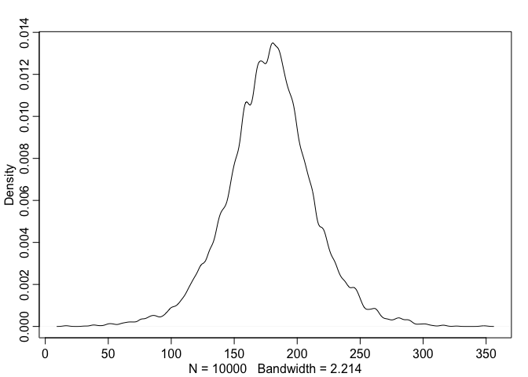
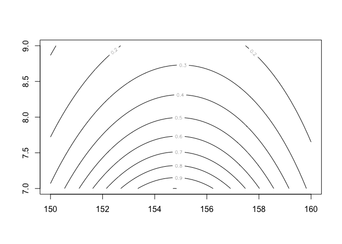
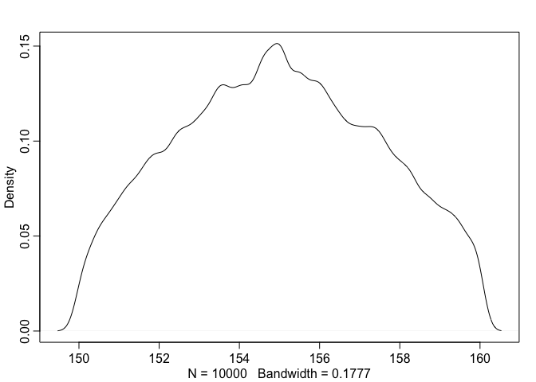
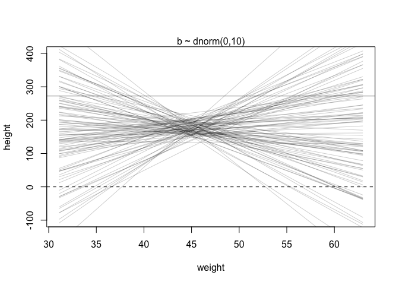

Rethinking Chapter4
================

``` r
library(rethinking)
```

    ## Loading required package: rstan

    ## Loading required package: StanHeaders

    ## Loading required package: ggplot2

    ## rstan (Version 2.21.2, GitRev: 2e1f913d3ca3)

    ## For execution on a local, multicore CPU with excess RAM we recommend calling
    ## options(mc.cores = parallel::detectCores()).
    ## To avoid recompilation of unchanged Stan programs, we recommend calling
    ## rstan_options(auto_write = TRUE)

    ## Loading required package: parallel

    ## rethinking (Version 2.13)

    ## 
    ## Attaching package: 'rethinking'

    ## The following object is masked from 'package:stats':
    ## 
    ##     rstudent

``` r
data(Howell1)
d <- Howell1
```

``` r
str(d)
```

    ## 'data.frame':    544 obs. of  4 variables:
    ##  $ height: num  152 140 137 157 145 ...
    ##  $ weight: num  47.8 36.5 31.9 53 41.3 ...
    ##  $ age   : num  63 63 65 41 51 35 32 27 19 54 ...
    ##  $ male  : int  1 0 0 1 0 1 0 1 0 1 ...

``` r
precis(d)
```

    ##               mean         sd      5.5%     94.5%     histogram
    ## height 138.2635963 27.6024476 81.108550 165.73500 ▁▁▁▁▁▁▁▂▁▇▇▅▁
    ## weight  35.6106176 14.7191782  9.360721  54.50289 ▁▂▃▂▂▂▂▅▇▇▃▂▁
    ## age     29.3443934 20.7468882  1.000000  66.13500     ▇▅▅▃▅▂▂▁▁
    ## male     0.4724265  0.4996986  0.000000   1.00000    ▇▁▁▁▁▁▁▁▁▇

``` r
d$height
```

    ##   [1] 151.7650 139.7000 136.5250 156.8450 145.4150 163.8300 149.2250 168.9100
    ##   [9] 147.9550 165.1000 154.3050 151.1300 144.7800 149.9000 150.4950 163.1950
    ##  [17] 157.4800 143.9418 121.9200 105.4100  86.3600 161.2900 156.2100 129.5400
    ##  [25] 109.2200 146.4000 148.5900 147.3200 137.1600 125.7300 114.3000 147.9550
    ##  [33] 161.9250 146.0500 146.0500 152.7048 142.8750 142.8750 147.9550 160.6550
    ##  [41] 151.7650 162.8648 171.4500 147.3200 147.9550 144.7800 121.9200 128.9050
    ##  [49]  97.7900 154.3050 143.5100 146.7000 157.4800 127.0000 110.4900  97.7900
    ##  [57] 165.7350 152.4000 141.6050 158.8000 155.5750 164.4650 151.7650 161.2900
    ##  [65] 154.3050 145.4150 145.4150 152.4000 163.8300 144.1450 129.5400 129.5400
    ##  [73] 153.6700 142.8750 146.0500 167.0050 158.4198  91.4400 165.7350 149.8600
    ##  [81] 147.9550 137.7950 154.9400 160.9598 161.9250 147.9550 113.6650 159.3850
    ##  [89] 148.5900 136.5250 158.1150 144.7800 156.8450 179.0700 118.7450 170.1800
    ##  [97] 146.0500 147.3200 113.0300 162.5600 133.9850 152.4000 160.0200 149.8600
    ## [105] 142.8750 167.0050 159.3850 154.9400 148.5900 111.1250 111.7600 162.5600
    ## [113] 152.4000 124.4600 111.7600  86.3600 170.1800 146.0500 159.3850 151.1300
    ## [121] 160.6550 169.5450 158.7500  74.2950 149.8600 153.0350  96.5200 161.9250
    ## [129] 162.5600 149.2250 116.8400 100.0760 163.1950 161.9250 145.4150 163.1950
    ## [137] 151.1300 150.4950 141.6050 170.8150  91.4400 157.4800 152.4000 149.2250
    ## [145] 129.5400 147.3200 145.4150 121.9200 113.6650 157.4800 154.3050 120.6500
    ## [153] 115.6000 167.0050 142.8750 152.4000  96.5200 160.0000 159.3850 149.8600
    ## [161] 160.6550 160.6550 149.2250 125.0950 140.9700 154.9400 141.6050 160.0200
    ## [169] 150.1648 155.5750 103.5050  94.6150 156.2100 153.0350 167.0050 149.8600
    ## [177] 147.9550 159.3850 161.9250 155.5750 159.3850 146.6850 172.7200 166.3700
    ## [185] 141.6050 142.8750 133.3500 127.6350 119.3800 151.7650 156.8450 148.5900
    ## [193] 157.4800 149.8600 147.9550 102.2350 153.0350 160.6550 149.2250 114.3000
    ## [201] 100.9650 138.4300  91.4400 162.5600 149.2250 158.7500 149.8600 158.1150
    ## [209] 156.2100 148.5900 143.5100 154.3050 131.4450 157.4800 157.4800 154.3050
    ## [217] 107.9500 168.2750 145.4150 147.9550 100.9650 113.0300 149.2250 154.9400
    ## [225] 162.5600 156.8450 123.1900 161.0106 144.7800 143.5100 149.2250 110.4900
    ## [233] 149.8600 165.7350 144.1450 157.4800 154.3050 163.8300 156.2100 153.6700
    ## [241] 134.6200 144.1450 114.3000 162.5600 146.0500 120.6500 154.9400 144.7800
    ## [249] 106.6800 146.6850 152.4000 163.8300 165.7350 156.2100 152.4000 140.3350
    ## [257] 158.1150 163.1950 151.1300 171.1198 149.8600 163.8300 141.6050  93.9800
    ## [265] 149.2250 105.4100 146.0500 161.2900 162.5600 145.4150 145.4150 170.8150
    ## [273] 127.0000 159.3850 159.4000 153.6700 160.0200 150.4950 149.2250 127.0000
    ## [281] 142.8750 142.1130 147.3200 162.5600 164.4650 160.0200 153.6700 167.0050
    ## [289] 151.1300 147.9550 125.3998 111.1250 153.0350 139.0650 152.4000 154.9400
    ## [297] 147.9550 143.5100 117.9830 144.1450  92.7100 147.9550 155.5750 150.4950
    ## [305] 155.5750 154.3050 130.6068 101.6000 157.4800 168.9100 150.4950 111.7600
    ## [313] 160.0200 167.6400 144.1450 145.4150 160.0200 147.3200 164.4650 153.0350
    ## [321] 149.2250 160.0200 149.2250  85.0900  84.4550  59.6138  92.7100 111.1250
    ## [329]  90.8050 153.6700  99.6950  62.4840  81.9150  96.5200  80.0100 150.4950
    ## [337] 151.7650 140.6398  88.2650 158.1150 149.2250 151.7650 154.9400 123.8250
    ## [345] 104.1400 161.2900 148.5900  97.1550  93.3450 160.6550 157.4800 167.0050
    ## [353] 157.4800  91.4400  60.4520 137.1600 152.4000 152.4000  81.2800 109.2200
    ## [361]  71.1200  89.2048  67.3100  85.0900  69.8500 161.9250 152.4000  88.9000
    ## [369]  90.1700  71.7550  83.8200 159.3850 142.2400 142.2400 168.9100 123.1900
    ## [377]  74.9300  74.2950  90.8050 160.0200  67.9450 135.8900 158.1150  85.0900
    ## [385]  93.3450 152.4000 155.5750 154.3050 156.8450 120.0150 114.3000  83.8200
    ## [393] 156.2100 137.1600 114.3000  93.9800 168.2750 147.9550 139.7000 157.4800
    ## [401]  76.2000  66.0400 160.7000 114.3000 146.0500 161.2900  69.8500 133.9850
    ## [409]  67.9450 150.4950 163.1950 148.5900 148.5900 161.9250 153.6700  68.5800
    ## [417] 151.1300 163.8300 153.0350 151.7650 132.0800 156.2100 140.3350 158.7500
    ## [425] 142.8750  84.4550 151.9428 161.2900 127.9906 160.9852 144.7800 132.0800
    ## [433] 117.9830 160.0200 154.9400 160.9852 165.9890 157.9880 154.9400  97.9932
    ## [441]  64.1350 160.6550 147.3200 146.7000 147.3200 172.9994 158.1150 147.3200
    ## [449] 124.9934 106.0450 165.9890 149.8600  76.2000 161.9250 140.0048  66.6750
    ## [457]  62.8650 163.8300 147.9550 160.0200 154.9400 152.4000  62.2300 146.0500
    ## [465] 151.9936 157.4800  55.8800  60.9600 151.7650 144.7800 118.1100  78.1050
    ## [473] 160.6550 151.1300 121.9200  92.7100 153.6700 147.3200 139.7000 157.4800
    ## [481]  91.4400 154.9400 143.5100  83.1850 158.1150 147.3200 123.8250  88.9000
    ## [489] 160.0200 137.1600 165.1000 154.9400 111.1250 153.6700 145.4150 141.6050
    ## [497] 144.7800 163.8300 161.2900 154.9000 161.3000 170.1800 149.8600 123.8250
    ## [505]  85.0900 160.6550 154.9400 106.0450 126.3650 166.3700 148.2852 124.4600
    ## [513]  89.5350 101.6000 151.7650 148.5900 153.6700  53.9750 146.6850  56.5150
    ## [521] 100.9650 121.9200  81.5848 154.9400 156.2100 132.7150 125.0950 101.6000
    ## [529] 160.6550 146.0500 132.7150  87.6300 156.2100 152.4000 162.5600 114.9350
    ## [537]  67.9450 142.8750  76.8350 145.4150 162.5600 156.2100  71.1200 158.7500

``` r
d2 <- d[d$age >= 18,]
```

``` r
curve(dnorm(x, 178, 20), from = 100, to = 250)
```

<!-- -->

``` r
curve(dunif(x, 0, 50), from = -10, to = 60)
```

<!-- -->

``` r
sample_mu <- rnorm(1e4, 178, 20)
sample_sigma <- runif(1e4, 0, 50)
prior_h <- rnorm(1e4, sample_mu, sample_sigma)
dens(prior_h)
```

<!-- -->

``` r
sample_mu <- rnorm(1e4, 178, 100)
prior_h <- rnorm(1e4, sample_mu, sample_sigma)
dens(prior_h)
```

<!-- -->

``` r
mu.list <- seq(from = 150, to = 160, length.out = 100)
sigma.list <- seq(from = 7, to = 9, length.out = 100)
post <- expand.grid(mu = mu.list, sigma = sigma.list)

post$LL <- sapply(1:nrow(post), function(i) sum(dnorm(d2$height, post$mu[i], post$sigma[i]), log = TRUE))

post$prod <- post$LL + dnorm(post$mu, 178, 20, TRUE) + dunif(post$sigma, 0, 50, TRUE)

post$prob <- exp(post$prod - max(post$prod))
```

``` r
contour_xyz(post$mu, post$sigma, post$prob)
```

<!-- -->

``` r
image_xyz(post$mu, post$sigma, post$prob)
```

<!-- -->

``` r
sample.rows <- sample(1:nrow(post), 
                      size = 1e4, 
                      replace = TRUE,
                      prob = post$prob)

sample.mu <- post$mu[sample.rows]
sample.sigma <- post$sigma[sample.rows]
```

``` r
plot(sample.mu, 
     sample.sigma, 
     cex = 0.5,
     pch = 16,
     col = col.alpha(rangi2, 0.1))
```

<!-- -->

``` r
dens(sample.mu)
```

<!-- -->

``` r
dens(sample.sigma)
```

<!-- -->

``` r
PI(sample.mu)
```

    ##       5%      94% 
    ## 150.9091 158.9899

``` r
PI(sample.sigma)
```

    ##       5%      94% 
    ## 7.060606 8.797980

``` r
flist <- alist(
  height ~ dnorm(mu, sigma),
  mu ~ dnorm(178, 20),
  sigma ~ dunif(0, 50)
)
```

``` r
m4.1 <- quap(flist, data = d2)
```

``` r
precis(m4.1)
```

    ##             mean        sd       5.5%      94.5%
    ## mu    154.605237 0.4119408 153.946876 155.263597
    ## sigma   7.730325 0.2912910   7.264786   8.195864

``` r
m4.2 <- quap(alist(
  height ~ dnorm(mu, sigma),
  mu ~ dnorm(178, 0.1),
  sigma ~ dunif(0, 50)
), data = d2)

precis(m4.2)
```

    ##            mean        sd      5.5%     94.5%
    ## mu    177.86376 0.1002354 177.70357 178.02396
    ## sigma  24.51759 0.9289253  23.03299  26.00219

``` r
vcov(m4.1)
```

    ##                 mu        sigma
    ## mu    0.1696951857 0.0001787048
    ## sigma 0.0001787048 0.0848504632

``` r
diag(vcov(m4.1))
```

    ##         mu      sigma 
    ## 0.16969519 0.08485046

``` r
cov2cor(vcov(m4.1))
```

    ##                mu       sigma
    ## mu    1.000000000 0.001489273
    ## sigma 0.001489273 1.000000000

``` r
post <- extract.samples(m4.1, n = 1e4)
head(post)
```

    ##         mu    sigma
    ## 1 154.9465 8.190629
    ## 2 154.1982 8.059458
    ## 3 154.7953 7.736315
    ## 4 154.4333 7.525213
    ## 5 155.0857 7.756066
    ## 6 154.3440 7.817320

``` r
precis(post)
```

    ##             mean        sd       5.5%      94.5%     histogram
    ## mu    154.611248 0.4090731 153.967881 155.260749      ▁▁▅▇▂▁▁▁
    ## sigma   7.731773 0.2914214   7.269383   8.198325 ▁▁▁▁▂▅▇▇▃▁▁▁▁

``` r
plot(d2$height ~ d2$weight)
```

<!-- -->

``` r
set.seed(2971)
N <- 100
a <- rnorm(N, 178, 20)
b <- rnorm(N, 0, 10)
```

``` r
plot(NULL, xlim = range(d2$weight), ylim = c(-100, 400), xlab = "weight", ylab = "height")
abline(h = 0, lty = 2)
abline(h = 272, lty = 1, lwd = 0.5)
mtext("b ~ dnorm(0,10)")
xbar <- mean(d2$weight)
for(i in 1:N){
  curve(a[i] + b[i]*(x - xbar),
        from = min(d2$weight),
        to = max(d2$weight),
        add = TRUE,
        col = col.alpha("black", 0.2))
}
```

<!-- -->

``` r
b <- rlnorm(1e4, 0, 1)
dens(b, xlim = c(0,5), adj = 0.1)
```

<!-- -->

``` r
set.seed(2971)
N <- 100
a <- rnorm(N, 178, 20)
b <- rlnorm(N, 0, 1)

plot(NULL, xlim = range(d2$weight), ylim = c(-100, 400), xlab = "weight", ylab = "height")
abline(h = 0, lty = 2)
abline(h = 272, lty = 1, lwd = 0.5)
mtext("b ~ dnorm(0,10)")
xbar <- mean(d2$weight)
for(i in 1:N){
  curve(a[i] + b[i]*(x - xbar),
        from = min(d2$weight),
        to = max(d2$weight),
        add = TRUE,
        col = col.alpha("black", 0.2))
}
```

<!-- -->

``` r
m4.3 <- quap(
  alist(
    height ~ dnorm(mu, sigma),
    mu <- a + b*(weight - xbar),
    a ~ dnorm(178, 20),
    b ~ dlnorm(0, 1),
    sigma ~ dunif(0,50)
  ),
  data = d2
)
```

``` r
precis(m4.3)
```

    ##              mean         sd        5.5%       94.5%
    ## a     154.6013671 0.27030766 154.1693633 155.0333710
    ## b       0.9032807 0.04192363   0.8362787   0.9702828
    ## sigma   5.0718809 0.19115478   4.7663786   5.3773831

``` r
round(vcov(m4.3), 3)
```

    ##           a     b sigma
    ## a     0.073 0.000 0.000
    ## b     0.000 0.002 0.000
    ## sigma 0.000 0.000 0.037

``` r
plot(height ~ weight, data = d2, col = rangi2)
post <- extract.samples(m4.3, n = 1e4)
a_map <- mean(post$a)
b_map <- mean(post$b)
curve(a_map + b_map*(x - xbar), add = TRUE)
```

<!-- -->

``` r
head(post, 5)
```

    ##          a         b    sigma
    ## 1 154.5564 0.9000245 4.768499
    ## 2 154.4602 0.8474034 5.136055
    ## 3 154.7858 0.9440438 5.313512
    ## 4 154.4490 0.8806246 4.683555
    ## 5 154.4639 0.8397176 5.185017

``` r
mu_at_50 <- post$a + post$b*(50-xbar)
str(mu_at_50)
```

    ##  num [1:10000] 159 159 160 159 159 ...

``` r
dens(mu_at_50, col = rangi2, lwd = 2, xlab = "mu|weight=50")
```

<!-- -->

``` r
PI(mu_at_50, prob = 0.89)
```

    ##       5%      94% 
    ## 158.5860 159.6706

``` r
mu <- link(m4.3)
str(mu)
```

    ##  num [1:1000, 1:352] 157 157 157 157 157 ...

``` r
weight.seq <- 25:70

mu <- link(m4.3, data = data.frame(weight = weight.seq))
str(mu)
```

    ##  num [1:1000, 1:46] 137 137 136 137 136 ...

``` r
plot(height ~ weight, data = d2, type = "n")

for(i in 1:100){
  points(weight.seq, 
         mu[i,], 
         pch = 16,
         col = col.alpha(rangi2, 0.1))
}
```

<!-- -->

``` r
mu.mean <- apply(mu, 2, mean)
mu.PI <- apply(mu, 2, PI, prob = 0.89)
mu.HPDI <- apply(mu, 2, HPDI, prob = 0.89)
```

``` r
plot(height ~ weight, data = d2, col = rangi2)
lines(weight.seq, mu.mean)
shade(mu.PI, weight.seq)
```

<!-- -->

``` r
sim.height <- sim(m4.3, data = list(weight = weight.seq))
str(sim.height)
```

    ##  num [1:1000, 1:46] 135 134 133 133 138 ...

``` r
height.PI <- apply(sim.height, 2, PI, prob = 0.89)
plot(height ~ weight, data = d2, col = rangi2)
lines(weight.seq, mu.mean)
shade(mu.HPDI, weight.seq)
shade(height.PI, weight.seq)
```

<!-- -->

``` r
d$weight_s <- (d$weight - mean(d$weight))/sd(d$weight)
d$weight_s2 <- d$weight_s^2

m4.5 <- quap(
  alist(
    height ~ dnorm(mu, sigma),
    mu <- a + b1*weight_s + b2*weight_s2,
    a ~ dnorm(178, 20),
    b1 ~ dlnorm(0, 1),
    b2 ~ dnorm(0, 1),
    sigma ~ dunif(0,50)
  ), data = d
)
```

``` r
precis(m4.5)
```

    ##             mean        sd       5.5%      94.5%
    ## a     146.057415 0.3689755 145.467721 146.647109
    ## b1     21.733064 0.2888890  21.271363  22.194764
    ## b2     -7.803268 0.2741838  -8.241467  -7.365069
    ## sigma   5.774474 0.1764651   5.492449   6.056499

``` r
weight.seq <- seq(-2.2, 2, length.out = 30)
pred_dat <- list(weight_s = weight.seq, weight_s2 = weight.seq^2)
mu <- link(m4.5, data = pred_dat)
mu.mean <- apply(mu, 2, mean)
mu.PI <- apply(mu, 2, PI, prob = 0.89)
sim.height <- sim(m4.5, data = pred_dat)
height.PI <- apply(sim.height, 2, PI, prob = 0.89)
```

``` r
plot(height ~ weight_s, data = d, col = col.alpha(rangi2, 0.5))
lines(weight.seq, mu.mean)
shade(mu.PI, weight.seq)
shade(height.PI, weight.seq)
```

<!-- -->

``` r
d$weight_s3 <- d$weight_s^3

m4.6 <- quap(
  alist(
    height ~ dnorm(mu, sigma),
    mu <- a + b1*weight_s + b2*weight_s2 + b3*weight_s3,
    a ~ dnorm(178, 20),
    b1 ~ dlnorm(0,1),
    b2 ~ dnorm(0,10),
    b3 ~ dnorm(0, 10),
    sigma ~ dunif(0,50)
  ), data = d
)
```

``` r
precis(m4.6)
```

    ##             mean        sd       5.5%      94.5%
    ## a     146.737297 0.3133575 146.236491 147.238103
    ## b1     15.000217 0.4852958  14.224620  15.775813
    ## b2     -6.535760 0.2662392  -6.961261  -6.110258
    ## b3      3.602358 0.2361935   3.224875   3.979840
    ## sigma   4.821026 0.1461629   4.587430   5.054623

``` r
weight.seq <- seq(-2.2, 2, length.out = 30)
pred_dat <- list(weight_s = weight.seq, 
                 weight_s2 = weight.seq^2, 
                 weight_s3 = weight.seq^3)
mu <- link(m4.6, data = pred_dat)
mu.mean <- apply(mu, 2, mean)
mu.PI <- apply(mu, 2, PI, prob = 0.89)
sim.height <- sim(m4.6, data = pred_dat)
height.PI <- apply(sim.height, 2, PI, prob = 0.89)
```

``` r
plot(height ~ weight_s, data = d, col = col.alpha(rangi2, 0.5))
lines(weight.seq, mu.mean)
shade(mu.PI, weight.seq)
shade(height.PI, weight.seq)
```

<!-- -->

``` r
data("cherry_blossoms")
d <- cherry_blossoms
precis(d)
```

    ##                   mean          sd      5.5%      94.5%       histogram
    ## year       1408.000000 350.8845964 867.77000 1948.23000   ▇▇▇▇▇▇▇▇▇▇▇▇▁
    ## doy         104.540508   6.4070362  94.43000  115.00000        ▁▂▅▇▇▃▁▁
    ## temp          6.141886   0.6636479   5.15000    7.29470        ▁▃▅▇▃▂▁▁
    ## temp_upper    7.185151   0.9929206   5.89765    8.90235 ▁▂▅▇▇▅▂▂▁▁▁▁▁▁▁
    ## temp_lower    5.098941   0.8503496   3.78765    6.37000 ▁▁▁▁▁▁▁▃▅▇▃▂▁▁▁

``` r
d2 <- d[complete.cases(d$doy),]
num_knots <- 15
knot_list <- quantile(d2$year, 
                      probs = seq(0, 1, length.out = num_knots))
```

``` r
library(splines)
B <- bs(d2$year,
        knots = knot_list[-c(1, num_knots)],
        degree = 3,
        intercept = TRUE)

str(B)
```

    ##  'bs' num [1:827, 1:17] 1 0.96 0.767 0.563 0.545 ...
    ##  - attr(*, "dimnames")=List of 2
    ##   ..$ : NULL
    ##   ..$ : chr [1:17] "1" "2" "3" "4" ...
    ##  - attr(*, "degree")= int 3
    ##  - attr(*, "knots")= Named num [1:13] 1036 1174 1269 1377 1454 ...
    ##   ..- attr(*, "names")= chr [1:13] "7.142857%" "14.28571%" "21.42857%" "28.57143%" ...
    ##  - attr(*, "Boundary.knots")= int [1:2] 812 2015
    ##  - attr(*, "intercept")= logi TRUE

``` r
plot(NULL, 
     xlim = range(d2$year), 
     ylim = c(0,1), 
     xlab = "year", 
     ylab = "basis")

for(i in 1:ncol(B)) {
  lines(d2$year, B[,i])
}
```

<!-- -->

``` r
m4.7 <- quap(
  alist(
    D ~ dnorm(mu, sigma),
    mu <- a + B %*% w,
    a ~ dnorm(100, 10),
    w ~ dnorm(0,10),
    sigma ~ dexp(1)
  ), 
  data = list(D = d2$doy, B = B),
  start = list(w = rep(0, ncol(B)))
)
```

``` r
post <- extract.samples(m4.7)
precis(post, depth = 2)
```

    ##              mean        sd         5.5%       94.5%       histogram
    ## a     103.3610303 2.3810913  99.49024491 107.1399370     ▁▁▁▂▅▇▇▂▁▁▁
    ## sigma   5.8769333 0.1433826   5.64754178   6.1075770     ▁▁▁▂▅▇▇▃▁▁▁
    ## w[1]   -3.0416058 3.9175770  -9.23724423   3.2539949        ▁▁▁▃▇▃▁▁
    ## w[2]   -0.7983212 3.8979412  -7.07537448   5.4027247         ▁▁▂▇▅▁▁
    ## w[3]   -1.1183267 3.5882258  -6.88580202   4.6887885 ▁▁▁▁▂▃▇▇▇▃▂▁▁▁▁
    ## w[4]    4.8472593 2.8905551   0.24274489   9.4923738   ▁▁▁▁▃▇▇▅▂▁▁▁▁
    ## w[5]   -0.8376066 2.8689136  -5.41623064   3.8092419     ▁▁▁▂▅▇▅▃▁▁▁
    ## w[6]    4.3049659 2.9228134  -0.38537400   9.0060499    ▁▁▁▂▃▇▇▅▂▁▁▁
    ## w[7]   -5.3189639 2.7990697  -9.77321543  -0.7967966     ▁▁▁▁▃▇▇▅▂▁▁
    ## w[8]    7.8215662 2.8328430   3.38818725  12.3597458    ▁▁▁▂▅▇▇▃▂▁▁▁
    ## w[9]   -1.0014149 2.8799717  -5.61728018   3.5629689  ▁▁▁▁▁▃▅▇▇▃▁▁▁▁
    ## w[10]   3.0222952 2.9141721  -1.61090655   7.6572466   ▁▁▁▁▂▅▇▅▃▁▁▁▁
    ## w[11]   4.6600465 2.8828451   0.06330139   9.2444701   ▁▁▁▁▃▇▇▅▂▁▁▁▁
    ## w[12]  -0.1500790 2.9038283  -4.83560340   4.5595264    ▁▁▁▂▅▇▇▃▂▁▁▁
    ## w[13]   5.5519085 2.9097778   0.93852684  10.2316944    ▁▁▁▁▂▅▇▇▃▁▁▁
    ## w[14]   0.6903879 3.0213697  -4.11199989   5.4824347    ▁▁▁▃▇▇▅▂▁▁▁▁
    ## w[15]  -0.8168393 3.2875172  -6.06580247   4.3761980  ▁▁▁▁▃▇▇▇▃▂▁▁▁▁
    ## w[16]  -6.9710419 3.4044893 -12.47168195  -1.5424106  ▁▁▁▂▃▇▇▇▃▂▁▁▁▁
    ## w[17]  -7.6679678 3.2142061 -12.76393926  -2.5551007   ▁▁▁▂▅▇▇▅▂▁▁▁▁

``` r
str(post)
```

    ## List of 3
    ##  $ a    : num [1:10000] 104 98.7 100.8 106.9 101.9 ...
    ##  $ sigma: num [1:10000] 6.02 5.93 5.97 6.06 5.76 ...
    ##  $ w    : num [1:10000, 1:17] -1.87 2.91 -1.45 -6.06 -7.32 ...
    ##  - attr(*, "source")= chr "quap posterior: 10000 samples from m4.7"

``` r
w <- apply(post$w, 2, mean)
plot(NULL, xlim = range(d2$year), ylim = c(-6,6),
     xlab = "year", ylab = "basis * weight")
for(i in 1:ncol(B)){
  lines(d2$year, w[i]*B[,i])
}
```

<!-- -->

``` r
mu <- link(m4.7)
mu_PI <- apply(mu, 2, PI, 0.97)

plot(d2$year, 
     d2$doy, 
     col = col.alpha(rangi2, 0.3),
     pch = 16)
shade(mu_PI, 
      d2$year,
      col = col.alpha("black", 0.5))
```

<!-- -->
