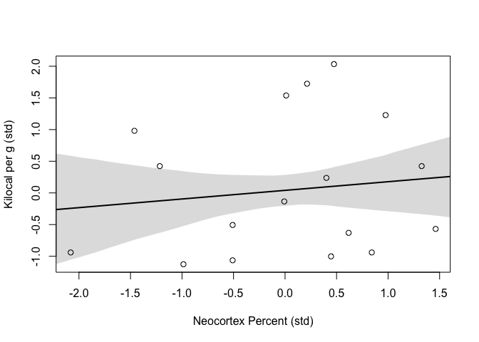

Chapter 5
================

## 5.1 Spurious Associations

``` r
library(rethinking)
```

    ## Loading required package: rstan

    ## Loading required package: StanHeaders

    ## Loading required package: ggplot2

    ## rstan (Version 2.21.2, GitRev: 2e1f913d3ca3)

    ## For execution on a local, multicore CPU with excess RAM we recommend calling
    ## options(mc.cores = parallel::detectCores()).
    ## To avoid recompilation of unchanged Stan programs, we recommend calling
    ## rstan_options(auto_write = TRUE)

    ## Loading required package: parallel

    ## rethinking (Version 2.13)

    ## 
    ## Attaching package: 'rethinking'

    ## The following object is masked from 'package:stats':
    ## 
    ##     rstudent

``` r
data(WaffleDivorce)
d <- WaffleDivorce
```

``` r
d$D <- standardize(d$Divorce)
d$M <- standardize(d$Marriage)
d$A <- standardize(d$MedianAgeMarriage)
```

``` r
m5.1 <- quap(
  alist(
    D ~ dnorm(mu, sigma),
    mu <- a + bA * A,
    a ~ dnorm(0, 0.2),
    bA ~ dnorm(0, 0.5),
    sigma ~ dexp(1)
  ), data = d
)
```

``` r
set.seed(10)
prior <- extract.prior(m5.1)
mu <- link(m5.1, post=prior, data = list(A = c(-2,2)))

plot(NULL,
     xlim = c(-2, 2),
     ylim = c(-2, 2))

for(i in 1:50){
  lines(c(-2, 2), mu[i,], col = col.alpha("black", 0.4) )
}
```

<!-- -->

``` r
A_seq <- seq(-3, 3.2, length.out = 30)
mu <- link(m5.1, data = list(A = A_seq))
mu.mean <- apply(mu, 2, mean)
mu.PI <- apply(mu, 2, PI)

plot(D ~ A, data = d, col = rangi2)
lines(A_seq, mu.mean, lwd = 2)
shade(mu.PI, A_seq)
```

<!-- -->

``` r
m5.2 <- quap(
  alist(
    D ~ dnorm(mu, sigma),
    mu <- a + bM * M,
    a ~ dnorm(0, 0.2),
    bM ~ dnorm(0, 0.5),
    sigma ~ dexp(1)
  ), data = d
)
```

``` r
M_seq <- seq(-3, 3.2, length.out = 30)
mu <- link(m5.2, data = list(M = M_seq))
mu.mean <- apply(mu, 2, mean)
mu.PI <- apply(mu, 2, PI)

plot(D ~ M, data = d, col = rangi2)
lines(A_seq, mu.mean, lwd = 2)
shade(mu.PI, M_seq)
```

<!-- --> \#\#\# 5.1.1 Think
Before You Regress

``` r
library(dagitty)
dag5.1 <- dagitty("dag{A -> D; A -> M; M -> D}")
coordinates(dag5.1) <- list(x = c(A=0, D = 1, M = 2),
                            y = c(A=0, D = 1, M = 0))
drawdag(dag5.1)
```

<!-- -->

``` r
dag5.1b <- dagitty("dag{A -> D; A -> M}")
coordinates(dag5.1b) <- list(x = c(A=0, D = 1, M = 2),
                            y = c(A=0, D = 1, M = 0))
drawdag(dag5.1b)
```

<!-- --> \#\#\# 5.1.2 Testable
Implications

``` r
DMA_dag1 <- dagitty("dag{D <- A -> M -> D}")
DMA_dag2 <- dagitty("dag{D <- A -> M}")
```

``` r
impliedConditionalIndependencies(DMA_dag1)
```

``` r
impliedConditionalIndependencies(DMA_dag2)
```

    ## D _||_ M | A

### 5.1.3 Multiple Regression Notation

### 5.1.4 Approximating the Posterior

``` r
m5.3 <- quap(
  alist(
    D ~ dnorm(mu, sigma),
    mu <- a + bM * M + bA * A,
    a ~ dnorm(0, 0.2),
    bM ~ dnorm(0, 0.5),
    bA ~ dnorm(0, 0.5),
    sigma ~ dexp(1)
  ), data = d
)

precis(m5.3)
```

    ##                mean         sd       5.5%      94.5%
    ## a      6.145791e-06 0.09707503 -0.1551385  0.1551508
    ## bM    -6.539899e-02 0.15077111 -0.3063603  0.1755624
    ## bA    -6.135264e-01 0.15098166 -0.8548242 -0.3722285
    ## sigma  7.851074e-01 0.07784077  0.6607028  0.9095120

``` r
plot(coeftab(m5.1, m5.2, m5.3), par = c("bA", "bM"))
```

<!-- --> \#\#\# 5.1.5 Plotting
Multivariate Posteriors \#\#\#\# 5.1.5.1 Posterior Residual Plots

``` r
m5.4 <- quap(
  alist(
    M ~ dnorm(mu, sigma),
    mu <- a + bAM * A,
    a ~ dnorm(0, 0.2),
    bAM ~ dnorm(0, 0.5),
    sigma ~ dexp(1)
  ), data = d
)
```

``` r
mu <- link(m5.4)
mu_mean <- apply(mu, 2, mean)
mu_resid <- d$M - mu_mean
```

#### 5.1.5.2 Posterior Prediction Plots

``` r
mu <- link(m5.3)
mu_mean <- apply(mu, 2, mean)
mu_PI <- apply(mu, 2, PI)

D_sim <- sim(m5.3, n=1e4)
D_PI <- apply(D_sim, 2, PI) 
```

``` r
plot(mu_mean ~ d$D, col = rangi2, ylim = range(mu_PI),
     xlab = "Observed Divorce", ylab =  "Predicted Divorce")
abline(a = 0, b = 1, lty = 2)
for(i in 1:nrow(d)){
  lines(rep(d$D[i], 2), mu_PI[,i], col = rangi2)
}
```

<!-- -->

#### 5.1.5.3 Counterfactual Plots

``` r
m5.3_A <- quap(
  alist(
    ## A -> D <- M
    D ~ dnorm(mu, sigma),
    mu <- a + bM * M + bA * A,
    a ~ dnorm(0, 0.2),
    bM ~ dnorm(0, 0.5),
    bA ~ dnorm(0, 0.5),
    sigma ~ dexp(1),
    ## A -> M
    M ~ dnorm(mu_M, sigma_M),
    mu_M <- aM +  bAM * A,
    aM ~ dnorm(0, 0.2),
    bAM ~ dnorm(0, 0.5),
    sigma_M ~ dexp(1)
  ), data = d
)

precis(m5.3_A)
```

    ##                  mean         sd       5.5%      94.5%
    ## a        1.565178e-08 0.09707605 -0.1551463  0.1551463
    ## bM      -6.538073e-02 0.15077309 -0.3063453  0.1755838
    ## bA      -6.135135e-01 0.15098363 -0.8548145 -0.3722125
    ## sigma    7.851182e-01 0.07784344  0.6607093  0.9095270
    ## aM      -1.837818e-08 0.08684788 -0.1387997  0.1387997
    ## bAM     -6.947376e-01 0.09572699 -0.8477278 -0.5417474
    ## sigma_M  6.817373e-01 0.06758016  0.5737312  0.7897434

``` r
A_seq <- seq(-2, 2, length.out = 30)

sim_dat <- data.frame(A = A_seq)

# simulate M and then D, using A_seq
s <- sim(m5.3_A, data = sim_dat, vars = c("M", "D"))
```

``` r
plot(sim_dat$A, colMeans(s$D), ylim = c(-2, 2),
     type = "l", xlab = "Manipulated A",
     ylab = "Counterfactual D")
shade(apply(s$D, 2, PI), sim_dat$A)
mtext("Total Counterfactual effect of A on D")
```

<!-- -->

``` r
plot(sim_dat$A, colMeans(s$M), ylim = c(-2, 2),
     type = "l", xlab = "Manipulated A",
     ylab = "Counterfactual M")
shade(apply(s$M, 2, PI), sim_dat$A)
mtext("Total Counterfactual effect of A on M")
```

<!-- -->

``` r
A_std <- sd(d$MedianAgeMarriage)
sim2_dat <- data.frame(A=(c(20, 30)-26.1)/A_std)
s2 <- sim(m5.3_A, data = sim2_dat, vars = c("M", "D"))
mean(s2$D[,2] - s2$D[,1])
```

    ## [1] -4.551427

``` r
dag5.2 <- dagitty("dag{A -> D; M -> D}")
coordinates(dag5.2) <- list(x = c(A=0, D = 1, M = 2),
                            y = c(A=0, D = 1, M = 0))
drawdag(dag5.2)
```

<!-- -->

``` r
sim_dat <- data.frame(M= seq(-2, 2, length.out = 30), A = 0)
s <- sim(m5.3_A, data = sim_dat, vars = "D")

plot(sim_dat$M, colMeans(s), ylim = c(-2, 2),
     type = "l", xlab = "Manipulated M",
     ylab = "Counterfactual D")
shade(apply(s, 2, PI), sim_dat$M)
mtext("Total Counterfactual effect of M on D")
```

<!-- -->

## 5.2 Masked Relationship

``` r
data("milk")
d <- milk
str(d)
```

    ## 'data.frame':    29 obs. of  8 variables:
    ##  $ clade         : Factor w/ 4 levels "Ape","New World Monkey",..: 4 4 4 4 4 2 2 2 2 2 ...
    ##  $ species       : Factor w/ 29 levels "A palliata","Alouatta seniculus",..: 11 8 9 10 16 2 1 6 28 27 ...
    ##  $ kcal.per.g    : num  0.49 0.51 0.46 0.48 0.6 0.47 0.56 0.89 0.91 0.92 ...
    ##  $ perc.fat      : num  16.6 19.3 14.1 14.9 27.3 ...
    ##  $ perc.protein  : num  15.4 16.9 16.9 13.2 19.5 ...
    ##  $ perc.lactose  : num  68 63.8 69 71.9 53.2 ...
    ##  $ mass          : num  1.95 2.09 2.51 1.62 2.19 5.25 5.37 2.51 0.71 0.68 ...
    ##  $ neocortex.perc: num  55.2 NA NA NA NA ...

``` r
d$K <- standardize(d$kcal.per.g)
d$N <- standardize(d$neocortex.perc)
d$M <- standardize(log(d$mass))
```

``` r
m5.5_draft <- quap(
  alist(
    K ~ dnorm(mu, sigma),
    mu <- a + bN*N,
    a ~ dnorm(0, 1),
    bN ~ dnorm(0, 1),
    sigma ~ dexp(1)
  ), data = d
)
```

``` r
d$neocortex.perc
```

    ##  [1] 55.16    NA    NA    NA    NA 64.54 64.54 67.64    NA 68.85 58.85 61.69
    ## [13] 60.32    NA    NA 69.97    NA 70.41    NA 73.40    NA 67.53    NA 71.26
    ## [25] 72.60    NA 70.24 76.30 75.49

``` r
dcc <- d[complete.cases(d$K, d$N, d$M),]
```

``` r
m5.5_draft <- quap(
  alist(
    K ~ dnorm(mu, sigma),
    mu <- a + bN*N,
    a ~ dnorm(0, 1),
    bN ~ dnorm(0, 1),
    sigma ~ dexp(1)
  ), data = dcc
)
```

``` r
prior <- extract.prior(m5.5_draft)
xseq <- c(-2, 2)
mu <- link(m5.5_draft, post = prior, data = list(N=xseq))

plot(NULL, xlim = xseq, ylim = xseq,
     ylab = "Kilocal per g (std)",
     xlab = "Neocortex Percent (std)")
for(i in 1:50){
  lines(xseq, mu[i,], col = col.alpha("black", 0.3))
}
```

<!-- -->

``` r
m5.5 <- quap(
  alist(
    K ~ dnorm(mu, sigma),
    mu <- a + bN*N,
    a ~ dnorm(0, 0.2),
    bN ~ dnorm(0, 0.5),
    sigma ~ dexp(1)
  ), data = dcc
)
```

``` r
prior <- extract.prior(m5.5)
xseq <- c(-2, 2)
mu <- link(m5.5, 
           post = prior, 
           data = list(N=xseq))

plot(NULL, xlim = xseq, ylim = xseq,
     ylab = "Kilocal per g (std)",
     xlab = "Neocortex Percent (std)")
for(i in 1:50){
  lines(xseq, mu[i,], col = col.alpha("black", 0.3))
}
```

<!-- -->

``` r
precis(m5.5)
```

    ##             mean        sd       5.5%     94.5%
    ## a     0.03993945 0.1544906 -0.2069664 0.2868453
    ## bN    0.13323478 0.2237465 -0.2243554 0.4908249
    ## sigma 0.99981841 0.1647073  0.7365844 1.2630524

``` r
xseq <- seq(min(dcc$N) - 0.15, max(dcc$N) + 0.15, length.out = 30)
mu <- link(m5.5, data = list(N = xseq))
mu_mean <- apply(mu, 2, mean)
mu_PI <- apply(mu, 2, PI)

plot(K ~ N, data = dcc,
     ylab = "Kilocal per g (std)",
     xlab = "Neocortex Percent (std)")
lines(xseq, mu_mean, lwd = 2)
shade(mu_PI, xseq)
```

<!-- -->

``` r
m5.6 <- quap(
  alist(
    K ~ dnorm(mu, sigma),
    mu <- a + bM*M,
    a ~ dnorm(0,0.2),
    bM ~ dnorm(0, 0.5),
    sigma ~ dexp(1)
  ), data = dcc
)

precis(m5.6)
```

    ##              mean        sd       5.5%      94.5%
    ## a      0.04654165 0.1512801 -0.1952331 0.28831639
    ## bM    -0.28253583 0.1928818 -0.5907983 0.02572661
    ## sigma  0.94927971 0.1570616  0.6982649 1.20029455

``` r
xseq <- seq(min(dcc$M) - 0.15, max(dcc$M) + 0.15, length.out = 30)
mu <- link(m5.6, data = list(M = xseq))
mu_mean <- apply(mu, 2, mean)
mu_PI <- apply(mu, 2, PI)

plot(K ~ N, data = dcc,
     ylab = "Kilocal per g (std)",
     xlab = "log(Body Mass) (std)")
lines(xseq, mu_mean, lwd = 2)
shade(mu_PI, xseq)
```

<!-- -->

``` r
m5.7 <- quap(
  alist(
    K ~ dnorm(mu, sigma),
    mu <- a + bM*M + bN*N,
    a ~ dnorm(0,0.2),
    bM ~ dnorm(0, 0.5),
    bN ~ dnorm(0, 0.5),
    sigma ~ dexp(1)
  ), data = dcc
)

precis(m5.7)
```

    ##              mean        sd       5.5%      94.5%
    ## a      0.06799176 0.1339987 -0.1461640  0.2821475
    ## bM    -0.70299111 0.2207869 -1.0558512 -0.3501310
    ## bN     0.67511789 0.2482985  0.2782889  1.0719469
    ## sigma  0.73801393 0.1324617  0.5263146  0.9497133

``` r
plot(coeftab(m5.5, m5.6, m5.7), pars = c("bM", "bN"))
```

<!-- -->

``` r
pairs(~ K + M + N, dcc)
```

<!-- -->

``` r
sim_dat <- data.frame(N= seq(-2, 2, length.out = 30), M = 0)
s <- link(m5.7, data = sim_dat, vars = "K")

plot(sim_dat$N, colMeans(s), ylim = c(-2, 2),
     type = "l", xlab = "Manipulated N",
     ylab = "Counterfactual K")
shade(apply(s, 2, PI), sim_dat$N)
mtext("Total Counterfactual effect of N on K")
```

<!-- -->

``` r
sim_dat <- data.frame(M= seq(-2, 2, length.out = 30), N = 0)
s <- link(m5.7, data = sim_dat, vars = "K")

plot(sim_dat$M, colMeans(s), ylim = c(-2, 2),
     type = "l", xlab = "Manipulated M",
     ylab = "Counterfactual K")
shade(apply(s, 2, PI), sim_dat$M)
mtext("Total Counterfactual effect of M on K")
```

<!-- -->

``` r
dag5.7 <- dagitty("dag{
                  M -> K <- N
                  M -> N}")

coordinates(dag5.7) <- list(x = c(M=0, K=1, N = 2),
                            y = c(M = 0.5, K = 1, N = 0.5))

drawdag(dag5.7)
```

<!-- -->

``` r
MElist <- equivalentDAGs(dag5.7)
drawdag(MElist)
```

<!-- -->

## 5.3 Categorical Variables

``` r
data("Howell1")
d <- Howell1
precis(d)
```

    ##               mean         sd      5.5%     94.5%     histogram
    ## height 138.2635963 27.6024476 81.108550 165.73500 ▁▁▁▁▁▁▁▂▁▇▇▅▁
    ## weight  35.6106176 14.7191782  9.360721  54.50289 ▁▂▃▂▂▂▂▅▇▇▃▂▁
    ## age     29.3443934 20.7468882  1.000000  66.13500     ▇▅▅▃▅▂▂▁▁
    ## male     0.4724265  0.4996986  0.000000   1.00000    ▇▁▁▁▁▁▁▁▁▇

``` r
d$sex <- ifelse(d$male == 1, 2, 1)
str(d$sex)
```

    ##  num [1:544] 2 1 1 2 1 2 1 2 1 2 ...

``` r
m5.8 <- quap(
  alist(
    height ~ dnorm(mu, sigma),
    mu <- a[sex],
    a[sex] ~ dnorm(178, 20),
    sigma ~ dunif(0,50)
  ), data = d
)

precis(m5.8, depth = 2)
```

    ##            mean        sd      5.5%    94.5%
    ## a[1]  134.90892 1.6069073 132.34077 137.4771
    ## a[2]  142.57802 1.6974461 139.86517 145.2909
    ## sigma  27.30949 0.8280068  25.98617  28.6328

``` r
post <- extract.samples(m5.8)
post$diff_fm <- post$a[,1] - post$a[,2]
precis(post, depth = 2)
```

    ##               mean        sd      5.5%      94.5%      histogram
    ## sigma    27.311950 0.8293886  26.01261  28.647101 ▁▁▁▁▁▃▇▇▇▃▂▁▁▁
    ## a[1]    134.893877 1.5961603 132.36193 137.427339  ▁▁▁▁▂▅▇▇▅▂▁▁▁
    ## a[2]    142.563281 1.6702756 139.89137 145.222847 ▁▁▁▂▃▇▇▇▃▂▁▁▁▁
    ## diff_fm  -7.669404 2.3121776 -11.37850  -3.964095     ▁▁▁▂▇▇▃▁▁▁

``` r
d <- milk
d$clade_id <- as.integer(d$clade)
d$K <- standardize(d$kcal.per.g)
```

``` r
m5.9 <- quap(
  alist(
    K ~ dnorm(mu, sigma),
    mu <- a[clade_id],
    a[clade_id] ~ dnorm(0, 0.2),
    sigma ~ dexp(1)
  ), data = d
)

precis(m5.9, depth = 2)
```

    ##             mean        sd        5.5%      94.5%
    ## a[1]  -0.1969856 0.1678152 -0.46518673 0.07121548
    ## a[2]   0.1489554 0.1660373 -0.11640427 0.41431498
    ## a[3]   0.2249942 0.1799338 -0.06257472 0.51256312
    ## a[4]  -0.1783827 0.1815209 -0.46848815 0.11172278
    ## sigma  0.8537612 0.1205310  0.66112933 1.04639300

``` r
labels <- paste("a[", 1:4, "]:", levels(d$clade), sep = "")
plot(precis(m5.9, depth = 2, pars = "a"),
     labels = labels,
     xlab = "Expected kcal (std)")
```

<!-- -->
