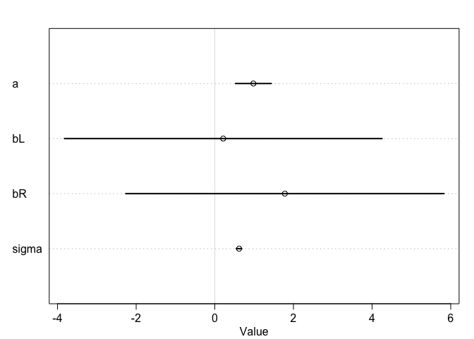
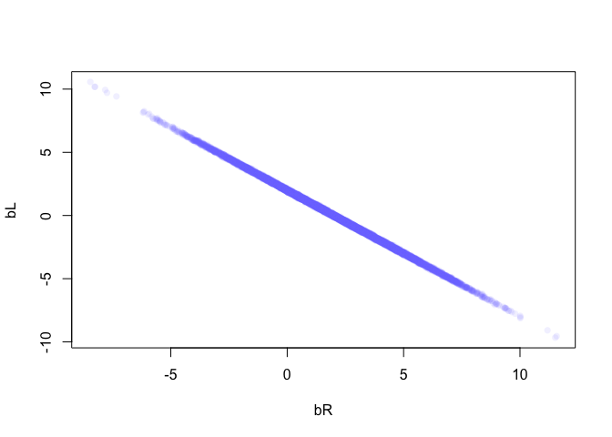
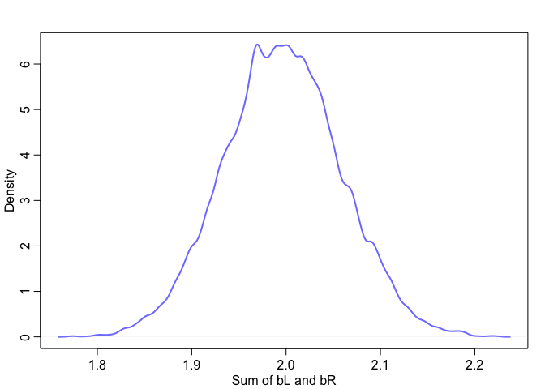
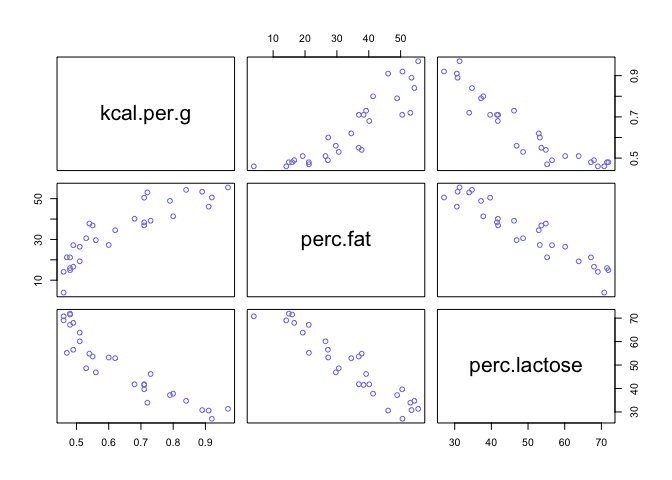
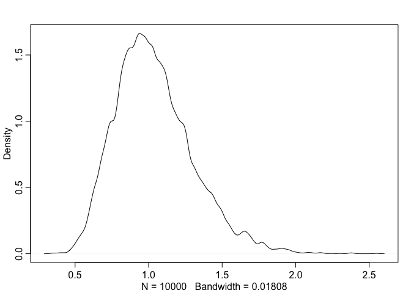
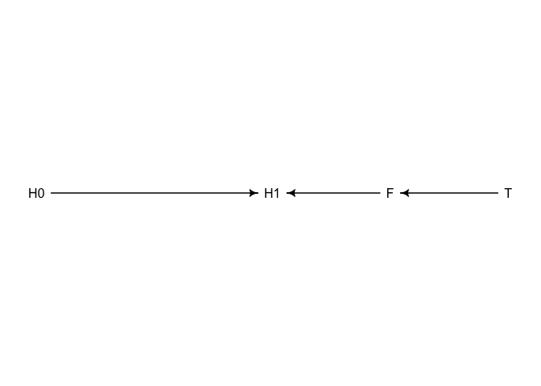
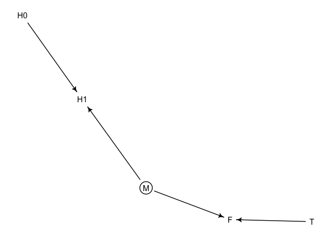
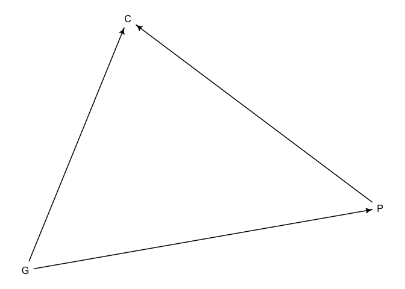
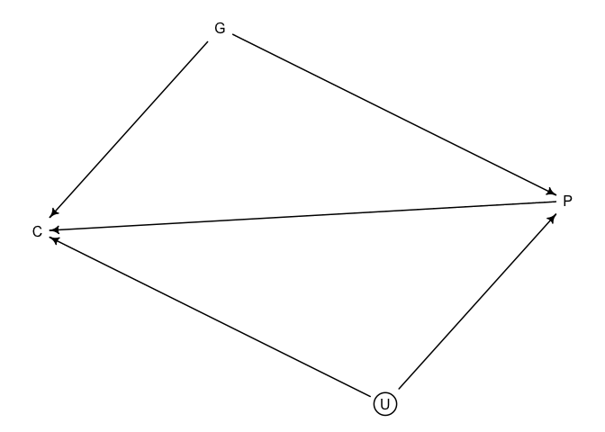

Chapter 6
================

## 6.1 Multicollinearity

### 6.1.1 Multicollinear legs

``` r
library(rethinking)
```

    ## Loading required package: rstan

    ## Loading required package: StanHeaders

    ## Loading required package: ggplot2

    ## rstan (Version 2.21.2, GitRev: 2e1f913d3ca3)

    ## For execution on a local, multicore CPU with excess RAM we recommend calling
    ## options(mc.cores = parallel::detectCores()).
    ## To avoid recompilation of unchanged Stan programs, we recommend calling
    ## rstan_options(auto_write = TRUE)

    ## Loading required package: parallel

    ## rethinking (Version 2.13)

    ## 
    ## Attaching package: 'rethinking'

    ## The following object is masked from 'package:stats':
    ## 
    ##     rstudent

``` r
set.seed(909)

N <- 100
height <- rnorm(N, 10, 2)
leg_prop <- runif(N, 0.4, 0.5)
leg_left <- leg_prop * height + rnorm(N, 0, 0.02)
leg_right <- leg_prop * height + rnorm(N, 0, 0.02)
d <- data.frame(height, leg_left, leg_right)
```

``` r
m6.1 <- quap(
  alist(
    height ~ dnorm(mu, sigma),
    mu <-  a + bL * leg_left + bR * leg_right,
    a ~ dnorm(10, 100),
    bL ~ dnorm(2, 10),
    bR ~ dnorm(2, 10),
    sigma ~ dexp(1)
  ), data = d
)

precis(m6.1)
```

    ##            mean         sd       5.5%     94.5%
    ## a     0.9811938 0.28396068  0.5273698 1.4350178
    ## bL    0.2138475 2.52707954 -3.8249137 4.2526087
    ## bR    1.7817046 2.53129314 -2.2637907 5.8271999
    ## sigma 0.6171141 0.04343629  0.5476945 0.6865337

``` r
plot(precis(m6.1))
```

<!-- -->

``` r
post <- extract.samples(m6.1)
plot(bL ~ bR, post, col = col.alpha(rangi2, 0.1), pch = 16)
```

<!-- -->

``` r
sum_bLbR <- post$bL + post$bR
dens(sum_bLbR, col = rangi2, lwd = 2, xlab = "Sum of bL and bR")
```

<!-- -->

``` r
m6.2 <- quap(
  alist(
    height ~ dnorm(mu, sigma),
    mu <- a + bL * leg_left,
    a ~ dnorm(10, 100),
    bL ~ dnorm(2, 10),
    sigma ~ dexp(1)
  ), data = d
)
```

    ## Caution, model may not have converged.

    ## Code 1: Maximum iterations reached.

``` r
precis(m6.2)
```

    ##            mean         sd      5.5%    94.5%
    ## a     0.7952983 0.29556184 0.3229334 1.267663
    ## bL    2.0335668 0.06369372 1.9317719 2.135362
    ## sigma 0.6412275 0.04773424 0.5649389 0.717516

### 6.1.2 Multicollinear milk

``` r
library(rethinking)
data("milk")
d <- milk
str(d)
```

    ## 'data.frame':    29 obs. of  8 variables:
    ##  $ clade         : Factor w/ 4 levels "Ape","New World Monkey",..: 4 4 4 4 4 2 2 2 2 2 ...
    ##  $ species       : Factor w/ 29 levels "A palliata","Alouatta seniculus",..: 11 8 9 10 16 2 1 6 28 27 ...
    ##  $ kcal.per.g    : num  0.49 0.51 0.46 0.48 0.6 0.47 0.56 0.89 0.91 0.92 ...
    ##  $ perc.fat      : num  16.6 19.3 14.1 14.9 27.3 ...
    ##  $ perc.protein  : num  15.4 16.9 16.9 13.2 19.5 ...
    ##  $ perc.lactose  : num  68 63.8 69 71.9 53.2 ...
    ##  $ mass          : num  1.95 2.09 2.51 1.62 2.19 5.25 5.37 2.51 0.71 0.68 ...
    ##  $ neocortex.perc: num  55.2 NA NA NA NA ...

``` r
d$K <- standardize(d$kcal.per.g)
d$F <- standardize(d$perc.fat)
d$L <- standardize(d$perc.lactose)
```

``` r
m6.3 <- quap(
  alist(
    K ~ dnorm(mu, sigma),
    mu <- a + bF*F,
    a ~ dnorm(0, 0.2),
    bF ~ dnorm(0, 0.5),
    sigma ~ dexp(1)
  ), data = d
)

m6.4 <- quap(
  alist(
    K ~ dnorm(mu, sigma),
    mu <- a + bL*L,
    a ~ dnorm(0, 0.2),
    bL ~ dnorm(0, 0.5),
    sigma ~ dexp(1)
  ), data = d
)

precis(m6.3)
```

    ##               mean         sd       5.5%     94.5%
    ## a     1.535526e-07 0.07725195 -0.1234634 0.1234637
    ## bF    8.618970e-01 0.08426088  0.7272318 0.9965621
    ## sigma 4.510179e-01 0.05870756  0.3571919 0.5448440

``` r
precis(m6.4)
```

    ##                mean         sd       5.5%      94.5%
    ## a      7.438817e-07 0.06661633 -0.1064650  0.1064665
    ## bL    -9.024550e-01 0.07132848 -1.0164517 -0.7884583
    ## sigma  3.804653e-01 0.04958259  0.3012227  0.4597078

``` r
m6.5 <- quap(
  alist(
    K ~ dnorm(mu, sigma),
    mu <- a + bF*F + bL*L,
    a ~ dnorm(0, 0.2),
    bF ~ dnorm(0, 0.5),
    bL ~ dnorm(0, 0.5),
    sigma ~ dexp(1)
  ), data = d
)

precis(m6.5)
```

    ##                mean         sd        5.5%      94.5%
    ## a     -3.172168e-07 0.06603577 -0.10553823  0.1055376
    ## bF     2.434983e-01 0.18357865 -0.04989579  0.5368925
    ## bL    -6.780825e-01 0.18377670 -0.97179320 -0.3843719
    ## sigma  3.767418e-01 0.04918394  0.29813637  0.4553472

``` r
pairs(~ kcal.per.g + perc.fat + perc.lactose, 
      data = d, col = rangi2)
```

<!-- --> \#\# 6.2
Post-treatment bias Example of the treatment of plants with anitfungal
to explain *Post Treatment* bias, which is a form of *Included variable
bias*.

``` r
set.seed(71)

# number of plants
N <- 100

#simluate initial heights
h0 <- rnorm(N, 10, 2)

# assign treatments and simulate fungus and growth
treatment <- rep(0:1, each = N/2)
fungus <- rbinom(N, size = 1, prob = 0.5 - treatment*0.4)
h1 <- h0 + rnorm(N, 5 - 3*fungus)

# Put everything together in a dataframe
d <- data.frame(h0 = h0,
                h1 = h1,
                treatment = treatment,
                fungus = fungus)

precis(d)
```

    ##               mean        sd      5.5%    94.5%    histogram
    ## h0         9.95978 2.1011623  6.570328 13.07874 ▁▂▂▂▇▃▂▃▁▁▁▁
    ## h1        14.39920 2.6880870 10.618002 17.93369     ▁▁▃▇▇▇▁▁
    ## treatment  0.50000 0.5025189  0.000000  1.00000   ▇▁▁▁▁▁▁▁▁▇
    ## fungus     0.23000 0.4229526  0.000000  1.00000   ▇▁▁▁▁▁▁▁▁▂

### 6.2.1 A Prior is born

``` r
sim_p <- rlnorm(1e4, 0, 0.25)
dens(sim_p)
```

<!-- -->

``` r
precis(sim_p)
```

    ##          mean        sd     5.5%    94.5%    histogram
    ## sim_p 1.03699 0.2629894 0.670683 1.496397 ▁▁▃▇▇▃▁▁▁▁▁▁

``` r
m6.6 <- quap(
  alist(
    h1 ~ dnorm(mu, sigma),
    mu <- h0 * p,
    p ~ dlnorm(0, 0.25),
    sigma ~ dexp(1)
  ), data = d
)

precis(m6.6)
```

    ##           mean         sd     5.5%    94.5%
    ## p     1.426626 0.01760992 1.398482 1.454770
    ## sigma 1.793286 0.12517262 1.593236 1.993336

``` r
m6.7 <- quap(
  alist(
    h1 ~ dnorm(mu, sigma),
    mu <- h0 * p,
    p <- a + bT * treatment + bF * fungus,
    a ~ dlnorm(0, 0.25),
    bT ~ dnorm(0, 0.5),
    bF ~ dnorm(0, 0.5),
    sigma ~ dexp(1)
  ), data = d
)

precis(m6.7)
```

    ##               mean         sd        5.5%       94.5%
    ## a      1.482826979 0.02452189  1.44363627  1.52201769
    ## bT     0.001060412 0.02987665 -0.04668825  0.04880907
    ## bF    -0.267912525 0.03654977 -0.32632611 -0.20949894
    ## sigma  1.408654939 0.09859120  1.25108716  1.56622272

### 6.2.2 Blocked by Consequence

``` r
m6.8 <- quap(
  alist(
    h1 ~ dnorm(mu, sigma),
    mu <- h0 * p,
    p <- a + bT * treatment,
    a ~ dlnorm(0, 0.25),
    bT ~ dnorm(0, 0.5),
    sigma ~ dexp(1)
  ), data = d
)

precis(m6.8)
```

    ##             mean         sd       5.5%     94.5%
    ## a     1.38169351 0.02519760 1.34142288 1.4219641
    ## bT    0.08365423 0.03431323 0.02881506 0.1384934
    ## sigma 1.74629597 0.12190800 1.55146343 1.9411285

### 6.2.3 Fungus and d-separation

``` r
library(dagitty)

plant_dag <- dagitty("dag{
                     H0 -> H1
                     F -> H1
                     T -> F}")

coordinates(plant_dag) <- list(
  x = c(H0 = 0,
        T = 2,
        F = 1.5,
        H1 = 1),
  y = c(H0 = 0,
        T = 0,
        F = 0,
        H1 = 0)
)

drawdag(plant_dag)
```

<!-- -->

``` r
impliedConditionalIndependencies(plant_dag)
```

    ## F _||_ H0
    ## H0 _||_ T
    ## H1 _||_ T | F

``` r
set.seed(71)

N <- 1000
h0 <- rnorm(N, 10, 2)
treatment <- rep(0:1, each = N/2)
M <- rbern(N)
fungus <- rbinom(N, size = 1, prob = 0.5 - treatment*0.4 + 0.4*M)
h1 <- h0 + rnorm(N, 5 + 3*M)

d2 <- data.frame(h0 = h0,
                h1 = h1,
                treatment = treatment,
                fungus = fungus)
```

``` r
plant_dagb <- dagitty("dag{M[u]
                     H0 -> H1 <- M -> F <- T}")

coordinates(plant_dag) <- list(
  x = c(H0 = 0,
        H1 = 0.1,
        M = 0.5,
        F = 0.5,
        T = 0.5),
  y = c(H0 = 0,
        H1 = 0,
        M = 2,
        F = 0,
        T = 0)
)

drawdag(plant_dagb)
```

<!-- -->

``` r
m6.6b <- quap(
  alist(
    h1 ~ dnorm(mu, sigma),
    mu <- h0 * p,
    p ~ dlnorm(0, 0.25),
    sigma ~ dexp(1)
  ), data = d2
)

precis(m6.6b)
```

    ##           mean          sd     5.5%    94.5%
    ## p     1.618883 0.006760865 1.608078 1.629688
    ## sigma 2.205915 0.049246085 2.127210 2.284620

``` r
m6.7b <- quap(
  alist(
    h1 ~ dnorm(mu, sigma),
    mu <- h0 * p,
    p <- a + bT * treatment + bF * fungus,
    a ~ dlnorm(0, 0.25),
    bT ~ dnorm(0, 0.5),
    bF ~ dnorm(0, 0.5),
    sigma ~ dexp(1)
  ), data = d2
)

precis(m6.7b)
```

    ##             mean         sd      5.5%      94.5%
    ## a     1.52259055 0.01360750 1.5008431 1.54433796
    ## bT    0.04821438 0.01415873 0.0255860 0.07084277
    ## bF    0.14239095 0.01416025 0.1197601 0.16502177
    ## sigma 2.10276535 0.04695006 2.0277301 2.17780062

``` r
m6.8b <- quap(
  alist(
    h1 ~ dnorm(mu, sigma),
    mu <- h0 * p,
    p <- a + bT * treatment,
    a ~ dlnorm(0, 0.25),
    bT ~ dnorm(0, 0.5),
    sigma ~ dexp(1)
  ), data = d2
)

precis(m6.8b)
```

    ##              mean          sd        5.5%      94.5%
    ## a      1.62424293 0.009546942  1.60898507 1.63950079
    ## bT    -0.01074117 0.013511873 -0.03233576 0.01085341
    ## sigma  2.20510619 0.049226432  2.12643284 2.28377954

## Collider Bias

``` r
d <- sim_happiness(seed = 1977, N_years = 1000)
precis(d)
```

    ##                   mean        sd      5.5%     94.5%     histogram
    ## age       3.300000e+01 18.768883  4.000000 62.000000 ▇▇▇▇▇▇▇▇▇▇▇▇▇
    ## married   3.007692e-01  0.458769  0.000000  1.000000    ▇▁▁▁▁▁▁▁▁▃
    ## happiness 6.832142e-19  1.214421 -1.789474  1.789474      ▇▅▇▅▅▇▅▇

``` r
d2 <- d[d$age > 17,] # Only adults
d2$A <- (d2$age - 18)/(65 - 18) # Standardize 0 - 1
```

``` r
d2$mid <- d2$married + 1

m6.9 <- quap(
  alist(
    happiness ~ dnorm(mu, sigma),
    mu <- a[mid] + bA * A,
    a[mid] ~ dnorm(0,1),
    bA ~ dnorm(0,2),
    sigma ~ dexp(1)
  ), data = d2
)

precis(m6.9, depth = 2)
```

    ##             mean         sd       5.5%      94.5%
    ## a[1]  -0.2350877 0.06348986 -0.3365568 -0.1336186
    ## a[2]   1.2585517 0.08495989  1.1227694  1.3943340
    ## bA    -0.7490274 0.11320112 -0.9299447 -0.5681102
    ## sigma  0.9897080 0.02255800  0.9536559  1.0257600

``` r
m6.10 <- quap(
  alist(
    happiness ~ dnorm(mu, sigma),
    mu <- a + bA * A,
    a ~ dnorm(0,1),
    bA ~ dnorm(0,2),
    sigma ~ dexp(1)
  ), data = d2
)

precis(m6.10)
```

    ##                mean         sd       5.5%     94.5%
    ## a      1.725167e-07 0.07675015 -0.1226614 0.1226617
    ## bA    -2.907080e-07 0.13225976 -0.2113769 0.2113764
    ## sigma  1.213188e+00 0.02766080  1.1689803 1.2573949

### The Haunted DAG

``` r
daggcp1 <- dagitty("dag{G -> P; P -> C; G -> C}")

drawdag(daggcp1)
```

<!-- -->

``` r
daggcp2 <- dagitty("dag{U[u]
G -> P; P -> C; G -> C; U -> P; U -> C}")

drawdag(daggcp2)
```

<!-- -->

Simulate the second DAG

``` r
N <- 200
b_GP <- 1 # direct effect of G on P
b_GC <- 0 # direct effect of G on C
b_PC <- 1 # direct effect of P on C
b_U <- 2 # direct effect of U on P and C
```

``` r
set.seed(1)

U <- 2*rbern(N, 0.5) - 1
G <- rnorm(N)
P <- rnorm(N, b_GP*G + b_U*U)
C <- rnorm(N, b_PC*P + b_GC*G + b_U*U)

d <- data.frame(C=C, P=P, G=G, U=U)
```

``` r
m6.11 <- quap(
  alist(
    C ~ dnorm(mu, sigma),
    mu <- a + b_PC*P + b_GC*G,
    a ~ dnorm(0,1),
    c(b_PC, b_GC) ~ dnorm(0,1),
    sigma ~ dexp(1)
  ), data = d
)

precis(m6.11)
```

    ##             mean         sd       5.5%       94.5%
    ## a     -0.1174752 0.09919574 -0.2760091  0.04105877
    ## b_PC   1.7868915 0.04455355  1.7156863  1.85809664
    ## b_GC  -0.8389537 0.10614045 -1.0085867 -0.66932077
    ## sigma  1.4094891 0.07011139  1.2974375  1.52154063

``` r
m6.12 <- quap(
  alist(
    C ~ dnorm(mu, sigma),
    mu <- a + b_PC*P + b_GC*G + bU_U*U,
    a ~ dnorm(0,1),
    c(b_PC, b_GC, bU_U) ~ dnorm(0,1),
    sigma ~ dexp(1)
  ), data = d
)

precis(m6.12)
```

    ##              mean         sd       5.5%        94.5%
    ## a     -0.12199214 0.07192434 -0.2369411 -0.007043152
    ## b_PC   1.01137612 0.06597075  0.9059421  1.116810131
    ## b_GC  -0.04092271 0.09728525 -0.1964033  0.114557914
    ## bU_U   1.99629189 0.14770200  1.7602356  2.232348210
    ## sigma  1.01957726 0.05079911  0.9383905  1.100764048
