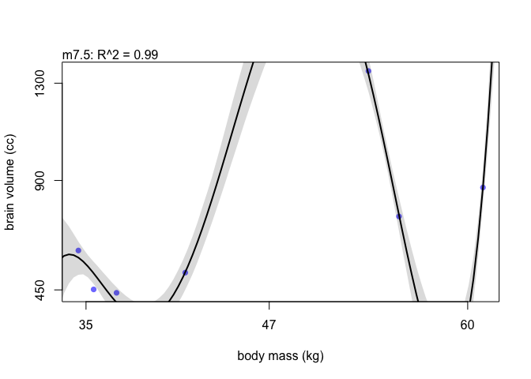

Chapter7
================

``` r
library(rethinking)
```

    ## Loading required package: rstan

    ## Loading required package: StanHeaders

    ## Loading required package: ggplot2

    ## rstan (Version 2.21.2, GitRev: 2e1f913d3ca3)

    ## For execution on a local, multicore CPU with excess RAM we recommend calling
    ## options(mc.cores = parallel::detectCores()).
    ## To avoid recompilation of unchanged Stan programs, we recommend calling
    ## rstan_options(auto_write = TRUE)

    ## Loading required package: parallel

    ## rethinking (Version 2.13)

    ## 
    ## Attaching package: 'rethinking'

    ## The following object is masked from 'package:stats':
    ## 
    ##     rstudent

``` r
library(tidyverse)
```

    ## ── Attaching packages ─────────────────────────────────────── tidyverse 1.3.1 ──

    ## ✓ tibble  3.1.3     ✓ dplyr   1.0.7
    ## ✓ tidyr   1.1.3     ✓ stringr 1.4.0
    ## ✓ readr   2.0.1     ✓ forcats 0.5.1
    ## ✓ purrr   0.3.4

    ## ── Conflicts ────────────────────────────────────────── tidyverse_conflicts() ──
    ## x tidyr::extract() masks rstan::extract()
    ## x dplyr::filter()  masks stats::filter()
    ## x dplyr::lag()     masks stats::lag()
    ## x purrr::map()     masks rethinking::map()

``` r
sppnames <- c("afarensis", "africanus", "habilis",
              "boisei", "rudolfensis", "ergaster", "sapiens")

brainvolcc <- c(438, 452, 612, 521, 752, 871, 1350)

masskg <- c(37.0, 35.5, 34.5, 41.5, 55.5, 61.0, 53.5)

d <- data.frame(species = sppnames,
                brain = brainvolcc,
                mass = masskg)
```

``` r
ggplot(d, aes(x = mass, y = brain, label = species)) +
         geom_point() +
  geom_text(nudge_x = 2,
            nudge_y = 1) +
  theme_bw() +
  xlab("body mass (kg)") +
  ylab("brain volume (cc)")
```

<!-- -->

``` r
d$mass_std <- (d$mass - mean(d$mass))/sd(d$mass)
d$brain_std <- d$brain/max(d$brain)
```

``` r
m7.1 <- quap(
  alist(
    brain_std ~ dnorm(mu, exp(log_sigma)),
    mu <- a + b * mass_std,
    a ~ dnorm(0, 0.5),
    b ~ dnorm(0, 10),
    log_sigma ~ dnorm(0, 1) # to make the sigma > 0
  ), data = d
)

precis(m7.1)
```

    ##                 mean         sd        5.5%      94.5%
    ## a          0.5188797 0.06830297  0.40971831  0.6280410
    ## b          0.1671092 0.07420997  0.04850738  0.2857111
    ## log_sigma -1.7049495 0.29475211 -2.17602028 -1.2338787

``` r
set.seed(12)
s <- sim(m7.1)
r <- apply(s, 2, mean) - d$brain_std
resid_var <- var2(r)
outcome_var <- var2(d$brain_std)

1 - resid_var/outcome_var
```

    ## [1] 0.4773872

``` r
R2_is_bad <- function(quap_fit) {
  s <- sim(quap_fit, refresh = 0)
  r <- apply(s, 2, mean) - d$brain_std
  resid_var <- var2(r)
  outcome_var <- var2(d$brain_std)
  
  1 - resid_var/outcome_var
}
```

``` r
m7.2 <- quap(
  alist(
    brain_std ~ dnorm(mu, exp(log_sigma)),
    mu <- a + b[1] * mass_std + b[2] * mass_std^2 , 
    a ~ dnorm(0, 0.5),
    b ~ dnorm(0, 10),
    log_sigma ~ dnorm(0, 1)
  ), 
  data = d,
  start = list(b=rep(0, 2)) # this is to specify b as a vector
  
)
```

``` r
m7.3 <- quap(
  alist(
    brain_std ~ dnorm(mu, exp(log_sigma)),
    mu <- a + b[1] * mass_std + b[2] * mass_std^2 + 
      b[3] * mass_std^3 , 
    a ~ dnorm(0, 0.5),
    b ~ dnorm(0, 10),
    log_sigma ~ dnorm(0, 1)
  ), 
  data = d,
  start = list(b=rep(0, 3))
  
)

m7.4 <- quap(
  alist(
    brain_std ~ dnorm(mu, exp(log_sigma)),
    mu <- a + b[1] * mass_std + b[2] * mass_std^2 + 
      b[3] * mass_std^3 + b[4] * mass_std^4, 
    a ~ dnorm(0, 0.5),
    b ~ dnorm(0, 10),
    log_sigma ~ dnorm(0, 1)
  ), 
  data = d,
  start = list(b=rep(0, 4))
  
)

m7.5 <- quap(
  alist(
    brain_std ~ dnorm(mu, exp(log_sigma)),
    mu <- a + b[1] * mass_std + b[2] * mass_std^2 + 
      b[3] * mass_std^3 + b[4] * mass_std^4 +
      b[5] * mass_std^5,
    a ~ dnorm(0, 0.5),
    b ~ dnorm(0, 10),
    log_sigma ~ dnorm(0, 1)
  ), 
  data = d,
  start = list(b=rep(0, 5))
  
)

m7.6 <- quap(
  alist(
    brain_std ~ dnorm(mu, 0.001),
    mu <- a + b[1] * mass_std + b[2] * mass_std^2 + 
      b[3] * mass_std^3 + b[4] * mass_std^4 +
      b[5] * mass_std^5 + b[6] * mass_std^6,
    a ~ dnorm(0, 0.5),
    b ~ dnorm(0, 10)
  ), 
  data = d,
  start = list(b=rep(0, 6))
)
```

``` r
plot_fit <- function(quap_fit) {
  mass_seq <- seq(min(d$mass_std), max(d$mass_std), length.out = 100)
  l <- link(quap_fit, data = list(mass_std = mass_seq))
  mu <- apply(l, 2, mean)
  ci <- apply(l, 2, PI)
  plot(brain_std ~ mass_std, data = d, ylim = c(0,1.2))
  lines(mass_seq, mu)
  shade(ci, mass_seq) 
}

brain_plot(m7.1)
```

<!-- -->

``` r
brain_plot(m7.2)
```

<!-- -->

``` r
brain_plot(m7.3)
```

<!-- -->

``` r
brain_plot(m7.4)
```

<!-- -->

``` r
brain_plot(m7.5)
```

<!-- -->

``` r
brain_plot(m7.6)
```

<!-- -->

``` r
brain_loo_plot(m7.1)
```

<!-- -->

``` r
brain_loo_plot(m7.4)
```

<!-- -->

``` r
set.seed(1)
lppd(m7.1, n=1e4)
```

    ## [1]  0.6213246  0.6536423  0.5324310  0.6372083  0.4851689  0.4516749 -0.9186134

``` r
set.seed(1)

log_prob <- sim(m7.1, ll = TRUE, n = 1e4)
n <- ncol(log_prob)
ns <- nrow(log_prob)

f <- function(i) log_sum_exp(log_prob[,i]) - log(ns)
```

``` r
set.seed(1)
sapply(list(m7.1, m7.2, m7.3, m7.4, m7.5, m7.6), function(m) sum(lppd(m)))
```

    ## [1]  2.468436  2.500066  3.718023  5.097177 14.084746 39.445268
