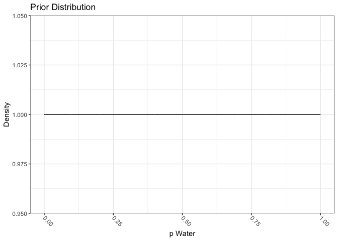
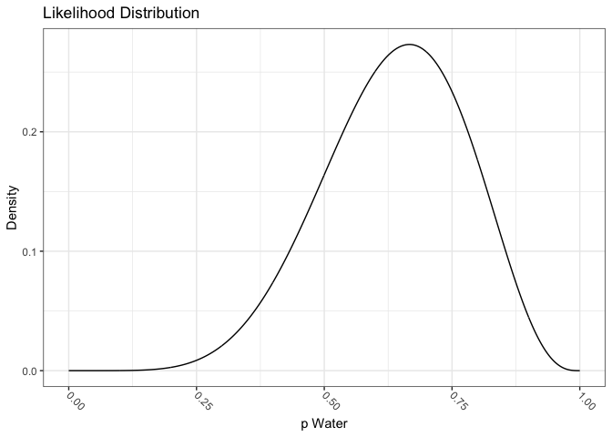
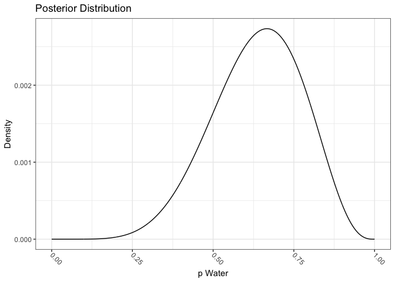
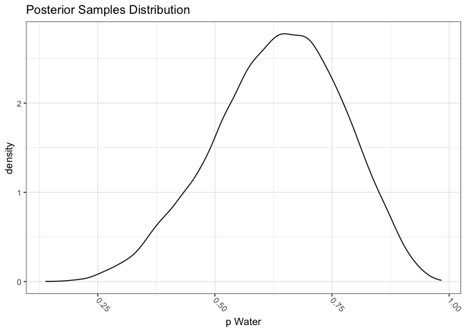
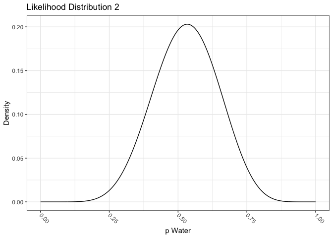
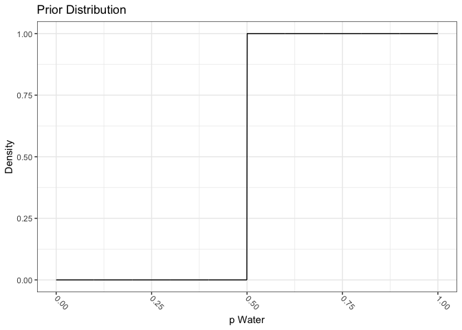
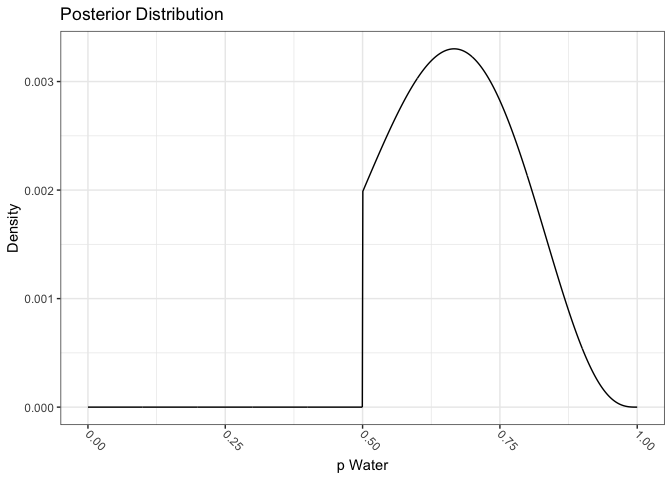
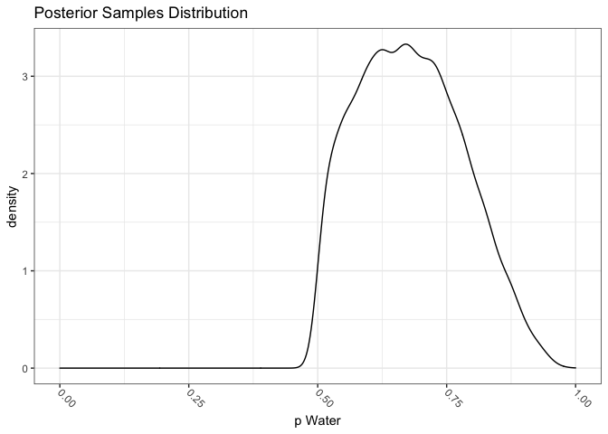
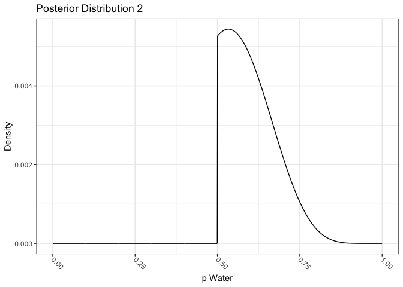

Chapter 3 Excercises
================

Code and solutions for Chapter 3 of the [Statistical Rethinking 2
Ed.](https://xcelab.net/rm/statistical-rethinking/) textbook by R.
McElreath.

``` r
library(rethinking)
```

    ## Loading required package: rstan

    ## Loading required package: StanHeaders

    ## Loading required package: ggplot2

    ## rstan (Version 2.21.2, GitRev: 2e1f913d3ca3)

    ## For execution on a local, multicore CPU with excess RAM we recommend calling
    ## options(mc.cores = parallel::detectCores()).
    ## To avoid recompilation of unchanged Stan programs, we recommend calling
    ## rstan_options(auto_write = TRUE)

    ## Loading required package: parallel

    ## rethinking (Version 2.13)

    ## 
    ## Attaching package: 'rethinking'

    ## The following object is masked from 'package:stats':
    ## 
    ##     rstudent

``` r
library(tidyverse)
```

    ## ── Attaching packages ─────────────────────────────────────── tidyverse 1.3.1 ──

    ## ✓ tibble  3.1.3     ✓ dplyr   1.0.7
    ## ✓ tidyr   1.1.3     ✓ stringr 1.4.0
    ## ✓ readr   2.0.1     ✓ forcats 0.5.1
    ## ✓ purrr   0.3.4

    ## ── Conflicts ────────────────────────────────────────── tidyverse_conflicts() ──
    ## x tidyr::extract() masks rstan::extract()
    ## x dplyr::filter()  masks stats::filter()
    ## x dplyr::lag()     masks stats::lag()
    ## x purrr::map()     masks rethinking::map()

``` r
library(ggthemes)
```

Set the palette and the running theme for ggplot2.

``` r
theme_set(theme_bw())
theme_update(axis.text.x = element_text(
angle = -45,
hjust = 0,
vjust = 0.5
))
```

``` r
p_grid <- seq(from = 0, to = 1, length.out = 1000)
prior <- rep(1, 1000)
likelihood <- dbinom(6, size = 9, prob = p_grid)
posterior <- prior * likelihood
posterior <- posterior / sum(posterior)
```

``` r
tosses <- tibble(p_grid = seq(0, 1, length.out = 1000),
                 prior = rep(1, 1000),
                 likelihood = dbinom(6, size = 9, prob = p_grid)) %>%
  mutate(posterior = prior * likelihood) %>%
  mutate(posterior = posterior /sum(posterior))

glimpse(tosses)
```

    ## Rows: 1,000
    ## Columns: 4
    ## $ p_grid     <dbl> 0.000000000, 0.001001001, 0.002002002, 0.003003003, 0.00400…
    ## $ prior      <dbl> 1, 1, 1, 1, 1, 1, 1, 1, 1, 1, 1, 1, 1, 1, 1, 1, 1, 1, 1, 1,…
    ## $ likelihood <dbl> 0.000000e+00, 8.425225e-17, 5.375951e-15, 6.105137e-14, 3.4…
    ## $ posterior  <dbl> 0.000000e+00, 8.433659e-19, 5.381333e-17, 6.111249e-16, 3.4…

``` r
tosses %>%
  ggplot(aes(x = p_grid, y = prior)) +
  geom_line() +
  labs(x = "p Water",
       y = "Density",
       title = "Prior Distribution") 
```

<!-- -->

``` r
tosses %>%
  ggplot(aes(x = p_grid, y = likelihood)) +
  geom_line() +
  labs(x = "p Water",
       y = "Density",
       title = "Likelihood Distribution") 
```

<!-- -->

``` r
tosses %>%
  ggplot(aes(x = p_grid, y = posterior)) +
  geom_line() +
  labs(x = "p Water",
       y = "Density",
       title = "Posterior Distribution") 
```

<!-- -->

``` r
set.seed(100)

n_samples <- 1e4

p_samples <- tosses %>%
  slice_sample(n = n_samples,
               weight_by = posterior,
               replace = T)

glimpse(p_samples)
```

    ## Rows: 10,000
    ## Columns: 4
    ## $ p_grid     <dbl> 0.7137137, 0.3573574, 0.5985986, 0.7177177, 0.6296296, 0.46…
    ## $ prior      <dbl> 1, 1, 1, 1, 1, 1, 1, 1, 1, 1, 1, 1, 1, 1, 1, 1, 1, 1, 1, 1,…
    ## $ likelihood <dbl> 0.26051046, 0.04643060, 0.24993675, 0.25825703, 0.26588812,…
    ## $ posterior  <dbl> 0.0026077123, 0.0004647707, 0.0025018693, 0.0025851554, 0.0…

``` r
p_samples %>%
  ggplot(aes(p_grid)) +
  geom_density() +
  labs(x = "p Water",
       title = "Posterior Samples Distribution")
```

<!-- -->

### 3E1

``` r
p_samples %>%
  summarise(p_less_point2 = mean(p_grid < 0.2))
```

    ## # A tibble: 1 × 1
    ##   p_less_point2
    ##           <dbl>
    ## 1        0.0004

### 3E2

``` r
p_samples %>%
  summarise(p_less_point8 = mean(p_grid < 0.8))
```

    ## # A tibble: 1 × 1
    ##   p_less_point8
    ##           <dbl>
    ## 1         0.888

### 3E3

``` r
p_samples %>%
  summarise(p_between_point2_point_8 = mean(p_grid > 0.2 & p_grid < 0.8))
```

    ## # A tibble: 1 × 1
    ##   p_between_point2_point_8
    ##                      <dbl>
    ## 1                    0.888

### 3E4

``` r
p_samples %>%
  summarise(p_20_below = quantile(p_grid, 0.2))
```

    ## # A tibble: 1 × 1
    ##   p_20_below
    ##        <dbl>
    ## 1      0.519

### 3E5

``` r
p_samples %>%
  summarise(p_20_above = quantile(p_grid, 0.8))
```

    ## # A tibble: 1 × 1
    ##   p_20_above
    ##        <dbl>
    ## 1      0.756

### 3E6

``` r
p_samples %>%
  summarise(p_hdpi_66 = HPDI(p_grid, 0.66))
```

    ## # A tibble: 2 × 1
    ##   p_hdpi_66
    ##       <dbl>
    ## 1     0.509
    ## 2     0.774

### 3M1

``` r
tosses_2 <- tibble(p_grid = seq(0, 1, length.out = 1000),
                 prior = rep(1, 1000),
                 likelihood = dbinom(8, size = 15, prob = p_grid)) %>%
  mutate(posterior = prior * likelihood) %>%
  mutate(posterior = posterior /sum(posterior))

glimpse(tosses_2)
```

    ## Rows: 1,000
    ## Columns: 4
    ## $ p_grid     <dbl> 0.000000000, 0.001001001, 0.002002002, 0.003003003, 0.00400…
    ## $ prior      <dbl> 1, 1, 1, 1, 1, 1, 1, 1, 1, 1, 1, 1, 1, 1, 1, 1, 1, 1, 1, 1,…
    ## $ likelihood <dbl> 0.000000e+00, 6.441396e-21, 1.637466e-18, 4.167270e-17, 4.1…
    ## $ posterior  <dbl> 0.000000e+00, 1.031655e-22, 2.622568e-20, 6.674306e-19, 6.6…

``` r
tosses_2 %>%
  ggplot(aes(x = p_grid, y = likelihood)) +
  geom_line() +
  labs(x = "p Water",
       y = "Density",
       title = "Likelihood Distribution 2") 
```

<!-- -->

``` r
tosses_2 %>%
  ggplot(aes(x = p_grid, y = posterior)) +
  geom_line() +
  labs(x = "p Water",
       y = "Density",
       title = "Posterior Distribution 2") 
```

<!-- -->

### 3M2

``` r
p_samples_2 <- tosses_2 %>%
  slice_sample(n = n_samples,
               weight_by = posterior,
               replace = T)

glimpse(p_samples_2)
```

    ## Rows: 10,000
    ## Columns: 4
    ## $ p_grid     <dbl> 0.2082082, 0.5945946, 0.5515516, 0.4054054, 0.5955956, 0.69…
    ## $ prior      <dbl> 1, 1, 1, 1, 1, 1, 1, 1, 1, 1, 1, 1, 1, 1, 1, 1, 1, 1, 1, 1,…
    ## $ likelihood <dbl> 0.004434129, 0.180943485, 0.201013450, 0.123370558, 0.18024…
    ## $ posterior  <dbl> 7.101708e-05, 2.897994e-03, 3.219435e-03, 1.975905e-03, 2.8…

``` r
p_samples_2 %>%
  summarise(p_hdpi_90 = HPDI(p_grid, 0.9))
```

    ## # A tibble: 2 × 1
    ##   p_hdpi_90
    ##       <dbl>
    ## 1     0.329
    ## 2     0.717

### 3M3

``` r
p_samples_2 <- p_samples_2 %>%
  mutate(n_water_15 = rbinom(n_samples, 15, p_grid))

glimpse(p_samples_2)
```

    ## Rows: 10,000
    ## Columns: 5
    ## $ p_grid     <dbl> 0.2082082, 0.5945946, 0.5515516, 0.4054054, 0.5955956, 0.69…
    ## $ prior      <dbl> 1, 1, 1, 1, 1, 1, 1, 1, 1, 1, 1, 1, 1, 1, 1, 1, 1, 1, 1, 1,…
    ## $ likelihood <dbl> 0.004434129, 0.180943485, 0.201013450, 0.123370558, 0.18024…
    ## $ posterior  <dbl> 7.101708e-05, 2.897994e-03, 3.219435e-03, 1.975905e-03, 2.8…
    ## $ n_water_15 <int> 3, 13, 6, 8, 7, 10, 3, 7, 9, 8, 6, 8, 8, 12, 8, 6, 9, 11, 8…

``` r
p_samples_2 %>%
  summarise(p_water_8 = mean(n_water_15 == 8))
```

    ## # A tibble: 1 × 1
    ##   p_water_8
    ##       <dbl>
    ## 1     0.144

### 3M4

``` r
p_samples_2 %>%
  mutate(n_water_9 = rbinom(n_samples, 9, p_grid)) %>%
  summarise(p_water_6 = mean(n_water_9 == 6))
```

    ## # A tibble: 1 × 1
    ##   p_water_6
    ##       <dbl>
    ## 1     0.175

## 3M5

``` r
tosses_3 <- tibble(p_grid = seq(0, 1, length.out = 1000),
                   prior = ifelse(p_grid < 0.5, 0, 1),
                   likelihood = dbinom(6, size = 9, prob = p_grid)) %>%
  mutate(posterior = prior * likelihood) %>%
  mutate(posterior = posterior /sum(posterior))

glimpse(tosses_3)
```

    ## Rows: 1,000
    ## Columns: 4
    ## $ p_grid     <dbl> 0.000000000, 0.001001001, 0.002002002, 0.003003003, 0.00400…
    ## $ prior      <dbl> 0, 0, 0, 0, 0, 0, 0, 0, 0, 0, 0, 0, 0, 0, 0, 0, 0, 0, 0, 0,…
    ## $ likelihood <dbl> 0.000000e+00, 8.425225e-17, 5.375951e-15, 6.105137e-14, 3.4…
    ## $ posterior  <dbl> 0, 0, 0, 0, 0, 0, 0, 0, 0, 0, 0, 0, 0, 0, 0, 0, 0, 0, 0, 0,…

``` r
tosses_3 %>%
  ggplot(aes(x = p_grid, y = prior)) +
  geom_line() +
  labs(x = "p Water",
       y = "Density",
       title = "Prior Distribution") 
```

<!-- -->

``` r
tosses_3 %>%
  ggplot(aes(x = p_grid, y = likelihood)) +
  geom_line() +
  labs(x = "p Water",
       y = "Density",
       title = "Likelihood Distribution") 
```

<!-- -->

``` r
tosses_3 %>%
  ggplot(aes(x = p_grid, y = posterior)) +
  geom_line() +
  labs(x = "p Water",
       y = "Density",
       title = "Posterior Distribution") 
```

<!-- -->

``` r
set.seed(100)

p_samples_3 <- tosses_3 %>%
  slice_sample(n = n_samples,
               weight_by = posterior,
               replace = T)

glimpse(p_samples_3)
```

    ## Rows: 10,000
    ## Columns: 4
    ## $ p_grid     <dbl> 0.5635636, 0.6836837, 0.6076076, 0.5655656, 0.6286286, 0.64…
    ## $ prior      <dbl> 1, 1, 1, 1, 1, 1, 1, 1, 1, 1, 1, 1, 1, 1, 1, 1, 1, 1, 1, 1,…
    ## $ likelihood <dbl> 0.2237174, 0.2715035, 0.2553761, 0.2253978, 0.2655030, 0.27…
    ## $ posterior  <dbl> 0.0027041958, 0.0032818125, 0.0030868721, 0.0027245085, 0.0…

``` r
p_samples_3 %>%
  ggplot(aes(p_grid)) +
  geom_density() +
  scale_x_continuous(lim = c(0,1)) +
  labs(x = "p Water",
       title = "Posterior Samples Distribution")
```

<!-- -->

### 3E1-bis

``` r
p_samples_3 %>%
  summarise(p_less_point2 = mean(p_grid < 0.2))
```

    ## # A tibble: 1 × 1
    ##   p_less_point2
    ##           <dbl>
    ## 1             0

### 3E2-bis

``` r
p_samples_3 %>%
  summarise(p_less_point8 = mean(p_grid < 0.8))
```

    ## # A tibble: 1 × 1
    ##   p_less_point8
    ##           <dbl>
    ## 1         0.863

### 3E3-bis

``` r
p_samples_3 %>%
  summarise(p_between_point2_point_8 = mean(p_grid > 0.2 & p_grid < 0.8))
```

    ## # A tibble: 1 × 1
    ##   p_between_point2_point_8
    ##                      <dbl>
    ## 1                    0.863

### 3E4-bis

``` r
p_samples_3 %>%
  summarise(p_20_below = quantile(p_grid, 0.2))
```

    ## # A tibble: 1 × 1
    ##   p_20_below
    ##        <dbl>
    ## 1      0.582

### 3E5-bis

``` r
p_samples_3 %>%
  summarise(p_20_above = quantile(p_grid, 0.8))
```

    ## # A tibble: 1 × 1
    ##   p_20_above
    ##        <dbl>
    ## 1      0.773

### 3E6-bis

``` r
p_samples_3 %>%
  summarise(p_hdpi_66 = HPDI(p_grid, 0.66))
```

    ## # A tibble: 2 × 1
    ##   p_hdpi_66
    ##       <dbl>
    ## 1     0.539
    ## 2     0.751

### 3M1 - bis

``` r
tosses_4 <- tibble(p_grid = seq(0, 1, length.out = 1000),
                   prior = ifelse(p_grid < 0.5, 0, 1),
                   likelihood = dbinom(8, size = 15, prob = p_grid)) %>%
  mutate(posterior = prior * likelihood) %>%
  mutate(posterior = posterior /sum(posterior))

glimpse(tosses_4)
```

    ## Rows: 1,000
    ## Columns: 4
    ## $ p_grid     <dbl> 0.000000000, 0.001001001, 0.002002002, 0.003003003, 0.00400…
    ## $ prior      <dbl> 0, 0, 0, 0, 0, 0, 0, 0, 0, 0, 0, 0, 0, 0, 0, 0, 0, 0, 0, 0,…
    ## $ likelihood <dbl> 0.000000e+00, 6.441396e-21, 1.637466e-18, 4.167270e-17, 4.1…
    ## $ posterior  <dbl> 0, 0, 0, 0, 0, 0, 0, 0, 0, 0, 0, 0, 0, 0, 0, 0, 0, 0, 0, 0,…

``` r
tosses_4 %>%
  ggplot(aes(x = p_grid, y = likelihood)) +
  geom_line() +
  labs(x = "p Water",
       y = "Density",
       title = "Likelihood Distribution 2") 
```

<!-- -->

``` r
tosses_4 %>%
  ggplot(aes(x = p_grid, y = posterior)) +
  geom_line() +
  labs(x = "p Water",
       y = "Density",
       title = "Posterior Distribution 2") 
```

<!-- -->

### 3M2 - bis

``` r
p_samples_4 <- tosses_4 %>%
  slice_sample(n = n_samples,
               weight_by = posterior,
               replace = T)

glimpse(p_samples_4)
```

    ## Rows: 10,000
    ## Columns: 4
    ## $ p_grid     <dbl> 0.6406406, 0.5945946, 0.5695696, 0.5715716, 0.5955956, 0.73…
    ## $ prior      <dbl> 1, 1, 1, 1, 1, 1, 1, 1, 1, 1, 1, 1, 1, 1, 1, 1, 1, 1, 1, 1,…
    ## $ likelihood <dbl> 0.14130813, 0.18094348, 0.19509384, 0.19420548, 0.18024844,…
    ## $ posterior  <dbl> 0.0037833985, 0.0048445995, 0.0052234625, 0.0051996775, 0.0…

``` r
p_samples_4 %>%
  summarise(p_hdpi_90 = HPDI(p_grid, 0.9))
```

    ## # A tibble: 2 × 1
    ##   p_hdpi_90
    ##       <dbl>
    ## 1     0.501
    ## 2     0.714

### 3M3 - bis

``` r
p_samples_4 <- p_samples_4 %>%
  mutate(n_water_15 = rbinom(n_samples, 15, p_grid))

glimpse(p_samples_4)
```

    ## Rows: 10,000
    ## Columns: 5
    ## $ p_grid     <dbl> 0.6406406, 0.5945946, 0.5695696, 0.5715716, 0.5955956, 0.73…
    ## $ prior      <dbl> 1, 1, 1, 1, 1, 1, 1, 1, 1, 1, 1, 1, 1, 1, 1, 1, 1, 1, 1, 1,…
    ## $ likelihood <dbl> 0.14130813, 0.18094348, 0.19509384, 0.19420548, 0.18024844,…
    ## $ posterior  <dbl> 0.0037833985, 0.0048445995, 0.0052234625, 0.0051996775, 0.0…
    ## $ n_water_15 <int> 9, 13, 7, 6, 7, 10, 12, 7, 9, 8, 9, 9, 7, 12, 9, 7, 9, 11, …

``` r
p_samples_4 %>%
  summarise(p_water_8 = mean(n_water_15 == 8))
```

    ## # A tibble: 1 × 1
    ##   p_water_8
    ##       <dbl>
    ## 1     0.157

### 3M4 - bis

``` r
p_samples_4 %>%
  mutate(n_water_9 = rbinom(n_samples, 9, p_grid)) %>%
  summarise(p_water_6 = mean(n_water_9 == 6))
```

    ## # A tibble: 1 × 1
    ##   p_water_6
    ##       <dbl>
    ## 1     0.228

Document the information about the analysis session

``` r
sessionInfo()
```

    ## R version 4.1.1 (2021-08-10)
    ## Platform: x86_64-apple-darwin17.0 (64-bit)
    ## Running under: macOS Big Sur 10.16
    ## 
    ## Matrix products: default
    ## BLAS:   /Library/Frameworks/R.framework/Versions/4.1/Resources/lib/libRblas.0.dylib
    ## LAPACK: /Library/Frameworks/R.framework/Versions/4.1/Resources/lib/libRlapack.dylib
    ## 
    ## locale:
    ## [1] en_US.UTF-8/en_US.UTF-8/en_US.UTF-8/C/en_US.UTF-8/en_US.UTF-8
    ## 
    ## attached base packages:
    ## [1] parallel  stats     graphics  grDevices utils     datasets  methods  
    ## [8] base     
    ## 
    ## other attached packages:
    ##  [1] ggthemes_4.2.4       forcats_0.5.1        stringr_1.4.0       
    ##  [4] dplyr_1.0.7          purrr_0.3.4          readr_2.0.1         
    ##  [7] tidyr_1.1.3          tibble_3.1.3         tidyverse_1.3.1     
    ## [10] rethinking_2.13      rstan_2.21.2         ggplot2_3.3.5       
    ## [13] StanHeaders_2.21.0-7
    ## 
    ## loaded via a namespace (and not attached):
    ##  [1] httr_1.4.2         jsonlite_1.7.2     modelr_0.1.8       RcppParallel_5.1.4
    ##  [5] assertthat_0.2.1   highr_0.9          stats4_4.1.1       cellranger_1.1.0  
    ##  [9] yaml_2.2.1         pillar_1.6.2       backports_1.2.1    lattice_0.20-44   
    ## [13] glue_1.4.2         digest_0.6.27      rvest_1.0.1        colorspace_2.0-2  
    ## [17] htmltools_0.5.1.1  pkgconfig_2.0.3    broom_0.7.9        haven_2.4.3       
    ## [21] mvtnorm_1.1-2      scales_1.1.1       processx_3.5.2     tzdb_0.1.2        
    ## [25] farver_2.1.0       generics_0.1.0     ellipsis_0.3.2     withr_2.4.2       
    ## [29] cli_3.0.1          magrittr_2.0.1     crayon_1.4.1       readxl_1.3.1      
    ## [33] evaluate_0.14      ps_1.6.0           fs_1.5.0           fansi_0.5.0       
    ## [37] MASS_7.3-54        xml2_1.3.2         pkgbuild_1.2.0     tools_4.1.1       
    ## [41] loo_2.4.1          prettyunits_1.1.1  hms_1.1.0          lifecycle_1.0.0   
    ## [45] matrixStats_0.60.0 V8_3.4.2           munsell_0.5.0      reprex_2.0.1      
    ## [49] callr_3.7.0        compiler_4.1.1     rlang_0.4.11       grid_4.1.1        
    ## [53] rstudioapi_0.13    labeling_0.4.2     rmarkdown_2.10     gtable_0.3.0      
    ## [57] codetools_0.2-18   inline_0.3.19      DBI_1.1.1          curl_4.3.2        
    ## [61] R6_2.5.0           gridExtra_2.3      lubridate_1.7.10   knitr_1.33        
    ## [65] utf8_1.2.2         shape_1.4.6        stringi_1.7.3      Rcpp_1.0.7        
    ## [69] vctrs_0.3.8        dbplyr_2.1.1       tidyselect_1.1.1   xfun_0.25         
    ## [73] coda_0.19-4
