Chapter 4 Excercises
================

Code and solutions for Chapter 4 of the [Statistical Rethinking 2
Ed.](https://xcelab.net/rm/statistical-rethinking/) textbook by R.
McElreath.

``` r
library(rethinking)
```

    ## Loading required package: rstan

    ## Loading required package: StanHeaders

    ## Loading required package: ggplot2

    ## rstan (Version 2.21.2, GitRev: 2e1f913d3ca3)

    ## For execution on a local, multicore CPU with excess RAM we recommend calling
    ## options(mc.cores = parallel::detectCores()).
    ## To avoid recompilation of unchanged Stan programs, we recommend calling
    ## rstan_options(auto_write = TRUE)

    ## Loading required package: parallel

    ## rethinking (Version 2.13)

    ## 
    ## Attaching package: 'rethinking'

    ## The following object is masked from 'package:stats':
    ## 
    ##     rstudent

``` r
library(tidyverse)
```

    ## ── Attaching packages ─────────────────────────────────────── tidyverse 1.3.1 ──

    ## ✓ tibble  3.1.3     ✓ dplyr   1.0.7
    ## ✓ tidyr   1.1.3     ✓ stringr 1.4.0
    ## ✓ readr   2.0.1     ✓ forcats 0.5.1
    ## ✓ purrr   0.3.4

    ## ── Conflicts ────────────────────────────────────────── tidyverse_conflicts() ──
    ## x tidyr::extract() masks rstan::extract()
    ## x dplyr::filter()  masks stats::filter()
    ## x dplyr::lag()     masks stats::lag()
    ## x purrr::map()     masks rethinking::map()

``` r
library(ggthemes)
```

Set the palette and the running theme for ggplot2.

``` r
theme_set(theme_bw())
theme_update(axis.text.x = element_text(
angle = -45,
hjust = 0,
vjust = 0.5
))
```

## Easy

### 4E1

Line 1

### 4E2

2

### 4E3

Pr(mu, sigma\|h) = Product-i(Normal(h-i\|mu, sigma)\*Normal(mu\| 0,
10)\*Exponential(sigma\| 1)) \\ Integral Integral
Product-i(Normal(h-i\|mu, sigma)\*Normal(mu\| 0,
10)\*Exponential(sigma\| 1)) dmu dgamma

### 4E4

Line 2

### 4E5

3

## Medium

### 4M1

``` r
set.seed(42)

n_samples <- 1e4

ex4M1 <- tibble(
  mu = rnorm(n_samples, 0, 10),
  sigma = rexp(n_samples, 1)
) %>%
  mutate(y = rnorm(n_samples, mu, sigma))

glimpse(ex4M1)
```

    ## Rows: 10,000
    ## Columns: 3
    ## $ mu    <dbl> 13.7095845, -5.6469817, 3.6312841, 6.3286260, 4.0426832, -1.0612…
    ## $ sigma <dbl> 0.29428439, 0.26763543, 1.07316088, 1.93306396, 0.52182603, 0.72…
    ## $ y     <dbl> 13.6839959, -5.6557772, 2.2124824, 6.5303356, 5.2047443, -2.6241…

``` r
ex4M1 %>%
  ggplot(aes(x = y)) +
  geom_density()
```

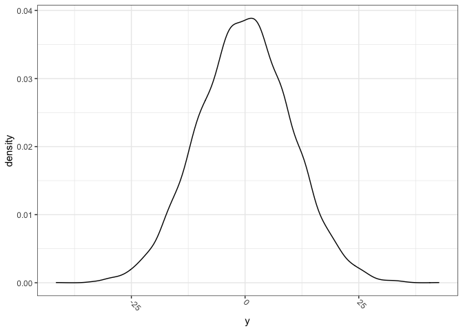<!-- -->

### 4M2

``` r
ex4M2_formula <- alist(
  y ~ dnorm(mu, sigma),
  mu ~ dnorm(0, 10),
  sigma ~ dexp(1)
)
```

### 4M3

y-i \~ Normal(mu-i, sigma)

mu-i = a + b \* w-i

a \~ Normal(0, 10)

b \~ Uniform(0, 1)

sigma \~ Exponential(1)

### 4M4

height-i \~ Normal(mu-i, sigma)

mu-i = a + b \* year-i

a = Normal(178, 20)

b = Log-Normal(0, 1)

sigma = Uniform(0, 50)

### 4M5

Same as 4M4

### 4M6

height-i \~ Normal(mu-i, sigma)

mu-i = a + b \* year-i

a = Normal(178, 20)

b = Log-Normal(0, 1)

sigma = Uniform(0, 10)

### 4M7

``` r
data(Howell1)
d <- tibble(Howell1)

d2 <- d %>%
  filter(age >= 18) %>%
  mutate(weight_centered = weight - mean(weight))

m4.3 <- quap(
  alist(
    height ~ dnorm(mu, sigma),
    mu <- a + b* weight_centered,
    a ~ dnorm(178, 20),
    b ~ dlnorm(0, 1),
    sigma ~ dunif(0,50)), 
  data = d2)

m4.3bis <- quap(
  alist(
    height ~ dnorm(mu, sigma),
    mu <- a + b* weight,
    a ~ dnorm(178, 20),
    b ~ dlnorm(0, 1),
    sigma ~ dunif(0,50)),
  data = d2)
```

``` r
precis(m4.3)
```

    ##              mean         sd        5.5%       94.5%
    ## a     154.6018820 0.27032596 154.1698489 155.0339151
    ## b       0.9032777 0.04192646   0.8362711   0.9702843
    ## sigma   5.0722235 0.19118707   4.7666696   5.3777773

``` r
round(vcov(m4.3), 3)
```

    ##           a     b sigma
    ## a     0.073 0.000 0.000
    ## b     0.000 0.002 0.000
    ## sigma 0.000 0.000 0.037

``` r
precis(m4.3bis)
```

    ##              mean         sd        5.5%       94.5%
    ## a     114.5341918 1.89775429 111.5012139 117.5671697
    ## b       0.8907349 0.04175814   0.8239973   0.9574724
    ## sigma   5.0727384 0.19125078   4.7670827   5.3783941

``` r
round(vcov(m4.3bis), 3)
```

    ##            a      b sigma
    ## a      3.601 -0.078 0.009
    ## b     -0.078  0.002 0.000
    ## sigma  0.009  0.000 0.037

``` r
n_samples <- 1e4
n_grid <- 100

samples_4_3 <- tibble(extract.samples(m4.3, n_samples)) 
samples_4_3b <- tibble(extract.samples(m4.3bis, n_samples))

grid_4_3 <- seq(from = min(d2$weight_centered), 
                to = max(d2$weight_centered), 
                length.out = n_grid)

grid_4_3b <- seq(from = min(d2$weight), 
                 to = max(d2$weight), 
                 length.out = n_grid)

params_mean_4_3 <- samples_4_3 %>%
  summarise(across(everything(), mean))

params_mean_4_3b <- samples_4_3b %>%
  summarise(across(everything(), mean))
```

``` r
d2 %>%
  ggplot(aes(x = weight_centered, y = height)) +
  geom_point(shape = 21,
             color = "navyblue") +
  geom_abline(data = params_mean_4_3,
              aes(slope = b,
                  intercept = a))
```

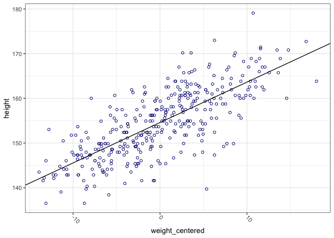<!-- -->

``` r
d2 %>%
  ggplot(aes(x = weight, y = height)) +
  geom_point(shape = 21,
             color = "navyblue") +
  geom_abline(data = params_mean_4_3b,
              aes(slope = b,
                  intercept = a)) +
  coord_cartesian(xlim = c(-1, 70), ylim = c(-1, 185))
```

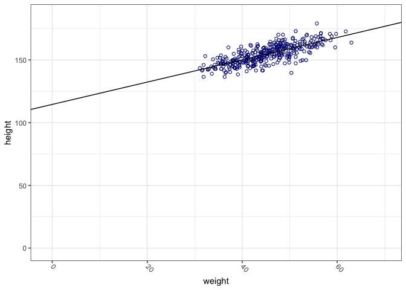<!-- -->

``` r
mu_4_3 <- samples_4_3 %>%
  mutate(mu = map2(a, b, ~ .x + .y * grid_4_3),
         weight_centered = list(grid_4_3)) %>%
  unnest(c("mu", "weight_centered")) %>%
  group_by(weight_centered) %>%
  summarise(mu_mean = mean(mu),
            mu_PI_89 = list(PI(mu))) %>%
  unnest_wider(mu_PI_89)

mu_4_3
```

    ## # A tibble: 100 × 4
    ##    weight_centered mu_mean  `5%` `94%`
    ##              <dbl>   <dbl> <dbl> <dbl>
    ##  1           -13.9    142.  141.  143.
    ##  2           -13.6    142.  141.  143.
    ##  3           -13.3    143.  142.  144.
    ##  4           -13.0    143.  142.  144.
    ##  5           -12.6    143.  142.  144.
    ##  6           -12.3    143.  143.  144.
    ##  7           -12.0    144.  143.  145.
    ##  8           -11.7    144.  143.  145.
    ##  9           -11.3    144.  143.  145.
    ## 10           -11.0    145.  144.  146.
    ## # … with 90 more rows

``` r
mu_4_3 %>%
  ggplot(aes(x = weight_centered,
             y = mu_mean)) +
  geom_line(color = "black") +
  geom_ribbon(aes(ymin = `5%`,
                  ymax = `94%`),
              fill = "grey70",
              alpha = 0.3) +
  geom_point(data = d2,
             aes(x = weight_centered,
                 y = height),
             color = "navyblue",
             shape = 21) +
  labs(x = "Weight - Mean Weight",
       y = "Height")
```

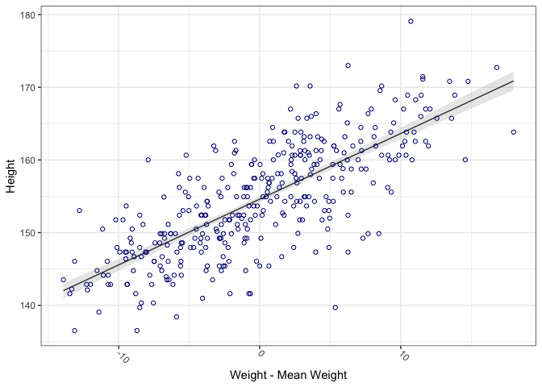<!-- -->

``` r
mu_4_3b <- samples_4_3b %>%
  mutate(mu = map2(a, b, ~ .x + .y * grid_4_3b),
         weight = list(grid_4_3b)) %>%
  unnest(c("mu", "weight")) %>%
  group_by(weight) %>%
  summarise(mu_mean = mean(mu),
            mu_PI_89 = list(PI(mu))) %>%
  unnest_wider(mu_PI_89)

mu_4_3b
```

    ## # A tibble: 100 × 4
    ##    weight mu_mean  `5%` `94%`
    ##     <dbl>   <dbl> <dbl> <dbl>
    ##  1   31.1    142.  141.  143.
    ##  2   31.4    143.  142.  144.
    ##  3   31.7    143.  142.  144.
    ##  4   32.0    143.  142.  144.
    ##  5   32.4    143.  142.  144.
    ##  6   32.7    144.  143.  145.
    ##  7   33.0    144.  143.  145.
    ##  8   33.3    144.  143.  145.
    ##  9   33.7    145.  144.  145.
    ## 10   34.0    145.  144.  146.
    ## # … with 90 more rows

``` r
mu_4_3b %>%
  ggplot(aes(x = weight,
             y = mu_mean)) +
  geom_line(color = "black") +
  geom_ribbon(aes(ymin = `5%`,
                  ymax = `94%`),
              fill = "grey70",
              alpha = 0.3) +
  geom_point(data = d2,
             aes(x = weight,
                 y = height),
             color = "navyblue",
             shape = 21) +
  labs(x = "Weight",
       y = "Height")
```

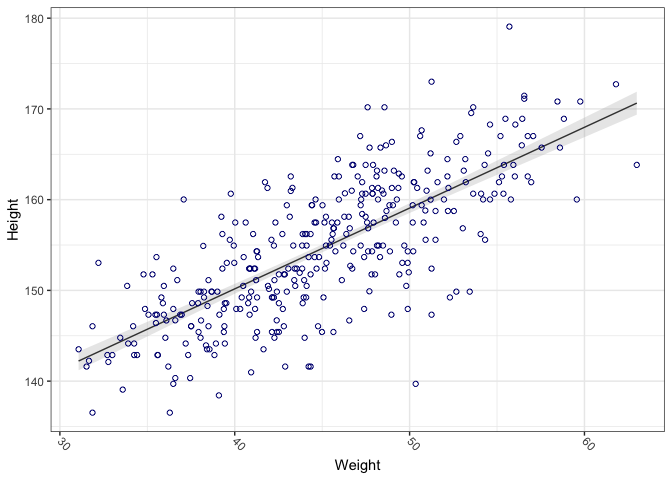<!-- -->

### 4M8

``` r
data("cherry_blossoms")
d <- cherry_blossoms
precis(d)
```

    ##                   mean          sd      5.5%      94.5%       histogram
    ## year       1408.000000 350.8845964 867.77000 1948.23000   ▇▇▇▇▇▇▇▇▇▇▇▇▁
    ## doy         104.540508   6.4070362  94.43000  115.00000        ▁▂▅▇▇▃▁▁
    ## temp          6.141886   0.6636479   5.15000    7.29470        ▁▃▅▇▃▂▁▁
    ## temp_upper    7.185151   0.9929206   5.89765    8.90235 ▁▂▅▇▇▅▂▂▁▁▁▁▁▁▁
    ## temp_lower    5.098941   0.8503496   3.78765    6.37000 ▁▁▁▁▁▁▁▃▅▇▃▂▁▁▁

``` r
d2 <- d[complete.cases(d$doy),]
num_knots <- 15
knot_list <- quantile(d2$year, 
                      probs = seq(0, 1, length.out = num_knots))
```

``` r
library(splines)
B <- bs(d2$year,
        knots = knot_list[-c(1, num_knots)],
        degree = 3,
        intercept = TRUE)

str(B)
```

    ##  'bs' num [1:827, 1:17] 1 0.96 0.767 0.563 0.545 ...
    ##  - attr(*, "dimnames")=List of 2
    ##   ..$ : NULL
    ##   ..$ : chr [1:17] "1" "2" "3" "4" ...
    ##  - attr(*, "degree")= int 3
    ##  - attr(*, "knots")= Named num [1:13] 1036 1174 1269 1377 1454 ...
    ##   ..- attr(*, "names")= chr [1:13] "7.142857%" "14.28571%" "21.42857%" "28.57143%" ...
    ##  - attr(*, "Boundary.knots")= int [1:2] 812 2015
    ##  - attr(*, "intercept")= logi TRUE

``` r
m4.7 <- quap(
  alist(
    D ~ dnorm(mu, sigma),
    mu <- a + B %*% w,
    a ~ dnorm(100, 10),
    w ~ dnorm(0,2),
    sigma ~ dexp(1)
  ), 
  data = list(D = d2$doy, B = B),
  start = list(w = rep(0, ncol(B)))
)
```

``` r
post <- extract.samples(m4.7)
precis(post, depth = 2)
```

    ##              mean        sd        5.5%       94.5%      histogram
    ## a     103.8596658 0.5433430 102.9897199 104.7346295     ▁▁▁▃▇▅▂▁▁▁
    ## sigma   5.9397246 0.1476746   5.7029595   6.1783664   ▁▁▁▃▇▇▅▂▁▁▁▁
    ## w[1]   -1.3154016 1.6786415  -3.9899335   1.3379156 ▁▁▁▁▃▅▇▇▃▂▁▁▁▁
    ## w[2]   -1.4661625 1.5694006  -3.9724322   1.0352149  ▁▁▁▁▃▇▇▇▃▁▁▁▁
    ## w[3]   -0.2032329 1.5071438  -2.6173761   2.2029279   ▁▁▁▂▅▇▇▃▂▁▁▁
    ## w[4]    2.5414788 1.1855263   0.6393004   4.4560277      ▁▁▂▅▇▅▂▁▁
    ## w[5]    0.4828156 1.2347087  -1.4772198   2.4744853    ▁▁▁▂▅▇▅▂▁▁▁
    ## w[6]    1.0152023 1.2868580  -1.0478919   3.0729762     ▁▁▁▃▇▇▃▁▁▁
    ## w[7]   -2.5862195 1.2214097  -4.5342532  -0.6316053     ▁▁▁▂▅▇▅▂▁▁
    ## w[8]    4.0704904 1.2060234   2.1322285   5.9849424   ▁▁▁▁▃▇▇▃▁▁▁▁
    ## w[9]    0.3403781 1.2706102  -1.6893277   2.3651984    ▁▁▁▂▇▇▅▂▁▁▁
    ## w[10]   1.7654467 1.2796850  -0.2960436   3.7863244     ▁▁▂▅▇▇▃▁▁▁
    ## w[11]   3.0170059 1.2487065   1.0386183   5.0358787     ▁▁▁▃▇▇▃▁▁▁
    ## w[12]   0.5578369 1.2501121  -1.4427761   2.5283057    ▁▁▁▂▅▇▅▂▁▁▁
    ## w[13]   3.2658955 1.2652715   1.2786743   5.3027765     ▁▁▁▃▇▇▅▂▁▁
    ## w[14]   0.9324866 1.2818136  -1.1098966   2.9648635   ▁▁▁▁▃▇▇▃▁▁▁▁
    ## w[15]  -2.0558482 1.4080485  -4.3337337   0.2017741   ▁▁▁▂▅▇▇▃▂▁▁▁
    ## w[16]  -5.1410941 1.4743632  -7.4882046  -2.7685824   ▁▁▁▂▅▇▇▃▂▁▁▁
    ## w[17]  -4.9134680 1.5006038  -7.3449007  -2.5271444  ▁▁▁▂▅▇▇▅▂▁▁▁▁

``` r
str(post)
```

    ## List of 3
    ##  $ a    : num [1:10000] 104 104 104 104 104 ...
    ##  $ sigma: num [1:10000] 5.72 5.63 5.99 5.9 6.02 ...
    ##  $ w    : num [1:10000, 1:17] -1.452 -2.387 -0.79 -0.578 -2.658 ...
    ##  - attr(*, "source")= chr "quap posterior: 10000 samples from m4.7"

``` r
w <- apply(post$w, 2, mean)
plot(NULL, xlim = range(d2$year), ylim = c(-6,6),
     xlab = "year", ylab = "basis * weight")
for(i in 1:ncol(B)){
  lines(d2$year, w[i]*B[,i])
}
```

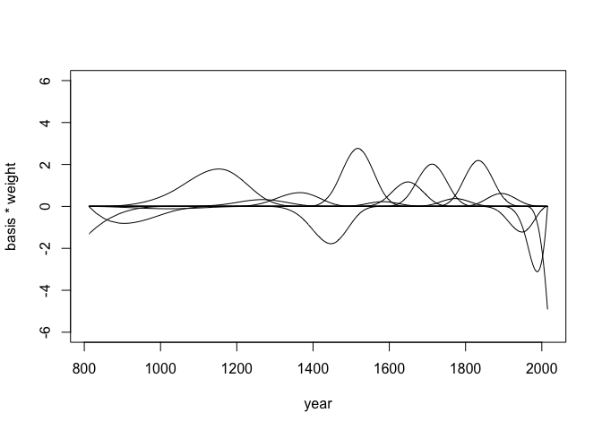<!-- -->

``` r
mu <- link(m4.7)
mu_PI <- apply(mu, 2, PI, 0.97)

plot(d2$year, 
     d2$doy, 
     col = col.alpha(rangi2, 0.3),
     pch = 16)
shade(mu_PI, 
      d2$year,
      col = col.alpha("black", 0.5))
```

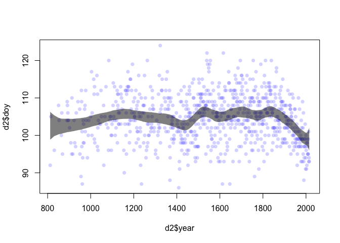<!-- -->

## Hard

### 3H1

``` r
d <- tibble(Howell1)

d2 <- d %>%
  filter(age >= 18)

weight_mean <-   mean(d2$weight)

test <- tibble(individual = 1:5,
       weight = c(46.95, 43.72, 64.78, 32.59, 54.63)) %>%
  mutate(weight_centered = weight - weight_mean)

test
```

    ## # A tibble: 5 × 3
    ##   individual weight weight_centered
    ##        <int>  <dbl>           <dbl>
    ## 1          1   47.0            1.96
    ## 2          2   43.7           -1.27
    ## 3          3   64.8           19.8 
    ## 4          4   32.6          -12.4 
    ## 5          5   54.6            9.64

``` r
height_4_3 <- samples_4_3 %>%
  mutate(mu = map2(a, b, ~ .x + .y * test$weight_centered),
         weight_centered = list(test$weight_centered)) %>%
  unnest(c("mu", "weight_centered")) %>%
  rowwise() %>%
  mutate(height = rnorm(1, mu, sigma)) %>%
  group_by(weight_centered) %>%
  summarise(height_mean = mean(height),
            height_PI_89 = list(PI(height))) %>%
  unnest_wider(height_PI_89)

height_4_3
```

    ## # A tibble: 5 × 4
    ##   weight_centered height_mean  `5%` `94%`
    ##             <dbl>       <dbl> <dbl> <dbl>
    ## 1          -12.4         143.  135.  152.
    ## 2           -1.27        153.  145.  162.
    ## 3            1.96        156.  148.  165.
    ## 4            9.64        163.  155.  171.
    ## 5           19.8         172.  164.  181.

### 3H2

``` r
d3 <- d %>%
  filter(age < 18) %>%
  mutate(weight_centered = weight - mean(weight))

glimpse(d3)
```

    ## Rows: 192
    ## Columns: 5
    ## $ height          <dbl> 121.920, 105.410, 86.360, 129.540, 109.220, 137.160, 1…
    ## $ weight          <dbl> 19.61785, 13.94795, 10.48931, 23.58678, 15.98912, 27.3…
    ## $ age             <dbl> 12.0, 8.0, 6.5, 13.0, 7.0, 17.0, 16.0, 11.0, 17.0, 8.0…
    ## $ male            <int> 1, 0, 0, 1, 0, 1, 0, 1, 0, 1, 0, 0, 1, 0, 0, 1, 0, 0, …
    ## $ weight_centered <dbl> 1.2036609, -4.4662391, -7.9248781, 5.1725909, -2.42507…

``` r
d3 %>%
  ggplot(aes(x = weight_centered,
             y = height)) +
  geom_point(shape = 21,
             color = "navyblue")
```

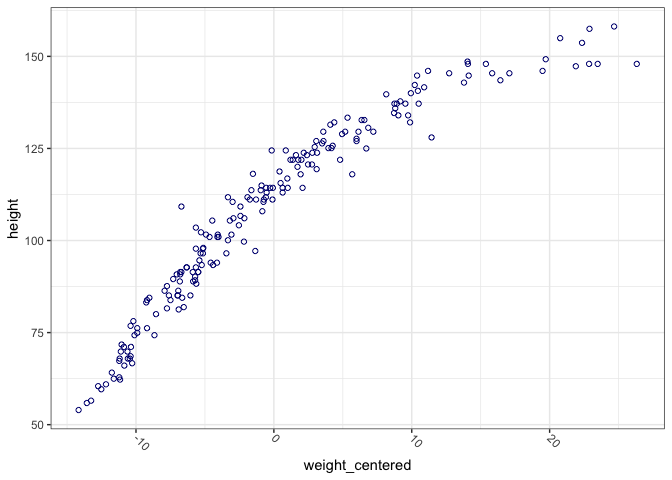<!-- -->

``` r
n_lines <- 100

prior_4H2 <- tibble(
n = 1: n_lines,
a = rnorm(n_lines, 120, 20),
b = rlnorm(n_lines, 0, 0.5)) %>%
  expand(nesting(n, a, b), weight_centered = range(d3$weight_centered)) %>%
  mutate(height = a + b * weight_centered)

prior_4H2
```

    ## # A tibble: 200 × 5
    ##        n     a     b weight_centered height
    ##    <int> <dbl> <dbl>           <dbl>  <dbl>
    ##  1     1  110. 1.20            -14.2   92.6
    ##  2     1  110. 1.20             26.3  141. 
    ##  3     2  134. 0.607           -14.2  126. 
    ##  4     2  134. 0.607            26.3  150. 
    ##  5     3  100. 0.695           -14.2   90.5
    ##  6     3  100. 0.695            26.3  119. 
    ##  7     4  125. 0.605           -14.2  116. 
    ##  8     4  125. 0.605            26.3  141. 
    ##  9     5  115. 1.54            -14.2   92.7
    ## 10     5  115. 1.54             26.3  155. 
    ## # … with 190 more rows

``` r
prior_4H2 %>%
  ggplot(aes(x = weight_centered,
             y = height,
             group = n)) +
  geom_line(alpha = 0.5)
```

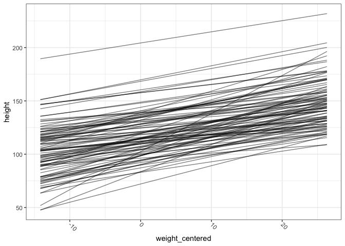<!-- -->

``` r
m4H2 <- quap(
  alist(
    height ~ dnorm(mu, sigma),
    mu <- a + b * weight_centered,
    a ~ dnorm(120, 20),
    b ~ dlnorm(0, 0.5),
    sigma ~ dunif(0,50)
  ),
  data = d3
)
```

``` r
precis(m4H2)
```

    ##             mean         sd       5.5%      94.5%
    ## a     108.329649 0.60864077 107.356924 109.302375
    ## b       2.711505 0.06832246   2.602312   2.820697
    ## sigma   8.437468 0.43060976   7.749270   9.125666

``` r
round(vcov(m4H2), 3)
```

    ##          a     b sigma
    ## a     0.37 0.000 0.000
    ## b     0.00 0.005 0.000
    ## sigma 0.00 0.000 0.185

``` r
grid_4H2 <- seq(from = min(d3$weight_centered), 
                to = max(d3$weight_centered), 
                length.out = n_grid)

samples_4H2 <- tibble(extract.samples(m4H2, n_samples))
```

``` r
mu_4H2 <- samples_4H2 %>%
  mutate(mu = map2(a, b, ~ .x + .y * grid_4H2),
         weight_centered = list(grid_4H2)) %>%
  unnest(c("mu", "weight_centered")) %>%
  group_by(weight_centered) %>%
  summarise(mu_mean = mean(mu),
            mu_PI_89 = list(PI(mu))) %>%
  unnest_wider(mu_PI_89)

mu_4H2
```

    ## # A tibble: 100 × 4
    ##    weight_centered mu_mean  `5%` `94%`
    ##              <dbl>   <dbl> <dbl> <dbl>
    ##  1           -14.2    69.9  68.1  71.8
    ##  2           -13.8    71.0  69.3  72.9
    ##  3           -13.3    72.1  70.4  73.9
    ##  4           -12.9    73.3  71.5  75.0
    ##  5           -12.5    74.4  72.7  76.1
    ##  6           -12.1    75.5  73.8  77.1
    ##  7           -11.7    76.6  75.0  78.2
    ##  8           -11.3    77.7  76.1  79.3
    ##  9           -10.9    78.8  77.3  80.4
    ## 10           -10.5    79.9  78.4  81.4
    ## # … with 90 more rows

``` r
mu_4H2 %>%
  ggplot(aes(x = weight_centered,
             y = mu_mean)) +
  geom_line(color = "black") +
  geom_ribbon(aes(ymin = `5%`,
                  ymax = `94%`),
              fill = "grey70",
              alpha = 0.3) +
  geom_point(data = d3,
             aes(x = weight_centered,
                 y = height),
             color = "navyblue",
             shape = 21) +
  labs(x = "Weight - Mean Weight",
       y = "Height")
```

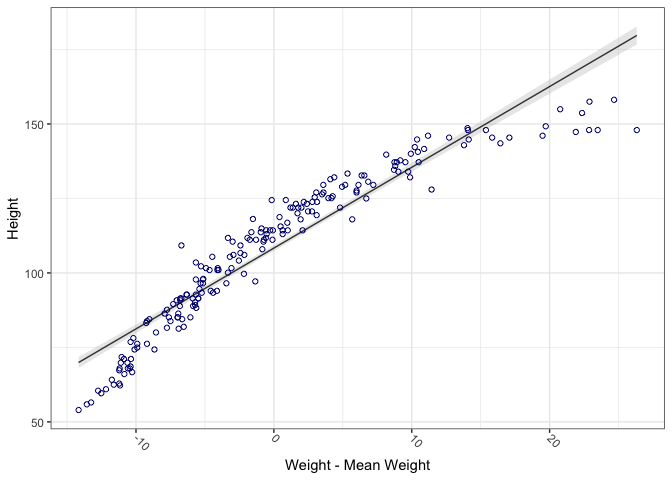<!-- -->

``` r
height_4H2 <- samples_4H2 %>%
  mutate(mu = map2(a, b, ~ .x + .y * grid_4H2),
         weight_centered = list(grid_4H2)) %>%
  unnest(c("mu", "weight_centered")) %>%
  rowwise() %>%
  mutate(height = rnorm(1, mu, sigma)) %>%
  group_by(weight_centered) %>%
  summarise(height_mean = mean(height),
            height_PI_97 = list(PI(height, prob = 0.97))) %>%
  unnest_wider(height_PI_97)

height_4H2
```

    ## # A tibble: 100 × 4
    ##    weight_centered height_mean  `2%` `98%`
    ##              <dbl>       <dbl> <dbl> <dbl>
    ##  1           -14.2        69.9  51.2  88.6
    ##  2           -13.8        71.0  52.7  89.3
    ##  3           -13.3        72.3  53.1  91.1
    ##  4           -12.9        73.1  54.8  91.9
    ##  5           -12.5        74.4  56.0  93.1
    ##  6           -12.1        75.5  56.7  93.6
    ##  7           -11.7        76.7  58.1  95.5
    ##  8           -11.3        77.7  58.9  96.5
    ##  9           -10.9        78.7  60.3  97.0
    ## 10           -10.5        80.0  62.0  98.2
    ## # … with 90 more rows

``` r
height_4H2 %>%
  ggplot(aes(x = weight_centered,
             y = height_mean)) +
  geom_line(color = "black") +
  geom_ribbon(aes(ymin = `2%`,
                  ymax = `98%`),
              fill = "grey70",
              alpha = 0.3) +
  geom_point(data = d3,
             aes(x = weight_centered,
                 y = height),
             color = "navyblue",
             shape = 21) +
  labs(x = "Weight - Mean Weight",
       y = "Height")
```

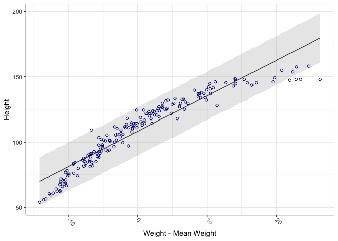<!-- -->

### 3H3

``` r
d <- d %>% 
  mutate(log_weight = log(weight),
         log_weight_centered = log_weight - mean(log_weight))
```

``` r
d %>%
  ggplot(aes(x = log_weight_centered,
             y = height)) +
  geom_point(shape = 21,
             color = "navyblue")
```

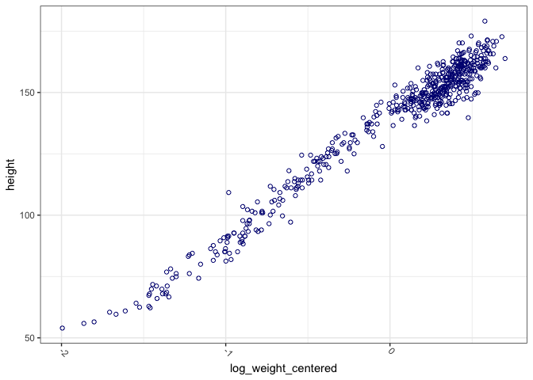<!-- -->

``` r
n_lines <- 100

prior_4H3 <- tibble(
n = 1: n_lines,
a = rnorm(n_lines, 120, 20),
b = rlnorm(n_lines, 0, 1)) %>%
  expand(nesting(n, a, b), log_weight_centered = range(d$log_weight_centered)) %>%
  mutate(height = a + b * log_weight_centered)

prior_4H3
```

    ## # A tibble: 200 × 5
    ##        n     a     b log_weight_centered height
    ##    <int> <dbl> <dbl>               <dbl>  <dbl>
    ##  1     1  125. 0.420              -1.99    124.
    ##  2     1  125. 0.420               0.701   125.
    ##  3     2  128. 2.65               -1.99    122.
    ##  4     2  128. 2.65                0.701   129.
    ##  5     3  146. 0.319              -1.99    145.
    ##  6     3  146. 0.319               0.701   146.
    ##  7     4  112. 1.18               -1.99    110.
    ##  8     4  112. 1.18                0.701   113.
    ##  9     5  120. 0.947              -1.99    118.
    ## 10     5  120. 0.947               0.701   121.
    ## # … with 190 more rows

``` r
prior_4H3 %>%
  ggplot(aes(x = log_weight_centered,
             y = height,
             group = n)) +
  geom_line(alpha = 0.5)
```

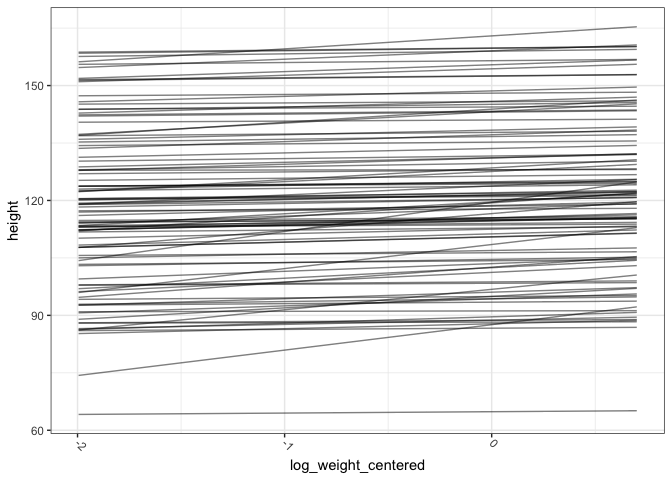<!-- -->

``` r
m4H3 <- quap(
  alist(
    height ~ dnorm(mu, sigma),
    mu <- a + b * log_weight_centered,
    a ~ dnorm(120, 20),
    b ~ dlnorm(0, 1),
    sigma ~ dunif(0,50)
  ),
  data = d
)
```

``` r
precis(m4H3)
```

    ##             mean        sd       5.5%     94.5%
    ## a     138.261388 0.2201356 137.909569 138.61321
    ## b      47.071125 0.3826313  46.459606  47.68264
    ## sigma   5.134711 0.1556690   4.885921   5.38350

``` r
round(vcov(m4H2), 3)
```

    ##          a     b sigma
    ## a     0.37 0.000 0.000
    ## b     0.00 0.005 0.000
    ## sigma 0.00 0.000 0.185

``` r
grid_4H3 <- seq(from = min(d$log_weight_centered), 
                to = max(d$log_weight_centered), 
                length.out = n_grid)

samples_4H3 <- tibble(extract.samples(m4H3, n_samples))
```

``` r
mu_4H3 <- samples_4H3 %>%
  mutate(mu = map2(a, b, ~ .x + .y * grid_4H3),
         log_weight_centered = list(grid_4H3)) %>%
  unnest(c("mu", "log_weight_centered")) %>%
  group_by(log_weight_centered) %>%
  summarise(mu_mean = mean(mu),
            mu_PI_89 = list(PI(mu))) %>%
  unnest_wider(mu_PI_89)

mu_4H3
```

    ## # A tibble: 100 × 4
    ##    log_weight_centered mu_mean  `5%` `94%`
    ##                  <dbl>   <dbl> <dbl> <dbl>
    ##  1               -1.99    44.4  43.1  45.6
    ##  2               -1.97    45.6  44.4  46.9
    ##  3               -1.94    46.9  45.7  48.2
    ##  4               -1.91    48.2  47.0  49.4
    ##  5               -1.89    49.5  48.3  50.7
    ##  6               -1.86    50.8  49.6  52.0
    ##  7               -1.83    52.1  50.9  53.2
    ##  8               -1.80    53.3  52.2  54.5
    ##  9               -1.78    54.6  53.5  55.8
    ## 10               -1.75    55.9  54.8  57.0
    ## # … with 90 more rows

``` r
mu_4H3 %>%
  ggplot(aes(x = log_weight_centered,
             y = mu_mean)) +
  geom_line(color = "black") +
  geom_ribbon(aes(ymin = `5%`,
                  ymax = `94%`),
              fill = "grey70",
              alpha = 0.3) +
  geom_point(data = d,
             aes(x = log_weight_centered,
                 y = height),
             color = "navyblue",
             shape = 21) +
  labs(x = "log(Weight) - Mean log(Weight)",
       y = "Height")
```

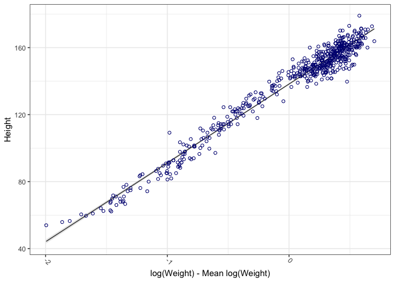<!-- -->

``` r
height_4H3 <- samples_4H3 %>%
  mutate(mu = map2(a, b, ~ .x + .y * grid_4H3),
         log_weight_centered = list(grid_4H3)) %>%
  unnest(c("mu", "log_weight_centered")) %>%
  rowwise() %>%
  mutate(height = rnorm(1, mu, sigma)) %>%
  group_by(log_weight_centered) %>%
  summarise(height_mean = mean(height),
            height_PI_89 = list(PI(height))) %>%
  unnest_wider(height_PI_89)

height_4H3
```

    ## # A tibble: 100 × 4
    ##    log_weight_centered height_mean  `5%` `94%`
    ##                  <dbl>       <dbl> <dbl> <dbl>
    ##  1               -1.99        44.2  35.9  52.5
    ##  2               -1.97        45.7  37.4  54.1
    ##  3               -1.94        46.9  38.6  55.1
    ##  4               -1.91        48.2  39.7  56.5
    ##  5               -1.89        49.5  41.3  57.7
    ##  6               -1.86        50.8  42.6  59.2
    ##  7               -1.83        52.1  43.7  60.4
    ##  8               -1.80        53.3  45.0  61.6
    ##  9               -1.78        54.7  46.6  63.2
    ## 10               -1.75        55.9  47.7  64.0
    ## # … with 90 more rows

``` r
height_4H3 %>%
  ggplot(aes(x = log_weight_centered,
             y = height_mean)) +
  geom_line(color = "black") +
  geom_ribbon(aes(ymin = `5%`,
                  ymax = `94%`),
              fill = "grey70",
              alpha = 0.3) +
  geom_point(data = d,
             aes(x = log_weight_centered,
                 y = height),
             color = "navyblue",
             shape = 21) +
  labs(x = "log(Weight) - Mean log(Weight)",
       y = "Height")
```

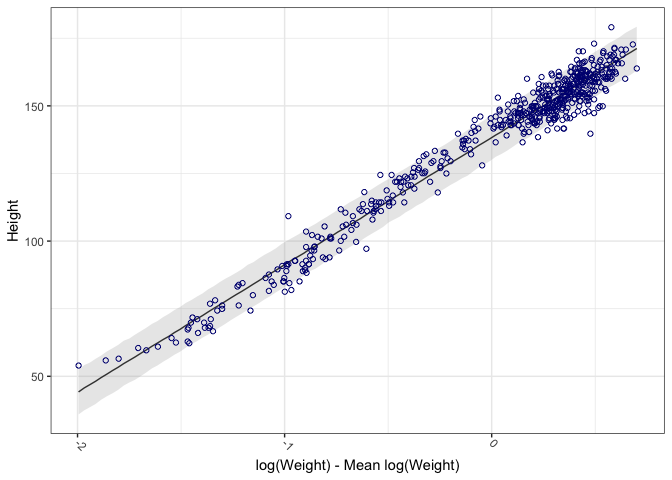<!-- -->

Document the information about the analysis session

``` r
sessionInfo()
```

    ## R version 4.1.1 (2021-08-10)
    ## Platform: x86_64-apple-darwin17.0 (64-bit)
    ## Running under: macOS Big Sur 10.16
    ## 
    ## Matrix products: default
    ## BLAS:   /Library/Frameworks/R.framework/Versions/4.1/Resources/lib/libRblas.0.dylib
    ## LAPACK: /Library/Frameworks/R.framework/Versions/4.1/Resources/lib/libRlapack.dylib
    ## 
    ## locale:
    ## [1] en_US.UTF-8/en_US.UTF-8/en_US.UTF-8/C/en_US.UTF-8/en_US.UTF-8
    ## 
    ## attached base packages:
    ## [1] splines   parallel  stats     graphics  grDevices utils     datasets 
    ## [8] methods   base     
    ## 
    ## other attached packages:
    ##  [1] ggthemes_4.2.4       forcats_0.5.1        stringr_1.4.0       
    ##  [4] dplyr_1.0.7          purrr_0.3.4          readr_2.0.1         
    ##  [7] tidyr_1.1.3          tibble_3.1.3         tidyverse_1.3.1     
    ## [10] rethinking_2.13      rstan_2.21.2         ggplot2_3.3.5       
    ## [13] StanHeaders_2.21.0-7
    ## 
    ## loaded via a namespace (and not attached):
    ##  [1] httr_1.4.2         jsonlite_1.7.2     modelr_0.1.8       RcppParallel_5.1.4
    ##  [5] assertthat_0.2.1   highr_0.9          stats4_4.1.1       cellranger_1.1.0  
    ##  [9] yaml_2.2.1         pillar_1.6.2       backports_1.2.1    lattice_0.20-44   
    ## [13] glue_1.4.2         digest_0.6.27      rvest_1.0.1        colorspace_2.0-2  
    ## [17] htmltools_0.5.1.1  pkgconfig_2.0.3    broom_0.7.9        haven_2.4.3       
    ## [21] mvtnorm_1.1-2      scales_1.1.1       processx_3.5.2     tzdb_0.1.2        
    ## [25] farver_2.1.0       generics_0.1.0     ellipsis_0.3.2     withr_2.4.2       
    ## [29] cli_3.0.1          magrittr_2.0.1     crayon_1.4.1       readxl_1.3.1      
    ## [33] evaluate_0.14      ps_1.6.0           fs_1.5.0           fansi_0.5.0       
    ## [37] MASS_7.3-54        xml2_1.3.2         pkgbuild_1.2.0     tools_4.1.1       
    ## [41] loo_2.4.1          prettyunits_1.1.1  hms_1.1.0          lifecycle_1.0.0   
    ## [45] matrixStats_0.60.0 V8_3.4.2           munsell_0.5.0      reprex_2.0.1      
    ## [49] callr_3.7.0        compiler_4.1.1     rlang_0.4.11       grid_4.1.1        
    ## [53] rstudioapi_0.13    labeling_0.4.2     rmarkdown_2.10     gtable_0.3.0      
    ## [57] codetools_0.2-18   inline_0.3.19      DBI_1.1.1          curl_4.3.2        
    ## [61] R6_2.5.0           gridExtra_2.3      lubridate_1.7.10   knitr_1.33        
    ## [65] utf8_1.2.2         shape_1.4.6        stringi_1.7.3      Rcpp_1.0.7        
    ## [69] vctrs_0.3.8        dbplyr_2.1.1       tidyselect_1.1.1   xfun_0.25         
    ## [73] coda_0.19-4
