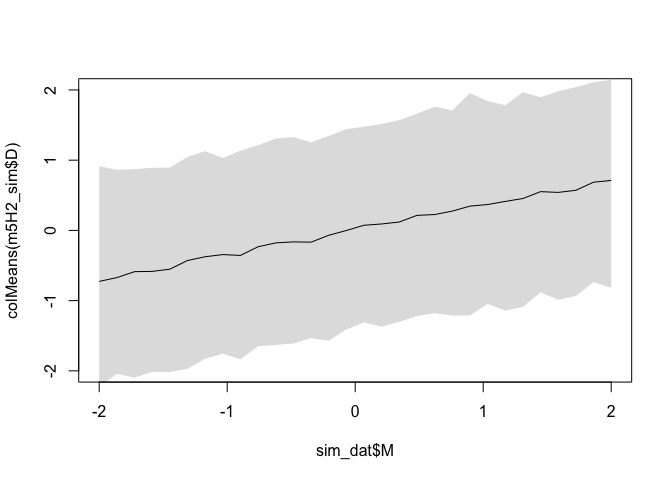

Chapter 5 Excercises
================

Code and solutions for Chapter 5 of the [Statistical Rethinking 2
Ed.](https://xcelab.net/rm/statistical-rethinking/) textbook by R.
McElreath.

``` r
library(rethinking)
```

    ## Loading required package: rstan

    ## Loading required package: StanHeaders

    ## Loading required package: ggplot2

    ## rstan (Version 2.21.2, GitRev: 2e1f913d3ca3)

    ## For execution on a local, multicore CPU with excess RAM we recommend calling
    ## options(mc.cores = parallel::detectCores()).
    ## To avoid recompilation of unchanged Stan programs, we recommend calling
    ## rstan_options(auto_write = TRUE)

    ## Loading required package: parallel

    ## rethinking (Version 2.13)

    ## 
    ## Attaching package: 'rethinking'

    ## The following object is masked from 'package:stats':
    ## 
    ##     rstudent

``` r
library(tidyverse)
```

    ## ── Attaching packages ─────────────────────────────────────── tidyverse 1.3.1 ──

    ## ✓ tibble  3.1.4     ✓ dplyr   1.0.7
    ## ✓ tidyr   1.1.3     ✓ stringr 1.4.0
    ## ✓ readr   2.0.1     ✓ forcats 0.5.1
    ## ✓ purrr   0.3.4

    ## ── Conflicts ────────────────────────────────────────── tidyverse_conflicts() ──
    ## x tidyr::extract() masks rstan::extract()
    ## x dplyr::filter()  masks stats::filter()
    ## x dplyr::lag()     masks stats::lag()
    ## x purrr::map()     masks rethinking::map()

``` r
library(ggthemes)
```

Set the palette and the running theme for ggplot2.

``` r
theme_set(theme_bw())
theme_update(axis.text.x = element_text(
angle = -45,
hjust = 0,
vjust = 0.5
))
```

## Easy

### 5E1

4.  mu\[i\] = A + Bx \* x\[i\] + Bz \* z\[i\]

### 5E2

L\[i\] \~ Normal(mu\[i\], sigma)

mu\[i\] = A + Bd \* animal\_diversity\[i\] + Bd \* plant\_diversity\[i\]

### 5E3

T\[i\] \~ Normal(mu\[i\], sigma)

mu\[i\] = A + Bf \* funding\[i\] + Bs \* size\[i\]

Both Bf and Bd should have a positive value

### 5E4

4.  mu\[i\] = Aa \* a\[i\] + Ab \* b\[i\] + Ac \* c\[i\] + Ad \* d\[i\]
5.  mu\[i\] = Aa \* (1 - b\[i\] - c\[i\] - d\[i\]) + Ab \* b\[i\] +
    Ac \* c\[i\] + Ad \* d\[i\]

In (4) the coefficients represent mean values for the different levels
of the variable: Aa mean value when the variable is A, Ab mean value
when the variable is B, Ac mean value when the variable is C, Ad mean
value when the variable is D.

In (5):

-   If the variable = A, then mu\[i\] = Aa
-   If the variable = B, then mu\[i\] = Aa - Aa + Ab, or mu\[i\] = Ab
-   If the variable = B, then mu\[i\] = Aa - Aa + Ac, or mu\[i\] = Ac
-   If the variable = B, then mu\[i\] = Aa - Aa + Ad, or mu\[i\] = Ad

These are the same coefficients seen in (4).

## Medium

### 5M1

Predictor 1: Maximum wind speed on any given day between October and
April for any Italian city above 100k inhabitants

Predictor 2: Is the city Trieste?

Outcome: Normalized number of buffet restaurants specialized in boiled
pork and sauerkraut for any Italian city above 100k inhabitants

Max wind speed in winter &lt;- Triestiness -&gt; Number of buffet
restaurants

### 5M2

Predictor1: Number of hours worked

Predictor2: Fatigue level

Outcome: Work Output

Total Work Output &lt;- (+) Number of hours worked (+) -&gt; Fatigue
level (-) &gt; Total Work Output

## Hard

### 5H1

``` r
library(rethinking)
library(dagitty)

DMA_dag_3 <- dagitty('dag{M -> A -> D}')
coordinates(DMA_dag_3) <- list(x = c(M = 0, A = 0.5, D = 1), y = c(M = 0, A = 0, D = 0))
drawdag(DMA_dag_3)
```

<!-- -->

``` r
impliedConditionalIndependencies(DMA_dag_3)
```

    ## D _||_ M | A

Yes, the data is consistent with DAG \# 3. A, M and D are all correlated
in the absence of conditioning on A, and D is independent of M,
conditional on A.

### 5H2

``` r
library(tidyverse)

data("WaffleDivorce")
d <- tibble(WaffleDivorce)

d <- d %>%
  select(A = MedianAgeMarriage, 
         D = Divorce, 
         M = Marriage) %>%
  transmute(across(everything(), ~ standardize(.x)))

glimpse(d)
```

    ## Rows: 50
    ## Columns: 3
    ## $ A <dbl> -0.6062895, -0.6866993, -0.2042408, -1.4103870, 0.5998567, -0.284650…
    ## $ D <dbl> 1.6542053, 1.5443643, 0.6107159, 2.0935693, -0.9270579, 1.0500799, -…
    ## $ M <dbl> 0.02264406, 1.54980162, 0.04897436, 1.65512283, -0.26698927, 0.89154…

``` r
m5H2 <- quap(
  alist(
    ## M -> A -> D
    D ~ dnorm(mu, sigma),
    mu <- a + bM * M + bA * A,
    a ~ dnorm(0, 0.2),
    bM ~ dnorm(0, 0.5),
    bA ~ dnorm(0, 0.5),
    sigma ~ dexp(1),
    ## M -> A
    A ~ dnorm(muA, sigmaA),
    muA <- aMA + bMA * M,
    aMA ~ dnorm(0, 0.2),
    bMA ~ dnorm(0, 0.5),
    sigmaA ~ dexp(1)
  ), data = d
)

precis(m5H2)
```

    ##                 mean         sd       5.5%      94.5%
    ## a       2.934403e-05 0.09707742 -0.1551191  0.1551778
    ## bM     -6.535423e-02 0.15077586 -0.3063232  0.1756147
    ## bA     -6.136268e-01 0.15098442 -0.8549290 -0.3723245
    ## sigma   7.851327e-01 0.07784688  0.6607183  0.9095470
    ## aMA     7.342282e-06 0.08684829 -0.1387930  0.1388077
    ## bMA    -6.947199e-01 0.09572770 -0.8477113 -0.5417286
    ## sigmaA  6.817413e-01 0.06758117  0.5737335  0.7897490

``` r
set.seed(2971)

sim_dat <- tibble(M = seq(-2, 2, length.out = 30))

m5H2_sim <- sim(m5H2, data = sim_dat, vars = c("A", "D"))
```

``` r
plot(sim_dat$M, colMeans(m5H2_sim$D), ylim = c(-2, 2), type = "l")
shade(apply(m5H2_sim$D, 2, PI), sim_dat$M)
```

<!-- -->

``` r
plot(sim_dat$M, colMeans(m5H2_sim$A), ylim = c(-2, 2), type = "l")
shade(apply(m5H2_sim$A, 2, PI), sim_dat$M)
```

<!-- -->

Document the information about the analysis session

``` r
sessionInfo()
```

    ## R version 4.1.1 (2021-08-10)
    ## Platform: x86_64-apple-darwin17.0 (64-bit)
    ## Running under: macOS Big Sur 10.16
    ## 
    ## Matrix products: default
    ## BLAS:   /Library/Frameworks/R.framework/Versions/4.1/Resources/lib/libRblas.0.dylib
    ## LAPACK: /Library/Frameworks/R.framework/Versions/4.1/Resources/lib/libRlapack.dylib
    ## 
    ## locale:
    ## [1] en_US.UTF-8/en_US.UTF-8/en_US.UTF-8/C/en_US.UTF-8/en_US.UTF-8
    ## 
    ## attached base packages:
    ## [1] parallel  stats     graphics  grDevices utils     datasets  methods  
    ## [8] base     
    ## 
    ## other attached packages:
    ##  [1] dagitty_0.3-1        ggthemes_4.2.4       forcats_0.5.1       
    ##  [4] stringr_1.4.0        dplyr_1.0.7          purrr_0.3.4         
    ##  [7] readr_2.0.1          tidyr_1.1.3          tibble_3.1.4        
    ## [10] tidyverse_1.3.1      rethinking_2.13      rstan_2.21.2        
    ## [13] ggplot2_3.3.5        StanHeaders_2.21.0-7
    ## 
    ## loaded via a namespace (and not attached):
    ##  [1] httr_1.4.2         jsonlite_1.7.2     modelr_0.1.8       RcppParallel_5.1.4
    ##  [5] assertthat_0.2.1   highr_0.9          stats4_4.1.1       cellranger_1.1.0  
    ##  [9] yaml_2.2.1         pillar_1.6.2       backports_1.2.1    lattice_0.20-44   
    ## [13] glue_1.4.2         digest_0.6.27      rvest_1.0.1        colorspace_2.0-2  
    ## [17] htmltools_0.5.2    pkgconfig_2.0.3    broom_0.7.9        haven_2.4.3       
    ## [21] mvtnorm_1.1-2      scales_1.1.1       processx_3.5.2     tzdb_0.1.2        
    ## [25] generics_0.1.0     ellipsis_0.3.2     withr_2.4.2        cli_3.0.1         
    ## [29] magrittr_2.0.1     crayon_1.4.1       readxl_1.3.1       evaluate_0.14     
    ## [33] ps_1.6.0           fs_1.5.0           fansi_0.5.0        MASS_7.3-54       
    ## [37] xml2_1.3.2         pkgbuild_1.2.0     tools_4.1.1        loo_2.4.1         
    ## [41] prettyunits_1.1.1  hms_1.1.0          lifecycle_1.0.0    matrixStats_0.61.0
    ## [45] V8_3.4.2           munsell_0.5.0      reprex_2.0.1       callr_3.7.0       
    ## [49] compiler_4.1.1     rlang_0.4.11       grid_4.1.1         rstudioapi_0.13   
    ## [53] rmarkdown_2.11     boot_1.3-28        gtable_0.3.0       codetools_0.2-18  
    ## [57] inline_0.3.19      DBI_1.1.1          curl_4.3.2         R6_2.5.1          
    ## [61] gridExtra_2.3      lubridate_1.7.10   knitr_1.34         fastmap_1.1.0     
    ## [65] utf8_1.2.2         shape_1.4.6        stringi_1.7.4      Rcpp_1.0.7        
    ## [69] vctrs_0.3.8        dbplyr_2.1.1       tidyselect_1.1.1   xfun_0.26         
    ## [73] coda_0.19-4
